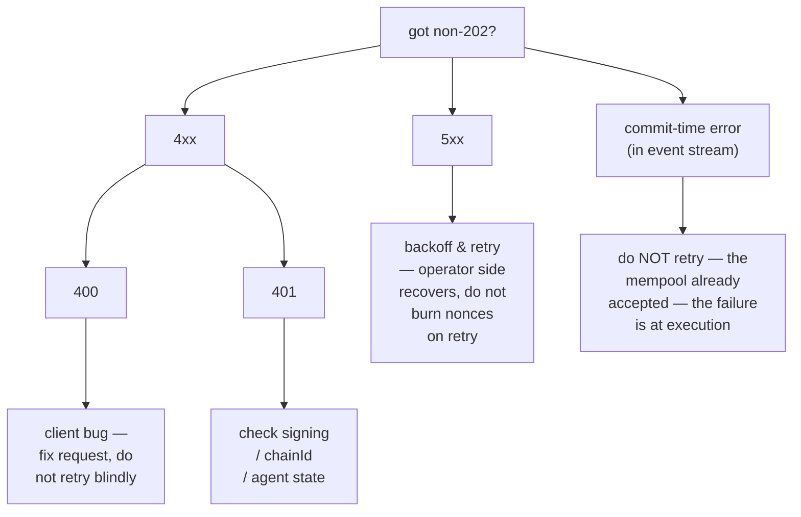

# Error catalog

:::info
**Status.** **stable** for the codes listed. New error strings may be added; existing ones are stable.
:::

A complete enumeration of HTTP status codes, error-string conventions, root causes, and remediation. When in doubt about how to handle a non-`202`, look here first.

## TL;DR

- **2xx** — success. MTF-native endpoints use proper HTTP status codes for errors, not in-body error flags.
- **400** — client-side bug: malformed request, bad signature shape, unknown action variant. Do not retry without fixing.
- **401** — signature failed authentication. Recover the address locally and check.
- **404** — resource doesn't exist. Common on `/info` when the queried account / market / vault has never been seen.
- **405** — wrong HTTP method (most endpoints are POST).
- **422** — request well-formed but logically invalid (e.g. zero size, leverage above cap). Do not retry; correct and resubmit.
- **429** — rate limited. Back off and retry per `retry_after_ms`.
- **5xx** — server-side. Retry with exponential backoff; persistent failures indicate operator-side incident.

## Body shape

All non-2xx responses on MTF-native endpoints use:

```json
{
  "error":          "<short_string>",
  "detail":         "<optional human-readable elaboration>",
  "retry_after_ms": 1200
}
```

`detail` and `retry_after_ms` are present only when applicable. The `error` field is the stable identifier — keep your error handler keyed off it.

## Catalog

### 400 — bad request

| `error` | Triggered when | Remediation |
|---------|----------------|-------------|
| `sender: expected 40 hex chars, got N` | `sender` field length wrong | Strip `0x` prefix; verify 20-byte address |
| `signature: expected 130 hex chars, got N` | Signature missing `v` byte | Append recovery byte |
| `invalid hex` | Non-hex characters in `sender` / `signature` | Sanitize input |
| `unknown action variant: <X>` | `action.type` misspelled or unsupported | Check the [action catalog](./rest/exchange.md#action-catalog) |
| `missing field: params.<X>` | Required field omitted from a variant | Check the variant's table |
| `invalid msgpack` | Action serialisation error / out-of-spec msgpack | Use a default-options msgpack lib |
| `nonce must increase` | Reused or out-of-order `nonce` | Use a monotonic counter (e.g. `Date.now()`) |
| `duplicate cloid` | `Order`/`ModifyOrder` reused a client order id | Use a fresh `cloid` |
| `empty batch` | `orders[]` or `cancels[]` empty | Send at least one entry |
| `invalid numeric` | fixed-point field not parseable as `u128` | Send as a JSON string, base-10, no leading `+` or whitespace |
| `unknown info type: <X>` | `/info` `type` not recognised | Check the [info reference](./rest/info.md) |
| `chain_id mismatch` | The chainId field of a multi-sig wrapper doesn't match the network | Match the network's `chainId` |

### 401 — unauthorized (signature failed)

| `error` | Triggered when | Remediation |
|---------|----------------|-------------|
| `signer is not the sender and not an approved agent` | Recovered address ≠ sender AND not in agent set | Verify private key + address; check `ApproveAgent` committed |
| `agent expired` | Recovered address is an agent of sender, but `expires_at_ms` has passed | Re-approve or rotate agent |
| `agent not yet effective` | `ApproveAgent` is still in propagation (≤1 block) | Wait one block, retry |
| `unknown chainId` | Wrong `chainId` in signing domain → phantom recovered address | Match the [network's chainId](../networks.md) |
| `signature parse failed` | Malformed signature bytes | Verify `r ‖ s ‖ v` encoding (65 bytes) |
| `multisig threshold not met` | Inner action has < `threshold` valid signatures | Collect more signatures |
| `multisig duplicate signer` | Same address signs twice in a multi-sig wrap | Each signer must be distinct |

### 404 — not found

| `error` | Triggered when |
|---------|----------------|
| `account not found` | `/info` queried with an address that has no on-chain state |
| `market not found` | `coin` symbol not in the registry |
| `vault not found` | `vault_id` not present |
| `order not found` | `Cancel` against an oid that was already cancelled / filled / never existed |

For `/info` queries, MTF-native returns `404` when the queried resource is unknown.

### 405 — method not allowed

| `error` | Triggered when |
|---------|----------------|
| (no body) | Used `GET` on a `POST` endpoint (or vice versa) |

### 422 — unprocessable entity

Request was well-formed and the signature was valid, but the action itself is logically invalid.

| `error` | Triggered when | Remediation |
|---------|----------------|-------------|
| `price not tick-aligned` | `px` is not a multiple of the market's tick size | Round to the nearest valid tick |
| `size below market minimum` | `size` < market min | Increase size or hit a different market |
| `reduce_only would grow position` | Reduce-only set, but the order would open or extend position | Drop `reduce_only` or check current position |
| `leverage above asset cap` | Requested leverage > `max_leverage` for asset | Use `≤ max_leverage` (see `meta` info) |
| `pm_min_equity_not_met` | `UserPortfolioMargin{enabled:true}` but account below threshold | Increase equity or stay on classical |
| `liquidation tier blocks action` | Account in T1+; further trades blocked | Top up margin, exit tier first |
| `insufficient balance` | Withdrawal / transfer exceeds free balance | Check `clearinghouseState` first |
| `out of bounds: <param>` | Governance bound violated (e.g. funding cap on `PerpDeployGasAuctionBid`) | Use a value within the published bound |

### 429 — rate limited

```json
{ "error": "rate limit exceeded", "scope": "per_ip"|"per_account", "retry_after_ms": 1200 }
```

| `scope` | Meaning |
|---------|---------|
| `per_ip` | Per-IP weight budget exhausted at the gateway |
| `per_account` | Per-account QPS exhausted at the gateway |
| `mempool_per_account` | Too many pending actions in the mempool from one account |

See [rate limits](./rate-limits.md) for budgets and burst handling.

### 503 — service unavailable

| `error` | Cause | Remediation |
|---------|-------|-------------|
| `mempool at capacity` | Network congestion; back of the queue refused | Exponential backoff (`retry_after_ms` starts at 200) |
| `gateway not ready` | Gateway is starting up / failing health checks | Retry with backoff; check [status](../networks.md#status) |
| `node downstream unreachable` | Gateway lost the node connection | Operator-side; backoff and watch status |

### Commit-time errors (not HTTP, in event stream)

Some failures happen after `202 Accepted` because they're only knowable in the block-execution context. These appear on the `orderEvents` / `userEvents` WS channel as `{"error":"<reason>", "action_hash":"0x..."}`.

| `error` | Cause |
|---------|-------|
| `reduce_only_violation_post_admit` | Position changed between admit and dispatch (other fills closed it) |
| `stp_rejected` | Self-trade prevention killed the order at dispatch |
| `mark_price_band_violation` | Order's price outside the market's allowed-deviation band when matched |
| `evicted_under_cap_pressure` | Admitted but evicted from mempool before block proposal |
| `liquidation_pre_empted` | Account moved to T1+ between admit and dispatch |

## Decision tree



## See also

- [`POST /exchange`](./rest/exchange.md) — write path
- [`POST /info`](./rest/info.md) — read path
- [Rate limits](./rate-limits.md)
- [Idempotency](../integration/idempotency.md) — how to retry safely
- [Error handling guide](../integration/error-handling.md) — patterns for production clients
