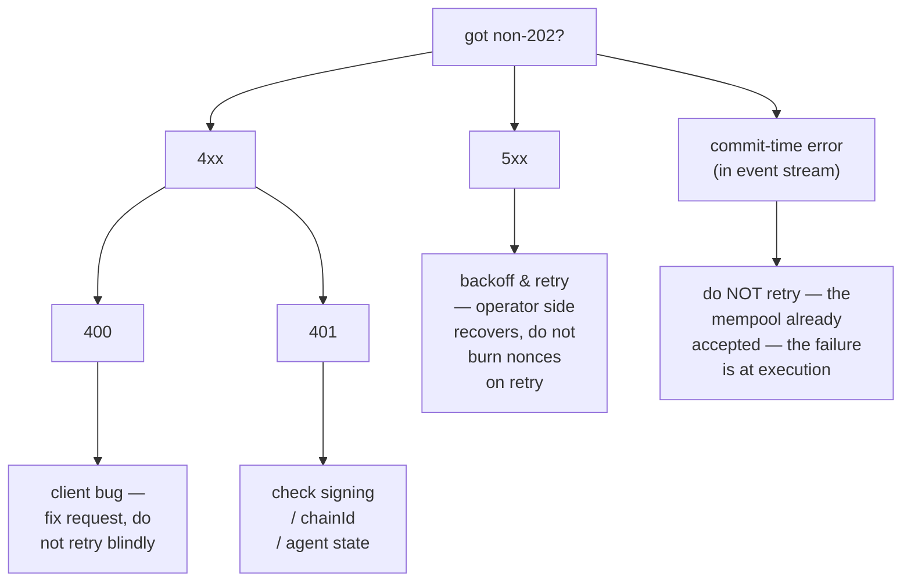

# Error catalog

:::info
**Status.** **stable** for the codes listed. New error strings may be added; existing ones are stable.
:::

A complete enumeration of HTTP status codes, error-string conventions, root causes, and remediation. When in doubt about how to handle a non-`202`, look here first.

## TL;DR {#tldr}

- **2xx** — success. MTF-native endpoints use proper HTTP status codes for errors, not in-body error flags.
- **400** — client-side bug: malformed request, bad signature shape, unknown action variant. Do not retry without fixing.
- **401** — signature failed authentication. Recover the address locally and check.
- **404** — resource doesn't exist. Common on `/info` when the queried account / market / vault has never been seen.
- **405** — wrong HTTP method (most endpoints are POST).
- **422** — request well-formed but logically invalid (e.g. zero size, leverage above cap). Do not retry; correct and resubmit.
- **429** — rate limited. There is **no** retry hint on the response; derive the wait from the refill rate (see [rate limits](./rate-limits.md)).
- **5xx** — server-side. Retry with exponential backoff; persistent failures indicate operator-side incident.

## Body shape {#body-shape}

All non-2xx responses on MTF-native endpoints use:

```json
{
  "error":  "<short_string>",
  "detail": "<optional human-readable elaboration>"
}
```

`detail` is present only when applicable. The `error` field is the stable identifier — keep your error handler keyed off it.

**No error body carries a retry hint.** There is no `retry_after_ms` field and no
`Retry-After` header on any status, `429` included. A handler that sleeps on a
value read from the body sleeps on `undefined`. Compute every backoff from the
published refill rate instead.

## Catalog {#catalog}

### 400 — bad request {#400--bad-request}

| `error` | Triggered when | Remediation |
|---------|----------------|-------------|
| `sender: expected 40 hex chars, got N` | `sender` field length wrong | Strip `0x` prefix; verify 20-byte address |
| `signature: expected 130 hex chars, got N` | Signature missing `v` byte | Append recovery byte |
| `invalid hex` | Non-hex characters in `sender` / `signature` | Sanitize input |
| `unknown action variant: <X>` | `action.type` misspelled or unsupported | Check the [action catalog](./rest/exchange.md#action-catalog) |
| `missing field: params.<X>` | Required field omitted from a variant | Check the variant's table |
| `action: <parse error>` | The `action` object failed JSON parsing or schema validation | Check the field names and types against the action's catalog entry |
| `nonce must increase` | Reused or out-of-order `nonce` | Use a monotonic counter (e.g. `Date.now()`) |
| `duplicate cloid` | `Order`/`ModifyOrder` reused a client order id | Use a fresh `cloid` |
| `empty batch` | `orders[]` or `cancels[]` empty | Send at least one entry |
| `invalid numeric` | fixed-point field not parseable as `u128` | Send as a JSON string, base-10, no leading `+` or whitespace |
| `unknown info type: <X>` | `/info` `type` not recognised | Check the [info reference](./rest/info.md) |
| `chain_id mismatch` | The chainId field of a multi-sig wrapper doesn't match the network | Match the network's `chainId` |

### 401 — unauthorized (signature failed) {#401--unauthorized-signature-failed}

| `error` | Triggered when | Remediation |
|---------|----------------|-------------|
| `signer is not the sender and not an approved agent` | Recovered address ≠ sender AND not in agent set | Verify private key + address; check `ApproveAgent` committed |
| `agent expired` | Recovered address is an agent of sender, but `expires_at_ms` has passed | Re-approve or rotate agent |
| `agent not yet effective` | `ApproveAgent` is still in propagation (≤1 block) | Wait one block, retry |
| `unknown chainId` | Wrong `chainId` in signing domain → phantom recovered address | Match the [network's chainId](../networks.md) |
| `signature parse failed` | Malformed signature bytes | Verify `r ‖ s ‖ v` encoding (65 bytes) |
| `multisig threshold not met` | Inner action has < `threshold` valid signatures | Collect more signatures |
| `multisig duplicate signer` | Same address signs twice in a multi-sig wrap | Each signer must be distinct |

### 404 — not found {#404--not-found}

| `error` | Triggered when |
|---------|----------------|
| `account not found` | `/info` queried with an address that has no on-chain state |
| `market not found` | `coin` symbol not in the registry |
| `vault not found` | `vault_id` not present |
| `order not found` | `Cancel` against an oid that was already cancelled / filled / never existed |

For `/info` queries, MTF-native returns `404` when the queried resource is unknown.

### 405 — method not allowed {#405--method-not-allowed}

| `error` | Triggered when |
|---------|----------------|
| (no body) | Used `GET` on a `POST` endpoint (or vice versa) |

### 422 — unprocessable entity {#422--unprocessable-entity}

Request was well-formed and the signature was valid, but the action itself is logically invalid.

| `error` | Triggered when | Remediation |
|---------|----------------|-------------|
| `price not tick-aligned` | `px` is not a multiple of the market's tick size | Round to the nearest valid tick |
| `size below market minimum` | `size` < market min | Increase size or hit a different market |
| `reduce_only would grow position` | Reduce-only set, but the order would open or extend position | Drop `reduce_only` or check current position |
| `leverage above asset cap` | Requested leverage > `max_leverage` for asset | Use `≤ max_leverage` (see `meta` info) |
| `pm_min_equity_not_met` | `user_portfolio_margin{enroll:true}` but account below threshold | Increase equity or stay on classical |
| `liquidation tier blocks action` | Account in T1+; further trades blocked | Top up margin, exit tier first |
| `insufficient balance` | Withdrawal / transfer exceeds free balance | Check [`account_state`](./rest/info.md#account_state) first |
| `out of bounds: <param>` | Governance bound violated (e.g. a funding cap, or a `submit_gas_auction_bid` outside the published range) | Use a value within the published bound |

### 429 — rate limited {#429--rate-limited}

```json
{ "status": "err", "response": "rate limit exceeded" }
```

The `429` body is the one that does not use the `error` envelope, and it carries
**nothing else**: no retry hint, and no field naming which of the two budgets ran
out. Treat any `429` as "back off on both".

Derive the wait from the refill rate: 20 weight per second, so a weight-1 request
is affordable again after 50 ms and a weight-5 `/exchange` after 250 ms. See
[rate limits](./rate-limits.md) for budgets and burst handling.

### 503 — service unavailable {#503--service-unavailable}

| `error` | Cause | Remediation |
|---------|-------|-------------|
| `gateway overloaded` | The gateway's in-flight request pool is full | Exponential backoff from 200 ms |
| `gateway not ready` | Gateway is starting up / failing health checks | Retry with backoff; check [status](../networks.md#status) |
| `node downstream unreachable` | Gateway lost the node connection | Operator-side; backoff and watch status |

**A full mempool is not a 503.** The node's pending-action queue never refuses a
new action: when it is full it drops the OLDEST pending one. That drop is silent,
because the caller already holds a `202`. See
[mempool bound](./rate-limits.md#mempool-cap).

### Commit-time errors (not HTTP, in event stream) {#commit-time-errors-not-http-in-event-stream}

Some order failures happen after `202 Accepted` because they're only knowable
in the block-execution context (a self-trade at match time, a reduce-only leg
that closed between admit and dispatch, a margin check that fails once other
fills landed first). These surface on the
[`order_updates`](./ws/subscriptions.md#order_updates) WS channel as
`{"status":"rejected", "reason":"<free-text reason>"}` (or `"cancel_rejected"`
for a cancel). `order_updates` carries **no `action_hash` field** — correlate
by `cloid`, per [error handling](../integration/error-handling.md#reconciliation-pattern).
`reason` is a free-text string, not a fixed enum — treat it as
human-readable, not a machine-matched code.

:::danger
**Only ORDER-type actions get that channel.** For every other action — a
`twap_order`, a cancel, a margin or vault or staking write — a commit-time
rejection is reported **nowhere**: not in the HTTP body (it already said
`accepted: true`), not on any WS channel, and not by any `/info` query, because
none takes an `action_hash`. The action silently never happens.

Confirm those actions by their EFFECT instead — poll the read that serves the
state the action was meant to change, for a few blocks. The full rule and a
per-class table are in
[`accepted` is not `committed`](./rest/exchange.md#accepted-is-not-committed).
:::

## Decision tree {#decision-tree}


```mermaid
flowchart TD
    Q["got non-202?"]
    Q --> C4["4xx"]
    Q --> C5["5xx"]
    Q --> CT["commit-time error<br/>(in event stream)"]

    C4 --> E400["400"]
    C4 --> E401["401"]

    E400 --> B400["client bug —<br/>fix request, do<br/>not retry blindly"]
    E401 --> B401["check signing<br/>/ chainId<br/>/ agent state"]

    C5 --> B5["backoff & retry<br/>— operator side<br/>recovers, do not<br/>burn nonces<br/>on retry"]

    CT --> BCT["do NOT retry — the<br/>mempool already<br/>accepted — the failure<br/>is at execution"]
```

## See also {#see-also}

- [`POST /exchange`](./rest/exchange.md) — write path
- [`POST /info`](./rest/info.md) — read path
- [Rate limits](./rate-limits.md)
- [Idempotency](../integration/idempotency.md) — how to retry safely
- [Error handling guide](../integration/error-handling.md) — patterns for production clients
