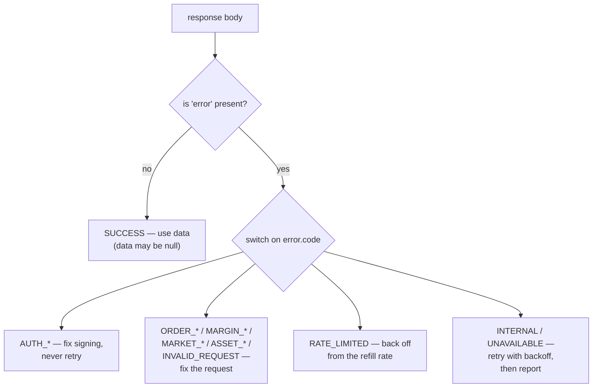

# Errors

:::info
**Status.** **stable.** `code` is the contract and does not change. `message` is
prose and may change in any release. New codes may be added.
:::

This is the single error reference for the API. [`POST /info`](./rest/info.md)
and [`POST /exchange`](./rest/exchange.md) answer the same envelope and draw
from the same code list.

## The envelope {#envelope}

Every response is one envelope. A success carries `data`. A failure carries
`error`. **The two keys never appear together.**

**Success**

```json
{ "data": { /* payload */ } }
```

**Failure**

```json
{
  "error": {
    "code":    "ORDER_INVALID_PRICE",
    "message": "price off grid: 12345 is not a multiple of tick_size 100",
    "details": { "field": "px", "limit": "100", "actual": "12345" }
  }
}
```

| Field | Presence | Meaning |
|-------|----------|---------|
| `code` | always | The stable machine-readable identifier. **Match on this.** |
| `message` | always | One human sentence. **Never match on it.** |
| `details` | optional | The bound the request broke. **Omitted** when the rejection names no bound — never sent as `{}` |

## The two rules callers get wrong {#two-rules}

:::danger
**1. `code` is the contract. `message` is not.**

`message` is prose written for a person reading a log. It can be reworded in any
release, and rewording it is not a breaking change. A handler that branches on
`message`, or on a substring of it, breaks silently on a release that changes
one word — and it breaks in the direction where a rejection reads as an
unrecognised one. Key every branch off `code`.

Print `message`. Match `code`.
:::

:::danger
**2. `data` present and `null` is a SUCCESS.**

A read can succeed with no content. That answers `200` with `{"data": null}`.
There is **no** `error` key on it, because there is no error.

Test for the PRESENCE of `error`, not for a null `data`. A client that reads
"`data` is null, so this failed" reports an empty result as a failure. A client
that reads `error === null` on a success gets `undefined`, because the key is
absent — and `undefined` is falsy, so that test works by accident and stops
working the moment it is inverted.
:::

## `details` — the bound that was broken {#details}

`details` appears only on the rejections that carry a numeric bound. Its shape
is:

| Key | Meaning |
|-----|---------|
| `field` | The request field the bound applies to |
| `limit` | **The bound.** The value you must respect |
| `actual` | **The value that broke it.** What the request asked for |

Worked example — `MARGIN_INSUFFICIENT` on an order that needs more collateral
than the account has free:

```json
{ "field": "margin", "limit": "2.0", "actual": "15.0" }
```

`limit` is the free collateral (`2.0`) and `actual` is the requirement
(`15.0`). Read it as "the bound, and the value that broke the bound" — not as
"minimum, maximum". On `ORDER_INVALID_PRICE` the same pair reads as the tick
size and the price sent.

Three rejections carry `details` today: `ORDER_INVALID_PRICE`,
`ORDER_INVALID_SIZE` and `MARGIN_INSUFFICIENT`. A retired `/info` read also
carries a `details` naming its replacement — see
[`UNKNOWN_TYPE`](#unknown_type-410) below.

**Do not require `details`.** Read it when it is there and fall back to `code`
plus `message` when it is not.

## The code catalog {#catalog}

Codes are namespaced by prefix. One code always answers with one status, with
the single documented exception on `UNKNOWN_TYPE`.

### `ORDER_*` — the order body {#order}

| `code` | HTTP | `details` | Cause and caller action |
|--------|------|-----------|-------------------------|
| `ORDER_NOT_FOUND` | 404 | — | The `oid`, `cloid` or TWAP names no live order. It filled, it was cancelled, or it never existed. **A cancel that gets this is harmless** — the order is already gone. Do not retry |
| `ORDER_ZERO_SIZE` | 400 | — | Size is zero or negative. Send a positive size |
| `ORDER_INVALID_PRICE` | 400 | ✅ | The price is off the tick grid. Round to a multiple of `details.limit` and resend |
| `ORDER_INVALID_SIZE` | 400 | ✅ | The size is off the lot grid. Round to a multiple of `details.limit` and resend |
| `ORDER_BELOW_MIN_NOTIONAL` | 400 | — | Price × size is under the market minimum. Increase the size |
| `ORDER_SELF_TRADE` | 400 | — | Self-trade prevention cancelled the order rather than let it match your own resting order. Move the price, or change `stp_mode` |
| `ORDER_DUPLICATE_CLOID` | 400 | — | The `cloid` is already in use on this account. Use a fresh one. **Do not** treat this as a failure to place — check whether the first submission rested |

### `MARGIN_*` — collateral {#margin}

| `code` | HTTP | `details` | Cause and caller action |
|--------|------|-----------|-------------------------|
| `MARGIN_INSUFFICIENT` | 400 | ✅ | The account cannot fund the requirement. `details.limit` is what is free, `details.actual` is what is needed. Reduce the size, cut the leverage, or add collateral |

### `AUTH_*` — signature and authorization {#auth}

All three answer `401`. None carries `details`.

| `code` | Cause and caller action |
|--------|-------------------------|
| `AUTH_UNAUTHORIZED` | The signer is not allowed to act for this account. Check the `owner` you sent and the key you signed with |
| `AUTH_BAD_SIGNATURE` | The signature does not recover. The bytes are malformed, the recovery byte is wrong, or the signing-domain `chainId` is wrong — a wrong `chainId` recovers a valid but different address. Match the [network `chainId`](../networks.md) and re-sign |
| `AUTH_AGENT_FORBIDDEN` | The signer is an agent of the account, but this action is not one an agent may take, or the approval has expired. Sign with the owner key, or re-approve the agent |

:::tip
**An `AUTH_*` failure is never fixed by a retry.** The same bytes recover the
same address. Correct the signing input first.
:::

### `MARKET_*` — the market {#market}

| `code` | HTTP | `details` | Cause and caller action |
|--------|------|-----------|-------------------------|
| `MARKET_NOT_FOUND` | 404 | — | The `coin` symbol or asset index names no market. Read the market list and use a symbol from it |
| `MARKET_INACTIVE` | 400 | — | The market exists but does not accept this order: trading is disabled, the pair is closed, or the market is reduce-only. Only a closing order is admitted while a market is reduce-only |
| `MARKET_OI_CAP` | 400 | — | Open interest is at the market cap. Nothing about your request is wrong. Wait, or trade another market |

### `ASSET_*` — spot balance {#asset}

| `code` | HTTP | `details` | Cause and caller action |
|--------|------|-----------|-------------------------|
| `ASSET_INSUFFICIENT_BALANCE` | 400 | — | The spot balance cannot fund the transfer, withdrawal or sell. Check the free balance — a held balance is not spendable |

### `RATE_LIMITED` {#rate_limited}

| `code` | HTTP | `details` | Cause and caller action |
|--------|------|-----------|-------------------------|
| `RATE_LIMITED` | 429 | — | The request budget is spent. **No retry hint is sent** — there is no `retry_after_ms` field and no `Retry-After` header. Compute the wait from the published refill rate |

The bucket refills at 20 weight per second. An `/info` read costs 1 weight, so
it is affordable again after 50 ms; an `/exchange` write costs 5 weight, so
250 ms. See [rate limits](./rate-limits.md).

### Request-shape codes {#request-shape}

| `code` | HTTP | `details` | Cause and caller action |
|--------|------|-----------|-------------------------|
| `INVALID_REQUEST` | 400 | sometimes | A field is missing, unparseable, or out of range. `message` names the field. Fix the body — a retry of the same bytes gets the same answer |
| `UNKNOWN_TYPE` | 400 / 410 | on 410 | The `/info` `type` names no read. See below |
| `NOT_FOUND` | 404 | — | A named resource does not exist — a vault, a sub-account. Check the identifier. **An unknown ACCOUNT is not this**: an address never seen on-chain answers `200` with a zeroed record |
| `ACTION_UNSUPPORTED` | 400 | — | The action decodes, but this build has no path for it. It is a system-only action, or a capability that is not open yet. Do not retry — see the [action catalog](./rest/exchange.md#action-catalog) |
| `PRECONDITION_FAILED` | 400 | — | A state rule refused the action, and the rule has no code of its own. `message` carries the reason. This is the catch-all: read `message` to learn what happened, then fix the state or the request. **Do not** match on that `message` — if you need the rule as a branch, ask for a code for it |

#### `UNKNOWN_TYPE` and the one `410` {#unknown_type-410}

`UNKNOWN_TYPE` answers two statuses, and they mean different things:

- **`400`** — the `type` names no read on this API. It is misspelled, or the
  read was removed and its answer is gone. Fix the request.
- **`410`** — the `type` named a public read whose answer **moved** to another
  read. The error carries `details.use`, naming the read to call instead:

  ```json
  {
    "error": {
      "code":    "UNKNOWN_TYPE",
      "message": "gov_state is retired; use validator_votes (time-ranged, served from the archive)",
      "details": { "field": "type", "use": "validator_votes" }
    }
  }
  ```

  A client can follow the move from `details.use` alone. The full list of moved
  reads is in [removed reads](./rest/info.md#retired-reads).

`410` is used because neither alternative is true: `400` claims the request is
malformed, and it is well formed; `404` claims the read never existed, and it
did.

### Server-side codes {#server-side}

| `code` | HTTP | `details` | Cause and caller action |
|--------|------|-----------|-------------------------|
| `INTERNAL` | 500 | — | **Our defect, not your request.** Arithmetic overflow or a broken invariant. The `message` is always the literal string `internal error` — the internal sentence never reaches you. **Retry, then report it.** There is nothing to fix in the request |
| `UNAVAILABLE` | 503 | — | An upstream the request needs is down or not configured. The gateway mints this; a node never does. Back off from 200 ms and retry. A sustained `UNAVAILABLE` is an operator incident, not a client bug |

:::info
**Neither of these is caused by your request, so neither is fixed by changing
it.** Retry with backoff. Do not burn a new nonce per attempt on a write — see
[idempotency](../integration/idempotency.md).
:::

## Statuses that carry no envelope {#no-envelope}

| HTTP | When |
|------|------|
| `405` | The method is wrong. Every endpoint here is `POST`. The router refuses the request before an envelope exists, so there is no `error` object to read |

## Commit-time rejections {#commit-time-errors-not-http-in-event-stream}

Some order failures happen **after** the HTTP reply, because they are only
knowable in block-execution context — a self-trade at match time, a reduce-only
leg that closed between admission and dispatch, a margin check that fails once
other fills landed first.

For an **order-type** action, the per-leg entry in `statuses` carries the same
error object as the envelope, with the same `code`. See
[per-order statuses](./rest/exchange.md#per-order-statuses).

The [`order_updates`](./ws/subscriptions.md#order_updates) WS channel also
pushes a `{"status":"rejected","reason":"<free text>"}` event. `reason` there is
**free text, not a code** — treat it as human-readable only. `order_updates`
carries no `action_hash`, so correlate by `cloid`, per
[error handling](../integration/error-handling.md#reconciliation-pattern).

:::danger
**Only ORDER-type actions get that channel.** For every other action — a
`twap_order`, a cancel, a margin, vault or staking write — a commit-time
rejection reaches you in the HTTP response or nowhere. The `/exchange` call
waits for the commit, so read the verdict there. If you got a `202`, the wait
expired: **re-read the state the action was meant to change.** The full rule and
a per-class table are in
[`accepted` is not `committed`](./rest/exchange.md#accepted-is-not-committed).
:::

## How to write the handler {#handler}

1. **Branch on the presence of `error`.** Present means failure. Absent means
   success, `data: null` included.
2. **Switch on `error.code`.** Never on `error.message`.
3. **Group by prefix for the default arm.** An unrecognised `ORDER_*` is an
   order problem; an unrecognised `AUTH_*` is a signing problem. A new code
   added in a later release then lands in the right arm instead of the unknown
   one.
4. **Read `details` when it is there.** `details.limit` is the value to round
   to, or the balance to respect.
5. **Retry only `RATE_LIMITED`, `INTERNAL` and `UNAVAILABLE`.** Every other code
   returns the same answer to the same bytes.


```mermaid
flowchart TD
    R["response body"]
    R --> H{"is 'error' present?"}
    H -- "no" --> S["SUCCESS — use data<br/>(data may be null)"]
    H -- "yes" --> C{"switch on error.code"}
    C --> A["AUTH_* — fix signing,<br/>never retry"]
    C --> V["ORDER_* / MARGIN_* /<br/>MARKET_* / ASSET_* /<br/>INVALID_REQUEST —<br/>fix the request"]
    C --> T["RATE_LIMITED — back off<br/>from the refill rate"]
    C --> I["INTERNAL / UNAVAILABLE —<br/>retry with backoff,<br/>then report"]
```

## See also {#see-also}

- [`POST /exchange`](./rest/exchange.md) — write path
- [`POST /info`](./rest/info.md) — read path
- [Rate limits](./rate-limits.md)
- [Idempotency](../integration/idempotency.md) — how to retry a write safely
- [Error handling guide](../integration/error-handling.md) — patterns for a production client
