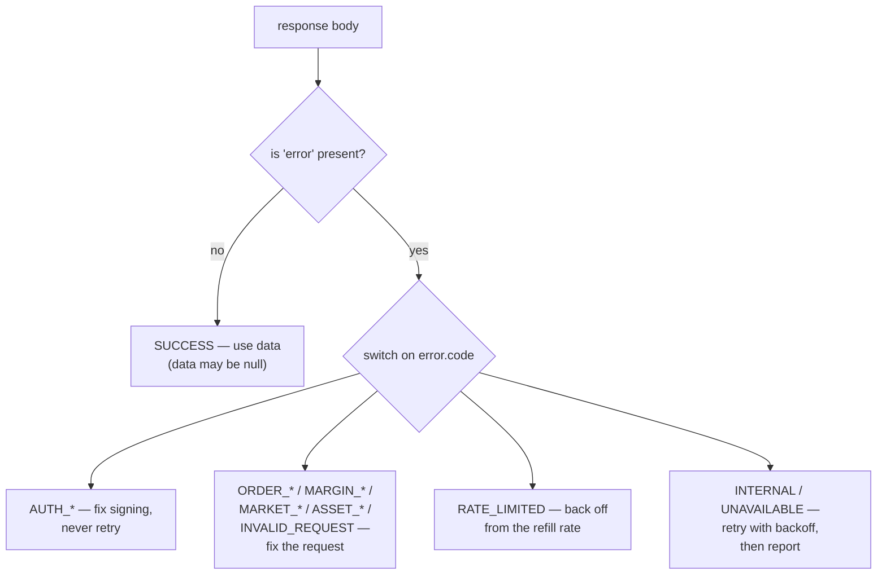

# Errors

This page describes the response envelope and every error code of the MetaFlux API.

:::info
**Status.** Stable. `code` is the contract and does not change. `message` is
prose and can change in any release. New codes can be added.
:::

[`POST /info`](./rest/info.md) and [`POST /exchange`](./rest/exchange.md) use
the same envelope and the same code list.

## Envelope {#envelope}

Every response is one envelope. A success has `data`. A failure has `error`.
A response never has both keys.

**Success**

```json
{ "data": { /* payload */ } }
```

**Failure**

```json
{
  "error": {
    "code":    "ORDER_INVALID_PRICE",
    "message": "price off grid: 12345 is not a multiple of tick_size 100",
    "details": { "field": "px", "limit": "100", "actual": "12345" }
  }
}
```

| Field | Presence | Meaning |
|-------|----------|---------|
| `code` | always | The stable machine-readable identifier. Match on this field. |
| `message` | always | One sentence for a person. Do not match on it. |
| `details` | optional | The bound that the request broke. The gateway omits it when the rejection names no bound. It never sends `{}` |

## Two common mistakes {#two-rules}

:::danger
**1. Match `code`, not `message`.**

`message` is prose for a person who reads a log. A release can change its
words, and that change is not a breaking change. A handler that branches on
`message`, or on a substring of it, fails silently when one word changes. The
failure makes a known rejection look like an unknown one. Branch on `code` only.

Print `message`. Match `code`.
:::

:::danger
**2. `data` with the value `null` is a success.**

A read can succeed and return no content. The response is `200` with
`{"data": null}`. It has no `error` key, because there is no error.

Test for the presence of `error`. Do not test for a null `data`. A client that
reads "`data` is null, so the call failed" reports an empty result as a
failure. A client that reads `error === null` on a success gets `undefined`,
because the key is absent. `undefined` is falsy, so that test works by
accident. It stops working when someone inverts it.
:::

## The details object {#details}

`details` appears only on a rejection that has a numeric bound. It has these
keys:

| Key | Meaning |
|-----|---------|
| `field` | The request field that the bound applies to |
| `limit` | The bound. The request must respect this value |
| `actual` | The value that broke the bound. This is what the request asked for |

Example: `MARGIN_INSUFFICIENT` on an order that needs more collateral than the
account has free:

```json
{ "field": "margin", "limit": "2.0", "actual": "15.0" }
```

`limit` is the free collateral (`2.0`). `actual` is the requirement (`15.0`).
Read the pair as "the bound, and the value that broke the bound". Do not read
it as "minimum, maximum". On `ORDER_INVALID_PRICE` the same pair is the tick
size and the price that the request sent.

Three rejections have `details` today: `ORDER_INVALID_PRICE`,
`ORDER_INVALID_SIZE` and `MARGIN_INSUFFICIENT`. A removed `/info` read also has
`details`, which names its replacement. See
[`UNKNOWN_TYPE`](#unknown_type-410) below.

Do not require `details`. Read it when it is present. When it is absent, use
`code` and `message`.

## Code catalog {#catalog}

Each code has a prefix that groups it. One code always answers with one
status. `UNKNOWN_TYPE` is the one documented exception.

The `HTTP` column shows the status that a code has when admission rejects the
request. On `/exchange`, most `ORDER_*`, `MARGIN_*`, `MARKET_*` and `ASSET_*`
rules run at commit instead. A commit verdict arrives in a `200` response. See
[commit-time codes](./rest/exchange.md#commit-time-codes) for the list of
these codes and where to read them.

### Order codes {#order}

| `code` | HTTP | `details` | Cause and caller action |
|--------|------|-----------|-------------------------|
| `ORDER_NOT_FOUND` | 404 | — | The `oid`, `cloid` or TWAP names no open order. The order filled, was cancelled, or never existed. A cancel that gets this code does no harm, because the order is already gone. Do not retry |
| `ORDER_ZERO_SIZE` | 400 | — | The size is zero or negative. Send a positive size |
| `ORDER_INVALID_PRICE` | 400 | ✅ | The price is not on the tick grid. Round to a multiple of `details.limit` and send again |
| `ORDER_INVALID_SIZE` | 400 | ✅ | The size is not on the lot grid. Round to a multiple of `details.limit` and send again |
| `ORDER_BELOW_MIN_NOTIONAL` | 400 | — | Price × size is less than the market minimum. Increase the size |
| `ORDER_SELF_TRADE` | 400 | — | The two sides of an [`rfq_accept`](./rest/exchange/rfq-utility.md#rfq_accept) are one party. This code is for the RFQ lane only. On the order book, [self-trade prevention](../concepts/order-types.md#stp-groups) cancels an order and never returns this code. Quote or accept from an account that is not in the STP group of the taker |
| `ORDER_DUPLICATE_CLOID` | 400 | — | The `cloid` is already in use on this account, or two legs of one action use the same `cloid`. Use a new one. Do not read this code as a failed placement: check if the first submission rested. When the commit refuses an attempt, its `cloid` becomes free again, so a re-signed retry can use that `cloid` |

### Margin codes {#margin}

| `code` | HTTP | `details` | Cause and caller action |
|--------|------|-----------|-------------------------|
| `MARGIN_INSUFFICIENT` | 400 | ✅ | The account cannot fund the requirement. `details.limit` is the free amount and `details.actual` is the required amount. Reduce the size, reduce the leverage, or add collateral |

### Auth codes {#auth}

All three codes answer `401`. None of them has `details`.

| `code` | Cause and caller action |
|--------|-------------------------|
| `AUTH_UNAUTHORIZED` | The signer cannot act for this account. Check the `owner` that you sent and the key that you signed with |
| `AUTH_BAD_SIGNATURE` | The signature does not recover. The bytes are malformed, the recovery byte is wrong, or the signing-domain `chainId` is wrong. A wrong `chainId` recovers a valid but different address. Use the [network `chainId`](../networks.md) and sign again |
| `AUTH_AGENT_FORBIDDEN` | The signer is an agent of the account, but an agent cannot take this action, or the approval has expired. Sign with the owner key, or approve the agent again |

:::tip
**A retry never fixes an `AUTH_*` failure.** The same bytes recover the same
address. Correct the signing input first.
:::

### Market codes {#market}

| `code` | HTTP | `details` | Cause and caller action |
|--------|------|-----------|-------------------------|
| `MARKET_NOT_FOUND` | 404 | — | The `coin` symbol or asset index names no market. Read the market list and use a symbol from it |
| `MARKET_INACTIVE` | 400 | — | The market exists but does not accept this order. Trading is disabled, the pair is closed, or the market is reduce-only. A reduce-only market admits only a closing order. A perp that a delist halted or settled, or that governance paused, answers `PRECONDITION_FAILED` instead |
| `MARKET_OI_CAP` | 400 | — | Open interest is at the market cap. The request has no error. Wait, or trade on a different market |

### Asset codes {#asset}

| `code` | HTTP | `details` | Cause and caller action |
|--------|------|-----------|-------------------------|
| `ASSET_INSUFFICIENT_BALANCE` | 400 | — | The spot balance cannot fund the transfer, withdrawal or spot order. Check the free balance. A held balance cannot be spent. A spot order that the balance cannot fund at all gets this code with `insufficient spot balance` |

### `RATE_LIMITED` {#rate_limited}

| `code` | HTTP | `details` | Cause and caller action |
|--------|------|-----------|-------------------------|
| `RATE_LIMITED` | 429 | — | The request budget is spent. The response has no retry hint: there is no `retry_after_ms` field and no `Retry-After` header. Calculate the wait from the published refill rate |

The bucket refills at 20 weight per second. An `/info` read costs 1 weight, so
it is affordable again after 50 ms. An `/exchange` write costs 5 weight, so it
is affordable again after 250 ms. See [rate limits](./rate-limits.md).

### `NONCE_REPLAYED` {#nonce_replayed}

| `code` | HTTP | `details` | Cause and caller action |
|--------|------|-----------|-------------------------|
| `NONCE_REPLAYED` | 200 | — | The block builder dropped the action. This account already used the nonce, or the nonce is more than 64 below the newest one. Nothing committed and the nonce is not consumed. Do not retry at the same nonce. Sign again at a higher nonce |

The `200` is correct. This code is a commit verdict, not an admission
rejection, and every commit verdict arrives in a `200`. On an order action the
same object arrives as `statuses[0].error`. See
[a replayed nonce](./rest/exchange.md#nonce-replayed) for the 64-wide window
and for how a wrong clock moves an account out of it.

### Request-shape codes {#request-shape}

| `code` | HTTP | `details` | Cause and caller action |
|--------|------|-----------|-------------------------|
| `INVALID_REQUEST` | 400 | sometimes | A field is missing, cannot be parsed, or is out of range, or an `/exchange` `action` is larger than 1 MiB. `message` names the field. Fix the body. A retry of the same bytes gets the same answer. One case arrives in a `200`: the block builder drops an `action` that does not fit in one block. See [the action byte cap](../changelog/block-17113494.md#action-byte-cap) |
| `UNKNOWN_TYPE` | 400 / 410 | on 410 | The `/info` `type` names no read. See below |
| `NOT_FOUND` | 404 | — | A named resource, such as a vault or a sub-account, does not exist. Check the identifier. An unknown account does not get this code: an address that the chain has never seen answers `200` with a zeroed record |
| `ACTION_UNSUPPORTED` | 400 | — | The action decodes, but this build has no path for it. It is a system-only action, or a capability that is not open yet. Do not retry. See the [action catalog](./rest/exchange.md#action-catalog) |
| `PRECONDITION_FAILED` | 400 | — | A state rule refused the action, and that rule has no code of its own. `message` gives the reason. This is the catch-all code. Read `message` to learn the cause, then fix the state or the request. Do not match on that `message`. If you need the rule as a branch, ask for a code for it |

#### `UNKNOWN_TYPE` and status 410 {#unknown_type-410}

`UNKNOWN_TYPE` answers with two statuses, and they have different meanings:

- **`400`**: the `type` names no read on this API. It has a spelling error, or
  the read was removed and its answer is gone. Fix the request.
- **`410`**: the `type` named a public read whose answer moved to a different
  read. The error has `details.use`, which names the read to call instead:

  ```json
  {
    "error": {
      "code":    "UNKNOWN_TYPE",
      "message": "gov_state is retired; use validator_votes (time-ranged, served from the archive)",
      "details": { "field": "type", "use": "validator_votes" }
    }
  }
  ```

  A client can follow the move from `details.use` alone. The full list of moved
  reads is in [removed reads](./rest/info.md#retired-reads).

The API uses `410` because the two alternatives are both false. `400` says that
the request is malformed, but it is well formed. `404` says that the read never
existed, but it did.

### Server-side codes {#server-side}

| `code` | HTTP | `details` | Cause and caller action |
|--------|------|-----------|-------------------------|
| `INTERNAL` | 500 | — | A defect on the server side, not in your request: an arithmetic overflow or a broken invariant. The `message` is always the literal string `internal error`. The internal sentence never reaches the caller. Retry, then report it. The request has nothing to fix |
| `UNAVAILABLE` | 503 | — | An upstream that the request needs is down or is not configured. Only the gateway returns this code. A node never does. Back off from 200 ms and retry. A continuous `UNAVAILABLE` is an operator incident, not a client bug |

:::info
**Your request does not cause these codes, so a change to the request does not
fix them.** Retry with backoff. On a write, do not use a new nonce for each
attempt. See [idempotency](../integration/idempotency.md).
:::

## Statuses without an envelope {#no-envelope}

| HTTP | When |
|------|------|
| `405` | The method is wrong. Every endpoint here is `POST`. The router refuses the request before an envelope exists, so there is no `error` object to read |

## Commit-time rejections {#commit-time-errors-not-http-in-event-stream}

Some order failures occur after the HTTP reply, because only block execution
can detect them. Examples are a self-trade at match time, a reduce-only leg
that closed between admission and dispatch, and a margin check that fails
after other fills landed first.

For an order-type action, the entry for each leg in `statuses` has the same
error object as the envelope, with the same `code`. See
[per-order statuses](./rest/exchange.md#per-order-statuses).

The [`order_updates`](./ws/subscriptions.md#order_updates) WS channel also
pushes a `{"status":"rejected","reason":"<free text>"}` event. There, `reason`
is free text and not a code. Use it only as a message for a person.
`order_updates` has no `action_hash`, so correlate by `cloid`, as
[error handling](../integration/error-handling.md#reconciliation-pattern)
describes.

:::danger
**Only order-type actions use that channel.** For every other action, such as
a `twap_order`, a cancel, or a margin, vault or staking write, a commit-time
rejection arrives in the HTTP response or not at all. The `/exchange` call
waits for the commit, so read the verdict there. A `202` means that the wait
expired. In that case, read again the state that the action was meant to
change. The full rule and a table for each class are in
[`accepted` is not `committed`](./rest/exchange.md#accepted-is-not-committed).
:::

## Handler pattern {#handler}

1. Branch on the presence of `error`. Present means failure. Absent means
   success, including `data: null`.
2. Switch on `error.code`. Never switch on `error.message`.
3. Group by prefix for the default branch. An unknown `ORDER_*` code is an
   order problem. An unknown `AUTH_*` code is a signing problem. A code that a
   later release adds then goes to the correct branch, not to the unknown one.
4. Read `details` when it is present. `details.limit` is the value to round
   to, or the balance to respect.
5. Retry only `RATE_LIMITED`, `INTERNAL` and `UNAVAILABLE`. Every other code
   returns the same answer to the same bytes.


```mermaid
flowchart TD
    R["response body"]
    R --> H{"is 'error' present?"}
    H -- "no" --> S["SUCCESS — use data<br/>(data may be null)"]
    H -- "yes" --> C{"switch on error.code"}
    C --> A["AUTH_* — fix signing,<br/>never retry"]
    C --> V["ORDER_* / MARGIN_* /<br/>MARKET_* / ASSET_* /<br/>INVALID_REQUEST —<br/>fix the request"]
    C --> T["RATE_LIMITED — back off<br/>from the refill rate"]
    C --> I["INTERNAL / UNAVAILABLE —<br/>retry with backoff,<br/>then report"]
```

## See also {#see-also}

- [`POST /exchange`](./rest/exchange.md): the write path
- [`POST /info`](./rest/info.md): the read path
- [Rate limits](./rate-limits.md)
- [Idempotency](../integration/idempotency.md): how to retry a write safely
- [Error handling guide](../integration/error-handling.md): patterns for a production client
