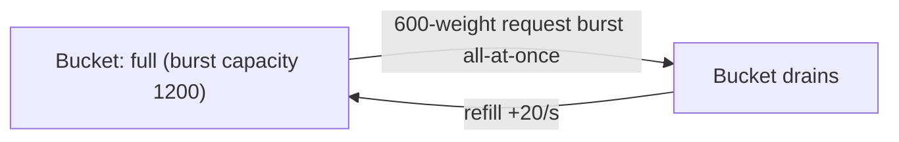
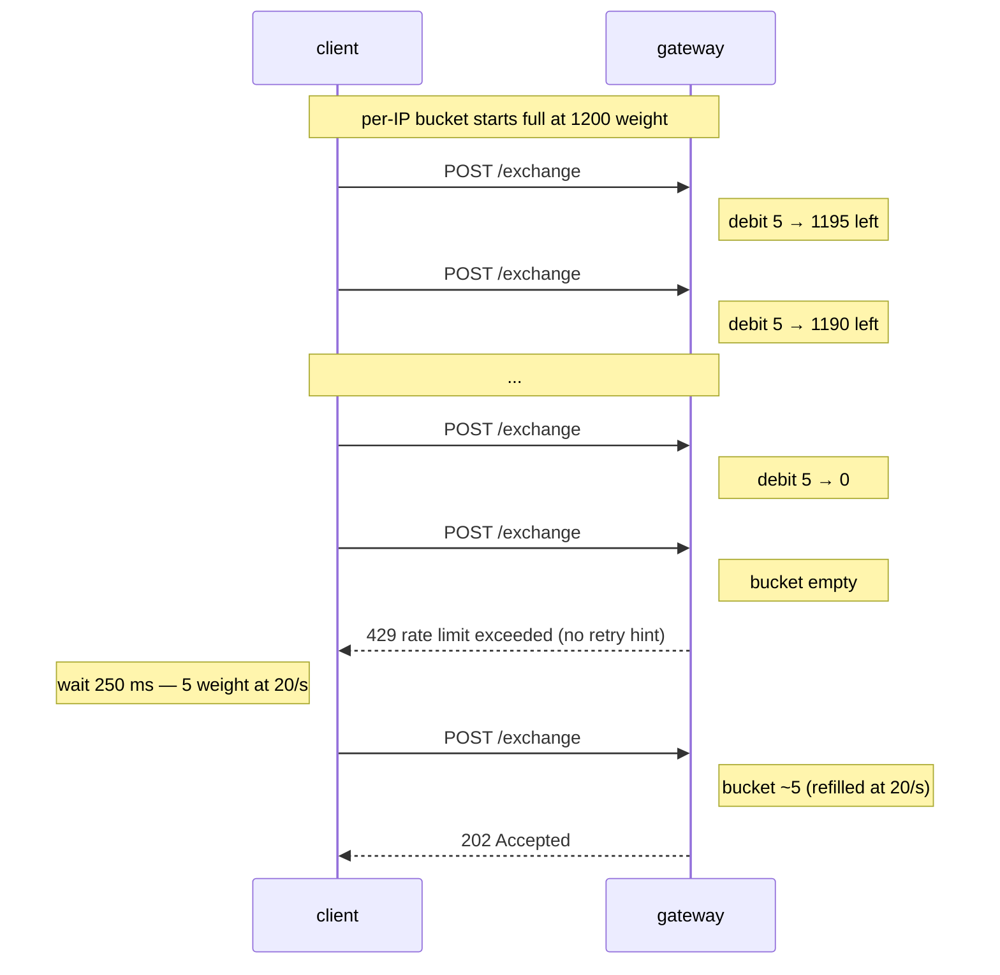

# Rate limits

:::info
**Preview.** The gateway enforces the limits below. The bare node accepts traffic from authenticated mTLS peers on its own terms (intended for trusted infra only — do not expose `8080` to the open internet in production).
:::

## TL;DR {#tldr}

- Two budgets: **per-IP weight** (every HTTP request) and **per-account request count** (signed `/exchange` traffic).
- `POST /info` costs 1 weight, or 2 for the heavy types. `POST /exchange` costs 5. `POST /evm` costs 1 per batch element.
- **The WebSocket costs no weight.** The upgrade, a `subscribe`, an `unsubscribe` and every pushed message are all free. A per-connection cap of **64 subscriptions** bounds the socket instead.
- Bursty workloads spend a token bucket. Sustained traffic is gated by the refill rate.
- A `429` carries **no** retry hint. Pace the client on the refill rate below.

## Budgets {#budgets}

| Budget | Limit (default) | Refill | Burst | Exemption |
|--------|-----------------|--------|-------|-----------|
| Per-IP weight | 1200 weight / minute | 20 weight / second | 1200 (full bucket) | allowlisted IPs exempt |
| Per-account `/exchange` requests | 1200 requests / minute | 20 requests / second | 1200 (full bucket) | metaliquidity-set signers exempt |
| WS subscriptions per connection | 64 | — | — | allowlisted connections exempt |

- **Per-IP** covers every HTTP request that reaches the gateway, signed or not.
  **Allowlisted IPs** (operator-designated market makers / infra) bypass it.
- The **per-account bucket** applies to signed `/exchange` writes and counts
  **one token per REQUEST**, not the request's weight. The same request also pays
  its weight of 5 against the per-IP bucket, so the two budgets count different
  units for one call.
- The per-account bucket is the **floor** rung of a ladder that scales with the
  account's committed trailing-30d volume — the same volume figure the
  [fee tiers](./rest/info.md) read. A high-volume account resolves to a larger
  bucket. An account with no volume, or a volume read the gateway cannot
  complete, gets the floor above. The ladder never lowers a budget.
- Accounts on the **metaliquidity operator set** (the whitelisted vault-strategy
  signers) are **exempt** from the per-account bucket. The exemption is proved by
  signature, not claimed: an unproven claim is charged like any other caller.
- **WS**: at most **64 active subscriptions per connection**; a 65th subscribe is
  rejected. Allowlisted connections are exempt from the cap.

The limits are operator configuration, not governance parameters. The volume
ladder is the one input that comes from committed chain state.

> **`user_rate_limit` does not report the budget.** The native
> [`user_rate_limit`](./rest/info.md#user_rate_limit) read returns the account's
> action counters (`last_nonce`, `pending_count`, `lifetime_count`). It does not
> return bucket state, and no read does. Track your own spend against the table
> above.

> **Planned read.** A dedicated `GET /limits` route publishing the *static*
> per-IP / per-account config is **not implemented**, and the gateway serves no
> such path today. The values below are the configured defaults:

```json
{
  "per_ip": {
    "weight_per_minute": 1200,
    "burst":             1200,
    "refill_per_second": 20
  },
  "per_account_exchange": {
    "requests_per_minute": 1200,
    "burst":               1200,
    "refill_per_second":   20
  },
  "ws_subs_per_conn": 64
}
```

## Weight by endpoint {#weight-by-endpoint}

| Endpoint | Weight |
|----------|--------|
| `POST /info` (most types) | 1 |
| `POST /info` `l2_book`, `markets` | 2 |
| `POST /info` `user_fills` | 2 |
| `POST /exchange` | 5 |
| `POST /evm` (single request) | 1 |
| `POST /evm` (batch array) | 1 per element, minimum 1 |
| `POST /faucet` (devnet / testnet) | 1 |
| WS upgrade, `subscribe`, `unsubscribe`, pushed message | 0 |
| WS [`post`](./ws/index.md) frame | the weight of the route it lowers onto |

A client making one order per second and polling `account_state` once per second spends `5 + 1 = 6 weight/s = 360 weight/min` — well within budget.

**A request the node refuses still costs.** An unknown `/info` `type`, a
malformed body and a rejected action are all charged, because the gateway must
read the request to learn that. Malformed is never the cheap lane: an `/evm`
array whose element count cannot be parsed pays the **full batch cap**, 100.

**A subscribe is FREE today, and it is not a way around the budget.** The WS
upgrade is mounted outside the per-IP middleware, and the subscribe path carries
no limiter, so neither spends weight. What bounds the socket is the
64-subscription cap over a shared upstream feed: one more subscriber adds no node
work. The **`post` frame is the exception** — it dispatches into the same routes
a REST call does, so it pays the same weight (`/info` by its `type`, `/exchange`
= 5) against the same per-IP bucket.

**An EVM batch does not save weight.** Each element is dispatched independently,
so a 40-element array costs 40 — the same as 40 separate calls. Batching saves
round trips, not budget. A batch is also capped at **100** elements; a larger one
is rejected whole with JSON-RPC `-32600`, and the refusal itself is charged at
the cap. The array is refused whole, never trimmed, so a caller never has to work
out which prefix ran. See [the EVM JSON-RPC page](../evm/index.md#batch-requests).

This is the opposite of `/exchange` order batching, which **does** save weight
(one request with 10 legs costs 5, not 50). The two rules differ because an
`/exchange` batch is one action the node admits once, while an EVM batch is N
independent calls in one envelope.

## Per-account requests {#per-account-qps}

Once a request is signed, the gateway reads the acting account off the body and counts one token against that account's budget, in addition to the per-IP weight.

| Sender state | Counted against |
|--------------|-----------------|
| Anonymous (no signature, e.g. `POST /info`) | per-IP weight only |
| Signed by master | per-IP weight + 1 per-account token |
| Signed by agent | per-IP weight + 1 token on the MASTER's bucket |

**All agents of one master share the master's budget**, because the bucket keys
on the account the action names, not on the key that signed it. A client
hammering from a single IP on behalf of one account hits whichever budget is
tighter.

## Mempool bound {#mempool-cap}

Independent from the rate limits, and on the node rather than the gateway. The
node stages pending actions in a bounded queue of **8192**. The bound is
**global, not per account**, and when the queue is full the node drops the
**OLDEST** pending action.

**An accepted `/exchange` response is an acceptance, not a commit.** An action
that this eviction drops was already acknowledged, so the drop is silent to the
caller. Confirm from the committed side — the
[`order_updates`](./ws/subscriptions.md) feed, or a poll — before you treat an
order as live. This matters only under a sustained flood: at a healthy ~100 ms
block time the queue drains far faster than a rate-limit-correct client fills it.

## Burst behaviour {#burst-behaviour}

The buckets fill to `burst` and refill at `refill` per second. A burst of `N ≤ burst` requests fits immediately; subsequent requests are throttled to the refill rate.



A `429` tells you the bucket is dry and nothing more. The body is the standard
[failure envelope](./errors.md#envelope) with `error.code` `RATE_LIMITED`, and
it names no wait: there is no `Retry-After` header and no `retry_after_ms`
field. Compute the wait yourself: at 20 weight/second a
weight-1 request is affordable again 50 ms later, and a weight-5 `/exchange` 250
ms later. For batch jobs prefer pacing client-side; for interactive workloads use
exponential backoff.

## Strategies {#strategies}

### Order-flow bot {#order-flow-bot}

- Pre-emptively rate-limit on the client. The per-IP weight budget binds first: `/exchange` costs 5, so 20 weight/second sustains 4 orders per second from one IP.
- Use `Order` batching: one request with 10 orders costs 5 weight (same as one order); the per-account budget counts requests, not legs.
- Use `BatchModify` instead of N separate `ModifyOrder`s.
- Keep market-data on the WS feed, not on polling `/info`.

### Market-data consumer {#market-data-consumer}

- Subscribe to WS channels (`l2_book`, `trades`, `fills`); do not poll.
- A subscribe and an in-stream message both cost 0, so the feed spends no budget at all.
- On reconnect you re-subscribe from a fresh snapshot (there are no resume tokens). Stay within the **64-subscription** per-connection cap.

### High-frequency liquidator {#high-frequency-liquidator}

- Run from your own self-hosted node (mTLS-authenticated, `localhost:8080`), bypassing the public gateway's limits.
- Acknowledge this requires running infra peered with a validator.
- Public gateway access is enough for tens-of-orders-per-second workloads; not enough for HFT.

## Sequence — getting throttled and recovering {#sequence--getting-throttled-and-recovering}



## Override channels {#override-channels}

| Channel | Notes |
|---------|-------|
| mTLS peer of a validator | Bypasses gateway rate-limits (you're on the trusted path) |
| Allowlisted IP (operator-side) | Exempt from the per-IP weight bucket entirely |
| metaliquidity operator set | Exempt from the per-account `/exchange` bucket |
| Trailing-30d volume | Raises the per-account bucket automatically; no application needed |

Public defaults assume none of these applies.

## See also {#see-also}

- [Errors](./errors.md)
- [WS subscriptions](./ws/subscriptions.md)
- [Idempotency](../integration/idempotency.md) — how to retry within rate-limit budget

## FAQ {#faq}

<details>
<summary>Show FAQ</summary>

**Q: Are limits per-key-pair or per-address?**
A: Per-address. All agents of the same master share the master's budget, because the bucket keys on the account the action names.

**Q: Can I batch one order across 10 markets to save weight?**
A: Yes. `Order { orders: [<10 legs>] }` costs 5 weight, not 50.

**Q: Do `/info` polls and WS subscribes share a budget?**
A: No. A subscribe costs nothing at all, so it cannot exhaust the bucket an `/info` poll spends. The one WS frame that does share the per-IP bucket is `post`, which lowers onto `/info` or `/exchange` and pays that route's weight.

**Q: How do I read `retry_after_ms` off a 429?**
A: You cannot — the gateway does not send one. Derive the wait from the refill rate: 20 weight per second.

**Q: What about devnet?**
A: Devnet runs the same defaults unless the operator raises them. Do not tune your client against devnet; budget against the table above for the network you will deploy to.

</details>
