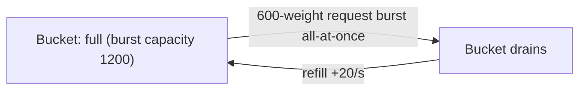
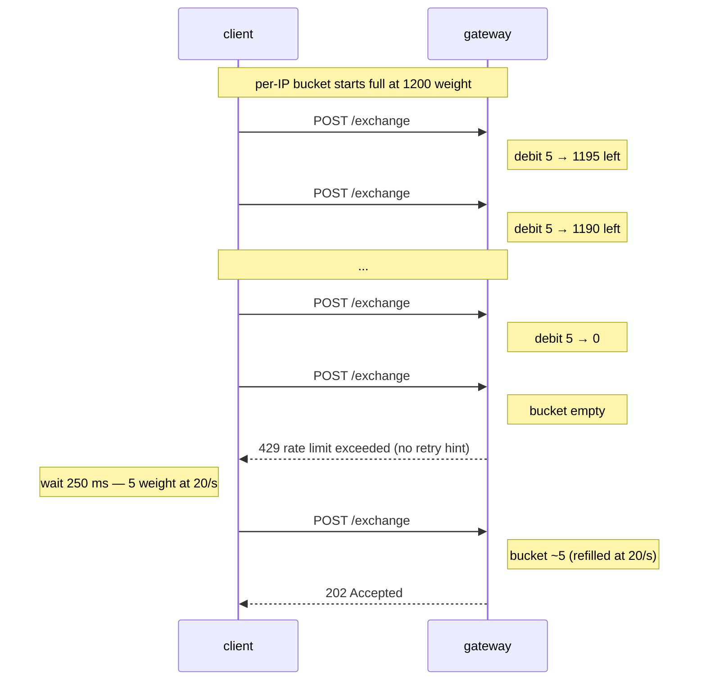

# Rate limits

This page describes the request budgets of the gateway and the mempool bound of the node.

:::info
**Preview.** The gateway enforces the limits below. The bare node accepts traffic from authenticated mTLS peers on its own terms. That path is for trusted infrastructure only. In production, do not expose `8080` to the open internet.
:::

## Summary {#tldr}

- There are two budgets: a weight budget for each IP (every HTTP request) and a request-count budget for each account (signed `/exchange` traffic).
- `POST /info` costs 1 weight, or 2 for the heavy types. `POST /exchange` costs 5. `POST /evm` costs 1 for each batch element.
- The WebSocket costs no weight. The upgrade, a `subscribe`, an `unsubscribe` and every pushed message are free. A cap of 64 subscriptions for each connection bounds the socket instead.
- A burst spends a token bucket. The refill rate limits sustained traffic.
- A `429` has no retry hint. Pace the client on the refill rate below.

## Budgets {#budgets}

| Budget | Limit (default) | Refill | Burst | Exemption |
|--------|-----------------|--------|-------|-----------|
| Per-IP weight | 1200 weight / minute | 20 weight / second | 1200 (full bucket) | allowlisted IPs exempt |
| Per-account `/exchange` requests | 1200 requests / minute | 20 requests / second | 1200 (full bucket) | metaliquidity-set signers exempt |
| WS subscriptions per connection | 64 | — | — | allowlisted connections exempt |

- The per-IP budget covers every HTTP request that reaches the gateway, signed
  or not. Allowlisted IPs bypass it. The operator designates these IPs for
  market makers and infrastructure.
- The per-account bucket applies to signed `/exchange` writes. It counts one
  token for each request, not the weight of the request. The same request also
  pays its weight of 5 against the per-IP bucket. The two budgets count
  different units for one call.
- The per-account bucket is the lowest step of a ladder. The ladder scales with
  the committed 30-day trailing volume of the account. The
  [fee tiers](./rest/info.md) read the same volume figure. A high-volume account
  gets a larger bucket. An account with no volume gets the lowest step. An
  account whose volume read the gateway cannot complete also gets the lowest
  step. The ladder never lowers a budget.
- Accounts in the metaliquidity operator set are exempt from the per-account
  bucket. These accounts are the allowlisted vault-strategy signers. A signature
  proves the exemption. The gateway charges an unproven claim like any other
  caller.
- WS: a connection has at most 64 active subscriptions. The gateway rejects a
  65th subscribe. Allowlisted connections are exempt from the cap.

The limits are operator configuration, not governance parameters. The volume
ladder is the one input that comes from committed chain state.

:::note
**`user_rate_limit` does not report the budget.** The native
[`user_rate_limit`](./rest/info/node.md#user_rate_limit) read returns the action
counters of the account (`last_nonce`, `pending_count`, `lifetime_count`). It
does not return bucket state, and no read does. Track your own spend against
the table above.
:::

:::note
**Planned read.** A `GET /limits` route that publishes the static per-IP and
per-account configuration is not implemented. The gateway serves no such path
today. These are the configured defaults:
:::

```json
{
  "per_ip": {
    "weight_per_minute": 1200,
    "burst":             1200,
    "refill_per_second": 20
  },
  "per_account_exchange": {
    "requests_per_minute": 1200,
    "burst":               1200,
    "refill_per_second":   20
  },
  "ws_subs_per_conn": 64
}
```

## Weight by endpoint {#weight-by-endpoint}

| Endpoint | Weight |
|----------|--------|
| `POST /info` (most types) | 1 |
| `POST /info` `l2_book`, `markets` | 2 |
| `POST /info` `user_fills` | 2 |
| `POST /exchange` | 5 |
| `POST /evm` (single request) | 1 |
| `POST /evm` (batch array) | 1 per element, minimum 1 |
| `POST /faucet` (testnet) | 1 |
| WS upgrade, `subscribe`, `unsubscribe`, pushed message | 0 |
| WS [`post`](./ws/index.md) frame | the weight of the route it lowers onto |

A client that sends one order per second and polls `account_state` once per second spends `5 + 1 = 6 weight/s = 360 weight/min`. That is well within the budget.

A request that the node refuses still costs weight. The gateway charges an
unknown `/info` `type`, a malformed body and a rejected action, because it must
read the request to find the problem. A malformed request is never cheaper. An
`/evm` array whose element count cannot be parsed pays the full batch cap,
100.

A subscribe is free today, and it does not bypass the budget. The WS upgrade
is mounted outside the per-IP middleware, and the subscribe path has no
limiter, so neither spends weight. The 64-subscription cap over a shared
upstream feed bounds the socket. One more subscriber adds no node work. The
`post` frame is the exception. It dispatches into the same routes as a REST
call, so it pays the same weight against the same per-IP bucket: `/info` by its
`type`, and `/exchange` = 5.

An EVM batch does not save weight. The gateway dispatches each element
independently, so a 40-element array costs 40. That is the same as 40 separate
calls. A batch saves round trips, not budget. The cap for a batch is 100
elements. The gateway rejects a larger batch whole with JSON-RPC `-32600`, and
it charges the refusal at the cap. The gateway never trims the array, so a
caller never has to find out which prefix ran. See
[the EVM JSON-RPC page](../evm/index.md#batch-requests).

`/exchange` order batching is different: it does save weight. One request with
10 legs costs 5, not 50. The rules differ because the node admits an
`/exchange` batch once, as one action. An EVM batch is N independent calls in
one envelope.

## Per-account requests {#per-account-qps}

When a request is signed, the gateway reads the acting account from the body. It counts one token against the budget of that account, in addition to the per-IP weight.

| Sender state | Counted against |
|--------------|-----------------|
| Anonymous (no signature, e.g. `POST /info`) | per-IP weight only |
| Signed by master | per-IP weight + 1 per-account token |
| Signed by agent | per-IP weight + 1 token on the MASTER's bucket |

All agents of one master share the budget of the master. The bucket keys on the
account that the action names, not on the key that signed it. A client that
sends a high volume from one IP for one account hits the tighter of the two
budgets.

## Mempool bound {#mempool-cap}

The mempool bound is separate from the rate limits. The node enforces it, not
the gateway. The node keeps pending actions in a bounded queue of 8192. The
bound is global, not per account. When the queue is full, the node drops the
oldest pending action.

**An accepted `/exchange` response is an acceptance, not a commit.** The node
already acknowledged an action that this eviction drops, so the caller does not
see the drop. Before you treat an order as resting, confirm it from the
committed side: the [`order_updates`](./ws/subscriptions.md) feed, or a poll.
This applies only to a sustained flood. At a healthy block time of about
100 ms, the queue drains much faster than a client within the rate limits fills it.

## Burst behaviour {#burst-behaviour}

The buckets fill to `burst` and refill at `refill` per second. A burst of `N ≤ burst` requests passes at once. The gateway then throttles later requests to the refill rate.


```mermaid
flowchart LR
    A["Bucket: full (burst capacity 1200)"] -->|"600-weight request burst all-at-once"| B["Bucket drains"]
    B -->|"refill +20/s"| A
```

A `429` tells you that the bucket is empty, and nothing more. The body is the
standard [failure envelope](./errors.md#envelope) with `error.code`
`RATE_LIMITED`. It names no wait: there is no `Retry-After` header and no
`retry_after_ms` field. Calculate the wait yourself. At 20 weight/second, a
weight-1 request is affordable again 50 ms later. A weight-5 `/exchange` is
affordable again 250 ms later. For batch jobs, pace on the client side. For
interactive workloads, use exponential backoff.

## Strategies {#strategies}

### Order-flow bot {#order-flow-bot}

- Rate-limit on the client before the gateway does. The per-IP weight budget binds first. `/exchange` costs 5, so 20 weight/second gives 4 orders per second from one IP.
- Use `Order` batching. One request with 10 orders costs 5 weight, the same as one order. The per-account budget counts requests, not legs.
- Use `BatchModify` instead of N separate `ModifyOrder`s.
- Get market data from the WS feed. Do not poll `/info` for it.

### Market-data consumer {#market-data-consumer}

- Subscribe to WS channels (`l2_book`, `trades`, `fills`). Do not poll.
- A subscribe and an in-stream message both cost 0, so the feed spends no budget.
- On reconnect, subscribe again from a new snapshot. There are no resume tokens. Stay within the cap of 64 subscriptions for each connection.

### High-frequency liquidator {#high-frequency-liquidator}

- Run your own self-hosted node (mTLS-authenticated, `localhost:8080`). It bypasses the limits of the public gateway.
- This requires infrastructure that peers with a validator.
- Public gateway access is sufficient for workloads of tens of orders per second. It is not sufficient for HFT.

## Throttle and recovery sequence {#sequence--getting-throttled-and-recovering}


```mermaid
sequenceDiagram
    participant client
    participant gateway
    Note over client,gateway: per-IP bucket starts full at 1200 weight
    client->>gateway: POST /exchange #1
    Note right of gateway: debit 5 → 1195 left
    client->>gateway: POST /exchange #2
    Note right of gateway: debit 5 → 1190 left
    Note over client,gateway: ...
    client->>gateway: POST /exchange #240
    Note right of gateway: debit 5 → 0
    client->>gateway: POST /exchange #241
    Note right of gateway: bucket empty
    gateway-->>client: 429 rate limit exceeded (no retry hint)
    Note left of client: wait 250 ms — 5 weight at 20/s
    client->>gateway: POST /exchange #241'
    Note right of gateway: bucket ~5 (refilled at 20/s)
    gateway-->>client: 202 Accepted
```

## Override channels {#override-channels}

| Channel | Notes |
|---------|-------|
| mTLS peer of a validator | Bypasses the gateway rate limits. This is the trusted path |
| Allowlisted IP (operator-side) | Exempt from the per-IP weight bucket |
| metaliquidity operator set | Exempt from the per-account `/exchange` bucket |
| Trailing-30d volume | Raises the per-account bucket automatically. No application is necessary |

The public defaults assume that none of these applies.

## See also {#see-also}

- [Errors](./errors.md)
- [WS subscriptions](./ws/subscriptions.md)
- [Idempotency](../integration/idempotency.md): how to retry within the rate-limit budget

## FAQ {#faq}

<details>
<summary>Show FAQ</summary>

**Q: Are limits per key pair or per address?**
A: Per address. All agents of the same master share the budget of the master, because the bucket keys on the account that the action names.

**Q: Can I batch one order across 10 markets to save weight?**
A: Yes. `Order { orders: [<10 legs>] }` costs 5 weight, not 50.

**Q: Do `/info` polls and WS subscribes share a budget?**
A: No. A subscribe costs nothing, so it cannot empty the bucket that an `/info` poll spends. The one WS frame that shares the per-IP bucket is `post`. It lowers onto `/info` or `/exchange` and pays the weight of that route.

**Q: How do I read `retry_after_ms` from a 429?**
A: You cannot. The gateway does not send one. Calculate the wait from the refill rate: 20 weight per second.

**Q: Does testnet use the same limits?**
A: Testnet runs the same defaults unless the operator raises them. Do not tune your client against testnet. Use the table above for the network that you deploy to.

</details>
