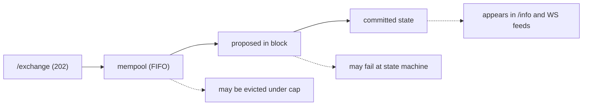
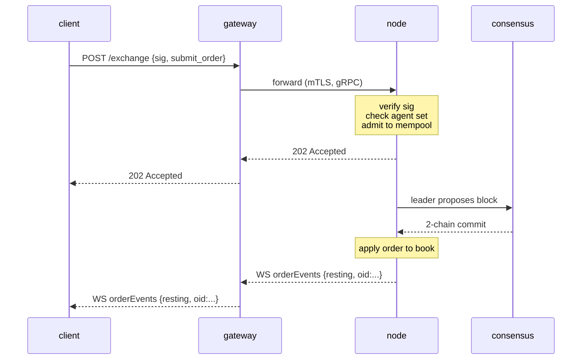

# `POST /exchange` — submit a signed action

:::info
**Status.** **stable** for the listed action variants. Endpoint shape committed for V1.
:::

## TL;DR {#tldr}

Every state-mutating **user** action — place order, cancel, vault deposit, agent
approval, staking, etc. — is a single EIP-712-signed JSON envelope sent to `POST
/exchange`. The action variant is selected by the `type` field. An **order**
returns `200 OK` with the synchronous assigned `oid` (the handler waits for
commit); every **other** action returns `202 Accepted` on admission, with commit
confirmation arriving through the [WS feed](../ws/subscriptions.md) or by polling.

:::warning
**User actions only.** `/exchange` is the public **user** write path. Privileged
/ system writes — oracle price submission, faucet credits, `SystemUserModify`,
`SystemSpotSend`, validator votes — are **never** on `/exchange`. They inject via
node-local queues gated by validator authority (see the
[non-bridged table](#non-bridged-actions) and the [faucet](./faucet.md#why-this-is-not-on-exchange)).
Posting a system action's native tag returns `400 unsupported action`.
:::

## URL {#url}

```
POST  https://api.<net>.mtf.exchange/exchange
```

| Path | Wire shape |
|------|-----------|
| `POST /exchange` (gateway) | **MTF-native** (this document) |

The gateway serves the MTF-native `/exchange`. Running the node yourself, the same
native `/exchange` is served directly at `http://localhost:8080`.

## Request envelope {#request-envelope}

```json
{
  "signature": "0xabcd...1b",
  "nonce":     1735689600001,
  "action": {
    "type": "submit_order",
    "order": { /* one of the variants below */ }
  }
}
```

| Field | Type | Required | Description |
|-------|------|----------|-------------|
| `signature` | hex string, 65 bytes (130 hex chars; `0x` optional) | yes | secp256k1 ECDSA over the EIP-712 [typed-data digest](#signing) of the action's structured fields + `nonce`. `r ‖ s ‖ v`. Both legacy `v ∈ {27, 28}` and EIP-2098 `v ∈ {0, 1}` accepted. |
| `nonce` | uint64 | yes | Strictly-monotonic per actor. Conventionally `Date.now()`. Bound into the signed digest. See [idempotency](../../integration/idempotency.md). |
| `action` | object | yes | A tagged variant: `{ "type": "<snake_case_tag>", ... }`. See [Action catalog](#action-catalog) below. |

:::info
**No top-level `sender`.** The envelope carries no `sender` field. The account
whose state mutates is determined per action:
- **Owner-claiming actions** (`submit_order`, `cancel_order`) carry the owner
  *inside* the action body — `action.order.owner` / `action.cancel.owner`. The
  server recovers the signer from the signature and requires it to equal that
  `owner` **or** an approved [agent](../../concepts/agent-wallets.md) of it.
- **Sender-authorized actions** (governance, margin, vault-leader, staking, …)
  carry **no** owner field at all: the recovered signer *is* the actor, and
  action-level authorization (validator membership, vault-leader, etc.) runs at
  dispatch.
:::

The server reconstructs the EIP-712 typed struct from `action.type` +
`action.params` and recovers the signer over **those field values** — so the
`action.params` you send must carry the **same values** (and the same canonical
decimal strings) you put in the typed message you signed. A mismatch recovers a
different signer and the request is rejected `401`. See
[typed-data signing](../../integration/typed-data-signing.md).

## Signing {#signing}

The signature is a secp256k1 ECDSA recovery over a standard EIP-712 digest. Each
action is signed as **structured EIP-712 typed data** (`eth_signTypedData_v4`)
with a per-action primary type `MetaFluxTransaction:<Action>`, so a wallet renders
each field by name. The server reconstructs the typed struct from `action.type` +
`action.params`, recomputes the digest, and recovers the signer:

```
struct_hash = keccak256( typeHash(MetaFluxTransaction:<Action>) ‖ encodeData(fields) )
signed_hash = keccak256( 0x1901 ‖ domain_separator ‖ struct_hash )
```

where the domain separator is:

```
domain_separator = keccak256(
  keccak256("EIP712Domain(string name,string version,uint256 chainId,address verifyingContract)") ‖
  keccak256("MetaFlux") ‖
  keccak256("1") ‖
  chainId_as_uint256_be ‖
  address_zero_padded_to_32
)
```

The per-action type strings, the atomic `encodeData` rules, and worked examples
are in [typed-data signing](../../integration/typed-data-signing.md) — the single
signing scheme. A cross-implementation known-answer test pins each action's
digest.

:::info
**`sig_scheme` is vestigial.** Earlier builds carried a `sig_scheme` selector on
the envelope; it is no longer required and the server ignores it (typed-data
recovery runs unconditionally). **Omit it.** If present, the only accepted value
is `"typed"`.
:::

### Chain IDs {#chain-ids}

| Network | `chainId` |
|---------|-----------|
| Devnet (default) | `31337` |
| Testnet | `114514` |
| Mainnet | `8964` |

The signing-domain `chainId` **must equal the node's consensus `chain_id`** —
query it via [`/info` `node_info`](./info.md#node_info) (`data.chain_id`) and use
that exact value. Signing against the wrong `chainId` returns `401` because the
recovered address differs from the action's `owner` (or, for sender-authorized
actions, recovers a phantom address that passes no authorization check). See
[networks](../../networks.md) for endpoints.

## Numeric conventions {#numeric-conventions}

| Type | Wire form | Why |
|------|----------|-----|
| `uint64` ≤ 2^53 | JSON number | Safe in IEEE-754 |
| `uint64` > 2^53, `u128`, scaled integers | JSON string | Native JSON numbers silently lose precision past 2^53 |
| Address | hex string `"0x..."` | 20 bytes, 40 hex chars (with or without `0x`) |
| Booleans | `true` / `false` | Literal JSON |
| Optional fields | `null` or omit | Both accepted; `null` is canonical |

**Fixed-point fields.** Price and size fields are 8-decimal fixed-point integers; USDC amounts are 6-decimal base units. The value carries the scale, not the field name — e.g. `px = "10050000000"` means `100.50`. Always send as a string; the server parses to `u128`.

## Signed-by semantics {#signed-by-semantics}

Most actions can be signed by **either** the master account **or** an active [agent wallet](../../concepts/agent-wallets.md). A subset is **master-only** — agents are explicitly denied withdrawal authority and account-management privileges.

| Capability class | Master can sign? | Agent can sign? |
|------------------|:----------------:|:---------------:|
| Place / cancel / modify orders | yes | yes |
| Update leverage / margin mode | yes | yes |
| Vault deposit / withdraw | yes | yes |
| Sub-account create | yes | no |
| Sub-account transfer | yes | no |
| Agent approval / revocation | yes | no |
| External withdrawal (USDC, spot) | yes | no |
| Convert to multi-sig | yes | no |
| Multi-sig wrapper | (special — see [multi-sig](../../concepts/multi-sig.md)) | no |

Each action's entry in the [catalog](#action-catalog) lists its signed-by rule explicitly.

---

## Action catalog {#action-catalog}

Each variant is a tagged object `{ "type": "<snake_case_tag>", <flat body> }`. The
body keys are **flat under the action object** (there is no PascalCase `type` and
no universal `params` wrapper) — e.g. `submit_order` carries an `order` object,
`cancel_order` carries a `cancel` object, and the sender-authorized actions carry
a `params` object. Click through for the field-level table. The overview tables
below group every action by category; the **full field-level definitions that
follow are split by trading type** — [Perpetual order actions](#perpetual-order-actions),
[Spot trading actions](#spot-trading-actions),
[Spot margin & Earn actions](#spot-margin--earn-actions),
[Perpetual margin & risk actions](#perpetual-margin--risk-actions),
[RFQ, FBA & utility actions](#rfq-fba--utility-actions), and
[Account, staking, vaults & bridge actions](#account-staking-vaults--bridge-actions).

:::warning
**`px` / `size` are unsigned fixed-point `u64` on the native wire**, sent as JSON
numbers (the node decodes them as `u64`, then widens internally). Addresses are
`0x`-hex (40 chars); `cloid` is `0x` + 32 hex chars (16 bytes).
:::

### Order placement & lifecycle {#order-placement--lifecycle}

| `type` | Purpose | Signed-by | Idempotent |
|--------|---------|-----------|-----------|
| [`submit_order`](#submit_order) | Place one order | owner / agent | by `cloid` |
| [`batch_order`](#batch_order) | N orders / one signature | owner / agent | per-leg `cloid` |
| [`cancel_order`](#cancel_order) | Cancel by `oid` | owner / agent | yes |
| [`batch_cancel`](#batch_cancel) | N cancels / one signature | owner / agent | yes |
| [`cancel_by_cloid`](#cancel_by_cloid) | Cancel by client order id | sender / agent | yes |
| [`cancel_all_orders`](#cancel_all_orders) | Cancel all (optional asset filter) | sender / agent | yes |
| [`modify`](#modify) | Amend a resting order's px / size | sender / agent | yes |
| [`batch_modify`](#batch_modify) | N modifies / one signature | sender / agent | per-entry |
| [`schedule_cancel`](#schedule_cancel) | Future-block cancel-all trigger | sender / agent | yes |
| [`twap_order`](#twap_order) | Schedule a sliced (TWAP) order | sender / agent | by `twap_id` |
| [`twap_cancel`](#twap_cancel) | Cancel a running TWAP parent | sender / agent | yes |

### Spot trading {#spot-trading}

Spot is a token-for-token CLOB (no leverage, no positions) — separate books and
balances from perps. A resting spot order locks the funds it would owe on fill
into a **reserved balance**: a `bid` reserves **quote** (its notional at the
limit price), an `ask` reserves the **base** it offers. Order size is **clamped
at admission** to what your balance funds, and fees are taken from the leg each
side receives. Both actions are **sender-authorized** (the signer is the trader;
there is no `owner`). See [spot trading](../../products/spot.md) for the
full conceptual model.

| `type` | Purpose | Signed-by | Idempotent |
|--------|---------|-----------|-----------|
| [`spot_order`](#spot_order) | Place one spot order | sender / agent | by `cloid` |
| [`spot_cancel`](#spot_cancel) | Cancel a resting spot order by `oid` | sender / agent | yes |

### Spot margin & Earn {#spot-margin--earn}

:::info
**Available on devnet (preview).** Leveraged spot ([spot margin](../../products/spot-margin.md)) and its lending supply side ([Earn](../../concepts/earn.md)) run end-to-end on **devnet today**: deposit collateral, borrow from the Earn pool, IOC-buy base on leverage, and close to repay. Treat it as a **preview** — forced liquidation is live and settles through the same path as a voluntary close (see [Liquidation](../../products/spot-margin.md#liquidation)), but per-pair maintenance ratios are governance parameters still being calibrated. Do not assume production safety at scale.
:::

A leveraged spot position is **isolated per `(account, pair)`**: posted quote collateral is a pure loss buffer, the buy is funded 100% by a quote borrow drawn from the pair's Earn pool, and the bought base is held **segregated** on the margin account (never in your spendable balances). Earn is the other side — suppliers deposit the lendable quote for pool shares, and the borrow interest spot-margin traders pay lifts each share's value. All six actions are **sender-authorized** (the signer is the actor; there is no `owner`). `amount` / `shares` / `borrow` are decimals sent as JSON strings; `size` / `limit_px` are `u64` on the `1e8` / raw-lot planes like a [`spot_order`](#spot_order). Each returns the [`202 Accepted`](#202-accepted--non-order-admission) admission envelope (not a synchronous `oid`); observe the committed outcome via [`/info` `spot_margin_state`](./info/spot.md#spot_margin_state) and [`earn_state`](./info/spot.md#earn_state).

| `type` | Purpose | Signed-by | Idempotent |
|--------|---------|-----------|-----------|
| [`spot_margin_deposit`](#spot_margin_deposit) | Post quote collateral for a pair | sender / agent | no |
| [`spot_margin_withdraw`](#spot_margin_withdraw) | Withdraw free collateral | sender / agent | no |
| [`spot_margin_open`](#spot_margin_open) | Borrow + IOC-buy base on leverage | sender / agent | no |
| [`spot_margin_close`](#spot_margin_close) | Sell held base, repay the loan | sender / agent | no |
| [`earn_deposit`](#earn_deposit) | Supply quote into the lending pool for shares | sender / agent | no |
| [`earn_withdraw`](#earn_withdraw) | Redeem pool shares (idle-bounded) | sender / agent | no |

### Margin & risk {#margin--risk}

| `type` | Purpose | Signed-by |
|--------|---------|-----------|
| [`update_leverage`](#update_leverage) | Change leverage / iso toggle on an asset | sender / agent |
| [`update_isolated_margin`](#update_isolated_margin) | Signed isolated-margin delta | sender / agent |
| [`top_up_isolated_only_margin`](#top_up_isolated_only_margin) | Strict-iso margin top-up | sender / agent |
| [`user_portfolio_margin`](#user_portfolio_margin) | Enroll / unenroll PM | sender / agent |

### RFQ, FBA & utility {#rfq-fba--utility}

Request-for-quote ([RFQ](../../concepts/rfq.md)) block trading, the
frequent-batch-auction ([FBA](../../concepts/fba.md)) entry, and the deliberate
no-op. See [the field-level sections](#rfq-fba--utility-actions) for the wire
planes and the digest-bound `owner` rule.

| `type` | Purpose | Signed-by |
|--------|---------|-----------|
| [`rfq_request`](#rfq_request) | Open an RFQ session (taker) | sender / agent (`owner` digest-bound) |
| [`rfq_quote`](#rfq_quote) | Quote onto an open RFQ (maker) | sender / agent (`owner` digest-bound) |
| [`rfq_accept`](#rfq_accept) | Accept a quote and settle (taker) | sender / agent (`owner` digest-bound) |
| [`fba_submit`](#fba_submit) | Submit into a batch-auction window | sender / agent |
| [`noop`](#noop) | Deliberate no-op (nonce burn / keepalive) | sender |

### Account management {#account-management}

| `type` | Purpose | Signed-by |
|--------|---------|-----------|
| [`approve_agent`](#approve_agent) | Approve an agent wallet | sender / agent |
| [`set_display_name`](#set_display_name) | Set the account handle | sender / agent |
| [`set_referrer`](#set_referrer) | Bind to a referrer address | sender / agent |
| [`approve_builder_fee`](#approve_builder_fee) | Approve a builder fee ceiling | sender / agent |
| [`create_sub_account`](#create_sub_account) | Open a sub-account under the sender | sender / agent |
| [`sub_account_transfer`](#sub_account_transfer) | Move perp cross-collateral parent ↔ sub | sender / agent |
| [`sub_account_spot_transfer`](#sub_account_spot_transfer) | Move a spot token balance parent ↔ sub | sender / agent |
| [`convert_to_multi_sig_user`](#convert_to_multi_sig_user) | Lift account to multi-sig | sender / agent |
| [`set_position_mode`](#set_position_mode) | Toggle one-way / hedge position mode | sender / agent |

### Staking & abstraction {#staking--abstraction}

| `type` | Purpose | Signed-by |
|--------|---------|-----------|
| [`c_deposit`](#c_deposit) | Move spot MTF into the free staking balance | sender / agent |
| [`c_withdraw`](#c_withdraw) | Move the free staking balance back to spot MTF | sender / agent |
| [`token_delegate`](#token_delegate) | Delegate / undelegate stake | sender / agent |
| [`claim_rewards`](#claim_rewards) | Claim staking rewards | sender / agent |
| [`link_staking_user`](#link_staking_user) | Alias a staking target | sender / agent |
| [`user_dex_abstraction`](#user_dex_abstraction) | Toggle the user DEX-abstraction flag | sender / agent |
| [`user_set_abstraction`](#user_set_abstraction) | Self-scope abstraction config | sender / agent |
| [`agent_set_abstraction`](#agent_set_abstraction) | Agent-scope abstraction config | sender / agent |
| [`priority_bid`](#priority_bid) | Pay a priority fee for block-front placement | sender / agent |

### Encrypted orders {#encrypted-orders}

| `type` | Purpose | Signed-by |
|--------|---------|-----------|
| [`submit_encrypted_order`](#submit_encrypted_order) | Threshold-encrypted order ciphertext | sender / agent |

### Vaults {#vaults}

| `type` | Purpose | Signed-by |
|--------|---------|-----------|
| [`create_vault`](#create_vault) | Leader creates a vault | sender / agent |
| [`vault_transfer`](#vault_transfer) | Leader seed transfer | sender / agent |
| [`vault_modify`](#vault_modify) | Leader-only vault config update | sender / agent |
| [`vault_withdraw`](#vault_withdraw) | Follower share redemption | sender / agent |

### Bridge withdrawals {#bridge-withdrawals}

External withdrawals leave the chain over [MetaBridge](../../bridge/index.md).
The action is **sender-authorized**: the recovered signer is the account
debited, so withdrawal authority is effectively **master-only** — an agent
signature would act on the agent's own (separate) account, never the master's.

| `type` | Purpose | Signed-by |
|--------|---------|-----------|
| [`core_evm_transfer`](#core_evm_transfer) | Move USDC from the Core ledger to MetaFluxEVM | sender (master) |
| [`mb_withdraw`](#mb_withdraw) | Withdraw USDC cross-collateral to an external chain | sender (master) |

### Not on the public `/exchange` path {#not-on-the-public-exchange-path}

These action names appear in earlier drafts, but they are **not bridged on the
MTF-native `/exchange` handler**. They are
either privileged / system writes that must never transit the public user path,
or recognized-but-unmapped schema stubs. Posting them returns
`400 unsupported action`. See [the table below](#non-bridged-actions) for the
disposition of each.

| Draft name | Native tag (if recognized) | Why not bridged |
|-----------|----------------------------|-----------------|
| `ScaleOrder` | — | No native action; ladder client-side into `batch_order` |
| `UpdateMarginMode` | — | No native action; isolation is the `is_isolated` flag on `update_leverage` |
| `MultiSig` | — | Multi-sig collect-and-execute wrapper not bridged (preview / not executing — the account is *registered* via `convert_to_multi_sig_user`) |
| `RegisterReferrer` | — | Not bridged (referrer is bound by address via `set_referrer`) |
| `UsdcTransfer` / `SpotTransfer` | — | User-to-user transfer flows not bridged |
| `WithdrawUsdc` | — | Draft name; external withdrawal is [`mb_withdraw`](#mb_withdraw) |
| `BorrowLend` | — | Not bridged |
| (vault distribute) | `vault_distribute` | Partial/stub handler; not bridged on `/exchange` |
| (PM lifecycle) | `pm_enroll` / `pm_unenroll` | Map to [`user_portfolio_margin`](#user_portfolio_margin) (enroll / unenroll). `pm_rebalance` has been **removed** — rejected as an unknown action |
| (cross-chain) | `cross_chain_send` | Recognized-but-unmapped stub → `unsupported action` |

---

## Perpetual order actions {#perpetual-order-actions}

Order placement and lifecycle on **perpetual** markets (a perp `market` id). These
use the shared CLOB; the [spot](#spot-trading-actions) and
[spot margin](#spot-margin--earn-actions) trading actions are separate sections
below. Perp leverage and margin controls are under
[Perpetual margin & risk actions](#perpetual-margin--risk-actions).

### Place a single order {#submit_order}

Place a single order. The order body is carried under `action.order`; `owner` is
the claimed account (the server requires the recovered signer to equal it or be an
approved agent). To place many orders under one signature, use
[`batch_order`](#batch_order).

```json
{
  "type": "submit_order",
  "order": {
    "owner":       "0x00000000000000000000000000000000000000aa",
    "market":       7,
    "side":         "bid",
    "kind":         "limit",
    "size":         100000000,
    "limit_px":     10050000000,
    "tif":          "gtc",
    "stp_mode":     "cancel_oldest",
    "reduce_only":  false,
    "cloid":        "0xabababababababababababababababab",
    "builder":      { "fee": 5, "user": "0x00000000000000000000000000000000000000ff" },
    "position_side": "long"
  }
}
```

| Field | Type | Range / values | Description |
|-------|------|----------------|-------------|
| `owner` | hex address | 40 hex chars | Claimed account; must equal the recovered signer or an approved agent of it. Wire-only — dropped on lowering |
| `market` | uint32 | `[0, market_count)` | Asset/market id (identity-mapped to `AssetId`) |
| `side` | enum | `"bid"` / `"ask"` | — |
| `kind` | enum | `"limit"` / `"market"` / `"stop_loss"` / `"take_profit"` | `limit` / `market` place a live order. `stop_loss` / `take_profit` are accepted **only when a `trigger` block is also present** — that pair parks a single reduce-only TP/SL leg (see [trigger orders](#trigger-orders-stop_loss--take_profit)); a `stop_loss` / `take_profit` *without* a `trigger` block is rejected (`unsupported order kind`) |
| `trigger` | object \| null | — | Optional [trigger block](#trigger-orders-stop_loss--take_profit). Its presence — on **any** `kind` — turns this `submit_order` into a single parked reduce-only TP/SL leg instead of a live order: `{ "trigger_px": <u64>, "is_market": <bool>, "tpsl": "tp" \| "sl" }` |
| `size` | uint64 | `> 0` | Fixed-point tick units (widened to `u128`) |
| `limit_px` | uint64 | `> 0` | Fixed-point tick units (widened to `i128`) |
| `tif` | enum | `"gtc"`, `"ioc"`, `"alo"` | `"aon"` is rejected (`unsupported time-in-force` — no core equivalent) |
| `stp_mode` | enum | `"cancel_oldest"`, `"cancel_newest"`, `"cancel_both"` | `"reject"` is rejected (`unsupported stp_mode` — no core equivalent) |
| `reduce_only` | bool | — | If true, rejected at commit if it would grow position |
| `cloid` | hex string \| null | `0x` + 32 hex chars (16 bytes) | Optional client order id; enables `cancel_by_cloid` and dedup |
| `builder` | object \| null | — | Optional builder-fee carve: `{ "fee": <bps u16>, "user": <0x-hex address> }` |
| `position_side` | enum \| null | `"long"` / `"short"` | **[Hedge mode](../../concepts/hedge-mode.md) only.** Target leg for the order. **Omit on a one-way account** (the default) and **send it on a hedge account** — a one-way account that sends it, or a hedge account that omits it, is rejected. `reduce_only` is evaluated against the named leg only. See [hedge mode](#position_side-hedge-mode) below |

**Idempotency**: a duplicate `cloid` on the same account is rejected at admission with `error: "duplicate cloid"`. Use `cloid` as your client-side dedup key.

**Common errors**: `px` not tick-aligned, `size` below market minimum, `reduce_only` would grow position, `stp` rejected via STP, account in T1+ liquidation tier.

**Response status entries** (per order, in order — see the full union under
[Response → 200 OK](#200-ok--order-path-synchronous-oid)):

```json
{"resting": {"oid": 12345, "cloid": "0x..."}}                       // posted to book
{"filled":  {"oid": 12345, "total_sz": "100000000", "avg_px": "10050000000"}}
{"error":   "<reason>"}                                             // commit/admission rejected this entry
{"pending": {"action_hash": "0x...", "nonce": 1735689600001}}       // admitted, no commit in the wait window
```

#### `position_side` (hedge mode) {#position_side-hedge-mode}

The optional `position_side` field on the order body selects which leg an order
applies to when the account is in [hedge mode](../../concepts/hedge-mode.md).

- **One-way account (default):** **omit** `position_side`. Sending it on a
  one-way account is rejected.
- **Hedge account:** `position_side` is **required** on every order (`"long"`
  or `"short"`). Omitting it on a hedge account is rejected.

The leg is chosen explicitly — it is **never inferred** from `side` — so a `bid`
meant to *reduce a short* can never accidentally open or grow a long. When
`reduce_only` is set, it is evaluated **against the named leg only**: a
`reduce_only` order on `short` can never touch the `long` leg, and vice-versa.
There is no implicit flip — closing the long leg never opens a short.

| `side` | `position_side` | `reduce_only` | Effect (hedge account) |
|--------|-----------------|---------------|------------------------|
| `bid` | `long` | false | Open / add to the long leg |
| `ask` | `long` | true | Reduce / close the long leg |
| `ask` | `short` | false | Open / add to the short leg |
| `bid` | `short` | true | Reduce / close the short leg |

Switch an account into hedge mode (while flat) with
[`set_position_mode`](#set_position_mode).

#### Trigger orders (`stop_loss` / `take_profit`) {#trigger-orders-stop_loss--take_profit}

A single-leg protective trigger (a stop-loss or take-profit) is expressed as a
`submit_order` whose `order` body carries a `trigger` block. The block's
**presence** — not the `kind` — is what routes it: the order is **parked** in the
canonical trigger registry instead of going to the book, and fires later as a
**reduce-only IOC** when the mark price crosses `trigger_px`.

```json
{
  "type": "submit_order",
  "order": {
    "owner":       "0x00000000000000000000000000000000000000aa",
    "market":       7,
    "side":         "ask",
    "kind":         "take_profit",
    "size":         50000000,
    "limit_px":     0,
    "tif":          "ioc",
    "stp_mode":     "cancel_oldest",
    "reduce_only":  false,
    "trigger":     { "trigger_px": 4200000000000, "is_market": true, "tpsl": "tp" }
  }
}
```

| Field | Type | Range / values | Description |
|-------|------|----------------|-------------|
| `trigger.trigger_px` | uint64 | `> 0` | Trigger price in fixed-point tick units (widened to `i128`). The parked leg parks **at this price** — it is reused as the fired leg's price (the order's own `limit_px` is ignored for a trigger) |
| `trigger.is_market` | bool | — | Advisory label (`true` = the fired leg is a market/IOC). The park path always fires reduce-only IOC regardless; carried for read-path fidelity, not control |
| `trigger.tpsl` | enum | `"tp"` / `"sl"` | Advisory take-profit / stop-loss label. The executor infers the fire direction from the leg `side` vs the mark; this is surfaced in `/info`, not control |

Semantics:

- **Reduce-only is forced.** A trigger leg always closes — it can never open or
  grow a position — regardless of the order's `reduce_only` wire value.
- **The leg `side` chooses what is protected.** An `ask` trigger closes a long;
  a `bid` trigger closes a short. On a [hedge account](#position_side-hedge-mode),
  carry `position_side` to name the leg, exactly as for a live order.
- **`trigger_px` is the parked price**, not the order's `limit_px` — send
  `limit_px` as you like (`0` is fine); the trigger block's price is what is used.
- **OCO.** Trigger legs grouped together collapse on fire (a fired leg retires;
  its sibling is cancelled).

Admission returns the same per-order status union as a live `submit_order`. A
trigger that parks reports through the order path; the eventual fire is a
committed effect observable on the [WS feed](../ws/subscriptions.md) / `/info`.
Multi-leg entry-plus-protective baskets use [`batch_order`](#batch_order) with
`grouping: "normalTpsl"` / `"positionTpsl"`.

---

### Place multiple orders in one signature {#batch_order}

N orders carried by ONE signed envelope / one nonce. Each entry is a full
[`submit_order`](#submit_order) order body (same fields, including per-order
`owner` / `cloid` / `builder`).

```json
{
  "type": "batch_order",
  "params": {
    "orders": [
      { "owner": "0x...aa", "market": 1, "side": "bid", "kind": "limit",
        "size": 1000, "limit_px": 5000, "tif": "gtc",
        "stp_mode": "cancel_oldest", "reduce_only": false },
      { "owner": "0x...aa", "market": 2, "side": "ask", "kind": "limit",
        "size": 2000, "limit_px": 6000, "tif": "gtc",
        "stp_mode": "cancel_oldest", "reduce_only": false }
    ],
    "grouping": "na"
  }
}
```

| Field | Type | Values | Description |
|-------|------|--------|-------------|
| `orders[*]` | order | — | Each entry has the full `submit_order` order shape |
| `grouping` | enum | `"na"`, `"normalTpsl"`, `"positionTpsl"` | Order-family grouping; defaults to `"na"` if omitted |

Returns an array of per-leg statuses (same union as `submit_order`).

---

### Cancel a single order by ID {#cancel_order}

Cancel a single order by `oid`. The cancel body is under `action.cancel`; `owner`
is the claimed account (recovered signer must equal it or be an approved agent).
For many cancels under one signature, use [`batch_cancel`](#batch_cancel).

```json
{
  "type": "cancel_order",
  "cancel": {
    "owner":  "0x00000000000000000000000000000000000000aa",
    "market": 3,
    "oid":    12345
  }
}
```

| Field | Type | Description |
|-------|------|-------------|
| `owner` | hex address | Claimed account; wire-only |
| `market` | uint32 | Asset/market id |
| `oid` | uint64 | Server order id (returned in the `submit_order` response). **Required** — a cancel with only `cloid` is rejected (`cancel requires an oid`); use [`cancel_by_cloid`](#cancel_by_cloid) instead |
| `cloid` | hex string \| null | Accepted on the wire but **not** used to cancel here |

**Idempotent**: cancel of an already-cancelled / already-filled order returns `{"error":"order not found"}` and is harmless.

---

### Cancel multiple orders in one signature {#batch_cancel}

N cancels carried by one signed envelope. Each entry is a
[`cancel_order`](#cancel_order) cancel body (an `oid` is required per entry;
cloid-only entries are rejected).

```json
{
  "type": "batch_cancel",
  "params": {
    "cancels": [
      { "owner": "0x...aa", "market": 1, "oid": 10 },
      { "owner": "0x...aa", "market": 2, "oid": 11 }
    ]
  }
}
```

Same per-entry response shape as `cancel_order`.

---

### Cancel an order by client ID {#cancel_by_cloid}

Cancel by client order id. Useful when the caller hasn't seen the server-side
`oid` yet (race between the `submit_order` response and a cancellation decision).
This is a **sender-authorized** action (no `owner` field — the recovered signer is
the actor).

```json
{
  "type": "cancel_by_cloid",
  "params": {
    "asset": 7,
    "cloid": "0xabababababababababababababababab"
  }
}
```

| Field | Type | Description |
|-------|------|-------------|
| `asset` | uint32 | Asset/market id |
| `cloid` | hex string | `0x` + 32 hex chars (16 bytes) |

Same response shape as `cancel_order`.

---

### Cancel all resting orders {#cancel_all_orders}

Cancel all of the sender's resting orders, optionally filtered to one asset.

```json
{
  "type": "cancel_all_orders",
  "params": { "asset": 3 }
}
```

| Field | Type | Description |
|-------|------|-------------|
| `asset` | uint32 \| null | `null` / omitted = all assets; `Some(a)` = only asset `a` |

Returns a count of cancelled orders.

---

### Amend a resting order's price or size {#modify}

Amend a resting order's price and/or size in place. At least one of `new_px` /
`new_size` must be present. The target order is addressed **by `oid`** or **by
`cloid`** (the client order id the order was placed with) — send one or the other.

```json
{
  "type": "modify",
  "params": {
    "market":   3,
    "oid":      12345,
    "new_px":   10049000000,
    "new_size": 100000000
  }
}
```

Address by `cloid` instead of `oid` (omit `oid`, or leave it `0`):

```json
{
  "type": "modify",
  "params": {
    "market":       3,
    "cloid":        "0xabababababababababababababababab",
    "new_px":       10049000000,
    "always_place": true
  }
}
```

| Field | Type | Description |
|-------|------|-------------|
| `market` | uint32 | Asset/market id |
| `oid` | uint64 | Target order id. Defaults to `0` (= address by `cloid`) when omitted |
| `cloid` | hex string \| null | `0x` + 32 hex chars (16 bytes). When set, the target is resolved by client order id (the same resolver [`cancel_by_cloid`](#cancel_by_cloid) uses) instead of `oid`. A malformed `cloid` is rejected at admission |
| `new_px` | uint64 \| null | New price in fixed-point tick units (`null` / omitted = unchanged) |
| `new_size` | uint64 \| null | New size in fixed-point tick units (`null` / omitted = unchanged) |
| `always_place` | bool | When `true`, a target that no longer rests is a best-effort no-op rather than a rejection. Defaults to `false` |

Returns a single modify status.

---

### Amend multiple orders in one signature {#batch_modify}

Apply N `modify`s under one signature. Each entry has the same shape as
`modify.params`.

```json
{
  "type": "batch_modify",
  "params": {
    "modifications": [
      { "market": 1, "oid": 5, "new_px": 100, "new_size": null },
      { "market": 2, "oid": 6, "new_px": null, "new_size": 7 }
    ]
  }
}
```

| Field | Type | Description |
|-------|------|-------------|
| `modifications[*]` | modify | Each entry has the full [`modify`](#modify) params shape (`market`, `oid`, optional `new_px` / `new_size`) |

**Response.** Non-order action →
[`202 Accepted` admission envelope](#202-accepted--non-order-admission):

```json
{ "accepted": true, "mempool_depth": 3, "nonce": 1735689600001, "action_hash": "0x..." }
```

**At commit** the entries are applied **in input order** and are **not
all-or-nothing**: each modify independently applies or errors with a reason
(the commit outcome carries one status per entry, in input order, plus the
applied count). The HTTP response carries no per-entry statuses — track the
commit via the returned `action_hash`. An empty `modifications` array is
rejected (`empty batch`); more than **1000** entries is rejected (throttled);
an entry with both `new_px` and `new_size` null errors (`nothing to modify`).

---

### Schedule a future cancel-all trigger {#schedule_cancel}

Arm a future-block cancel-all: at `cancel_at_block`, all the sender's open orders
are cancelled (a dead-man's switch).

```json
{
  "type": "schedule_cancel",
  "params": { "cancel_at_block": 999 }
}
```

| Field | Type | Description |
|-------|------|-------------|
| `cancel_at_block` | uint64 | Block height at which the sender's open orders are cancelled |

---

### Schedule a sliced TWAP order {#twap_order}

Schedule a sliced (time-weighted) order. The parent is sliced into `slice_count`
child orders spaced `delay_ms` apart.

```json
{
  "type": "twap_order",
  "params": {
    "market":      4,
    "side":        "ask",
    "total_size":  1000000000,
    "slice_count": 10,
    "delay_ms":    500,
    "reduce_only": true
  }
}
```

| Field | Type | Description |
|-------|------|-------------|
| `market` | uint32 | Asset/market id |
| `side` | enum | `"bid"` / `"ask"` |
| `total_size` | uint64 | Total size in fixed-point tick units (widened to `u128`) |
| `slice_count` | uint32 | Number of child slices (`> 0`) |
| `delay_ms` | uint64 | Inter-slice delay in ms |
| `reduce_only` | bool | — |

**Response.** Non-order action →
[`202 Accepted` admission envelope](#202-accepted--non-order-admission):

```json
{ "accepted": true, "mempool_depth": 1, "nonce": 1735689600001, "action_hash": "0x..." }
```

The parent `twap_id` (uint64) is assigned **at commit** from a deterministic
per-chain counter and carried in the commit outcome — it is **not** in the HTTP
response. Track the commit via the returned `action_hash`. A zero `total_size`
or a zero `slice_count` errors at commit. Slice events ride the
[`user_events` WS channel](../ws/subscriptions.md) (a dedicated `twap*` stream
is roadmap).

---

### Cancel a running TWAP order {#twap_cancel}

Cancel a running TWAP parent. Already-filled slices stay filled; future slices stop.

```json
{
  "type": "twap_cancel",
  "params": { "twap_id": 17 }
}
```

| Field | Type | Description |
|-------|------|-------------|
| `twap_id` | uint64 | The TWAP parent id returned by `twap_order` |

---

## Spot trading actions {#spot-trading-actions}

Token-for-token [spot](../../products/spot.md) actions — no leverage, no positions,
with books and balances entirely separate from perps.

### Place a single spot order {#spot_order}

Place a single order on a **spot** market. Spot trades are a token-for-token
swap with no leverage and no positions; books and balances are entirely separate
from perps. The order body is carried under `action.order`. Spot orders are
**sender-authorized** — the recovered signer is the trader, so there is **no
`owner` field**. `pair` is the **spot pair id** (`SpotPairSpec.pair_id`), which
is distinct from a perp `market` id and from a token id.

```json
{
  "type": "spot_order",
  "order": {
    "pair":      200,
    "side":      "bid",
    "size":      100000000,
    "limit_px":  200000000,
    "tif":       "gtc",
    "stp_mode":  "cancel_oldest",
    "cloid":     "0xabababababababababababababababab"
  }
}
```

| Field | Type | Range / values | Description |
|-------|------|----------------|-------------|
| `pair` | uint32 | an active spot pair | Spot pair id (`SpotPairSpec.pair_id`) — **not** a token id |
| `side` | enum | `"bid"` / `"ask"` | `bid` buys base (pays quote); `ask` sells base (receives quote) |
| `size` | uint64 | `> 0` | Base-asset size in raw lots (`10^sz_decimals` per whole unit); widened to `u128` |
| `limit_px` | uint64 | `> 0` | Limit price in the `1e8` plane. A market order (`0`) is **not supported yet** — always send a limit |
| `tif` | enum | `"gtc"`, `"ioc"`, `"alo"` | `gtc` / `alo` residuals **rest** (escrow-backed); `ioc` never rests. `"aon"` is rejected |
| `stp_mode` | enum | `"cancel_oldest"`, `"cancel_newest"`, `"cancel_both"` | Self-trade prevention. `"reject"` is rejected (no core equivalent) |
| `cloid` | hex string \| null | `0x` + 32 hex chars (16 bytes) | Optional client order id |

**Escrow.** A resting spot order (a `gtc` / `alo` residual) locks the funds it
would owe on fill into a reserved balance: a `bid` reserves **quote** (its
notional at the limit price), an `ask` reserves the **base** it offers. Reserved
funds are not spendable; they are paid to the counterparty on fill, or refunded
to you on cancel, self-trade-prevention, or market deactivation. Per-token
balances are conserved exactly.

**Affordability.** The order size is clamped at admission to what you can fund
(a buy by `quote_balance ÷ limit_px`; a sell by the base you own). An entirely
unaffordable order is an accepted no-op (no fill, nothing rests).

**Fees & settlement.** A fill swaps base for quote at the **maker's** resting
price. The taker fee is taken from the leg the taker receives; the maker fee from
the leg the maker receives. Fees accrue to the spot fee account.

**Limits.** Each account may rest up to **1000** orders per spot pair; a new
resting order past that cap is rejected (`spot resting-order cap reached` — cancel
some first). Recognized market-maker accounts are exempt. When spot is halted by
governance, new orders are rejected (`spot trading disabled`) — but you can still
[`spot_cancel`](#spot_cancel) and reclaim escrow.

**Response.** Like the perp [`submit_order`](#submit_order), a `spot_order`
returns a **synchronous** per-order status once the order commits — the real
assigned `oid` with a `resting` or `filled` entry (or `error`), or `pending` if
no commit lands within the order-wait window. The status union is the same as
[`submit_order`](#200-ok--order-path-synchronous-oid). Spot balances / open
orders are also queryable via [`/info`](./info.md); spot fills are not yet pushed
to the WebSocket trades / candles feeds.

---

### Cancel a resting spot order {#spot_cancel}

Cancel one of **your** resting spot orders by `oid` on a pair, refunding the
escrow it locked. Sender-authorized; **only the order's owner may cancel it** —
a third party (or wrong owner) is rejected (`not the order owner`). An unknown or
non-resting `oid` is a typed miss (`order not found`). Cancels are **not** gated
by the spot halt, so you can always exit a resting order and reclaim escrow.

```json
{
  "type": "spot_cancel",
  "cancel": { "pair": 200, "oid": 12345 }
}
```

| Field | Type | Range / values | Description |
|-------|------|----------------|-------------|
| `pair` | uint32 | an active spot pair | Spot pair id the order rests on |
| `oid` | uint64 | a resting spot `oid` | Server order id to cancel (cancel-by-`cloid` is not yet mapped for spot) |

---

## Spot margin & Earn actions {#spot-margin--earn-actions}

Leveraged [spot margin](../../products/spot-margin.md) and its
[Earn](../../concepts/earn.md) lending supply side. **Available on devnet
(preview).** All actions here are sender-authorized and return the
[`202 Accepted`](#202-accepted--non-order-admission) admission envelope.

### Post collateral for spot margin {#spot_margin_deposit}

:::info
**Available on devnet (preview).** See the [Spot margin & Earn](#spot-margin--earn) overview for the preview caveats.
:::

Post quote (USDC) collateral into your `(account, pair)` margin account, debited from your spendable spot balance. Collateral is a pure **loss buffer** — it does not fund the buy (the [`spot_margin_open`](#spot_margin_open) borrow does). Sender-authorized; the body is carried under `action.params`. `pair` is the **spot pair id**. The account is created on first deposit and accumulates on repeat deposits.

```json
{
  "type": "spot_margin_deposit",
  "params": { "pair": 200, "amount": "100" }
}
```

| Field | Type | Range / values | Description |
|-------|------|----------------|-------------|
| `pair` | uint32 | an active spot pair with margin enabled | Spot pair id (`SpotPairSpec.pair_id`) — **not** a token id |
| `amount` | decimal string | `> 0` | Quote collateral to post (whole units), as a JSON string |

**Gating.** Margin must be **enabled for the pair** — the pair needs per-pair risk parameters present, which are a governance setting still being calibrated. A deposit on a pair without them is rejected (`spot margin not enabled for pair`). An unknown pair, a non-positive `amount`, or an amount above your spendable quote balance are all rejected at admission.

**Response.** Returns the [`202 Accepted`](#202-accepted--non-order-admission) admission envelope (not a synchronous `oid`). Confirm the credited collateral via [`/info` `spot_margin_state`](./info/spot.md#spot_margin_state). See [spot margin](../../products/spot-margin.md).

---

### Withdraw free spot margin collateral {#spot_margin_withdraw}

:::info
**Available on devnet (preview).** See the [Spot margin & Earn](#spot-margin--earn) overview for the preview caveats.
:::

Move free collateral from your `(account, pair)` margin account back to your spendable quote balance. With **no open position** the full collateral is withdrawable (the drained account is pruned). With an **open position** the withdraw is gated at the initial-margin requirement against the held base marked at the pair's last spot trade price — if no mark exists the withdraw is rejected (a deterministic conservative rule). Sender-authorized; body under `action.params`.

```json
{
  "type": "spot_margin_withdraw",
  "params": { "pair": 200, "amount": "50" }
}
```

| Field | Type | Range / values | Description |
|-------|------|----------------|-------------|
| `pair` | uint32 | an active spot pair | Spot pair id the margin account is keyed on |
| `amount` | decimal string | `> 0`, `≤` posted collateral | Quote collateral to withdraw (whole units), as a JSON string |

**Gating.** Rejected if there is no margin account for the pair, if `amount` exceeds the posted collateral, or (with an open position) if the remaining collateral would fall below the initial-margin requirement, or if there is no mark price to value the held base.

**Response.** Returns the [`202 Accepted`](#202-accepted--non-order-admission) admission envelope. Confirm via [`/info` `spot_margin_state`](./info/spot.md#spot_margin_state).

---

### Open a leveraged spot position {#spot_margin_open}

:::info
**Available on devnet (preview).** See the [Spot margin & Earn](#spot-margin--earn) overview for the preview caveats. Leverage works end-to-end on devnet, including live forced liquidation (see [Liquidation](../../products/spot-margin.md#liquidation)).
:::

Open a leveraged long: borrow `borrow` quote from the pair's Earn pool and **IOC-buy** `size` base at up to `limit_px`. The buy is funded 100% by the borrow; your posted collateral is the loss buffer (leverage ≈ notional / collateral). The bought base is held **segregated** on the margin account — it is not credited to your spendable balances. Any **unspent borrow is repaid instantly** after the IOC settles, so the outstanding loan equals only what the buy actually spent. A zero-fill IOC is an accepted no-op (full refund, nothing borrowed, account left open). v1 allows **one open position per `(account, pair)`** — no add-on. Sender-authorized; body under `action.params`.

```json
{
  "type": "spot_margin_open",
  "params": { "pair": 200, "size": 200, "limit_px": 200000000, "borrow": "400" }
}
```

| Field | Type | Range / values | Description |
|-------|------|----------------|-------------|
| `pair` | uint32 | an active spot pair with margin enabled | Spot pair id (`SpotPairSpec.pair_id`) |
| `size` | uint64 | `> 0` | Buy size in base raw lots (`10^sz_decimals` per whole unit); widened to `u128` |
| `limit_px` | uint64 | `> 0` | Limit price in the `1e8` plane |
| `borrow` | decimal string | `> 0` | Quote principal to draw from the Earn pool (whole units), as a JSON string |

**Initial-margin gate.** The open is gated up front on the **worst-case cost** (`limit_px × size`): the open is rejected unless `collateral ≥ init_ratio × worst_cost`, where `init_ratio` is the pair's calibrated initial-margin parameter. Because the gate uses the worst case, a passing open never needs to unwind — the realized spend can only be lower (maker prices `≤ limit_px`, clamped size).

**Gating.** Rejected if margin is not enabled for the pair, if there is no margin account (deposit collateral first), if a position is already open on the pair, if the Earn pool's idle liquidity is below `borrow`, if spot trading is halted, or on a zero `size` / non-positive `borrow`.

**Response.** Returns the [`202 Accepted`](#202-accepted--non-order-admission) admission envelope (not a synchronous `oid` — the inner IOC's fill is a committed effect). Observe the resulting `borrowed` / `base_held` via [`/info` `spot_margin_state`](./info/spot.md#spot_margin_state); the Earn pool's `total_borrowed` moves on [`earn_state`](./info/spot.md#earn_state). See [spot margin](../../products/spot-margin.md).

---

### Close a leveraged spot position {#spot_margin_close}

:::info
**Available on devnet (preview).** See the [Spot margin & Earn](#spot-margin--earn) overview for the preview caveats.
:::

Close the position: **IOC-sell** the held base at no less than `limit_px`, repay the accrued debt (principal + interest) to the Earn pool, and return the remainder to you. On a **full unwind** the collateral joins the repay budget, any leftover stays with you, and the account is pruned. A **partial fill keeps the account open**: unsold base goes back into the segregated holding, only the realized proceeds repay (collateral untouched), and the outstanding principal drops accordingly. v1 is full-close intent only (no `size` argument — the whole holding is offered). Sender-authorized; body under `action.params`.

```json
{
  "type": "spot_margin_close",
  "params": { "pair": 200, "limit_px": 200000000 }
}
```

| Field | Type | Range / values | Description |
|-------|------|----------------|-------------|
| `pair` | uint32 | an active spot pair | Spot pair id the position is on |
| `limit_px` | uint64 | `> 0` | Floor price for the close sell, in the `1e8` plane |

**Settlement.** Interest accrues `O(1)` off the pool's borrow index since the open. On a close where proceeds + collateral cannot cover the debt, the whole principal still leaves the pool's borrowed book and the **shortfall is socialized to suppliers** (the pool's supplied total is reduced, floored at zero). This `spot_margin_close` action is always a **voluntary** user-submitted close; a forced liquidation runs automatically through this same settlement path when the account falls through the maintenance floor (see [Liquidation](../../products/spot-margin.md#liquidation)) — it is not something the user submits.

**Gating.** Rejected if there is no margin account, if there is no open position (nothing held), or if the position carries debt but the pair's Earn pool is missing.

**Response.** Returns the [`202 Accepted`](#202-accepted--non-order-admission) admission envelope. Confirm full vs partial close and the repaid amount via [`/info` `spot_margin_state`](./info/spot.md#spot_margin_state) (a pruned account no longer appears); supplier-side effects show on [`earn_state`](./info/spot.md#earn_state).

---

### Supply quote into the Earn pool {#earn_deposit}

:::info
**Available on devnet (preview).** See the [Spot margin & Earn](#spot-margin--earn) overview for the preview caveats.
:::

Supply quote into a lending pool and receive **pool shares** priced off the pool's net asset value. The first supplier into a pool mints shares **1:1**; later deposits price off NAV, so once borrower interest has lifted the pool a same-size deposit mints proportionally **fewer** shares. The pool **auto-creates on first deposit** for any asset that is the quote of a registered spot pair. Sender-authorized; body under `action.params`. `asset` is the **lendable quote asset id** (the pool key), not a pair id.

```json
{
  "type": "earn_deposit",
  "params": { "asset": 100, "amount": "5000" }
}
```

| Field | Type | Range / values | Description |
|-------|------|----------------|-------------|
| `asset` | uint32 | a registered spot pair's quote asset (or an existing pool) | Lendable asset id — the pool key |
| `amount` | decimal string | `> 0` | Quote to supply (whole units), as a JSON string |

**Gating.** Rejected on a non-positive `amount`, on a spendable balance below `amount`, or if `asset` is not lendable (not any pair's quote and has no existing pool). A deposit so small it would mint zero shares is rejected.

**Response.** Returns the [`202 Accepted`](#202-accepted--non-order-admission) admission envelope. Confirm minted shares / your stake via [`/info` `earn_state`](./info/spot.md#earn_state) (pass `user` to include your `user_shares` / `user_value`). See [Earn](../../concepts/earn.md).

---

### Redeem Earn pool shares {#earn_withdraw}

:::info
**Available on devnet (preview).** See the [Spot margin & Earn](#spot-margin--earn) overview for the preview caveats.
:::

Redeem pool shares back to quote, paid to your spendable balance. The payout is **clamped to the pool's idle liquidity** (`total_supplied − total_borrowed`): a redemption larger than idle pays exactly idle and burns proportionally fewer shares, so a supplier can always exit up to what is not lent out and never strands the borrow ledger. There is **no claim step** — yield compounds into share value as borrower interest lifts NAV, and you realize it on withdrawal. Sender-authorized; body under `action.params`.

```json
{
  "type": "earn_withdraw",
  "params": { "asset": 100, "shares": "1234.5" }
}
```

| Field | Type | Range / values | Description |
|-------|------|----------------|-------------|
| `asset` | uint32 | a pool you hold shares in | Lendable asset id — the pool key |
| `shares` | decimal string | `> 0`, `≤` shares you own | Pool shares to redeem, as a JSON string |

**Gating.** Rejected if the pool does not exist, on a non-positive `shares`, if `shares` exceeds what you own, if the pool is insolvent (zero NAV with shares outstanding), or if the pool has **zero idle liquidity** (everything is currently lent out — wait for borrowers to repay). A redemption that quantizes to zero is rejected.

**Response.** Returns the [`202 Accepted`](#202-accepted--non-order-admission) admission envelope; the burned-share count may be **less than requested** when the payout was idle-clamped. Confirm the remaining stake and pool totals via [`/info` `earn_state`](./info/spot.md#earn_state). See [Earn](../../concepts/earn.md).

---

## Perpetual margin & risk actions {#perpetual-margin--risk-actions}

Leverage, isolated-margin, and portfolio-margin controls for **perpetual**
positions. See [margin modes](../../concepts/margin-modes.md) and
[portfolio margin](../../concepts/portfolio-margin.md) for the models.

### Set leverage and margin mode {#update_leverage}

Set per-asset leverage and, optionally, flip the asset to isolated mode.

```json
{
  "type": "update_leverage",
  "params": { "asset": 2, "leverage": 25, "is_isolated": true }
}
```

| Field | Type | Range | Description |
|-------|------|-------|-------------|
| `asset` | uint32 | — | Target asset |
| `leverage` | uint32 | `[1, 100]` and ≤ per-asset dynamic cap | New leverage |
| `is_isolated` | bool | — | `true` also flips the asset to isolated mode |

There is no separate margin-mode action: isolation is the `is_isolated` flag here.

---

### Adjust isolated margin by a delta {#update_isolated_margin}

Apply a signed margin delta to an isolated position (`+` adds, `−` withdraws).

```json
{
  "type": "update_isolated_margin",
  "params": { "asset": 1, "delta": "-12.5" }
}
```

| Field | Type | Description |
|-------|------|-------------|
| `asset` | uint32 | Target asset |
| `delta` | decimal (string or number) | Signed margin delta; non-zero |

---

### Add margin to a strict-isolated position {#top_up_isolated_only_margin}

Add margin to a strict-isolated position. Top-up direction only (positive amount).

```json
{
  "type": "top_up_isolated_only_margin",
  "params": { "asset": 5, "amount": "3.0" }
}
```

| Field | Type | Description |
|-------|------|-------------|
| `asset` | uint32 | Target asset |
| `amount` | decimal (string or number) | Positive amount to add |

---

### Enroll or unenroll portfolio margin {#user_portfolio_margin}

Enroll or unenroll the account in portfolio margin.

```json
{
  "type": "user_portfolio_margin",
  "params": { "enroll": true }
}
```

| Field | Type | Description |
|-------|------|-------------|
| `enroll` | bool | `true` = enroll, `false` = unenroll |

Requires account equity ≥ `pm_min_equity` (governance parameter). See [portfolio margin](../../concepts/portfolio-margin.md).

---

## RFQ, FBA & utility actions {#rfq-fba--utility-actions}

[RFQ](../../concepts/rfq.md) block trading, the
[FBA](../../concepts/fba.md) frequent-batch-auction entry, and the deliberate
no-op. All five return the
[`202 Accepted`](#202-accepted--non-order-admission) admission envelope; the
committed outcome is observable via the [`rfq_open`](./info.md#rfq_open) /
[`rfq_user`](./info.md#rfq_user) /
[`fba_batch_state`](./info.md#fba_batch_state) reads and the
[WS feed](../ws/subscriptions.md).

**Wire planes.** The RFQ / FBA numeric fields (`size`, `price`, `max_size`,
`limit_px`) are unsigned fixed-point `u64` JSON **numbers** on the wire — the
same 1e8 price plane / raw-lot size plane as [`submit_order`](#submit_order),
widened to `u128` / `i128` internally. They are **not** decimal strings: the
strings-on-the-wire policy covers the whole-USDC decimal plane, not the
fixed-point book plane. `side` here uses the core `"Bid"` / `"Ask"` tokens
(capitalized — unlike the perp order body's lowercase `"bid"` / `"ask"`).

**Acting as a vault / master (`owner`).** Each RFQ action takes an optional
`owner` (0x hex): an approved [agent](../../concepts/agent-wallets.md) may act
**as** the master / vault it is approved for. Unlike the order actions, the RFQ
`owner` **is bound into the EIP-712 digest** (a distinct type string with
`address owner` right after `metafluxChain`): the signer cryptographically
commits **which** account requests / quotes / accepts, because an RFQ session is
gated to its requester. A signer that is not an approved agent of `owner` is
rejected `401`. Omitting `owner` keeps the plain sender-authorized digest.
`fba_submit`'s `owner` follows the **order** convention instead — resolved at
admission, **not** digest-bound.

### Open an RFQ session {#rfq_request}

Taker opens a request-for-quote session: `size` on `market`, optionally bounded
by `limit_px`, open for maker quotes until `expiry_ms`.

```json
{
  "type": "rfq_request",
  "params": {
    "market":    0,
    "side":      "Bid",
    "size":      100000000,
    "limit_px":  10050000000,
    "expiry_ms": 1735689605000,
    "stp_group": 42
  }
}
```

| Field | Type | Range / values | Description |
|-------|------|----------------|-------------|
| `owner` | hex address \| omitted | 40 hex chars | Optional: open the RFQ **as** this master / vault (approved agents only). **Digest-bound** — see above |
| `market` | uint32 | a perp market | Asset/market id |
| `side` | enum | `"Bid"` / `"Ask"` | Side the requester wants to take |
| `size` | uint64 | `> 0` | Requested size, fixed-point size plane (widened to `u128`) |
| `limit_px` | uint64 \| null | — | Optional taker limit price, 1e8 plane; `null` / omitted = none |
| `expiry_ms` | uint64 | — | Session expiry timestamp (consensus ms) |
| `stp_group` | uint64 \| null | — | Optional self-trade-prevention group |

Typed-data primary type (`owner` absent / present):

```
MetaFluxTransaction:RfqRequest(string metafluxChain,uint32 market,uint8 side,uint64 size,bool hasLimitPx,uint64 limitPx,uint64 expiryMs,bool hasStpGroup,uint64 stpGroup,uint64 nonce)
MetaFluxTransaction:RfqRequest(string metafluxChain,address owner,uint32 market,uint8 side,uint64 size,bool hasLimitPx,uint64 limitPx,uint64 expiryMs,bool hasStpGroup,uint64 stpGroup,uint64 nonce)
```

In the digest, `side` encodes as a `uint8` (`0` = bid, `1` = ask) and each
optional flattens to a presence `bool` + value (`0` when absent).

The assigned `rfq_id` is a committed effect — read it back from
[`rfq_user`](./info.md#rfq_user) or the WS feed. The session is
**requester-gated**: only the account that opened it can
[`rfq_accept`](#rfq_accept) on it.

---

### Quote onto an open RFQ {#rfq_quote}

Maker posts a quote onto an open RFQ session: a `price` and the maximum size the
maker will fill, valid until `valid_until_ms`.

```json
{
  "type": "rfq_quote",
  "params": {
    "rfq_id":         9,
    "price":          2500000000,
    "max_size":       100000000,
    "valid_until_ms": 1735689604000,
    "stp_group":      7
  }
}
```

| Field | Type | Range / values | Description |
|-------|------|----------------|-------------|
| `owner` | hex address \| omitted | 40 hex chars | Optional: quote **as** this master / vault (approved agents only). **Digest-bound** — see above |
| `rfq_id` | uint64 | an open session | The RFQ session id ([`rfq_open`](./info.md#rfq_open) / the WS feed) |
| `price` | uint64 | `> 0` | Quote price, 1e8 plane (widened to `i128`) |
| `max_size` | uint64 | `> 0` | Maximum size the maker will fill, fixed-point size plane (widened to `u128`) |
| `valid_until_ms` | uint64 | — | Quote validity deadline (consensus ms) |
| `stp_group` | uint64 \| null | — | Optional self-trade-prevention group |

Typed-data primary type (`owner` absent / present):

```
MetaFluxTransaction:RfqQuote(string metafluxChain,uint64 rfqId,uint64 price,uint64 maxSize,uint64 validUntilMs,bool hasStpGroup,uint64 stpGroup,uint64 nonce)
MetaFluxTransaction:RfqQuote(string metafluxChain,address owner,uint64 rfqId,uint64 price,uint64 maxSize,uint64 validUntilMs,bool hasStpGroup,uint64 stpGroup,uint64 nonce)
```

The optional `stp_group` flattens to a presence `bool` + value in the digest.
The quote is recorded under the acting account as its maker — the digest-bound
`owner` when quoting as a vault, else the signer — and the taker sees it on the
session (`quotes[*]` in [`rfq_open`](./info.md#rfq_open) /
[`rfq_user`](./info.md#rfq_user)).

---

### Accept an RFQ quote {#rfq_accept}

Taker accepts one specific quote (`quote_idx`) on their session for a fill of
`size`, settling off-book at the quoted price. The remaining quotes expire with
the session.

```json
{
  "type": "rfq_accept",
  "params": { "rfq_id": 9, "quote_idx": 0, "size": 100000000 }
}
```

| Field | Type | Range / values | Description |
|-------|------|----------------|-------------|
| `owner` | hex address \| omitted | 40 hex chars | Optional: accept **as** this master / vault (approved agents only). **Digest-bound**. Both legs must carry `owner` for an operator to open **and** accept as the vault |
| `rfq_id` | uint64 | own open session | The RFQ session id |
| `quote_idx` | uint32 | a quote on the session | Index of the accepted quote |
| `size` | uint64 | `> 0` | Fill size, fixed-point size plane (widened to `u128`) |

Typed-data primary type (`owner` absent / present):

```
MetaFluxTransaction:RfqAccept(string metafluxChain,uint64 rfqId,uint32 quoteIdx,uint64 size,uint64 nonce)
MetaFluxTransaction:RfqAccept(string metafluxChain,address owner,uint64 rfqId,uint32 quoteIdx,uint64 size,uint64 nonce)
```

**Requester-gated.** The accept is only honored for the account that opened the
session — this binding is why the RFQ `owner` is part of the signed digest.

---

### Submit into a frequent-batch auction {#fba_submit}

Submit an order into the market's live [FBA](../../concepts/fba.md) window; it
clears at the batch's uniform price on the next settle boundary.

```json
{
  "type": "fba_submit",
  "params": {
    "market": 0,
    "side":   "Bid",
    "size":   100000000,
    "price":  10050000000
  }
}
```

| Field | Type | Range / values | Description |
|-------|------|----------------|-------------|
| `owner` | hex address \| omitted | 40 hex chars | Optional: submit **as** this master / vault (approved agents only). **Not** digest-bound — resolved at admission, mirroring the order actions |
| `market` | uint32 | an FBA-enabled market | Asset/market id (see [`market_info.fba_enabled`](./info/perpetuals.md#market_info)) |
| `side` | enum | `"Bid"` / `"Ask"` | Order side |
| `size` | uint64 | `> 0` | Order size, fixed-point size plane (widened to `u128`) |
| `price` | uint64 | `> 0` | Order price, 1e8 plane (widened to `i128`) |
| `stp_group` | uint64 \| null | — | Optional self-trade-prevention group |

Typed-data primary type:

```
MetaFluxTransaction:FbaSubmit(string metafluxChain,uint32 market,uint8 side,uint64 size,uint64 price,bool hasStpGroup,uint64 stpGroup,uint64 nonce)
```

Observe the pooled order and the indicative uniform clearing via
[`fba_batch_state`](./info.md#fba_batch_state).

---

### Deliberate no-op {#noop}

A deliberate no-op: the handler touches **no state** — the action's only effect
is burning the envelope `nonce`. Use it as a keepalive or for nonce-gap
management (committing a `noop` at nonce `N` invalidates any other in-flight
action signed with nonce `N`, since replay protection enforces per-account nonce
uniqueness at commit). Sender-authorized; the action carries **no params**.

```json
{ "type": "noop" }
```

Typed-data primary type — the chain tag and the envelope nonce are the only
signed fields:

```
MetaFluxTransaction:Noop(string metafluxChain,uint64 nonce)
```

**Response.** Non-order action →
[`202 Accepted` admission envelope](#202-accepted--non-order-admission).

---

## Account, staking, vaults & bridge actions {#account-staking-vaults--bridge-actions}

Cross-cutting actions that are not specific to one trading product — agent wallets,
display name, referrer, multi-sig, sub-accounts, position mode, staking and
abstraction, encrypted orders, vaults / Metaliquidity, and bridge withdrawals.

### Approve an agent wallet {#approve_agent}

Approve an agent wallet to sign on the account's behalf. See [agent wallets](../../concepts/agent-wallets.md) for the lifecycle.

```json
{
  "type": "approve_agent",
  "params": {
    "agent":         "0x00000000000000000000000000000000000000aa",
    "name":          "trading-bot-1",
    "expires_at_ms": 1735689600000
  }
}
```

| Field | Type | Description |
|-------|------|-------------|
| `agent` | hex address | 20-byte address of the agent's signing key |
| `name` | string \| null | Optional bookkeeping label |
| `expires_at_ms` | uint64 \| null | Unix-ms expiry; `null` = never expires |

**Response.** Non-order action →
[`202 Accepted` admission envelope](#202-accepted--non-order-admission):

```json
{ "accepted": true, "mempool_depth": 1, "nonce": 1735689600001, "action_hash": "0x..." }
```

There is no synchronous approval confirmation in the HTTP body — track the
commit via the returned `action_hash`.

**Common errors** (at commit): `cannot approve self` (the agent address equals
the sender), `zero address`. Re-approving an already-approved agent
**overwrites** its entry (`name` + `expires_at_ms`) rather than erroring.

Becomes effective **one block after commit**. Submitting an agent-signed action before then returns `401`.

---

### Set the account display name {#set_display_name}

Set the account's human-readable handle.

```json
{
  "type": "set_display_name",
  "params": { "display_name": "alice.mtf" }
}
```

| Field | Type | Description |
|-------|------|-------------|
| `display_name` | string | The handle (e.g. `alice.mtf`) |

---

### Bind the account to a referrer {#set_referrer}

Bind the account to a referrer **address** (not a code).

```json
{
  "type": "set_referrer",
  "params": { "referrer": "0x00000000000000000000000000000000000000bb" }
}
```

| Field | Type | Description |
|-------|------|-------------|
| `referrer` | hex address | 20-byte referrer address |

Settable **once** per account; subsequent attempts return `{"error":"referrer already set"}`.

---

### Approve a builder fee ceiling {#approve_builder_fee}

Approve a builder address up to a fee ceiling (bps). `0` revokes; the core handler caps at 8 bps.

```json
{
  "type": "approve_builder_fee",
  "params": {
    "builder": "0x00000000000000000000000000000000000000aa",
    "max_bps": 7
  }
}
```

| Field | Type | Description |
|-------|------|-------------|
| `builder` | hex address | 20-byte builder address |
| `max_bps` | uint16 | Max approved fee in bps (`0` revokes; capped at 8) |

---

### Convert the account to multi-sig {#convert_to_multi_sig_user}

Convert the account to a multi-sig roster. **Irreversible**.

```json
{
  "type": "convert_to_multi_sig_user",
  "params": {
    "signers": [
      "0x00000000000000000000000000000000000000aa",
      "0x00000000000000000000000000000000000000bb"
    ],
    "threshold": 2
  }
}
```

| Field | Type | Description |
|-------|------|-------------|
| `signers` | array of hex addresses | The multi-sig signer set |
| `threshold` | uint32 | M-of-N threshold (`1 ≤ threshold ≤ signers.len()`; validated by the core handler) |

:::warning
**Conversion works; the collect-and-execute wrapper is a preview.**
`convert_to_multi_sig_user` **registers** the roster (threshold + signer set) on
the account and takes effect immediately. The companion `multi_sig` envelope that
would **collect signatures and execute a wrapped inner action** is **not yet
executing**: it validates the roster, the threshold, and that every named signer
is in the configured set, but it does **not** verify the member signatures and
does **not** run the inner action. It is also **not bridged on the public
`/exchange` path** (see the [non-bridged table](#non-bridged-actions)). Treat
multi-sig as **register-only / preview** for now — do not rely on it to gate live
state changes.
:::

See [multi-sig](../../concepts/multi-sig.md).

---

### Create a sub-account {#create_sub_account}

Open a sub-account owned by the sender (the recovered signer becomes the sole
master). The sub-account gets a derived on-chain address that carries its own
balances. **Sender-authorized** — no `owner` field.

```json
{
  "type": "create_sub_account",
  "params": {
    "name":             "trading-bot-1",
    "explicit_index":   null,
    "shared_stp_group": true
  }
}
```

| Field | Type | Description |
|-------|------|-------------|
| `name` | string | Human-readable label for the sub-account (non-empty) |
| `explicit_index` | uint32 \| null | Optional explicit sub-account index; `null` = use the next free index. An in-use explicit index is rejected at commit (`index in use`) |
| `shared_stp_group` | bool | Whether the sub-account shares the parent's self-trade-prevention group |

**Response.** Non-order action →
[`202 Accepted` admission envelope](#202-accepted--non-order-admission). The
assigned `sub_id` and derived sub-account address are carried in the **commit
outcome**, not the HTTP body — track the commit via the returned `action_hash`.

**Common errors** (at commit): `empty name`, `index in use`.

---

### Transfer collateral between master and sub-account {#sub_account_transfer}

Move perp cross-margin USDC collateral between the master account and one of its
sub-accounts. **Sender-authorized** — no `owner` field; the signer is the master.

```json
{
  "type": "sub_account_transfer",
  "params": {
    "sub_index": 0,
    "deposit":   true,
    "amount":    "150.5"
  }
}
```

| Field | Type | Description |
|-------|------|-------------|
| `sub_index` | uint32 | Index of the sender's sub-account (as assigned at create time) |
| `deposit` | bool | `true` = master → sub; `false` = sub → master |
| `amount` | decimal string | Cross-margin USDC to move (`> 0`), as a JSON string |

The source must hold at least `amount` of free cross-collateral; debit + credit
are equal so the parent-plus-subs total is conserved.

**Response.** Non-order action →
[`202 Accepted` admission envelope](#202-accepted--non-order-admission).

**Common errors** (at commit): `amount must be positive`, `sub account not
found` (unknown/unowned `sub_index`), `insufficient cross collateral`.

---

### Transfer spot tokens between master and sub-account {#sub_account_spot_transfer}

Move a **spot token** balance between the master account and one of its
sub-accounts. **Sender-authorized** — no `owner` field.

```json
{
  "type": "sub_account_spot_transfer",
  "params": {
    "sub_index": 0,
    "token":     101,
    "deposit":   false,
    "amount":    "42"
  }
}
```

| Field | Type | Description |
|-------|------|-------------|
| `sub_index` | uint32 | Index of the sender's sub-account |
| `token` | uint32 | Spot token id to move |
| `deposit` | bool | `true` = master → sub; `false` = sub → master |
| `amount` | decimal string | Token amount to move (`> 0`), as a JSON string |

The source must hold at least `amount` of the token; the per-token parent-plus-sub
total is conserved.

**Response.** Non-order action →
[`202 Accepted` admission envelope](#202-accepted--non-order-admission).

**Common errors** (at commit): `amount must be positive`, `sub account not
found`, `insufficient spot balance`.

---

### Toggle one-way vs hedge position mode {#set_position_mode}

Toggle the sender's account between one-way (single net position per market) and
[hedge mode](../../concepts/hedge-mode.md) (a separate long leg and short leg per
market). This is a **sender-authorized** action — no `owner` field; the recovered
signer is the actor.

```json
{
  "type": "set_position_mode",
  "params": { "hedge": true }
}
```

| Field | Type | Values | Description |
|-------|------|--------|-------------|
| `hedge` | bool | `true` / `false` | `true` = hedge (two-way), `false` = one-way (the default) |

**Precondition — flat on all markets.** The toggle is only legal when the sender
holds **no open position on any market** (every leg flat). If any position is
open, the action is rejected as a **clean no-op** (state is left byte-identical):
this prevents an existing net position from being silently re-interpreted as a
stranded leg. Setting the mode to the value it already has, while flat, is a
no-op success.

**Common errors**: `precondition failed: cannot change position mode with an
open position` (the account is not flat).

:::info
Once an account is in hedge mode, **every order must carry an explicit
`position_side`** (`"long"` / `"short"`) — see
[`position_side` on `submit_order`](#position_side-hedge-mode). Per-leg margin /
liquidation and dual-leg position reporting are still rolling out; see
[hedge mode](../../concepts/hedge-mode.md) for the current availability.
:::

---

### Move MTF into free staking balance {#c_deposit}

Move whole-MTF from the sender's **spot MTF balance** into their **free staking
balance** (the undelegated pool that [`token_delegate`](#token_delegate) draws
from). Pure value-move between two ledgers — no mint, no burn — and it does
**not** touch delegations, vote power, or the validator set. **Sender-authorized**
— no `owner` field.

```json
{
  "type": "c_deposit",
  "params": { "amount": "1000" }
}
```

| Field | Type | Description |
|-------|------|-------------|
| `amount` | decimal string | MTF to move spot → free staking balance (`> 0`), as a JSON string |

**Response.** Non-order action →
[`202 Accepted` admission envelope](#202-accepted--non-order-admission). Confirm
the resulting balances via [`/info`](./info.md).

**Common errors** (at commit): `amount must be positive`, `insufficient spot MTF
balance`, MTF spot asset not configured on this chain.

---

### Move MTF out of staking balance {#c_withdraw}

The exact reverse of [`c_deposit`](#c_deposit): move whole-MTF from the sender's
**free staking balance** back to their **spot MTF balance**. No unbonding window
applies — this is the *free* (undelegated) balance; **delegated** stake has its
own undelegation window via [`token_delegate`](#token_delegate), which this does
not touch. **Sender-authorized** — no `owner` field.

```json
{
  "type": "c_withdraw",
  "params": { "amount": "250.25" }
}
```

| Field | Type | Description |
|-------|------|-------------|
| `amount` | decimal string | MTF to move free staking balance → spot (`> 0`), as a JSON string |

**Response.** Non-order action →
[`202 Accepted` admission envelope](#202-accepted--non-order-admission).

**Common errors** (at commit): `amount must be positive`, `insufficient staking
balance`, MTF spot asset not configured on this chain.

---

### Delegate or undelegate stake {#token_delegate}

Delegate or undelegate stake to a validator. The delegate side draws from the
**free staking balance** (funded by [`c_deposit`](#c_deposit)); undelegation
enters a slashable unbonding window before the stake returns to that balance.

```json
{
  "type": "token_delegate",
  "params": {
    "validator":     "0x00000000000000000000000000000000000000aa",
    "amount":        "100.5",
    "is_undelegate": false
  }
}
```

| Field | Type | Description |
|-------|------|-------------|
| `validator` | hex address | 20-byte validator address |
| `amount` | decimal (string or number) | Stake amount |
| `is_undelegate` | bool | `true` = unstake / queue undelegation; `false` = delegate |

---

### Claim staking rewards {#claim_rewards}

Claim staking rewards, optionally scoped to one validator.

```json
{
  "type": "claim_rewards",
  "params": { "validator": "0x00000000000000000000000000000000000000bb" }
}
```

| Field | Type | Description |
|-------|------|-------------|
| `validator` | hex address \| null | `null` / omitted = claim across all delegations |

---

### Alias a staking target address {#link_staking_user}

Alias a staking target address to the sender.

```json
{
  "type": "link_staking_user",
  "params": { "target": "0x00000000000000000000000000000000000000aa" }
}
```

| Field | Type | Description |
|-------|------|-------------|
| `target` | hex address | 20-byte staking target address |

---

### Toggle DEX-abstraction for the account {#user_dex_abstraction}

Toggle the global DEX-abstraction flag for the sender.

```json
{
  "type": "user_dex_abstraction",
  "params": { "enabled": true }
}
```

| Field | Type | Description |
|-------|------|-------------|
| `enabled` | bool | `true` = opt-in, `false` = opt-out |

---

### Set self-scoped abstraction config {#user_set_abstraction}

Self-scope abstraction config. `kind` is an opaque dispatch tag; `value` is the setting.

```json
{
  "type": "user_set_abstraction",
  "params": { "kind": 3, "value": "42" }
}
```

| Field | Type | Description |
|-------|------|-------------|
| `kind` | uint8 | Sub-type tag (0–255) |
| `value` | decimal (string or number) | Setting value (interpretation per `kind`) |

---

### Set another user's abstraction config {#agent_set_abstraction}

Agent-scope abstraction config: an agent signs to update another user's config.
The core handler enforces the agent-approval check against `user` at dispatch.

```json
{
  "type": "agent_set_abstraction",
  "params": {
    "user":  "0x00000000000000000000000000000000000000bb",
    "kind":  1,
    "value": "9.9"
  }
}
```

| Field | Type | Description |
|-------|------|-------------|
| `user` | hex address | The user whose config the agent is updating |
| `kind` | uint8 | Sub-type tag |
| `value` | decimal (string or number) | Setting value |

---

### Pay for priority block placement {#priority_bid}

Pay a priority fee (bps) to push the sender's flow toward the front of the next block.

```json
{
  "type": "priority_bid",
  "params": { "asset": 8, "bid_bps": 6 }
}
```

| Field | Type | Description |
|-------|------|-------------|
| `asset` | uint32 | Asset this bid is bound to |
| `bid_bps` | uint16 | Bid in bps (capped at 8 by the core handler) |

---

### Submit a threshold-encrypted order {#submit_encrypted_order}

**Status: available on devnet (preview).** The action is accepted and the
pending-pool mechanics below apply, but the threshold-encrypted order pipeline
is still a preview surface — expect changes before it is production-grade.

Post a threshold-encrypted order ciphertext into the pending pool. The plaintext
is hidden until `target_block` and a threshold of decryption shares.

```json
{
  "type": "submit_encrypted_order",
  "params": {
    "ciphertext":         [1, 2, 3],
    "commitment":         [0, 0, /* … 32 bytes … */ 0],
    "threshold":          2,
    "target_block":       100,
    "reveal_deadline_ms": 5000
  }
}
```

| Field | Type | Description |
|-------|------|-------------|
| `ciphertext` | byte array | Wire bytes of the encrypted order (bounded) |
| `commitment` | 32-byte array | `keccak(plaintext‖salt)` commitment |
| `threshold` | uint8 | Shares required to reveal (`≥ 1`) |
| `target_block` | uint64 | Block at/after which decryption may proceed |
| `reveal_deadline_ms` | uint64 | Consensus-time (ms) after which reveal is barred |

**Response.** Non-order action →
[`202 Accepted` admission envelope](#202-accepted--non-order-admission). The
pending-pool depth after the push is carried in the **commit outcome**, not the
HTTP body. An empty or over-sized ciphertext, a zero `threshold`, or a full
pending pool errors at commit.

:::info
**The old `encrypted_order_submit` alias is retired.** `/exchange` rejects it
`400` with an error pointing at the canonical spelling — submit as
`submit_encrypted_order` (same fields, same signed digest).
:::

---

### Create a vault {#create_vault}

Leader creates a vault.

```json
{
  "type": "create_vault",
  "params": {
    "name":             "mlp",
    "lock_period_secs": 604800,
    "parent":           null,
    "kind":             "Metaliquidity"
  }
}
```

| Field | Type | Values | Description |
|-------|------|--------|-------------|
| `name` | string | — | Display name |
| `lock_period_secs` | uint64 | — | Lock period (currently protocol-fixed; kept for API stability) |
| `parent` | uint64 \| null | — | Must be `null` (user vaults have no parent) |
| `kind` | enum | `"User"` (default), `"Metaliquidity"` | `Metaliquidity` requires the leader to be in the MLP whitelist |

Returns the new `vault_id` and derived `vault_address`.

---

### Transfer funds between leader and vault {#vault_transfer}

Leader seed transfer between the leader's main account and the vault sub-account.

```json
{
  "type": "vault_transfer",
  "params": { "vault_id": 4, "deposit": true, "amount": "500" }
}
```

| Field | Type | Description |
|-------|------|-------------|
| `vault_id` | uint64 | Target vault id |
| `deposit` | bool | `true` = leader → vault; `false` = vault → leader |
| `amount` | decimal (string or number) | Amount in USD |

---

### Update vault configuration {#vault_modify}

Leader-only vault config update. Each `new_*` field is optional (`null` =
unchanged).

```json
{
  "type": "vault_modify",
  "params": {
    "vault_id":               4,
    "new_name":               "v2",
    "new_lock_period_secs":   null,
    "new_management_fee_bps":  100,
    "new_paused":              true
  }
}
```

| Field | Type | Description |
|-------|------|-------------|
| `vault_id` | uint64 | Target vault id |
| `new_name` | string \| null | New display name |
| `new_lock_period_secs` | uint64 \| null | **Always rejected if `Some` and different** (anti-rug: lock cannot be shortened) |
| `new_management_fee_bps` | uint16 \| null | New management fee bps (capped at 2000 = 20%) |
| `new_paused` | bool \| null | New paused flag |

---

### Redeem vault shares {#vault_withdraw}

Follower share redemption.

```json
{
  "type": "vault_withdraw",
  "params": { "vault_id": 4, "shares": "250" }
}
```

| Field | Type | Description |
|-------|------|-------------|
| `vault_id` | uint64 | Vault id |
| `shares` | decimal (string or number) | Share amount to redeem (integer share count = `shares.trunc()`) |

Returns USD-cents paid out and shares burnt.

---

### Transfer USDC from Core to EVM {#core_evm_transfer}

Move USDC from the **Core clearing ledger** to the **MetaFluxEVM** side: debits
the sender's USDC cross-collateral on Core and mints the scale-converted
6-decimal EVM USDC to `destination` on the next EVM block. The MTF analogue of a
Core → EVM asset transfer. **Sender-authorized** — no `owner` field; the
recovered signer is the account debited. An agent signature therefore acts on
the **agent's own** account, never the master's, so this is effectively
master-only (consistent with the [signed-by table](#signed-by-semantics)).

Its EIP-712 [typed-data](#signing) primary type is
`MetaFluxTransaction:CoreEvmTransfer`.

```json
{
  "type": "core_evm_transfer",
  "params": {
    "amount":      "250.5",
    "to_evm":      true,
    "destination": "0xabababababababababababababababababababab"
  }
}
```

| Field | Type | Range / values | Description |
|-------|------|----------------|-------------|
| `amount` | decimal string | `> 0` | Amount in the **whole-USDC** plane (the Core cross-collateral unit), as a JSON string. Carried verbatim into the signed digest, then parsed. The EVM side receives `amount × 1e6` FiatToken base units (6-decimal scale) |
| `to_evm` | bool | `true` only | Direction. `true` = **Core → EVM** (the only supported direction on this path). `false` (**EVM → Core**) is **rejected** — see below |
| `destination` | hex address | 40 hex chars (`0x` optional) | EVM-side recipient (20-byte). The sender's own EVM address for a self-bridge; any EVM account otherwise (the EVM credit is a mint to this address, with no owner check) |

**Direction (Core → EVM only).** Only `to_evm: true` is accepted here. An
**EVM → Core** move (`to_evm: false`) is **rejected at commit** (`EVM->Core
transfer must originate as an EVM burn tx, not /exchange`): the EVM-side USDC
debit is a FiatToken **burn** that only the node's EVM executor can perform, and
crediting Core without a confirmed burn would mint value out of nothing. To move
USDC EVM → Core, send an EVM transaction that burns the EVM USDC to the system
withdraw sink; the node mirrors the burn onto the Core ledger.

**Scale.** Core USDC is the whole-USDC decimal cross-collateral plane; EVM USDC
is a 6-decimal FiatToken integer. The conversion is `evm_units = whole_usdc ×
1e6`. The whole-USDC amount is debited from Core the moment the action commits,
so the queued EVM credit is always fully backed (zero-sum).

**Funding check.** The move is gated on **free collateral** (equity minus margin
held by open positions), not raw equity — collateral backing open positions is
not transferable, mirroring the [`mb_withdraw`](#mb_withdraw) /
withdrawable-collateral gate. An underfunded transfer errors at commit
(`insufficient free collateral for core->evm transfer`).

**What commit does.** The debit and the EVM-mint queueing are atomic at commit:
`amount` leaves the sender's Core cross-collateral balance, and an L1 → EVM
transfer entry is enqueued so the node mints the scale-converted 6-decimal EVM
USDC to `destination` on the next EVM block. Because Core is debited at commit,
the queued credit is fully backed.

**Response.** Non-order action →
[`202 Accepted` admission envelope](#202-accepted--non-order-admission):

```json
{ "accepted": true, "mempool_depth": 1, "nonce": 1735689600001, "action_hash": "0x..." }
```

The EVM-side mint is asynchronous: the Core debit is immediate at commit, the
EVM credit lands on the next EVM block.

**Common errors** (at commit): `amount must be positive`, `zero destination`,
`evm disabled` (the EVM side is not enabled on this chain), `EVM->Core transfer
must originate as an EVM burn tx, not /exchange`, `insufficient free collateral
for core->evm transfer`.

**Gotchas.**
- `destination` is the **EVM-side** recipient and is **not** owner-checked — the
  EVM credit is a mint to that address. Double-check it; a transfer to a
  wrong-but-well-formed address is unrecoverable.
- Set `to_evm: true`. The reverse direction is not a `/exchange` action — use an
  EVM burn transaction (see above).

---

### Withdraw USDC to an external chain {#mb_withdraw}

External withdrawal over [MetaBridge](../../bridge/index.md): debits the
sender's USDC cross-collateral and queues an **Outbound** bridge message for
validator co-signing (⅔ of active stake), after which the funds are released to
`dst_addr` on the destination chain. **Sender-authorized** — no `owner` field;
the recovered signer is the account debited. An agent signature therefore acts
on the **agent's own** account, never the master's, so withdrawal authority is
effectively master-only (consistent with the
[signed-by table](#signed-by-semantics)).

```json
{
  "type": "mb_withdraw",
  "params": {
    "chain":    "Base",
    "asset":    0,
    "amount":   1000000,
    "dst_addr": "0xabababababababababababababababababababab"
  }
}
```

| Field | Type | Range / values | Description |
|-------|------|----------------|-------------|
| `chain` | enum | `"Base"`, `"Arbitrum"`, `"Solana"` | Destination chain. Must have a registered MetaBridge contract and not be paused, or the action errors at commit |
| `asset` | uint32 | `0` | MetaFlux asset id. Only `0` (USDC cross-collateral) is bridgeable today; any other id errors at commit (`only USDC cross-collateral is bridgeable`) |
| `amount` | uint64 | `> 0` | Amount in 6-decimal USDC base units (`1000000` = 1 USDC); widened to `u128` internally |
| `dst_addr` | hex string | 40 or 64 hex chars (`0x` optional) | Destination: a 20-byte EVM address for Base / Arbitrum (left-padded internally to 32 bytes), or a full 32-byte recipient for Solana. Any other length is rejected at admission (`400`) |

**Funding check.** The withdrawal is gated on **free collateral** (equity minus
margin held by open positions), not raw equity — collateral backing open
positions is not withdrawable, mirroring the pre-trade gate. An underfunded
withdrawal errors at commit (`insufficient free collateral for withdrawal`).

**What commit does.** The debit and the queueing are atomic at commit: the
amount leaves the cross-collateral balance, a pending-withdrawal entry is
recorded (the commit outcome carries its `withdrawal_id`, a per-account
counter), and an Outbound MetaBridge message is queued for validator
co-signing. Once ⅔ of active stake has co-signed, a relayer submits the release
on the destination chain — see [the bridge page](../../bridge/index.md) for
the release pipeline and its dispute window.

**Response.** Non-order action →
[`202 Accepted` admission envelope](#202-accepted--non-order-admission):

```json
{ "accepted": true, "mempool_depth": 2, "nonce": 1735689600001, "action_hash": "0x..." }
```

The HTTP response does **not** carry the `withdrawal_id`; track the commit via
the returned `action_hash`. The destination-chain release is asynchronous
(cross-chain): the L1 debit is immediate at commit, the payout follows
co-signing, relay submission, and the on-chain dispute window.

**Common errors** (at commit): `amount must be positive`, `chain paused
(per-chain or global)`, `chain not deployed (no registered MetaBridge
contract)`, `only USDC cross-collateral is bridgeable`, `insufficient free
collateral for withdrawal`.

**Gotchas.**
- `dst_addr` is validated for **length only** — there is no checksum or
  ownership check. Funds released to a wrong-but-well-formed address are
  unrecoverable; double-check the destination, especially the 32-byte Solana
  form.
- Send the EVM form (40 hex chars) for Base / Arbitrum and the 32-byte form
  (64 hex chars) for Solana. The server cannot tell a mistyped 64-char EVM
  padding from a real Solana key.
- A duplicate submission is a **second withdrawal**, not a retry — idempotency
  is per-nonce, and each committed `mb_withdraw` debits again.

---

### Non-bridged actions {#non-bridged-actions}

The following draft action names are **not** wired on the MTF-native `/exchange`
handler. Posting them returns `400 unsupported action` (recognized-but-unmapped
stubs) or `400 action: unknown type` (no native tag at all). They are documented
here only to redirect integrators to the supported path.

| Draft name | Native tag | Disposition | Use instead |
|-----------|-----------|-------------|-------------|
| `Order` (multi) / `Cancel` (multi) | — | Single vs. batch are distinct tags | [`submit_order`](#submit_order) + [`batch_order`](#batch_order); [`cancel_order`](#cancel_order) + [`batch_cancel`](#batch_cancel) |
| `ScaleOrder` | — | No native action | Ladder client-side into [`batch_order`](#batch_order) |
| `UpdateMarginMode` | — | No native action | `is_isolated` flag on [`update_leverage`](#update_leverage) |
| `MultiSig` | — | Collect-and-execute wrapper not bridged (preview / not executing) | [`convert_to_multi_sig_user`](#convert_to_multi_sig_user) *registers* the roster |
| `RegisterReferrer` | — | Not bridged | [`set_referrer`](#set_referrer) binds by address |
| `UsdcTransfer` / `SpotTransfer` | — | User-to-user transfer flows not bridged | — |
| `WithdrawUsdc` | — | Draft name; not a native tag | [`mb_withdraw`](#mb_withdraw) withdraws USDC cross-collateral externally |
| `BorrowLend` | — | Not bridged | — |
| (vault distribute) | `vault_distribute` | Partial/stub handler; not bridged on `/exchange` | — |
| (PM lifecycle) | `pm_enroll` / `pm_unenroll` | Map to the canonical enroll/unenroll action; `pm_rebalance` **removed** → rejected as an unknown action | [`user_portfolio_margin`](#user_portfolio_margin) |
| (cross-chain) | `cross_chain_send` | Recognized-but-unmapped stub → `unsupported action` | — |
| (retired alias) | `encrypted_order_submit` | Retired from the public surface — rejected `400`, error points at the canonical spelling | [`submit_encrypted_order`](#submit_encrypted_order) |

---

## Response {#response}

The response shape depends on the action class:

- **Order-type actions** (`submit_order`) → `200 OK` with a `statuses` array (the
  handler **waits** for commit + dispatch and returns the real assigned `oid`).
- **All other actions** → `202 Accepted` with the admission envelope.
- **Any admission-time rejection** → the rejection envelope (`accepted:false`),
  with the documented HTTP status.

### `200 OK` — order path (synchronous oid) {#200-ok--order-path-synchronous-oid}

`submit_order` blocks up to the node's order-wait window (default ~5 s; devnet
commits in ~250 ms) so the response carries the real `oid` + resting/filled
status. On timeout it returns a `pending` entry — **never a fabricated oid**.

```json
{ "statuses": [ { "resting": { "oid": 12345, "cloid": "0x..." } } ] }
```

Per-order status union (one entry, in order):

```json
{ "resting": { "oid": 12345, "cloid": "0x..." } }                       // posted to book (cloid echoed only here, only if sent)
{ "filled":  { "oid": 12345, "total_sz": "100000000", "avg_px": "10050000000" } }  // matched
{ "error":   "<reason>" }                                               // commit/admission rejected this entry
{ "pending": { "action_hash": "0x<keccak>", "nonce": 1735689600001 } }  // admitted but no commit seen in the wait window
```

A `pending` entry means the action was admitted and may still commit later —
track it via the [WS feed](../ws/subscriptions.md) or by polling `/info` with the
returned `action_hash`.

### `202 Accepted` — non-order admission {#202-accepted--non-order-admission}

Every non-order action (cancel, margin, vault, staking, governance, …) returns
the admission envelope:

```json
{
  "accepted":      true,
  "mempool_depth": 3,
  "nonce":         1735689600001,
  "action_hash":   "0x<action_hash>"
}
```

`mempool_depth` is informational at admission time. `action_hash` is the deterministic identifier you can match against commit events. It is `0x` + `keccak256` of the exact signed `action` bytes concatenated with the sender address (20 bytes) and the nonce (8 bytes, big-endian). Because the sender and nonce are bound into the hash, two submissions with byte-identical `action` params produce **different** `action_hash` values, so a resubmit never collides with an earlier one.

### Rejection envelope {#rejection-envelope}

Every admission-time rejection (4xx) carries the same flat body — `accepted:false`,
the `error` reason, and the `mempool_depth` at the time:

```json
{ "accepted": false, "error": "signature: expected 130 hex chars, got 4", "mempool_depth": 0 }
```

### `400 Bad Request` — malformed {#400-bad-request--malformed}

| `error` value | Cause | Remediation |
|---------------|-------|-------------|
| `signature: expected 130 hex chars, got N` | Wrong signature length / forgot the recovery byte (`v`) | Send 65 bytes `r‖s‖v` |
| `owner: expected 40 hex chars, got N` | In-action `owner` length wrong | Drop `0x`, count hex chars |
| `action: <parse error>` | `action` not valid JSON / unknown `type` (parse happens **after** signature recovery — a bad sig 401s first) | Check the catalog above; send valid JSON |
| `unsupported action: <Variant>` | Action variant recognised but not bridged on `/exchange` | See the [non-bridged table](#non-bridged-actions) |
| `unsupported time-in-force` / `unsupported stp_mode` | Order carried `aon` (no core all-or-none) / `reject` (no core STP equivalent) | Use a supported value |
| `unsupported order kind` | `stop_loss` / `take_profit` **without** a `trigger` block | Add a [`trigger`](#trigger-orders-stop_loss--take_profit) block, or use `limit` / `market` |
| `action carries no owner` | An owner-less action that is not sender-authorized | Use a supported action |
| `duplicate cloid` | `submit_order` reused a client order id on the same account | Use a fresh `cloid` |

### `401 Unauthorized` — signature / authorization failed {#401-unauthorized--signature--authorization-failed}

| `error` value | Cause |
|---------------|-------|
| `recover: <detail>` | Signature could not be recovered (malformed bytes, bad recovery id `v`, wrong `chainId` → phantom address) |
| `signer is neither the owner nor an approved agent` | Recovered address ≠ the action's `owner` AND not an active approved agent of it |

:::info
**Recovery runs first.** The handler recovers the signer over the raw `action`
bytes **before** parsing the typed action. So a request with both a bad signature
and an unknown action type returns the `401 recover:` error, not a `400`.
Anti-replay (nonce uniqueness) is enforced in **committed state** (a 64-wide
per-account sliding window), not at admission — a reused nonce is admitted at the
HTTP edge and dropped at commit, so there is no synchronous `nonce` rejection here.
:::

### `429 Too Many Requests` — rate-limited {#429-too-many-requests--rate-limited}

```json
{ "error": "rate limit exceeded", "retry_after_ms": 1200 }
```

See [rate limits](../rate-limits.md).

### `503 Service Unavailable` — mempool full {#503-service-unavailable--mempool-full}

```json
{ "error": "mempool at capacity", "retry_after_ms": 200 }
```

Back off and retry. Sustained 503 indicates network congestion; bidirectional WS keep-alive will reflect this.

---

## Admission ≠ commit {#admission--commit}

`202` means accepted to the mempool. It does **not** mean:

- Included in a block (admitted actions can be evicted on cap pressure before the next leader proposes).
- Succeeded at the state machine (e.g. an order with reduce-only-violation passes admission but errors at commit).



Track commit status via the [WS feed](../ws/subscriptions.md) (`orderEvents` / `userEvents`) or poll `/info` for `openOrders` / `userFills`. The `action_hash` returned at admission appears unchanged in commit events.

## Sequence diagram — place an order and see it on the book {#sequence-diagram--place-an-order-and-see-it-on-the-book}



## Edge cases {#edge-cases}

<details>
<summary>Show edge cases</summary>

- **Race between `ApproveAgent` and first agent-signed order.** Submit `ApproveAgent`, await `orderEvents`/commit, then start agent traffic. Or, accept that the first 1–2 requests will `401` and retry with linear backoff for ≤2 blocks (~200 ms).
- **Cancel arrives after fill commits.** Returns `"order not found"`. Harmless. Watch fills first if accuracy matters.
- **Order admits but fails at commit** (e.g. reduce-only violation discovered post-admit because of intervening fills). The commit event carries `{"error":"<reason>"}`; the order is not on the book.
- **Numeric overflow on fixed-point fields.** Anything fitting in `u128` is accepted. The server rejects with `400 invalid numeric` if your encoded string exceeds `2^128 - 1`.
- **Empty `batch_order.orders` / `batch_cancel.cancels`.** Rejected at admission with `400 empty batch`.
- **Cross-block atomicity.** A `batch_order` with multiple legs is **block-atomic** — all legs see the same begin-block state. They are NOT cross-block atomic (a second order action in a later block sees the result of the first).

</details>

## See also {#see-also}

- [`POST /info`](./info.md) — read path (MTF-native)
- [Agent wallets](../../concepts/agent-wallets.md)
- [Signing walkthrough](../../integration/signing.md)
- [Typed-data signing](../../integration/typed-data-signing.md) — the EIP-712 signing scheme
- [Order types](../../concepts/order-types.md)
- [Idempotency](../../integration/idempotency.md)
- [Errors](../errors.md)
- [Rate limits](../rate-limits.md)

## FAQ {#faq}

<details>
<summary>Show FAQ</summary>

**Q: How are actions signed?**
A: As EIP-712 structured typed data (`eth_signTypedData_v4`), one primary type per action (`MetaFluxTransaction:<Action>`), so wallets (MetaMask, Rabby, Ledger) render each field by name instead of an opaque blob. The server reconstructs the typed struct from `action.type` + `action.params`, recomputes the digest, and recovers the signer — so `action.params` must carry the same field values (and the same canonical decimal strings) you signed. A cross-implementation known-answer test pins each action's digest. Full spec: [typed-data signing](../../integration/typed-data-signing.md).

**Q: Can I batch unrelated actions in one request?**
A: No. Each request is one `action`. For multi-order batching use `batch_order` (an `orders: []` array under one signature), for multi-cancel use `batch_cancel` (a `cancels: []` array), and so on.

**Q: What's the smallest possible request?**
A: A cancel of a single oid: ~250 bytes including the 65-byte signature and 40-char sender. Most orders are 350–500 bytes.

**Q: How do I deal with `429`?**
A: Linear backoff with `retry_after_ms`. Order-flow bots should pre-emptively rate-limit on the client side to stay below `per_account_qps` — see [rate limits](../rate-limits.md).

**Q: Does `nonce` need to be a timestamp?**
A: No. It needs to be strictly increasing per `sender`. Convention is `Date.now()` because that's monotonic and human-readable in logs, but any monotonic uint64 works.

</details>
