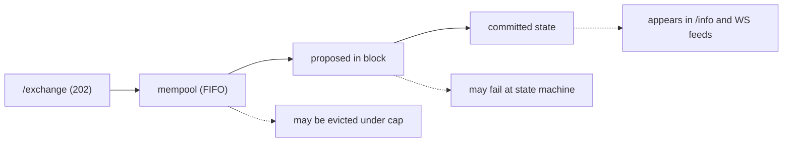
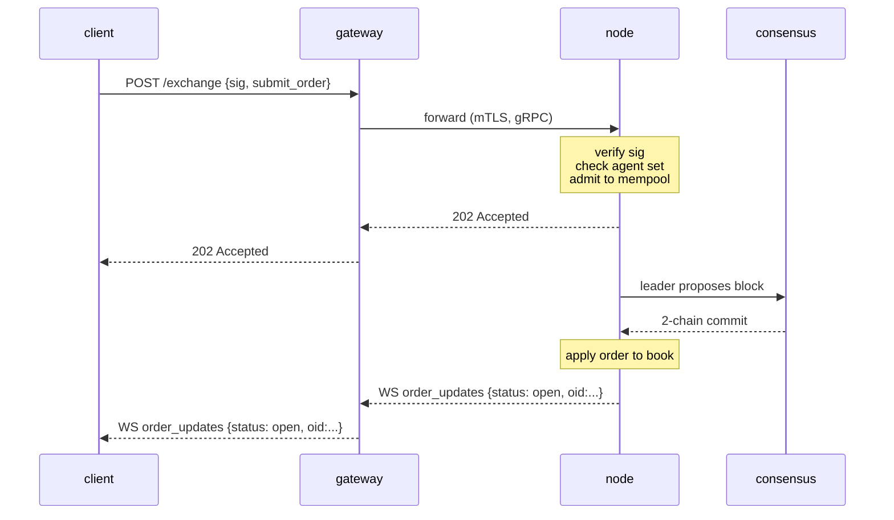

# `POST /exchange` — submit a signed action

:::info
**Status.** **stable** for the listed action variants. Endpoint shape committed for V1.
:::

## TL;DR {#tldr}

Every state-mutating **user** action — place order, cancel, vault deposit, agent
approval, staking, etc. — is a single EIP-712-signed JSON envelope sent to `POST
/exchange`. The action variant is selected by the `type` field. An **order**
returns `200 OK` with the synchronous assigned `oid` (the handler waits for
commit); every **other** action returns `202 Accepted` on admission, with commit
confirmation arriving through the [WS feed](../ws/subscriptions.md) or by polling.

:::warning
**User actions only.** `/exchange` is the public **user** write path. Privileged
/ system writes — oracle price submission, faucet credits, `SystemUserModify`,
`SystemSpotSend`, validator votes — are **never** on `/exchange`. They inject via
node-local queues gated by validator authority (see the
[non-bridged table](./exchange/transfers.md#non-bridged-actions) and the [faucet](./faucet.md#why-this-is-not-on-exchange)).
Posting a system action's native tag returns `400` with `ACTION_UNSUPPORTED`.
:::

## URL {#url}

```
POST  https://api.<net>.mtf.exchange/exchange
```

| Path | Wire shape |
|------|-----------|
| `POST /exchange` (gateway) | **MTF-native** (this document) |

The gateway serves the MTF-native `/exchange`. Running the node yourself, the same
native `/exchange` is served directly at `http://localhost:8080`.

## Request envelope {#request-envelope}

```json
{
  "signature": "0xabcd...1b",
  "nonce":     1735689600001,
  "action": {
    "type": "submit_order",
    "order": { /* one of the variants below */ }
  }
}
```

| Field | Type | Required | Description |
|-------|------|----------|-------------|
| `signature` | hex string, 65 bytes (130 hex chars; `0x` optional) | yes | secp256k1 ECDSA over the EIP-712 [typed-data digest](#signing) of the action's structured fields + `nonce`. `r ‖ s ‖ v`. Both legacy `v ∈ {27, 28}` and EIP-2098 `v ∈ {0, 1}` accepted. |
| `nonce` | uint64 | yes | Strictly-monotonic per actor. Conventionally `Date.now()`. Bound into the signed digest. See [idempotency](../../integration/idempotency.md). |
| `action` | object | yes | A tagged variant: `{ "type": "<snake_case_tag>", ... }`. See [Action catalog](#action-catalog) below. |
| `expires_after` | uint64 (ms) | no | **Optional** action expiry, in consensus milliseconds. Omit it or send `0` for the default (never expires) — that produces the exact same signed digest as before this field existed. A non-zero value is **signed into** the digest and the action is rejected once consensus time passes it. See [Optional action expiry](#optional-action-expiry-expiresafter). |

:::info
**No top-level `sender`.** The envelope carries no `sender` field. The account
whose state mutates is determined per action:
- **Required-owner actions** (`submit_order`, `cancel_order`) carry the owner
  *inside* the action body — `action.order.owner` / `action.cancel.owner`. The
  server recovers the signer from the signature and requires it to equal that
  `owner` **or** an approved [agent](../../concepts/agent-wallets.md) of it.
- **Optional-owner actions** — most other order / position actions
  (`batch_order`, `spot_order`, `modify`, `cancel_by_cloid`, `scale_order`,
  `chase_order`, `update_leverage`, RFQ, and more) — carry an **optional**
  `owner`. Omit it and the recovered signer is the actor; send it and an
  approved [agent](../../concepts/agent-wallets.md) of that `owner` can act
  **as** it. Some of these bind `owner` into the signed digest, some resolve it
  at admission only — each action's field table says which.
- **Sender-authorized-only actions** (governance, vault-leader, staking
  authority, …) carry **no** owner field at all: the recovered signer *is*
  always the actor, and action-level authorization (validator membership,
  vault-leader, etc.) runs at dispatch.
:::

The server reconstructs the EIP-712 typed struct from `action.type` +
`action.params` and recovers the signer over **those field values** — so the
`action.params` you send must carry the **same values** (and the same canonical
decimal strings) you put in the typed message you signed. A mismatch recovers a
different signer and the request is rejected `401`. See
[typed-data signing](../../integration/typed-data-signing.md).

## Signing {#signing}

The signature is a secp256k1 ECDSA recovery over a standard EIP-712 digest. Each
action is signed as **structured EIP-712 typed data** (`eth_signTypedData_v4`)
with a per-action primary type `MetaFluxTransaction:<Action>`, so a wallet renders
each field by name. The server reconstructs the typed struct from `action.type` +
`action.params`, recomputes the digest, and recovers the signer:

```
struct_hash = keccak256( typeHash(MetaFluxTransaction:<Action>) ‖ encodeData(fields) )
signed_hash = keccak256( 0x1901 ‖ domain_separator ‖ struct_hash )
```

where the domain separator is:

```
domain_separator = keccak256(
  keccak256("EIP712Domain(string name,string version,uint256 chainId,address verifyingContract)") ‖
  keccak256("MetaFlux") ‖
  keccak256("1") ‖
  chainId_as_uint256_be ‖
  address_zero_padded_to_32
)
```

The per-action type strings, the atomic `encodeData` rules, and worked examples
are in [typed-data signing](../../integration/typed-data-signing.md) — the single
signing scheme. A cross-implementation known-answer test pins each action's
digest.

:::info
**`sig_scheme` is vestigial.** Earlier builds carried a `sig_scheme` selector on
the envelope; it is no longer required and the server ignores it (typed-data
recovery runs unconditionally). **Omit it.** If present, the only accepted value
is `"typed"`.
:::

### Chain IDs {#chain-ids}

| Network | `chainId` |
|---------|-----------|
| Devnet (default) | `31337` |
| Testnet | `114514` |
| Mainnet | `8964` |

The signing-domain `chainId` **must equal the node's consensus `chain_id`** —
take it from the table above, or confirm it live with the `eth_chainId` call in
[networks](../../networks.md#summary). Signing against the wrong `chainId` returns `401` because the
recovered address differs from the action's `owner` (or, for sender-authorized
actions, recovers a phantom address that passes no authorization check). See
[networks](../../networks.md) for endpoints.

A `chainId` is a signing-domain value, not a chain identifier: two chains can
run the same one. To confirm WHICH chain an endpoint serves, read
[`chain_identity`](../rest/info/node.md#chain-identity) on `exchange_status`.

### Optional action expiry (`expiresAfter`) {#optional-action-expiry-expiresafter}

Any action may carry an optional expiry so it cannot be replayed or relayed late.
Send an `expires_after` (uint64 milliseconds) next to `action` / `nonce` /
`signature`, and set the **same** value in the signed typed message:

- **`0` or absent — the default.** The digest is **byte-for-byte identical** to
  the pre-existing one, so nothing changes for actions that don't opt in. Leave
  the field off entirely, or send `0`.
- **Non-zero.** The value is folded into the EIP-712 type string and appended as
  the final signed field (see
  [typed-data signing → action expiry](../../integration/typed-data-signing.md#action-expiry-expiresafter)),
  so the expiry is **signed and tamper-evident** — a relay can neither strip nor
  alter it. The action is rejected at submission if the expiry is already in the
  past, and dropped at execution if consensus time passes it before it commits.

:::info
**`expires_after` is a deadline, not a delay.** It is a consensus timestamp in ms,
not a duration. Send `0` or omit it for no expiry.
:::

## Numeric conventions {#numeric-conventions}

| Type | Wire form | Why |
|------|----------|-----|
| `uint64` ≤ 2^53 | JSON number | Safe in IEEE-754 |
| `uint64` > 2^53, `u128`, scaled integers | JSON string | Native JSON numbers silently lose precision past 2^53 |
| Address | hex string `"0x..."` | 20 bytes, 40 hex chars (with or without `0x`) |
| Booleans | `true` / `false` | Literal JSON |
| Optional fields | `null` or omit | Both accepted; `null` is canonical |

**Fixed-point fields.** Price and size fields are 8-decimal fixed-point integers; USDC amounts are 6-decimal base units. The value carries the scale, not the field name — e.g. `px = "10050000000"` means `100.50`. Always send as a string; the server parses to `u128`.

## Signed-by semantics {#signed-by-semantics}

An action is signed by the **master** key or by an approved
[agent wallet](../../concepts/agent-wallets.md). One rule decides which:

**An agent can sign an action only if that action carries an `owner` field.**

There is no top-level `sender` field and no account header. The node reads the
account from the action body. This gives exactly two classes.

| Class | How the node finds the account | Who can sign |
|-------|--------------------------------|--------------|
| **`master / agent`** | The action carries `owner`. | The `owner` key, or an approved agent of `owner`. |
| **`master only`** | The action has no `owner`. The signer **is** the account. | The account's own key. |

The field-level tables below call the second class **sender-authorized**. The two
names mean the same thing: no `owner` field, so the signer is the account. An
action with an **optional** `owner` is `master / agent` when you send `owner`,
and sender-authorized when you omit it.

For a `master / agent` action the node compares the recovered signer against
`owner`. A signer that is neither `owner` nor an approved agent of `owner` gets
`401`.

:::danger
**A `master only` action signed by an agent key does not fail. It acts on the
agent's own account.**

The node sets the account to the recovered signer. So an agent-signed
[`bridge_withdraw`](./exchange/transfers.md#bridge_withdraw) debits the **agent's** balance, not the master's,
and an agent-signed [`approve_agent`](./exchange/account.md#approve_agent) approves an agent of the
**agent**. You get no `401` and no error — you get the wrong account. Sign every
`master only` action with the master key.
:::

Each action's entry in the [catalog](#action-catalog) carries its class. The two
classes are the only values in the **Signed-by** column.

### Which actions accept an agent {#which-actions-accept-an-agent}

These actions carry an `owner`, so an approved agent can sign them. This list is
complete.

| Group | Actions |
|-------|---------|
| Perp orders | [`submit_order`](./exchange/orders.md#submit_order), [`batch_order`](./exchange/orders.md#batch_order), [`scale_order`](./exchange/orders.md#scale_order), [`chase_order`](./exchange/orders.md#chase_order), [`twap_order`](./exchange/orders.md#twap_order) — the last three take a spot pair too, see [the spot lane](../../concepts/order-types.md#synth-on-spot) |
| Cancels | [`cancel_order`](./exchange/orders.md#cancel_order), [`batch_cancel`](./exchange/orders.md#batch_cancel), [`cancel_by_cloid`](./exchange/orders.md#cancel_by_cloid), [`cancel_all_orders`](./exchange/orders.md#cancel_all_orders), [`cancel_scale`](./exchange/orders.md#cancel_scale), [`cancel_chase`](./exchange/orders.md#cancel_chase), [`twap_cancel`](./exchange/orders.md#twap_cancel), [`schedule_cancel`](./exchange/orders.md#schedule_cancel) |
| Amends | [`modify`](./exchange/orders.md#modify), [`batch_modify`](./exchange/orders.md#batch_modify) |
| Spot | [`spot_order`](./exchange/spot.md#spot_order), [`spot_cancel`](./exchange/spot.md#spot_cancel) |
| Margin | [`update_leverage`](./exchange/margin-risk.md#update_leverage), [`update_isolated_margin`](./exchange/margin-risk.md#update_isolated_margin), [`top_up_isolated_only_margin`](./exchange/margin-risk.md#top_up_isolated_only_margin), [`set_position_mode`](./exchange/account.md#set_position_mode) |
| Specialist venues | [`rfq_request`](./exchange/rfq-utility.md#rfq_request), [`rfq_quote`](./exchange/rfq-utility.md#rfq_quote), [`rfq_accept`](./exchange/rfq-utility.md#rfq_accept) — **the option trade path; all three refuse any market that is not a live option series** — and [`fba_submit`](./exchange/rfq-utility.md#fba_submit) |

**Every other action is `master only`.** That covers all fund movement
(withdrawals, transfers, vaults, Earn, staking) and all account control (agent
approval, sub-accounts, multi-sig, display name, referrer, builder-fee approval,
portfolio-margin enrolment, abstraction config, priority bids, encrypted orders).

On `submit_order` and `cancel_order` the `owner` field is **required**. On every
other action in the table above it is **optional**: omit it and the signer trades
for itself.

---

## Action catalog {#action-catalog}

Each variant is a tagged object `{ "type": "<snake_case_tag>", <flat body> }`. The
body keys are **flat under the action object** (there is no PascalCase `type` and
no universal `params` wrapper) — e.g. `submit_order` carries an `order` object,
`cancel_order` carries a `cancel` object, and the sender-authorized actions carry
a `params` object.

**Find your action in the tables below and click through.** Every action's
field-level definition lives on one page per lane:

| Page | Actions |
|---|---|
| [Perpetual orders](./exchange/orders.md) | place, cancel, modify, TWAP, scale, chase, triggers |
| [Spot trading](./exchange/spot.md) | `spot_order`, `spot_cancel` |
| [Spot margin & Earn](./exchange/spot-margin.md) | leveraged spot, and the lending pool that funds it |
| [Margin & risk](./exchange/margin-risk.md) | leverage, isolated margin, position mode |
| [RFQ & FBA](./exchange/rfq-utility.md) | quote requests, batch auctions |
| [Account & access](./exchange/account.md) | agent wallets, sub-accounts, multi-sig, margin mode |
| [Staking](./exchange/staking.md) | delegate, undelegate, claim |
| [Vaults](./exchange/vaults.md) | create, deposit, redeem, configure |
| [Transfers & bridge](./exchange/transfers.md) | `send_asset`, Core↔EVM, withdraw to an external chain |
| [Priority & encrypted](./exchange/utility.md) | `priority_bid`, `submit_encrypted_order` |
| [Spot deployment](./exchange/deploy-spot.md) | MIP-1 — register a token, list a pair |
| [Perp deployment](./exchange/deploy-perp.md) | MIP-3 — deploy a perpetual market |

:::warning
**`px` / `size` are unsigned fixed-point `u64` on the native wire**, sent as JSON
numbers (the node decodes them as `u64`, then widens internally). Addresses are
`0x`-hex (40 chars); `cloid` is `0x` + 32 hex chars (16 bytes).
:::

### Order placement & lifecycle {#order-placement--lifecycle}

:::tip
**New here? Read [placing orders](../../integration/placing-orders.md) first.**
That page starts with one perp limit order end-to-end, then tiers the table below
so you can skip most of it on a first integration.
:::

| `type` | Purpose | Signed-by | Idempotent |
|--------|---------|-----------|-----------|
| [`submit_order`](./exchange/orders.md#submit_order) | Place one order | master / agent | by `cloid` |
| [`batch_order`](./exchange/orders.md#batch_order) | N orders / one signature | master / agent | per-leg `cloid` |
| [`cancel_order`](./exchange/orders.md#cancel_order) | Cancel by `oid` | master / agent | yes |
| [`batch_cancel`](./exchange/orders.md#batch_cancel) | N cancels / one signature | master / agent | yes |
| [`cancel_by_cloid`](./exchange/orders.md#cancel_by_cloid) | Cancel by client order id | master / agent | yes |
| [`cancel_all_orders`](./exchange/orders.md#cancel_all_orders) | Cancel all (optional asset filter) | master / agent | yes |
| [`modify`](./exchange/orders.md#modify) | Amend a resting order's px / size | master / agent | yes |
| [`batch_modify`](./exchange/orders.md#batch_modify) | N modifies / one signature | master / agent | per-entry |
| [`schedule_cancel`](./exchange/orders.md#schedule_cancel) | Future-block cancel-all trigger | master / agent | yes |
| [`twap_order`](./exchange/orders.md#twap_order) | Schedule a sliced (TWAP) order | master / agent | by `twap_id` |
| [`twap_cancel`](./exchange/orders.md#twap_cancel) | Cancel a running TWAP parent | master / agent | yes |
| [`scale_order`](./exchange/orders.md#scale_order) | Place an N-rung ladder / one signature | master / agent | by `cloid` |
| [`cancel_scale`](./exchange/orders.md#cancel_scale) | Cancel a whole ladder by its shared `cloid` | master / agent | yes |
| [`chase_order`](./exchange/orders.md#chase_order) | Place a self-repricing chase leg / one signature | master / agent | by `cloid` |
| [`cancel_chase`](./exchange/orders.md#cancel_chase) | Cancel a chase by its handle | master / agent | yes |

### Spot trading {#spot-trading}

Spot is a token-for-token CLOB (no leverage, no positions) — separate books and
balances from perps. A resting spot order locks the funds it would owe on fill
into a **reserved balance**: a `bid` reserves **quote** (its notional at the
limit price), an `ask` reserves the **base** it offers. Order size is **clamped
at admission** to what your balance funds, and fees are taken from the leg each
side receives. Both actions are **sender-authorized by default** (omit `owner`
and the signer is the trader); both also take an **optional digest-bound `owner`**
so an approved agent can act for the account it is approved for. See
[spot trading](../../products/spot.md) for the full conceptual model.

| `type` | Purpose | Signed-by | Idempotent |
|--------|---------|-----------|-----------|
| [`spot_order`](./exchange/spot.md#spot_order) | Place one spot order | master / agent | by `cloid` |
| [`spot_cancel`](./exchange/spot.md#spot_cancel) | Cancel a resting spot order by `oid` | master / agent | yes |

### Spot margin & Earn {#spot-margin--earn}

:::info
**Spot margin is cross-collateralized.** Leveraged spot ([spot margin](../../products/spot-margin.md)) draws its margin from your **one unified USDC account** — the same collateral that backs your perpetual positions — and its lending supply side is [Earn](../../concepts/earn.md). A pair enables only once governance calibrates its per-pair risk parameters. No pair is calibrated yet, so treat the lane as a **preview**: forced liquidation settles through the same path as a voluntary close (see [Liquidation](../../products/spot-margin.md#liquidation)), but per-pair maintenance ratios are still being calibrated. Do not assume production safety at scale.
:::

A leveraged spot position is **cross-margined against your one unified USDC account** — its initial-margin requirement is held against your account-wide free collateral, exactly like a perpetual open, so there is **no separate collateral deposit**. The buy is funded 100% by a quote borrow drawn from the pair's Earn pool, and the bought base is held **segregated** on the margin account (never in your spendable balances). Because collateral is shared, an open spot-margin position reduces your perpetual margin headroom, and a perpetual loss reduces the collateral that backs the spot-margin position (see [margin modes](../../concepts/margin-modes.md)). Earn is the other side — suppliers deposit the lendable quote for pool shares, and the borrow interest spot-margin traders pay lifts each share's value. All actions here are **sender-authorized** (the signer is the actor; there is no `owner`). `amount` / `shares` / `borrow` are decimals sent as JSON strings; `size` / `limit_px` are `u64` on the `1e8` / raw-lot planes like a [`spot_order`](./exchange/spot.md#spot_order). Each returns the [`202 Accepted`](#202-accepted--non-order-admission) admission envelope (not a synchronous `oid`); observe the committed outcome via [`/info` `spot_margin_state`](./info/spot.md#spot_margin_state) and [`earn_state`](./info/spot.md#earn_state).

| `type` | Purpose | Signed-by | Idempotent |
|--------|---------|-----------|-----------|
| [`spot_margin_open`](./exchange/spot-margin.md#spot_margin_open) | Borrow + IOC-buy base on leverage | master only | no |
| [`spot_margin_close`](./exchange/spot-margin.md#spot_margin_close) | Sell held base, repay the loan | master only | no |
| [`earn_deposit`](./exchange/spot-margin.md#earn_deposit) | Supply quote into the lending pool for shares | master only | no |
| [`earn_withdraw`](./exchange/spot-margin.md#earn_withdraw) | Redeem pool shares (idle-bounded) | master only | no |
| [`spot_margin_deposit`](./exchange/spot-margin.md#spot_margin_deposit) ⚠️ | **Retired.** It commits nothing — there is no separate collateral bucket | master only | — |
| [`spot_margin_withdraw`](./exchange/spot-margin.md#spot_margin_withdraw) ⚠️ | **Retired.** It commits nothing — withdraw USDC from your account instead | master only | — |

**Why a pool pays nothing yet.** A pool auto-creates on the first
[`earn_deposit`](./exchange/spot-margin.md#earn_deposit) with a borrow rate of **zero**. Nothing on the
public path can change that rate. Only the validator action **`createEarnPool`
(201)** sets it, and that action is a ⅔-stake governance vote — it is
[not on `/exchange`](./exchange/transfers.md#non-bridged-actions). Until that vote passes, share value
never moves and a deposit earns exactly 0. The same vote also blesses the asset
as lendable and sets the pool's `reserve_factor_bps`. A later vote on an existing
pool reconfigures only those two numbers; supply, shares and the borrow index are
untouched. The rate is capped at 20000 bps per year (200%).

### Spot deployment (MIP-1) {#spot-deployment}

Six **sender-authorized** actions let any account register a spot token, list a
pair for it, price it, open it, and mint its genesis supply. The signer *is* the
deployer — there is no `owner` field, and every later call on a token or pair is
refused unless the signer is the deployer of record. See
[MIP-1](../../mip/mip-1.md) for the conceptual model.

Registering a token or a pair **charges a deploy fee at the moment it commits**.
The fee is the current Dutch-clock ask on that stream, and it is paid from your
**free collateral**, not from a pre-posted bid. You bound it with
`max_deploy_fee`: if the ask is above the value you signed, the call is rejected
and nothing is charged. There is no bid, no escrow and no refund step anywhere in
this lane.

| `type` | Purpose | Signed-by | Charges a deploy fee |
|--------|---------|-----------|----------------------|
| [`spot_register_token`](./exchange/deploy-spot.md#spot_register_token) | Register a new spot token | deployer (sender) | yes — `TokenRegister` stream |
| [`spot_register_pair`](./exchange/deploy-spot.md#spot_register_pair) | List a `(base, quote)` trading pair | deployer (sender) | yes — `SpotPairDeploy` stream |
| [`spot_set_pair_params`](./exchange/deploy-spot.md#spot_set_pair_params) | Set the pair's fee tier + min notional | pair deployer | no |
| [`spot_set_pair_active`](./exchange/deploy-spot.md#spot_set_pair_active) | Open or close the pair to new orders | pair deployer | no |
| [`spot_seed_holders`](./exchange/deploy-spot.md#spot_seed_holders) | Stage genesis holder rows (repeatable) | token deployer | no |
| [`spot_finalize_supply`](./exchange/deploy-spot.md#spot_finalize_supply) | Check the staged total, then mint once | token deployer | no |

Every action here returns the
[`202 Accepted`](#202-accepted--non-order-admission) admission envelope. Confirm
the allocated ids and the committed spec through
[`/info` `spot_meta`](./info/spot.md).

### Perp deployment (MIP-3) {#perp-deployment}

Eleven **sender-authorized** actions let an account register a perp market in its
own dex, configure it, open it, and price it. The signer *is* the deployer. After
the first registration, only that market's deployer — or a
[sub-deployer](./exchange/deploy-perp.md#perp_set_sub_deployers) holding the matching permission bit — may
call the rest. A market lands in the deployer's own dex, never in the primary
dex. See [MIP-3](../../mip/mip-3.md) and
[the field-level sections](./exchange/deploy-perp.md).

Every action here is refused unless governance leaves the `mip3_enabled`
off-switch open, and unless the target is a MIP-3 deployer market. A core market
listed by governance is not one, so this lane cannot reach it.

| `type` | Purpose | Signed-by | Charges a deploy fee |
|--------|---------|-----------|----------------------|
| [`perp_register_asset`](./exchange/deploy-perp.md#perp_register_asset) | Register a perp market, and create your dex on the first call | deployer (sender), or a delegate holding bit 8 | yes — Dutch-clock ask |
| [`perp_set_leverage`](./exchange/deploy-perp.md#perp_set_leverage) | Set max leverage | deployer, or bit 1 | no |
| [`perp_set_fee_tier`](./exchange/deploy-perp.md#perp_set_fee_tier) | Set the taker, maker and deployer fees | deployer, or bit 2 | no |
| [`perp_set_maker_rebate`](./exchange/deploy-perp.md#perp_set_maker_rebate) | Set the maker rebate | deployer, or bit 3 | no |
| [`perp_set_min_size`](./exchange/deploy-perp.md#perp_set_min_size) | Set the minimum order size | deployer, or bit 4 | no |
| [`perp_activate_market`](./exchange/deploy-perp.md#perp_activate_market) | Open the market to trading | deployer, or bit 5 | no |
| [`perp_deactivate_market`](./exchange/deploy-perp.md#perp_activate_market) | Close the market, and cancel every resting order and parked trigger on it | deployer, or bit 6 | no |
| [`perp_set_sub_deployers`](./exchange/deploy-perp.md#perp_set_sub_deployers) | Grant a delegate every bit, or revoke it | deployer only | no |
| [`perp_set_sub_deployer_perms`](./exchange/deploy-perp.md#perp_set_sub_deployers) | Grant a delegate an exact permission mask | deployer only | no |
| [`mip3_set_oracle_px`](./exchange/deploy-perp.md#mip3_set_oracle_px) | Push the market price | deployer, or bit 0 | no |
| [`perp_set_oracle`](./exchange/deploy-perp.md#perp_set_oracle) ⚠️ | **Retired.** It writes a mask nothing reads | deployer | no |

**A delegate cannot delegate.** Both `perp_set_sub_deployers` and
`perp_set_sub_deployer_perms` need the deployer's own key. A delegate holding
every other bit still cannot grant or edit a delegation.

### Margin & risk {#margin--risk}

| `type` | Purpose | Signed-by |
|--------|---------|-----------|
| [`update_leverage`](./exchange/margin-risk.md#update_leverage) | Change leverage / iso toggle on an asset | master / agent |
| [`update_isolated_margin`](./exchange/margin-risk.md#update_isolated_margin) | Signed isolated-margin delta | master / agent |
| [`top_up_isolated_only_margin`](./exchange/margin-risk.md#top_up_isolated_only_margin) | Strict-iso margin top-up | master / agent |
| [`user_portfolio_margin`](./exchange/margin-risk.md#user_portfolio_margin) | Enroll / unenroll PM | master only |
| [`pm_unenroll`](./exchange/margin-risk.md#pm_unenroll) | Unenroll from PM — a no-params alias for `user_portfolio_margin` with `enroll: false` | master only |
| [`borrow_lend`](./exchange/margin-risk.md#borrow_lend) | Supply to, or draw from, the BOLE liquidation backstop pool | master only |

### RFQ, FBA & utility {#rfq-fba--utility}

Request-for-quote ([RFQ](../../concepts/rfq.md)) block trading, the
frequent-batch-auction ([FBA](../../concepts/fba.md)) entry, and the deliberate
no-op. See [the field-level sections](./exchange/rfq-utility.md) for the wire
planes and the digest-bound `owner` rule.

The three RFQ actions are the **option trade path**. They take an
[option series](./info/options.md#option_series) `signing_id` as the market, and they
refuse every other market. See [options](../../products/options.md).

| `type` | Purpose | Signed-by |
|--------|---------|-----------|
| [`rfq_request`](./exchange/rfq-utility.md#rfq_request) | Open an RFQ session (taker) | master / agent (`owner` digest-bound) |
| [`rfq_quote`](./exchange/rfq-utility.md#rfq_quote) | Quote onto an open RFQ (maker) | master / agent (`owner` digest-bound) |
| [`rfq_accept`](./exchange/rfq-utility.md#rfq_accept) | Accept a quote and settle (taker) | master / agent (`owner` digest-bound) |
| [`fba_submit`](./exchange/rfq-utility.md#fba_submit) | Submit into a batch-auction window | master / agent |
| [`noop`](./exchange/rfq-utility.md#noop) | Deliberate no-op (nonce burn / keepalive) | master only |

### Account management {#account-management}

| `type` | Purpose | Signed-by |
|--------|---------|-----------|
| [`approve_agent`](./exchange/account.md#approve_agent) | Approve an agent wallet | master only |
| [`set_display_name`](./exchange/account.md#set_display_name) | Set the account handle | master only |
| [`set_referrer`](./exchange/account.md#set_referrer) | Bind to a referrer address | master only |
| [`approve_broker_fee`](./exchange/account.md#approve_builder_fee) | Approve a broker fee ceiling | master only |
| [`claim_referral_rewards`](./exchange/account.md#claim_referral_rewards) | Claim accrued referral credit | master only |
| [`claim_broker_rewards`](./exchange/account.md#claim_builder_rewards) | Claim accrued broker-code credit | master only |
| [`approve_builder_fee`](./exchange/account.md#approve_builder_fee) | The older spelling of `approve_broker_fee`. It still decodes and behaves identically | master only |
| [`claim_builder_rewards`](./exchange/account.md#claim_builder_rewards) | The older spelling of `claim_broker_rewards`. It still decodes and behaves identically | master only |
| [`create_sub_account`](./exchange/account.md#create_sub_account) | Open a sub-account under the master | master only |
| [`sub_account_transfer`](./exchange/account.md#sub_account_transfer) | Move perp cross-collateral parent ↔ sub | master only |
| [`sub_account_spot_transfer`](./exchange/account.md#sub_account_spot_transfer) | Move a spot token balance parent ↔ sub | master only |
| [`convert_to_multi_sig_user`](./exchange/account.md#convert_to_multi_sig_user) | Lift account to multi-sig | master only |
| [`multi_sig`](./exchange/account.md#multi_sig) | Run one inner action as a multi-sig account, carrying the roster signatures | any submitter; the roster authorizes |
| [`set_position_mode`](./exchange/account.md#set_position_mode) | Toggle one-way / hedge position mode | master / agent |

### Staking & abstraction {#staking--abstraction}

| `type` | Purpose | Signed-by |
|--------|---------|-----------|
| [`c_deposit`](./exchange/staking.md#c_deposit) | Move spot MTF into the free staking balance | master only |
| [`c_withdraw`](./exchange/staking.md#c_withdraw) | Move the free staking balance back to spot MTF | master only |
| [`token_delegate`](./exchange/staking.md#token_delegate) | Delegate / undelegate stake | master only |
| [`claim_rewards`](./exchange/staking.md#claim_rewards) | Claim staking rewards | master only |
| [`link_staking_user`](./exchange/staking.md#link_staking_user) | Alias a staking target | master only |
| [`user_set_abstraction`](./exchange/account.md#user_set_abstraction) | Self-scope abstraction config | master only |
| [`agent_set_abstraction`](./exchange/account.md#agent_set_abstraction) | Agent-scope abstraction config | master only |
| [`priority_bid`](./exchange/utility.md#priority_bid) | Pay a priority fee for block-front placement | master only |

### Encrypted orders {#encrypted-orders}

| `type` | Purpose | Signed-by |
|--------|---------|-----------|
| [`submit_encrypted_order`](./exchange/utility.md#submit_encrypted_order) | Threshold-encrypted order ciphertext | master only |
| [`encrypted_order_submit`](./exchange/utility.md#encrypted_order_submit) ⚠️ | **Retired alias.** Refused at every height; post the canonical name | — |

### Vaults {#vaults}

| `type` | Purpose | Signed-by |
|--------|---------|-----------|
| [`create_vault`](./exchange/vaults.md#create_vault) | Leader creates a vault | master only |
| [`vault_transfer`](./exchange/vaults.md#vault_transfer) | Leader seed transfer | master only |
| [`vault_modify`](./exchange/vaults.md#vault_modify) | Leader-only vault config update | master only |
| [`vault_distribute`](./exchange/vaults.md#vault_distribute) | Follower deposit into a vault, from the signer's own account | master only |
| [`vault_withdraw`](./exchange/vaults.md#vault_withdraw) | Follower share redemption | master only |
| [`register_metaliquidity_operator`](./exchange/vaults.md#register_metaliquidity_operator) | Leader grants or revokes an operator key on a Metaliquidity vault | vault leader only |

### Transfers {#transfers}

Value moves inside the Core ledger: to another account, or between your own spot
and perp balances. Both are **sender-authorized** — there is no `owner` field, so
an agent signature moves the AGENT's own balance, never the master's.

| `type` | Purpose | Signed-by |
|--------|---------|-----------|
| [`send_asset`](./exchange/transfers.md#send_asset) | Send one token to another account | master only |
| [`usd_class_transfer`](./exchange/transfers.md#usd_class_transfer) | Move your own USDC between spot and perp | master only |

**`spot_send` and `usd_send` are NOT actions.** They are ledger record kinds on
the [`ledger_updates`](../ws/subscriptions.md#ledger_updates) feed, which say what
a committed transfer DID. Posting either name gets `unknown variant`, the same
error a misspelt action gets.

### Bridge withdrawals {#bridge-withdrawals}

Value leaves the Core ledger for MetaFluxEVM, or leaves the chain over
[MetaBridge](../../bridge/index.md). Every action here is **`master only`**: the
recovered signer is the account debited. An agent signature debits the agent's
own account, never the master's.

| `type` | Purpose | Signed-by |
|--------|---------|-----------|
| [`core_evm_transfer`](./exchange/transfers.md#core_evm_transfer) | Move a spot asset from the Core ledger to MetaFluxEVM, optionally with an EVM payload | master only |
| [`send_to_evm_with_data`](./exchange/transfers.md#send_to_evm_with_data) ⚠️ | The same Core → EVM move in the Hyperliquid-compatible field shape. **Live.** It refuses five things Hyperliquid accepts and ignores — see the section | master only |
| [`bridge_withdraw`](./exchange/transfers.md#bridge_withdraw) | Withdraw USDC cross-collateral to an external chain | master only |
| [`withdraw`](./exchange/transfers.md#withdraw) ⚠️ | **Retired.** The legacy CCTP withdrawal. It is refused at commit, and always has been | master only |

Both Core → EVM rows reach the same lane and land the same credit.
[Which one to use](./exchange/transfers.md#core-evm-which-action) is decided by one thing: the field
shape your client already has.

### Not on the public `/exchange` path {#not-on-the-public-exchange-path}

These are draft / legacy action names from earlier docs. Most are **not bridged
on the MTF-native `/exchange` handler** — they are either privileged / system
writes that must never transit the public user path, or recognized-but-unmapped
schema stubs, and posting them returns `400`. **Read the error code, not just the
status.** A name the action enum does not carry fails decode and returns
`INVALID_REQUEST` (`unknown variant`); a name the enum does carry but the public
path refuses returns `ACTION_UNSUPPORTED`. The one exception below is `MultiSig`,
which **is** bridged (its native tag is `multi_sig`). See
[the table below](./exchange/transfers.md#non-bridged-actions) for the disposition of each, and
[governance actions](#governance-actions-refused) for the names that decode but
never execute here.

| Draft name | Native tag (if recognized) | Why not bridged |
|-----------|----------------------------|-----------------|
| `UpdateMarginMode` | — | No native action; isolation is the `is_isolated` flag on `update_leverage` |
| `MultiSig` | [`multi_sig`](./exchange/account.md#multi_sig) | **Bridged and executing** — the collect-and-execute wrapper is the live way a multi-sig account acts. It verifies the roster signatures and runs the inner action. (A non-wrapped action from a multi-sig account is still rejected.) |
| `RegisterReferrer` | — | Not bridged (referrer is bound by address via `set_referrer`) |
| `UsdcTransfer` / `SpotTransfer` | — | User-to-user transfer flows not bridged |
| `WithdrawUsdc` | — | Draft name; external withdrawal is [`bridge_withdraw`](./exchange/transfers.md#bridge_withdraw) |
| (legacy CCTP withdraw) | [`withdraw`](./exchange/transfers.md#withdraw) | **Retired** — admitted, then rejected at every commit since genesis (`"withdraw3 disabled; use bridge_withdraw"`). Use [`bridge_withdraw`](./exchange/transfers.md#bridge_withdraw) |
| (BOLE pool) | [`borrow_lend`](./exchange/margin-risk.md#borrow_lend) | **Bridged and live** — `params.kind` `"Lend"` / `"UnLend"` / `"Repay"` are open to any account; `"Borrow"` is refused unless the sender is an approved liquidator |
| (vault distribute) | [`vault_distribute`](./exchange/vaults.md#vault_distribute) | **Bridged and live** — a follower's own self-service deposit; see [vaults](../../concepts/vaults.md#depositing) |
| (PM lifecycle) | `pm_enroll` / [`pm_unenroll`](./exchange/margin-risk.md#pm_unenroll) | `pm_enroll` has no native tag — enroll via [`user_portfolio_margin`](./exchange/margin-risk.md#user_portfolio_margin). `pm_unenroll` **is** a bridged alias (no params) for the same action's `enroll:false` form. `pm_rebalance` is **retired** — rejected as an unknown action |
| (cross-chain) | — | **Not an `/exchange` action at all.** `cross_chain_send` is not in the action enum, so it fails decode and returns `400` `INVALID_REQUEST` (`unknown variant`) — the same answer a misspelt action name gets, **not** `ACTION_UNSUPPORTED`. Cross-chain transfer is a different wire: `CrossChainSend` is [CoreWriter action 19](../../evm/interacting-with-core.md), called from MetaFluxEVM |

### Governance and validator actions: in the enum, refused at the door {#governance-actions-refused}

A governance or validator action **decodes** on `/exchange` but never
**executes** there. This matters because the two failures look nothing alike,
and integrators read the first one as encouragement:

- A name the enum does not know fails **decode**: `400` `INVALID_REQUEST`,
  `unknown variant`. The error lists every accepted name, and the names below
  are in that list.
- A name from this section **decodes**, so it gets past the schema, and then
  hits the refusal: `400` `ACTION_UNSUPPORTED`.

**Read the code, not the message.** `ACTION_UNSUPPORTED` is the contract. The
text behind it differs by tag, and there are at least three of them:
`governance actions are not accepted on this surface`,
`unsupported action: unsupported native action variant: <tag>`, and
`action does not support typed signing`. Match on the code; a substring match on
any one of those sentences fails for most of the table.

**Where the refusal lands also differs.** Most of these tags are refused after
signature recovery. A few are refused before it, so a valid-looking
`AUTH_BAD_SIGNATURE` for one tag and an immediate `ACTION_UNSUPPORTED` for
another say the same thing: not open. Neither is progress.

**Reaching `ACTION_UNSUPPORTED` is not progress.** A valid signature from a real
validator key gets the same answer. The public `/exchange` path carries **no**
governance or validator write, whoever signs it. These actions enter through
the node's own operator lane, which only a validator operator has. Each accepted
vote is **one vote**: the change enacts only when ⅔ of stake has voted for a
**byte-identical** payload. Two validators who differ by one character vote for
two different proposals and neither reaches quorum.

The table lists every such tag the node accepts today. **No client sends
these.** They are listed so that a reader who meets one in the `unknown variant`
list, or in [`gov_history`](./info/governance.md), knows what it is.

| Native tag | Who | What it does |
|-----------|-----|--------------|
| `gov_vote` | Validator, ⅔ stake | Aye or nay on a `gov_propose` proposal. ⅔ aye enacts it; ⅔ nay discards it |
| `vote_global` | Validator, ⅔ stake | Sets one global parameter directly, with no proposal step |
| `set_mark_mode` | Validator, ⅔ stake | Sets a perpetual market's mark mode: automatic, oracle-synced, or a fixed price |
| `set_pm_shock_grid` | Validator, ⅔ stake | Sets the price and volatility shock grids that portfolio margin stresses positions against |
| `arm_features` | Validator, ⅔ stake | Arms protocol features to activate at a future height or time. The signature binds the feature list, so a replayed vote cannot arm a different list |
| `approve_upgrade` | Validator, ⅔ stake | Schedules or cancels the coordinated halt at which every validator swaps binaries |
| `c_validator` | The validator itself | Maintains its own record: commission, active flag, self-jail, unjail, deregister. Not a vote; one signed action applies. A commission **raise** waits out a notice period; a cut applies at once |
| `vote_app_hash` | The validator node itself | The checkpoint state-hash vote every validator node emits on its own after each checkpoint. No person casts it |
| `gov_action` | A validator, on its own node only | Carries one signed governance or validator action. The node accepts it only from its own machine, so a public caller gets `AUTH_UNAUTHORIZED`, not `ACTION_UNSUPPORTED` |

Two more tags in this set, `set_metaliquidity_set` and `gov_adjust_spot_value`,
keep their payloads and signing types below, because their `value` hashing rule
is the one operators get wrong. The types are **consensus-frozen**. They are not
an invitation to post the action to `/exchange`.

| Native tag | Payload | Effect |
|-----------|---------|--------|
| `set_metaliquidity_set` | `{"address": "0x<hex>", "allowed": <bool>}` | Adds (`true`) or removes (`false`) an account from the Metaliquidity operator set. This is the set a vault leader's [`register_metaliquidity_operator`](./exchange/vaults.md#register_metaliquidity_operator) grant is checked against |
| `gov_adjust_spot_value` | `{"account": "0x<hex>", "value": "<decimal>"}` | Sets that account's cross-account USDC value to `value`. A **target**, not a delta |

```text
MetaFluxTransaction:SetMetaliquiditySet(string metafluxChain,address account,bool allowed,uint64 nonce)
MetaFluxTransaction:GovAdjustSpotValue(string metafluxChain,address account,string value,uint64 nonce)
```

:::warning
**`gov_adjust_spot_value.value` is hashed VERBATIM.** It is a whole-USDC decimal
string, and the digest takes `keccak256` of the **exact bytes you send**. The
chain does not re-parse or re-format it, so `"100"`, `"100.0"` and `"100.00"` are
three different signatures and three different votes. Send the signed string
through byte for byte: do not trim a trailing zero, do not let a JSON library
round-trip it through a float, and do not normalize it.

The `value` also **discriminates the proposal** — the vote is tallied against the
decimal it decodes to, so a differently-scaled spelling is a different proposal.
Agree the exact figure and its scale before the vote, and have every validator
send that one spelling.
:::

Both payloads reject the zero address.

---

## Response {#response}

### The envelope {#response-envelope}

Every `/exchange` response is one envelope, the same one
[`/info`](./info.md#envelope) answers. A success carries `data`. A failure
carries `error`. **The two keys never appear together.**

```json
{ "data": { /* payload */ } }
```

```json
{
  "error": {
    "code":    "ORDER_INVALID_PRICE",
    "message": "price off grid: 12345 is not a multiple of tick_size 100",
    "details": { "field": "px", "limit": "100", "actual": "12345" }
  }
}
```

`code` is the stable contract — **match on it**. `message` is prose and can
change in any release — **never match on it**. `details` is present only when
the rejection names a bound, and is omitted rather than sent as `{}`. Every
code, its status and the action to take are in the
[error reference](../errors.md).

The HTTP status keeps its normal meaning. It does not replace the envelope, and
the envelope does not replace it.

The payload inside `data` depends on the action class:

- **Order-type actions** — [`submit_order`](./exchange/orders.md#submit_order),
  [`batch_order`](./exchange/orders.md#batch_order), [`spot_order`](./exchange/spot.md#spot_order),
  [`scale_order`](./exchange/orders.md#scale_order), [`chase_order`](./exchange/orders.md#chase_order) → `200 OK` with a
  `statuses` array (the handler **waits** for commit + dispatch and returns the
  real assigned `oid`).
- **All other actions** → the admission payload: `200 OK` when the commit is
  observed inside the wait window, `202 Accepted` when it is not. Treat both as
  admitted, and read `committed`.
- **Any admission-time rejection** → the `error` envelope, at the status its
  code maps to.

### `200 OK` — order path (synchronous oid) {#200-ok--order-path-synchronous-oid}

An order-type action blocks up to the node's order-wait window (default 5 s) so
the response carries the real `oid` + resting/filled status. On timeout it
returns a `pending` entry — **never a fabricated oid**.

**The echoed `oid` is a decimal-digit STRING.** Every id on a response is, so a
JavaScript client cannot lose digits — see
[Ids and wire shapes](../../changelog/ids-and-wire-shapes.md#id-strings). The `oid` you
put inside a SIGNED cancel or modify payload stays a `uint64` number: the typed
digest binds `uint64 oid` and is consensus-frozen. A
`batch_order` / `scale_order` resolves to **one entry per placed leg or rung**; a
single order to one entry.

```json
{ "data": { "statuses": [ { "resting": { "oid": "12345", "cloid": "0x..." } } ] } }
```

### Per-order `statuses` {#per-order-statuses}

`statuses` holds one entry per leg, in input order. Each entry is a single-key
object naming the leg's outcome:

```json
{ "resting": { "oid": "12345", "cloid": "0x..." } }                     // posted to book (cloid echoed only here, only if sent)
{ "filled":  { "oid": "12345", "total_sz": "100000000", "avg_px": "10050000000" } }  // matched
{ "error":   { "code": "MARGIN_INSUFFICIENT", "message": "..." } }     // this leg was rejected
{ "noop":    { "reason": "position already flat, nothing to reduce" } } // accepted, and it changed nothing
{ "pending": { "action_hash": "0x<keccak>", "nonce": 1735689600001 } }  // admitted but no commit seen in the wait window
```

#### `noop` — accepted, and it did nothing {#statuses-noop}

A `reduce_only` order against a position that is already flat, or one whose
reducible size clamps to zero, is **accepted**. It burns the nonce, it places
nothing, and there is nothing left for it to reduce.

**`noop` is a success, and it MUST NOT be retried.** That is the whole reason it
is not an `error`. The two outcomes need opposite handling:

| Entry | What happened | What to do |
|---|---|---|
| `error` | The leg was refused. Nothing is on the book | Fix the cause named by `code`, then resend |
| `noop` | The leg was accepted and had no effect | Nothing. Re-read the position before you size another reduce |

`reason` is free prose that says which no-op it was — an already-flat leg, or a
size that clamped to zero. **Branch on the `noop` key, never on `reason`**, the
same rule that says match an `error` on `code` and never on `message`.

A `noop` entry carries **no `oid`**: no order was created, so no id was
assigned. Do not read one out of it and do not cancel against one.

**A failed leg carries the SAME error object as the envelope** — the same
`code`, the same prose `message`, and the same optional `details`. There is one
error shape on this API, at both levels. So the leg handler and the envelope
handler are the same function:

```json
{
  "data": {
    "statuses": [
      { "resting": { "oid": "12345", "cloid": "0x...aa" } },
      { "error": {
          "code":    "ORDER_INVALID_PRICE",
          "message": "price off grid: 12345 is not a multiple of tick_size 100",
          "details": { "field": "px", "limit": "100", "actual": "12345" }
      } }
    ]
  }
}
```

Note where that response sits: it is a **success** envelope. The action was
admitted and ran, so the top level carries `data` and status `200`. One leg
failed inside it. **A `200` does not mean every leg rested** — walk the array.

#### Per-leg failures happen only in an UNGROUPED batch {#statuses-grouping}

| `grouping` | Behaviour | Where a failure appears |
|------------|-----------|-------------------------|
| `"na"` (default), and every single-order action | **Per-leg.** Each leg runs its own gate. A bad leg does not roll back the good ones | Inside `statuses`, as that leg's `error` entry. The envelope is still a success |
| `"normalTpsl"`, `"positionTpsl"` | **ATOMIC.** All-or-nothing. If any leg cannot be admitted — including a protective leg that cannot park — the whole action is rejected and **nothing is placed** | At the ACTION level: the envelope carries `error`, and there is **no** `statuses` array |

:::danger
**A grouped batch never reports a per-leg failure.** Do not write a handler that
looks for one — on a grouped batch there is no `statuses` array to walk when it
fails. Read `error.code` on the envelope instead.

The reason the grouped batch is atomic: per-leg behaviour could fill the entry
leg and fail the protective leg, and leave a position with no stop. A grouped
batch places the whole family or places nothing.
:::

A `pending` entry means the action was admitted and may still commit later.
There is **no `/info` query that takes an `action_hash`** — track the order on
the [`order_updates`](../ws/subscriptions.md#order_updates) WS channel, which
carries the committed outcome including a `rejected` status.

### `202 Accepted` — non-order admission {#202-accepted--non-order-admission}

Every non-order action (cancel, margin, vault, staking, governance, …) returns
the admission payload. The status code is `200 OK` when the action commits
inside the wait window and `202 Accepted` when it does not; the body is the same
either way:

```json
{
  "data": {
    "accepted":      true,
    "mempool_depth": 3,
    "nonce":         1735689600001,
    "action_hash":   "0x<action_hash>"
  }
}
```

`mempool_depth` is informational at admission time. `action_hash` is the deterministic identifier of the submission. It is `0x` + `keccak256` of the exact signed `action` bytes concatenated with the sender address (20 bytes) and the nonce (8 bytes, big-endian). Because the sender and nonce are bound into the hash, two submissions with byte-identical `action` params produce **different** `action_hash` values, so a resubmit never collides with an earlier one.

### `accepted` is not `committed` {#accepted-is-not-committed}

:::danger
**`"accepted": true` means the action entered the MEMPOOL. It does not mean the
action ran.** Admission checks the signature, the agent approval and the nonce
shape — nothing else. Every business rule (position mode, collateral, feature
gates, parameter bounds, ownership) runs later, when the block commits.

**A commit-time rejection of a non-order action pushes on no channel.** No WS
channel carries the failure. This is not specific to one action — it is how
every non-order action behaves. You must ASK for the verdict; nothing tells you.
:::

The two classes differ, so treat them differently:

| Action class | Commit-time rejection | How to confirm |
|--------------|----------------------|----------------|
| **Order-type** — [`submit_order`](./exchange/orders.md#submit_order), [`batch_order`](./exchange/orders.md#batch_order), [`spot_order`](./exchange/spot.md#spot_order), [`scale_order`](./exchange/orders.md#scale_order), [`chase_order`](./exchange/orders.md#chase_order) | **Reported.** The `200 OK` body carries a per-leg `error` object in `statuses`, and [`order_updates`](../ws/subscriptions.md#order_updates) pushes a `rejected` status | Read the `statuses` array; a `pending` entry means read `order_updates` |
| **Every other action** — [`twap_order`](./exchange/orders.md#twap_order), cancels, margin, vault, staking, governance, … | **Reported in this response.** The call waits for the commit, so a rejection returns the `error` envelope, and success returns `committed: true` | Read `committed` on the payload. A `202` means the wait expired, not that the action failed — read the EFFECT the action was supposed to have |

**Confirm by effect.** Each action's own section names the read that proves it
landed — a TWAP parent on [`user_twaps`](./info/node.md#user_twaps), a leverage change
on [`account_state`](./info/account.md#account_state), a cancel by the order's absence
from [`open_orders`](./info/orders-fills.md#open_orders). Poll that read for a few blocks. If
the effect has not appeared, the action was rejected; resubmit with a corrected
body rather than waiting.

:::tip
**Read `committed`, not `accepted`.**

`accepted: true` means only "admitted to the mempool". An action can be admitted
and then rejected at commit, so `accepted` alone reads as a success it does not
promise.

`committed: true` means the action committed AND applied. `committed: false`
marks a response that reports admission and nothing more — which happens only
when the wait expired.

There is no separate verdict read. The wait is about fifty blocks, so the answer
is in this response. If you get a `202`, RE-READ the state the action was meant
to change; re-submitting the same nonce is replay-safe but usually silent,
because the block builder drops a committed replay before any verdict is
produced.
:::

**The most common silent rejection is a position-mode mismatch.** A hedge account
must name `position_side` on an order and cannot use [`twap_order`](./exchange/orders.md#twap_order)
at all; a one-way account must omit `position_side`. Read `position_mode` from
[`account_state`](./info/account.md#account_state) once at session start and build every
order body from it.

### Rejection envelope {#rejection-envelope}

An admission-time rejection carries **no `data` key**. The body is the `error`
object and nothing else:

```json
{
  "error": {
    "code":    "AUTH_BAD_SIGNATURE",
    "message": "signature: expected 130 hex chars, got 4"
  }
}
```

There is no `accepted: false` field any more. The presence of `error` **is** the
rejection.

### `400 Bad Request` — malformed {#400-bad-request--malformed}

Match on `code`. The `message` column shows a representative sentence only — it
is prose and it can change.

| `error.code` | Cause | Remediation |
|--------------|-------|-------------|
| `INVALID_REQUEST` | A field is missing, mis-sized or unparseable — a signature that is not 130 hex chars, an `owner` that is not 40 hex chars, an `action` that fails to parse, an empty `orders` / `cancels` array, a number above `2^128 - 1` | Fix the field the `message` names. Do not retry the same bytes |
| `ACTION_UNSUPPORTED` | The action variant is recognised but not bridged on `/exchange`, or a field selects a behaviour with no core equivalent — `tif: "aon"`, `stp_mode: "reject"`, a `stop_loss` / `take_profit` with no `trigger` block | See the [non-bridged table](./exchange/transfers.md#non-bridged-actions) and use a supported value |
| `ORDER_DUPLICATE_CLOID` | `submit_order` reused a client order id on the same account | Use a fresh `cloid`. Check first whether the earlier submission rested |
| `ORDER_INVALID_PRICE` | `px` is off the tick grid. Carries `details` | Round to a multiple of `details.limit` |
| `ORDER_INVALID_SIZE` | `size` is off the lot grid. Carries `details` | Round to a multiple of `details.limit` |
| `ORDER_ZERO_SIZE` | Size is zero or negative | Send a positive size |
| `ORDER_BELOW_MIN_NOTIONAL` | Price × size is under the market minimum | Increase the size |
| `MARGIN_INSUFFICIENT` | The account cannot fund the requirement. Carries `details` | `details.limit` is free collateral, `details.actual` is what is needed |
| `MARKET_INACTIVE` | The market is disabled, closed or reduce-only. A perp that a delist halted or settled, or that governance paused, answers `PRECONDITION_FAILED` instead | Send a closing order, or wait |
| `MARKET_OI_CAP` | Open interest is at the market cap | Nothing in the request is wrong. Wait, or trade elsewhere |
| `ASSET_INSUFFICIENT_BALANCE` | The spot balance cannot fund the transfer, withdrawal or spot order. **Not live yet** for a spot order: a live node accepts an unfunded spot order as a no-op | Check the free balance; a held balance is not spendable |
| `PRECONDITION_FAILED` | A state rule refused the action and the rule has no code of its own — a trailing callback of `0`, a trailing leg on the wrong side, an owner-less action that is not sender-authorized | Read `message` for the reason. **Do not match on it** |

Four `PRECONDITION_FAILED` cases are worth naming, because the fix is not
obvious from the sentence:

- **`trail_px: 0`** on a `trigger` block. Presence of the key selects the
  trailing signing type, so an explicit `0` is a *present* trail, not an absent
  one. **Omit the key entirely** — see [trailing stops](./exchange/orders.md#trailing-stops).
- **A trailing leg on the take-profit side.** The ratchet follows a winning
  position, so only the stop-loss may trail. Put `trail_px` on the protective
  leg.
- **`market settled — trading closed`.** A delist closed this market for good,
  and every order on it is refused, reduce-only included. A retry never
  succeeds. Test `settled` on [`markets`](./info/perpetuals.md#markets) rather
  than the message. See [Delisting a perp market](../../products/perpetuals.md#delisting).
  **NOT LIVE YET:** a live node never sends it.
- **`this node is not on the exchange-serving allowlist`.** Nothing in your
  request is wrong, and the message carries no address. The node you reached
  does not serve `POST /exchange` writes. Treat it as a **routing** failure:
  retry the identical bytes against another endpoint. Re-signing, a new nonce,
  or waiting changes nothing.

  A node can start refusing at any time, with no restart and no version change,
  so handle this on every write rather than only at startup. The public endpoint
  is `api.testnet.mtf.exchange`; an aggregator you run yourself can point at a
  node that does not serve writes.

### `401 Unauthorized` — signature / authorization failed {#401-unauthorized--signature--authorization-failed}

| `error.code` | Cause |
|--------------|-------|
| `AUTH_BAD_SIGNATURE` | The signature does not recover — malformed bytes, a bad recovery id `v`, or the wrong signing-domain `chainId`, which recovers a phantom address |
| `AUTH_UNAUTHORIZED` | The recovered address is neither the action's `owner` nor an approved agent of it |
| `AUTH_AGENT_FORBIDDEN` | The signer IS an agent of the owner, but the approval has expired or does not cover this action |

:::info
**Recovery runs first.** The handler recovers the signer over the raw `action`
bytes **before** parsing the typed action. So a request with both a bad
signature and an unknown action type answers `401 AUTH_BAD_SIGNATURE`, not a
`400`. Anti-replay (nonce uniqueness) is enforced in **committed state** (a
64-wide per-account sliding window), not at admission — a reused nonce is
admitted at the HTTP edge and dropped at commit, so there is no synchronous
nonce rejection here.
:::

### `429 Too Many Requests` — rate-limited {#429-too-many-requests--rate-limited}

```json
{
  "error": {
    "code":    "RATE_LIMITED",
    "message": "rate limit exceeded"
  }
}
```

**No retry hint is sent.** Derive the wait from the refill rate — `/exchange`
costs 5 weight and the per-IP bucket refills at 20 weight per second, so 250 ms
buys back one request. See [rate limits](../rate-limits.md).

### `500` and `503` — not your request {#500-503-server-side}

```json
{ "error": { "code": "UNAVAILABLE", "message": "gateway overloaded" } }
```

| `error.code` | HTTP | Meaning |
|--------------|------|---------|
| `INTERNAL` | 500 | Our defect — arithmetic overflow or a broken invariant. `message` is always the literal `internal error`. **Retry, then report it.** There is nothing to fix in the request |
| `UNAVAILABLE` | 503 | An upstream is down or the gateway's in-flight pool is full. Back off from 200 ms. Sustained `UNAVAILABLE` is an operator incident |

**A full mempool is never an `UNAVAILABLE`.** The node's pending-action queue
does not refuse a new action — it drops the OLDEST pending one. See
[Admission ≠ commit](#admission--commit) below.

---

## Admission ≠ commit {#admission--commit}

`202` means accepted to the mempool. It does **not** mean:

- Included in a block (admitted actions can be evicted on cap pressure before the next leader proposes).
- Succeeded at the state machine (e.g. an order with reduce-only-violation passes admission but errors at commit).


```mermaid
flowchart LR
    A["/exchange (202)"] --> B["mempool (FIFO)"]
    B --> C["proposed in block"]
    C --> D["committed state"]
    B -.-> B2["may be evicted under cap"]
    C -.-> C2["may fail at state machine"]
    D -.-> D2["appears in /info and WS feeds"]
```

Track commit status via the [WS feed](../ws/subscriptions.md) — [`order_updates`](../ws/subscriptions.md#order_updates) / [`fills`](../ws/subscriptions.md#fills) — or poll `/info` for `open_orders` / `user_fills`. Correlate by `cloid`: the `action_hash` returned at admission is not echoed on any per-account WS event today. **No feed carries it.** The `explorer_txs` channel that used to is [removed](../../changelog/ids-and-wire-shapes.md#explorer-channels-removed), and its replacement [`recent_transactions`](../rest/info/chain.md#recent_transactions) has no `hash` field. For a per-action verdict, read [`action_outcome`](../rest/info/account-history.md#action_outcome).

## Sequence diagram — place an order and see it on the book {#sequence-diagram--place-an-order-and-see-it-on-the-book}


```mermaid
sequenceDiagram
    participant client
    participant gateway
    participant node
    participant consensus
    client->>gateway: POST /exchange {sig, submit_order}
    gateway->>node: forward (mTLS, gRPC)
    Note over node: verify sig<br/>check agent set<br/>admit to mempool
    node-->>gateway: 202 Accepted
    gateway-->>client: 202 Accepted
    node->>consensus: leader proposes block
    consensus-->>node: 2-chain commit
    Note over node: apply order to book
    node-->>gateway: WS order_updates {status: open, oid:...}
    gateway-->>client: WS order_updates {status: open, oid:...}
```

## Edge cases {#edge-cases}

<details>
<summary>Show edge cases</summary>

- **Race between `ApproveAgent` and first agent-signed order.** Submit `ApproveAgent`, await its commit via [`order_updates`](../ws/subscriptions.md#order_updates) or by polling `/info`, then start agent traffic. Or, accept that the first 1–2 requests will `401` and retry with linear backoff for a couple of committed blocks.
- **Cancel arrives after fill commits.** Returns `"order not found"`. Harmless. Watch fills first if accuracy matters.
- **Order admits but fails at commit** (e.g. reduce-only violation discovered post-admit because of intervening fills). The `statuses` entry carries an `error` object; the order is not on the book.
- **Numeric overflow on fixed-point fields.** Anything fitting in `u128` is accepted. An encoded string above `2^128 - 1` is rejected `400` with `INVALID_REQUEST`.
- **Empty `batch_order.orders` / `batch_cancel.cancels`.** Rejected at admission `400` with `INVALID_REQUEST`.
- **Cross-block atomicity.** A `batch_order` with multiple legs is **block-atomic** — all legs see the same begin-block state. They are NOT cross-block atomic (a second order action in a later block sees the result of the first).

</details>

## See also {#see-also}

- [Placing orders](../../integration/placing-orders.md) — the guided order path; start here
- [`POST /info`](./info.md) — read path (MTF-native)
- [Agent wallets](../../concepts/agent-wallets.md)
- [Signing walkthrough](../../integration/signing.md)
- [Typed-data signing](../../integration/typed-data-signing.md) — the EIP-712 signing scheme
- [Order types](../../concepts/order-types.md)
- [Idempotency](../../integration/idempotency.md)
- [Errors](../errors.md)
- [Rate limits](../rate-limits.md)

## FAQ {#faq}

<details>
<summary>Show FAQ</summary>

**Q: How are actions signed?**
A: As EIP-712 structured typed data (`eth_signTypedData_v4`), one primary type per action (`MetaFluxTransaction:<Action>`), so wallets (MetaMask, Rabby, Ledger) render each field by name instead of an opaque blob. The server reconstructs the typed struct from `action.type` + `action.params`, recomputes the digest, and recovers the signer — so `action.params` must carry the same field values (and the same canonical decimal strings) you signed. A cross-implementation known-answer test pins each action's digest. Full spec: [typed-data signing](../../integration/typed-data-signing.md).

**Q: Can I batch unrelated actions in one request?**
A: No. Each request is one `action`. For multi-order batching use `batch_order` (an `orders: []` array under one signature), for multi-cancel use `batch_cancel` (a `cancels: []` array), and so on.

**Q: What's the smallest possible request?**
A: A cancel of a single oid: ~250 bytes including the 65-byte signature and 40-char sender. Most orders are 350–500 bytes.

**Q: How do I deal with `429`?**
A: Back off on a fixed schedule of your own — the response carries no `retry_after_ms`. Order-flow bots should pre-emptively rate-limit on the client side: `/exchange` costs 5 weight against a per-IP budget that refills at 20 weight per second, so one IP sustains 4 orders per second. See [rate limits](../rate-limits.md).

**Q: Does `nonce` need to be a timestamp?**
A: No. It needs to be strictly increasing per `sender`. Convention is `Date.now()` because that's monotonic and human-readable in logs, but any monotonic uint64 works.

</details>
