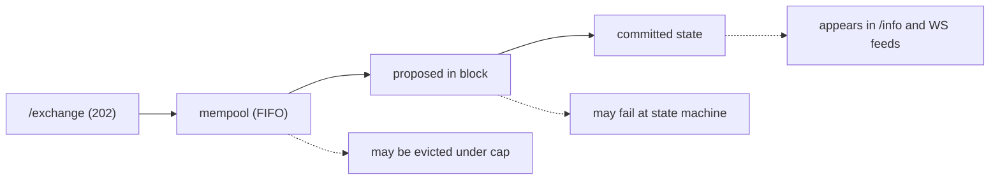
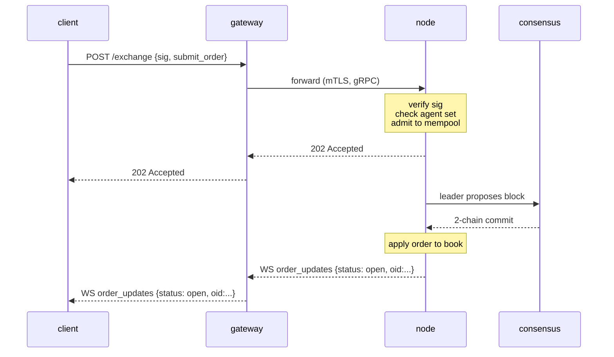

# `POST /exchange` — submit a signed action

:::info
**Status.** **stable** for the listed action variants. Endpoint shape committed for V1.
:::

## TL;DR {#tldr}

Every state-mutating **user** action — place order, cancel, vault deposit, agent
approval, staking, etc. — is a single EIP-712-signed JSON envelope sent to `POST
/exchange`. The action variant is selected by the `type` field. An **order**
returns `200 OK` with the synchronous assigned `oid` (the handler waits for
commit); every **other** action returns `202 Accepted` on admission, with commit
confirmation arriving through the [WS feed](../ws/subscriptions.md) or by polling.

:::warning
**User actions only.** `/exchange` is the public **user** write path. Privileged
/ system writes — oracle price submission, faucet credits, `SystemUserModify`,
`SystemSpotSend`, validator votes — are **never** on `/exchange`. They inject via
node-local queues gated by validator authority (see the
[non-bridged table](#non-bridged-actions) and the [faucet](./faucet.md#why-this-is-not-on-exchange)).
Posting a system action's native tag returns `400 unsupported action`.
:::

## URL {#url}

```
POST  https://api.<net>.mtf.exchange/exchange
```

| Path | Wire shape |
|------|-----------|
| `POST /exchange` (gateway) | **MTF-native** (this document) |

The gateway serves the MTF-native `/exchange`. Running the node yourself, the same
native `/exchange` is served directly at `http://localhost:8080`.

## Request envelope {#request-envelope}

```json
{
  "signature": "0xabcd...1b",
  "nonce":     1735689600001,
  "action": {
    "type": "submit_order",
    "order": { /* one of the variants below */ }
  }
}
```

| Field | Type | Required | Description |
|-------|------|----------|-------------|
| `signature` | hex string, 65 bytes (130 hex chars; `0x` optional) | yes | secp256k1 ECDSA over the EIP-712 [typed-data digest](#signing) of the action's structured fields + `nonce`. `r ‖ s ‖ v`. Both legacy `v ∈ {27, 28}` and EIP-2098 `v ∈ {0, 1}` accepted. |
| `nonce` | uint64 | yes | Strictly-monotonic per actor. Conventionally `Date.now()`. Bound into the signed digest. See [idempotency](../../integration/idempotency.md). |
| `action` | object | yes | A tagged variant: `{ "type": "<snake_case_tag>", ... }`. See [Action catalog](#action-catalog) below. |
| `expires_after` | uint64 (ms) | no | **Optional** action expiry, in consensus milliseconds. Omit it or send `0` for the default (never expires) — that produces the exact same signed digest as before this field existed. A non-zero value is **signed into** the digest and the action is rejected once consensus time passes it. See [Optional action expiry](#optional-action-expiry-expiresafter). |

:::info
**No top-level `sender`.** The envelope carries no `sender` field. The account
whose state mutates is determined per action:
- **Required-owner actions** (`submit_order`, `cancel_order`) carry the owner
  *inside* the action body — `action.order.owner` / `action.cancel.owner`. The
  server recovers the signer from the signature and requires it to equal that
  `owner` **or** an approved [agent](../../concepts/agent-wallets.md) of it.
- **Optional-owner actions** — most other order / position actions
  (`batch_order`, `spot_order`, `modify`, `cancel_by_cloid`, `scale_order`,
  `chase_order`, `update_leverage`, RFQ, and more) — carry an **optional**
  `owner`. Omit it and the recovered signer is the actor; send it and an
  approved [agent](../../concepts/agent-wallets.md) of that `owner` can act
  **as** it. Some of these bind `owner` into the signed digest, some resolve it
  at admission only — each action's field table says which.
- **Sender-authorized-only actions** (governance, vault-leader, staking
  authority, …) carry **no** owner field at all: the recovered signer *is*
  always the actor, and action-level authorization (validator membership,
  vault-leader, etc.) runs at dispatch.
:::

The server reconstructs the EIP-712 typed struct from `action.type` +
`action.params` and recovers the signer over **those field values** — so the
`action.params` you send must carry the **same values** (and the same canonical
decimal strings) you put in the typed message you signed. A mismatch recovers a
different signer and the request is rejected `401`. See
[typed-data signing](../../integration/typed-data-signing.md).

## Signing {#signing}

The signature is a secp256k1 ECDSA recovery over a standard EIP-712 digest. Each
action is signed as **structured EIP-712 typed data** (`eth_signTypedData_v4`)
with a per-action primary type `MetaFluxTransaction:<Action>`, so a wallet renders
each field by name. The server reconstructs the typed struct from `action.type` +
`action.params`, recomputes the digest, and recovers the signer:

```
struct_hash = keccak256( typeHash(MetaFluxTransaction:<Action>) ‖ encodeData(fields) )
signed_hash = keccak256( 0x1901 ‖ domain_separator ‖ struct_hash )
```

where the domain separator is:

```
domain_separator = keccak256(
  keccak256("EIP712Domain(string name,string version,uint256 chainId,address verifyingContract)") ‖
  keccak256("MetaFlux") ‖
  keccak256("1") ‖
  chainId_as_uint256_be ‖
  address_zero_padded_to_32
)
```

The per-action type strings, the atomic `encodeData` rules, and worked examples
are in [typed-data signing](../../integration/typed-data-signing.md) — the single
signing scheme. A cross-implementation known-answer test pins each action's
digest.

:::info
**`sig_scheme` is vestigial.** Earlier builds carried a `sig_scheme` selector on
the envelope; it is no longer required and the server ignores it (typed-data
recovery runs unconditionally). **Omit it.** If present, the only accepted value
is `"typed"`.
:::

### Chain IDs {#chain-ids}

| Network | `chainId` |
|---------|-----------|
| Devnet (default) | `31337` |
| Testnet | `114514` |
| Mainnet | `8964` |

The signing-domain `chainId` **must equal the node's consensus `chain_id`** —
query it via [`/info` `node_info`](./info.md#node_info) (`data.chain_id`) and use
that exact value. Signing against the wrong `chainId` returns `401` because the
recovered address differs from the action's `owner` (or, for sender-authorized
actions, recovers a phantom address that passes no authorization check). See
[networks](../../networks.md) for endpoints.

### Optional action expiry (`expiresAfter`) {#optional-action-expiry-expiresafter}

Any action may carry an optional expiry so it cannot be replayed or relayed late.
Send an `expires_after` (uint64 milliseconds) next to `action` / `nonce` /
`signature`, and set the **same** value in the signed typed message:

- **`0` or absent — the default.** The digest is **byte-for-byte identical** to
  the pre-existing one, so nothing changes for actions that don't opt in. Leave
  the field off entirely, or send `0`.
- **Non-zero.** The value is folded into the EIP-712 type string and appended as
  the final signed field (see
  [typed-data signing → action expiry](../../integration/typed-data-signing.md#action-expiry-expiresafter)),
  so the expiry is **signed and tamper-evident** — a relay can neither strip nor
  alter it. The action is rejected at submission if the expiry is already in the
  past, and dropped at execution if consensus time passes it before it commits.

:::info
**`expires_after` is a deadline, not a delay.** It is a consensus timestamp in ms,
not a duration. Send `0` or omit it for no expiry.
:::

## Numeric conventions {#numeric-conventions}

| Type | Wire form | Why |
|------|----------|-----|
| `uint64` ≤ 2^53 | JSON number | Safe in IEEE-754 |
| `uint64` > 2^53, `u128`, scaled integers | JSON string | Native JSON numbers silently lose precision past 2^53 |
| Address | hex string `"0x..."` | 20 bytes, 40 hex chars (with or without `0x`) |
| Booleans | `true` / `false` | Literal JSON |
| Optional fields | `null` or omit | Both accepted; `null` is canonical |

**Fixed-point fields.** Price and size fields are 8-decimal fixed-point integers; USDC amounts are 6-decimal base units. The value carries the scale, not the field name — e.g. `px = "10050000000"` means `100.50`. Always send as a string; the server parses to `u128`.

## Signed-by semantics {#signed-by-semantics}

An action is signed by the **master** key or by an approved
[agent wallet](../../concepts/agent-wallets.md). One rule decides which:

**An agent can sign an action only if that action carries an `owner` field.**

There is no top-level `sender` field and no account header. The node reads the
account from the action body. This gives exactly two classes.

| Class | How the node finds the account | Who can sign |
|-------|--------------------------------|--------------|
| **`master / agent`** | The action carries `owner`. | The `owner` key, or an approved agent of `owner`. |
| **`master only`** | The action has no `owner`. The signer **is** the account. | The account's own key. |

The field-level tables below call the second class **sender-authorized**. The two
names mean the same thing: no `owner` field, so the signer is the account. An
action with an **optional** `owner` is `master / agent` when you send `owner`,
and sender-authorized when you omit it.

For a `master / agent` action the node compares the recovered signer against
`owner`. A signer that is neither `owner` nor an approved agent of `owner` gets
`401`.

:::danger
**A `master only` action signed by an agent key does not fail. It acts on the
agent's own account.**

The node sets the account to the recovered signer. So an agent-signed
[`mb_withdraw`](#mb_withdraw) debits the **agent's** balance, not the master's,
and an agent-signed [`approve_agent`](#approve_agent) approves an agent of the
**agent**. You get no `401` and no error — you get the wrong account. Sign every
`master only` action with the master key.
:::

Each action's entry in the [catalog](#action-catalog) carries its class. The two
classes are the only values in the **Signed-by** column.

### Which actions accept an agent {#which-actions-accept-an-agent}

These actions carry an `owner`, so an approved agent can sign them. This list is
complete.

| Group | Actions |
|-------|---------|
| Perp orders | [`submit_order`](#submit_order), [`batch_order`](#batch_order), [`scale_order`](#scale_order), [`chase_order`](#chase_order), [`twap_order`](#twap_order) — the last three take a spot pair too, once the [spot lane](../../concepts/order-types.md#synth-on-spot) activates |
| Cancels | [`cancel_order`](#cancel_order), [`batch_cancel`](#batch_cancel), [`cancel_by_cloid`](#cancel_by_cloid), [`cancel_all_orders`](#cancel_all_orders), [`cancel_scale`](#cancel_scale), [`cancel_chase`](#cancel_chase), [`twap_cancel`](#twap_cancel), [`schedule_cancel`](#schedule_cancel) |
| Amends | [`modify`](#modify), [`batch_modify`](#batch_modify) |
| Spot | [`spot_order`](#spot_order), [`spot_cancel`](#spot_cancel) |
| Margin | [`update_leverage`](#update_leverage), [`update_isolated_margin`](#update_isolated_margin), [`top_up_isolated_only_margin`](#top_up_isolated_only_margin), [`set_position_mode`](#set_position_mode) |
| Specialist venues | [`rfq_request`](#rfq_request), [`rfq_quote`](#rfq_quote), [`rfq_accept`](#rfq_accept) — **the option trade path; all three refuse any market that is not a live option series** — and [`fba_submit`](#fba_submit) |

**Every other action is `master only`.** That covers all fund movement
(withdrawals, transfers, vaults, Earn, staking) and all account control (agent
approval, sub-accounts, multi-sig, display name, referrer, builder-fee approval,
portfolio-margin enrolment, abstraction config, priority bids, encrypted orders).

On `submit_order` and `cancel_order` the `owner` field is **required**. On every
other action in the table above it is **optional**: omit it and the signer trades
for itself.

---

## Action catalog {#action-catalog}

Each variant is a tagged object `{ "type": "<snake_case_tag>", <flat body> }`. The
body keys are **flat under the action object** (there is no PascalCase `type` and
no universal `params` wrapper) — e.g. `submit_order` carries an `order` object,
`cancel_order` carries a `cancel` object, and the sender-authorized actions carry
a `params` object. Click through for the field-level table. The overview tables
below group every action by category; the **full field-level definitions that
follow are split by trading type** — [Perpetual order actions](#perpetual-order-actions),
[Spot trading actions](#spot-trading-actions),
[Spot margin & Earn actions](#spot-margin--earn-actions),
[Perpetual margin & risk actions](#perpetual-margin--risk-actions),
[RFQ, FBA & utility actions](#rfq-fba--utility-actions), and
[Account, staking, vaults & bridge actions](#account-staking-vaults--bridge-actions).

:::warning
**`px` / `size` are unsigned fixed-point `u64` on the native wire**, sent as JSON
numbers (the node decodes them as `u64`, then widens internally). Addresses are
`0x`-hex (40 chars); `cloid` is `0x` + 32 hex chars (16 bytes).
:::

### Order placement & lifecycle {#order-placement--lifecycle}

:::tip
**New here? Read [placing orders](../../integration/placing-orders.md) first.**
That page starts with one perp limit order end-to-end, then tiers the table below
so you can skip most of it on a first integration.
:::

| `type` | Purpose | Signed-by | Idempotent |
|--------|---------|-----------|-----------|
| [`submit_order`](#submit_order) | Place one order | master / agent | by `cloid` |
| [`batch_order`](#batch_order) | N orders / one signature | master / agent | per-leg `cloid` |
| [`cancel_order`](#cancel_order) | Cancel by `oid` | master / agent | yes |
| [`batch_cancel`](#batch_cancel) | N cancels / one signature | master / agent | yes |
| [`cancel_by_cloid`](#cancel_by_cloid) | Cancel by client order id | master / agent | yes |
| [`cancel_all_orders`](#cancel_all_orders) | Cancel all (optional asset filter) | master / agent | yes |
| [`modify`](#modify) | Amend a resting order's px / size | master / agent | yes |
| [`batch_modify`](#batch_modify) | N modifies / one signature | master / agent | per-entry |
| [`schedule_cancel`](#schedule_cancel) | Future-block cancel-all trigger | master / agent | yes |
| [`twap_order`](#twap_order) | Schedule a sliced (TWAP) order | master / agent | by `twap_id` |
| [`twap_cancel`](#twap_cancel) | Cancel a running TWAP parent | master / agent | yes |
| [`scale_order`](#scale_order) | Place an N-rung ladder / one signature | master / agent | by `cloid` |
| [`cancel_scale`](#cancel_scale) | Cancel a whole ladder by its shared `cloid` | master / agent | yes |
| [`chase_order`](#chase_order) | Place a self-repricing chase leg / one signature | master / agent | by `cloid` |
| [`cancel_chase`](#cancel_chase) | Cancel a chase by its handle | master / agent | yes |

### Spot trading {#spot-trading}

Spot is a token-for-token CLOB (no leverage, no positions) — separate books and
balances from perps. A resting spot order locks the funds it would owe on fill
into a **reserved balance**: a `bid` reserves **quote** (its notional at the
limit price), an `ask` reserves the **base** it offers. Order size is **clamped
at admission** to what your balance funds, and fees are taken from the leg each
side receives. Both actions are **sender-authorized by default** (omit `owner`
and the signer is the trader); both also take an **optional digest-bound `owner`**
so an approved agent can act for the account it is approved for. See
[spot trading](../../products/spot.md) for the full conceptual model.

| `type` | Purpose | Signed-by | Idempotent |
|--------|---------|-----------|-----------|
| [`spot_order`](#spot_order) | Place one spot order | master / agent | by `cloid` |
| [`spot_cancel`](#spot_cancel) | Cancel a resting spot order by `oid` | master / agent | yes |

### Spot margin & Earn {#spot-margin--earn}

:::info
**Spot margin is cross-collateralized.** Leveraged spot ([spot margin](../../products/spot-margin.md)) draws its margin from your **one unified USDC account** — the same collateral that backs your perpetual positions — and its lending supply side is [Earn](../../concepts/earn.md). A pair enables only once governance calibrates its per-pair risk parameters. No pair is calibrated yet, so treat the lane as a **preview**: forced liquidation settles through the same path as a voluntary close (see [Liquidation](../../products/spot-margin.md#liquidation)), but per-pair maintenance ratios are still being calibrated. Do not assume production safety at scale.
:::

A leveraged spot position is **cross-margined against your one unified USDC account** — its initial-margin requirement is held against your account-wide free collateral, exactly like a perpetual open, so there is **no separate collateral deposit**. The buy is funded 100% by a quote borrow drawn from the pair's Earn pool, and the bought base is held **segregated** on the margin account (never in your spendable balances). Because collateral is shared, an open spot-margin position reduces your perpetual margin headroom, and a perpetual loss reduces the collateral that backs the spot-margin position (see [margin modes](../../concepts/margin-modes.md)). Earn is the other side — suppliers deposit the lendable quote for pool shares, and the borrow interest spot-margin traders pay lifts each share's value. All actions here are **sender-authorized** (the signer is the actor; there is no `owner`). `amount` / `shares` / `borrow` are decimals sent as JSON strings; `size` / `limit_px` are `u64` on the `1e8` / raw-lot planes like a [`spot_order`](#spot_order). Each returns the [`202 Accepted`](#202-accepted--non-order-admission) admission envelope (not a synchronous `oid`); observe the committed outcome via [`/info` `spot_margin_state`](./info/spot.md#spot_margin_state) and [`earn_state`](./info/spot.md#earn_state).

| `type` | Purpose | Signed-by | Idempotent |
|--------|---------|-----------|-----------|
| [`spot_margin_open`](#spot_margin_open) | Borrow + IOC-buy base on leverage | master only | no |
| [`spot_margin_close`](#spot_margin_close) | Sell held base, repay the loan | master only | no |
| [`earn_deposit`](#earn_deposit) | Supply quote into the lending pool for shares | master only | no |
| [`earn_withdraw`](#earn_withdraw) | Redeem pool shares (idle-bounded) | master only | no |

**Why a pool pays nothing yet.** A pool auto-creates on the first
[`earn_deposit`](#earn_deposit) with a borrow rate of **zero**. Nothing on the
public path can change that rate. Only the validator action **`createEarnPool`
(201)** sets it, and that action is a ⅔-stake governance vote — it is
[not on `/exchange`](#non-bridged-actions). Until that vote passes, share value
never moves and a deposit earns exactly 0. The same vote also blesses the asset
as lendable and sets the pool's `reserve_factor_bps`. A later vote on an existing
pool reconfigures only those two numbers; supply, shares and the borrow index are
untouched. The rate is capped at 20000 bps per year (200%).

### Spot deployment (MIP-1) {#spot-deployment}

Six **sender-authorized** actions let any account register a spot token, list a
pair for it, price it, open it, and mint its genesis supply. The signer *is* the
deployer — there is no `owner` field, and every later call on a token or pair is
refused unless the signer is the deployer of record. See
[MIP-1](../../mip/mip-1.md) for the conceptual model.

Registering a token or a pair **charges a deploy fee at the moment it commits**.
The fee is the current Dutch-clock ask on that stream, and it is paid from your
**free collateral**, not from a pre-posted bid. You bound it with
`max_deploy_fee`: if the ask is above the value you signed, the call is rejected
and nothing is charged. There is no bid, no escrow and no refund step anywhere in
this lane.

| `type` | Purpose | Signed-by | Charges a deploy fee |
|--------|---------|-----------|----------------------|
| [`spot_register_token`](#spot_register_token) | Register a new spot token | deployer (sender) | yes — `TokenRegister` stream |
| [`spot_register_pair`](#spot_register_pair) | List a `(base, quote)` trading pair | deployer (sender) | yes — `SpotPairDeploy` stream |
| [`spot_set_pair_params`](#spot_set_pair_params) | Set the pair's fee tier + min notional | pair deployer | no |
| [`spot_set_pair_active`](#spot_set_pair_active) | Open or close the pair to new orders | pair deployer | no |
| [`spot_seed_holders`](#spot_seed_holders) | Stage genesis holder rows (repeatable) | token deployer | no |
| [`spot_finalize_supply`](#spot_finalize_supply) | Check the staged total, then mint once | token deployer | no |

Every action here returns the
[`202 Accepted`](#202-accepted--non-order-admission) admission envelope. Confirm
the allocated ids and the committed spec through
[`/info` `spot_meta`](./info/spot.md).

### Margin & risk {#margin--risk}

| `type` | Purpose | Signed-by |
|--------|---------|-----------|
| [`update_leverage`](#update_leverage) | Change leverage / iso toggle on an asset | master / agent |
| [`update_isolated_margin`](#update_isolated_margin) | Signed isolated-margin delta | master / agent |
| [`top_up_isolated_only_margin`](#top_up_isolated_only_margin) | Strict-iso margin top-up | master / agent |
| [`user_portfolio_margin`](#user_portfolio_margin) | Enroll / unenroll PM | master only |

### RFQ, FBA & utility {#rfq-fba--utility}

Request-for-quote ([RFQ](../../concepts/rfq.md)) block trading, the
frequent-batch-auction ([FBA](../../concepts/fba.md)) entry, and the deliberate
no-op. See [the field-level sections](#rfq-fba--utility-actions) for the wire
planes and the digest-bound `owner` rule.

The three RFQ actions are the **option trade path**. They take an
[option series](./info.md#option_series) `signing_id` as the market, and they
refuse every other market. See [options](../../products/options.md).

| `type` | Purpose | Signed-by |
|--------|---------|-----------|
| [`rfq_request`](#rfq_request) | Open an RFQ session (taker) | master / agent (`owner` digest-bound) |
| [`rfq_quote`](#rfq_quote) | Quote onto an open RFQ (maker) | master / agent (`owner` digest-bound) |
| [`rfq_accept`](#rfq_accept) | Accept a quote and settle (taker) | master / agent (`owner` digest-bound) |
| [`fba_submit`](#fba_submit) | Submit into a batch-auction window | master / agent |
| [`noop`](#noop) | Deliberate no-op (nonce burn / keepalive) | master only |

### Account management {#account-management}

| `type` | Purpose | Signed-by |
|--------|---------|-----------|
| [`approve_agent`](#approve_agent) | Approve an agent wallet | master only |
| [`set_display_name`](#set_display_name) | Set the account handle | master only |
| [`set_referrer`](#set_referrer) | Bind to a referrer address | master only |
| [`approve_broker_fee`](#approve_builder_fee) | Approve a broker fee ceiling | master only |
| [`create_sub_account`](#create_sub_account) | Open a sub-account under the master | master only |
| [`sub_account_transfer`](#sub_account_transfer) | Move perp cross-collateral parent ↔ sub | master only |
| [`sub_account_spot_transfer`](#sub_account_spot_transfer) | Move a spot token balance parent ↔ sub | master only |
| [`convert_to_multi_sig_user`](#convert_to_multi_sig_user) | Lift account to multi-sig | master only |
| [`set_position_mode`](#set_position_mode) | Toggle one-way / hedge position mode | master / agent |

### Staking & abstraction {#staking--abstraction}

| `type` | Purpose | Signed-by |
|--------|---------|-----------|
| [`c_deposit`](#c_deposit) | Move spot MTF into the free staking balance | master only |
| [`c_withdraw`](#c_withdraw) | Move the free staking balance back to spot MTF | master only |
| [`token_delegate`](#token_delegate) | Delegate / undelegate stake | master only |
| [`claim_rewards`](#claim_rewards) | Claim staking rewards | master only |
| [`link_staking_user`](#link_staking_user) | Alias a staking target | master only |
| [`user_set_abstraction`](#user_set_abstraction) | Self-scope abstraction config | master only |
| [`agent_set_abstraction`](#agent_set_abstraction) | Agent-scope abstraction config | master only |
| [`priority_bid`](#priority_bid) | Pay a priority fee for block-front placement | master only |

### Encrypted orders {#encrypted-orders}

| `type` | Purpose | Signed-by |
|--------|---------|-----------|
| [`submit_encrypted_order`](#submit_encrypted_order) | Threshold-encrypted order ciphertext | master only |

### Vaults {#vaults}

| `type` | Purpose | Signed-by |
|--------|---------|-----------|
| [`create_vault`](#create_vault) | Leader creates a vault | master only |
| [`vault_transfer`](#vault_transfer) | Leader seed transfer | master only |
| [`vault_modify`](#vault_modify) | Leader-only vault config update | master only |
| [`vault_withdraw`](#vault_withdraw) | Follower share redemption | master only |
| [`register_metaliquidity_operator`](#register_metaliquidity_operator) | Leader grants or revokes an operator key on a Metaliquidity vault | vault leader only |

### Bridge withdrawals {#bridge-withdrawals}

Value leaves the Core ledger for MetaFluxEVM, or leaves the chain over
[MetaBridge](../../bridge/index.md). Every action here is **`master only`**: the
recovered signer is the account debited. An agent signature debits the agent's
own account, never the master's.

| `type` | Purpose | Signed-by |
|--------|---------|-----------|
| [`core_evm_transfer`](#core_evm_transfer) | Move a spot asset from the Core ledger to MetaFluxEVM, optionally with an EVM payload | master only |
| [`send_to_evm_with_data`](#send_to_evm_with_data) ⚠️ | The same Core → EVM move in the Hyperliquid-compatible field shape. **Live.** It refuses five things Hyperliquid accepts and ignores — see the section | master only |
| [`mb_withdraw`](#mb_withdraw) | Withdraw USDC cross-collateral to an external chain | master only |

Both Core → EVM rows reach the same lane and land the same credit.
[Which one to use](#core-evm-which-action) is decided by one thing: the field
shape your client already has.

### Not on the public `/exchange` path {#not-on-the-public-exchange-path}

These are draft / legacy action names from earlier docs. Most are **not bridged
on the MTF-native `/exchange` handler** — they are either privileged / system
writes that must never transit the public user path, or recognized-but-unmapped
schema stubs, and posting them returns `400 unsupported action`. The one
exception below is `MultiSig`, which **is** bridged (its native tag is
`multi_sig`). See [the table below](#non-bridged-actions) for the disposition of
each.

| Draft name | Native tag (if recognized) | Why not bridged |
|-----------|----------------------------|-----------------|
| `UpdateMarginMode` | — | No native action; isolation is the `is_isolated` flag on `update_leverage` |
| `MultiSig` | `multi_sig` | **Bridged and executing** — the collect-and-execute wrapper is the live way a multi-sig account acts (post it as a normal `multi_sig` `/exchange` envelope). See [multi-sig](../../concepts/multi-sig.md#acting-as-multi-sig). (A non-wrapped action from a multi-sig account is still rejected.) |
| `RegisterReferrer` | — | Not bridged (referrer is bound by address via `set_referrer`) |
| `UsdcTransfer` / `SpotTransfer` | — | User-to-user transfer flows not bridged |
| `WithdrawUsdc` | — | Draft name; external withdrawal is [`mb_withdraw`](#mb_withdraw) |
| (legacy CCTP withdraw) | `withdraw` | Recognized and admitted, but rejected at commit past the network's CCTP-disable height (`"withdraw3 disabled; use mb_withdraw"`) — use [`mb_withdraw`](#mb_withdraw) |
| (BOLE pool) | `borrow_lend` | **Bridged and live** — `params.kind` `"Lend"` / `"UnLend"` / `"Repay"` are open to any account; `"Borrow"` is refused unless the sender is an approved liquidator |
| (vault distribute) | `vault_distribute` | **Bridged and live** — a follower's own self-service deposit; see [vaults](../../concepts/vaults.md#depositing) |
| (PM lifecycle) | `pm_enroll` / `pm_unenroll` | `pm_enroll` has no native tag — enroll via [`user_portfolio_margin`](#user_portfolio_margin). `pm_unenroll` **is** a bridged alias (no params) for the same action's `enroll:false` form. `pm_rebalance` has been **removed** — rejected as an unknown action |
| (cross-chain) | `cross_chain_send` | Recognized-but-unmapped stub → `unsupported action` |

---

## Perpetual order actions {#perpetual-order-actions}

Order placement and lifecycle on **perpetual** markets (a perp `market` id). These
use the shared CLOB; the [spot](#spot-trading-actions) and
[spot margin](#spot-margin--earn-actions) trading actions are separate sections
below. Perp leverage and margin controls are under
[Perpetual margin & risk actions](#perpetual-margin--risk-actions).

### Place a single order {#submit_order}

Place a single order. The order body is carried under `action.order`; `owner` is
the claimed account (the server requires the recovered signer to equal it or be an
approved agent). To place many orders under one signature, use
[`batch_order`](#batch_order).

```json
{
  "type": "submit_order",
  "order": {
    "owner":       "0x00000000000000000000000000000000000000aa",
    "market":       7,
    "side":         "bid",
    "kind":         "limit",
    "size":         100000000,
    "limit_px":     10050000000,
    "tif":          "gtc",
    "stp_mode":     "cancel_oldest",
    "reduce_only":  false,
    "cloid":        "0xabababababababababababababababab",
    "builder":      { "fee": 5, "user": "0x00000000000000000000000000000000000000ff" },
    "position_side": "long"
  }
}
```

| Field | Type | Range / values | Description |
|-------|------|----------------|-------------|
| `owner` | hex address | 40 hex chars | Claimed account; must equal the recovered signer or an approved agent of it. Wire-only — dropped on lowering |
| `market` | uint32 | `[0, market_count)` | Asset/market id (identity-mapped to `AssetId`) |
| `side` | enum | `"bid"` / `"ask"` | — |
| `kind` | enum | `"limit"` / `"market"` / `"stop_loss"` / `"take_profit"` | `limit` / `market` place a live order. `stop_loss` / `take_profit` are accepted **only when a `trigger` block is also present** — that pair parks a single reduce-only TP/SL leg (see [trigger orders](#trigger-orders-stop_loss--take_profit)); a `stop_loss` / `take_profit` *without* a `trigger` block is rejected (`unsupported order kind`) |
| `trigger` | object \| null | — | Optional [trigger block](#trigger-orders-stop_loss--take_profit). Its presence — on **any** `kind` — turns this `submit_order` into a single parked reduce-only TP/SL leg instead of a live order: `{ "trigger_px": <u64>, "is_market": <bool>, "tpsl": "tp" \| "sl" }`. `is_market: true` fires a market (IOC) exit; `is_market: false` rests a limit exit at the order's `limit_px` — see [trigger orders](#trigger-orders-stop_loss--take_profit) |
| `size` | uint64 | `> 0` | Fixed-point tick units (widened to `u128`) |
| `limit_px` | uint64 | `> 0` | Fixed-point tick units (widened to `i128`) |
| `tif` | enum | `"gtc"`, `"ioc"`, `"alo"` | `"aon"` is rejected (`unsupported time-in-force` — no core equivalent) |
| `stp_mode` | enum | `"cancel_oldest"`, `"cancel_newest"`, `"cancel_both"` | `"reject"` is rejected (`unsupported stp_mode` — no core equivalent) |
| `reduce_only` | bool | — | If true, rejected at commit if it would grow position |
| `cloid` | hex string \| null | `0x` + 32 hex chars (16 bytes) | Optional client order id; enables `cancel_by_cloid` and dedup |
| `builder` | object \| null | — | Optional [broker fee](../../concepts/broker-codes.md), charged on top of the taker fee: `{ "fee": <bps u16>, "user": <0x-hex address> }`. The field keeps the `builder` name |
| `position_side` | enum \| null | `"long"` / `"short"` | **[Hedge mode](../../concepts/hedge-mode.md) only.** Target leg for the order. **Omit on a one-way account** (the default) and **send it on a hedge account** — a one-way account that sends it, or a hedge account that omits it, is rejected. `reduce_only` is evaluated against the named leg only. See [hedge mode](#position_side-hedge-mode) below |

**Idempotency**: a duplicate `cloid` on the same account is rejected at admission with `error: "duplicate cloid"`. Use `cloid` as your client-side dedup key.

**Common errors**: `px` not tick-aligned, `size` below market minimum, `reduce_only` would grow position, `stp` rejected via STP, account in T1+ liquidation tier.

**Response status entries** (per order, in order — see the full union under
[Response → 200 OK](#200-ok--order-path-synchronous-oid)):

```json
{"resting": {"oid": 12345, "cloid": "0x..."}}                       // posted to book
{"filled":  {"oid": 12345, "total_sz": "100000000", "avg_px": "10050000000"}}
{"error":   "<reason>"}                                             // commit/admission rejected this entry
{"pending": {"action_hash": "0x...", "nonce": 1735689600001}}       // admitted, no commit in the wait window
```

#### `position_side` (hedge mode) {#position_side-hedge-mode}

The optional `position_side` field on the order body selects which leg an order
applies to when the account is in [hedge mode](../../concepts/hedge-mode.md).

- **One-way account (default):** **omit** `position_side`. Sending it on a
  one-way account is rejected.
- **Hedge account:** `position_side` is **required** on every order (`"long"`
  or `"short"`). Omitting it on a hedge account is rejected.

The leg is chosen explicitly — it is **never inferred** from `side` — so a `bid`
meant to *reduce a short* can never accidentally open or grow a long. When
`reduce_only` is set, it is evaluated **against the named leg only**: a
`reduce_only` order on `short` can never touch the `long` leg, and vice-versa.
There is no implicit flip — closing the long leg never opens a short.

| `side` | `position_side` | `reduce_only` | Effect (hedge account) |
|--------|-----------------|---------------|------------------------|
| `bid` | `long` | false | Open / add to the long leg |
| `ask` | `long` | true | Reduce / close the long leg |
| `ask` | `short` | false | Open / add to the short leg |
| `bid` | `short` | true | Reduce / close the short leg |

Switch an account into hedge mode (while flat) with
[`set_position_mode`](#set_position_mode).

#### Trigger orders (`stop_loss` / `take_profit`) {#trigger-orders-stop_loss--take_profit}

A single-leg protective trigger (a stop-loss or take-profit) is expressed as a
`submit_order` whose `order` body carries a `trigger` block. The block's
**presence** — not the `kind` — is what routes it: the order is **parked** in the
canonical trigger registry instead of going to the book. When the mark price
crosses `trigger_px`, the leg fires as a **reduce-only market exit** (a
slippage-bounded IOC) or, if `is_market: false`, **rests a reduce-only limit** at
the order's `limit_px`. Both variants always reduce — a trigger can never open or
grow a position.

```json
{
  "type": "submit_order",
  "order": {
    "owner":       "0x00000000000000000000000000000000000000aa",
    "market":       7,
    "side":         "ask",
    "kind":         "take_profit",
    "size":         50000000,
    "limit_px":     0,
    "tif":          "ioc",
    "stp_mode":     "cancel_oldest",
    "reduce_only":  false,
    "trigger":     { "trigger_px": 4200000000000, "is_market": true, "tpsl": "tp" }
  }
}
```

| Field | Type | Range / values | Description |
|-------|------|----------------|-------------|
| `trigger.trigger_px` | uint64 | `> 0` | Trigger price in fixed-point tick units (widened to `i128`). The mark crossing this price fires the leg. For a **market** trigger it is also the fired price; for a **limit** trigger it drives the fire direction only (the resting price is `limit_px`) |
| `trigger.is_market` | bool | — | Selects the fired exit. `true` = **market trigger**: fire a reduce-only slippage-bounded IOC. `false` = **limit trigger**: rest a reduce-only `gtc` limit at the order's `limit_px` (rules below) |
| `trigger.tpsl` | enum | `"tp"` / `"sl"` | Take-profit / stop-loss label, surfaced in [`/info`](./info.md#order_status). The fire direction comes from the leg `side` versus the mark, not from this label |
| `trigger.trail_px` | uint64 | `> 0`, optional | **Optional — makes the leg a trailing stop.** The callback offset, in the same fixed-point tick units as `trigger_px`. The parked level ratchets toward the mark by this offset once per block and never away from it. It is **signed**: sending the key changes the EIP-712 type string and the digest, so omit it unless you want a trail. See [trailing stops](#trailing-stops) |

:::info
**`is_market` controls the exit type .** Before
the upgrade the field is a label only and every trigger fires as a market IOC.
`is_market` is **control**:
`false` selects the new **limit** trigger. A submit that **omits** `is_market`
defaults to `false` — after the upgrade that is a **limit** trigger, so a market
stop **must** send `is_market: true`. A limit trigger with `limit_px: 0` (or an
omitted `is_market` plus `limit_px: 0`) is rejected `InvalidParams`.
:::

**Market trigger (`is_market: true`).** On the mark cross the leg fires a
reduce-only IOC bounded by the mark band, clamped to what actually reduces the
position. `limit_px` is ignored. This is the only behaviour before the upgrade.

**Limit trigger (`is_market: false`).** On the mark cross the leg places a
reduce-only `gtc` limit at the order's `limit_px`, and that order rests on the
book until it fills or you cancel it. Admission rules for a limit trigger:

- `limit_px > 0` — a limit trigger with `limit_px: 0` is rejected `InvalidParams`.
- `tif` must be `gtc`. `alo` / `ioc` on a limit trigger are rejected.
- `trigger_px` keeps every role (park price, fire direction, mark cross);
  `limit_px` is only the resting order's price.

A limit-trigger example — rest a reduce-only sell at `41000.00` once the mark
crosses `42000.00`:

```json
{
  "type": "submit_order",
  "order": {
    "owner":       "0x00000000000000000000000000000000000000aa",
    "market":       7,
    "side":         "ask",
    "kind":         "take_profit",
    "size":         50000000,
    "limit_px":     4100000000000,
    "tif":          "gtc",
    "stp_mode":     "cancel_oldest",
    "reduce_only":  false,
    "trigger":     { "trigger_px": 4200000000000, "is_market": false, "tpsl": "tp" }
  }
}
```

Semantics:

- **Reduce-only is forced.** A trigger leg always closes — it can never open or
  grow a position — regardless of the order's `reduce_only` wire value.
- **The leg `side` chooses what is protected.** An `ask` trigger closes a long;
  a `bid` trigger closes a short. On a [hedge account](#position_side-hedge-mode),
  carry `position_side` to name the leg, exactly as for a live order.
- **A fired limit gets a new `oid`.** At conversion the parked leg retires and the
  new resting limit is assigned a fresh `oid`; the parked `oid` reads terminal /
  unknown afterwards, and the resting limit appears in
  [`open_orders`](./info.md#open_orders). `cloid` is **not** carried onto the fired
  order.
- **A resting fired limit persists** until it fills or you cancel it through the
  normal path.
- **OCO collapse point differs by variant.** A market trigger and its sibling
  collapse on the first fill. A **limit** trigger and its sibling collapse at
  **conversion** — the instant the resting limit is placed, not when it fills —
  because the live limit order is now the protection.
- **One-way resting-closer.** A fired limit rests like any closing `gtc` order (a
  resting order carries no reduce-only flag). On a one-way account, if the position
  shrinks by other means before the limit fills, the eventual fill can grow
  exposure the other way — the same behaviour as a manual resting close order.

Admission returns the same per-order status union as a live `submit_order`. A
trigger that parks reports through the order path; the eventual fire is a
committed effect observable on the [WS feed](../ws/subscriptions.md) / `/info`.
Multi-leg entry-plus-protective baskets use [`batch_order`](#batch_order) with
`grouping: "normalTpsl"` / `"positionTpsl"`.

#### Trailing stops (`trail_px`) {#trailing-stops}

:::info
**Not live yet.** Trailing stops are written here ahead of activation. The
network REFUSES an order carrying `trail_px` until the release that binds it
activates — the current node answers `trail_px is not bound by the order signing
type yet`. Everything below is the target behaviour, including the digest rules:
build against it, but do not submit one until the release lands.
:::

A trigger leg becomes a **trailing stop** when its `trigger` block carries
`trail_px`, the callback offset. The parked level then ratchets toward the mark
by that offset, once per block, and never away from it.

```json
{
  "type": "submit_order",
  "order": {
    "owner":       "0x00000000000000000000000000000000000000aa",
    "market":       7,
    "side":         "ask",
    "kind":         "stop_loss",
    "size":         50000000,
    "limit_px":     0,
    "tif":          "ioc",
    "stp_mode":     "cancel_oldest",
    "reduce_only":  false,
    "trigger":     { "trigger_px": 4000000000000, "is_market": true, "tpsl": "sl",
                     "trail_px": 100000000000 }
  }
}
```

**The level you sign is a floor, not the fire price.** For a long's stop the
level becomes `max(level, mark - trail_px)` on every mark update, so it rises
with a winning position and holds when the mark falls back. The leg fires at the
**ratcheted** level. This is why [`open_orders`](./info.md#open_orders) and
[`order_status`](./info.md#order_status) serve a `trigger_px` that is not the one
you sent — read the served value as the current high-water level, and `trail_px`
as the offset that produced it.

**A trailing leg must be the stop-loss.** The ratchet follows a winning
position, so it only makes sense on the leg below a long (or above a short). A
trailing take-profit would chase its level away from the position and fire at a
price nobody asked for, so the chain refuses it.

##### Signing — `trail_px` is BOUND, and it changes the digest {#trailing-stops-signing}

`trail_px` moves WHERE a position closes, so it is a **control** field: it must
be covered by the signature, or a relay could add or strip it while the
signature still verifies. It is covered. **Sending `trail_px` changes the EIP-712
type string and the digest.** A client that computes the old digest and sends
`trail_px` anyway gets its signature recovered to a different address and the
action rejected.

The rule is **presence, not value** — the same fold the
[action expiry](../../integration/typed-data-signing.md#action-expiry-expiresafter)
uses:

| What you send | Type string | Digest |
|---|---|---|
| No `trail_px` key on any leg | The frozen one — unchanged | **Byte-identical to before this field existed.** An older client signs exactly as it always did |
| `trail_px` present on any leg | The trailing variant | Differs — see [order type strings](../../integration/typed-data-signing.md#order-type-strings-and-the-trailing-fold) |

**Do not send `trail_px: 0` to mean "no trail".** Presence is what selects the
type string, so an explicit `0` is a *present* trail — it takes the trailing
digest and is then rejected `InvalidParams` (`trailing callback must be > 0`).
Omit the key.

The exact type strings, the per-leg `trailPxs` hash used by
[`batch_order`](#batch_order), and pinned known-answer digests are in
[typed-data signing → order type strings](../../integration/typed-data-signing.md#order-type-strings-and-the-trailing-fold).

**Rejections.**

| Message | Cause |
|---|---|
| `trailing callback must be > 0` | `trail_px` present and `0` (or negative once widened). Omit the key instead |
| `a trailing trigger leg must be the stop-loss, not the take-profit` | The trailing leg fires on the wrong side of the mark for the position it guards |
| A signature-recovery failure (see [errors](../errors.md)) | The digest was computed without the trailing fold while the wire carried `trail_px` |

---

### Place multiple orders in one signature {#batch_order}

N orders carried by ONE signed envelope / one nonce. Each entry is a full
[`submit_order`](#submit_order) order body (same fields, including per-order
`owner` / `cloid` / `builder`).

```json
{
  "type": "batch_order",
  "params": {
    "orders": [
      { "owner": "0x...aa", "market": 1, "side": "bid", "kind": "limit",
        "size": 1000, "limit_px": 5000, "tif": "gtc",
        "stp_mode": "cancel_oldest", "reduce_only": false },
      { "owner": "0x...aa", "market": 2, "side": "ask", "kind": "limit",
        "size": 2000, "limit_px": 6000, "tif": "gtc",
        "stp_mode": "cancel_oldest", "reduce_only": false }
    ],
    "grouping": "na"
  }
}
```

| Field | Type | Values | Description |
|-------|------|--------|-------------|
| `owner` | hex address \| omitted | 40 hex chars | Optional **batch-level** owner the signer acts for (an approved agent / operator). Omitted = sender-authorized (the batch trades for the signer). Bound into the digest via a distinct type string |
| `orders[*]` | order | — | Each entry has the full `submit_order` order shape |
| `grouping` | enum | `"na"`, `"normalTpsl"`, `"positionTpsl"` | Order-family grouping; defaults to `"na"` if omitted |

:::warning
**Only `params.owner` routes a batch.** The per-leg `orders[*].owner` is required
by the schema but the server **ignores** it — it is not in the signed digest and
it does not authorize anything. Set the account you act for at `params.owner`.
:::

Returns an array of per-leg statuses (same union as `submit_order`) — **one entry
per placed leg**, in input order, each echoing its own `cloid`. Legs are
**independent**: each runs the full order gate on its own, so one rejected leg
does not roll back the others. A batch carries at most **1000** orders; an empty
`orders` array is rejected (`empty batch`).

#### `positionTpsl` — protective legs, and the scaled ladder {#position-tpsl-ladder}

`grouping: "positionTpsl"` parks protective legs against a position you already
hold. There is no entry order: **every** leg parks. The **LEG COUNT decides the
shape**, and the three shapes behave differently:

| Legs | Shape | What the parked rows carry |
|------|-------|----------------------------|
| 1 | A lone trigger | No `group` |
| 2 | An **OCO pair** — a fill of either leg cancels the other | No `group` |
| 3 or more | A scaled **LADDER**, NOT an OCO set | Every leg shares one `group` |

**The ladder is the new shape.** Its legs share a `group` handle — the `oid` of
the ladder's first parked leg — which every leg reports on
[`open_orders`](./info.md#open_orders) and
[`order_status`](./info.md#order_status). Group the rows by that value to render
one ladder as one control. Legs of a ladder are **not** OCO: a fill of one leg
does not cancel the others, which is the point of scaling out of a position in
steps.

**A ladder retires WHOLE.** It parks only against a live position, so the moment
that position is gone — by any close path, including a liquidation — every leg
of the ladder retires together on the next block. You do not have to cancel the
survivors yourself.

**A tpsl group is NOT leg-independent.** Group validation runs before any state
change, so a bad group rejects the WHOLE action and parks nothing. That is the
opposite of `grouping: "na"`, where one bad leg leaves the others resting.

Admission rules a ladder adds:

- **It needs an open position to close.** Three or more legs against a flat
  position are rejected `Precondition` (`a scaled tpsl ladder needs an open
  position to close`) — a ladder parked against nothing would die on the next
  block anyway.
- **Each leg infers its own fire direction against the mark.** A PAIR reads its
  two directions off the two leg prices and needs no mark; a lone leg and every
  ladder leg need an effective mark, and are rejected `Precondition` (`no mark
  price to infer the trigger direction`) without one.
- **The per-account parked-trigger cap still applies per leg.** A ladder that
  crosses the governed cap gets a per-leg error, not a whole-batch one.

One or two legs behave exactly as before. A caller that never sends three legs
sees no change at all.

---

### Cancel a single order by ID {#cancel_order}

Cancel a single order by `oid`. The cancel body is under `action.cancel`; `owner`
is the claimed account (recovered signer must equal it or be an approved agent).
For many cancels under one signature, use [`batch_cancel`](#batch_cancel).

```json
{
  "type": "cancel_order",
  "cancel": {
    "owner":  "0x00000000000000000000000000000000000000aa",
    "market": 3,
    "oid":    12345
  }
}
```

| Field | Type | Description |
|-------|------|-------------|
| `owner` | hex address | Claimed account; wire-only |
| `market` | uint32 | Asset/market id |
| `oid` | uint64 | Server order id (returned in the `submit_order` response). **Required** — a cancel with only `cloid` is rejected (`cancel requires an oid`); use [`cancel_by_cloid`](#cancel_by_cloid) instead |
| `cloid` | hex string \| null | Accepted on the wire but **not** used to cancel here |

**Idempotent**: cancel of an already-cancelled / already-filled order returns `{"error":"order not found"}` and is harmless.

---

### Cancel multiple orders in one signature {#batch_cancel}

N cancels carried by one signed envelope. Each entry is a
[`cancel_order`](#cancel_order) cancel body (an `oid` is required per entry;
cloid-only entries are rejected).

```json
{
  "type": "batch_cancel",
  "params": {
    "owner": "0x...aa",
    "cancels": [
      { "owner": "0x...aa", "market": 1, "oid": 10 },
      { "owner": "0x...aa", "market": 2, "oid": 11 }
    ]
  }
}
```

| Field | Type | Description |
|-------|------|-------------|
| `owner` | hex address \| omitted | Optional **batch-level** owner the signer acts for (an approved agent). Omitted = sender-authorized (the batch cancels for the signer). **Digest-bound** when present |
| `cancels[*]` | cancel | Each entry has the full [`cancel_order`](#cancel_order) cancel shape |

:::warning
**Only `params.owner` routes a batch.** The per-entry `cancels[*].owner` is
required by the schema but the server **ignores** it — set the account you act
for at `params.owner`.
:::

Same per-entry response shape as `cancel_order`.

---

### Cancel an order by client ID {#cancel_by_cloid}

Cancel by client order id. Useful when the caller hasn't seen the server-side
`oid` yet (race between the `submit_order` response and a cancellation decision).
**Sender-authorized by default** — omit `owner` and the recovered signer is the
actor; an approved agent may cancel **as** an `owner` it acts for.

```json
{
  "type": "cancel_by_cloid",
  "params": {
    "asset": 7,
    "cloid": "0xabababababababababababababababab"
  }
}
```

| Field | Type | Description |
|-------|------|-------------|
| `owner` | hex address \| omitted | Optional: cancel **as** this account (approved agents only). **Digest-bound** when present |
| `asset` | uint32 | Asset/market id |
| `cloid` | hex string | `0x` + 32 hex chars (16 bytes) |

Same response shape as `cancel_order`.

---

### Cancel all resting orders {#cancel_all_orders}

Cancel all of the sender's resting orders, optionally filtered to one asset.
**Sender-authorized by default**; an approved agent may cancel **as** an `owner`
it acts for.

```json
{
  "type": "cancel_all_orders",
  "params": { "asset": 3 }
}
```

| Field | Type | Description |
|-------|------|-------------|
| `owner` | hex address \| omitted | Optional: cancel **as** this account (approved agents only). **Digest-bound** when present |
| `asset` | uint32 \| null | `null` / omitted = all assets; `Some(a)` = only asset `a` |

Returns a count of cancelled orders.

---

### Amend a resting order's price or size {#modify}

Amend a resting order's price and/or size in place. At least one of `new_px` /
`new_size` must be present. The target order is addressed **by `oid`** or **by
`cloid`** (the client order id the order was placed with) — send one or the other.
**Sender-authorized by default**; an approved agent may amend **as** an `owner`
it acts for.

```json
{
  "type": "modify",
  "params": {
    "market":   3,
    "oid":      12345,
    "new_px":   10049000000,
    "new_size": 100000000
  }
}
```

Address by `cloid` instead of `oid` (omit `oid`, or leave it `0`):

```json
{
  "type": "modify",
  "params": {
    "market":       3,
    "cloid":        "0xabababababababababababababababab",
    "new_px":       10049000000,
    "always_place": true
  }
}
```

| Field | Type | Description |
|-------|------|-------------|
| `owner` | hex address \| omitted | Optional: amend **as** this account (approved agents only). **Digest-bound** when present |
| `market` | uint32 | Asset/market id |
| `oid` | uint64 | Target order id. Defaults to `0` (= address by `cloid`) when omitted |
| `cloid` | hex string \| null | `0x` + 32 hex chars (16 bytes). When set, the target is resolved by client order id (the same resolver [`cancel_by_cloid`](#cancel_by_cloid) uses) instead of `oid`. A malformed `cloid` is rejected at admission |
| `new_px` | uint64 \| null | New price in fixed-point tick units (`null` / omitted = unchanged) |
| `new_size` | uint64 \| null | New size in fixed-point tick units (`null` / omitted = unchanged) |
| `always_place` | bool | When `true`, a target that no longer rests is a best-effort no-op rather than a rejection. Defaults to `false` |

Returns a single modify status.

---

### Amend multiple orders in one signature {#batch_modify}

Apply N `modify`s under one signature. Each entry has the same shape as
`modify.params`.

```json
{
  "type": "batch_modify",
  "params": {
    "modifications": [
      { "market": 1, "oid": 5, "new_px": 100, "new_size": null },
      { "market": 2, "oid": 6, "new_px": null, "new_size": 7 }
    ]
  }
}
```

| Field | Type | Description |
|-------|------|-------------|
| `owner` | hex address \| omitted | Optional **batch-level** owner the signer acts for (an approved agent). Omitted = sender-authorized (the batch amends for the signer). **Digest-bound** when present |
| `modifications[*]` | modify | Each entry has the full [`modify`](#modify) params shape (`market`, `oid`, optional `new_px` / `new_size`) |

:::warning
**Only `params.owner` routes a batch.** A per-entry `owner` inside
`modifications[*]` is accepted by the schema but **ignored** — set the account
you act for at `params.owner`.
:::

**Response.** Non-order action →
[`202 Accepted` admission envelope](#202-accepted--non-order-admission):

```json
{ "accepted": true, "mempool_depth": 3, "nonce": 1735689600001, "action_hash": "0x..." }
```

**At commit** the entries are applied **in input order** and are **not
all-or-nothing**: each modify independently applies or errors with a reason
(the commit outcome carries one status per entry, in input order, plus the
applied count). The HTTP response carries no per-entry statuses — track the
commit via the returned `action_hash`. An empty `modifications` array is
rejected (`empty batch`); more than **1000** entries is rejected (throttled);
an entry with both `new_px` and `new_size` null errors (`nothing to modify`).

---

### Schedule a future cancel-all trigger {#schedule_cancel}

Arm a future-block cancel-all: at `cancel_at_block`, all the sender's open orders
are cancelled (a dead-man's switch). **Sender-authorized by default**; an
approved agent may arm it **as** an `owner` it acts for.

```json
{
  "type": "schedule_cancel",
  "params": { "cancel_at_block": 999 }
}
```

| Field | Type | Description |
|-------|------|-------------|
| `owner` | hex address \| omitted | Optional: arm **as** this account (approved agents only). **Not** digest-bound — resolved at admission |
| `cancel_at_block` | uint64 | Block height at which the sender's open orders are cancelled |

---

### Schedule a sliced TWAP order {#twap_order}

:::danger
**`position_side` is REQUIRED on a hedge account and REFUSED on a one-way one.**
Get it wrong and the action is admitted to the mempool and then **rejected at
commit**:

| Account `position_mode` | `position_side` | Outcome |
|---|---|---|
| `"one_way"` | omitted | Accepted |
| `"one_way"` | sent | `one-way account cannot specify a position_side` |
| `"hedge"` | sent | Accepted. Every child slice inherits the leg |
| `"hedge"` | omitted | `hedge account requires an explicit position_side` |

**The rejection reaches you through no channel** — see
[`accepted` is not `committed`](#accepted-is-not-committed). The `202` body still
says `accepted: true`. Read `position_mode` from
[`account_state`](./info.md#account_state) BEFORE you submit.

**The field's PRESENCE also selects the signing string**, so it is not only an
admission rule — sign the payload you send. See
[typed-data signing](../../integration/typed-data-signing.md).
:::

Schedule a sliced (time-weighted) order. The parent is sliced into `slice_count`
child orders spaced `delay_ms` apart. **Sender-authorized by default**; an
approved agent may schedule it **as** an `owner` it acts for.

```json
{
  "type": "twap_order",
  "params": {
    "market":      4,
    "side":        "ask",
    "total_size":  1000000000,
    "slice_count": 10,
    "delay_ms":    500,
    "reduce_only": true
  }
}
```

| Field | Type | Description |
|-------|------|-------------|
| `owner` | hex address \| omitted | Optional: schedule **as** this account (approved agents only). **Not** digest-bound — resolved at admission |
| `market` | uint32 | Perp market id. A spot pair id is **refused today** — see [the spot lane](#twap_order-spot) |
| `side` | enum | `"bid"` / `"ask"` |
| `total_size` | uint64 | Total size in fixed-point tick units (widened to `u128`) |
| `slice_count` | uint32 | Number of child slices (`> 0`, and at most the governed slice ceiling — default `10000`) |
| `delay_ms` | uint64 | Inter-slice delay in ms. **Clamped UP** to the governed minimum, not rejected — see below |
| `reduce_only` | bool | — |
| `position_side` | enum \| omitted | `"long"` / `"short"`. **[Hedge mode](../../concepts/hedge-mode.md) only** — required there, refused on a one-way account. Every child slice inherits it |
| `randomize` | bool \| omitted | Randomize the slice schedule. Omit or `false` keeps the fixed schedule, byte for byte — see below |

#### A spot pair, once the lane activates {#twap_order-spot}

Today `market` must be a perp market. A spot pair id is refused at commit with
`no perp market for asset`, on no channel. At and above an activation height that
is **not yet chosen**, a spot pair id runs the TWAP on the spot book: each slice is
an IOC through the ordinary spot order path, priced off the base token's oracle
mark rather than off the touch.

**Three fields are REFUSED on a spot pair, not ignored:**

| Field | Refusal |
|---|---|
| `reduce_only: true` | `spot has no position to reduce: reduce_only is not supported` |
| `position_side` (any value) | `spot has no position side` |
| `randomize: true` | `spot twap does not support randomize` |

The whole action is rejected and no parent is created. The chain refuses rather
than dropping a field, because a dropped field still carries your signature — you
would be executing something you did not sign. Clear the field and re-sign.

**Two more refusals size the parent, and both judge ONE SLICE.** The WHY is the
same for both: the fire path floors each slice to the pair's lot grid and checks
it against the pair's min-notional floor, and a slice it cannot place still spends
its turn in the schedule. A parent whose every slice fails would therefore burn
its whole schedule and fill nothing, so it is refused at admission.

| Refusal | When |
|---|---|
| `slice below one lot` | `total_size / slice_count` floors to zero lots |
| `below min notional` | The pair carries `min_notional_cents` and ONE slice, priced at the reference mark, is worth less. **A total that clears the floor does not help** |
| `no mark price for spot twap admission` | The pair carries `min_notional_cents` but has no oracle index and no last trade, so the slice cannot be priced |

**A halt pauses a parent, it does not cancel it.** While the pair is delisted or
the global spot switch is on, `twap_order` is REFUSED (`spot trading disabled` or
`spot pair inactive`) and an EXISTING parent freezes: no slice fires and no
counter moves. It resumes where it stopped when the halt lifts. See
[A halted spot pair PAUSES](../../concepts/order-types.md#synth-on-spot-halt).

Two further rules: the concurrent-parent limit below counts your perp and spot
parents **together**, and [`twap_cancel`](#twap_cancel) takes a spot parent's
`twap_id` with no wire change. Read
[The three on a spot pair](../../concepts/order-types.md#synth-on-spot) before you
build for it.

**There is no `duration` and no USD-denominated size.** You choose `slice_count`
and `delay_ms` yourself. To place a TWAP that runs for a wall-clock window, divide
the window yourself — for a one-hour TWAP in 60-second slices, send
`slice_count: 60`, `delay_ms: 60000`.

**`randomize` trades predictability for jitter.** Omit it and the schedule is
exactly `slice_count` slices spaced `delay_ms` apart, with equal sizes — which is
predictable to anyone watching the tape. Send `randomize: true` and the chain
draws each slice size and each inter-slice delay from a digest over committed
inputs, so the schedule is harder to front-run. It stays deterministic: every
validator draws the same numbers, and the sizes still sum to `total_size`.
**`randomize: true` also selects its own signing string, whatever the leg** — so a
one-way randomized parent signs an empty `position_side`.

**The three governed limits.** All three are governance parameters, so read them
as defaults, not constants:

| Limit | Default | On breach |
|-------|---------|-----------|
| Minimum `delay_ms` | `10000` (hard floor `1000`) | **Clamped up** at registration. A smaller `delay_ms` is accepted and the parent runs at the floor, so the TWAP takes longer than you asked |
| Maximum `slice_count` | `10000` | Rejected at commit |
| Concurrent parents per account | `100` | Rejected at commit (throttled). ONE allowance: once the [spot lane](#twap_order-spot) is live, perp and spot parents count against the same number |

The clamp is a **snapshot**: the parent keeps the delay it was clamped to, so a
later governance retune never rewrites a TWAP already in flight.

**Response.** Non-order action →
[`202 Accepted` admission envelope](#202-accepted--non-order-admission):

```json
{ "accepted": true, "mempool_depth": 1, "nonce": 1735689600001, "action_hash": "0x..." }
```

**`accepted: true` is not a placed TWAP** — it means the action entered the
mempool. Every check above runs at COMMIT, and a commit-time rejection is
reported on no channel (see
[`accepted` is not `committed`](#accepted-is-not-committed)).

The parent `twap_id` (uint64) is assigned **at commit** from a deterministic
per-chain counter — it is **not** in the HTTP response, and the returned
`action_hash` cannot be looked up. Confirm the TWAP by its EFFECT: an
`activated` record on
[`user_twap_history`](../ws/subscriptions.md#user_twap_history) carries the
`twapId`, and the parent appears on [`user_twaps`](./info.md#user_twaps). If
neither shows the parent within a few blocks, the action was rejected. Slice
fills ride [`user_twap_slice_fills`](../ws/subscriptions.md#user_twap_slice_fills).

---

### Cancel a running TWAP order {#twap_cancel}

Cancel a running TWAP parent. Already-filled slices stay filled; future slices stop.
**Sender-authorized by default**; an approved agent may cancel **as** an `owner`
it acts for.

```json
{
  "type": "twap_cancel",
  "params": { "twap_id": 17 }
}
```

| Field | Type | Description |
|-------|------|-------------|
| `owner` | hex address \| omitted | Optional: cancel **as** this account (approved agents only). **Digest-bound** when present |
| `twap_id` | uint64 | The TWAP parent id returned by `twap_order` |

**One cancel covers both order homes.** The id is enough: once the
[spot lane](#twap_order-spot) is live, a spot parent cancels through this same
action with the same fields. There is no separate spot cancel and no market field
to get wrong.

---

### Place a scale ladder {#scale_order}

:::info
**Live on the hosted sandbox and on mainnet.** The scale ladder is active from
block 0 on chain `114514` and on chain `8964` — no vote, no activation height. A
node you run yourself under the default chain id `31337` starts with the feature
DORMANT: it must be armed by a validator vote first, and until then a
`scale_order` is rejected with `scale_order feature not active`.
:::

Place one **scale ladder** — a compact request that the node expands into `n`
resting limit rungs on one perpetual market, spread evenly across `[px_low,
px_high]`. You sign the compact request (about ten fields), not the rung array.
Every rung shares the one `cloid` you supply, which is the ladder handle for
[`cancel_scale`](#cancel_scale). The body is carried under `action.params`;
`owner` is optional (an approved agent / operator routes for the named account).

```json
{
  "type": "scale_order",
  "params": {
    "market":       7,
    "side":         "bid",
    "n":            5,
    "px_low":       9800000000,
    "px_high":      10000000000,
    "total_size":   500000000,
    "dist":         "flat",
    "weights":      [],
    "tif":          "alo",
    "reduce_only":  false,
    "stp_mode":     "cancel_oldest",
    "cloid":        "0x5c000000000000000000000000000001"
  }
}
```

| Field | Type | Range / values | Description |
|-------|------|----------------|-------------|
| `market` | uint32 | `[0, market_count)` | Perpetual market id (identity-mapped to `AssetId`). A spot pair id is **refused today** — see [the spot lane](#scale_order-spot) |
| `side` | enum | `"bid"` / `"ask"` | Ladder side. Rung `0` sits at `px_low` for **both** sides |
| `n` | uint32 | `2 … 100` | Rung count |
| `px_low` | uint64 | `> 0`, on-tick, `< px_high` | Low end of the ladder, in the `1e8` price plane |
| `px_high` | uint64 | on-tick | High end of the ladder, in the `1e8` price plane |
| `total_size` | uint64 | `> 0`, on-lot | Total base size across every rung, in raw lots |
| `dist` | enum | `"flat"` / `"lin_asc"` / `"lin_desc"` / `"custom"` | Size distribution across the rungs (see below) |
| `weights` | uint32 array | length `n` for `custom`; **empty** otherwise | Per-rung weights. Send an **empty** array for any non-`custom` `dist` — a non-empty array on a non-`custom` `dist` is rejected |
| `tif` | enum | `"alo"` / `"gtc"` | Time-in-force, uniform across rungs. `"ioc"` / `"aon"` are rejected (a ladder must rest) |
| `reduce_only` | bool | — | Uniform across rungs |
| `stp_mode` | enum | `"cancel_oldest"` / `"cancel_newest"` / `"cancel_both"` | Self-trade prevention, uniform across rungs. `"reject"` is rejected |
| `position_side` | enum \| null | `"long"` / `"short"` | **[Hedge mode](../../concepts/hedge-mode.md) only**, uniform across rungs. Omit on a one-way account; send it on a hedge account |
| `cloid` | hex string | `0x` + 32 hex chars (16 bytes), **required** | The ladder handle. Every rung carries it. Must not already be in use by one of your resting orders on `market` |
| `owner` | hex address \| null | 40 hex chars | Optional: place **as** this account (approved agents only). **Digest-bound** when present. Omit for plain sender-authorized placement |

**Size distribution.** The node derives each rung's weight from `dist`, then
splits `total_size` in proportion (integer floor, with any leftover lots handed to
the low rungs first — the split is deterministic and conserves `total_size`
exactly):

| `dist` | Per-rung weight | Effect |
|--------|-----------------|--------|
| `flat` | equal | Same size on every rung |
| `lin_asc` | rises with rung index | Smallest at `px_low`, largest at `px_high` |
| `lin_desc` | falls with rung index | Largest at `px_low`, smallest at `px_high` |
| `custom` | your `weights[i]` | Each weight `≥ 1`; the array length must equal `n` |

**Admission** (the whole ladder is rejected, nothing rests, if any check fails):

- `2 ≤ n ≤ 100`.
- `px_low > 0`, `px_low < px_high`, both on the market tick grid.
- The span is wide enough for distinct rungs: `px_high − px_low ≥ (n − 1) ×
  tick`. Too narrow and the ladder is rejected (rungs would collide).
- `total_size > 0` and on the lot grid; every derived rung size is `≥ 1` lot. If
  a rung would round to zero, raise `total_size` or lower `n`.
- `custom`: `weights` length equals `n`, every weight `≥ 1`.
- `cloid` is not already carried by one of your resting orders on `market`.

**Per-rung placement.** The rungs are placed in order, rung `0` first, exactly as
the [`batch_order`](#batch_order) legs are — placement is **not** all-or-nothing.
Each rung runs the full order gate on its own: an `alo` rung that would cross the
book is rejected in its own slot, and once free collateral runs out the remaining
rungs are rejected while the earlier ones stay. The response echoes every rung's
exact price, size, and assigned `oid` (or its error), in rung order, so you get
the node-derived ladder back in one reply. You can also rebuild the ladder later
from [`open_orders`](./info.md#open_orders) filtered by the shared `cloid`.

**Seams to know:**

- **A shared `cloid` is a group, not a unique id.** If you later place a single
  order that reuses the ladder's `cloid`, that order **joins** the group and a
  later [`cancel_scale`](#cancel_scale) cancels it too. Use a fresh handle per
  ladder — the SDKs tag ladder handles with a `0x5c` prefix.
- **A reduce-only ladder does not clamp per rung.** A resting order carries no
  reduce-only flag, so a reduce-only ladder whose `total_size` is larger than your
  net position over-rests: once the position closes, the extra rungs can open the
  opposite side. Size the ladder to your position.

#### A spot pair, once the lane activates {#scale_order-spot}

Today `market` must be a perp market. A spot pair id is refused at commit: every
rung is refused in its own slot and nothing rests. At and above an activation
height that is **not yet chosen**, a spot pair id builds the ladder on the spot
book. Rung prices floor onto the pair's tick grid and rung sizes onto its lot
grid, each rung runs the ordinary spot admission on its own, and `reduce_only:
true` and `position_side` are both refused. The shared-`cloid` seam above applies
on the spot book too, and [`cancel_scale`](#cancel_scale) then sweeps a spot pair.
Read [The three on a spot pair](../../concepts/order-types.md#synth-on-spot)
before you build for it.

**A halt refuses the action.** While the pair is delisted or the global spot
switch is on, `scale_order` is REFUSED (`spot trading disabled` or `spot pair
inactive`). A scale keeps no parent, so rungs already resting are cancelled and
refunded like any other resting order. See
[A halted spot pair PAUSES](../../concepts/order-types.md#synth-on-spot-halt).

---

### Cancel a scale ladder {#cancel_scale}

:::info
**Live on the hosted sandbox and on mainnet.** Same gate as
[`scale_order`](#scale_order).
:::

Cancel a **whole ladder** in one action — every one of your resting orders on
`market` that carries `cloid` is cancelled (cancel-all-by-`cloid`). This needs no
`oid` and no read-before-cancel round trip. The body is carried under
`action.params`; `owner` is optional (agent / operator routing).

```json
{
  "type": "cancel_scale",
  "params": {
    "market": 7,
    "cloid":  "0x5c000000000000000000000000000001"
  }
}
```

| Field | Type | Range / values | Description |
|-------|------|----------------|-------------|
| `market` | uint32 | `[0, market_count)` | Perpetual market id the ladder rests on. A spot pair id sweeps a spot ladder only once the [spot lane](#scale_order-spot) activates; below that height a spot pair sweeps nothing |
| `cloid` | hex string | `0x` + 32 hex chars (16 bytes), **required** | The ladder handle to sweep |
| `owner` | hex address \| null | 40 hex chars | Optional: cancel **as** this account (approved agents only). **Digest-bound** when present |

**Semantics.** Only **resting** orders are swept. Rungs that already filled are
simply gone. A ladder with no live rungs left returns `order not found`. A cancel
by a signer who is not the owner is rejected.

**Seam — a parked trigger sharing the handle survives.** `cancel_scale` reaches
only the resting book. A parked [TP/SL trigger leg](#trigger-orders-stop_loss--take_profit)
that carries the same `cloid` is **not** swept, and can later fire into the group
after the ladder is gone. Keep trigger legs on their own `cloid`.

---

### Place a chase order {#chase_order}

:::info
**Live on the hosted sandbox and on mainnet.** The chase order type is active
from block 0 on chain `114514` and on chain `8964` — no vote, no activation
height. A node you run yourself under the default chain id `31337` starts with
the feature DORMANT: it must be armed by a validator vote first, and until then a
`chase_order` is rejected with `chase_order feature not active`.
:::

Place one **chase order** — a single resting post-only leg that the node
automatically re-prices to stay one tick inside the top of the book. You sign one
compact request; the node places the leg and re-prices it every eligible block, so
the quote tracks the best price with **no client round-trip**. The leg is
**post-only** — it always rests and never takes liquidity, so it never pays a
taker fee. The body is carried under `action.params`; `owner` is optional (an
approved agent / operator routes for the named account).

```json
{
  "type": "chase_order",
  "params": {
    "market":          7,
    "side":            "bid",
    "size":            100000000,
    "cloid":           "0x5c000000000000000000000000000002",
    "stp_mode":        "cancel_oldest",
    "interval_blocks": 4,
    "ttl_ms":          3600000,
    "max_reprices":    500
  }
}
```

| Field | Type | Range / values | Description |
|-------|------|----------------|-------------|
| `market` | uint32 | `[0, market_count)` | Perpetual market id (identity-mapped to `AssetId`). A spot pair id is **refused today** — see [the spot lane](#chase_order-spot) |
| `side` | enum | `"bid"` / `"ask"` | `bid` = buy chase, `ask` = sell chase |
| `size` | uint64 | `> 0`, on-lot | Leg size in raw lots (`10^sz_decimals` per whole unit). A partial fill shrinks the leg; the next reprice re-places the remainder |
| `cloid` | hex string \| null | `0x` + 32 hex chars (16 bytes) | Optional client handle. It is **re-stamped on every reprice** — correlate the leg across reprices by `cloid` |
| `stp_mode` | enum | `"cancel_oldest"` / `"cancel_newest"` / `"cancel_both"` / `"reject"` | Self-trade prevention, re-applied on every leg. All four values are accepted. The leg always rests strictly inside the spread, so self-trade prevention rarely fires |
| `position_side` | enum \| null | `"long"` / `"short"` | **[Hedge mode](../../concepts/hedge-mode.md) only.** Omit on a one-way account; send it on a hedge account |
| `interval_blocks` | uint32 | `2 … 28800` | Reprice debounce: reprice at most once per this many **committed blocks**. The unit is blocks, not time — see [the cadence note](#chase_order-cadence) before you convert it to seconds |
| `ttl_ms` | uint64 | `60000 … 604800000` | Time-to-live in consensus milliseconds (1 min .. 7 days). When it elapses the leg is cancelled and the chase ends |
| `max_reprices` | uint32 | `1 … 100000` | Maximum reprices. When reached the leg is cancelled and the chase ends |
| `owner` | hex address \| null | 40 hex chars | Optional: place **as** this account (approved agents only). **Digest-bound** when present. Omit for plain sender-authorized placement |

**How the leg tracks the book.** The node pegs the leg one tick inside the touch:
a buy chase rests one tick above the best bid, a sell chase one tick below the best
ask, always kept strictly inside the spread so it can never cross. The peg ignores
your own resting orders on both sides, so a two-sided pair of your own chases both
track the real market and never cancel each other. Each eligible block the node
cancels the old leg and places a new leg at the fresh target — under the same
re-stamped `cloid` — so a client watching the account sees an ordinary cancel
followed by a new resting order.

#### Reprice cadence {#chase_order-cadence}

A reprice happens at most once per `interval_blocks` committed
blocks. A reprice that would cross the book, a book too thin to peg against, or a
market that is halted or has trading disabled **pauses** the leg at its current
price — the old leg keeps resting and the node retries on a later block. No reprice
ever takes liquidity.

**`interval_blocks` is blocks, not seconds — do not convert it.** The block
cadence is a **configured target the chain does not hold to**. It is a node
setting, it differs between deployments, and the rate the chain actually commits
at has measured well away from the configured value. So `2` blocks is not a fixed
number of milliseconds, and `28800` blocks is not a fixed number of hours. If you
need a wall-clock bound, **measure the chain**: sample the committed height twice
with a known gap and divide. Do not size a strategy off a number in a config file
or off any figure quoted in this reference.

`ttl_ms` is the one schedule bound that **is** denominated in time — consensus
milliseconds, `60000 … 604800000` (1 minute to 7 days). Use it, not
`interval_blocks`, when what you mean is a duration.

**The node also caps total reprice work per block.** All chases share one
per-block reprice budget. When a block's budget is spent, the legs still due wait
for the next block, so a busy chain can stretch your effective interval past
`interval_blocks`. The leg keeps resting at its old price meanwhile — nothing is
cancelled and nothing takes liquidity. Treat `interval_blocks` as a **floor** on
the gap between reprices, never as a guarantee.

> ⬆️ **Upgrade notice — not live yet.** The reprice schedule is moving from a
> block count to **consensus time**. The floor becomes **500 ms of consensus
> time** per chase, and the shared per-block work budget is derived from a
> per-second intent, so the reprice rate a user gets stops moving when the
> chain's cadence moves. The change is written and gated; it is **not on the live
> chain**, and the gate has **no activation height yet**. Until it is armed, the
> block-count rules above are what the chain enforces. `interval_blocks` keeps
> its name and its `2 … 28800` range across the change — an existing signed
> request stays valid.

**Termination.** The chase ends and its leg is cancelled when `ttl_ms` elapses or
`max_reprices` is reached. If the leg fills completely, or is cancelled by any
other path, the chase ends and is **not** re-placed. A partial fill keeps the chase
running on the remaining size.

**Admission** (the chase is rejected, nothing rests, if any check fails):

- `interval_blocks` in `2 … 28800`, else `chase interval_blocks must be in 2..=28800`.
- `ttl_ms` in `60000 … 604800000`, else `chase ttl_ms must be in 60000..=604800000`.
- `max_reprices` in `1 … 100000`, else `chase max_reprices must be in 1..=100000`.
- The market carries a positive tick / lot grid, else `chase market has no tick/lot grid` or `chase market tick_size must be positive`.
- `size > 0` and on the lot grid.
- Position mode matches (one-way omits `position_side`; hedge sends it).
- Under the caps: at most **5** active chases per account (`chase_cap`) and a global active-chase cap (`chase global cap reached`).
- The book is deep enough to peg against (`chase book too thin`) and the initial target does not cross the book (`chase target would cross the book`).
- The initial leg rests (`chase leg did not rest`).

**Response.** A `chase_order` is an order-type action, so it returns the per-order
`statuses` array. The success entry is a single-key `chase` object:

```json
{ "statuses": [ { "chase": { "chase_oid": 12345, "leg_oid": 12346, "leg_px": "6800000000", "cloid": "0x5c000000000000000000000000000002" } } ] }
```

- `chase_oid` (uint64) — the stable **cancel handle**. Pass it to [`cancel_chase`](#cancel_chase). It is **not** the leg's `oid`.
- `leg_oid` (uint64) — the initial resting leg id. It is re-stamped on every reprice, so do not treat it as stable — correlate the leg by `cloid` instead.
- `leg_px` — the leg's placed price, a fixed-point integer string on the `1e8` plane.
- `cloid` — echoed only when the chase carried one.

A rejected chase returns `{ "accepted": false, "error": "<reason>", "mempool_depth": N }`.

#### A spot pair, once the lane activates {#chase_order-spot}

Today `market` must be a perp market. A spot pair id is refused at commit with
`chase market has no tick/lot grid`. At and above an activation height that is
**not yet chosen**, a spot pair id runs the chase on the spot book, pegged one tick
inside the touch the same way, with `position_side` refused. Two outcomes are
spot-only: a reprice that would need more quote balance than you have free is
**skipped without cancelling** the current leg, and a failed re-place **retires**
the chase instead of restoring the old leg. Read
[The three on a spot pair](../../concepts/order-types.md#synth-on-spot) before you
build for it.

**A halt pauses a chase and KEEPS its escrow.** While the pair is delisted or the
global spot switch is on, `chase_order` is REFUSED (`spot trading disabled` or
`spot pair inactive`). An EXISTING chase is retained: the leg stays on the book
with its escrow still reserved, no reprice runs, and the reprice count does not
move. This is the one case where a halt does NOT refund a resting order — third
parties' orders on the pair ARE refunded. The escrow is never trapped:
[`cancel_chase`](#cancel_chase) works through the halt, and a `ttl_ms` or
`max_reprices` expiry during it still retires and refunds. See
[A halted spot pair PAUSES](../../concepts/order-types.md#synth-on-spot-halt).

**Watching the chase.** There is **no chase-specific WS channel**. The initial
placement and every reprice surface on the existing per-account
[`order_updates`](../ws/subscriptions.md#order_updates) stream and
[`open_orders`](../ws/subscriptions.md#open_orders) snapshots as an ordinary cancel
plus a new resting order; leg fills surface on
[`fills`](../ws/subscriptions.md#fills) and
[`order_updates`](../ws/subscriptions.md#order_updates). Correlate reprices by `cloid`
(each reprice carries a new `leg_oid` under the same `cloid`); keep the `chase_oid`
from this response for [`cancel_chase`](#cancel_chase).

---

### Cancel a chase order {#cancel_chase}

:::info
**Live on the hosted sandbox and on mainnet.** Same gate as
[`chase_order`](#chase_order).
:::

Cancel one chase by its **handle** — the `chase_oid` returned by
[`chase_order`](#chase_order). This cancels the chase's current resting leg and
stops further reprices. The body is carried under `action.params`; `owner` is
optional (agent / operator routing).

```json
{
  "type": "cancel_chase",
  "params": {
    "market":    7,
    "chase_oid": 12345
  }
}
```

| Field | Type | Range / values | Description |
|-------|------|----------------|-------------|
| `market` | uint32 | `[0, market_count)` | The market the chase runs on — a perp market, or a spot pair once the [spot lane](#chase_order-spot) activates. Must match the chase's market |
| `chase_oid` | uint64 | a live chase handle | The **handle** from the `chase_order` response (the cancel key) — **not** the leg's `oid` |
| `owner` | hex address \| null | 40 hex chars | Optional: cancel **as** this account (approved agents only). **Digest-bound** when present |

**Semantics.** Only the account that owns the chase may cancel it. An unknown
handle, a wrong-owner handle, or a wrong-market handle all return
`order not found`. If the leg already filled or was cancelled out of band, the
handle still retires cleanly.

---

## Spot trading actions {#spot-trading-actions}

Token-for-token [spot](../../products/spot.md) actions — no leverage, no positions,
with books and balances entirely separate from perps.

### Place a single spot order {#spot_order}

Place a single order on a **spot** market. Spot trades are a token-for-token
swap with no leverage and no positions; books and balances are entirely separate
from perps. The order body is carried under `action.order`. A spot order is
**sender-authorized by default** — omit `owner` and the recovered signer is the
trader. An **optional** `owner` lets an approved
[agent](../../concepts/agent-wallets.md) trade **as** the account it is approved
for; when it is present the digest binds it (a distinct type string with
`address owner` right after `metafluxChain`), so a signer that is not an approved
agent of `owner` is rejected `401`. `pair` is the **spot pair id**
(`SpotPairSpec.pair_id`), which is distinct from a perp `market` id and from a
token id.

```json
{
  "type": "spot_order",
  "order": {
    "pair":      200,
    "side":      "bid",
    "size":      100000000,
    "limit_px":  200000000,
    "tif":       "gtc",
    "stp_mode":  "cancel_oldest",
    "cloid":     "0xabababababababababababababababab"
  }
}
```

| Field | Type | Range / values | Description |
|-------|------|----------------|-------------|
| `owner` | hex address \| omitted | 40 hex chars | Optional: trade **as** this account (approved agents only). **Digest-bound** when present. Omit for plain sender-authorized trading |
| `pair` | uint32 | an active spot pair | Spot pair id (`SpotPairSpec.pair_id`) — **not** a token id |
| `side` | enum | `"bid"` / `"ask"` | `bid` buys base (pays quote); `ask` sells base (receives quote) |
| `size` | uint64 | `> 0` | Base-asset size in raw lots (`10^sz_decimals` per whole unit); widened to `u128` |
| `limit_px` | uint64 | `>= 0` | Limit price in the `1e8` plane. `0` places a **market** order — it crosses the book at whatever price is available and never rests |
| `tif` | enum | `"gtc"`, `"ioc"`, `"alo"` | `gtc` / `alo` residuals **rest** (escrow-backed); `ioc` never rests. A market order (`limit_px = 0`) requires `"ioc"` — `gtc`/`alo` is rejected, since it has no price to rest at. `"aon"` is rejected |
| `stp_mode` | enum | `"cancel_oldest"`, `"cancel_newest"`, `"cancel_both"` | Self-trade prevention. `"reject"` is rejected (no core equivalent) |
| `cloid` | hex string \| null | `0x` + 32 hex chars (16 bytes) | Optional client order id |

**Escrow.** A resting spot order (a `gtc` / `alo` residual) locks the funds it
would owe on fill into a reserved balance: a `bid` reserves **quote** (its
notional at the limit price), an `ask` reserves the **base** it offers. Reserved
funds are not spendable; they are paid to the counterparty on fill, or refunded
to you on cancel, self-trade-prevention, or market deactivation. Per-token
balances are conserved exactly.

**Affordability.** The order size is clamped at admission to what you can fund:
a priced buy (`limit_px > 0`) by `quote_balance ÷ limit_px`; a sell by the base
you own. A market buy (`limit_px = 0`) has no single price to divide by, so it
is clamped by walking the resting asks level by level against your quote
balance. An entirely unaffordable order is an accepted no-op (no fill, nothing
rests).

**Fees & settlement.** A fill swaps base for quote at the **maker's** resting
price. The taker fee is taken from the leg the taker receives; the maker fee from
the leg the maker receives. Fees accrue to the spot fee account.

**Limits.** Each account may rest up to **1000** orders per spot pair; a new
resting order past that cap is rejected (`spot resting-order cap reached` — cancel
some first). Recognized market-maker accounts are exempt. When spot is halted by
governance, new orders are rejected (`spot trading disabled`) — but you can still
[`spot_cancel`](#spot_cancel) and reclaim escrow.

**Response.** Like the perp [`submit_order`](#submit_order), a `spot_order`
returns a **synchronous** per-order status once the order commits — the real
assigned `oid` with a `resting` or `filled` entry (or `error`), or `pending` if
no commit lands within the order-wait window. The status union is the same as
[`submit_order`](#200-ok--order-path-synchronous-oid). Spot balances / open
orders are also queryable via [`/info`](./info.md); spot fills are not yet pushed
to the WebSocket trades feed.

---

### Cancel a resting spot order {#spot_cancel}

Cancel one of **your** resting spot orders by `oid` on a pair, refunding the
escrow it locked. Sender-authorized; **only the order's owner may cancel it** —
a third party (or wrong owner) is rejected (`not the order owner`). An unknown or
non-resting `oid` is a typed miss (`order not found`). Cancels are **not** gated
by the spot halt, so you can always exit a resting order and reclaim escrow.

```json
{
  "type": "spot_cancel",
  "cancel": { "pair": 200, "oid": 12345 }
}
```

| Field | Type | Range / values | Description |
|-------|------|----------------|-------------|
| `owner` | hex address \| omitted | 40 hex chars | Optional: cancel **as** this account (approved agents only). **Digest-bound** when present |
| `pair` | uint32 | an active spot pair | Spot pair id the order rests on |
| `oid` | uint64 | a resting spot `oid` | Server order id to cancel (cancel-by-`cloid` is not yet mapped for spot) |

---

## Spot margin & Earn actions {#spot-margin--earn-actions}

Leveraged [spot margin](../../products/spot-margin.md) and its
[Earn](../../concepts/earn.md) lending supply side. **Live on testnet.** All actions here are
sender-authorized and return the
[`202 Accepted`](#202-accepted--non-order-admission) admission envelope.

**Earn pays no yield yet.** A pool auto-creates with a borrow rate of **zero**, and only a
governance vote can set a nonzero rate. Share value moves only while a pool carries a nonzero rate
AND has an outstanding loan, so today a deposit earns exactly 0. Principal stays redeemable up to
the pool's idle liquidity.


### Open a leveraged spot position {#spot_margin_open}

:::info
**Live on testnet.** The position is [cross-collateralized](#spot-margin--earn-actions) against your unified USDC account, including live forced liquidation (see [Liquidation](../../products/spot-margin.md#liquidation)). **A pair enables only once governance calibrates its per-pair risk parameters, and no pair is calibrated yet** — until then this action rejects with `spot margin not enabled for pair`.
:::

Open a leveraged long: borrow `borrow` quote from the pair's Earn pool and **IOC-buy** `size` base at up to `limit_px`. The buy is funded 100% by the borrow; the position's margin requirement is **held against your account-wide free collateral** — the same unified USDC account that backs your perpetual positions — so there is **no separate collateral to post first** (leverage ≈ notional / free collateral). The bought base is held **segregated** on the margin account — it is not credited to your spendable balances. Any **unspent borrow is repaid instantly** after the IOC settles, so the outstanding loan equals only what the buy actually spent. A zero-fill IOC is an accepted no-op (full refund, nothing borrowed). v1 allows **one open position per `(account, pair)`** — no add-on. Sender-authorized; body under `action.params`.

```json
{
  "type": "spot_margin_open",
  "params": { "pair": 200, "size": 200, "limit_px": 200000000, "borrow": "400" }
}
```

| Field | Type | Range / values | Description |
|-------|------|----------------|-------------|
| `pair` | uint32 | an active spot pair with margin enabled | Spot pair id (`SpotPairSpec.pair_id`) |
| `size` | uint64 | `> 0` | Buy size in base raw lots (`10^sz_decimals` per whole unit); widened to `u128` |
| `limit_px` | uint64 | `> 0` | Limit price in the `1e8` plane |
| `borrow` | decimal string | `> 0` | Quote principal to draw from the Earn pool (whole units), as a JSON string |

**Initial-margin gate.** The open is gated up front on the **worst-case cost** (`limit_px × size`): the open is rejected unless `free collateral ≥ init_ratio × worst_cost`, where free collateral is your account-wide free collateral (the same figure a perpetual open draws on) and `init_ratio` is the pair's calibrated initial-margin parameter. The held requirement then reduces your free collateral while the position is open. Because the gate uses the worst case, a passing open never needs to unwind — the realized spend can only be lower (maker prices `≤ limit_px`, clamped size). The gate reads the **raw signed** free collateral; the account read publishes the same budget clamped, as [`withdrawable`](./info.md#account_state) `= max(0, free collateral)`.

**Gating.** Rejected if margin is not enabled for the pair, if a position is already open on the pair, if your free collateral is below the initial-margin requirement, if the Earn pool's idle liquidity is below `borrow`, if spot trading is halted, or on a zero `size` / non-positive `borrow`.

**Response.** Returns the [`202 Accepted`](#202-accepted--non-order-admission) admission envelope (not a synchronous `oid` — the inner IOC's fill is a committed effect). Observe the resulting `borrowed` / `base_held` via [`/info` `spot_margin_state`](./info/spot.md#spot_margin_state); the Earn pool's `total_borrowed` moves on [`earn_state`](./info/spot.md#earn_state). See [spot margin](../../products/spot-margin.md).

---

### Close a leveraged spot position {#spot_margin_close}

:::info
**Live on testnet.** See the [Spot margin & Earn](#spot-margin--earn-actions) overview for the cross-collateralized model.
:::

Close the position: **IOC-sell** the held base at no less than `limit_px`, repay the accrued debt (principal + interest) to the Earn pool, and return the remainder to your unified USDC account. On a **full unwind** the sale proceeds repay the debt, any leftover credits your account, the held margin requirement is released, and the position closes. A **partial fill keeps the position open**: unsold base goes back into the segregated holding, only the realized proceeds repay, and the outstanding principal drops accordingly. v1 is full-close intent only (no `size` argument — the whole holding is offered). Sender-authorized; body under `action.params`.

```json
{
  "type": "spot_margin_close",
  "params": { "pair": 200, "limit_px": 200000000 }
}
```

| Field | Type | Range / values | Description |
|-------|------|----------------|-------------|
| `pair` | uint32 | an active spot pair | Spot pair id the position is on |
| `limit_px` | uint64 | `> 0` | Floor price for the close sell, in the `1e8` plane |

**Settlement.** Interest accrues `O(1)` off the pool's borrow index since the open. On a close where the sale proceeds cannot cover the debt, your **account collateral covers the shortfall first**; only a residual the account cannot cover leaves the pool's borrowed book and is **socialized to suppliers** (the pool's supplied total is reduced, floored at zero). This `spot_margin_close` action is always a **voluntary** user-submitted close; a forced liquidation runs automatically through this same settlement path when the **account** falls through the maintenance floor (see [Liquidation](../../products/spot-margin.md#liquidation)) — it is not something the user submits.

**Gating.** Rejected if there is no open position (nothing held), or if the position carries debt but the pair's Earn pool is missing.

**Response.** Returns the [`202 Accepted`](#202-accepted--non-order-admission) admission envelope. Confirm full vs partial close and the repaid amount via [`/info` `spot_margin_state`](./info/spot.md#spot_margin_state) (a pruned account no longer appears); supplier-side effects show on [`earn_state`](./info/spot.md#earn_state).

---

### Supply quote into the Earn pool {#earn_deposit}

:::info
**Live on testnet.** Yield is zero until governance votes a nonzero borrow rate — see the [Spot margin & Earn](#spot-margin--earn-actions) overview.
:::

Supply quote into a lending pool and receive **pool shares** priced off the pool's net asset value. The first supplier into a pool mints shares **1:1**; later deposits price off NAV, so once borrower interest has lifted the pool a same-size deposit mints proportionally **fewer** shares. The pool **auto-creates on first deposit** for any asset that is the quote of a registered spot pair. Sender-authorized; body under `action.params`. `asset` is the **lendable quote asset id** (the pool key), not a pair id.

```json
{
  "type": "earn_deposit",
  "params": { "asset": 100, "amount": "5000" }
}
```

| Field | Type | Range / values | Description |
|-------|------|----------------|-------------|
| `asset` | uint32 | a registered spot pair's quote asset (or an existing pool) | Lendable asset id — the pool key |
| `amount` | decimal string | `> 0` | Quote to supply (whole units), as a JSON string |

**Gating.** Rejected on a non-positive `amount`, on a spendable balance below `amount`, or if `asset` is not lendable (not any pair's quote and has no existing pool). A deposit so small it would mint zero shares is rejected.

**Response.** Returns the [`202 Accepted`](#202-accepted--non-order-admission) admission envelope. Confirm minted shares / your stake via [`/info` `earn_state`](./info/spot.md#earn_state) (pass `user` to include your `user_shares` / `user_value`). See [Earn](../../concepts/earn.md).

---

### Redeem Earn pool shares {#earn_withdraw}

:::info
**Live on testnet.** Yield is zero until governance votes a nonzero borrow rate — see the [Spot margin & Earn](#spot-margin--earn-actions) overview.
:::

Redeem pool shares back to quote, paid to your spendable balance. The payout is **clamped to the pool's idle liquidity** (`total_supplied − total_borrowed`): a redemption larger than idle pays exactly idle and burns proportionally fewer shares, so a supplier can always exit up to what is not lent out and never strands the borrow ledger. There is **no claim step** — yield compounds into share value as borrower interest lifts NAV, and you realize it on withdrawal. **With no borrow rate voted, NAV does not move and the payout equals the deposit.** Sender-authorized; body under `action.params`.

```json
{
  "type": "earn_withdraw",
  "params": { "asset": 100, "shares": "1234.5" }
}
```

| Field | Type | Range / values | Description |
|-------|------|----------------|-------------|
| `asset` | uint32 | a pool you hold shares in | Lendable asset id — the pool key |
| `shares` | decimal string | `> 0`, `≤` shares you own | Pool shares to redeem, as a JSON string |

**Gating.** Rejected if the pool does not exist, on a non-positive `shares`, if `shares` exceeds what you own, if the pool is insolvent (zero NAV with shares outstanding), or if the pool has **zero idle liquidity** (everything is currently lent out — wait for borrowers to repay). A redemption that quantizes to zero is rejected.

**Response.** Returns the [`202 Accepted`](#202-accepted--non-order-admission) admission envelope; the burned-share count may be **less than requested** when the payout was idle-clamped. Confirm the remaining stake and pool totals via [`/info` `earn_state`](./info/spot.md#earn_state). See [Earn](../../concepts/earn.md).

---

## Spot deployment actions (MIP-1) {#spot-deployment-actions}

The permissionless spot deployer lane. **Live on testnet.** See the
[catalog entry](#spot-deployment) for the fee model, and
[MIP-1](../../mip/mip-1.md) for the concepts.

All six are **sender-authorized**: the recovered signer is the deployer, no
action carries an `owner`, and an agent signature acts for the agent's own
account. The body goes under `action.params`.

**Governance off-switch.** `mip1_enabled` closes the whole lane. When governance
sets it `false`, every action here rejects with
`MIP-1 spot deployment disabled by governance`.

:::info
**Two new rejection rules ship in the next release.** They are written here
ahead of activation and are **not live yet** — the network accepts the current
behaviour until the release activates. (1) `wei_decimals` of `0` becomes
invalid; see [`spot_register_token`](#spot_register_token). (2) A per-epoch cap
on new registrations begins to bind; see [Deploy rate limits](#deploy-rate-limits).
:::

### Deploy rate limits {#deploy-rate-limits}

Two governance-set numbers bound this lane. Both are voted through
[validator governance](./info/governance.md):

| Param | Unit | Binds |
|-------|------|-------|
| `mip3_max_deploys_per_epoch` | count | New registrations per **deploy epoch** — a fixed window of 100,000 committed rounds, about 3 hours at the current cadence, NOT the staking epoch. Counted across [`spot_register_token`](#spot_register_token), [`spot_register_pair`](#spot_register_pair) and perp registration. `0` means uncapped, never blocked |
| `mip3_fee_ceiling_bps` | **bps** | The highest market fee a deployer may set |

:::warning
**`0` means uncapped, not blocked.** Both params are `0` on the live network
today, and `0` leaves the lane fully open. These are **rate** controls; the
**off-switches** are `mip1_enabled` and `mip3_enabled`. Never read a `0` cap as
"deployment is closed".
:::

**Unit trap.** `mip3_fee_ceiling_bps` is in **basis points**, while
`taker_fee_dbps` / `maker_fee_dbps` on the wire are in **deci-bps** (tenths of a
basis point). They differ by a factor of 10. A fee is rejected if it exceeds
either the deci-bps per-market cap of `500` (50 bps) or the bps ceiling, whenever
that ceiling is non-zero.

**Enforcement of both params activates in the next release.** Today they are
served on `/info` and bind nothing.

---

### Register a spot token {#spot_register_token}

Register a fresh spot token and allocate its asset id. This creates the token
record only — it has no trading pair and no supply yet. Charges the
`TokenRegister` Dutch-clock ask at commit.

```json
{
  "type": "spot_register_token",
  "params": {
    "symbol": "ACME",
    "sz_decimals": 2,
    "wei_decimals": 8,
    "max_deploy_fee": "500"
  }
}
```

| Field | Type | Range / values | Description |
|-------|------|----------------|-------------|
| `symbol` | string | non-empty, ≤ 32 chars, not already in use | Token symbol. Checked against every existing spot **and** perp symbol |
| `sz_decimals` | uint8 | `0`–`6` | Display / size precision. A value above `6` is rejected |
| `wei_decimals` | uint8 | `0`–`18` today; **`1`–`18` from the next release** | Native token decimals. See the warning below |
| `max_deploy_fee` | decimal string | `≥ 0` | Highest deploy fee you accept, in whole USDC. Sent as a JSON string |

:::warning
**Set `wei_decimals` to at least 1.** A token registered with `wei_decimals = 0`
is accepted today, and it becomes lossy the moment governance binds an EVM
contract to it: the Core-to-EVM path then divides by `10^8` and **destroys any
balance below one whole token**. The next release rejects `0` at admission, but
that reject cannot repair a token already registered with `0`. Treat `0` as
invalid now.
:::

**Gating.** Rejected if `symbol` is empty, longer than 32 characters, or already
used by a spot token, spot pair or perp market; if `sz_decimals` exceeds `6`; if
`wei_decimals` exceeds `18`; if `max_deploy_fee` is negative; if the current ask
exceeds `max_deploy_fee`; if your free collateral is below the ask; or if
governance has closed the lane. The fee comes out of **free** collateral, so an
account whose value is committed to open positions is refused even when its total
value covers the ask.

**You cannot self-declare a canonical token.** The wire carries no
`is_canonical`, no `evm_contract` and no `evm_extra_wei_decimals` field. A
deployer never binds its own EVM contract; that binding is a governance action.

**Response.** The [`202 Accepted`](#202-accepted--non-order-admission) admission
envelope. The allocated asset id appears on
[`/info` `spot_meta`](./info/spot.md); ids for this lane start at `1000`.

---

### List a spot trading pair {#spot_register_pair}

List a `(base, quote)` pair over two registered tokens and allocate its pair id.
The pair starts **inactive** and unconfigured. Charges the `SpotPairDeploy`
Dutch-clock ask at commit.

```json
{
  "type": "spot_register_pair",
  "params": {
    "base": 1000,
    "quote": 100,
    "name": "ACME/USDC",
    "max_deploy_fee": "500"
  }
}
```

| Field | Type | Range / values | Description |
|-------|------|----------------|-------------|
| `base` | uint32 | a registered token, `≠ quote` | Base token id |
| `quote` | uint32 | **must be USDC** | Quote token id |
| `name` | string | not already in use by another pair | Pair display name |
| `max_deploy_fee` | decimal string | `≥ 0` | Highest deploy fee you accept, in whole USDC |

:::info
**The quote must be USDC.** Spot fees are collected in the quote asset and drain
into shared pools that the buyback settles **as USDC**. A non-USDC quote would
let a destroyed non-USDC fee mint USDC one-for-one, so it is refused at listing
and refused again at activation.
:::

**Gating.** Rejected if `base` or `quote` is not registered, if `base == quote`,
if `quote` is not USDC, if `name` collides with an existing pair, if
`max_deploy_fee` is negative, if the ask exceeds `max_deploy_fee`, if your free
collateral is below the ask, or if governance has closed the lane.

**Response.** The `202 Accepted` admission envelope. An empty order book is
created with the pair, so trading paths see it as soon as it is configured and
activated.

---

### Set a pair's fee tier and min notional {#spot_set_pair_params}

Set the pair's maker/taker fees **and** its minimum order notional in one signed
intent. A pair needs both before it can be activated. Deployer-only; charges no
fee.

```json
{
  "type": "spot_set_pair_params",
  "params": {
    "pair": 1001,
    "taker_fee_dbps": 30,
    "maker_fee_dbps": 10,
    "min_notional_cents": 1000
  }
}
```

| Field | Type | Range / values | Description |
|-------|------|----------------|-------------|
| `pair` | uint32 | a pair you deployed | Spot pair id |
| `taker_fee_dbps` | uint32 | `< 1000`, and `≤ 500` | Taker fee in **deci-bps** (tenths of a bp) |
| `maker_fee_dbps` | uint32 | `< 1000`, and `≤ 500` | Maker fee in **deci-bps** |
| `min_notional_cents` | uint64 | `1`–`100000000` | Minimum order notional, in USDC cents |

**Fees are deci-bps.** `taker_fee_dbps: 30` is 3 basis points, not 30. Values of
`1000` or more are refused at admission; the committed cap is `500` (50 bps) on
each leg.

**Gating.** Rejected if you are not the pair's deployer, if the target is a token
registration rather than a trading pair, if either fee is at or above `1000`
deci-bps or above the `500` cap, if `min_notional_cents` is `0`, or if it exceeds
`100000000` cents. A `0` floor is refused because it would let the pair activate
with no dust floor; the upper cap stops one mis-signed intent from making a live
pair untradeable. From the next release a non-zero `mip3_fee_ceiling_bps` also
binds here — see [Deploy rate limits](#deploy-rate-limits).

---

### Open or close a pair {#spot_set_pair_active}

Flip the pair between accepting and refusing new orders. Deployer-only; charges
no fee.

```json
{
  "type": "spot_set_pair_active",
  "params": { "pair": 1001, "active": true }
}
```

| Field | Type | Range / values | Description |
|-------|------|----------------|-------------|
| `pair` | uint32 | a pair you deployed | Spot pair id |
| `active` | bool | — | `true` opens the pair, `false` closes it |

**Opening** requires the pair to be fully configured — a fee tier **and** a min
notional must already be set by
[`spot_set_pair_params`](#spot_set_pair_params) — and the quote must be USDC.
Where a trading grid is required, the pair also needs a non-zero tick size and
lot size.

**Closing refunds every resting order.** Deactivation drains the pair's book and
returns each resting order's locked escrow to its owner. Nothing is stranded in a
reserved balance. Existing **balances** are untouched; only resting orders are
cleared.

**Gating.** Rejected if you are not the pair's deployer, if an open is attempted
on a pair that is not fully configured, if the quote is not USDC, or if a
required trading grid is missing.

---

### Stage genesis holder rows {#spot_seed_holders}

Stage a genesis distribution for a token you deployed. This writes **no balances
and no supply** — it only records the intended rows. It is **repeatable**, so a
large distribution splits across several signed calls.

```json
{
  "type": "spot_seed_holders",
  "params": {
    "asset": 1000,
    "holders": ["0x1111...", "0x2222..."],
    "amounts": ["1000000", "250000.5"]
  }
}
```

| Field | Type | Range / values | Description |
|-------|------|----------------|-------------|
| `asset` | uint32 | a token you deployed, `≥ 1000` | Spot token being staged |
| `holders` | array of address strings | 1–128 per call, ≤ 4096 per token | Recipient addresses, parallel with `amounts` |
| `amounts` | array of decimal strings | each `> 0` | Whole-unit amounts, parallel with `holders`. Sent verbatim as JSON strings |

**A holder may be staged once only.** A repeat address — inside one call or
across calls — is rejected. Silent accumulation would let the
[checksum](#spot_finalize_supply) be satisfied by a distribution you did not
intend.

**Gating.** Rejected if `holders` and `amounts` differ in length; if `holders` is
empty or longer than 128 rows; if the token already has final supply; if you are
not the token's deployer; if any amount is zero or negative; if any amount is
**finer than the token's `wei_decimals`**; if a holder repeats; if more than 64
tokens hold a staged genesis at once; if the token would exceed 4096 staged rows;
or if the running total would pass the supply ceiling of `1000000000000` whole
units. USDC and every reserved core asset id are refused outright — this lane can
only mint tokens registered through it.

**Response.** The `202 Accepted` admission envelope. The committed outcome
reports how many holders are staged for the token in total.

---

### Mint the genesis supply {#spot_finalize_supply}

Seal the token: sum every staged row, compare that total against your
`max_supply` checksum, then credit all holders and set total supply in **one**
step. This is the only action in the lane that creates supply, and it succeeds
**once** per token.

```json
{
  "type": "spot_finalize_supply",
  "params": { "asset": 1000, "max_supply": "1250000.5" }
}
```

| Field | Type | Range / values | Description |
|-------|------|----------------|-------------|
| `asset` | uint32 | a token you deployed with staged rows | Spot token being sealed |
| `max_supply` | decimal string | must equal the staged total exactly | Checksum over every staged row, in whole units. Sent verbatim as a JSON string |

:::warning
**`max_supply` is a checksum, never a target.** It does not define the
distribution — the staged rows do. It proves your `spot_seed_holders` sequence
arrived whole. Every staged amount is positive, so a dropped or truncated staging
call lowers the total, the comparison fails, and the mint refuses. Never derive
your seeds from `max_supply`; derive `max_supply` by summing your seeds.
:::

**Gating.** Rejected if the token has no staged genesis, if you are not the
deployer of record, if supply is already final, if `max_supply` does not equal
the staged total, or if that total is non-positive or above `1000000000000` whole
units.

**Response.** The `202 Accepted` admission envelope; the committed outcome
reports the minted total. Total supply is recorded from the **derived** sum, not
from the string you sent, so two numerically equal strings commit identical
bytes. After this succeeds the token's staged rows are cleared and no further
mint is possible.

---

## Perp deployment actions (MIP-3) {#perp-deployment-actions}

:::warning
**Confirm the lane against the network you target.** The nine deploy actions and
[`mip3_set_oracle_px`](#mip3_set_oracle_px) are built and frozen. Their wire
shapes and signing types on this page will not change. What varies by network is
whether the running build carries them and whether the governance off-switch
`mip3_enabled` is open, so a call can still be refused. Build against these
shapes now; probe one call on your target network before you depend on it.
:::

Permissionless perp market deployment, plus the deployer price push the deployed
market runs on. Each action is sender-authorized: the recovered signer is the
deployer. After `perp_register_asset`, only that market's deployer or one of its
sub-deployers may call the rest.

**What a deploy requires.** The deployer must hold at least the staked-MTF floor
(50,000 by default, governance-tunable), and pays the Dutch-clock ask at
registration from free collateral. **No action carries a bid** — a non-zero bid is
refused. A registered market lands in the deployer's own dex with an asset id at
or above 1000, never in the primary dex.

**Rate limit.** Registrations are counted against `mip3_max_deploys_per_epoch`
per deploy epoch — see [Limits](../../mip/mip-3.md#limits). `0` means uncapped.

### Register a perp asset {#perp_register_asset}

```json
{ "type": "perp_register_asset", "params": { "symbol": "WIF", "decimals": 8 } }
```

| Field | Type | Range / values | Description |
|-------|------|----------------|-------------|
| `symbol` | string | non-empty | Market symbol |
| `decimals` | uint8 | `0` keeps the default of 8 | Token decimals |

### Set the market oracle {#perp_set_oracle}

```json
{ "type": "perp_set_oracle", "params": { "asset": 1000, "oracle_source_mask": 3 } }
```

| Field | Type | Range / values | Description |
|-------|------|----------------|-------------|
| `asset` | uint32 | a market you deployed | Target market |
| `oracle_source_mask` | uint16 | bounded to the ten defined sources | Bitmask of enabled sources |

### Set max leverage {#perp_set_leverage}

| Field | Type | Range / values | Description |
|-------|------|----------------|-------------|
| `asset` | uint32 | a market you deployed | Target market |
| `max_leverage` | uint8 | `1`-`50` | Max leverage |

### Set the fee tier {#perp_set_fee_tier}

**The units differ inside one call.** `taker_fee_dbps` and `maker_fee_dbps` are
DECI-bps (tenths of a bp); `deployer_fee_bps` is whole bps. A value moved between
them is off by ten. Every fee is bounded by the governance ceilings
`mip3_fee_ceiling_bps` and the deployer fee cap.

| Field | Type | Range / values | Description |
|-------|------|----------------|-------------|
| `asset` | uint32 | a market you deployed | Target market |
| `taker_fee_dbps` | uint32 | at or below the ceiling | Taker fee, DECI-bps |
| `maker_fee_dbps` | uint32 | at or below the ceiling | Maker fee, DECI-bps |
| `deployer_fee_bps` | uint32 | at or below the deployer cap | Your cut, whole bps |

### Set the maker rebate {#perp_set_maker_rebate}

| Field | Type | Range / values | Description |
|-------|------|----------------|-------------|
| `asset` | uint32 | a market you deployed | Target market |
| `rebate_bps` | uint16 | `0`-`2` | Maker rebate, whole bps |

### Set the minimum order size {#perp_set_min_size}

| Field | Type | Range / values | Description |
|-------|------|----------------|-------------|
| `asset` | uint32 | a market you deployed | Target market |
| `min_order_size` | uint64 | `> 0` | Minimum size, in the market's size plane |

### Activate and deactivate a market {#perp_activate_market}

`perp_activate_market` opens the market for trading; `perp_deactivate_market`
closes it. Both take one field.

| Field | Type | Range / values | Description |
|-------|------|----------------|-------------|
| `asset` | uint32 | a market you deployed | Target market |

### Delegate to a sub-deployer {#perp_set_sub_deployers}

```json
{
  "type": "perp_set_sub_deployers",
  "params": { "asset": 1000, "sub_deployer": "0x…", "add": true }
}
```

| Field | Type | Range / values | Description |
|-------|------|----------------|-------------|
| `asset` | uint32 | a market you deployed | Target market |
| `sub_deployer` | address | `0x`-hex | The delegate |
| `add` | bool | | `true` adds, `false` removes |

### Push the deployer oracle price {#mip3_set_oracle_px}

A MIP-3 market prices from **its own deployer**, not from the validator oracle
median. This action is that push. Only the market `deployer` or a registered
sub-deployer may call it, and the market **must already exist** as a MIP-3
market.

```json
{ "type": "mip3_set_oracle_px", "params": { "asset": 1000, "px": "1250.500001" } }
```

| Field | Type | Range / values | Description |
|-------|------|----------------|-------------|
| `asset` | uint32 | a MIP-3 market | Target market |
| `px` | string | `> 0`, at most `1000000000000` | Index price, **whole-USDC decimal string** |

**`px` is a string, and the exact bytes you send are the bytes you sign.** The
node reads the raw string from your payload and puts it inside the signature
digest without re-formatting it. Send `"1250.500001"` and sign `"1250.500001"` —
a client that parses the value to a number and re-prints it as `"1250.5000010"`
produces a different digest, and the node rejects the signature. `px` is on the
whole-USDC plane, never the `1e8` book plane.

EIP-712 type string, frozen:

```text
MetaFluxTransaction:Mip3SetOraclePx(string metafluxChain,uint32 asset,string px,uint64 nonce)
```

Both `asset` and `px` sit **inside** the digest on purpose. The signature
therefore binds one exact (market, price) pair, so a replayed signature cannot be
re-aimed at another market or spliced onto another price.

**Validation, in the order the node applies it.** The reason text is exact.

| Check | Reason text on rejection |
|-------|--------------------------|
| Protocol feature active on this chain | `precondition failed: mip3_deployer_oracle feature not active` |
| Target is a MIP-3 market | `precondition failed: asset <id> is not a MIP-3 perp market` |
| Signer is the deployer or a registered sub-deployer | `unauthorized` |
| `px` is positive | `invalid parameters: oracle px must be positive` |
| `px` is at or below the ceiling | `invalid parameters: oracle px exceeds ceiling 1000000000000` |
| `px` is within **±10 %** of the committed anchor | `invalid parameters: oracle px <px> outside the ±10% move band around committed anchor <anchor>` |

Every rejection returns **before** any state is written, so a refused push
changes nothing. The push is applied at commit, and this call waits for that
commit, so the outcome is in the response you already have.

**The ±10 % band, and the one push that escapes it.** The anchor is the last
**committed** oracle price for the market, or the market's committed mark price
when no oracle price exists. Because the anchor is the committed value, several
pushes inside one block cannot compound: they all measure against the same
anchor. When the market has neither — the **first push on a new market** — there
is no anchor to compare against, so any price in `(0, ceiling]` is accepted once.
Choose that first price carefully; every later push is chained to it.

**The first push changes the market's margin regime.** It is the moment the
market becomes deployer-priced. Existing cross-margin positions on the market are
migrated into their own strict-isolated buckets, value-conserving per account,
and every position opened afterwards is strict-isolated. See
[MIP-3 — oracle](../../mip/mip-3.md#oracle).

**Keep pushing.** If the feed ages past the staleness window (default
**60,000 ms**, governance-tunable), the market turns **reduce-only for opens**
until a fresh push lands. Closing orders always pass. Monitor the window with
the operator-lane [`mip3_deployer_oracle`](./info.md#operator-reads) read.

:::info
**`mip3_deployer_oracle` is a per-chain feature — check before you rely on it.**
It is active from genesis on a chain that started fresh, and dormant on any other
chain until a two-thirds stake `ArmFeatures` vote arms it. While it is dormant
this action is refused with `mip3_deployer_oracle feature not active`, which is a
**precondition** error, not an unknown-action error. Read `feature_active` from
the operator-lane [`mip3_deployer_oracle`](./info.md#operator-reads) read on the network you
target.
:::

**Liquidation on a deployed market follows the market's own backstop settings** —
see [MIP-3 liquidation](../../mip/mip-3.md#liquidation). A market that prices from
its own oracle defaults to `Disabled`.

## Perpetual margin & risk actions {#perpetual-margin--risk-actions}

Leverage, isolated-margin, and portfolio-margin controls for **perpetual**
positions. See [margin modes](../../concepts/margin-modes.md) and
[portfolio margin](../../concepts/portfolio-margin.md) for the models.

### Set leverage and margin mode {#update_leverage}

Set per-asset leverage and, optionally, flip the asset to isolated mode.
**Sender-authorized by default**; an approved agent may set it **as** an `owner`
it acts for.

```json
{
  "type": "update_leverage",
  "params": { "asset": 2, "leverage": 25, "is_isolated": true }
}
```

| Field | Type | Range | Description |
|-------|------|-------|-------------|
| `owner` | hex address \| omitted | 40 hex chars | Optional: set **as** this account (approved agents only). **Not** digest-bound — resolved at admission |
| `asset` | uint32 | — | Target asset |
| `leverage` | uint32 | `[1, 100]` and ≤ per-asset dynamic cap | New leverage |
| `is_isolated` | bool | — | `true` also flips the asset to isolated mode |

There is no separate margin-mode action: isolation is the `is_isolated` flag here.

---

### Adjust isolated margin by a delta {#update_isolated_margin}

Apply a signed margin delta to an isolated position (`+` adds, `−` withdraws).
**Sender-authorized by default**; an approved agent may adjust it **as** an
`owner` it acts for.

```json
{
  "type": "update_isolated_margin",
  "params": { "asset": 1, "delta": "-12.5" }
}
```

| Field | Type | Description |
|-------|------|-------------|
| `owner` | hex address \| omitted | Optional: adjust **as** this account (approved agents only). **Not** digest-bound — resolved at admission |
| `asset` | uint32 | Target asset |
| `delta` | decimal (string or number) | Signed margin delta; non-zero |

---

### Add margin to a strict-isolated position {#top_up_isolated_only_margin}

Add margin to a strict-isolated position. Top-up direction only (positive amount).
**Sender-authorized by default**; an approved agent may top up **as** an `owner`
it acts for.

```json
{
  "type": "top_up_isolated_only_margin",
  "params": { "asset": 5, "amount": "3.0" }
}
```

| Field | Type | Description |
|-------|------|-------------|
| `owner` | hex address \| omitted | Optional: top up **as** this account (approved agents only). **Not** digest-bound — resolved at admission |
| `asset` | uint32 | Target asset |
| `amount` | decimal (string or number) | Positive amount to add |

---

### Enroll or unenroll portfolio margin {#user_portfolio_margin}

Enroll or unenroll the account in portfolio margin.

```json
{
  "type": "user_portfolio_margin",
  "params": { "enroll": true }
}
```

| Field | Type | Description |
|-------|------|-------------|
| `enroll` | bool | `true` = enroll, `false` = unenroll |

Enrollment is refused in two cases:

- Account equity is below `pm_min_equity` (governance parameter, default
  100 000 USDC).
- The enrolled-account count is at the governed cap `pm_max_enrolled_users`
  (default 512). The chain re-prices EVERY enrolled account each block, so the
  count is a per-block cost, not just a per-account one. An account that is
  already enrolled is exempt: it can always re-enroll, and it can always
  unenroll. Unenrollment frees a slot.

The equity check runs first, so an underfunded account at the cap reads the
equity refusal. See [portfolio margin](../../concepts/portfolio-margin.md).

---

## RFQ, FBA & utility actions {#rfq-fba--utility-actions}

[RFQ](../../concepts/rfq.md) block trading, the
[FBA](../../concepts/fba.md) frequent-batch-auction entry, and the deliberate
no-op. All five return the
[`202 Accepted`](#202-accepted--non-order-admission) admission envelope, so a
commit-time refusal comes back as a `200` with an `error` body — read
[`accepted` is not `committed`](#accepted-is-not-committed).

**RFQ is the option trade path.** It clears
[option series](../../products/options.md) and nothing else. The market a
request names is the `signing_id` of a live series, from
[`option_series`](./info.md#option_series).

:::note[The session is read by polling, not by a feed]
[`rfq_open`](../../concepts/rfq.md#querying-open-rfqs) lists every open session and its quotes, and
[`rfq_user`](../../concepts/rfq.md#querying-open-rfqs) lists the sessions one account requested or
quoted on. Both are public. **No WS channel carries an RFQ event**, so a taker
polls for its quotes and a maker polls for requests to answer.

A fill itemises nothing of its own: the **balance change** on
[`account_state`](./info.md#account_state) is the public trace of the premium
and the escrow.
:::

**Wire planes.** The RFQ / FBA numeric fields (`size`, `price`, `max_size`,
`limit_px`) are unsigned fixed-point `u64` JSON **numbers** on the wire — the
same 1e8 price plane / raw-lot size plane as [`submit_order`](#submit_order),
widened to `u128` / `i128` internally. They are **not** decimal strings: the
strings-on-the-wire policy covers the whole-USDC decimal plane, not the
fixed-point book plane. `side` here uses the core `"Bid"` / `"Ask"` tokens
(capitalized — unlike the perp order body's lowercase `"bid"` / `"ask"`).

**Acting as a vault / master (`owner`).** Each RFQ action takes an optional
`owner` (0x hex): an approved [agent](../../concepts/agent-wallets.md) may act
**as** the master / vault it is approved for. Unlike the order actions, the RFQ
`owner` **is bound into the EIP-712 digest** (a distinct type string with
`address owner` right after `metafluxChain`): the signer cryptographically
commits **which** account requests / quotes / accepts, because an RFQ session is
gated to its requester. A signer that is not an approved agent of `owner` is
rejected `401`. Omitting `owner` keeps the plain sender-authorized digest.
`fba_submit`'s `owner` follows the **order** convention instead — resolved at
admission, **not** digest-bound.

### Open an RFQ session {#rfq_request}

:::danger[`market` is an option series, and nothing else]
`market` takes the `signing_id` of a **live option series**, from
[`option_series`](./info.md#option_series). Every other market is refused, on
all three actions:

```
precondition failed: rfq is options-only: market <n> is not an option series
```

A series that has already expired is refused too, with
`precondition failed: option series expired`.

**Do not compute the number.** `signing_id` is served whole because the encoding
behind it is internal. There is no public formula and no base to add.

**Why the lane is options-only.** A request-for-quote lane beside a public order
book is not fair to that book: it lets size trade away from the price everyone
else is posting against. MetaFlux offers RFQ only where there is no continuous
book to undercut, and options have none. See
[options](../../products/options.md) and [MIP-4](../../mip/mip-4.md).
:::


Taker opens a request-for-quote session: `size` on `market`, optionally bounded
by `limit_px`, open for maker quotes until `expiry_ms`.

```json
{
  "type": "rfq_request",
  "params": {
    "market":    0,
    "side":      "Bid",
    "size":      100000000,
    "limit_px":  10050000000,
    "expiry_ms": 1735689605000,
    "stp_group": 42
  }
}
```

| Field | Type | Range / values | Description |
|-------|------|----------------|-------------|
| `owner` | hex address \| omitted | 40 hex chars | Optional: open the RFQ **as** this master / vault (approved agents only). **Digest-bound** — see above |
| `market` | uint32 | a live option series | The [`option_series`](./info.md#option_series) `signing_id`. Any other market is refused |
| `side` | enum | `"Bid"` / `"Ask"` | Side the requester wants to take. `"Bid"` BUYS the option and pays the premium; `"Ask"` WRITES it and locks the escrow |
| `size` | uint64 | `> 0` | Requested size, on the series' `10^sz_decimals` plane (widened to `u128`) |
| `limit_px` | uint64 \| null | — | Optional taker limit price, 1e8 plane; `null` / omitted = none |
| `expiry_ms` | uint64 | — | Session expiry timestamp (consensus ms) |
| `stp_group` | uint64 \| null | — | Optional self-trade-prevention group |

Typed-data primary type (`owner` absent / present):

```
MetaFluxTransaction:RfqRequest(string metafluxChain,uint32 market,uint8 side,uint64 size,bool hasLimitPx,uint64 limitPx,uint64 expiryMs,bool hasStpGroup,uint64 stpGroup,uint64 nonce)
MetaFluxTransaction:RfqRequest(string metafluxChain,address owner,uint32 market,uint8 side,uint64 size,bool hasLimitPx,uint64 limitPx,uint64 expiryMs,bool hasStpGroup,uint64 stpGroup,uint64 nonce)
```

In the digest, `side` encodes as a `uint8` (`0` = bid, `1` = ask) and each
optional flattens to a presence `bool` + value (`0` when absent).

The assigned `rfq_id` is a committed effect — read it back from
[`rfq_user`](../../concepts/rfq.md#querying-open-rfqs). No WS channel carries it, so poll. The session
is **requester-gated**: only the account that
opened it can [`rfq_accept`](#rfq_accept) on it.

**A bounded request is collateral-checked at once.** With `limit_px` present the
chain proves the taker can carry the worst case now — the premium on a `"Bid"`,
or the escrow the premium does not fund on an `"Ask"`. It refuses with
`precondition failed: insufficient free collateral for the request`. Without
`limit_px` the worst case is unbounded, so the binding check waits for the
[accept](#rfq_accept), which gates both sides at the real price.

`expiry_ms` is an absolute consensus-ms stamp, not a duration. `0` takes the
governed default window. There is no expiry sweep: an expired request is refused
by every later action, but it stays in the book until the open-request cap
evicts it.

---

### Quote onto an open RFQ {#rfq_quote}

Maker posts a quote onto an open RFQ session: a `price` and the maximum size the
maker will fill, valid until `valid_until_ms`.

```json
{
  "type": "rfq_quote",
  "params": {
    "rfq_id":         9,
    "price":          2500000000,
    "max_size":       100000000,
    "valid_until_ms": 1735689604000,
    "stp_group":      7
  }
}
```

| Field | Type | Range / values | Description |
|-------|------|----------------|-------------|
| `owner` | hex address \| omitted | 40 hex chars | Optional: quote **as** this master / vault (approved agents only). **Digest-bound** — see above |
| `rfq_id` | uint64 | an open session | The RFQ session id, from [`rfq_user`](../../concepts/rfq.md#querying-open-rfqs) |
| `price` | uint64 | `> 0` | Quoted **premium per whole unit**, 1e8 plane (widened to `i128`) |
| `max_size` | uint64 | `> 0` | Maximum size the maker will fill, on the series' `10^sz_decimals` plane (widened to `u128`) |
| `valid_until_ms` | uint64 | — | Quote validity deadline (consensus ms) |
| `stp_group` | uint64 \| null | — | Optional self-trade-prevention group |

Typed-data primary type (`owner` absent / present):

```
MetaFluxTransaction:RfqQuote(string metafluxChain,uint64 rfqId,uint64 price,uint64 maxSize,uint64 validUntilMs,bool hasStpGroup,uint64 stpGroup,uint64 nonce)
MetaFluxTransaction:RfqQuote(string metafluxChain,address owner,uint64 rfqId,uint64 price,uint64 maxSize,uint64 validUntilMs,bool hasStpGroup,uint64 stpGroup,uint64 nonce)
```

The optional `stp_group` flattens to a presence `bool` + value in the digest.
The quote is recorded under the acting account as its maker — the digest-bound
`owner` when quoting as a vault, else the signer — and the taker sees it on the
session (`quotes[*]` in the [`rfq_open`](../../concepts/rfq.md#querying-open-rfqs) / [`rfq_user`](../../concepts/rfq.md#querying-open-rfqs) reads).

---

### Accept an RFQ quote {#rfq_accept}

Taker accepts one specific quote (`quote_idx`) on their session for a fill of
`size`, settling off-book at the quoted price. The remaining quotes expire with
the session.

```json
{
  "type": "rfq_accept",
  "params": { "rfq_id": 9, "quote_idx": 0, "size": 100000000 }
}
```

| Field | Type | Range / values | Description |
|-------|------|----------------|-------------|
| `owner` | hex address \| omitted | 40 hex chars | Optional: accept **as** this master / vault (approved agents only). **Digest-bound**. Both legs must carry `owner` for an operator to open **and** accept as the vault |
| `rfq_id` | uint64 | own open session | The RFQ session id |
| `quote_idx` | uint32 | a quote on the session | Index of the accepted quote, from the [`rfq_open`](../../concepts/rfq.md#querying-open-rfqs) / [`rfq_user`](../../concepts/rfq.md#querying-open-rfqs) reads |
| `size` | uint64 | `> 0` | Fill size, on the series' `10^sz_decimals` plane (widened to `u128`) |

Typed-data primary type (`owner` absent / present):

```
MetaFluxTransaction:RfqAccept(string metafluxChain,uint64 rfqId,uint32 quoteIdx,uint64 size,uint64 nonce)
MetaFluxTransaction:RfqAccept(string metafluxChain,address owner,uint64 rfqId,uint32 quoteIdx,uint64 size,uint64 nonce)
```

**Requester-gated.** The accept is only honored for the account that opened the
session — this binding is why the RFQ `owner` is part of the signed digest.

#### What the fill moves {#rfq_accept-effects}

The accept settles one option fill. It moves three amounts and nothing else.

1. The **premium** goes from the buyer to the writer. Premium in USDC = quoted
   `price` × whole units, truncated toward zero to micro-USDC.
2. The **escrow** goes from the writer's balance into the series pot. Escrow in
   USDC = [`escrow_per_unit`](./info.md#option_series) × whole units. It is the
   strike for a put, and the **cap minus the strike** for a capped call.
3. A closing writer's escrow comes **out** of the pot, exactly. The chain nets
   each account's own legs first, so a round trip returns what it locked.

The fill opens no perpetual position, charges **no trading fee**, and reserves no
margin. An option position can never be liquidated. See
[options](../../products/options.md).

#### Refusals {#rfq_accept-refusals}

Every check runs before anything moves, so a refused accept changes no state.

| Body | Cause |
|---|---|
| `precondition failed: rfq is options-only: market <n> is not an option series` | The session's market is not a live series |
| `precondition failed: option series expired` | The series is at or past its `expiry` |
| `precondition failed: request expired` / `quote expired` | The session or the quote is past its own deadline |
| `precondition failed: quote idx <n> not found on rfq RfqId(<n>)` | No quote at that index |
| `precondition failed: quote price violates taker limit` | The quote is worse than the request's `limit_px` |
| `precondition failed: self-trade blocked` | Buyer and writer are the same account, or share an STP group |
| `precondition failed: premium truncates to zero` | `price` × units is below one micro-USDC. Raise the size or the price |
| `precondition failed: insufficient free collateral for premium` | The buyer cannot pay the premium |
| `precondition failed: insufficient free collateral for escrow` | The writer cannot fund the escrow the premium does not cover |
| `precondition failed: option series holds the maximum number of positions` | The series holds 2,048 position rows. Closing an existing row is still allowed |
| `precondition failed: option position registry is full` | The chain holds 32,768 option position rows |
| `precondition failed: series escrow would exceed the ceiling` | The series pot is at its ceiling |
| `unauthorized` | The accepter is not the account that opened the session |
| `invalid parameters: accepted size exceeds quote max_size` / `... exceeds request size` | The fill size is above one of the two bounds |

---

### Submit into a frequent-batch auction {#fba_submit}

Submit an order into the market's live [FBA](../../concepts/fba.md) window; it
clears at the batch's uniform price on the next settle boundary.

```json
{
  "type": "fba_submit",
  "params": {
    "market": 0,
    "side":   "Bid",
    "size":   100000000,
    "price":  10050000000
  }
}
```

| Field | Type | Range / values | Description |
|-------|------|----------------|-------------|
| `owner` | hex address \| omitted | 40 hex chars | Optional: submit **as** this master / vault (approved agents only). **Not** digest-bound — resolved at admission, mirroring the order actions |
| `market` | uint32 | an FBA-enabled market | The market's [`signing_id`](./info/perpetuals.md#signing_id); check `fba_enabled` on the same [`markets_meta`](./info/perpetuals.md#markets_meta) row |
| `side` | enum | `"Bid"` / `"Ask"` | Order side |
| `size` | uint64 | `> 0` | Order size, fixed-point size plane (widened to `u128`) |
| `price` | uint64 | `> 0` | Order price, 1e8 plane (widened to `i128`) |
| `stp_group` | uint64 \| null | — | Optional self-trade-prevention group |

Typed-data primary type:

```
MetaFluxTransaction:FbaSubmit(string metafluxChain,uint32 market,uint8 side,uint64 size,uint64 price,bool hasStpGroup,uint64 stpGroup,uint64 nonce)
```

Observe the pooled order and the indicative uniform clearing via
the operator-lane `fba_batch_state` read.

---

### Deliberate no-op {#noop}

A deliberate no-op: the handler touches **no state** — the action's only effect
is burning the envelope `nonce`. Use it as a keepalive or for nonce-gap
management (committing a `noop` at nonce `N` invalidates any other in-flight
action signed with nonce `N`, since replay protection enforces per-account nonce
uniqueness at commit). Sender-authorized; the action carries **no params**.

```json
{ "type": "noop" }
```

Typed-data primary type — the chain tag and the envelope nonce are the only
signed fields:

```
MetaFluxTransaction:Noop(string metafluxChain,uint64 nonce)
```

**Response.** Non-order action →
[`202 Accepted` admission envelope](#202-accepted--non-order-admission).

---

## Account, staking, vaults & bridge actions {#account-staking-vaults--bridge-actions}

Cross-cutting actions that are not specific to one trading product — agent wallets,
display name, referrer, multi-sig, sub-accounts, position mode, staking and
abstraction, encrypted orders, vaults / Metaliquidity, and bridge withdrawals.

### Approve an agent wallet {#approve_agent}

Approve an agent wallet to sign on the account's behalf. See [agent wallets](../../concepts/agent-wallets.md) for the lifecycle.

```json
{
  "type": "approve_agent",
  "params": {
    "agent":         "0x00000000000000000000000000000000000000aa",
    "name":          "trading-bot-1",
    "expires_at_ms": 1735689600000
  }
}
```

| Field | Type | Description |
|-------|------|-------------|
| `agent` | hex address | 20-byte address of the agent's signing key |
| `name` | string \| null | Optional bookkeeping label |
| `expires_at_ms` | uint64 \| null | Unix-ms expiry; `null` = never expires |

**Response.** Non-order action →
[`202 Accepted` admission envelope](#202-accepted--non-order-admission):

```json
{ "accepted": true, "mempool_depth": 1, "nonce": 1735689600001, "action_hash": "0x..." }
```

There is no synchronous approval confirmation in the HTTP body — track the
commit via the returned `action_hash`.

**Common errors** (at commit): `cannot approve self` (the agent address equals
the sender), `zero address`. Re-approving an already-approved agent
**overwrites** its entry (`name` + `expires_at_ms`) rather than erroring.

Becomes effective **one block after commit**. Submitting an agent-signed action before then returns `401`.

---

### Set the account display name {#set_display_name}

Set the account's human-readable handle.

```json
{
  "type": "set_display_name",
  "params": { "display_name": "alice.mtf" }
}
```

| Field | Type | Description |
|-------|------|-------------|
| `display_name` | string | The handle (e.g. `alice.mtf`) |

---

### Bind the account to a referrer {#set_referrer}

Bind the account to a referrer **address** (not a code).

```json
{
  "type": "set_referrer",
  "params": { "referrer": "0x00000000000000000000000000000000000000bb" }
}
```

| Field | Type | Description |
|-------|------|-------------|
| `referrer` | hex address | 20-byte referrer address |

Settable **once** per account; subsequent attempts return `{"error":"referrer already set"}`.

---

### Approve a broker fee ceiling {#approve_builder_fee}

Approve a broker address up to a fee ceiling (bps). `0` revokes; the core handler caps at 8 bps.

```json
{
  "type": "approve_broker_fee",
  "params": {
    "builder": "0x00000000000000000000000000000000000000aa",
    "max_bps": 7
  }
}
```

| Field | Type | Description |
|-------|------|-------------|
| `builder` | hex address | 20-byte broker address. The field keeps the `builder` name |
| `max_bps` | uint16 | Max approved fee in bps (`0` revokes; capped at 8) |

:::note
**Both action types are accepted.** `approve_broker_fee` is the name to send.
`approve_builder_fee` still decodes and always will: a committed block keeps the
JSON the trader submitted, and replay reads it again. The EIP-712 type string
stays `ApproveBuilderFee`, which no signature lets you change — see
[broker codes](../../concepts/broker-codes.md#approval).
:::

---

### Convert the account to multi-sig {#convert_to_multi_sig_user}

Convert the account to a multi-sig roster. **Irreversible**.

```json
{
  "type": "convert_to_multi_sig_user",
  "params": {
    "signers": [
      "0x00000000000000000000000000000000000000aa",
      "0x00000000000000000000000000000000000000bb"
    ],
    "threshold": 2
  }
}
```

| Field | Type | Description |
|-------|------|-------------|
| `signers` | array of hex addresses | The multi-sig signer set |
| `threshold` | uint32 | M-of-N threshold (`1 ≤ threshold ≤ signers.len()`; validated by the core handler) |

:::warning
**Conversion works; the collect-and-execute wrapper is a preview.**
`convert_to_multi_sig_user` **registers** the roster (threshold + signer set) on
the account and takes effect immediately. The companion `multi_sig` envelope that
would **collect signatures and execute a wrapped inner action** is **not yet
executing**: it validates the roster, the threshold, and that every named signer
is in the configured set, but it does **not** verify the member signatures and
does **not** run the inner action. It is also **not bridged on the public
`/exchange` path** (see the [non-bridged table](#non-bridged-actions)). Treat
multi-sig as **register-only / preview** for now — do not rely on it to gate live
state changes.
:::

See [multi-sig](../../concepts/multi-sig.md).

---

### Create a sub-account {#create_sub_account}

Open a sub-account owned by the sender (the recovered signer becomes the sole
master). The sub-account gets a derived on-chain address that carries its own
balances. **Sender-authorized** — no `owner` field.

```json
{
  "type": "create_sub_account",
  "params": {
    "name":             "trading-bot-1",
    "explicit_index":   null,
    "shared_stp_group": true
  }
}
```

| Field | Type | Description |
|-------|------|-------------|
| `name` | string | Human-readable label for the sub-account (non-empty) |
| `explicit_index` | uint32 \| null | Optional explicit sub-account index; `null` = use the next free index. An in-use explicit index is rejected at commit (`index in use`) |
| `shared_stp_group` | bool | Whether the sub-account shares the parent's self-trade-prevention group |

**Response.** Non-order action →
[`202 Accepted` admission envelope](#202-accepted--non-order-admission). The
assigned `sub_id` and derived sub-account address are carried in the **commit
outcome**, not the HTTP body — track the commit via the returned `action_hash`.

**Common errors** (at commit): `empty name`, `index in use`.

---

### Transfer collateral between master and sub-account {#sub_account_transfer}

Move perp cross-margin USDC collateral between the master account and one of its
sub-accounts. **Sender-authorized** — no `owner` field; the signer is the master.

```json
{
  "type": "sub_account_transfer",
  "params": {
    "sub_index": 0,
    "deposit":   true,
    "amount":    "150.5"
  }
}
```

| Field | Type | Description |
|-------|------|-------------|
| `sub_index` | uint32 | Index of the sender's sub-account (as assigned at create time) |
| `deposit` | bool | `true` = master → sub; `false` = sub → master |
| `amount` | decimal string | Cross-margin USDC to move (`> 0`), as a JSON string |

The source must hold at least `amount` of free cross-collateral; debit + credit
are equal so the parent-plus-subs total is conserved.

**Response.** Non-order action →
[`202 Accepted` admission envelope](#202-accepted--non-order-admission).

**Common errors** (at commit): `amount must be positive`, `sub account not
found` (unknown/unowned `sub_index`), `insufficient cross collateral`.

---

### Transfer spot tokens between master and sub-account {#sub_account_spot_transfer}

Move a **spot token** balance between the master account and one of its
sub-accounts. **Sender-authorized** — no `owner` field.

```json
{
  "type": "sub_account_spot_transfer",
  "params": {
    "sub_index": 0,
    "token":     101,
    "deposit":   false,
    "amount":    "42"
  }
}
```

| Field | Type | Description |
|-------|------|-------------|
| `sub_index` | uint32 | Index of the sender's sub-account |
| `token` | uint32 | Spot token id to move |
| `deposit` | bool | `true` = master → sub; `false` = sub → master |
| `amount` | decimal string | Token amount to move (`> 0`), as a JSON string |

The source must hold at least `amount` of the token; the per-token parent-plus-sub
total is conserved.

**Response.** Non-order action →
[`202 Accepted` admission envelope](#202-accepted--non-order-admission).

**Common errors** (at commit): `amount must be positive`, `sub account not
found`, `insufficient spot balance`.

---

### Toggle one-way vs hedge position mode {#set_position_mode}

Toggle the account between one-way (single net position per market) and
[hedge mode](../../concepts/hedge-mode.md) (a separate long leg and short leg per
market). **Sender-authorized by default** — omit `owner` and the recovered
signer is the actor; an approved agent may toggle it **as** an `owner` it acts
for.

```json
{
  "type": "set_position_mode",
  "params": { "hedge": true }
}
```

| Field | Type | Values | Description |
|-------|------|--------|-------------|
| `owner` | hex address \| omitted | 40 hex chars | Optional: toggle **as** this account (approved agents only). **Not** digest-bound — resolved at admission |
| `hedge` | bool | `true` / `false` | `true` = hedge (two-way), `false` = one-way (the default) |

**Precondition — flat on all markets.** The toggle is only legal when the sender
holds **no open position on any market** (every leg flat). If any position is
open, the action is rejected as a **clean no-op** (state is left byte-identical):
this prevents an existing net position from being silently re-interpreted as a
stranded leg. Setting the mode to the value it already has, while flat, is a
no-op success.

**Common errors**: `precondition failed: cannot change position mode with an
open position` (the account is not flat).

:::info
Once an account is in hedge mode, **every order must carry an explicit
`position_side`** (`"long"` / `"short"`) — see
[`position_side` on `submit_order`](#position_side-hedge-mode). Per-leg margin /
liquidation and dual-leg position reporting are still rolling out; see
[hedge mode](../../concepts/hedge-mode.md) for the current availability.
:::

---

### Move MTF into free staking balance {#c_deposit}

Move whole-MTF from the sender's **spot MTF balance** into their **free staking
balance** (the undelegated pool that [`token_delegate`](#token_delegate) draws
from). Pure value-move between two ledgers — no mint, no burn — and it does
**not** touch delegations, vote power, or the validator set. **Sender-authorized**
— no `owner` field.

```json
{
  "type": "c_deposit",
  "params": { "amount": "1000" }
}
```

| Field | Type | Description |
|-------|------|-------------|
| `amount` | decimal string | MTF to move spot → free staking balance (`> 0`), as a JSON string |

**Response.** Non-order action →
[`202 Accepted` admission envelope](#202-accepted--non-order-admission). Confirm
the resulting balances via [`/info`](./info.md).

**Common errors** (at commit): `amount must be positive`, `insufficient spot MTF
balance`, MTF spot asset not configured on this chain.

---

### Move MTF out of staking balance {#c_withdraw}

The exact reverse of [`c_deposit`](#c_deposit): move whole-MTF from the sender's
**free staking balance** back to their **spot MTF balance**. No unbonding window
applies — this is the *free* (undelegated) balance; **delegated** stake has its
own undelegation window via [`token_delegate`](#token_delegate), which this does
not touch. **Sender-authorized** — no `owner` field.

```json
{
  "type": "c_withdraw",
  "params": { "amount": "250.25" }
}
```

| Field | Type | Description |
|-------|------|-------------|
| `amount` | decimal string | MTF to move free staking balance → spot (`> 0`), as a JSON string |

**Response.** Non-order action →
[`202 Accepted` admission envelope](#202-accepted--non-order-admission).

**Common errors** (at commit): `amount must be positive`, `insufficient staking
balance`, MTF spot asset not configured on this chain.

---

### Delegate or undelegate stake {#token_delegate}

Delegate or undelegate stake to a validator. The delegate side draws from the
**free staking balance** (funded by [`c_deposit`](#c_deposit)); undelegation
enters a slashable unbonding window before the stake returns to that balance.

```json
{
  "type": "token_delegate",
  "params": {
    "validator":     "0x00000000000000000000000000000000000000aa",
    "amount":        "100.5",
    "is_undelegate": false,
    "lock_months":   0
  }
}
```

| Field | Type | Description |
|-------|------|-------------|
| `validator` | hex address | 20-byte validator address |
| `amount` | decimal (string or number) | Stake amount |
| `is_undelegate` | bool | `true` = unstake / queue undelegation; `false` = delegate |
| `lock_months` | uint8 | Optional, default `0`. One of `0` (flexible) / `1` / `6` / `24`. Ignored on undelegate; a non-zero value is admitted only for a governance-allowlisted validator |

---

### Claim staking rewards {#claim_rewards}

Claim staking rewards, optionally scoped to one validator.

```json
{
  "type": "claim_rewards",
  "params": { "validator": "0x00000000000000000000000000000000000000bb" }
}
```

| Field | Type | Description |
|-------|------|-------------|
| `validator` | hex address \| null | `null` / omitted = claim across all delegations |

---

### Alias a staking target address {#link_staking_user}

Alias a staking target address to the sender.

```json
{
  "type": "link_staking_user",
  "params": { "target": "0x00000000000000000000000000000000000000aa" }
}
```

| Field | Type | Description |
|-------|------|-------------|
| `target` | hex address | 20-byte staking target address |

---

### Toggle DEX-abstraction for the account — removed {#user_dex_abstraction}

:::danger
**Removed. Do not send this action.** `user_dex_abstraction` was deleted at the
`0.7.0` re-genesis and has no handler. A submit returns
`400 unsupported action`.

MetaFlux runs one unified account with portfolio margin, so there are no separate
DEXes to abstract over. There is no replacement action and none is planned. The
action id stays permanently reserved and is never reused.
:::

---

### Set the account's margin mode and per-product reservations {#user_set_abstraction}

Chooses the margin mode, and — in `standard` mode — how much USDC each product may
encumber.

```json
{
  "type": "user_set_abstraction",
  "params": { "kind": 0, "value": "1" }
}
```

| Field | Type | Description |
|-------|------|-------------|
| `kind` | uint8 | `0` sets the mode; `1` perp, `2` spot, `3` option reservation. Any other value is rejected. |
| `value` | decimal (string or number) | For `kind: 0`, `0` = unified or `1` = standard. For a reservation, whole USDC; `0` removes it. |

**Modes.** `unified` is the default and the behaviour every account has today:
one collateral pool, any product may draw on all of it. `standard` splits that
pool by product — collateral one product has committed is not available to
another.

**A reservation is a CEILING ON ENCUMBRANCE, not on spending.** This is the rule
callers get wrong, so read it before you set one. A reservation caps how much
USDC a product may have COMMITTED at one time — perp margin, an option writer's
escrow, a spot-margin borrow. It does not cap what a product may SPEND. An option
PREMIUM and a plain spot BUY are conversions, not encumbrance: the USDC leaves the
account and something else arrives, so they are bounded by your balance, never by
a reservation. Only the escrow the option WRITER posts is bounded by the option
reservation.

**Entering `standard` with no reservations admits nothing.** Every product's
ceiling starts at zero, so a new standard-mode account can open no position until
it allocates. That is deliberate and fail-closed.

**A mode change needs a FLAT account.** Every perp leg, spot order, spot-margin
position, option position, live TWAP, parked trigger and open RFQ must be gone.
The rejection names the first surface it found. A RESERVATION change needs no
flat account — but lowering one below what is already committed does not release
anything, it only stops further commitment. Lowering a reservation is always
allowed, even when your equity has fallen below the total already reserved.

**`standard` and `portfolio` are mutually exclusive.** Each refuses the other, in
both directions.

Rejections, all `Precondition` unless noted:

| Message | Cause |
|---|---|
| `unknown abstraction kind` (`InvalidParams`) | `kind` above 3 |
| `abstraction mode must be 0 (unified) or 1 (standard)` (`InvalidParams`) | a `kind: 0` value that is neither |
| `reservation must be >= 0` (`InvalidParams`) | a negative reservation |
| `reservations require standard abstraction mode` | a reservation set on a unified account |
| `reservations exceed account value` | an INCREASE whose new total exceeds account value |
| `cannot change abstraction while enrolled in portfolio margin` | PM enrolled |
| `cannot change abstraction with <surface>` | the account is not flat |

---

### Set another user's abstraction config {#agent_set_abstraction}

Agent-scope abstraction config: an agent signs to update another user's config.
The core handler enforces the agent-approval check against `user` at dispatch.

```json
{
  "type": "agent_set_abstraction",
  "params": {
    "user":  "0x00000000000000000000000000000000000000bb",
    "kind":  1,
    "value": "9.9"
  }
}
```

| Field | Type | Description |
|-------|------|-------------|
| `user` | hex address | The user whose config the agent is updating |
| `kind` | uint8 | Sub-type tag |
| `value` | decimal (string or number) | Setting value |

---

### Pay for priority block placement {#priority_bid}

Pay a priority fee to move your flow toward the front of the next block. The bid
is a RATE in basis points, and it applies to ONE asset.

```json
{
  "type": "priority_bid",
  "params": { "asset": 8, "bid_bps": 6 }
}
```

| Field | Type | Description |
|-------|------|-------------|
| `asset` | uint32 | Asset this bid is bound to |
| `bid_bps` | uint16 | Bid rate in basis points, `1` to `8` |

**Bounds.** `bid_bps` must be `1` or more and `8` or less. A bid of `0`, or a bid
above `8`, is rejected. A rejected bid stores nothing and costs nothing.

**One bid per asset.** A second `priority_bid` on the same asset REPLACES the
first. Bids on different assets are independent.

**What you pay.** The bid is a rate, not an amount. Your next perpetual order on
that asset carries the charge. The exchange multiplies the FILLED notional of
that order by `bid_bps / 10000` and truncates toward zero. The charge is
additional to your usual taker fee, and it goes to the same protocol fee pools.

**When the bid is used up.** Your next perpetual order on that asset consumes the
bid. This is true whether the order fills or not, and true when the charge
truncates to zero. An unused bid stays until an order on that asset uses it. To
keep priority for a later order, send a new `priority_bid`.

**What you get.** The bid moves your flow toward the front of the block. It is a
placement preference, not a guarantee. It does not reserve a price, it does not
change how the order matches, and it does not skip a risk check.

---

### Submit a threshold-encrypted order {#submit_encrypted_order}

**Status: available on devnet (preview).** The action is accepted and the
pending-pool mechanics below apply, but the threshold-encrypted order pipeline
is still a preview surface — expect changes before it is production-grade.

Post a threshold-encrypted order ciphertext into the pending pool. The plaintext
is hidden until `target_block` and a threshold of decryption shares.

```json
{
  "type": "submit_encrypted_order",
  "params": {
    "ciphertext":         [1, 2, 3],
    "commitment":         [0, 0, /* … 32 bytes … */ 0],
    "threshold":          2,
    "target_block":       100,
    "reveal_deadline_ms": 5000
  }
}
```

| Field | Type | Description |
|-------|------|-------------|
| `ciphertext` | byte array | Wire bytes of the encrypted order (bounded) |
| `commitment` | 32-byte array | `keccak(plaintext‖salt)` commitment |
| `threshold` | uint8 | Shares required to reveal (`≥ 1`) |
| `target_block` | uint64 | Block at/after which decryption may proceed |
| `reveal_deadline_ms` | uint64 | Consensus-time (ms) after which reveal is barred |

**Response.** Non-order action →
[`202 Accepted` admission envelope](#202-accepted--non-order-admission). The
pending-pool depth after the push is carried in the **commit outcome**, not the
HTTP body. An empty or over-sized ciphertext, a zero `threshold`, or a full
pending pool errors at commit.

:::info
**The old `encrypted_order_submit` alias is retired.** `/exchange` rejects it
`400` with an error pointing at the canonical spelling — submit as
`submit_encrypted_order` (same fields, same signed digest).
:::

---

### Create a vault {#create_vault}

Leader creates a vault.

```json
{
  "type": "create_vault",
  "params": {
    "name":             "mlp",
    "lock_period_secs": 604800,
    "parent":           null,
    "kind":             "Metaliquidity"
  }
}
```

| Field | Type | Values | Description |
|-------|------|--------|-------------|
| `name` | string | — | Display name |
| `lock_period_secs` | uint64 | — | Lock period (currently protocol-fixed; kept for API stability) |
| `parent` | uint64 \| null | — | Must be `null` (user vaults have no parent) |
| `kind` | enum | `"User"` (default), `"Metaliquidity"` | `Metaliquidity` requires the leader to be in the MLP whitelist |

Returns the new `vault_id` and derived `vault_address`.

---

### Transfer funds between leader and vault {#vault_transfer}

Leader seed transfer between the leader's main account and the vault sub-account.

```json
{
  "type": "vault_transfer",
  "params": { "vault_id": 4, "deposit": true, "amount": "500" }
}
```

| Field | Type | Description |
|-------|------|-------------|
| `vault_id` | uint64 | Target vault id |
| `deposit` | bool | `true` = leader → vault; `false` = vault → leader |
| `amount` | decimal (string or number) | Amount in USD |

---

### Update vault configuration {#vault_modify}

Leader-only vault config update. Each `new_*` field is optional (`null` =
unchanged).

```json
{
  "type": "vault_modify",
  "params": {
    "vault_id":               4,
    "new_name":               "v2",
    "new_lock_period_secs":   null,
    "new_management_fee_bps":  100,
    "new_paused":              true
  }
}
```

| Field | Type | Description |
|-------|------|-------------|
| `vault_id` | uint64 | Target vault id |
| `new_name` | string \| null | New display name |
| `new_lock_period_secs` | uint64 \| null | **Always rejected if `Some` and different** (anti-rug: lock cannot be shortened) |
| `new_management_fee_bps` | uint16 \| null | New management fee bps (capped at 2000 = 20%) |
| `new_paused` | bool \| null | New paused flag |

---

### Redeem vault shares {#vault_withdraw}

Follower share redemption.

```json
{
  "type": "vault_withdraw",
  "params": { "vault_id": 4, "shares": "250" }
}
```

| Field | Type | Description |
|-------|------|-------------|
| `vault_id` | uint64 | Vault id |
| `shares` | decimal (string or number) | Share amount to redeem, as a **whole-share decimal**. A fractional share is honored, not truncated — send the share string through untouched, and do not pre-scale it. |

Returns USD-cents paid out and shares burnt.

---

### Register a Metaliquidity vault operator {#register_metaliquidity_operator}

Grant or revoke an **operator key** on a Metaliquidity vault. The operator is an
off-chain market-making key that then signs orders with `owner` set to the
**vault address**. Leader-only; the recovered signer must be the vault's leader.
See [MIP-2](../../mip/mip-2.md) and
[agent wallets](../../concepts/agent-wallets.md).

```json
{
  "type": "register_metaliquidity_operator",
  "params": {
    "vault_id": 7,
    "operator": "0x1111111111111111111111111111111111111111",
    "allowed": true,
    "expires_at_ms": 1767225600000
  }
}
```

| Field | Type | Range / values | Description |
|-------|------|----------------|-------------|
| `vault_id` | uint64 | an existing Metaliquidity vault | Vault to grant on |
| `operator` | address string | non-zero; **must be in the Metaliquidity set** on a grant | Operator key |
| `allowed` | bool | — | `true` grants, `false` revokes |
| `expires_at_ms` | uint64 \| null | optional | Expiry in consensus milliseconds. Omit for no expiry |

:::warning
**A grant only works for a key governance already recognizes.** On
`allowed: true` the `operator` must already be a member of the governance-voted
Metaliquidity set. A leader cannot delegate vault-trading authority to an
arbitrary key: a non-member is rejected here and never recorded, so a key signing
as the vault address that was not both set-member and leader-registered is
refused at `/exchange`. The set itself is changed only by a governance vote.
:::

**A grant writes an ordinary agent approval** on the vault address — the same
structure [`approve_agent`](#approve_agent) writes and the same one `/exchange`
reads. A revoke removes it. A revoke is accepted even for a key that is not in
the Metaliquidity set, so a leader can always withdraw authority from a key that
governance has since dropped.

**Gating.** Rejected if the vault does not exist, if it is not a Metaliquidity
vault, if the signer is not the vault leader, if `operator` is the zero address,
or — on a grant only — if `operator` is not in the Metaliquidity set.

**Signing.** `expires_at_ms` is **always** part of the digest. Omitting it signs
as `0`; encode `expiresAtMs = 0` in the typed struct when you leave it out. See
[typed-data signing](../../integration/typed-data-signing.md#metaliquidity).

---

### Transfer USDC from Core to EVM {#core_evm_transfer}

Move USDC from the **Core clearing ledger** to the **MetaFluxEVM** side: debits
the sender's USDC cross-collateral on Core and mints the scale-converted
6-decimal EVM USDC to `destination` on the next EVM block. The MTF analogue of a
Core → EVM asset transfer. **Sender-authorized** — no `owner` field; the
recovered signer is the account debited. An agent signature therefore acts on
the **agent's own** account, never the master's, so this is effectively
master only (consistent with the [signed-by table](#signed-by-semantics)).

Its EIP-712 [typed-data](#signing) primary type is
`MetaFluxTransaction:CoreEvmTransfer`.

```json
{
  "type": "core_evm_transfer",
  "params": {
    "amount":      "250.5",
    "to_evm":      true,
    "destination": "0xabababababababababababababababababababab"
  }
}
```

| Field | Type | Range / values | Description |
|-------|------|----------------|-------------|
| `amount` | decimal string | `> 0` | Amount in the **whole-USDC** plane (the Core cross-collateral unit), as a JSON string. Carried verbatim into the signed digest, then parsed. The EVM side receives `amount × 1e6` FiatToken base units (6-decimal scale) |
| `to_evm` | bool | `true` only | Direction. `true` = **Core → EVM** (the only supported direction on this path). `false` (**EVM → Core**) is **rejected** — see below |
| `destination` | hex address | 40 hex chars (`0x` optional) | EVM-side recipient (20-byte). The sender's own EVM address for a self-bridge; any EVM account otherwise (the EVM credit is a mint to this address, with no owner check) |
| `asset` | uint32 | market asset id | Optional, defaults to `0` (USDC cross-collateral). A non-zero asset moves that spot token instead, debiting the spot ledger |
| `data` | byte array | up to 4096 bytes | Optional EVM calldata. When present it is run against `destination` **after** the credit lands, as a real transaction with its own receipt. See the revert rule below |
| `destination_chain_id` | uint32 | `0` or the local EVM chain id | Optional delivery chain. **Any other value is rejected today** — cross-chain delivery is not built, and the field exists so the capability has a signed slot rather than being delivered locally in silence |

**The payload never unwinds the credit.** If `data` reverts, runs out of gas, or
fails for any reason, the transfer still stands: the Core side was debited, the
EVM side was credited, and the call is additional. Read its receipt to learn what
happened — without one you could not tell a delivered-and-executed transfer from
a delivered-and-reverted one.

**Signing: your envelope picks the type string.** An envelope carrying **neither**
`data` **nor** `destination_chain_id` signs under
`MetaFluxTransaction:CoreEvmTransfer`, byte-identically to before these fields
existed — an existing client needs no change. Including **either** key selects
`MetaFluxTransaction:CoreEvmTransferV2`. **Presence is the selector, not
emptiness**: `"data": []` and `"destination_chain_id": 0` both count as present.

**Direction (Core → EVM only).** Only `to_evm: true` is accepted here. An
**EVM → Core** move (`to_evm: false`) is **rejected at commit** (`EVM->Core
transfer must originate as an EVM burn tx, not /exchange`): the EVM-side USDC
debit is a FiatToken **burn** that only the node's EVM executor can perform, and
crediting Core without a confirmed burn would mint value out of nothing. To move
USDC EVM → Core, send an EVM transaction that burns the EVM USDC to the system
withdraw sink; the node mirrors the burn onto the Core ledger.

**Scale.** Core USDC is the whole-USDC decimal cross-collateral plane; EVM USDC
is a 6-decimal FiatToken integer. The conversion is `evm_units = whole_usdc ×
1e6`. The whole-USDC amount is debited from Core the moment the action commits,
so the queued EVM credit is always fully backed (zero-sum).

**Funding check.** The move is gated on **free collateral** (equity minus margin
held by open positions), not raw equity — collateral backing open positions is
not transferable, mirroring the [`mb_withdraw`](#mb_withdraw) /
withdrawable-collateral gate. An underfunded transfer errors at commit
(`insufficient free collateral for core->evm transfer`).

**The move also charges a fee, and the fee is a quantity of MTF.** It is a second
debit, on top of the amount, and it is `0` today — read [the fee](#core-evm-fee)
at the end of this section before you size a transfer.

**What commit does.** The debit and the EVM-mint queueing are atomic at commit:
`amount` leaves the sender's Core cross-collateral balance, and an L1 → EVM
transfer entry is enqueued so the node mints the scale-converted 6-decimal EVM
USDC to `destination` on the next EVM block. Because Core is debited at commit,
the queued credit is fully backed.

**Response.** Non-order action →
[`202 Accepted` admission envelope](#202-accepted--non-order-admission):

```json
{ "accepted": true, "mempool_depth": 1, "nonce": 1735689600001, "action_hash": "0x..." }
```

The EVM-side mint is asynchronous: the Core debit is immediate at commit, the
EVM credit lands on the next EVM block.

**Common errors** (at commit): `amount must be positive`, `zero destination`,
`evm disabled` (the EVM side is not enabled on this chain), `EVM->Core transfer
must originate as an EVM burn tx, not /exchange`, `insufficient free collateral
for core->evm transfer`, `insufficient MTF or USDC for the core->evm fee`, `MTF
price unavailable; the core->evm fee cannot be quoted in USDC`, `the core->evm
fee does not convert to a positive USDC amount`. The last three are
[the fee](#core-evm-fee).

**Gotchas.**
- `destination` is the **EVM-side** recipient and is **not** owner-checked — the
  EVM credit is a mint to that address. Double-check it; a transfer to a
  wrong-but-well-formed address is unrecoverable.
- Set `to_evm: true`. The reverse direction is not a `/exchange` action — use an
  EVM burn transaction (see above).

#### The fee, in MTF {#core-evm-fee}

:::info
**No fee is charged today. The parameter is `0`.** The fee is a network parameter,
and a two-thirds-stake governance vote sets it. There is no height to wait for:
charging starts the moment a vote enacts a value above `0`. Watch for that
enactment on [`validator_votes`](./info/governance.md#validator_votes) — the row
carries `changes[*].field: "fee.core_evm_fee_mtf"`. Everything below states what
happens once the value is above `0`. The parameter itself is documented with
[the fee concepts](../../concepts/fees.md#core-evm-transfer-fee).
:::

**The fee is a quantity of MTF, charged on top of the amount you move.** It is a
separate debit, and it has nothing to do with the asset in the transfer: a
transfer of BTC debits **BTC** for the amount and **MTF** for the fee. Both
Core → EVM actions charge the same fee under the same rule, so neither
[`core_evm_transfer`](#core_evm_transfer) nor
[`send_to_evm_with_data`](#send_to_evm_with_data) is the cheaper lane.

**Resolution order.** The chain takes the fee from the first source that covers
it:

| Order | Source | Rule |
|---|---|---|
| 1 | your **spot MTF** balance | Charged as the MTF quantity the parameter names. The fee may not re-spend a balance the transfer itself needs, so a transfer **of** MTF needs spot MTF for the amount **and** the fee together |
| 2 | your **USDC** | Only when spot MTF cannot cover the fee. The MTF quantity is quoted in USDC at the MTF reference price. The debit leaves the USDC cross-collateral balance and is gated on **free collateral**, so USDC held as margin by an open position cannot pay it. It must cover the fee on top of any USDC the transfer itself moves |
| 3 | — | **The transfer is refused.** `insufficient MTF or USDC for the core->evm fee` — one string for every cause, so it does not report which balance was short |

The fee is quoted before anything moves and charged after the amount leaves your
balance, so a transfer refused for any reason pays no fee. The proceeds are
validator revenue.

:::warning
**A transfer can be refused for a reason that has nothing to do with the asset you
are moving.** MTF is priced from its own book, so step 2 needs that reference
price. When the price is not usable, the chain refuses the transfer instead of
charging at a guessed price:

```
MTF price unavailable; the core->evm fee cannot be quoted in USDC
```

Neither the asset in the transfer nor your balance of it is the cause. **Hold
enough spot MTF to cover the fee and the reference price is never read**, because
step 1 answers first.
:::

---

### Send a token to MetaFluxEVM with a payload {#send_to_evm_with_data}

:::info
**Live.** Corrected 2026-08-19: this box used to say the network refused the action
and told you to use [`core_evm_transfer`](#core_evm_transfer) instead. That
stopped being true when the lane was restored and released, so the box was telling
callers a live action was refused.

Writing a page ahead of the code is deliberate here. The reverse is not, and this is
what it looks like. Everything below describes what runs today.
:::

Move a token from the **Core ledger** to **MetaFluxEVM**, and optionally run an
EVM payload against the recipient afterwards. Same lane and same credit as
[`core_evm_transfer`](#core_evm_transfer) — this is that move in the
**Hyperliquid-compatible field shape**. **Sender-authorized** — no `owner` field;
the recovered signer is the account debited. An agent signature therefore acts on
the **agent's own** account, never the master's, so this is effectively master
only (consistent with the [signed-by table](#signed-by-semantics)).

Its EIP-712 [typed-data](#signing) primary type is
`MetaFluxTransaction:SendToEvmWithData`.

```json
{
  "type": "send_to_evm_with_data",
  "params": {
    "token":                 0,
    "amount":                "250.5",
    "source_dex":            0,
    "destination_recipient": "0xabababababababababababababababababababab",
    "to_perp":               false,
    "destination_chain_id":  0,
    "data":                  [],
    "nonce":                 7
  }
}
```

**All eight fields are required.** No field has a default and no field may be
omitted — `data` may be an empty array, but the key must be there.

| Field | Type | Range / values | Description |
|-------|------|----------------|-------------|
| `token` | uint32 | a registered asset id | Asset to move. For USDC send **`0`**, not `100`: [both ids mean USDC](../../concepts/usdc.md#moving-usdc), but the spot id `100` carries no EVM contract binding and is refused with `asset not linked to an EVM contract` — the same rule `core_evm_transfer` applies to its `asset`. The native MTF gas token always crosses. Any **other** token must be bound to an EVM contract or it is refused the same way — ask the chain with the [`markets_meta`](./info/perpetuals.md#markets_meta) `kind: "spot"` read rather than guessing — see [which assets can cross](../../evm/core-evm-transfers.md#which-assets-cross) |
| `amount` | decimal string | `> 0` | Amount in the **whole-token** plane, as a JSON string. Carried verbatim into the signed digest, then parsed. **An amount too small to credit is refused, not rounded down** — see [precision](#send_to_evm_with_data-precision) |
| `source_dex` | uint32 | `0` only | **Any other value is refused.** ⚠️ **This is the row an existing client hits** — a payload written for Hyperliquid carries `source_dex: 1`. This action debits exactly one ledger, the spot ledger, so no other source exists to name. The field used to be accepted and ignored; it now fails closed rather than quietly debiting a ledger you did not ask for |
| `destination_recipient` | hex address | 40 hex chars (`0x` optional) | EVM-side recipient (20-byte). **The zero address is refused** (`zero destination`), as on [`core_evm_transfer`](#core_evm_transfer). Every other well-formed address is accepted: the credit is a **mint to this address, with no owner check** — read the [gotchas](#send_to_evm_with_data-gotchas) before you send |
| `to_perp` | bool | `false` only | **`true` is refused.** The EVM side has no perp account — the credit is an EVM mint — so `true` selects nothing that exists. The field used to be accepted and ignored |
| `destination_chain_id` | uint32 | `0` or the local EVM chain id | Delivery chain. **Any other value is refused.** Delivery to a remote chain is not built on this lane. The field used to be signed and then ignored, so a caller who named a remote chain had the value delivered **locally, in silence**. It now refuses instead. To reach another chain use [`mb_withdraw`](#mb_withdraw) |
| `data` | byte array | up to **4096** bytes | EVM calldata, as an array of byte integers. Send `[]` for none. It runs against `destination_recipient` **after** the credit lands, as a real transaction with its own receipt. Over 4096 bytes is refused — the same bound [`core_evm_transfer`](#core_evm_transfer) carries, because both actions stage onto the one lane |
| `nonce` | uint64 | — | A transfer nonce carried **with the transfer**, distinct from the envelope `nonce`. It signs as `transferNonce`. The envelope `nonce` is still the value that orders and de-duplicates your actions |

#### The five refusals {#send_to_evm_with_data-refusals}

Each one **refuses** where the action once **accepted and ignored**. That is the
whole point of the change: an ignored field is a field you signed and did not get.

| What you send | Answer | Why it refuses rather than ignoring |
|---|---|---|
| `source_dex` other than `0` | refused | The action debits one ledger, the spot ledger. Ignoring the field debits a ledger the caller did not name. **Historical payloads carry `source_dex: 1`, so this is the refusal real callers meet first.** |
| `to_perp: true` | refused | There is no perp account on the EVM side to credit. Ignoring the field delivers an EVM mint to someone who asked for a perp credit. |
| `destination_chain_id` that is neither `0` nor the local EVM chain id | refused | Remote delivery is not built. Ignoring the field delivered the value **on the local chain, silently**, to a caller who signed for a different one. |
| `data` over 4096 bytes | refused | The payload bound is shared with [`core_evm_transfer`](#core_evm_transfer): both actions stage onto the same lane, so a bound enforced on one door only is a bound the other door walks past. |
| `amount` that truncates to a zero EVM credit | refused | The lane truncates twice (see below). Such an amount would debit your Core balance and credit **nothing** on the EVM side. |

Every refusal runs **before** anything moves, so a refused action changes no
balance. The envelope nonce **is** spent, as with any action that reaches commit.

#### Precision — a sub-quantum amount is refused, not silently rounded {#send_to_evm_with_data-precision}

Amounts are decimal strings in the whole-token plane. On the way to the EVM the
lane truncates **twice**, both times toward zero: first to 8 decimal places, then
to the token's own EVM decimals. So the smallest amount the EVM can credit is one
quantum:

```
quantum = 10 ^ -min(8, the token's EVM decimals)
```

| Token | EVM decimals | Smallest amount that credits |
|---|---|---|
| USDC | 6 | `0.000001` |
| Native MTF | 18 | `0.00000001` |
| Any bound ERC-20 | its own `wei_decimals` | `10 ^ -min(8, wei_decimals)` |

Two rules follow, and both exist to protect your balance:

- **Below one quantum is refused** (`amount truncates to a zero EVM credit`).
  Accepting it would debit Core and credit nothing.
- **Above one quantum, you are debited the amount that is actually credited** —
  not the amount you signed. Any sub-quantum remainder **stays in your balance**
  instead of being destroyed on the way across.

Send an amount that is already a whole number of quanta and the two values are
equal. That is the shape to prefer: what you sign is then exactly what you are
debited and exactly what lands.

#### Which Core → EVM action to use {#core-evm-which-action}

Both actions debit the sender's exchange ledger, queue one credit, and the node
mints it on the next EVM block. Neither can create value: Core is debited the
moment the action commits, so the queued credit is always backed. A payload, if
you send one, runs **after** the credit lands and **never unwinds it** — a revert
leaves the credit standing, so read the payload's receipt to tell a
delivered-and-executed transfer from a delivered-and-reverted one.

| | [`core_evm_transfer`](#core_evm_transfer) | `send_to_evm_with_data` |
|---|---|---|
| Availability | **live at every height** | **live** |
| Field shape | MTF-native (`asset`, `destination`, `to_evm`) | Hyperliquid-compatible (`token`, `destination_recipient`, `source_dex`, `to_perp`) |
| **Which ledger it debits** | `asset: 0` debits the **perp collateral pool**, gated on free collateral; a non-zero `asset` debits the spot ledger | **always the spot ledger**, `token: 0` included |
| Can move USDC held as collateral | **yes** — this is the lane for it | no |
| Omittable fields | `asset`, `data`, `destination_chain_id` | none — all eight required |
| Signing type string | one of two, selected by which keys you send | one, always |
| A zero recipient | refused (`zero destination`) | refused (`zero destination`) |
| The MTF fee | [the same fee](#core-evm-fee), `0` today | [the same fee](#core-evm-fee), `0` today |

**Use `core_evm_transfer`** unless you are porting a client that already builds
the Hyperliquid field shape. Both are live. `core_evm_transfer` keeps an existing
signature byte-identical through its omittable fields, and it is the only one of
the two that can move USDC out of the perp collateral pool.

**Response.** Non-order action →
[`202 Accepted` admission envelope](#202-accepted--non-order-admission):

```json
{ "accepted": true, "mempool_depth": 1, "nonce": 1735689600001, "action_hash": "0x..." }
```

The EVM-side credit is asynchronous: the Core debit is immediate at commit, the
EVM credit lands on the next EVM block.

**Funding check — this action debits the SPOT balance, and only that.** For every
token, `token: 0` included, the debit comes out of your **spot balance** of that
token (`insufficient spot balance`).

:::warning
**It does not reach the perp collateral pool, and `core_evm_transfer` does.** USDC
held as perp collateral is the balance
[`account_value` / `withdrawable`](../../concepts/usdc.md#moving-usdc) report, and
this action cannot move it. Send that USDC with
[`core_evm_transfer`](#core_evm_transfer), which addresses the collateral pool as
`asset: 0` and gates the move on free collateral. Use this action for a token that
sits on the spot ledger.
:::

#### The MTF fee on this lane {#send_to_evm_with_data-fee}

:::info
**No fee is charged today. The parameter is `0`.** A two-thirds-stake governance
vote sets it, and charging starts as soon as a vote enacts a value above `0`. The
enactment shows on [`validator_votes`](./info/governance.md#validator_votes) as
`changes[*].field: "fee.core_evm_fee_mtf"`. See
[the fee concepts](../../concepts/fees.md#core-evm-transfer-fee).
:::

**This lane charges the same fee [`core_evm_transfer`](#core_evm_transfer)
charges.** One rule serves both, so neither lane avoids it. The fee is a quantity
of **MTF**, debited on top of the amount, and it has nothing to do with the token
you move: a transfer of a bound ERC-20 debits **that token** for the amount and
**MTF** for the fee.

**Resolution order:** your **spot MTF** balance first; then **USDC** at the MTF
reference price, when spot MTF cannot cover the fee on top of what the transfer
itself needs; otherwise the transfer is **refused** with `insufficient MTF or USDC
for the core->evm fee`. The USDC step debits the USDC cross-collateral balance and
is gated on free collateral, even though the amount leg debits the spot ledger.

:::warning
**A transfer can be refused for a reason that has nothing to do with the token you
are moving.** MTF is priced from its own book, so the USDC step needs that
reference price. When the price is not usable, the chain refuses the transfer
instead of charging at a guessed price:

```
MTF price unavailable; the core->evm fee cannot be quoted in USDC
```

Neither the token nor your balance of it is the cause. **Hold enough spot MTF to
cover the fee and the reference price is never read.**
:::

The fee is quoted before anything moves and charged after the amount leg, so a
refused transfer pays no fee. The proceeds are validator revenue. The full rule is
[the fee on `core_evm_transfer`](#core-evm-fee).

**Common errors** (at commit, once the action is live): `amount must be positive`,
`zero destination`, `sendToEvmWithData debits the spot ledger only; source_dex
must be 0`, `the EVM side has no perp account; to_perp must be false`,
`cross-chain delivery is not built; destination_chain_id must be 0 or the local
EVM chain id`, `sendToEvmWithData data is over the payload bound`, `amount
truncates to a zero EVM credit`, `asset not linked to an EVM contract`,
`core->evm queue is full; retry when it drains`, `insufficient spot balance`,
`insufficient MTF or USDC for the core->evm fee`, `MTF price unavailable; the
core->evm fee cannot be quoted in USDC`, `the core->evm fee does not convert to a
positive USDC amount`.

#### Gotchas {#send_to_evm_with_data-gotchas}

:::danger
**The chain catches only the ZERO address. Validate the rest yourself.** A
`destination_recipient` of `0x0000…0000` is refused with `zero destination`, the
same rule [`core_evm_transfer`](#core_evm_transfer) applies. Every other
well-formed address is accepted, your balance is debited, and the credit is minted
to that address with no owner check. **A transfer to a wrong address is
unrecoverable.**
:::

- `destination_recipient` is the **EVM-side** recipient and is **not**
  owner-checked. Any transfer to a wrong-but-well-formed address is
  unrecoverable, exactly as on `core_evm_transfer`.
- `core->evm queue is full; retry when it drains` is the one **retryable** error
  here. The rest mean the request itself is wrong; resending it unchanged fails
  the same way and spends another nonce.
- The payload's success is independent of the transfer's. Do not treat a
  successful transfer as proof the payload ran.

---

### Withdraw USDC to an external chain {#mb_withdraw}

External withdrawal over [MetaBridge](../../bridge/index.md): debits the
sender's USDC cross-collateral and queues an **Outbound** bridge message for
validator co-signing (⅔ of active stake), after which the funds are released to
`dst_addr` on the destination chain. **Sender-authorized** — no `owner` field;
the recovered signer is the account debited. An agent signature therefore acts
on the **agent's own** account, never the master's, so withdrawal authority is
effectively master only (consistent with the
[signed-by table](#signed-by-semantics)).

```json
{
  "type": "mb_withdraw",
  "params": {
    "chain":    "Base",
    "asset":    0,
    "amount":   1000000,
    "dst_addr": "0xabababababababababababababababababababab"
  }
}
```

| Field | Type | Range / values | Description |
|-------|------|----------------|-------------|
| `chain` | enum | `"Base"`, `"Arbitrum"` | Destination chain. Must have a registered MetaBridge contract and not be paused, or the action errors at commit |
| `asset` | uint32 | `0` | MetaFlux asset id. Only `0` (USDC cross-collateral) is bridgeable today; any other id errors at commit (`only USDC cross-collateral is bridgeable`) |
| `amount` | uint64 | `> 0` | Amount in 6-decimal USDC base units (`1000000` = 1 USDC); widened to `u128` internally |
| `dst_addr` | hex string | 40 hex chars (`0x` optional) | Destination: a 20-byte EVM address, left-padded internally to 32 bytes. A malformed value is rejected at admission (`400`) |

**Funding check.** The withdrawal is gated on **free collateral** (equity minus
margin held by open positions), not raw equity — collateral backing open
positions is not withdrawable, mirroring the pre-trade gate. An underfunded
withdrawal errors at commit (`insufficient free collateral for withdrawal`).

**What commit does.** The debit and the queueing are atomic at commit: the
amount leaves the cross-collateral balance, a pending-withdrawal entry is
recorded (the commit outcome carries its `withdrawal_id`, a per-account
counter), and an Outbound MetaBridge message is queued for validator
co-signing. Once ⅔ of active stake has co-signed, a relayer submits the release
on the destination chain — see [the bridge page](../../bridge/index.md) for
the release pipeline and its dispute window.

**Response.** Non-order action →
[`202 Accepted` admission envelope](#202-accepted--non-order-admission):

```json
{ "accepted": true, "mempool_depth": 2, "nonce": 1735689600001, "action_hash": "0x..." }
```

The HTTP response does **not** carry the `withdrawal_id`; track the commit via
the returned `action_hash`. The destination-chain release is asynchronous
(cross-chain): the L1 debit is immediate at commit, the payout follows
co-signing, relay submission, and the on-chain dispute window.

**Common errors** (at commit): `amount must be positive`, `chain paused
(per-chain or global)`, `chain not deployed (no registered MetaBridge
contract)`, `only USDC cross-collateral is bridgeable`, `insufficient free
collateral for withdrawal`.

**Gotchas.**
- `dst_addr` is validated for **length only** — there is no checksum or
  ownership check. Funds released to a wrong-but-well-formed address are
  unrecoverable; double-check the destination.
- A duplicate submission is a **second withdrawal**, not a retry — idempotency
  is per-nonce, and each committed `mb_withdraw` debits again.

---

### Non-bridged actions {#non-bridged-actions}

The following draft action names are **not** wired on the MTF-native `/exchange`
handler. Posting them returns `400 unsupported action` (recognized-but-unmapped
stubs) or `400 action: unknown type` (no native tag at all). They are documented
here only to redirect integrators to the supported path.

| Draft name | Native tag | Disposition | Use instead |
|-----------|-----------|-------------|-------------|
| `Order` (multi) / `Cancel` (multi) | — | Single vs. batch are distinct tags | [`submit_order`](#submit_order) + [`batch_order`](#batch_order); [`cancel_order`](#cancel_order) + [`batch_cancel`](#batch_cancel) |
| `UpdateMarginMode` | — | No native action | `is_isolated` flag on [`update_leverage`](#update_leverage) |
| `MultiSig` | `multi_sig` | **Bridged and executing.** Post it as a normal `multi_sig` envelope | [`multi_sig`](../../concepts/multi-sig.md#acting-as-multi-sig) acts; [`convert_to_multi_sig_user`](#convert_to_multi_sig_user) *registers* the roster |
| `RegisterReferrer` | — | Not bridged | [`set_referrer`](#set_referrer) binds by address |
| `UsdcTransfer` / `SpotTransfer` | — | User-to-user transfer flows not bridged | — |
| `WithdrawUsdc` | `withdraw` | Recognized and admitted, but rejected at commit past the network's CCTP-disable height (`"withdraw3 disabled; use mb_withdraw"`) | [`mb_withdraw`](#mb_withdraw) withdraws USDC cross-collateral externally |
| (BOLE pool) | `borrow_lend` | **Bridged and live.** `params.kind` `"Lend"` / `"UnLend"` / `"Repay"` open to any account; `"Borrow"` refused unless the sender is an approved liquidator | — |
| (vault distribute) | `vault_distribute` | **Bridged and live** — a follower's own self-service deposit | [vaults](../../concepts/vaults.md#depositing) |
| (Earn pool config) | `create_earn_pool` | **Validator governance, never a user action.** `createEarnPool` (201) is a ⅔-stake vote submitted through node governance. It is the **only** way an Earn pool gets a non-zero borrow rate — see [why that matters](#spot-margin--earn) | [`earn_deposit`](#earn_deposit) auto-creates a pool at rate `0` |
| (PM lifecycle) | `pm_enroll` / `pm_unenroll` | `pm_enroll` has no native tag. `pm_unenroll` **is** a bridged alias (no params) for the canonical action's `enroll:false` form; `pm_rebalance` **removed** → rejected as an unknown action | [`user_portfolio_margin`](#user_portfolio_margin) |
| (cross-chain) | `cross_chain_send` | Recognized-but-unmapped stub → `unsupported action` | — |
| (retired alias) | `encrypted_order_submit` | Retired from the public surface — rejected `400`, error points at the canonical spelling | [`submit_encrypted_order`](#submit_encrypted_order) |
| `UserDexAbstraction` | `user_dex_abstraction` | **Removed** at the `0.7.0` re-genesis → `unsupported action`. One unified account, so nothing to abstract | — (no replacement) |

---

## Response {#response}

The response shape depends on the action class:

- **Order-type actions** — [`submit_order`](#submit_order),
  [`batch_order`](#batch_order), [`spot_order`](#spot_order),
  [`scale_order`](#scale_order), [`chase_order`](#chase_order) → `200 OK` with a
  `statuses` array (the handler **waits** for commit + dispatch and returns the
  real assigned `oid`).
- **All other actions** → the admission envelope: `200 OK` when the commit is
  observed inside the wait window, `202 Accepted` when it is not. Treat both as
  admitted and branch on `accepted` / `error`, not on the status code.
- **Any admission-time rejection** → the rejection envelope (`accepted:false`),
  with the documented HTTP status.

### `200 OK` — order path (synchronous oid) {#200-ok--order-path-synchronous-oid}

An order-type action blocks up to the node's order-wait window (default 5 s) so
the response carries the real `oid` + resting/filled status. On timeout it
returns a `pending` entry — **never a fabricated oid**. A
`batch_order` / `scale_order` resolves to **one entry per placed leg or rung**; a
single order to one entry.

```json
{ "statuses": [ { "resting": { "oid": 12345, "cloid": "0x..." } } ] }
```

Per-order status union (one entry, in order):

```json
{ "resting": { "oid": 12345, "cloid": "0x..." } }                       // posted to book (cloid echoed only here, only if sent)
{ "filled":  { "oid": 12345, "total_sz": "100000000", "avg_px": "10050000000" } }  // matched
{ "error":   "<reason>" }                                               // commit/admission rejected this entry
{ "pending": { "action_hash": "0x<keccak>", "nonce": 1735689600001 } }  // admitted but no commit seen in the wait window
```

A `pending` entry means the action was admitted and may still commit later. There
is **no `/info` query that takes an `action_hash`** — track the order on the
[`order_updates`](../ws/subscriptions.md#order_updates) WS channel, which carries
the committed outcome including a `rejected` status.

### `202 Accepted` — non-order admission {#202-accepted--non-order-admission}

Every non-order action (cancel, margin, vault, staking, governance, …) returns
the admission envelope. The status code is `200 OK` when the action commits
inside the wait window and `202 Accepted` when it does not; the body is the same
either way:

```json
{
  "accepted":      true,
  "mempool_depth": 3,
  "nonce":         1735689600001,
  "action_hash":   "0x<action_hash>"
}
```

`mempool_depth` is informational at admission time. `action_hash` is the deterministic identifier of the submission. It is `0x` + `keccak256` of the exact signed `action` bytes concatenated with the sender address (20 bytes) and the nonce (8 bytes, big-endian). Because the sender and nonce are bound into the hash, two submissions with byte-identical `action` params produce **different** `action_hash` values, so a resubmit never collides with an earlier one.

### `accepted` is not `committed` {#accepted-is-not-committed}

:::danger
**`"accepted": true` means the action entered the MEMPOOL. It does not mean the
action ran.** Admission checks the signature, the agent approval and the nonce
shape — nothing else. Every business rule (position mode, collateral, feature
gates, parameter bounds, ownership) runs later, when the block commits.

**A commit-time rejection of a non-order action pushes on no channel.** The HTTP
reply already said `accepted: true`, and no WS channel carries the failure. This
is not specific to one action — it is how every non-order action behaves. You
must ASK for the verdict; nothing tells you.
:::

The two classes differ, so treat them differently:

| Action class | Commit-time rejection | How to confirm |
|--------------|----------------------|----------------|
| **Order-type** — [`submit_order`](#submit_order), [`batch_order`](#batch_order), [`spot_order`](#spot_order), [`scale_order`](#scale_order), [`chase_order`](#chase_order) | **Reported.** The `200 OK` body carries a per-leg `{"error": "<reason>"}`, and [`order_updates`](../ws/subscriptions.md#order_updates) pushes a `rejected` status | Read the `statuses` array; a `pending` entry means read `order_updates` |
| **Every other action** — [`twap_order`](#twap_order), cancels, margin, vault, staking, governance, … | **Reported in this response.** The call waits for the commit, so a rejection returns as `200 OK` with an `error` body, and success returns `committed: true` | Read `committed` on the envelope. A `202` means the wait expired, not that the action failed — read the EFFECT the action was supposed to have |

**Confirm by effect.** Each action's own section names the read that proves it
landed — a TWAP parent on [`user_twaps`](./info.md#user_twaps), a leverage change
on [`account_state`](./info.md#account_state), a cancel by the order's absence
from [`open_orders`](./info.md#open_orders). Poll that read for a few blocks. If
the effect has not appeared, the action was rejected; resubmit with a corrected
body rather than waiting.

:::tip
**Read `committed`, not `accepted`.**

`accepted: true` means only "admitted to the mempool". An action can be admitted
and then rejected at commit, so `accepted` alone reads as a success it does not
promise.

`committed: true` means the action committed AND applied. `committed: false`
marks a response that reports admission and nothing more — which happens only
when the wait expired.

There is no separate verdict read. The wait is about fifty blocks, so the answer
is in this response. If you get a `202`, RE-READ the state the action was meant
to change; re-submitting the same nonce is replay-safe but usually silent,
because the block builder drops a committed replay before any verdict is
produced.
:::

**The most common silent rejection is a position-mode mismatch.** A hedge account
must name `position_side` on an order and cannot use [`twap_order`](#twap_order)
at all; a one-way account must omit `position_side`. Read `position_mode` from
[`account_state`](./info.md#account_state) once at session start and build every
order body from it.

### Rejection envelope {#rejection-envelope}

Every admission-time rejection (4xx) carries the same flat body — `accepted:false`,
the `error` reason, and the `mempool_depth` at the time:

```json
{ "accepted": false, "error": "signature: expected 130 hex chars, got 4", "mempool_depth": 0 }
```

### `400 Bad Request` — malformed {#400-bad-request--malformed}

| `error` value | Cause | Remediation |
|---------------|-------|-------------|
| `signature: expected 130 hex chars, got N` | Wrong signature length / forgot the recovery byte (`v`) | Send 65 bytes `r‖s‖v` |
| `owner: expected 40 hex chars, got N` | In-action `owner` length wrong | Drop `0x`, count hex chars |
| `action: <parse error>` | `action` not valid JSON / unknown `type` (parse happens **after** signature recovery — a bad sig 401s first) | Check the catalog above; send valid JSON |
| `unsupported action: <Variant>` | Action variant recognised but not bridged on `/exchange` | See the [non-bridged table](#non-bridged-actions) |
| `unsupported time-in-force` / `unsupported stp_mode` | Order carried `aon` (no core all-or-none) / `reject` (no core STP equivalent) | Use a supported value |
| `unsupported order kind` | `stop_loss` / `take_profit` **without** a `trigger` block | Add a [`trigger`](#trigger-orders-stop_loss--take_profit) block, or use `limit` / `market` |
| `trailing callback must be > 0` | The `trigger` block carried `trail_px: 0`. Presence selects the trailing signing type, so an explicit `0` is a present trail, not an absent one | Omit the `trail_px` key entirely — see [trailing stops](#trailing-stops) |
| `a trailing trigger leg must be the stop-loss, not the take-profit` | The trailing leg fires on the wrong side of the mark for the position it guards. The ratchet follows a winning position, so only the stop-loss may trail | Put `trail_px` on the protective leg, not the profit-taking one |
| `action carries no owner` | An owner-less action that is not sender-authorized | Use a supported action |
| `duplicate cloid` | `submit_order` reused a client order id on the same account | Use a fresh `cloid` |

### `401 Unauthorized` — signature / authorization failed {#401-unauthorized--signature--authorization-failed}

| `error` value | Cause |
|---------------|-------|
| `recover: <detail>` | Signature could not be recovered (malformed bytes, bad recovery id `v`, wrong `chainId` → phantom address) |
| `signer is neither the owner nor an approved agent` | Recovered address ≠ the action's `owner` AND not an active approved agent of it |

:::info
**Recovery runs first.** The handler recovers the signer over the raw `action`
bytes **before** parsing the typed action. So a request with both a bad signature
and an unknown action type returns the `401 recover:` error, not a `400`.
Anti-replay (nonce uniqueness) is enforced in **committed state** (a 64-wide
per-account sliding window), not at admission — a reused nonce is admitted at the
HTTP edge and dropped at commit, so there is no synchronous `nonce` rejection here.
:::

### `429 Too Many Requests` — rate-limited {#429-too-many-requests--rate-limited}

```json
{ "status": "err", "response": "rate limit exceeded" }
```

**No retry hint is sent.** Derive the wait from the refill rate — `/exchange`
costs 5 weight and the per-IP bucket refills at 20 weight per second, so 250 ms
buys back one request. See [rate limits](../rate-limits.md).

### `503 Service Unavailable` — gateway overloaded {#503-service-unavailable--mempool-full}

```json
{ "error": "gateway overloaded" }
```

The gateway's in-flight request pool is full. Back off and retry. Sustained 503
indicates network congestion; bidirectional WS keep-alive will reflect this.

**A full mempool is never a 503.** The node's pending-action queue does not
refuse a new action — it drops the OLDEST pending one. See
[Admission ≠ commit](#admission--commit) below.

---

## Admission ≠ commit {#admission--commit}

`202` means accepted to the mempool. It does **not** mean:

- Included in a block (admitted actions can be evicted on cap pressure before the next leader proposes).
- Succeeded at the state machine (e.g. an order with reduce-only-violation passes admission but errors at commit).


```mermaid
flowchart LR
    A["/exchange (202)"] --> B["mempool (FIFO)"]
    B --> C["proposed in block"]
    C --> D["committed state"]
    B -.-> B2["may be evicted under cap"]
    C -.-> C2["may fail at state machine"]
    D -.-> D2["appears in /info and WS feeds"]
```

Track commit status via the [WS feed](../ws/subscriptions.md) — [`order_updates`](../ws/subscriptions.md#order_updates) / [`fills`](../ws/subscriptions.md#fills) — or poll `/info` for `open_orders` / `user_fills`. Correlate by `cloid`: the `action_hash` returned at admission is not echoed on any per-account WS event today. The public [`explorer_txs`](../ws/subscriptions.md#explorer_txs) feed does carry it (as `hash`), for every transaction in the latest block, if you need a hash-keyed check.

## Sequence diagram — place an order and see it on the book {#sequence-diagram--place-an-order-and-see-it-on-the-book}


```mermaid
sequenceDiagram
    participant client
    participant gateway
    participant node
    participant consensus
    client->>gateway: POST /exchange {sig, submit_order}
    gateway->>node: forward (mTLS, gRPC)
    Note over node: verify sig<br/>check agent set<br/>admit to mempool
    node-->>gateway: 202 Accepted
    gateway-->>client: 202 Accepted
    node->>consensus: leader proposes block
    consensus-->>node: 2-chain commit
    Note over node: apply order to book
    node-->>gateway: WS order_updates {status: open, oid:...}
    gateway-->>client: WS order_updates {status: open, oid:...}
```

## Edge cases {#edge-cases}

<details>
<summary>Show edge cases</summary>

- **Race between `ApproveAgent` and first agent-signed order.** Submit `ApproveAgent`, await its commit via [`order_updates`](../ws/subscriptions.md#order_updates) or by polling `/info`, then start agent traffic. Or, accept that the first 1–2 requests will `401` and retry with linear backoff for a couple of committed blocks.
- **Cancel arrives after fill commits.** Returns `"order not found"`. Harmless. Watch fills first if accuracy matters.
- **Order admits but fails at commit** (e.g. reduce-only violation discovered post-admit because of intervening fills). The commit event carries `{"error":"<reason>"}`; the order is not on the book.
- **Numeric overflow on fixed-point fields.** Anything fitting in `u128` is accepted. The server rejects with `400 invalid numeric` if your encoded string exceeds `2^128 - 1`.
- **Empty `batch_order.orders` / `batch_cancel.cancels`.** Rejected at admission with `400 empty batch`.
- **Cross-block atomicity.** A `batch_order` with multiple legs is **block-atomic** — all legs see the same begin-block state. They are NOT cross-block atomic (a second order action in a later block sees the result of the first).

</details>

## See also {#see-also}

- [Placing orders](../../integration/placing-orders.md) — the guided order path; start here
- [`POST /info`](./info.md) — read path (MTF-native)
- [Agent wallets](../../concepts/agent-wallets.md)
- [Signing walkthrough](../../integration/signing.md)
- [Typed-data signing](../../integration/typed-data-signing.md) — the EIP-712 signing scheme
- [Order types](../../concepts/order-types.md)
- [Idempotency](../../integration/idempotency.md)
- [Errors](../errors.md)
- [Rate limits](../rate-limits.md)

## FAQ {#faq}

<details>
<summary>Show FAQ</summary>

**Q: How are actions signed?**
A: As EIP-712 structured typed data (`eth_signTypedData_v4`), one primary type per action (`MetaFluxTransaction:<Action>`), so wallets (MetaMask, Rabby, Ledger) render each field by name instead of an opaque blob. The server reconstructs the typed struct from `action.type` + `action.params`, recomputes the digest, and recovers the signer — so `action.params` must carry the same field values (and the same canonical decimal strings) you signed. A cross-implementation known-answer test pins each action's digest. Full spec: [typed-data signing](../../integration/typed-data-signing.md).

**Q: Can I batch unrelated actions in one request?**
A: No. Each request is one `action`. For multi-order batching use `batch_order` (an `orders: []` array under one signature), for multi-cancel use `batch_cancel` (a `cancels: []` array), and so on.

**Q: What's the smallest possible request?**
A: A cancel of a single oid: ~250 bytes including the 65-byte signature and 40-char sender. Most orders are 350–500 bytes.

**Q: How do I deal with `429`?**
A: Back off on a fixed schedule of your own — the response carries no `retry_after_ms`. Order-flow bots should pre-emptively rate-limit on the client side: `/exchange` costs 5 weight against a per-IP budget that refills at 20 weight per second, so one IP sustains 4 orders per second. See [rate limits](../rate-limits.md).

**Q: Does `nonce` need to be a timestamp?**
A: No. It needs to be strictly increasing per `sender`. Convention is `Date.now()` because that's monotonic and human-readable in logs, but any monotonic uint64 works.

</details>
