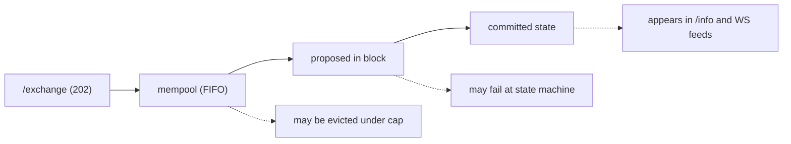
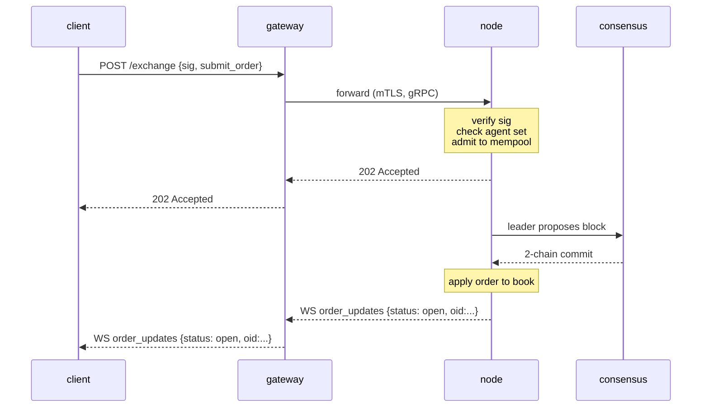

# Exchange endpoint {#post-exchange--submit-a-signed-action}

`POST /exchange` takes one signed user action and submits it to the chain.

:::info
**Status.** **stable** for the listed action variants. The endpoint shape is committed for V1.
:::

## Overview {#tldr}

Every user action that changes state is one JSON envelope with an EIP-712
signature, sent to `POST /exchange`. Examples are an order, a cancel, a vault
deposit, an agent approval and a staking move. The `type` field selects the
action variant.

- An order returns `200 OK` with the assigned `oid`. The handler waits for the
  commit.
- Every other action returns `202 Accepted` on admission. The commit
  confirmation arrives on the [WS feed](../ws/subscriptions.md), or you poll for
  it.

:::warning User actions only
`/exchange` is the public write path for users. Privileged and system writes
never use `/exchange`. These are oracle price submission, faucet credits,
`SystemUserModify`, `SystemSpotSend` and validator votes. They enter through
node-local queues that validator authority gates. See the
[non-bridged table](./exchange/transfers.md#non-bridged-actions) and the [faucet](./faucet.md#why-this-is-not-on-exchange).
A post of the native tag of a system action returns `400` with `ACTION_UNSUPPORTED`.
:::

## URL {#url}

```
POST  https://api.<net>.mtf.exchange/exchange
```

| Path | Wire shape |
|------|-----------|
| `POST /exchange` (gateway) | **MTF-native** (this document) |

The gateway serves the MTF-native `/exchange`. A node that you run yourself
serves the same native `/exchange` at `http://localhost:8080`.

## Request envelope {#request-envelope}

```json
{
  "signature": "0xabcd...1b",
  "nonce":     1735689600001,
  "action": {
    "type": "submit_order",
    "order": { /* one of the variants below */ }
  }
}
```

| Field | Type | Required | Description |
|-------|------|----------|-------------|
| `signature` | hex string, 65 bytes (130 hex chars; `0x` optional) | yes | A secp256k1 ECDSA signature over the EIP-712 [typed-data digest](#signing) of the action's structured fields and `nonce`, as `r ‖ s ‖ v`. The node accepts legacy `v ∈ {27, 28}` and EIP-2098 `v ∈ {0, 1}`. |
| `nonce` | uint64 | yes | Strictly increasing per actor. The usual value is `Date.now()`. The nonce is bound into the signed digest. See [idempotency](../../integration/idempotency.md). |
| `action` | object | yes | A tagged variant: `{ "type": "<snake_case_tag>", ... }`. See the [action catalog](#action-catalog) below. The size limit is 1,048,576 bytes as sent. See [action size limit](#action-size-limit). |
| `expires_after` | uint64 (ms) | no | An optional action expiry, in consensus milliseconds. Omit it or send `0` for the default: the action never expires, and the signed digest is the same as before this field existed. A non-zero value is signed into the digest, and the node rejects the action once consensus time passes it. See [action expiry](#optional-action-expiry-expiresafter). |

:::info No top-level `sender`
The envelope has no `sender` field. Each action decides which account changes:
- **Required-owner actions** (`submit_order`, `cancel_order`) carry the owner
  inside the action body, as `action.order.owner` or `action.cancel.owner`. The
  server recovers the signer from the signature. The signer must equal that
  `owner` or be an approved [agent](../../concepts/agent-wallets.md) of it.
- **Optional-owner actions** carry an optional `owner`. These are most other
  order and position actions: `batch_order`, `spot_order`, `modify`,
  `cancel_by_cloid`, `scale_order`, `chase_order`, `update_leverage`, RFQ and
  more. Omit `owner` and the recovered signer is the actor. Send it and an
  approved [agent](../../concepts/agent-wallets.md) of that `owner` can act as
  it. Some of these actions bind `owner` into the signed digest. Others resolve
  it at admission only. The field table of each action says which.
- **Sender-authorized-only actions** carry no owner field. Examples are
  governance, vault-leader and staking-authority actions. The recovered signer
  is always the actor. Action-level authorization, such as validator membership
  or vault leadership, runs at dispatch.
:::

The server rebuilds the EIP-712 typed struct from `action.type` and
`action.params`. It recovers the signer over those field values. So the
`action.params` that you send must carry the same values that you put in the
signed typed message, with the same canonical decimal strings. A mismatch
recovers a different signer, and the server rejects the request with `401`. See
[typed-data signing](../../integration/typed-data-signing.md).

### Action size limit {#action-size-limit}

An `action` can be at most 1,048,576 bytes as sent, whitespace included. The
whole request body has a cap of 2 MiB. The node refuses a larger `action` with
`400` `INVALID_REQUEST`, before it parses the action or checks the signature.

Every validator stores the exact `action` bytes in the block and checks the
signature again at commit. The cap bounds that work per action. Send compact
JSON: a compact 1,000-leg `batch_order` is between a quarter and a half of the
cap.

An `action` under the cap can still fail to fit one block when most of it is
non-ASCII text. The verdict is then `200` with `INVALID_REQUEST`. The public
endpoint refuses a body over 1 MiB with `413` and an HTML page, before the node
sees it. See [block 17,113,494](../../changelog/block-17113494.md#action-byte-cap).

## Signing {#signing}

The signature is a secp256k1 ECDSA recovery over a standard EIP-712 digest. You
sign each action as structured EIP-712 typed data (`eth_signTypedData_v4`). Each
action has its own primary type, `MetaFluxTransaction:<Action>`, so a wallet
shows each field by name. The server rebuilds the typed struct from
`action.type` and `action.params`, computes the digest again, and recovers the
signer:

```
struct_hash = keccak256( typeHash(MetaFluxTransaction:<Action>) ‖ encodeData(fields) )
signed_hash = keccak256( 0x1901 ‖ domain_separator ‖ struct_hash )
```

The domain separator is:

```
domain_separator = keccak256(
  keccak256("EIP712Domain(string name,string version,uint256 chainId,address verifyingContract)") ‖
  keccak256("MetaFlux") ‖
  keccak256("1") ‖
  chainId_as_uint256_be ‖
  address_zero_padded_to_32
)
```

[Typed-data signing](../../integration/typed-data-signing.md) has the type
string of each action, the atomic `encodeData` rules and worked examples. It is
the only signing scheme. A known-answer test across implementations pins the
digest of each action.

:::info `sig_scheme` is not used
Earlier builds carried a `sig_scheme` selector on the envelope. It is no longer
required, and the server ignores it: typed-data recovery always runs. Omit it.
If you send it, the only accepted value is `"typed"`.
:::

### Chain IDs {#chain-ids}

| Network | `chainId` |
|---------|-----------|
| Devnet (default) | `31337` |
| Testnet | `114514` |
| Mainnet | `8964` |

The signing-domain `chainId` must equal the consensus `chain_id` of the node.
Take it from the table above, or confirm it with the `eth_chainId` call in
[networks](../../networks.md#summary). A signature with the wrong `chainId`
returns `401`, because the recovered address differs from the action's `owner`.
For a sender-authorized action, it recovers a phantom address that passes no
authorization check. [Networks](../../networks.md) lists the endpoints.

A `chainId` is a signing-domain value. It does not identify a chain, because two
chains can use the same one. To confirm which chain an endpoint serves, read
[`chain_identity`](../rest/info/node.md#chain-identity) on `exchange_status`.

### Action expiry (`expiresAfter`) {#optional-action-expiry-expiresafter}

Any action can carry an expiry, so that nobody can replay or relay it late. Send
`expires_after` (uint64 milliseconds) next to `action`, `nonce` and `signature`.
Set the same value in the signed typed message.

- `0` or absent is the default. The digest is byte-for-byte identical to the
  digest without the field, so nothing changes for an action that does not use
  it. Leave the field off, or send `0`.
- A non-zero value goes into the EIP-712 type string as the final signed field.
  See [action expiry in typed-data signing](../../integration/typed-data-signing.md#action-expiry-expiresafter).
  The expiry is signed, so a relay cannot strip or change it. The node rejects
  the action at submission if the expiry is already past. It drops the action at
  execution if consensus time passes the expiry before the action commits.

:::info `expires_after` is a deadline
It is a consensus timestamp in milliseconds. It is not a duration. Send `0` or
omit it for no expiry.
:::

## Numeric conventions {#numeric-conventions}

| Type | Wire form | Why |
|------|----------|-----|
| `uint64` ≤ 2^53 | JSON number | Safe in IEEE-754 |
| `uint64` > 2^53, `u128`, scaled integers | JSON string | A JSON number loses precision above 2^53 with no error |
| Address | hex string `"0x..."` | 20 bytes, 40 hex chars (with or without `0x`) |
| Booleans | `true` / `false` | Literal JSON |
| Optional fields | `null` or omit | Both accepted; `null` is canonical |

**Fixed-point fields.** Price and size fields are fixed-point integers with 8
decimals. USDC amounts are base units with 6 decimals. The scale is part of the
value, and the field name does not show it. For example, `px = "10050000000"`
means `100.50`. Send these values as strings. The server parses them to `u128`.

## Signed-by semantics {#signed-by-semantics}

The master key or an approved [agent wallet](../../concepts/agent-wallets.md)
signs an action. One rule decides which:

An agent can sign an action only if that action carries an `owner` field.

There is no top-level `sender` field and no account header. The node reads the
account from the action body. This gives exactly two classes.

| Class | How the node finds the account | Who can sign |
|-------|--------------------------------|--------------|
| **`master / agent`** | The action carries `owner`. | The `owner` key, or an approved agent of `owner`. |
| **`master only`** | The action has no `owner`. The signer **is** the account. | The account's own key. |

The field tables below call the second class **sender-authorized**. Both names
mean the same thing: the action has no `owner` field, so the signer is the
account. An action with an optional `owner` is `master / agent` when you send
`owner`. It is sender-authorized when you omit it.

For a `master / agent` action, the node compares the recovered signer with
`owner`. A signer that is neither `owner` nor an approved agent of `owner` gets
`401`.

:::danger An agent key on a `master only` action acts on the agent's account
A `master only` action signed by an agent key does not fail. The node sets the
account to the recovered signer. So an agent-signed
[`bridge_withdraw`](./exchange/transfers.md#bridge_withdraw) debits the agent's
balance and leaves the master's balance unchanged. An agent-signed
[`approve_agent`](./exchange/account.md#approve_agent) approves an agent of the
agent. You get no `401` and no error. You get the wrong account. Sign every
`master only` action with the master key.
:::

The [catalog](#action-catalog) gives the class of each action. The two classes
are the only values in the Signed-by column.

### Which actions accept an agent {#which-actions-accept-an-agent}

These actions carry an `owner`, so an approved agent can sign them. This list is
complete.

| Group | Actions |
|-------|---------|
| Perp orders | [`submit_order`](./exchange/orders.md#submit_order), [`batch_order`](./exchange/orders.md#batch_order), [`scale_order`](./exchange/orders.md#scale_order), [`chase_order`](./exchange/orders.md#chase_order), [`twap_order`](./exchange/orders.md#twap_order). The last three also take a spot pair; see [the spot lane](../../concepts/order-types.md#synth-on-spot) |
| Cancels | [`cancel_order`](./exchange/orders.md#cancel_order), [`batch_cancel`](./exchange/orders.md#batch_cancel), [`cancel_by_cloid`](./exchange/orders.md#cancel_by_cloid), [`cancel_all_orders`](./exchange/orders.md#cancel_all_orders), [`cancel_scale`](./exchange/orders.md#cancel_scale), [`cancel_chase`](./exchange/orders.md#cancel_chase), [`twap_cancel`](./exchange/orders.md#twap_cancel), [`schedule_cancel`](./exchange/orders.md#schedule_cancel) |
| Amends | [`modify`](./exchange/orders.md#modify), [`batch_modify`](./exchange/orders.md#batch_modify) |
| Spot | [`spot_order`](./exchange/spot.md#spot_order), [`spot_cancel`](./exchange/spot.md#spot_cancel) |
| Margin | [`update_leverage`](./exchange/margin-risk.md#update_leverage), [`update_isolated_margin`](./exchange/margin-risk.md#update_isolated_margin), [`top_up_isolated_only_margin`](./exchange/margin-risk.md#top_up_isolated_only_margin), [`set_position_mode`](./exchange/account.md#set_position_mode) |
| Specialist venues | [`rfq_request`](./exchange/rfq-utility.md#rfq_request), [`rfq_quote`](./exchange/rfq-utility.md#rfq_quote), [`rfq_accept`](./exchange/rfq-utility.md#rfq_accept), [`fba_submit`](./exchange/rfq-utility.md#fba_submit). The three RFQ actions are the option trade path. They refuse any market that is not an active option series |

Every other action is `master only`. This includes all fund movement:
withdrawals, transfers, vaults, Earn and staking. It also includes all account
control: agent approval, sub-accounts, multi-sig, display name, referrer,
builder-fee approval, portfolio-margin enrolment, abstraction config, priority
bids and encrypted orders.

On `submit_order` and `cancel_order`, the `owner` field is required. On every
other action in the table above, it is optional. Omit it and the signer trades
for itself.

---

## Action catalog {#action-catalog}

Each variant is a tagged object, `{ "type": "<snake_case_tag>", <flat body> }`.
The body keys sit directly under the action object. There is no PascalCase
`type` and no universal `params` wrapper. For example, `submit_order` carries an
`order` object, `cancel_order` carries a `cancel` object, and the
sender-authorized actions carry a `params` object.

Each lane has one page with the field definitions of its actions:

| Page | Actions |
|---|---|
| [Perpetual orders](./exchange/orders.md) | place, cancel, modify, TWAP, scale, chase, triggers |
| [Spot trading](./exchange/spot.md) | `spot_order`, `spot_cancel` |
| [Spot margin & Earn](./exchange/spot-margin.md) | leveraged spot, and the lending pool that funds it |
| [Margin & risk](./exchange/margin-risk.md) | leverage, isolated margin, position mode |
| [RFQ & FBA](./exchange/rfq-utility.md) | quote requests, batch auctions |
| [Account & access](./exchange/account.md) | agent wallets, sub-accounts, multi-sig, margin mode |
| [Staking](./exchange/staking.md) | delegate, undelegate, claim |
| [Vaults](./exchange/vaults.md) | create, deposit, redeem, configure |
| [Transfers & bridge](./exchange/transfers.md) | `send_asset`, transfers between Core and EVM, withdraw to an external chain |
| [Priority & encrypted](./exchange/utility.md) | `priority_bid`, `submit_encrypted_order` |
| [Spot deployment](./exchange/deploy-spot.md) | MIP-1: register a token, list a pair |
| [Perp deployment](./exchange/deploy-perp.md) | MIP-3: deploy a perpetual market |

:::warning `px` and `size` are `u64` on the native wire
`px` and `size` are unsigned fixed-point `u64` values on the native wire. Send
them as JSON numbers. The node decodes them as `u64`, then widens them
internally. Addresses are `0x`-hex (40 chars). A `cloid` is `0x` and 32 hex
chars (16 bytes).
:::

### Order placement and lifecycle {#order-placement--lifecycle}

:::tip
For a first integration, read [placing orders](../../integration/placing-orders.md).
It places one perp limit order end to end. It then ranks the actions in the
table below, so that you can skip most of them at first.
:::

| `type` | Purpose | Signed-by | Idempotent |
|--------|---------|-----------|-----------|
| [`submit_order`](./exchange/orders.md#submit_order) | Place one order | master / agent | by `cloid` |
| [`batch_order`](./exchange/orders.md#batch_order) | Place N orders under one signature | master / agent | per-leg `cloid` |
| [`cancel_order`](./exchange/orders.md#cancel_order) | Cancel by `oid` | master / agent | yes |
| [`batch_cancel`](./exchange/orders.md#batch_cancel) | Cancel N orders under one signature | master / agent | yes |
| [`cancel_by_cloid`](./exchange/orders.md#cancel_by_cloid) | Cancel by client order id | master / agent | yes |
| [`cancel_all_orders`](./exchange/orders.md#cancel_all_orders) | Cancel all (optional asset filter) | master / agent | yes |
| [`modify`](./exchange/orders.md#modify) | Change the px or size of a resting order | master / agent | yes |
| [`batch_modify`](./exchange/orders.md#batch_modify) | Modify N orders under one signature | master / agent | per-entry |
| [`schedule_cancel`](./exchange/orders.md#schedule_cancel) | Set a cancel-all trigger at a future block | master / agent | yes |
| [`twap_order`](./exchange/orders.md#twap_order) | Schedule a sliced (TWAP) order | master / agent | by `twap_id` |
| [`twap_cancel`](./exchange/orders.md#twap_cancel) | Cancel a running TWAP parent | master / agent | yes |
| [`scale_order`](./exchange/orders.md#scale_order) | Place an N-rung ladder under one signature | master / agent | by `cloid` |
| [`cancel_scale`](./exchange/orders.md#cancel_scale) | Cancel a whole ladder by its shared `cloid` | master / agent | yes |
| [`chase_order`](./exchange/orders.md#chase_order) | Place a self-repricing chase leg under one signature | master / agent | by `cloid` |
| [`cancel_chase`](./exchange/orders.md#cancel_chase) | Cancel a chase by its handle | master / agent | yes |

### Spot trading {#spot-trading}

Spot is a token-for-token CLOB with no leverage and no positions. Its books and
balances are separate from perps. A resting spot order locks the funds that it
would owe on a fill into a **reserved balance**. A `bid` reserves quote: its
notional at the limit price. An `ask` reserves the base that it offers.
Admission clamps the order size to what your balance funds. Each side pays its
fee from the leg that it receives. Both actions are sender-authorized by
default: omit `owner` and the signer is the trader. Both also take an optional
`owner` that is bound into the digest, so an approved agent can act for its
account. See [spot trading](../../products/spot.md) for the full model.

| `type` | Purpose | Signed-by | Idempotent |
|--------|---------|-----------|-----------|
| [`spot_order`](./exchange/spot.md#spot_order) | Place one spot order | master / agent | by `cloid` |
| [`spot_cancel`](./exchange/spot.md#spot_cancel) | Cancel a resting spot order by `oid` | master / agent | yes |

### Spot margin and Earn {#spot-margin--earn}

:::info Spot margin is cross-collateralized
Leveraged spot ([spot margin](../../products/spot-margin.md)) takes its margin
from your one unified USDC account. That is the same collateral that backs your
perpetual positions. Its lending supply side is [Earn](../../concepts/earn.md).
A pair opens only after governance calibrates its risk parameters. No pair is
calibrated yet, so treat the lane as a preview. Forced liquidation settles
through the same path as a voluntary close (see
[Liquidation](../../products/spot-margin.md#liquidation)). The maintenance
ratios of each pair are still being calibrated. Do not assume production safety
at scale.
:::

A leveraged spot position is cross-margined against your one unified USDC
account. Its initial-margin requirement is held against your account-wide free
collateral, the same as a perpetual open. There is no separate collateral
deposit. A quote borrow from the pair's Earn pool funds 100% of the buy. The
bought base is held segregated on the margin account, and it never enters your
spendable balances. The collateral is shared. So an open spot-margin position
reduces your perpetual margin headroom, and a perpetual loss reduces the
collateral that backs the spot-margin position. See
[margin modes](../../concepts/margin-modes.md).

Earn is the other side. Suppliers deposit the lendable quote for pool shares.
The borrow interest that spot-margin traders pay lifts the value of each share.

All actions here are sender-authorized: the signer is the actor, and there is no
`owner`. `amount`, `shares` and `borrow` are decimals sent as JSON strings.
`size` and `limit_px` are `u64` values on the `1e8` and raw-lot planes, as on a
[`spot_order`](./exchange/spot.md#spot_order). Each action returns the
[`202 Accepted`](#202-accepted--non-order-admission) admission envelope, with no
synchronous `oid`. Read the committed outcome on
[`/info` `spot_margin_state`](./info/spot.md#spot_margin_state) and
[`earn_state`](./info/spot.md#earn_state).

| `type` | Purpose | Signed-by | Idempotent |
|--------|---------|-----------|-----------|
| [`spot_margin_open`](./exchange/spot-margin.md#spot_margin_open) | Borrow, then IOC-buy base on leverage | master only | no |
| [`spot_margin_close`](./exchange/spot-margin.md#spot_margin_close) | Sell held base, repay the loan | master only | no |
| [`earn_deposit`](./exchange/spot-margin.md#earn_deposit) | Supply quote into the lending pool for shares | master only | no |
| [`earn_withdraw`](./exchange/spot-margin.md#earn_withdraw) | Redeem pool shares (idle-bounded) | master only | no |
| [`spot_margin_deposit`](./exchange/spot-margin.md#spot_margin_deposit) | **Retired.** It commits nothing. There is no separate collateral bucket | master only | — |
| [`spot_margin_withdraw`](./exchange/spot-margin.md#spot_margin_withdraw) | **Retired.** It commits nothing. Withdraw USDC from your account instead | master only | — |

A new pool pays nothing. The first
[`earn_deposit`](./exchange/spot-margin.md#earn_deposit) creates the pool with a
borrow rate of zero. Nothing on the public path can change that rate. Only the
validator action `createEarnPool` (201) sets it. That action is a ⅔-stake
governance vote, and it is
[not on `/exchange`](./exchange/transfers.md#non-bridged-actions). Until that
vote passes, the share value does not move and a deposit earns exactly 0. The
same vote also approves the asset as lendable and sets the pool's
`reserve_factor_bps`. A later vote on an existing pool changes only those two
numbers. Supply, shares and the borrow index do not change. The rate cap is
20000 bps per year (200%).

### Spot deployment (MIP-1) {#spot-deployment}

Six sender-authorized actions let any account register a spot token, list a pair
for it, price it, open it and mint its genesis supply. The signer is the
deployer. There is no `owner` field. Every later call on a token or pair is
refused unless the signer is the deployer of record. See
[MIP-1](../../mip/mip-1.md) for the model.

Registering a token or a pair charges a deploy fee when it commits. The fee is
the current Dutch-clock ask on that stream. You pay it from your free
collateral. There is no pre-posted bid. `max_deploy_fee` sets your upper bound:
if the ask is above the value that you signed, the call is rejected and nothing
is charged. This lane has no bid, no escrow and no refund step.

| `type` | Purpose | Signed-by | Charges a deploy fee |
|--------|---------|-----------|----------------------|
| [`spot_register_token`](./exchange/deploy-spot.md#spot_register_token) | Register a new spot token | deployer (sender) | yes, `TokenRegister` stream |
| [`spot_register_pair`](./exchange/deploy-spot.md#spot_register_pair) | List a `(base, quote)` trading pair | deployer (sender) | yes, `SpotPairDeploy` stream |
| [`spot_set_pair_params`](./exchange/deploy-spot.md#spot_set_pair_params) | Set the pair's fee tier and min notional | pair deployer | no |
| [`spot_set_pair_active`](./exchange/deploy-spot.md#spot_set_pair_active) | Open or close the pair to new orders | pair deployer | no |
| [`spot_seed_holders`](./exchange/deploy-spot.md#spot_seed_holders) | Stage genesis holder rows (repeatable) | token deployer | no |
| [`spot_finalize_supply`](./exchange/deploy-spot.md#spot_finalize_supply) | Check the staged total, then mint once | token deployer | no |

Every action here returns the
[`202 Accepted`](#202-accepted--non-order-admission) admission envelope. Confirm
the allocated ids and the committed spec on
[`/info` `spot_meta`](./info/spot.md).

### Perp deployment (MIP-3) {#perp-deployment}

Twelve sender-authorized actions let an account register a perp market in its
own dex, configure it, open it and price it. The signer is the deployer. After
the first registration, only the deployer of that market can call the rest. A
[sub-deployer](./exchange/deploy-perp.md#perp_set_sub_deployers) that holds the
matching permission bit can also call them. A market lands in the deployer's own
dex and never in the primary dex. See [MIP-3](../../mip/mip-3.md) and
[the field definitions](./exchange/deploy-perp.md).

Every action here is refused unless two things are true: governance leaves the
`mip3_enabled` off-switch open, and the target is a MIP-3 deployer market. A core
market listed by governance is not a MIP-3 deployer market, so this lane cannot
reach it.

| `type` | Purpose | Signed-by | Charges a deploy fee |
|--------|---------|-----------|----------------------|
| [`perp_register_asset`](./exchange/deploy-perp.md#perp_register_asset) | Register a perp market, and create your dex on the first call | deployer (sender), or a delegate holding bit 8 | yes, Dutch-clock ask |
| [`perp_set_leverage`](./exchange/deploy-perp.md#perp_set_leverage) | Set max leverage | deployer, or bit 1 | no |
| [`perp_set_fee_tier`](./exchange/deploy-perp.md#perp_set_fee_tier) | Set the taker, maker and deployer fees | deployer, or bit 2 | no |
| [`perp_set_maker_rebate`](./exchange/deploy-perp.md#perp_set_maker_rebate) | Set the maker rebate | deployer, or bit 3 | no |
| [`perp_set_min_size`](./exchange/deploy-perp.md#perp_set_min_size) | Set the minimum order size | deployer, or bit 4 | no |
| [`perp_set_oi_cap`](./exchange/deploy-perp.md#perp_set_oi_cap) | Set the open-interest cap, in whole units | deployer, or bit 9 | no |
| [`perp_activate_market`](./exchange/deploy-perp.md#perp_activate_market) | Open the market to trading | deployer, or bit 5 | no |
| [`perp_deactivate_market`](./exchange/deploy-perp.md#perp_activate_market) | Close the market, and cancel every resting order and parked trigger on it | deployer, or bit 6 | no |
| [`perp_set_sub_deployers`](./exchange/deploy-perp.md#perp_set_sub_deployers) | Grant a delegate every bit, or revoke it | deployer only | no |
| [`perp_set_sub_deployer_perms`](./exchange/deploy-perp.md#perp_set_sub_deployers) | Grant a delegate an exact permission mask | deployer only | no |
| [`mip3_set_oracle_px`](./exchange/deploy-perp.md#mip3_set_oracle_px) | Push the market price | deployer, or bit 0 | no |
| [`perp_set_oracle`](./exchange/deploy-perp.md#perp_set_oracle) | **Retired.** It writes a mask that nothing reads | deployer | no |

A delegate cannot delegate. Both `perp_set_sub_deployers` and
`perp_set_sub_deployer_perms` need the deployer's own key. A delegate that holds
every other bit still cannot grant or edit a delegation.

### Margin and risk {#margin--risk}

| `type` | Purpose | Signed-by |
|--------|---------|-----------|
| [`update_leverage`](./exchange/margin-risk.md#update_leverage) | Change the leverage or the isolated flag on an asset | master / agent |
| [`update_isolated_margin`](./exchange/margin-risk.md#update_isolated_margin) | Add or remove isolated margin by a signed delta | master / agent |
| [`top_up_isolated_only_margin`](./exchange/margin-risk.md#top_up_isolated_only_margin) | Add margin to a strict-isolated position | master / agent |
| [`user_portfolio_margin`](./exchange/margin-risk.md#user_portfolio_margin) | Enroll in or leave portfolio margin (PM) | master only |
| [`pm_unenroll`](./exchange/margin-risk.md#pm_unenroll) | Leave PM. A no-params alias for `user_portfolio_margin` with `enroll: false` | master only |
| [`borrow_lend`](./exchange/margin-risk.md#borrow_lend) | Supply to, or draw from, the BOLE liquidation backstop pool | master only |

### RFQ, FBA and utility {#rfq-fba--utility}

This group holds request-for-quote ([RFQ](../../concepts/rfq.md)) block
trading, the frequent-batch-auction ([FBA](../../concepts/fba.md)) entry and
the deliberate no-op. [The field definitions](./exchange/rfq-utility.md) give
the wire planes and the digest-bound `owner` rule.

The three RFQ actions are the option trade path. They take an
[option series](./info/options.md#option_series) `signing_id` as the market,
and they refuse every other market. See [options](../../products/options.md).

| `type` | Purpose | Signed-by |
|--------|---------|-----------|
| [`rfq_request`](./exchange/rfq-utility.md#rfq_request) | Open an RFQ session (taker) | master / agent (`owner` digest-bound) |
| [`rfq_quote`](./exchange/rfq-utility.md#rfq_quote) | Quote onto an open RFQ (maker) | master / agent (`owner` digest-bound) |
| [`rfq_accept`](./exchange/rfq-utility.md#rfq_accept) | Accept a quote and settle (taker) | master / agent (`owner` digest-bound) |
| [`fba_submit`](./exchange/rfq-utility.md#fba_submit) | Submit into a batch-auction window | master / agent |
| [`noop`](./exchange/rfq-utility.md#noop) | Deliberate no-op, to burn a nonce or keep a session alive | master only |

### Account management {#account-management}

| `type` | Purpose | Signed-by |
|--------|---------|-----------|
| [`approve_agent`](./exchange/account.md#approve_agent) | Approve an agent wallet | master only |
| [`set_display_name`](./exchange/account.md#set_display_name) | Set the account handle | master only |
| [`set_referrer`](./exchange/account.md#set_referrer) | Bind to a referrer address | master only |
| [`set_referrer_by_code`](./exchange/account.md#set_referrer_by_code) | Bind to the referrer that holds a referral code | master only |
| [`register_referral_code`](./exchange/account.md#register_referral_code) | Register the sender's referral code | master only |
| [`approve_broker_fee`](./exchange/account.md#approve_builder_fee) | Approve a broker fee ceiling | master only |
| [`claim_referral_rewards`](./exchange/account.md#claim_referral_rewards) | Claim accrued referral and broker-code credit | master only |
| [`claim_broker_rewards`](./exchange/account.md#claim_builder_rewards) | The same claim as `claim_referral_rewards` | master only |
| [`approve_builder_fee`](./exchange/account.md#approve_builder_fee) | The older spelling of `approve_broker_fee`. It still decodes and behaves identically | master only |
| [`claim_builder_rewards`](./exchange/account.md#claim_builder_rewards) | The older spelling of `claim_broker_rewards`. It still decodes and behaves identically | master only |
| [`create_sub_account`](./exchange/account.md#create_sub_account) | Open a sub-account under the master | master only |
| [`sub_account_transfer`](./exchange/account.md#sub_account_transfer) | Move perp cross-collateral between parent and sub | master only |
| [`sub_account_spot_transfer`](./exchange/account.md#sub_account_spot_transfer) | Move a spot token balance between parent and sub | master only |
| [`convert_to_multi_sig_user`](./exchange/account.md#convert_to_multi_sig_user) | Convert the account to multi-sig | master only |
| [`multi_sig`](./exchange/account.md#multi_sig) | Run one inner action as a multi-sig account, with the roster signatures | any submitter; the roster authorizes |
| [`set_position_mode`](./exchange/account.md#set_position_mode) | Switch between one-way and hedge position mode | master / agent |

### Staking and abstraction {#staking--abstraction}

| `type` | Purpose | Signed-by |
|--------|---------|-----------|
| [`c_deposit`](./exchange/staking.md#c_deposit) | Move spot MTF into the free staking balance | master only |
| [`c_withdraw`](./exchange/staking.md#c_withdraw) | Move the free staking balance back to spot MTF | master only |
| [`token_delegate`](./exchange/staking.md#token_delegate) | Delegate or undelegate stake | master only |
| [`claim_rewards`](./exchange/staking.md#claim_rewards) | Claim staking rewards | master only |
| [`link_staking_user`](./exchange/staking.md#link_staking_user) | Alias a staking target | master only |
| [`user_set_abstraction`](./exchange/account.md#user_set_abstraction) | Self-scope abstraction config | master only |
| [`agent_set_abstraction`](./exchange/account.md#agent_set_abstraction) | **Not available.** Every call is refused | master only |
| [`priority_bid`](./exchange/utility.md#priority_bid) | Pay a priority fee for block-front placement | master only |

### Encrypted orders {#encrypted-orders}

| `type` | Purpose | Signed-by |
|--------|---------|-----------|
| [`submit_encrypted_order`](./exchange/utility.md#submit_encrypted_order) | Threshold-encrypted order ciphertext | master only |
| [`encrypted_order_submit`](./exchange/utility.md#encrypted_order_submit) | **Retired alias.** Refused at every height. Post the canonical name | — |

### Vaults {#vaults}

| `type` | Purpose | Signed-by |
|--------|---------|-----------|
| [`create_vault`](./exchange/vaults.md#create_vault) | Leader creates a vault | master only |
| [`vault_transfer`](./exchange/vaults.md#vault_transfer) | Leader seed transfer | master only |
| [`vault_modify`](./exchange/vaults.md#vault_modify) | Update the vault config (leader only) | master only |
| [`vault_distribute`](./exchange/vaults.md#vault_distribute) | Follower deposit into a vault, from the signer's own account | master only |
| [`vault_withdraw`](./exchange/vaults.md#vault_withdraw) | Redeem follower shares | master only |
| [`register_metaliquidity_operator`](./exchange/vaults.md#register_metaliquidity_operator) | Leader grants or revokes an operator key on a Metaliquidity vault | vault leader only |

### Transfers {#transfers}

These actions move value inside the Core ledger: to another account, or between
your own spot and perp balances. Both are sender-authorized. There is no `owner`
field, so an agent signature moves the agent's own balance and never the
master's.

| `type` | Purpose | Signed-by |
|--------|---------|-----------|
| [`send_asset`](./exchange/transfers.md#send_asset) | Send one token to another account | master only |
| [`usd_class_transfer`](./exchange/transfers.md#usd_class_transfer) | Move your own USDC between spot and perp | master only |

`spot_send` and `usd_send` are not actions. They are ledger record kinds on the
[`ledger_updates`](../ws/subscriptions.md#ledger_updates) feed, and they record
what a committed transfer did. A post of either name gets `unknown variant`, the
same error as a misspelt action.

### Bridge withdrawals {#bridge-withdrawals}

These actions move value from the Core ledger to MetaFluxEVM, or off the chain
over [MetaBridge](../../bridge/index.md). Every action here is `master only`:
the recovered signer is the debited account. An agent signature debits the
agent's own account and never the master's.

| `type` | Purpose | Signed-by |
|--------|---------|-----------|
| [`core_evm_transfer`](./exchange/transfers.md#core_evm_transfer) | Move a spot asset from the Core ledger to MetaFluxEVM, optionally with an EVM payload | master only |
| [`send_to_evm_with_data`](./exchange/transfers.md#send_to_evm_with_data) | The same Core-to-EVM move in the Hyperliquid-compatible field shape. **Active.** It refuses five things that Hyperliquid accepts and ignores. See the section | master only |
| [`bridge_withdraw`](./exchange/transfers.md#bridge_withdraw) | Withdraw USDC cross-collateral to an external chain | master only |
| [`withdraw`](./exchange/transfers.md#withdraw) | **Retired.** The legacy CCTP withdrawal. It is refused at commit, and always has been | master only |

Both Core-to-EVM rows reach the same lane and land the same credit.
[Which one to use](./exchange/transfers.md#core-evm-which-action) depends on one
thing: the field shape that your client already has.

### Not on the public `/exchange` path {#not-on-the-public-exchange-path}

These are draft and legacy action names from earlier docs. Most are not bridged
on the MTF-native `/exchange` handler. Some are privileged or system writes that
must never use the public user path. Others are schema stubs that the node
recognizes but does not map. A post of one returns `400`. Read the error code as
well as the status:

- A name that the action enum does not carry fails decode and returns
  `INVALID_REQUEST` (`unknown variant`).
- A name that the enum carries but the public path refuses returns
  `ACTION_UNSUPPORTED`.

The one exception below is `MultiSig`, which is bridged. Its native tag is
`multi_sig`. See [the non-bridged table](./exchange/transfers.md#non-bridged-actions)
for the status of each name, and
[governance actions](#governance-actions-refused) for the names that decode but
never execute here.

| Draft name | Native tag (if recognized) | Why not bridged |
|-----------|----------------------------|-----------------|
| `UpdateMarginMode` | — | No native action. Isolation is the `is_isolated` flag on `update_leverage` |
| `MultiSig` | [`multi_sig`](./exchange/account.md#multi_sig) | **Bridged and executing.** A multi-sig account acts through this collect-and-execute wrapper today. It verifies the roster signatures and runs the inner action. A non-wrapped action from a multi-sig account is still rejected |
| `RegisterReferrer` | [`register_referral_code`](./exchange/account.md#register_referral_code) | **Bridged and active since [block 25,599,540](../../changelog/block-25599540.md#referral-program).** A referee binds to the code with [`set_referrer_by_code`](./exchange/account.md#set_referrer_by_code) |
| `UsdcTransfer` / `SpotTransfer` | — | The user-to-user transfer flows are not bridged |
| `WithdrawUsdc` | — | Draft name. The external withdrawal is [`bridge_withdraw`](./exchange/transfers.md#bridge_withdraw) |
| (legacy CCTP withdraw) | [`withdraw`](./exchange/transfers.md#withdraw) | **Retired.** Admitted, then rejected at every commit since genesis (`"withdraw3 disabled; use bridge_withdraw"`). Use [`bridge_withdraw`](./exchange/transfers.md#bridge_withdraw) |
| (BOLE pool) | [`borrow_lend`](./exchange/margin-risk.md#borrow_lend) | **Bridged and active.** `params.kind` `"Lend"`, `"UnLend"` and `"Repay"` are open to any account. `"Borrow"` is refused unless the sender is an approved liquidator |
| (vault distribute) | [`vault_distribute`](./exchange/vaults.md#vault_distribute) | **Bridged and active.** The self-service deposit of a follower. See [vaults](../../concepts/vaults.md#depositing) |
| (PM lifecycle) | `pm_enroll` / [`pm_unenroll`](./exchange/margin-risk.md#pm_unenroll) | `pm_enroll` has no native tag. Enroll with [`user_portfolio_margin`](./exchange/margin-risk.md#user_portfolio_margin). `pm_unenroll` is a bridged alias, with no params, for the `enroll:false` form of the same action. `pm_rebalance` is retired, and it is rejected as an unknown action |
| (cross-chain) | — | **Not an `/exchange` action.** `cross_chain_send` is not in the action enum. It fails decode and returns `400` `INVALID_REQUEST` (`unknown variant`), the same answer as a misspelt action name. It does not return `ACTION_UNSUPPORTED`. Cross-chain transfer uses a different wire: `CrossChainSend` is [CoreWriter action 19](../../evm/interacting-with-core.md), called from MetaFluxEVM |

### Governance and validator actions {#governance-actions-refused}

A governance or validator action decodes on `/exchange`, but it never executes
there. The two failures look different, and integrators often read a successful
decode as progress:

- A name that the enum does not know fails decode: `400` `INVALID_REQUEST`,
  `unknown variant`. The error lists every accepted name, and the names below
  are in that list.
- A name from this section decodes, so it passes the schema. It then hits the
  refusal: `400` `ACTION_UNSUPPORTED`.

Match on the code and ignore the message. `ACTION_UNSUPPORTED` is the contract.
The message text differs by tag, and there are at least three versions:
`governance actions are not accepted on this surface`,
`unsupported action: unsupported native action variant: <tag>` and
`action does not support typed signing`. A substring match on any one of those
sentences fails for most of the table.

The point of refusal also differs. The node refuses most of these tags after
signature recovery, and a few before it. So `AUTH_BAD_SIGNATURE` for one tag
and an immediate `ACTION_UNSUPPORTED` for another mean the same thing: the
action is not open. Neither is progress.

`ACTION_UNSUPPORTED` is not progress. A valid signature from a real validator
key gets the same answer. The public `/exchange` path carries no governance or
validator write, whoever signs it. These actions enter through the node's own
operator lane, and only a validator operator has that lane. Each accepted vote
is one vote. The change enacts only when ⅔ of stake votes for a byte-identical
payload. If two validators differ by one character, they vote for two different
proposals, and neither reaches quorum.

The table lists every such tag that the node accepts today. No client sends
these tags. The table exists so that a reader who meets one in the
`unknown variant` list, or in [`gov_history`](./info/governance.md), knows what
it is.

| Native tag | Who | What it does |
|-----------|-----|--------------|
| `gov_vote` | Validator, ⅔ stake | Aye or nay on a `gov_propose` proposal. ⅔ aye enacts it; ⅔ nay discards it |
| `vote_global` | Validator, ⅔ stake | Sets one global parameter directly, with no proposal step |
| `set_mark_mode` | Validator, ⅔ stake | Sets the mark mode of a perpetual market: automatic, oracle-synced, or a fixed price |
| `set_pm_shock_grid` | Validator, ⅔ stake | Sets the price and volatility shock grids that portfolio margin stresses positions against |
| `arm_features` | Validator, ⅔ stake | Arms protocol features to activate at a future height or time. The signature binds the feature list, so a replayed vote cannot arm a different list |
| `approve_upgrade` | Validator, ⅔ stake | Schedules or cancels the coordinated halt at which every validator swaps binaries |
| `c_validator` | The validator itself | Maintains its own record: commission, active flag, self-jail, unjail, deregister. It is not a vote: one signed action applies. A commission raise waits for a notice period. A cut applies at once |
| `vote_app_hash` | The validator node itself | The checkpoint state-hash vote that every validator node emits on its own after each checkpoint. No person casts it |
| `gov_action` | A validator, on its own node only | Carries one signed governance or validator action. The node accepts it only from its own machine, so a public caller gets `AUTH_UNAUTHORIZED`, not `ACTION_UNSUPPORTED` |

Some validator governance actions are not native tags. `/exchange` fails them at
decode with `unknown variant`, like a misspelt name. Two of them change what a
user reads, so they are listed here. The
[node streams](../../nodes/data-streams.md#node_actions-types) name them
`BridgeReissueWithdrawal` and `BridgeVoidWithdrawal`.

| Action | Who | What it does |
|-----------|-----|--------------|
| `bridge_reissue_withdrawal` | Validator governance | Re-issues one stranded or disputed bridge withdrawal under the current deployment with a new nonce. Bounded to that withdrawal's amount; refused twice for the same withdrawal. See [re-issue](./info/bridge.md#reissue) |
| `bridge_void_withdrawal` | Validator governance | Removes one queued bridge withdrawal that no validator has signed, and refunds the full debit, fee included, to the user's exchange balance. Refused once any validator has signed it, and refused twice. See [`voided`](./info/bridge.md#voided) |

Two more tags in this set, `set_metaliquidity_set` and `gov_adjust_spot_value`,
have their payloads and signing types below. Operators often get their `value`
hashing rule wrong. The types are consensus-frozen. Their presence here does not
mean that you can post these actions to `/exchange`.

| Native tag | Payload | Effect |
|-----------|---------|--------|
| `set_metaliquidity_set` | `{"address": "0x<hex>", "allowed": <bool>}` | Adds (`true`) or removes (`false`) an account from the Metaliquidity operator set. A vault leader's [`register_metaliquidity_operator`](./exchange/vaults.md#register_metaliquidity_operator) grant is checked against this set |
| `gov_adjust_spot_value` | `{"account": "0x<hex>", "value": "<decimal>"}` | Sets that account's cross-account USDC value to `value`. The value is a target. It is not a delta |

```text
MetaFluxTransaction:SetMetaliquiditySet(string metafluxChain,address account,bool allowed,uint64 nonce)
MetaFluxTransaction:GovAdjustSpotValue(string metafluxChain,address account,string value,uint64 nonce)
```

:::warning `gov_adjust_spot_value.value` is hashed verbatim
`value` is a whole-USDC decimal string. The digest takes `keccak256` of the
exact bytes that you send. The chain does not parse or format it again, so
`"100"`, `"100.0"` and `"100.00"` are three different signatures and three
different votes. Send the signed string byte for byte. Do not trim a trailing
zero. Do not let a JSON library round-trip it through a float. Do not normalize
it.

The `value` also identifies the proposal. The vote is tallied against the
decimal that it decodes to, so a spelling with a different scale is a different
proposal. Agree on the exact figure and its scale before the vote. Then every
validator sends that one spelling.
:::

Both payloads reject the zero address.

---

## Response {#response}

### Response envelope {#response-envelope}

Every `/exchange` response is one envelope, the same envelope that
[`/info`](./info.md#envelope) uses. A success carries `data`. A failure carries
`error`. The two keys never appear together.

```json
{ "data": { /* payload */ } }
```

```json
{
  "error": {
    "code":    "ORDER_INVALID_PRICE",
    "message": "price off grid: 12345 is not a multiple of tick_size 100",
    "details": { "field": "px", "limit": "100", "actual": "12345" }
  }
}
```

`code` is the stable contract. Match on it. `message` is prose, and it can
change in any release. Never match on it. `details` is present only when the
rejection names a bound. Otherwise it is omitted, and it is never sent as `{}`.
The [error reference](../errors.md) lists every code, its status and the action
to take.

The HTTP status keeps its normal meaning. It does not replace the envelope, and
the envelope does not replace it.

The payload inside `data` depends on the action class:

- Order-type actions ([`submit_order`](./exchange/orders.md#submit_order),
  [`batch_order`](./exchange/orders.md#batch_order), [`spot_order`](./exchange/spot.md#spot_order),
  [`scale_order`](./exchange/orders.md#scale_order), [`chase_order`](./exchange/orders.md#chase_order))
  return `200 OK` with a `statuses` array. The handler waits for the commit and
  dispatch, and returns the real assigned `oid`.
- All other actions return the admission payload. The status is `200 OK` when
  the node sees the commit inside the wait window, and `202 Accepted` when it
  does not. Treat both as admitted, and read `committed`.
- [`batch_cancel`](./exchange/orders.md#batch_cancel-reply) returns the
  admission payload and a `statuses` array, with one `canceled` or `error` entry
  per leg.
- Any admission-time rejection returns the `error` envelope, at the status that
  its code maps to.

### `200 OK` on the order path {#200-ok--order-path-synchronous-oid}

An order-type action blocks for up to the order-wait window of the node
(default 5 s). The response then carries the real `oid` and the resting or
filled status. On a timeout, it returns a `pending` entry. It never returns a
made-up oid.

The echoed `oid` is a string of decimal digits. Every id on a response is a
string, so a JavaScript client cannot lose digits. See
[Ids and wire shapes](../../changelog/ids-and-wire-shapes.md#id-strings). The
`oid` inside a signed cancel or modify payload stays a `uint64` number, because
the typed digest binds `uint64 oid` and is consensus-frozen. A `batch_order` or
`scale_order` resolves to one entry per leg or rung, including a parked trigger
leg. A single order resolves to one entry.

```json
{ "data": { "statuses": [ { "resting": { "oid": "12345", "cloid": "0x..." } } ] } }
```

### Per-order `statuses` {#per-order-statuses}

`statuses` holds one entry per leg, in input order. Each entry is a single-key
object that names the outcome of the leg:

```json
{ "resting": { "oid": "12345", "cloid": "0x..." } }                     // posted to book (cloid echoed only here, only if sent)
{ "filled":  { "oid": "12345", "total_sz": "100000000", "avg_px": "10050000000" } }  // matched
{ "error":   { "code": "MARGIN_INSUFFICIENT", "message": "..." } }     // this leg was rejected
{ "noop":    { "reason": "position already flat, nothing to reduce" } } // accepted, and it changed nothing
{ "parked":  { "oid": "12345", "cloid": "0x..." } }                     // trigger leg accepted, and held off the book
{ "canceled": { "oid": "12345" } }                                      // batch_cancel leg removed its order
{ "pending": { "action_hash": "0x<keccak>", "nonce": 1735689600001 } }  // admitted but no commit seen in the wait window
```

#### `noop` {#statuses-noop}

A `noop` entry means that the node accepted the leg and it did nothing. The node
accepts a `reduce_only` order against a position that is already flat. It also
accepts one whose reducible size clamps to zero. The order burns the nonce and
places nothing, because there is nothing left to reduce.

A `noop` is a success. Do not retry it. That is why it is not an `error`. The
two outcomes need opposite handling:

| Entry | What happened | What to do |
|---|---|---|
| `error` | The leg was refused. Nothing is on the book | Fix the cause that `code` names, then resend |
| `noop` | The leg was accepted and had no effect | Nothing. Read the position again before you size another reduce |

`reason` is free prose that says which no-op it was: an already-flat leg, or a
size that clamped to zero. Branch on the `noop` key, never on `reason`. The same
rule applies to an `error`: match on `code`, never on `message`.

A `noop` entry carries no `oid`. No order was created, so no id was assigned. Do
not read an `oid` from it, and do not cancel against one.

#### `parked` {#statuses-parked}

A `parked` entry means that the node accepted the leg and holds it off the book.
A TP/SL or stop leg is **parked**. It holds a real `oid` and it is an open
order. It never rests on the book and it carries no depth, so
[`l2_book`](./info/perpetuals.md#l2_book) does not show it. The chain fires the
leg when the mark crosses its trigger price.

A `parked` entry is accepted. Do not retry it. Cancel it by its `oid` with
[`cancel_order`](./exchange/orders.md#cancel_order), or by its `cloid` with
[`cancel_by_cloid`](./exchange/orders.md#cancel_by_cloid). Both reach a parked
leg.

Callers often get this rule wrong: a `position_tpsl` group places no book order,
so its `parked` entries are its whole answer. That group used to answer an empty
`statuses` array. A mixed `normal_tpsl` batch used to answer fewer entries than
it sent legs.

`parked` is the approved term in this reference. Only
[`order_status`](./info/orders-fills.md#order_status) answers the same state
with the legacy token `triggered`.

#### Failed legs {#statuses-error}

A failed leg carries the same error object as the envelope: the same `code`, the
same prose `message` and the same optional `details`. The API has one error
shape, at both levels. So one function can handle both the leg and the
envelope:

```json
{
  "data": {
    "statuses": [
      { "resting": { "oid": "12345", "cloid": "0x...aa" } },
      { "error": {
          "code":    "ORDER_INVALID_PRICE",
          "message": "price off grid: 12345 is not a multiple of tick_size 100",
          "details": { "field": "px", "limit": "100", "actual": "12345" }
      } }
    ]
  }
}
```

That response is a success envelope. The action was admitted and ran, so the top
level carries `data` and status `200`. One leg failed inside it. A `200` does
not mean that every leg rested. Walk the array.

#### Grouping and per-leg failures {#statuses-grouping}

Per-leg failures happen only in an ungrouped batch.

| `grouping` | Behaviour | Where a failure appears |
|------------|-----------|-------------------------|
| `"na"` (default), and every single-order action | **Per-leg.** Each leg runs its own gate. A bad leg does not roll back the good ones | Inside `statuses`, as the `error` entry of that leg. The envelope is still a success |
| `"normalTpsl"`, `"positionTpsl"` | **Atomic.** All or nothing. If any leg cannot be admitted, the whole action is rejected and nothing is placed. This includes a protective leg that cannot park | At the action level. The envelope carries `error`, and there is no `statuses` array |

:::danger A grouped batch never reports a per-leg failure
Do not write a handler that looks for one. When a grouped batch fails, there is
no `statuses` array to walk. Read `error.code` on the envelope.

The grouped batch is atomic for a reason. Per-leg behaviour could fill the entry
leg, fail the protective leg and leave a position with no stop. A grouped batch
places the whole family or nothing.
:::

#### `pending` {#statuses-pending}

A `pending` entry means that the action was admitted and can still commit later.
No `/info` query takes an `action_hash`. Track the order on the
[`order_updates`](../ws/subscriptions.md#order_updates) WS channel. It carries
the committed outcome, including a `rejected` status.

### `202 Accepted` on other actions {#202-accepted--non-order-admission}

Every non-order action returns the admission payload. This includes cancel,
margin, vault, staking and governance actions. The status code is `200 OK` when
the action commits inside the wait window, and `202 Accepted` when it does not.
The body is the same in both cases:

```json
{
  "data": {
    "accepted":      true,
    "mempool_depth": 3,
    "nonce":         1735689600001,
    "action_hash":   "0x<action_hash>"
  }
}
```

`mempool_depth` is for information only, at admission time. `action_hash` is the
deterministic identifier of the submission. It is `0x` and the `keccak256` of
three byte strings joined in order: the exact signed `action` bytes, the sender
address (20 bytes) and the nonce (8 bytes, big-endian). The hash binds the
sender and the nonce. So two submissions with byte-identical `action` params
produce different `action_hash` values, and a resubmit never collides with an
earlier one.

### `accepted` and `committed` {#accepted-is-not-committed}

:::danger `accepted` means admitted to the mempool
`"accepted": true` means that the action entered the mempool. It does not mean
that the action ran. Admission checks the signature, the agent approval and the
nonce shape, and nothing else. Every business rule runs later, when the block
commits. Business rules include position mode, collateral, feature gates,
parameter bounds and ownership.

No channel pushes a commit-time rejection of a non-order action. No WS channel
carries the failure. Every non-order action behaves this way. You must ask for
the verdict, because nothing sends it to you.
:::

The two classes differ, so treat them differently:

| Action class | Commit-time rejection | How to confirm |
|--------------|----------------------|----------------|
| **Order-type**: [`submit_order`](./exchange/orders.md#submit_order), [`batch_order`](./exchange/orders.md#batch_order), [`spot_order`](./exchange/spot.md#spot_order), [`scale_order`](./exchange/orders.md#scale_order), [`chase_order`](./exchange/orders.md#chase_order) | **Reported.** The `200 OK` body carries a per-leg `error` object in `statuses`, and [`order_updates`](../ws/subscriptions.md#order_updates) pushes a `rejected` status | Read the `statuses` array. For a `pending` entry, read `order_updates` |
| **Every other action**: [`twap_order`](./exchange/orders.md#twap_order), cancels, margin, vault, staking, governance and others | **Reported in this response.** The call waits for the commit, so a rejection returns the `error` envelope, and a success returns `committed: true` | Read `committed` on the payload. A `202` means that the wait expired. It does not mean that the action failed. Read the effect that the action was meant to have |

Confirm an action by its effect. The section of each action names the read that
proves it landed. Examples are a TWAP parent on
[`user_twaps`](./info/node.md#user_twaps), a leverage change on
[`account_state`](./info/account.md#account_state), and a cancel by the order's
absence from [`open_orders`](./info/orders-fills.md#open_orders). Poll that read
for a few blocks. If the effect has not appeared, the action was rejected.
Resubmit with a corrected body, and do not wait.

:::tip Read `committed`
`accepted: true` means only "admitted to the mempool". An action can be admitted
and then rejected at commit. So `accepted` alone looks like a success that it
does not promise.

`committed: true` means that the action committed and applied.
`committed: false` marks a response that reports admission and nothing more.
That happens only when the wait expired.

There is no separate verdict read. The wait is about fifty blocks, so the answer
is in this response. If you get a `202`, read again the state that the action
was meant to change. A resubmit at the same nonce is replay-safe, and the block
builder answers the replay with [`NONCE_REPLAYED`](#nonce-replayed).
:::

The most common silent rejection is a position-mode mismatch. A hedge account
must name `position_side` on an order, and it cannot use
[`twap_order`](./exchange/orders.md#twap_order). A one-way account must omit
`position_side`. Read `position_mode` from
[`account_state`](./info/account.md#account_state) once at session start, and
build every order body from it.

### Rejection envelope {#rejection-envelope}

An admission-time rejection carries no `data` key. The body is the `error`
object and nothing else:

```json
{
  "error": {
    "code":    "AUTH_BAD_SIGNATURE",
    "message": "signature: expected 130 hex chars, got 4"
  }
}
```

There is no `accepted: false` field any more. The `error` key is the rejection.

### `400 Bad Request` {#400-bad-request--malformed}

A `400` means that the request is malformed. Match on `code`. A `message` is
prose, and it can change.

This is the complete list of admission codes. Admission checks the request
shape, the signature, the agent approval, the nonce and the `cloid`, and nothing
else. So a `400` carries one of the four codes below, or one of the
[`AUTH_*` codes](#401-unauthorized--signature--authorization-failed). Every
order-body, collateral and market rule runs at commit, and answers with a
[`200`](#commit-time-codes).

| `error.code` | Cause | Remediation |
|--------------|-------|-------------|
| `INVALID_REQUEST` | A field is missing, has the wrong size, or does not parse. Examples: a signature that is not 130 hex chars, an `owner` that is not 40 hex chars, an `action` that fails to parse, an empty `orders` or `cancels` array, a number above `2^128 - 1`, an `action` over 1 MiB | Fix the field that the `message` names. Do not retry the same bytes |
| `ACTION_UNSUPPORTED` | The action variant is recognised but not bridged on `/exchange`. Or a field selects a behaviour with no core equivalent: `tif: "aon"`, `stp_mode: "reject"`, or a `stop_loss` or `take_profit` with no `trigger` block | See the [non-bridged table](./exchange/transfers.md#non-bridged-actions) and use a supported value |
| `ORDER_DUPLICATE_CLOID` | `submit_order` reused a client order id on the same account | Use a fresh `cloid`. Check first whether the earlier submission rested |
| `PRECONDITION_FAILED` | A state rule refused the action, and the rule has no code of its own. Examples: a trailing callback of `0`, a trailing leg on the wrong side, an owner-less action that is not sender-authorized | Read `message` for the reason. Do not match on it |

The message does not make the fix clear for four `PRECONDITION_FAILED` cases:

- **`trail_px: 0`** on a `trigger` block. The presence of the key selects the
  trailing signing type. So an explicit `0` is a present trail, and the node
  does not read it as absent. Omit the key. See
  [trailing stops](./exchange/orders.md#trailing-stops).
- **A trailing leg on the take-profit side.** The ratchet follows a winning
  position, so only the stop-loss can trail. Put `trail_px` on the protective
  leg.
- **`market settled — trading closed`.** A delist closed this market
  permanently. Every order on it is refused, reduce-only included. A retry
  never succeeds. Test `settled` on [`markets`](./info/perpetuals.md#markets),
  and do not test the message. See
  [Delisting a perp market](../../products/perpetuals.md#delisting).
- **`this node is not on the exchange-serving allowlist`.** Nothing in your
  request is wrong, and the message carries no address. The node that you
  reached does not serve `POST /exchange` writes. Treat it as a routing failure:
  retry the identical bytes against another endpoint. A new signature, a new
  nonce or a wait changes nothing.

  A node can start to refuse at any time, with no restart and no version change.
  So handle this case on every write, and not only at startup. The public
  endpoint is `api.testnet.mtf.exchange`. An aggregator that you run yourself
  can point at a node that does not serve writes.

### Commit-time codes {#commit-time-codes}

A commit-time code comes back on a `200`, never on a `400`. The codes below name
an order-body, collateral or market rule. None of them is an admission
rejection. The rule needs block-execution context, so the chain cannot answer
it at admission. That context is the current book, the account after the fills
that landed first, and the open interest of the market at that moment. Where you
read the verdict depends on the action class:

| Action class | Where the code appears |
|---|---|
| **Order-type**: [`submit_order`](./exchange/orders.md#submit_order), [`batch_order`](./exchange/orders.md#batch_order), [`spot_order`](./exchange/spot.md#spot_order), [`scale_order`](./exchange/orders.md#scale_order), [`chase_order`](./exchange/orders.md#chase_order) | `200 OK`, in the `error` entry of that leg inside [`statuses`](#per-order-statuses). The envelope itself is a success. Walk the array |
| **Every other action** | `200 OK` whose whole body is the [rejection envelope](#rejection-envelope). A `202` means that the wait expired. It does not mean that the action failed |

| `error.code` | Cause | Remediation |
|--------------|-------|-------------|
| `ORDER_INVALID_PRICE` | `px` is off the tick grid. Carries `details` | Round to a multiple of `details.limit` |
| `ORDER_INVALID_SIZE` | `size` is off the lot grid. Carries `details` | Round to a multiple of `details.limit` |
| `ORDER_ZERO_SIZE` | Size is zero or negative | Send a positive size |
| `ORDER_BELOW_MIN_NOTIONAL` | Price × size is under the market minimum | Increase the size |
| `ORDER_SELF_TRADE` | The two sides of an [`rfq_accept`](./exchange/rfq-utility.md#rfq_accept) are one party. This code is for the RFQ lane only. On the order book, [self-trade prevention](../../concepts/order-types.md#stp-groups) cancels an order and never mints this code | Quote or accept from an account outside the taker's STP group |
| `MARGIN_INSUFFICIENT` | The account cannot fund the requirement. Carries `details` | `details.limit` is free collateral, `details.actual` is what is needed |
| `MARKET_INACTIVE` | The market is disabled, closed or reduce-only. A perp that a delist halted or settled, or that governance paused, answers `PRECONDITION_FAILED` instead | Send a closing order, or wait |
| `MARKET_OI_CAP` | Open interest is at the market cap | Nothing in the request is wrong. Wait, or trade elsewhere |
| `ASSET_INSUFFICIENT_BALANCE` | The spot balance cannot fund the transfer, withdrawal or spot order. A spot order that the balance cannot fund at all is refused with `insufficient spot balance`, and no order id is burned | Check the free balance. A held balance is not spendable |

`PRECONDITION_FAILED` comes from both points. Admission mints it for the shape
rules above. The commit mints it for every state rule that has no code of its
own. The status tells them apart: a `400` refused the request, and a `200`
refused the effect.

:::danger These codes do not mean a malformed request
Do not treat any code in this table as "the request was malformed". The request
was well formed, it was admitted, and it burned its nonce. A resend of the
identical bytes never runs the action again. See
[a replayed nonce](#nonce-replayed). Fix the cause, then sign again with a fresh
nonce.
:::

### `401 Unauthorized` {#401-unauthorized--signature--authorization-failed}

A `401` means that the signature or the authorization failed.

| `error.code` | Cause |
|--------------|-------|
| `AUTH_BAD_SIGNATURE` | The signature does not recover. Causes are malformed bytes, a bad recovery id `v`, or the wrong signing-domain `chainId`, which recovers a phantom address |
| `AUTH_UNAUTHORIZED` | The recovered address is neither the action's `owner` nor an approved agent of it |
| `AUTH_AGENT_FORBIDDEN` | The signer IS an agent of the owner, but the approval has expired or does not cover this action |

:::info Recovery runs first
The handler recovers the signer over the raw `action` bytes before it parses the
typed action. So a request with a bad signature and an unknown action type
answers `401 AUTH_BAD_SIGNATURE`, and not a `400`. Anti-replay (nonce
uniqueness) runs in committed state, in a 64-wide sliding window per account.
It does not run at admission. The HTTP edge admits a reused nonce. The block
builder then refuses it and answers [`NONCE_REPLAYED`](#nonce-replayed) at
`200`, never a `401`.
:::

### Replayed nonce {#nonce-replayed}

If the committed window already holds the nonce of an action, the action never
reaches a block. The block builder drops it and answers the waiting caller:

```json
{
  "error": {
    "code":    "NONCE_REPLAYED",
    "message": "nonce replayed: this account used this nonce, or it sits more than 64 below the newest"
  }
}
```

The status is `200`, because this is a commit verdict and not an admission
refusal. On an order action, the same object arrives as `statuses[0].error`.
Nothing committed, and the nonce is not consumed. Do not retry at the same
nonce. Sign again at a higher one.

An honest nonce can also be refused. The window is 64 wide, and its anchor is
the highest nonce that the account has ever committed. One action signed far in
the future, for example by a wrong clock, moves that anchor forward. Every later
`Date.now()` nonce then sits more than 64 below the anchor. The chain refuses
each one until the wall clock passes the anchor. To recover, sign above the
anchor.

### `429 Too Many Requests` {#429-too-many-requests--rate-limited}

A rate-limited request gets this response:

```json
{
  "error": {
    "code":    "RATE_LIMITED",
    "message": "rate limit exceeded"
  }
}
```

The response carries no retry hint. Derive the wait from the refill rate.
`/exchange` costs 5 weight, and the per-IP bucket refills at 20 weight per
second, so one request comes back every 250 ms. See
[rate limits](../rate-limits.md).

### `500` and `503` {#500-503-server-side}

A `500` or `503` is a server-side failure. Your request is not the cause.

```json
{ "error": { "code": "UNAVAILABLE", "message": "gateway overloaded" } }
```

| `error.code` | HTTP | Meaning |
|--------------|------|---------|
| `INTERNAL` | 500 | A defect on our side: an arithmetic overflow or a broken invariant. `message` is always the literal `internal error`. Retry, then report it. There is nothing to fix in the request |
| `UNAVAILABLE` | 503 | An upstream is down, or the gateway's in-flight pool is full. Back off, starting at 200 ms. A sustained `UNAVAILABLE` is an operator incident |

A full mempool never causes `UNAVAILABLE`. The node's pending-action queue does
not refuse a new action. It drops the oldest pending action. See
[admission and commit](#admission--commit) below.

---

## Admission and commit {#admission--commit}

A `202` means that the mempool accepted the action. It does not mean either of
these:

- The action is in a block. The node can evict an admitted action under cap
  pressure before the next leader proposes.
- The action succeeded in the state machine. For example, an order that
  violates reduce-only passes admission but fails at commit.


```mermaid
flowchart LR
    A["/exchange (202)"] --> B["mempool (FIFO)"]
    B --> C["proposed in block"]
    C --> D["committed state"]
    B -.-> B2["may be evicted under cap"]
    C -.-> C2["may fail at state machine"]
    D -.-> D2["appears in /info and WS feeds"]
```

Track the commit status on the [WS feed](../ws/subscriptions.md), on
[`order_updates`](../ws/subscriptions.md#order_updates) and
[`fills`](../ws/subscriptions.md#fills). Or poll `/info` for `open_orders` and
`user_fills`. Correlate by `cloid`. No per-account WS event echoes the
`action_hash` from admission today, and no feed carries it. The `explorer_txs`
channel carried it, and that channel is
[removed](../../changelog/ids-and-wire-shapes.md#explorer-channels-removed). Its
replacement, [`recent_transactions`](../rest/info/chain.md#recent_transactions),
has no `hash` field. For the verdict of one action, read
[`action_outcome`](../rest/info/account-history.md#action_outcome).

## Order sequence {#sequence-diagram--place-an-order-and-see-it-on-the-book}

This diagram places an order and shows it on the book.


```mermaid
sequenceDiagram
    participant client
    participant gateway
    participant node
    participant consensus
    client->>gateway: POST /exchange {sig, submit_order}
    gateway->>node: forward (mTLS, gRPC)
    Note over node: verify sig<br/>check agent set<br/>admit to mempool
    node-->>gateway: 202 Accepted
    gateway-->>client: 202 Accepted
    node->>consensus: leader proposes block
    consensus-->>node: 2-chain commit
    Note over node: apply order to book
    node-->>gateway: WS order_updates {status: open, oid:...}
    gateway-->>client: WS order_updates {status: open, oid:...}
```

## Edge cases {#edge-cases}

<details>
<summary>Show edge cases</summary>

- **A race between `ApproveAgent` and the first agent-signed order.** Submit
  `ApproveAgent` and wait for its commit, on
  [`order_updates`](../ws/subscriptions.md#order_updates) or by polling `/info`.
  Then start agent traffic. Or accept that the first 1–2 requests return `401`,
  and retry with linear backoff for a couple of committed blocks.
- **A cancel arrives after the fill commits.** It returns `"order not found"`.
  This is harmless. If accuracy matters, watch fills first.
- **An order is admitted but fails at commit.** For example, fills between
  admission and commit cause a reduce-only violation. The `statuses` entry
  carries an `error` object, and the order is not on the book.
- **Numeric overflow on fixed-point fields.** Any value that fits in `u128` is
  accepted. An encoded string above `2^128 - 1` is rejected with `400`
  `INVALID_REQUEST`.
- **An empty `batch_order.orders` or `batch_cancel.cancels`.** Admission rejects
  it with `400` `INVALID_REQUEST`.
- **Cross-block atomicity.** A `batch_order` with multiple legs is
  block-atomic: all legs see the same begin-block state. The legs are not atomic
  across blocks. A second order action in a later block sees the result of the
  first.

</details>

## See also {#see-also}

- [Placing orders](../../integration/placing-orders.md): the guided order path
- [`POST /info`](./info.md): the read path (MTF-native)
- [Agent wallets](../../concepts/agent-wallets.md)
- [Signing walkthrough](../../integration/signing.md)
- [Typed-data signing](../../integration/typed-data-signing.md): the EIP-712 signing scheme
- [Order types](../../concepts/order-types.md)
- [Idempotency](../../integration/idempotency.md)
- [Errors](../errors.md)
- [Rate limits](../rate-limits.md)

## FAQ {#faq}

<details>
<summary>Show FAQ</summary>

**Q: How are actions signed?**
A: As EIP-712 structured typed data (`eth_signTypedData_v4`), with one primary type per action (`MetaFluxTransaction:<Action>`). Wallets such as MetaMask, Rabby and Ledger then show each field by name, and not an opaque blob. The server rebuilds the typed struct from `action.type` and `action.params`, computes the digest again and recovers the signer. So `action.params` must carry the same field values that you signed, with the same canonical decimal strings. A known-answer test across implementations pins the digest of each action. The full specification is in [typed-data signing](../../integration/typed-data-signing.md).

**Q: Can I batch unrelated actions in one request?**
A: No. Each request carries one `action`. To batch orders, use `batch_order`: an `orders: []` array under one signature. To batch cancels, use `batch_cancel`: a `cancels: []` array. Other batch actions follow the same pattern.

**Q: What is the smallest request?**
A: A cancel of one oid. It is about 250 bytes, including the 65-byte signature and the 40-char sender. Most orders are 350–500 bytes.

**Q: How do I handle a `429`?**
A: Back off on a fixed schedule of your own. The response carries no `retry_after_ms`. An order-flow bot should rate-limit itself on the client side, before it reaches the limit. `/exchange` costs 5 weight against a per-IP budget that refills at 20 weight per second, so one IP sustains 4 orders per second. See [rate limits](../rate-limits.md).

**Q: Does `nonce` need to be a timestamp?**
A: No. It must increase strictly per `sender`. The usual value is `Date.now()`, because it increases and is readable in logs. Any increasing uint64 works.

</details>
