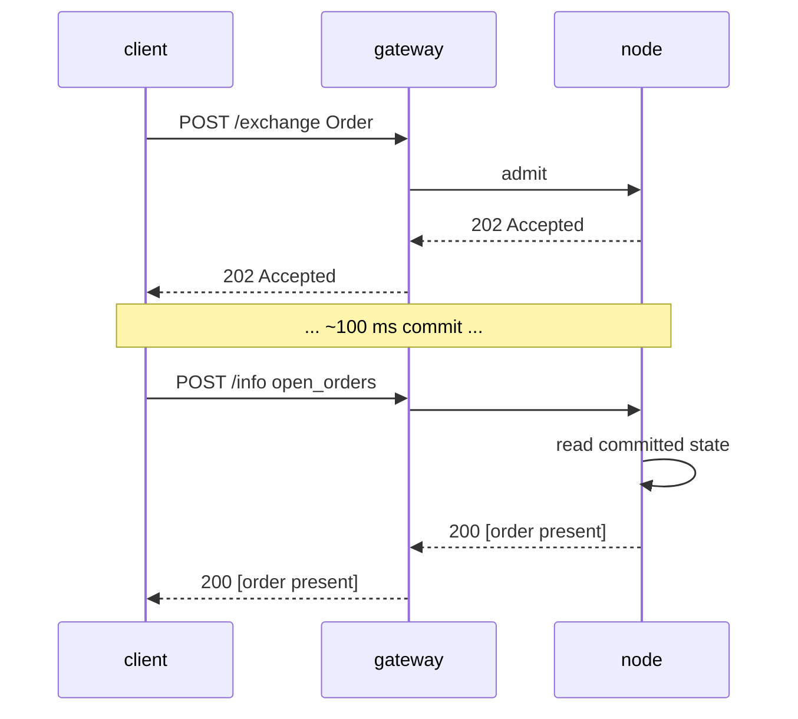

# `POST /info` — read & query endpoint

:::info
**Status.** **stable** shape. Query types are added over time; the envelope is committed.
:::

## TL;DR

Single endpoint, multi-type. Dispatches on the request body's `type` field. Read-only — never mutates state, never requires a signature.

:::tip
**Split by product.** Perp-market read queries are on [perpetual queries](./info/perpetuals.md); spot, spot-margin, and Earn read queries are on [spot & margin queries](./info/spot.md). This page covers the envelope, conventions, and account/governance/vault/validator reads.
:::

## URL

```
POST  https://<net>-gateway.mtf.exchange/info
```

| Path | Wire shape |
|------|-----------|
| `POST /info` (gateway) | MTF-native (this document) |

The gateway serves the MTF-native `/info`. Running the node yourself, the same
native `/info` is served directly at `http://localhost:8080`.

## Envelope

Request:

```json
{ "type": "<query_type>", /* type-specific args */ }
```

Response:

```json
{ "type": "<query_type>", "data": { /* type-specific */ } }
```

On unknown `type`: `400 Bad Request` with `{"error":"unknown info type: <X>"}`.
On unknown resource (e.g. unknown vault id): `404 Not Found` with `{"error":"<resource> not found"}`.

## Query types

### `node_info`

Static node identity + protocol version. No parameters.

```json
{ "type": "node_info" }
```

Response:

```json
{
  "type": "node_info",
  "data": {
    "network":           "testnet",
    "chain_id":          114514,
    "protocol_version":  "1.0.0",
    "validator_index":   null,
    "build_commit":      "unknown",
    "version":           "0.0.1",
    "freeze_halt_supported": true,
    "uptime_seconds":    0
  }
}
```

| Field | Type | Description |
|-------|------|-------------|
| `network` | `"devnet" \| "testnet" \| "mainnet"` | Network variant, derived from `chain_id` (`31337`=devnet, `114514`=testnet, `8964`=mainnet) |
| `chain_id` | uint64 | EIP-712 chain id — the SAME value the `/exchange` signing domain must use |
| `protocol_version` | semver string | Wire-protocol version |
| `validator_index` | uint32 \| null | This node's index in the active validator set; **FLAGGED:** `null` until the runtime calls `set_validator_index` |
| `build_commit` | hex string | Operator-published build identifier; **FLAGGED:** `"unknown"` until published |
| `version` | semver string | Node software release version, baked in at build time. A release shares one `version` across its binaries — `build_commit` is the per-build distinguisher |
| `freeze_halt_supported` | bool | Always `true` for this binary — capability flag: the node honors [`exchange_status.scheduled_freeze_height`](#exchange_status), halting cleanly with exit code `77` once the freeze height commits so a node supervisor can swap in the next release |
| `uptime_seconds` | uint64 | Process uptime; **FLAGGED:** `0` until the runtime calls `set_uptime_seconds` |

These are **per-node** fields (node identity / runtime), NOT consensus state, so they legitimately differ across nodes.

### `account_state`

Per-account snapshot.

```json
{ "type": "account_state", "address": "0x<addr>" }
```

| Arg | Type | Required |
|-----|------|----------|
| `address` | hex address | yes |

An **unknown address** (never seen on-chain) returns **200** with a fully zeroed
record (`account_value:"0"`, empty `positions` / `balances.spot`), NOT a `404`.

Response (a faucet-funded account, no positions):

```json
{
  "type": "account_state",
  "data": {
    "address":         "0x00000000000000000000000000000000000ca11e",
    "account_value":   "3000",
    "free_collateral": "3000",
    "maint_margin":    "0",
    "init_margin":     "0",
    "health":          "3000",
    "tier":            "Safe",
    "mode":            "Cross",
    "pm_enabled":      false,
    "positions": [],
    "balances": {
      "usdc": "3000",
      "spot": { "MTF": { "total": "10", "hold": "0" } }
    }
  }
}
```

Each `balances.spot` token is a `{total, hold}` object (HL parity): `hold` is
the amount locked behind a resting spot order (escrow), `total` is the full
balance; the spendable amount is `total − hold`. A token that is entirely held
still appears. For a
**light** read of just the margin scalars (no `positions` walk, no balance
scan — the right call for a liquidation-health poll), use
[`margin_summary`](#margin_summary).

A positioned account adds entries under `positions`:

```json
{
  "asset":             0,
  "size":              "100000000",
  "entry":             "67000.00",
  "upnl":              "5.00",
  "isolated":          false,
  "lev":               10,
  "liq":               "61000.00",
  "roe":               "0.0075",
  "funding":           "-0.12",
  "margin":            "201.00",
  "notional":          "6705.00"
}
```

| Field | Type | Description |
|-------|------|-------------|
| `account_value` | Decimal string | Equity incl. settled PnL, **whole-USDC plane** (`"3000"` = 3000 USDC, NOT base units) |
| `free_collateral` | Decimal string | Equity minus initial margin held by open positions |
| `maint_margin` | Decimal string | Σ per-asset margin used (maintenance) |
| `init_margin` | Decimal string | Held initial-margin requirement |
| `health` | Decimal string | `account_value − maint_margin` (signed; can be negative) |
| `tier` | enum | `"Safe"`, `"T0"`, `"T1"`, `"T2"`, `"T3"` (BOLE band of `account_value / maint_margin`; `"Safe"` when no maint margin) — see [tiered liquidation](../../concepts/tiered-liquidation.md) |
| `mode` | enum | `"Cross"`, `"Isolated"`, `"StrictIso"` (derived from the account's open positions) |
| `pm_enabled` | bool | Portfolio margin opt-in state |
| `positions[*].asset` | uint32 | Asset id |
| `positions[*].size` | i128 string | Signed position size in **raw lots** — `size / 10^sz_decimals` = whole units (`sz_decimals` is the market's size precision, e.g. 5 for BTC). This is the SIZE plane, orthogonal to the 1e8 price plane. |
| `positions[*].entry` | Decimal string | Per-whole-unit entry price = `\|entry_notional\| / \|real size\|`, **whole-USDC plane** |
| `positions[*].upnl` | Decimal string | Mark-to-market PnL = `real size × mark − signed entry_notional`, **whole-USDC plane** (signed) |
| `positions[*].isolated` | bool | `true` unless the position is cross-margined |
| `positions[*].lev` | uint8 | Position max leverage |
| `positions[*].liq` | Decimal string | Price (whole-USDC) at which this position alone would bring the account to maintenance — single-position cross approximation; `"0"` when size / leverage is zero (no finite liq price) |
| `positions[*].roe` | Decimal string | `upnl / initial_margin` as a decimal fraction (`initial_margin = \|entry_notional\| / leverage`); `"0"` at zero leverage / notional |
| `positions[*].funding` | Decimal string | Accrued-but-unsettled funding for the leg, **whole-USDC** (signed); `real_size × (cumulative_funding − funding_entry)` — the same form the funding settlement pays |
| `positions[*].margin` | Decimal string | Maintenance margin the leg contributes, **whole-USDC**: `\|entry_notional\| × maint_margin_ratio` |
| `positions[*].notional` | Decimal string | Position notional at mark, **whole-USDC** (signed): `real_size × mark_px` |
| `positions[*].side` | enum \| absent | **[Hedge mode](../../concepts/hedge-mode.md) only** — `"long"` / `"short"`, the leg this object reports. **Omitted on a one-way account** (a single *net* position whose `size` may be negative). A hedge account holding both legs on one asset returns **two** objects, one per side. |
| `balances.usdc` | Decimal string | **Mirrors `account_value`** (the cross USDC collateral), NOT a separate spot USDC balance |
| `balances.spot` | object | Non-USDC spot token balances, keyed by **token name** (e.g. `"MTF"`); each value is a `{total, hold}` object (`hold` = escrow locked behind resting spot orders; spendable = `total − hold`); empty if none |

### `margin_summary`

The **margin scalars only** — `account_state` minus the `positions[]` walk and
the spot-balance scan. The right call for a frequent liquidation-health poll (a
risk-watcher bot, an automated margin top-up) where the position/balance detail
is not needed. Required: `address` (0x hex).

```json
{ "type": "margin_summary", "address": "0x<addr>" }
```

Response (`data`): `address`, `account_value`, `free_collateral`,
`maint_margin`, `init_margin`, `health`, `tier`, `mode`, `pm_enabled` —
identical field semantics to the same-named fields on
[`account_state`](#account_state) (computed by the shared helper, so the two
never disagree).

### `vault_state`

Per-vault snapshot.

```json
{ "type": "vault_state", "vault": "0x<vault_addr>" }
```

Response:

```json
{
  "type": "vault_state",
  "data": {
    "vault":              "0x<addr>",
    "name":               "MFlux Conservative",
    "tvl":             "10000000000",
    "share_price":     "10500000",
    "depositor_count":    142,
    "high_water_mark": "10500000",
    "performance_fee_bps":1000,
    "lock_period_ms":     86400000,
    "strategy":           "MarketNeutral"
  }
}
```

### `staking_state`

```json
{ "type": "staking_state", "address": "0x<addr>" }
```

Response:

```json
{
  "type": "staking_state",
  "data": {
    "address":         "0x<addr>",
    "total_staked": "1000000000",
    "delegations": [
      {
        "validator":         "0x<val_addr>",
        "amount":         "500000000",
        "since_ts":          1735000000000,
        "pending_rewards":"1000000"
      }
    ],
    "pending_unstakes": [
      { "amount": "200000000", "matures_at_ts": 1735780000000 }
    ]
  }
}
```

### `fee_schedule`

```json
{ "type": "fee_schedule" }
```

Response:

```json
{
  "type": "fee_schedule",
  "data": {
    "tiers": [
      { "volume_30d": "0",         "maker_bps": "2.0", "taker_bps": "5.0" },
      { "volume_30d": "100000000", "maker_bps": "1.5", "taker_bps": "4.5" },
      { "volume_30d": "1000000000","maker_bps": "1.0", "taker_bps": "4.0" }
    ],
    "builder_rebate_bps": "0.2",
    "burn_ratio":         "0.30",
    "referrer_share_bps": "1.0"
  }
}
```

Fee rates are decimal **basis points** as strings (`"2.0"` = 2 bps = 0.02%). `burn_ratio` is a decimal fraction (`"0.30"` = 30% of fees burned). See [fees](../../concepts/fees.md).

### `open_orders`

Account-scoped resting orders across every perp book.

```json
{ "type": "open_orders", "account_id": 42 }
```

| Arg | Type | Required |
|-----|------|----------|
| `account_id` | uint64 | one of `account_id` / `address` |
| `address` | hex address | one of `account_id` / `address` |

Either `account_id` (u64) or `address` (0x hex) identifies the account. When the
request supplies `account_id`, it is echoed back in `data.account_id`.

Response:

```json
{
  "type": "open_orders",
  "data": {
    "address":    "0x<addr>",
    "account_id": 42,
    "orders": [
      {
        "oid":          12345,
        "market_id":    0,
        "side":         "bid",
        "px":        "99000",
        "size":      "700",
        "cloid":        "0x000000000000000000000000cafef00d",
        "inserted_at_ms": 1700000000000
      }
    ]
  }
}
```

| Field | Type | Description |
|-------|------|-------------|
| `address` | hex address | Resolved account address |
| `account_id` | uint64 | Echoed only when the request used `account_id` |
| `orders[*].oid` | uint64 | Server order id |
| `orders[*].market_id` | uint32 | Asset / market id the order rests on |
| `orders[*].side` | `"bid"` / `"ask"` | Order side |
| `orders[*].px` | i128 string | Resting price, fixed-point decimal string |
| `orders[*].size` | u128 string | Remaining size, fixed-point decimal string |
| `orders[*].cloid` | hex string \| null | Client order id the order was placed with (`0x` + 32 hex chars); `null` when the order set none |
| `orders[*].inserted_at_ms` | uint64 | Placement / insertion timestamp (consensus ms) |

### `user_fills`

Account-scoped fill history, served directly from committed on-node state (a
bounded per-account fill ring folded into the AppHash — no external indexer).

```json
{ "type": "user_fills", "account_id": 42 }
```

| Arg | Type | Required | Description |
|-----|------|----------|-------------|
| `account_id` | uint64 | one of `account_id` / `address` | Internal account id |
| `address` | hex address | one of `account_id` / `address` | Account address |
| `limit` | uint32 | no | Cap the number of **most-recent** records returned; absent / `0` ⇒ the full ring |

Either `account_id` (u64) or `address` (0x hex) identifies the account. When the
request supplies `account_id`, it is echoed back in `data.account_id`.

Response:

```json
{
  "type": "user_fills",
  "data": {
    "address":    "0x<addr>",
    "account_id": 42,
    "fills": [
      {
        "coin":           0,
        "side":           "B",
        "px":             "67042.50",
        "sz":             "0.125",
        "time":           1700000000555,
        "oid":            12345,
        "tid":            90123,
        "fee":            "4.19",
        "closed_pnl":     "0",
        "dir":            "Open Long",
        "start_position": "0",
        "block":          562,
        "hash":           "0x2315b79b9e82c2deb279a59448bf7841f3767d30d874e5b544d75bb9fd1e9b0c"
      }
    ]
  }
}
```

Records are ordered oldest-first (newest last). The ring is bounded, so this is
a recent window, not all history. An account with no fills returns
`"fills": []`.

| Field | Type | Description |
|-------|------|-------------|
| `address` | hex address | Resolved account address |
| `account_id` | uint64 | Echoed only when the request used `account_id` |
| `fills[*].coin` | uint32 | Asset / market id the fill executed on |
| `fills[*].side` | `"B"` / `"A"` | This leg's side token — `"B"` = buy/bid, `"A"` = sell/ask |
| `fills[*].px` | Decimal string | Execution price, **decimal USDC** (human-readable) |
| `fills[*].sz` | Decimal string | Filled size, **base units** (whole-unit) |
| `fills[*].time` | uint64 | Fill timestamp (consensus ms) |
| `fills[*].oid` | uint64 | This party's order id |
| `fills[*].tid` | uint64 | Deterministic trade id (shared by both legs of the print) |
| `fills[*].fee` | Decimal string | Fee this party paid, **decimal USDC** |
| `fills[*].closed_pnl` | Decimal string | Realized PnL on the closed portion, **decimal USDC** (signed) |
| `fills[*].dir` | string | Direction label, e.g. `"Open Long"`, `"Close Short"`, `"Open Short"`, `"Close Long"` |
| `fills[*].start_position` | Decimal string | Signed leg size BEFORE the fill, **base units** (whole-unit, signed) |
| `fills[*].block` | uint64 | Committed block height the fill settled in (on-chain locator) |
| `fills[*].hash` | hex string | Transaction hash of the originating order, `0x`-prefixed hex — lets the fill be traced on-chain |

### `user_fills_by_time`

Like [`user_fills`](#user_fills), but filtered to a time window over each
record's consensus `time`. Same fill-record shape.

```json
{ "type": "user_fills_by_time", "address": "0x<addr>", "start_time": 1700000000000, "end_time": 1700003600000 }
```

| Arg | Type | Required | Description |
|-----|------|----------|-------------|
| `account_id` | uint64 | one of `account_id` / `address` | Internal account id |
| `address` | hex address | one of `account_id` / `address` | Account address |
| `start_time` | uint64 | no | Window start (ms, inclusive); filters on the fill `time`. Absent ⇒ open lower bound |
| `end_time` | uint64 | no | Window end (ms, inclusive). Absent ⇒ open upper bound |

Response:

```json
{
  "type": "user_fills_by_time",
  "data": {
    "address":    "0x<addr>",
    "account_id": 42,
    "start_time": 1700000000000,
    "end_time":   1700003600000,
    "fills": [ /* same record shape as user_fills */ ]
  }
}
```

| Field | Type | Description |
|-------|------|-------------|
| `address` | hex address | Resolved account address |
| `account_id` | uint64 | Echoed only when the request used `account_id` |
| `start_time` | uint64 \| null | Echoed window start (`null` if omitted) |
| `end_time` | uint64 \| null | Echoed window end (`null` if omitted) |
| `fills` | array | In-window fill records (same per-fill shape as [`user_fills`](#user_fills)), oldest-first |

### `order_status`

Single-order lifecycle lookup by `oid` (server order id) **or** `cloid` (client
order id). Reads the live books, the trigger registry, and the committed fill
ring — all on-node committed state.

```json
{ "type": "order_status", "oid": 12345 }
```

Or by client order id:

```json
{ "type": "order_status", "cloid": "0x000000000000000000000000cafef00d" }
```

| Arg | Type | Required | Description |
|-----|------|----------|-------------|
| `oid` | uint64 | one of `oid` / `cloid` | Server order id |
| `cloid` | hex string | one of `oid` / `cloid` | Client order id — `0x` + 32 hex chars |

Neither present → `400 {"error":"missing field oid or cloid"}`. A malformed
`cloid` → `400`. Resolution stops at the first hit, in this order: live resting
order → parked trigger → terminal fill → unknown.

The `data.status` discriminates the branch:

`"resting"` — a live order open in a perp or spot book:

```json
{
  "type": "order_status",
  "data": {
    "status": "resting",
    "order": {
      "oid":            12345,
      "market_id":      0,
      "side":           "bid",
      "px":             "67000",
      "size":           "700",
      "inserted_at_ms": 1700000000000,
      "cloid":          "0x000000000000000000000000cafef00d"
    }
  }
}
```

`"triggered"` — a parked TP/SL/stop entry awaiting its mark cross:

```json
{
  "type": "order_status",
  "data": {
    "status": "triggered",
    "trigger": {
      "oid":              12345,
      "market_id":        0,
      "side":             "ask",
      "trigger_px":       "66000",
      "trigger_above":    false,
      "size":             "700",
      "registered_at_ms": 1700000000000,
      "fired":            false
    }
  }
}
```

`"filled"` — the most recent matching fill in the per-account ring (the `fill`
object is the same shape as one [`user_fills`](#user_fills) record):

```json
{
  "type": "order_status",
  "data": {
    "status": "filled",
    "fill": { /* same shape as a user_fills fill record */ }
  }
}
```

`"unknown"` — never seen, or evicted from the bounded ring (a `cloid`-only query
that matched no resting/triggered order also resolves here, since the trigger
registry and fill ring are keyed by `oid`):

```json
{ "type": "order_status", "data": { "status": "unknown" } }
```

| Field | Type | Description |
|-------|------|-------------|
| `status` | `"resting" \| "triggered" \| "filled" \| "unknown"` | Resolved lifecycle state |
| `order` | object | Present on `"resting"` — `oid`, `market_id`, `side` (`"bid"`/`"ask"`), `px` / `size` (fixed-point decimal strings), `inserted_at_ms`, `cloid` (hex \| null) |
| `trigger` | object | Present on `"triggered"` — `oid`, `market_id`, `side`, `trigger_px` / `size` (fixed-point decimal strings), `trigger_above` (bool: fire when mark crosses above), `registered_at_ms`, `fired` (bool) |
| `fill` | object | Present on `"filled"` — the matching fill record (see [`user_fills`](#user_fills)) |

### `block_info`

Committed block metadata. No required args (`height` is accepted but ignored —
the read state keeps only the latest committed context).

```json
{ "type": "block_info" }
```

Response:

```json
{
  "type": "block_info",
  "data": {
    "height":       562,
    "round":        562,
    "epoch":        0,
    "timestamp_ms": 1780475491562,
    "block_hash":   "0x2315b79b9e82c2deb279a59448bf7841f3767d30d874e5b544d75bb9fd1e9b0c"
  }
}
```

| Field | Type | Description |
|-------|------|-------------|
| `height` | uint64 | Latest committed block height |
| `round` | uint64 | Consensus round of that block |
| `epoch` | uint64 | Current epoch |
| `timestamp_ms` | uint64 | Block timestamp (consensus ms) |
| `block_hash` | hex string (32 bytes) | Real committed block hash (now plumbed into the read state — no longer the all-zero placeholder) |

### `agents`

Approved agent / API wallets for an account.

```json
{ "type": "agents", "account_id": 42 }
```

| Arg | Type | Required |
|-----|------|----------|
| `account_id` | uint64 | one of `account_id` / `address` |
| `address` | hex address | one of `account_id` / `address` |

Response:

```json
{
  "type": "agents",
  "data": {
    "address":    "0x<master>",
    "account_id": 42,
    "agents": [
      { "agent": "0x<agent_addr>", "name": "trading-bot", "expires_at_ms": 1700000500000 }
    ]
  }
}
```

| Field | Type | Description |
|-------|------|-------------|
| `address` | hex address | Resolved master address |
| `account_id` | uint64 | Echoed only when the request used `account_id` |
| `agents[*].agent` | hex address | Approved agent wallet address |
| `agents[*].name` | string \| null | Agent label set at approval time; `null` if unset |
| `agents[*].expires_at_ms` | uint64 \| null | Agent approval expiry (consensus ms); `null` for a never-expiring approval |

### `sub_accounts`

Sub-accounts of an account.

```json
{ "type": "sub_accounts", "account_id": 42 }
```

| Arg | Type | Required |
|-----|------|----------|
| `account_id` | uint64 | one of `account_id` / `address` |
| `address` | hex address | one of `account_id` / `address` |

Response:

```json
{
  "type": "sub_accounts",
  "data": {
    "address":    "0x<parent>",
    "account_id": 42,
    "sub_accounts": [
      { "index": 0, "address": "0x<sub_addr>" }
    ]
  }
}
```

| Field | Type | Description |
|-------|------|-------------|
| `address` | hex address | Resolved parent address |
| `account_id` | uint64 | Echoed only when the request used `account_id` |
| `sub_accounts[*].index` | uint32 | Sub-account index under the parent |
| `sub_accounts[*].address` | hex address | Sub-account address |

### `protocol_metrics`

Protocol-wide committed accumulators / counters. No parameters. Every field is
read straight off committed `Exchange` state (counters, fee pools, BOLE reserves,
staking) — nothing is computed off the match engine or oracle, so a replay
reproduces it exactly.

```json
{ "type": "protocol_metrics" }
```

Response:

```json
{
  "type": "protocol_metrics",
  "data": {
    "counters": {
      "total_orders":               1000,
      "total_fills":                750,
      "total_liquidations":         3,
      "total_deposits":             40,
      "total_withdrawals":          12,
      "total_vault_transfers":      0,
      "total_sub_account_transfers":0
    },
    "fee_pools": {
      "burned":         "8000",
      "mflux_vault":    "0",
      "validator_pool": "1000",
      "treasury":       "1000",
      "burned_mtf":     "55"
    },
    "insurance_fund_total":    "750",
    "treasury_backstop_total": "9000",
    "bole_pool": {
      "total_deposits":  "20000",
      "shortfall_total": "7"
    },
    "open_interest_total_1e8": "1500000",
    "staking": {
      "total_stake":   "100",
      "n_validators":  1,
      "n_active":      1,
      "n_jailed":      0,
      "current_epoch": 4
    },
    "counts": {
      "n_markets":             1,
      "n_spot_pairs":          5,
      "n_user_vaults":         0,
      "n_accounts_with_state": 12
    }
  }
}
```

| Field | Type | Description |
|-------|------|-------------|
| `counters.total_orders` | uint64 | Lifetime orders admitted |
| `counters.total_fills` | uint64 | Lifetime fills (the only itemized trade signal — a **count**, not a notional) |
| `counters.total_liquidations` | uint64 | Lifetime liquidations |
| `counters.total_deposits` / `total_withdrawals` | uint64 | Lifetime deposit / withdrawal counts |
| `counters.total_vault_transfers` | uint64 | Lifetime vault deposit/withdraw transfers |
| `counters.total_sub_account_transfers` | uint64 | Lifetime sub-account transfers |
| `fee_pools.burned` | Decimal string | Cumulative USDC routed to buyback-and-burn (whole-USDC) |
| `fee_pools.mflux_vault` | Decimal string | Cumulative MFlux-vault fee accrual (`"0"` — vault share zeroed) |
| `fee_pools.validator_pool` | Decimal string | Cumulative validator-pool fee accrual (whole-USDC) |
| `fee_pools.treasury` | Decimal string | Cumulative treasury fee accrual (whole-USDC) |
| `fee_pools.burned_mtf` | Decimal string | Cumulative MTF retired by the buyback executor |
| `insurance_fund_total` | Decimal string | Σ per-asset `bole_pool.insurance_fund` reserves (whole-USDC) |
| `treasury_backstop_total` | Decimal string | Σ per-asset `bole_pool.treasury_backstop` reserves (whole-USDC) |
| `bole_pool.total_deposits` | Decimal string | BOLE lending-pool total deposits (whole-USDC) |
| `bole_pool.shortfall_total` | Decimal string | Σ residual bad debt parked after the ADL → insurance → treasury waterfall |
| `open_interest_total_1e8` | u128 string | Σ per-market open interest, **1e8 book plane** (labelled `_1e8`, NOT whole-USDC) |
| `staking.total_stake` | Decimal string | Total staked MTF (whole-MTF) |
| `staking.n_validators` | uint64 | Validators in the committed set |
| `staking.n_active` | uint64 | Validators active this epoch |
| `staking.n_jailed` | uint64 | Currently-jailed validators |
| `staking.current_epoch` | uint64 | Current staking epoch |
| `counts.n_markets` | uint64 | Registered MIP-3 perp markets (`mip3_market_specs`) |
| `counts.n_spot_pairs` | uint64 | Registered spot pairs (`mip3_spot_pair_specs`) |
| `counts.n_user_vaults` | uint64 | Registered user vaults |
| `counts.n_accounts_with_state` | uint64 | Accounts with committed user-state |

:::info
**No cumulative traded-notional figure.** The engine tracks per-user **30-day fee
volume** (see [`user_fees`](#user_fees)) and a lifetime fill **count**
(`counters.total_fills`) — there is **no committed running protocol-wide traded-USD
accumulator**, so this read intentionally omits one rather than implying a volume
total exists. Counters are monotonic activity tallies, not money.
:::

State source: `locus.{counters, fee_tracker.fee_distribution, bole_pool}` + `c_staking` + registry sizes.

### `user_fees`

Per-account fee / volume tier. Required: `account_id` (u64) **OR** `address` (0x hex).

```json
{ "type": "user_fees", "account_id": 42 }
```

| Arg | Type | Required |
|-----|------|----------|
| `account_id` | uint64 | one of `account_id` / `address` |
| `address` | hex address | one of `account_id` / `address` |

Neither present → `400`. An account with no fee state returns a **200** with
zeroed volumes and the base-tier bps — the established zeroed idiom.

Response:

```json
{
  "type": "user_fees",
  "data": {
    "address":          "0x<addr>",
    "account_id":       42,
    "taker_volume_30d": "1250000",
    "maker_volume_30d": "800000",
    "vip_tier":         2,
    "mm_tier":          1,
    "referrer":         "0x<referrer>",
    "referrer_credit":  "420",
    "maker_bps":        1,
    "taker_bps":        3
  }
}
```

| Field | Type | Description |
|-------|------|-------------|
| `address` | hex address | Resolved account address |
| `account_id` | uint64 | Echoed only when the request used `account_id` |
| `taker_volume_30d` | Decimal string | Rolling 30-day taker volume (whole-USDC) |
| `maker_volume_30d` | Decimal string | Rolling 30-day maker volume (whole-USDC) |
| `vip_tier` | uint | Committed per-user VIP tier index; `0` when untracked |
| `mm_tier` | uint | Committed per-user market-maker tier index; `0` when untracked |
| `referrer` | hex address \| null | This account's referrer if set, else `null` |
| `referrer_credit` | Decimal string | Σ rebate accrued *to* this address acting as a referrer (whole-USDC) |
| `maker_bps` | uint | **Effective** maker fee bps, resolved from the committed [`fee_schedule`](#fee_schedule) volume-tier ladder at this account's 30-day maker volume |
| `taker_bps` | uint | **Effective** taker fee bps, resolved from the committed ladder at this account's 30-day taker volume |

The effective `maker_bps` / `taker_bps` are resolved per side from the committed
volume-tier ladder ([`fee_schedule`](#fee_schedule)) — the maker rate at the
account's maker volume, the taker rate at its taker volume — using the same
routine the settlement path charges with, so the reported bps match what the
account is billed. A MIP-3 per-market spec override is **not** reflected here:
this is the cross-market base rate. `vip_tier` / `mm_tier` remain the committed
per-user tier indices and are a separate signal, surfaced alongside the effective
bps.

State source: `locus.fee_tracker.{user_to_taker_volume_30d, user_to_maker_volume_30d, user_to_vip_tier, user_to_mm_tier, referee_to_referrer, referrer_credit}` + the committed volume-tier ladder.

### `staking_apr`

Effective annual staking emission rate + its committed inputs. No parameters.

```json
{ "type": "staking_apr" }
```

Response:

```json
{
  "type": "staking_apr",
  "data": {
    "total_stake":             "1000000",
    "effective_apr":           "0.08",
    "effective_apr_bps":       "800",
    "governance_rate_bps":     800,
    "emission_floor_stake":    "50000000",
    "n_active_validators":     1,
    "current_epoch":           2,
    "is_gross_pre_commission": true
  }
}
```

| Field | Type | Description |
|-------|------|-------------|
| `total_stake` | Decimal string | Total staked MTF (whole-MTF) |
| `effective_apr` | Decimal string | Annual emission rate the begin-block reward effect actually applies (fraction) |
| `effective_apr_bps` | Decimal string | `effective_apr × 10_000`, truncated |
| `governance_rate_bps` | uint | Governance-set `reward_rate_bps` (committed) — see flag |
| `emission_floor_stake` | uint string | Floor stake (`50M` MTF) below which the rate is flat |
| `n_active_validators` | uint64 | Validators active this epoch |
| `current_epoch` | uint64 | Current staking epoch |
| `is_gross_pre_commission` | bool | Always `true` — APR is gross, pre per-validator commission |

`effective_apr` is the curve the begin-block reward effect derives:

```text
effective_apr = 0.08 × √( 50M / max(total_stake, 50M) )
```

i.e. a **flat 8%** at/below 50M MTF staked, decaying ∝ 1/√stake above it (e.g.
total stake = 200M ⇒ 4× floor ⇒ ratio 1/4 ⇒ √ = 1/2 ⇒ 4% / 400 bps).

:::warning
**`governance_rate_bps` is committed but NOT consumed by the reward effect.** The
reward effect derives the payout rate from the **stake curve** above, not from
`reward_rate_bps`. Both are surfaced so the divergence is observable rather than
hidden — the effective payout APR is `effective_apr`, not `governance_rate_bps`.
And `effective_apr` is a **gross emission** rate (`is_gross_pre_commission: true`):
an individual delegator's net APR is `effective_apr × (1 − commission)`.
:::

State source: `c_staking.{total_stake, reward_rate_bps, current_epoch, validators}` + the emission curve.

### `oracle_sources`

The committed per-market oracle-source subset. Resolves the market by `asset_id`
(u32) **OR** `coin` (symbol).

```json
{ "type": "oracle_sources", "asset_id": 0 }
```

Or by name:

```json
{ "type": "oracle_sources", "coin": "BTC" }
```

| Arg | Type | Required |
|-----|------|----------|
| `asset_id` | uint32 | one of `asset_id` / `coin` |
| `coin` | symbol | one of `asset_id` / `coin` |

Missing both → `400`; unknown market → `404 {"error":"market not found"}`.

Response:

```json
{
  "type": "oracle_sources",
  "data": {
    "asset_id":          0,
    "name":              "BTC",
    "oracle_set":        true,
    "source_count":      3,
    "num_sources":       10,
    "enabled_sources":   [0, 2, 5],
    "subset_mask":       37,
    "weights_committed": false
  }
}
```

| Field | Type | Description |
|-------|------|-------------|
| `asset_id` | uint32 | Echoed / resolved asset id |
| `name` | string | Market symbol |
| `oracle_set` | bool | Whether the deployer explicitly confirmed the subset via `SetOracle` |
| `source_count` | uint64 | Number of enabled sources (popcount of the mask) |
| `num_sources` | uint8 | Total source slots (`NUM_ORACLE_SOURCES = 10`) |
| `enabled_sources` | uint8[] | Set bit indices of the subset mask (the enabled source slots) |
| `subset_mask` | uint16 | Committed 10-bit `oracle_source_subset_mask` (bit `i` set ⇒ source `i` feeds the median) |
| `weights_committed` | bool | Always `false` — per-source weights are NOT committed (see flag) |

:::warning
**Only the numeric bitmask is on-chain — venue NAMES and WEIGHTS are NOT
committed** (`weights_committed: false`). The 10 source identities are
protocol-fixed off-chain and their weights are
protocol-fixed, so committed state carries only the subset bitmask. This read
surfaces `enabled_sources` as **bit indices**, not named venues, and emits no
per-venue weight list rather than fabricating one.
:::

State source: `mip3_market_specs[asset].{oracle_source_subset_mask, oracle_set}`.

## Governance query types

The on-chain governance surface: the live vote machinery (`gov_state`), the
cross-category pending-proposal view with quorum distance (`gov_proposals`), and
the enacted-parameter audit trail (`gov_history`). All read committed
`Exchange` state; same `{type, data}` envelope. Stake quorum is ⅔
(stake-weighted); **jailed** validators are excluded from the active-stake
denominator and every tally, matching the on-chain enactment check.

### `gov_state`

The live governance surface — stake-quorum context, pending `voteGlobal` rounds,
open `govPropose` proposals, and the CURRENT value of every governed parameter.
No parameters.

```json
{ "type": "gov_state" }
```

Response:

```json
{
  "type": "gov_state",
  "data": {
    "total_stake":  "150000",
    "quorum_bps":   6667,
    "quorum_stake": "100005",
    "pending_vote_global": [
      {
        "kind":          "set_reward_rate_bps",
        "kind_id":       3,
        "votes": [
          { "validator": "0x<val>", "value": "900", "stake": "60000", "submitted_at_ms": 1700000000000 }
        ],
        "leading_stake": "60000"
      }
    ],
    "open_proposals": [
      { "proposal_id": 5, "voters": 2, "aye_stake": "90000", "nay_stake": "30000" }
    ],
    "params": {
      "reward_rate_bps":   800,
      "default_taker_bps": 5,
      "default_maker_bps": 2,
      "burn_bps":          8000
    },
    "oracle_weight_overrides": [
      { "asset_id": 0, "weights": [1000, 1000, 1000] }
    ]
  }
}
```

| Field | Type | Description |
|-------|------|-------------|
| `total_stake` | decimal string | Σ stake across all validators |
| `quorum_bps` | uint | ⅔ quorum threshold in bps (`6667`) |
| `quorum_stake` | decimal string | Stake needed to enact (`total_stake × quorum_bps / 10000`) |
| `pending_vote_global[*].kind` | string | Governed-parameter name (snake_case), e.g. `"set_reward_rate_bps"` |
| `pending_vote_global[*].kind_id` | uint | Numeric kind id |
| `pending_vote_global[*].votes[*].validator` | hex address | Voting validator |
| `pending_vote_global[*].votes[*].value` | decimal string | Decoded proposed value (hex `0x…` if the payload is opaque) |
| `pending_vote_global[*].votes[*].stake` | decimal string | The voter's stake |
| `pending_vote_global[*].votes[*].submitted_at_ms` | uint64 | Vote submission timestamp (consensus ms) |
| `pending_vote_global[*].leading_stake` | decimal string | Largest stake pooled behind a single payload in this round |
| `open_proposals[*].proposal_id` | uint64 | govPropose round id |
| `open_proposals[*].voters` | uint64 | Number of votes cast |
| `open_proposals[*].aye_stake` / `nay_stake` | decimal string | Stake voting aye / nay |
| `params` | object | Current value of every governed parameter (each a committed scalar) |
| `oracle_weight_overrides[*].asset_id` | uint32 | Asset with a per-asset oracle-weight override |
| `oracle_weight_overrides[*].weights` | uint[] | Committed per-source weights for the asset |

The `params` object carries the full governed-parameter set the vote machinery
can move (fee distribution split, staking knobs, MIP-3 limits, risk caps, per-asset
funding period / cap, spot / EVM / bridge flags, the set of disabled EVM
precompiles, …); each is the live committed value.

### `gov_proposals`

Every ACTIVE governance proposal across ALL vote categories (not just
`voteGlobal`), each with its live per-payload stake tally and distance to the ⅔
quorum. The cross-category "what is being voted on right now, and how close is
it" view. No parameters.

```json
{ "type": "gov_proposals" }
```

Response:

```json
{
  "type": "gov_proposals",
  "data": {
    "total_active_stake":  "120000",
    "quorum_bps":          6667,
    "quorum_needed_stake": "80004",
    "proposals": [
      {
        "round":         1000003,
        "category":      "vote_global",
        "sub_id":        3,
        "proposer":      "0x<val>",
        "created_at_ms": 1700000000000,
        "voter_count":   1,
        "leading_stake": "60000",
        "meets_quorum":  false,
        "payloads": [
          { "payload_hex": "0392…", "stake": "60000", "meets_quorum": false }
        ],
        "proposal": {
          "kind":         3,
          "kind_name":    "set_reward_rate_bps",
          "value":        "900",
          "title":        "Raise staking rewards",
          "proposer":     "0x<val>",
          "opened_at_ms": 1700000000000
        }
      }
    ]
  }
}
```

| Field | Type | Description |
|-------|------|-------------|
| `total_active_stake` | decimal string | Σ stake of non-jailed validators (the quorum denominator) |
| `quorum_bps` | uint | ⅔ quorum threshold in bps (`6667`) |
| `quorum_needed_stake` | decimal string | Stake a single payload must reach to enact |
| `proposals[*].round` | uint64 | Synthetic vote round id |
| `proposals[*].category` | string | Vote category, e.g. `"gov_propose"`, `"vote_global"`, `"dynamic_risk"`, `"treasury"`, `"metaliquidity"`, `"oracle_weights"`, `"funding_formula"`, `"spot_margin"` |
| `proposals[*].sub_id` | uint64 | Category-relative id (the round minus the category's range base) |
| `proposals[*].proposer` | hex address \| null | Earliest voter (proposer proxy) |
| `proposals[*].created_at_ms` | uint64 | Earliest vote timestamp (consensus ms) |
| `proposals[*].voter_count` | uint64 | Number of votes cast on the round |
| `proposals[*].leading_stake` | decimal string | Largest stake pooled behind one payload |
| `proposals[*].meets_quorum` | bool | Whether the leading payload's stake reaches the ⅔ quorum |
| `proposals[*].payloads[*].payload_hex` | hex string | A distinct voted payload (no `0x` prefix) |
| `proposals[*].payloads[*].stake` | decimal string | Active stake pooled behind that payload |
| `proposals[*].payloads[*].meets_quorum` | bool | Whether this payload alone reaches quorum |
| `proposals[*].proposal` | object \| null | The typed govPropose record when the round opened via `govPropose`, else `null` |
| `proposals[*].proposal.kind` | uint | Governed-parameter kind id |
| `proposals[*].proposal.kind_name` | string \| null | Decoded kind name (snake_case), `null` if unknown |
| `proposals[*].proposal.value` | decimal string | Proposed value |
| `proposals[*].proposal.title` | string | Human-readable proposal title |
| `proposals[*].proposal.proposer` | hex address | Account that opened the proposal |
| `proposals[*].proposal.opened_at_ms` | uint64 | Proposal open timestamp (consensus ms) |

### `gov_history`

The enacted-governance audit trail (bounded ring, oldest-first) — each entry
proves a parameter MOVED by on-chain governance vs its genesis value. No
parameters. Complements `gov_proposals` (the PENDING side).

```json
{ "type": "gov_history" }
```

Response:

```json
{
  "type": "gov_history",
  "data": {
    "count": 1,
    "enacted": [
      {
        "round":         1000003,
        "kind":          3,
        "kind_name":     "set_reward_rate_bps",
        "value":         "900",
        "via":           "vote_global",
        "enacted_at_ms": 1700000900000,
        "description":   "reward_rate_bps -> 900"
      }
    ]
  }
}
```

| Field | Type | Description |
|-------|------|-------------|
| `count` | uint | Number of entries in the ring |
| `enacted[*].round` | uint64 | Synthetic vote round that enacted |
| `enacted[*].kind` | uint | Governed-parameter kind id |
| `enacted[*].kind_name` | string \| null | Decoded kind name (snake_case), `null` if unknown |
| `enacted[*].value` | decimal string | Enacted value |
| `enacted[*].via` | `"proposal" \| "vote_global" \| "other"` | Source track — `govPropose`/`govVote` vs direct `voteGlobal` |
| `enacted[*].enacted_at_ms` | uint64 | Enactment timestamp (consensus ms) |
| `enacted[*].description` | string | Human-readable summary of the change |

The ring caps at the on-chain enacted-log bound, so this is a recent window, not
all history.

## Advanced query types (RFQ / FBA / portfolio margin)

These read the live state behind the RFQ, FBA, and portfolio-margin engines — they complement
the `market_info.fba_enabled` / `account_state.pm_enabled` flags with the engine
state itself. Same `{type, data}` envelope and MTF-native conventions. **Price
plane:** RFQ + FBA prices / sizes are raw **1e8 fixed-point** integer strings (the
book / order plane, identical to [`open_orders`](#open_orders) / [`l2_book`](./info/perpetuals.md#l2_book)),
**not** whole-USDC; portfolio-margin magnitudes are **USD cents** integer strings.

### `rfq_open`

Every open RFQ request plus its maker quotes. No parameters. See the [RFQ concept](../../concepts/rfq.md).

```json
{ "type": "rfq_open" }
```

Response:

```json
{
  "type": "rfq_open",
  "data": {
    "rfqs": [
      {
        "rfq_id":              1,
        "market_id":           7,
        "side":                "bid",
        "size":                "1000",
        "requester":           "0x<addr>",
        "requester_stp_group": 42,
        "expiry_ms":           5000,
        "limit_px":            "105",
        "created_at_ms":       10,
        "quotes": [
          {
            "maker":           "0x<addr>",
            "maker_stp_group": null,
            "price":           "104",
            "max_size":        "800",
            "valid_until_ms":  4000,
            "submitted_at_ms": 20
          }
        ]
      }
    ]
  }
}
```

`rfqs` iterates deterministically by `rfq_id`. An empty engine returns `"rfqs": []`.

| Field | Type | Description |
|-------|------|-------------|
| `rfqs[*].rfq_id` | uint64 | RFQ request id |
| `rfqs[*].market_id` | uint32 | Asset / market id the RFQ is for |
| `rfqs[*].side` | `"bid"` / `"ask"` | Side the requester wants to take |
| `rfqs[*].size` | u128 string | Requested size, 1e8 fixed-point |
| `rfqs[*].requester` | hex address | Requesting account |
| `rfqs[*].requester_stp_group` | uint \| null | Requester self-trade-prevention group; `null` when unset |
| `rfqs[*].expiry_ms` | uint64 | RFQ expiry timestamp (consensus ms) |
| `rfqs[*].limit_px` | i128 string \| null | Requester limit price, 1e8 fixed-point; `null` when unset |
| `rfqs[*].created_at_ms` | uint64 | Creation timestamp (consensus ms) |
| `rfqs[*].quotes[*].maker` | hex address | Quoting maker |
| `rfqs[*].quotes[*].maker_stp_group` | uint \| null | Maker STP group; `null` when unset |
| `rfqs[*].quotes[*].price` | i128 string | Quote price, 1e8 fixed-point |
| `rfqs[*].quotes[*].max_size` | u128 string | Max size the maker will fill, 1e8 fixed-point |
| `rfqs[*].quotes[*].valid_until_ms` | uint64 | Quote validity deadline (consensus ms) |
| `rfqs[*].quotes[*].submitted_at_ms` | uint64 | Quote submission timestamp (consensus ms) |

### `rfq_user`

RFQs an account is party to — split into those it opened and those it quoted on. See the [RFQ concept](../../concepts/rfq.md).

```json
{ "type": "rfq_user", "account_id": 42 }
```

| Arg | Type | Required |
|-----|------|----------|
| `account_id` | uint64 | one of `account_id` / `address` |
| `address` | hex address | one of `account_id` / `address` |

Either `account_id` (u64) or `address` (0x hex) identifies the account; when the
request supplies `account_id` it is echoed back in `data.account_id`. Neither
present → `400`; malformed `address` → `400 {"error":"invalid hex"}`.

Response:

```json
{
  "type": "rfq_user",
  "data": {
    "address":    "0x<addr>",
    "account_id": 42,
    "requested": [ /* <rfq>, same per-RFQ shape as rfq_open */ ],
    "quoted":    [ /* <rfq> */ ]
  }
}
```

| Field | Type | Description |
|-------|------|-------------|
| `address` | hex address | Resolved account address |
| `account_id` | uint64 | Echoed only when the request used `account_id` |
| `requested` | array&lt;rfq&gt; | RFQs this account opened (requester); same per-RFQ shape as [`rfq_open`](#rfq_open) |
| `quoted` | array&lt;rfq&gt; | RFQs this account quoted on (appears as a `maker`); same per-RFQ shape |

Each list iterates deterministically by `rfq_id`. An account party to nothing
returns a **200** with both lists empty (the established zeroed idiom).

### `fba_batch_state`

Live FBA pool plus the indicative clearing for one market. See the [FBA concept](../../concepts/fba.md).

```json
{ "type": "fba_batch_state", "market_id": 3 }
```

| Arg | Type | Required |
|-----|------|----------|
| `market_id` | uint32 | yes |

Missing `market_id` → `400`. There is **no 404** for an unregistered market: FBA
is per-market opt-in, so a market with no pool returns a **200** with zeroed
fields (`enabled:false`, `period_ms:0`, empty `orders`, `indicative:null`).

Response:

```json
{
  "type": "fba_batch_state",
  "data": {
    "market_id":      3,
    "enabled":        true,
    "period_ms":      200,
    "min_lot":        "1",
    "last_settle_ms": 500,
    "next_settle_ms": 700,
    "order_count":    2,
    "bid_count":      1,
    "ask_count":      1,
    "bid_size":       "10",
    "ask_size":       "6",
    "orders": [
      {
        "oid":             1,
        "owner":           "0x<addr>",
        "side":            "bid",
        "price":           "105",
        "size":            "10",
        "stp_group":       null,
        "submitted_at_ms": 1
      }
    ],
    "indicative": { "clearing_px": "100", "matched_size": "6" }
  }
}
```

| Field | Type | Description |
|-------|------|-------------|
| `market_id` | uint32 | Echoed market id |
| `enabled` | bool | Whether FBA is on for this market |
| `period_ms` | uint32 | Batch period |
| `min_lot` | u128 string | Minimum lot size, 1e8 fixed-point |
| `last_settle_ms` | uint64 | Last batch-settle timestamp (consensus ms) |
| `next_settle_ms` | uint64 | **Derived** `last_settle_ms + period_ms` — the next due boundary the begin-block `is_due` check uses (not stored explicitly); `0` when `period_ms == 0` |
| `order_count` | uint64 | Orders in the current window |
| `bid_count` / `ask_count` | uint64 | Per-side order counts in the window |
| `bid_size` / `ask_size` | u128 string | Per-side summed size, 1e8 fixed-point |
| `orders[*].oid` | uint64 | Server order id |
| `orders[*].owner` | hex address | Order owner |
| `orders[*].side` | `"bid"` / `"ask"` | Order side |
| `orders[*].price` | i128 string | Order price, 1e8 fixed-point |
| `orders[*].size` | u128 string | Order size, 1e8 fixed-point |
| `orders[*].stp_group` | uint \| null | Self-trade-prevention group; `null` when unset |
| `orders[*].submitted_at_ms` | uint64 | Order submission timestamp (consensus ms) |
| `indicative` | object \| null | The volume-maximising uniform price + matched size the **next** batch *would* clear given the current window — computed read-only, **not yet settled / committed**. `null` when there is no cross (one-sided or empty window) |
| `indicative.clearing_px` | i128 string | Indicative uniform clearing price, 1e8 fixed-point |
| `indicative.matched_size` | u128 string | Size that would clear at `clearing_px`, 1e8 fixed-point |

### `pm_summary`

Portfolio-margin enrollment + last-computed scenario figures for an account. See [Portfolio margin](../../concepts/portfolio-margin.md).

```json
{ "type": "pm_summary", "account_id": 42 }
```

| Arg | Type | Required |
|-----|------|----------|
| `account_id` | uint64 | one of `account_id` / `address` |
| `address` | hex address | one of `account_id` / `address` |

Either `account_id` (u64) or `address` (0x hex); neither present → `400`. A
non-enrolled account returns a **200** with `enrolled:false` and zeroed figures.

Response:

```json
{
  "type": "pm_summary",
  "data": {
    "address":                     "0x<addr>",
    "account_id":                  42,
    "enrolled":                    true,
    "enrolled_at_ms":              1000,
    "last_computed_block":         77,
    "pm_maint_margin_cents":       "250000",
    "net_value_cents":             "9000000",
    "concentration_penalty_cents": "1500"
  }
}
```

| Field | Type | Description |
|-------|------|-------------|
| `address` | hex address | Resolved account address |
| `account_id` | uint64 | Echoed only when the request used `account_id` |
| `enrolled` | bool | Whether the account is enrolled in portfolio margin |
| `enrolled_at_ms` | uint64 | Enrollment timestamp (consensus ms); `0` when not enrolled |
| `last_computed_block` | uint64 | Block height of the last PM scenario computation |
| `pm_maint_margin_cents` | u128 string | Last-computed PM maintenance requirement, **USD cents** |
| `net_value_cents` | i128 string | Last-computed account net value, **USD cents** |
| `concentration_penalty_cents` | u128 string | Last-computed concentration penalty, **USD cents** |

The worst-case scenario loss is intentionally **omitted**: it is not persisted in
committed state, and recomputing it would require re-running the scenario sweep,
which is not a read-only operation.

## Node snapshot query types

The following query types expose the node's committed-state snapshot surface. Each reads committed `core_state::Exchange` and uses the same `{type, data}` envelope and MTF-native conventions (decimal-string money, `0x`-hex addresses, `u32` asset ids, `BTreeMap` order). Keyed lookups (by address / asset), not O(N) scans, except where the set is inherently small (markets / vaults / validators) or already indexed (`liquidatable` via the BOLE index). Spot / spot-margin / Earn snapshot reads have their own page ([spot & margin queries](./info/spot.md)); perpetual market reads are on the [perpetual queries](./info/perpetuals.md) page. The general (cross-cutting) snapshot reads are below.

## General node snapshot query types

Node snapshot reads that are not specific to one trading product — exchange status,
frontend / open-order helpers, liquidation, rate limits, vaults, validators,
multi-sig, and the aggregate `web_data2`.

### `exchange_status`

Global trading status. No parameters.

```json
{ "type": "exchange_status" }
```

Response:

```json
{
  "type": "exchange_status",
  "data": {
    "spot_disabled": false,
    "post_only_until_time_ms": 0,
    "post_only_until_height": 0,
    "scheduled_freeze_height": null,
    "mip3_enabled": true
  }
}
```

| Field | Type | Description |
|-------|------|-------------|
| `spot_disabled` | bool | Spot trading globally disabled |
| `post_only_until_time_ms` | uint64 | Post-only window end (consensus ms); `0` = none |
| `post_only_until_height` | uint64 | Post-only window end (height); `0` = none |
| `scheduled_freeze_height` | uint64 \| null | Scheduled upgrade-halt height, `null` if none |
| `mip3_enabled` | bool | `true` once any MIP-3 market/pair spec is registered |

State source: `spot_disabled`, `post_only_until_*`, `scheduled_freeze_height`, `mip3_market_specs` / `mip3_spot_pair_specs`.

### `frontend_open_orders`

Like `open_orders`, plus each order's `tif` / `cloid` / `trigger` detail. Required: `address` (0x hex).

```json
{ "type": "frontend_open_orders", "address": "0x<addr>" }
```

Response:

```json
{
  "type": "frontend_open_orders",
  "data": {
    "address": "0x<addr>",
    "orders": [
      {
        "oid": 7, "market_id": 0, "side": "bid", "px": "50000", "size": "20000",
        "tif": "gtc", "cloid": "0x000…cafe",
        "trigger": { "trigger_px": "49000", "trigger_above": false },
        "inserted_at_ms": 1700000000000
      }
    ]
  }
}
```

| Field | Type | Description |
|-------|------|-------------|
| `orders[*].oid` | uint64 | On-chain order id |
| `orders[*].market_id` | uint32 | Asset id |
| `orders[*].side` | `"bid" \| "ask"` | Order side |
| `orders[*].px` / `size` | decimal string | Resting price / remaining size |
| `orders[*].tif` | `"alo" \| "ioc" \| "gtc"` | Time-in-force |
| `orders[*].cloid` | hex string \| null | Client order id, `null` if none |
| `orders[*].trigger` | object \| null | `{trigger_px, trigger_above}` if a trigger is registered for the oid, else `null` |
| `orders[*].inserted_at_ms` | uint64 | Insertion timestamp (consensus ms) |

State source: per-book resting orders + `Exchange.trigger_registry`.

### `vault_summaries`

All vaults summary. No parameters.

```json
{ "type": "vault_summaries" }
```

Response:

```json
{
  "type": "vault_summaries",
  "data": {
    "vaults": [
      { "id": 7, "address": "0x<vault>", "leader": "0x<leader>", "tvl": "10000000000", "follower_count": 2, "kind": "user" }
    ]
  }
}
```

| Field | Type | Description |
|-------|------|-------------|
| `vaults[*].id` | uint64 | Vault id |
| `vaults[*].address` / `leader` | hex address | Vault on-chain address / leader |
| `vaults[*].tvl` | decimal string | NAV proxy (high-water mark, USD cents) |
| `vaults[*].follower_count` | uint64 | Number of share holders |
| `vaults[*].kind` | `"user" \| "metaliquidity"` | Vault kind |

State source: `Exchange.user_vaults`.

> **FLAGGED.** `tvl` uses the high-water mark as the NAV proxy; full NAV needs the match-engine + oracle.

### `user_vault_equities`

Vaults a user has deposited into + share / equity. Required: `address` (0x hex).

```json
{ "type": "user_vault_equities", "address": "0x<addr>" }
```

Response:

```json
{
  "type": "user_vault_equities",
  "data": {
    "address": "0x<addr>",
    "equities": [ { "vault_id": 7, "vault_address": "0x<vault>", "shares": "1000000000000000000", "equity": "5000000000" } ]
  }
}
```

| Field | Type | Description |
|-------|------|-------------|
| `equities[*].vault_id` | uint64 | Vault id |
| `equities[*].vault_address` | hex address | Vault address |
| `equities[*].shares` | decimal string | Caller's share count (18-dec) |
| `equities[*].equity` | decimal string | `shares × share_price(high_water_mark)`, truncated |

State source: `user_vaults[*].follower_shares[addr]` (keyed per vault).

### `leading_vaults`

Vaults led by the user. Required: `address` (0x hex). Returns the same row shape as `vault_summaries`.

```json
{ "type": "leading_vaults", "address": "0x<addr>" }
```

Response:

```json
{ "type": "leading_vaults", "data": { "address": "0x<addr>", "vaults": [ /* <vault_summaries row> */ ] } }
```

State source: `Exchange.user_vaults` filtered by `leader == addr`.

### `user_rate_limit`

A user's action stats / rate-limit budget. Required: `address` (0x hex).

```json
{ "type": "user_rate_limit", "address": "0x<addr>" }
```

Response:

```json
{
  "type": "user_rate_limit",
  "data": { "address": "0x<addr>", "last_nonce": 9, "pending_count": 2, "lifetime_count": 123 }
}
```

| Field | Type | Description |
|-------|------|-------------|
| `last_nonce` | uint64 | Last accepted action nonce |
| `pending_count` | uint32 | Pending (in-flight) action count |
| `lifetime_count` | uint64 | Lifetime actions submitted |

State source: `locus.user_action_registry[addr]` (`UserActionStats`); absent account → zeroed.

### `delegator_summary`

Staking summary for an address. Required: `address` (0x hex).

```json
{ "type": "delegator_summary", "address": "0x<addr>" }
```

Response:

```json
{
  "type": "delegator_summary",
  "data": {
    "address": "0x<addr>", "total_delegated": "500", "pending_withdrawal": "50",
    "claimable_rewards": "7", "n_delegations": 2
  }
}
```

| Field | Type | Description |
|-------|------|-------------|
| `total_delegated` | decimal string | Sum of active delegations |
| `pending_withdrawal` | decimal string | Sum of pending undelegations |
| `claimable_rewards` | decimal string | Accumulated delegator rewards |
| `n_delegations` | uint64 | Number of active delegations |

State source: `c_staking.{delegations, pending_undelegations, delegator_rewards}`.

### `max_builder_fee`

Approved builder-fee ceiling for `(address, builder)`. Required: `address` (0x hex) + `builder` (0x hex).

```json
{ "type": "max_builder_fee", "address": "0x<addr>", "builder": "0x<builder>" }
```

Response:

```json
{
  "type": "max_builder_fee",
  "data": { "address": "0x<addr>", "builder": "0x<builder>", "max_fee_bps": 8, "approved": true }
}
```

| Field | Type | Description |
|-------|------|-------------|
| `max_fee_bps` | uint32 | Approved bps ceiling; `0` if not approved |
| `approved` | bool | Whether `(address, builder)` is an approved pair |

State source: `locus.fee_tracker.approved_builders[addr][builder]` (keyed).

### `user_to_multi_sig_signers`

Multisig config for an address. Required: `address` (0x hex).

```json
{ "type": "user_to_multi_sig_signers", "address": "0x<addr>" }
```

Response:

```json
{
  "type": "user_to_multi_sig_signers",
  "data": { "address": "0x<addr>", "is_multi_sig": true, "threshold": 2, "signers": ["0x…", "0x…"] }
}
```

| Field | Type | Description |
|-------|------|-------------|
| `is_multi_sig` | bool | Whether the account is multisig |
| `threshold` | uint32 | M-of-N threshold; `0` if not multisig |
| `signers` | hex address[] | Signer set; empty if not multisig |

State source: `multi_sig_tracker.configs[addr]` (`MultiSigConfig`).

### `user_role`

Derived account role. Required: `address` (0x hex).

```json
{ "type": "user_role", "address": "0x<addr>" }
```

Response:

```json
{ "type": "user_role", "data": { "address": "0x<addr>", "role": "user" } }
```

| Field | Type | Description |
|-------|------|-------------|
| `role` | `"missing" \| "user" \| "agent" \| "vault" \| "sub_account"` | Derived role |

Precedence: `vault` (a `user_vaults[*].vault_address`) → `sub_account` (`sub_account_tracker.sub_to_parent`) → `agent` (an approved agent of some master) → `user` (has a user-state / config / spot entry) → `missing`.

### `validator_l1_votes`

Current validator L1 votes. No parameters.

```json
{ "type": "validator_l1_votes" }
```

Response:

```json
{
  "type": "validator_l1_votes",
  "data": {
    "latest_round": 5,
    "votes": [ { "round": 5, "validator": "0x<validator>", "submitted_at_ms": 1700000000000 } ]
  }
}
```

| Field | Type | Description |
|-------|------|-------------|
| `latest_round` | uint64 | Latest accepted vote round |
| `votes[*].round` | uint64 | Vote round |
| `votes[*].validator` | hex address | Casting validator |
| `votes[*].submitted_at_ms` | uint64 | Submission timestamp (consensus ms) |

State source: `validator_l1_vote_tracker.round_to_votes`. The vote payload is opaque oracle bytes (decoded by Module H) — the read surface reports metadata, not the raw payload.

### `validator_summaries`

Per-validator snapshot (HL `validatorSummaries`). No parameters. Lists every validator in committed `c_staking.validators` (a small, bounded set) in committed `BTreeMap` order.

```json
{ "type": "validator_summaries" }
```

Response:

```json
{
  "type": "validator_summaries",
  "data": {
    "epoch": 3,
    "total_stake": "1400",
    "n_active": 1,
    "validators": [
      {
        "validator": "0x1111…", "signer": "0xa1a1…", "validator_index": 0,
        "stake": "1000", "self_stake": "100", "commission_bps": 500,
        "is_active": true, "is_jailed": false, "jailed_at_ms": null,
        "unjail_at_ms": null, "first_active_epoch": 2
      }
    ]
  }
}
```

| Field | Type | Description |
|-------|------|-------------|
| `epoch` | uint64 | Current staking epoch (`c_staking.current_epoch`) |
| `total_stake` | decimal string | Σ stake across all validators |
| `n_active` | uint64 | Size of the active set |
| `validators[*].validator` | 0x address | Validator primary address |
| `validators[*].signer` | 0x address | Operational signer (hot key) |
| `validators[*].validator_index` | uint32 | Consensus index |
| `validators[*].stake` | decimal string | Total delegated stake |
| `validators[*].self_stake` | decimal string | Validator's own contribution |
| `validators[*].commission_bps` | uint32 | Commission (basis points) |
| `validators[*].is_active` | bool | In the active set this epoch |
| `validators[*].is_jailed` | bool | Currently jailed |
| `validators[*].jailed_at_ms` | uint64 \| null | Jail start ts (null if not jailed) |
| `validators[*].unjail_at_ms` | uint64 \| null | Earliest unjail ts (null if not jailed) |
| `validators[*].first_active_epoch` | uint64 | First epoch the validator was active |

State source: `c_staking.{validators, jailed, validator_index, active_set, current_epoch, total_stake}`. `name` / `n_recent_blocks` are not tracked on-chain — omitted rather than fabricated.

### `gossip_root_ips`

Configured gossip root/seed peer endpoints (HL `gossipRootIps`). No parameters. Network topology, **not** committed state: the runtime publishes this node's `network.peers[].gossip` endpoints to the read layer at startup. A solo node has no peers → honest-empty.

```json
{ "type": "gossip_root_ips" }
```

Response:

```json
{ "type": "gossip_root_ips", "data": { "root_ips": ["seed-a.example:4001", "seed-b.example:4001"] } }
```

| Field | Type | Description |
|-------|------|-------------|
| `root_ips` | string[] | Configured gossip peer endpoints (`host:port`); empty on a solo node |

State source: node config `network.peers[].gossip` (published to `NodeReadState` at startup; NOT committed state, NOT folded into AppHash).

### `web_data2`

Composite "everything for the frontend" snapshot for an address. Required: `address` (0x hex). Composed from the other readers so shapes never drift.

```json
{ "type": "web_data2", "address": "0x<addr>" }
```

Response:

```json
{
  "type": "web_data2",
  "data": {
    "address": "0x<addr>",
    "clearinghouse": {
      "account_value": "1000000", "margin_used": "100000",
      "positions": [ { "asset": 0, "size": "50", "entry_ntl": "2500", "mode": "cross", "lev": 10 } ]
    },
    "spot_balances": [ /* <spot_clearinghouse_state.balances> */ ],
    "open_orders": [ /* <frontend_open_orders.orders> */ ],
    "vault_equities": [ /* <user_vault_equities.equities> */ ],
    "exchange_status": { /* <exchange_status.data> */ }
  }
}
```

| Field | Type | Description |
|-------|------|-------------|
| `clearinghouse.account_value` | decimal string | Cross account value |
| `clearinghouse.margin_used` | decimal string | Σ per-asset margin used |
| `clearinghouse.positions` | object[] | Per-asset open positions |
| `spot_balances` | object[] | Reuses `spot_clearinghouse_state.balances` |
| `open_orders` | object[] | Reuses `frontend_open_orders.orders` |
| `vault_equities` | object[] | Reuses `user_vault_equities.equities` |
| `exchange_status` | object | Reuses `exchange_status.data` |

State source: composite over the readers above.

## Errors

| HTTP | Body | Cause |
|------|------|-------|
| 200 | normal response | success (an **unknown address** on `account_state` etc. is a **200** with a zeroed record, NOT a 404) |
| 400 | `{"error":"missing field \`type\`"}` | No `type` discriminator |
| 400 | `{"error":"unknown info type: <X>"}` | Misspelled or unsupported `type` |
| 400 | `{"error":"missing field: address"}` / `{"error":"missing field market_id"}` | Required type-specific arg omitted (casing varies by reader) |
| 400 | `{"error":"invalid hex"}` | Address arg malformed |
| 404 | `{"error":"market not found"}` | Asset id / coin name unknown (`market_info` only) |
| 404 | `{"error":"vault not found"}` | Vault address unknown (`vault_state` only) |
| 405 | (no body) | Not POST |
| 429 | `{"error":"rate limit exceeded","retry_after_ms":N}` | See [rate limits](../rate-limits.md) |

:::warning
There is **no `account not found`** error: account-keyed readers (`account_state`,
`open_orders`, `user_rate_limit`, `staking_state`, …) return a **200** zeroed
record for an address that has never appeared on-chain — they never 404.
:::

## Read-after-write consistency

`/info` reads from the most recent committed block. A `POST /exchange` admitted at time `T` is not visible in `/info` until the leader commits the block containing it (typically <200 ms at default tick).

For read-your-writes semantics, subscribe to the [`userEvents` WS channel](../ws/subscriptions.md#userevents); admitted-then-committed events arrive in order, removing the need to poll.

## Sequence — query an account, see your own order



## See also

- [`POST /exchange`](./exchange.md) — write path
- [`POST /faucet`](./faucet.md) — devnet/testnet test-fund grant (USDC + MTF)
- [WS subscriptions](../ws/subscriptions.md) — push equivalents

## FAQ

<details>
<summary>Show FAQ</summary>

**Q: Why both `asset_id` and `coin` accepted on `market_info`?**
A: `asset_id` is canonical; `coin` is a convenience for human callers. Both resolve to the same record.

**Q: Do `user_fills` / `recent_trades` need an external indexer?**
A: No. Both read a committed on-node tape (a bounded per-account fill ring and per-market trade ring folded into the AppHash), so any node serves real records directly — no external indexer required. The rings are bounded, so they hold a recent window; for an unbroken live feed subscribe to the [WS channels](../ws/subscriptions.md).

**Q: Is the response deterministic across nodes?**
A: Yes. Any honest node returns identical responses for the same query at the same committed height. Nodes with different commit heights may differ. Per-node identity fields (`node_info.validator_index` / `uptime_seconds`, `gossip_root_ips`) are NOT consensus state and legitimately differ. Use [`block_info`](#block_info) to see the height a node has committed to.

</details>
