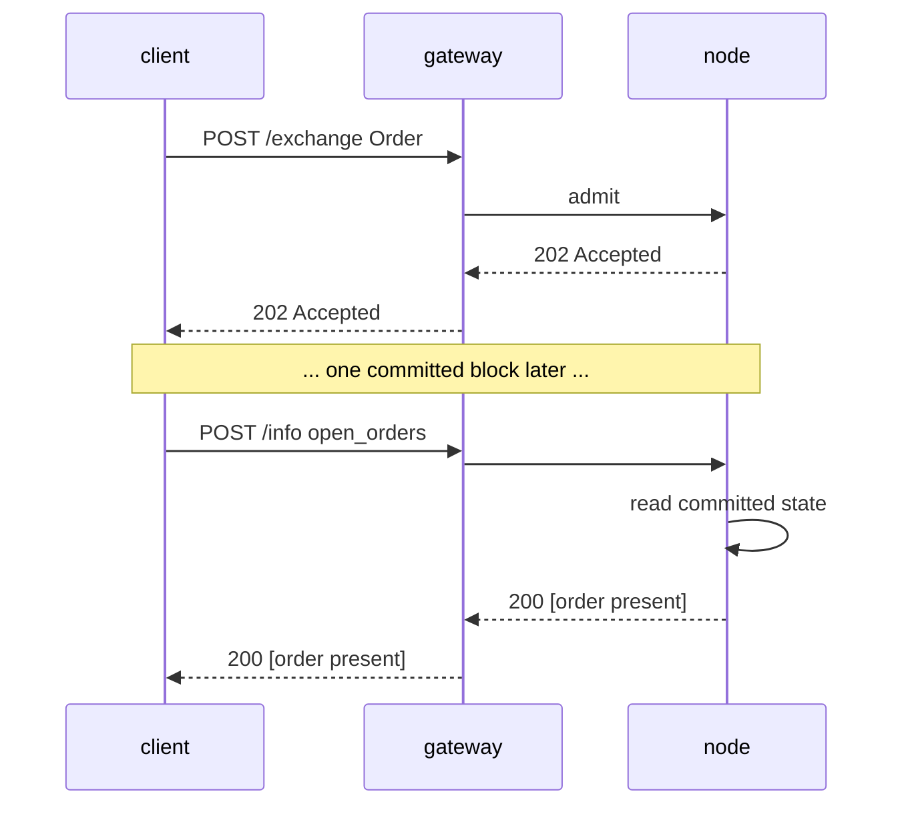

# `POST /info` — read & query endpoint

:::info
**Status.** **stable** shape. Query types are added over time; the envelope is committed.
:::


:::info
**One name for the account: `address`.** Every account-scoped query takes it.
Four queries shipped with `user` instead — `broker_state`, `referral_state`,
`spot_margin_state` and `user_interest`. Those still accept `user`, and their
replies carry the account under both names. Send `address` in new code.
:::

## TL;DR {#tldr}

Single endpoint, multi-type. Dispatches on the request body's `type` field. Read-only — never mutates state, never requires a signature.

:::tip
**Split by product.** Perp-market read queries are on [perpetual queries](./info/perpetuals.md); spot, spot-margin, and Earn read queries are on [spot & margin queries](./info/spot.md); closed-position lifecycle queries are on [position history](./info/position-history.md); governance queries are on [governance queries](./info/governance.md). This page covers the envelope, conventions, and account/vault/validator reads.
:::

## URL {#url}

```
POST  https://api.<net>.mtf.exchange/info
```

| Path | Wire shape |
|------|-----------|
| `POST /info` (gateway) | MTF-native (this document) |

The gateway serves the MTF-native `/info`. Running the node yourself, the same
native `/info` is served directly at `http://localhost:8080`.

## Envelope {#envelope}

Every `/info` response is one envelope. A success carries `data`. A failure
carries `error`. The two keys never appear together.

**Request**

```json
{ "type": "<query_type>", /* type-specific args */ }
```

**Success** — `200 OK`. The `type` discriminator is echoed INSIDE `data`:

```json
{
  "data": {
    "type": "<query_type>",
    /* type-specific payload */
  }
}
```

The payload fields keep their old path. A field you read at `body.data.fills`
before is still at `body.data.fills`. Only `type` moved: it was a sibling of
`data`, and it is now the first key of `data`.

**Every read carries `type` inside `data`, the history-archive reads included.**
The archive lane differs from the envelope above in one place only: the shape of
a rejection. See [the archive lane](#archive-lane) below.

A success has **no** `error` key. Do not test `error === null` — test whether
the key is present.

**A `data` of `null` is a SUCCESS.** A read can succeed with no content. That
answers `{"data": null}` with status `200`. Treat it as an empty result, not as
a failure.

**Failure** — no `data` key, and the HTTP status that the code maps to:

```json
{
  "error": {
    "code":    "UNKNOWN_TYPE",
    "message": "unknown info type: markest"
  }
}
```

| Field | Presence | Meaning |
|-------|----------|---------|
| `code` | always | The stable contract. **Match on this.** |
| `message` | always | Prose for a human. It can change in any release. **Never match on it.** |
| `details` | optional | The bound the request broke: `{"field","limit","actual"}`. It is **omitted** when the rejection carries no bound — never sent as `{}` |

The HTTP status keeps its normal meaning. One code always answers with one
status. Every code, its status, and the caller action for it are in the
[error reference](../errors.md).

Two common `/info` failures: an unknown `type` answers `400` with
`UNKNOWN_TYPE`; an unknown named resource, such as a vault id, answers `404`
with `NOT_FOUND`.

#### The history-archive reads reject with a bare string {#archive-lane}

A group of reads is served by the history archive rather than by the node. A
success answers in the envelope above. A rejection does not.

The lane is `portfolio`, `historical_orders`, `user_funding`,
`user_funding_by_time`, `user_position_history`,
`user_position_history_by_time`, `user_non_funding_ledger_updates`,
[`recent_blocks`](./info/chain.md#recent_blocks),
[`recent_transactions`](./info/chain.md#recent_transactions), `validator_votes` and
[`user_volume_history`](./info/account-history.md#user_volume_history).

`portfolio` takes an `interval` alongside `address`, and it accepts exactly one
value: **`1d`**. Any other value is rejected `400 invalid interval: <value>`,
and the rejection now names `1d`.

**A rejection puts a bare STRING in `error`,** not the `{code, message}`
object. This applies to the reads in the lane that take an `address`. Two
strings occur, both with status `400`:

| String | Cause |
|--------|-------|
| `missing field: address` | The request carries no `address` |
| `invalid user address: <value>` | `address` is present but does not parse |

**A handler that branches on `error.code` reads `undefined` on this lane.**
Test the type of `error` before you read `code`.

**The collection key, per read.** The rows sit under a key named for what they
are, not under a generic `data[]`. Every key is snake_case, like the rest of
this wire:

| Read | Collection key |
|---|---|
| `historical_orders` | `orders` |
| `user_funding`, `user_funding_by_time` | `fundings` |
| `user_position_history`, `..._by_time` | `positions` |
| `user_non_funding_ledger_updates` | `ledger_updates` |
| `recent_transactions` | `txns` |
| `portfolio` | `points` |
| `user_volume_history` | `days` |

> ⚠️ **`ledger_updates` was `ledgerUpdates`.** It was the one camelCase key on
> this wire. A client reading `data.ledgerUpdates` now gets `undefined` — read
> `data.ledger_updates`.

> ⚠️ **`user_ledger` and `user_ledger_by_time` are REMOVED.** Both were narrower
> views of the same source that `user_non_funding_ledger_updates` already
> serves, and its name states what it holds where theirs did not.

**What `user_non_funding_ledger_updates` means.** Every NON-TRADING movement of
an account's money, and nothing else. Funding is excluded because it has its own
read, [`user_funding`](./info/account-history.md#user_funding); a fill's realized PnL is excluded because
it is trading, and it already has [`user_fills`](./info/orders-fills.md#user_fills).

**Every row carries a `kind` and a signed `delta`.** `delta` is signed from the
side the holder could spend a moment earlier: money that leaves that side is
negative, money that arrives is positive. `coin` names the token. These are the
kinds:

| `kind` | What produced it | Extra fields |
|---|---|---|
| `deposit` | A MetaBridge inbound credit, a system spot credit, or an EVM→Core credit | `chain` on a bridge credit |
| `withdraw` | A withdrawal to an EVM chain | |
| `transfer` | An account, sub-account or spot transfer, and a VAULT deposit or withdrawal | `counterparty` when the move has one |
| `liquidation` | A forced-close settlement | `market`, `mark_px` |
| `staking_deposit` | MTF moves from spot into the staking free pool | |
| `staking_withdraw` | MTF returns from the free pool to spot | |
| `delegate` | MTF moves from the free pool to a validator | |
| `undelegate` | MTF leaves a validator for the unbonding window | |
| `staking_reward` | A CLAIMED staking reward, credited to the free pool | |
| `earn_deposit` / `earn_withdraw` | An Earn deposit or withdrawal | |

A vault movement is a `transfer`, not a kind of its own. It carries no
`counterparty`, because the other side is the vault.

`market` on a `liquidation` row is the perp market ID as a NUMBER, not a
symbol. It is the one market reference on this read that is not resolved for
you. Map it with [`markets_meta`](./info/perpetuals.md#markets_meta).

`delegate` and `undelegate` do not change what the account holds in total. They
move MTF between what it can withdraw and what it cannot, and that is a
movement this read must show.

> ⚠️ Handle the full table. A `kind` your client does not know must never throw.

Membership of this lane is a deployment fact, not a wire guarantee. Do not
hard-code the list; write one handler that accepts both rejection shapes.

#### A malformed request body answers with no `error` key at all {#malformed-request}

The two shapes above both reject a request the server could read. A request the
server cannot even parse is refused earlier, and that answer carries **no
`error` key**. Two forms occur, on every read alike:

| Body | Status | Cause |
|------|--------|-------|
| A bare JSON **string**, such as `"Failed to deserialize the JSON body into the target type: ..."` | `422` | Valid JSON, but a field holds the wrong type — for example `limit` as a string |
| **Plain text**, such as `Failed to parse the request body as JSON: ...` | `400` | The body is not valid JSON |

Both messages are prose for a human and can change in any release. Never match
on them. Parse the body only after you check the status, and treat any `4xx`
whose body has no `error` object as a bug in your own request.

Not every wrong type is refused. A field the read treats as optional, such as
`detail` on [`account_state`](./info/account.md#account_state), falls back to its default rather
than failing. Only a field with a declared numeric or typed binding rejects.

#### Empty is not the same as absent {#empty-vs-absent}

A read that answers nothing and a request that asks the wrong question look
alike inside a client. The first is a fact about the account. The second is a
bug in your code. Three cases produce a plausible-looking zero — rule each one
out before you report a holding as missing.

**1. You sent a retired type name.** A name this API no longer serves NEVER
answers with an empty body. It answers `UNKNOWN_TYPE`, in one of two forms:

| What you sent | Status | Body |
|---|---|---|
| `spot_clearinghouse_state`, `oracle_sources`, `sub_accounts`, and every other name in [removed reads](#retired-reads) that is not in the row below | `400` | `{"error":{"code":"UNKNOWN_TYPE","message":"unknown info type: <name>"}}` — no `details` |
| `account_overview`, `action_outcome`, `bridge_chain_configs`, `bridge_user_outbox`, `encode_action`, `evm_contract_bindings`, `gov_history`, `gov_proposals`, `gov_state`, `pm_summary` | `410` | the same `code`, plus `details.use` naming the read to call instead |

So a `200` carrying an empty array IS an answer about a real account. A client
that shows "no balances" after calling `spot_clearinghouse_state` swallowed a
`4xx`. **Check the status before you read the body.**

**2. You read a key that is not there.** An absent key reads as `undefined`, and
`undefined` renders as empty almost everywhere. The spot ledger is the one that
catches people. It lives at **`data.spot.balances`**. There is no `balances` and
no `spot_balances` at the top level of an
[`account_state`](./info/account.md#account_state) body; both paths read as "this account holds
nothing", and both are wrong. Every field that moved is listed in
[where every field went](./info/account.md#account-state-lane-split).

**3. The read's source is not deployed on the endpoint you called.** The
[archive-lane](#archive-lane) reads answer with a typed empty body —
`{"orders":[]}`, `{"fundings":[]}` — when no history archive is configured
behind that endpoint. On the wire that is identical to an account with no
history. The public endpoints run the archive, so this is a self-hosted concern.

**The one-line control.** Send the same request with a `type` you KNOW is wrong,
such as `"type":"nope"`. If your client reports the same empty result it
reported before, it is hiding the error, not reading an empty account.

## Query types {#query-types}

Every `type` the read endpoint accepts, grouped by what it answers. Click a
type for its request fields and response schema.

| Group | `type` |
|---|---|
| **[Account state](./info/account.md)**<br/>collateral, margin health, positions, reservations | [`account_state`](./info/account.md#account_state) · [`clearinghouse_state`](./info/account.md#clearinghouse_state) |
| **[Orders & fills](./info/orders-fills.md)**<br/>resting orders, fill history, one order's lifecycle | [`open_orders`](./info/orders-fills.md#open_orders) · [`user_fills`](./info/orders-fills.md#user_fills) · [`order_status`](./info/orders-fills.md#order_status) |
| **[Account history](./info/account-history.md)**<br/>ledger updates, funding payments, TWAP history | [`user_funding`](./info/account-history.md#user_funding) · [`user_volume_history`](./info/account-history.md#user_volume_history) · [`user_interest`](./info/account-history.md#user_interest) · [`user_ledger_updates`](./info/account-history.md#user_ledger_updates) · [`historical_orders`](./info/account-history.md#historical_orders) · [`action_outcome`](./info/account-history.md#action_outcome) · [`user_twap_slice_fills`](./info/account-history.md#user_twap_slice_fills) · [`delegator_rewards`](./info/account-history.md#delegator_rewards) |
| **[Perpetual markets](./info/perpetuals.md)**<br/>market metadata, books, trades, candles, funding | [`markets`](./info/perpetuals.md#markets) · [`markets_meta`](./info/perpetuals.md#markets_meta) · [`l2_book`](./info/perpetuals.md#l2_book) · [`trades`](./info/perpetuals.md#trades) · [`candle_snapshot`](./info/perpetuals.md#candle_snapshot) · [`funding_history`](./info/perpetuals.md#funding_history) · [`mip3_active_bids`](./info/perpetuals.md#mip3_active_bids) · [`liquidatable`](./info/perpetuals.md#liquidatable) · [`active_asset_data`](./info/perpetuals.md#active_asset_data) · [`perp_dexs`](./info/perpetuals.md#perp_dexs) |
| **[Spot, margin & Earn](./info/spot.md)**<br/>spot markets and balances, the margin lane, the lending pool | [`spot_meta`](./info/spot.md#spot_meta) · [`spot_margin_state`](./info/spot.md#spot_margin_state) · [`earn_state`](./info/spot.md#earn_state) · [`user_interest`](./info/spot.md#user_interest) · [`spot_deploy_auction`](./info/spot.md#spot_deploy_auction) |
| **[Position history](./info/position-history.md)**<br/>closed position lifecycles | [`user_position_history`](./info/position-history.md#user_position_history) · [`user_position_history_by_time`](./info/position-history.md#user_position_history_by_time) · [`identities`](./info/position-history.md#identities) |
| **[Options](./info/options.md)**<br/>the series registry and an account's open legs | [`option_series`](./info/options.md#option_series) · [`option_state`](./info/options.md#option_state) |
| **[Vaults & staking](./info/vaults-staking.md)**<br/>vault TVL and share price, delegation state | [`vault_state`](./info/vaults-staking.md#vault_state) · [`staking_state`](./info/vaults-staking.md#staking_state) |
| **[Fees & credit](./info/fees-credit.md)**<br/>the fee card, referral and broker credit | [`fee_schedule`](./info/fees-credit.md#fee_schedule) · [`referral_state`](./info/fees-credit.md#referral_state) · [`broker_state`](./info/fees-credit.md#broker_state) |
| **[Governance](./info/governance.md)**<br/>proposals, votes and the parameter set | [`validator_votes`](./info/governance.md#validator_votes) · [`gov_state`](./info/governance.md#gov_state) · [`gov_proposals`](./info/governance.md#gov_proposals) · [`gov_history`](./info/governance.md#gov_history) |
| **[Chain activity](./info/chain.md)**<br/>recent blocks, and one action's outcome | [`recent_blocks`](./info/chain.md#recent_blocks) · [`recent_transactions`](./info/chain.md#recent_transactions) |
| **[Node snapshots](./info/node.md)**<br/>peers, sync state and node-scoped figures | [`exchange_status`](./info/node.md#exchange_status) · [`user_twaps`](./info/node.md#user_twaps) · [`vault_summaries`](./info/node.md#vault_summaries) · [`user_rate_limit`](./info/node.md#user_rate_limit) · [`approved_brokers`](./info/node.md#approved_brokers) · [`validator_l1_votes`](./info/node.md#validator_l1_votes) · [`validator_summaries`](./info/node.md#validator_summaries) · [`gossip_root_ips`](./info/node.md#gossip_root_ips) |

## Removed reads {#retired-reads}

Each name here answers `UNKNOWN_TYPE`. The read surface is cut so that **each
question has exactly one read**: two reads for one question force a choice, and
a wrong choice is silent. For the release a removal landed in, see
[migration](../../changelog/migrations.md).

The status splits the two kinds of removal:

- **`400`** — the name never named a read on this API, or its answer is gone.
- **`410`** — the name was public and its answer MOVED. Ten names get this:
  `account_overview`, `action_outcome`, `bridge_chain_configs`,
  `bridge_user_outbox`, `encode_action`, `evm_contract_bindings`,
  `gov_history`, `gov_proposals`, `gov_state` and `pm_summary`. The error
  carries `details.use`, naming the read to call instead, so a client can
  follow the move without reading this table.

**`details.use` does not always name another `/info` type.** `action_outcome`
and `encode_action` both answer `"use": "/exchange"`, which is an ENDPOINT.
Read the value as prose for a human, not as a type you can post back.

| Removed | Call this instead |
|---|---|
| `abstraction_state` | Nothing. Its `kind` / `value` pair was per-kind free-form, so a value had no wire-defined meaning |
| `account_overview`, `web_data` | [`account_state`](./info/account.md#account_state) with `detail: "overview"` — the same body |
| `action_outcome` | [`POST /exchange`](./exchange.md) — the submit call already waits for the commit and returns the verdict. See [the section above](./info/account-history.md#action_outcome) |
| `agents` | [`account_state`](./info/account.md#account_state) with `detail: "overview"` — `agents` |
| `block_info` | [`account_state`](./info/account.md#account_state) for the committed `height` / `time` stamp; the archive-backed `recent_blocks` read for the block head. (The `explorer_block` WS channel that used to answer this is [removed](../../changelog/ids-and-wire-shapes.md#explorer-channels-removed) — a validator must not serve a per-block firehose) |
| `bridge_chain_configs` | Nothing. No public read carries the deployment row. A node publishes it on its [`node_bridge_outbox`](../../nodes/data-streams.md#node_bridge_outbox-configs) stream, and the custody address per chain is in the [Deployments](../../bridge/index.md#deployments) table |
| `bridge_finalized_cosignatures`, `bridge_outbound_queue` | [`bridge_withdrawal_history`](./info/bridge.md#bridge_withdrawal_history) for one account's own withdrawals. The whole-chain queue and the raw validator cosignature bytes are not part of this API |
| `delegator_history` | Nothing. No delegation event log is committed |
| `delegator_summary` | [`account_state`](./info/account.md#account_state) with `detail: "overview"` — `staking.summary` |
| `dynamic_risk` | [`markets_meta`](./info/perpetuals.md#markets_meta) — `risk_override` |
| `encode_action` | Nothing. The multisig inner blob takes the ordinary `{type, params}` wire action — see [signing the inner action](../../concepts/multi-sig.md#signing-the-inner-action) |
| `evm_contract_bindings` | [`markets_meta`](./info/perpetuals.md#markets_meta) with `kind: "spot"` — `evm_contract` |
| `gov_state`, `gov_proposals`, `gov_history` | [`validator_votes`](./info/governance.md#validator_votes) — `status: "voting"` for open votes, `status: "enacted"` for history. A parameter VALUE is on the read that owns it: [`markets_meta`](./info/perpetuals.md#markets_meta), [`fee_schedule`](./info/fees-credit.md#fee_schedule), [`exchange_status`](./info/node.md#exchange_status) |
| `leading_vaults` | [`vault_summaries`](./info/node.md#vault_summaries) — filter the rows on `leader` |
| `margin_summary` | [`account_state`](./info/account.md#account_state) with `detail: "margin"` |
| `market_info` | [`markets`](./info/perpetuals.md#markets) with `coin`, plus [`markets_meta`](./info/perpetuals.md#markets_meta) with `coin` |
| `max_builder_fee` | [`approved_brokers`](./info/node.md#approved_brokers) — look the builder up in the list |
| `max_market_order_ntls`, `perps_at_open_interest_cap` | [`markets_meta`](./info/perpetuals.md#markets_meta) — `max_market_order_ntl` is the served headroom, one row per market. `null` = uncapped, `"0"` = at the cap. Do not rebuild it from `open_interest` and `oi_cap`: an uncapped row OMITS `oi_cap`, so that arithmetic reads uncapped as zero headroom |
| `node_info` | Nothing on this API. Per-node identity is not consensus state, so two honest nodes answer differently. The chain id is fixed per network — see [networks](../../networks.md#summary) |
| `oracle_sources` | Nothing. The per-market bitmask it served is not read by the price aggregator. The static source facts are prose — see [oracle prices](../../concepts/oracle-prices.md#source-table) |
| `perp_dex_limits` | [`perp_dexs`](./info/perpetuals.md#perp_dexs) — `limits` |
| `pm_summary` | [`account_state`](./info/account.md#account_state) — `perp.pm_maint_margin`, `perp.pm_concentration_penalty` and the top-level `pm_net_value`, with `abstraction: "portfolio"` as the enrolment flag |
| `predicted_fundings` | [`markets`](./info/perpetuals.md#markets) — each row's `funding` block carries the charged rate and the next boundary |
| `protocol_metrics` | [`markets`](./info/perpetuals.md#markets), [`markets_meta`](./info/perpetuals.md#markets_meta) and [`staking_state`](./info/vaults-staking.md#staking_state) carry every public fact it held. The rest was node diagnostics |
| `recent_trades`, `trades_by_time` | [`trades`](./info/perpetuals.md#trades) — un-ranged for the recent window, ranged for a time window |
| `spot_clearinghouse_state` | [`account_state`](./info/account.md#account_state) — `spot.balances` is the whole token ledger |
| `spot_deploy_state` | [`spot_deploy_auction`](./info/spot.md#spot_deploy_auction) — the same read, renamed |
| `staking_apr` | [`staking_state`](./info/vaults-staking.md#staking_state) — `pending_validator_pool_usdc` and `total_stake`. It never served an APR |
| `sub_accounts` | [`account_state`](./info/account.md#account_state) with `detail: "overview"` — `sub_accounts` |
| `token_info` | [`markets_meta`](./info/perpetuals.md#markets_meta) with `kind: "spot"` |
| `user_fees` | [`fee_schedule`](./info/fees-credit.md#fee_schedule) with `address` — it resolves the effective maker / taker bps |
| `user_fills_by_time` | [`user_fills`](./info/orders-fills.md#user_fills) with `start_time` / `end_time` |
| `user_role` | [`account_state`](./info/account.md#account_state) with `detail: "overview"` — `role` |
| `user_to_multi_sig_signers` | [`account_state`](./info/account.md#account_state) with `detail: "overview"` — `multisig` |
| `user_vault_equities` | [`account_state`](./info/account.md#account_state) with `detail: "overview"` — `vault.equities` |
| `web_data2` | [`account_state`](./info/account.md#account_state) for margin and balances, [`clearinghouse_state`](./info/account.md#clearinghouse_state) for positions, `detail: "overview"` for vault equities; [`open_orders`](./info/orders-fills.md#open_orders) for resting orders; [`exchange_status`](./info/node.md#exchange_status) for status. The WS channel is removed too, and answers `{"channel":"error","data":{"error":"unknown channel: web_data2"}}` |

## Reads gated by their capability {#operator-reads}

These two reads exist on the wire already. Each answers with the same error an
unknown type gets, not because it is restricted to an operator, but because the
capability it reads is not reachable yet. Each ships publicly the day that
capability does.

| Read | Ships when |
|---|---|
| `mip3_deployer_oracle` | The `mip3_deployer_oracle` protocol feature is armed on the target chain |
| `fba_batch_state` | The FBA engine becomes reachable from `/exchange` |


## Errors {#errors}

Read the full list, with the caller action for each code, in the
[error reference](../errors.md). These are the codes `/info` produces:

| HTTP | `error.code` | Cause |
|------|--------------|-------|
| 200 | — | Success. An **unknown address** on `account_state` and its siblings is a **200** with a zeroed record, NOT a 404 |
| 400 | `INVALID_REQUEST` | No `type` discriminator, a required type-specific argument omitted, or a malformed address |
| 400 | `UNKNOWN_TYPE` | The `type` names no read. It is misspelled, or the read is removed |
| 410 | `UNKNOWN_TYPE` | The `type` names a read whose answer MOVED. `details.use` names the read to call instead — see [removed reads](#retired-reads) |
| 404 | `MARKET_NOT_FOUND` | The `coin` symbol is unknown (`markets`, `l2_book` and other market reads) |
| 404 | `NOT_FOUND` | A named resource is unknown, such as a vault address on `vault_state` |
| 429 | `RATE_LIMITED` | No retry hint is sent — see [rate limits](../rate-limits.md) |
| 500 | `INTERNAL` | Our defect, not your request. Retry, then report it |

A `405` carries no envelope: the endpoint is POST-only, and the router refuses
another method before the envelope exists.

:::warning
There is **no `account not found`** error: account-keyed readers (`account_state`,
`open_orders`, `user_rate_limit`, `staking_state`, …) return a **200** zeroed
record for an address that has never appeared on-chain — they never 404.
:::

## Read-after-write consistency {#read-after-write-consistency}

`/info` reads from the most recent committed block. A `POST /exchange` admitted at time `T` is not visible in `/info` until the leader commits the block containing it — one committed block later. Block cadence is a governed, per-deployment target, not a fixed duration; measure your own deployment's committed-round rate if you need a wall-clock estimate.

For read-your-writes semantics, subscribe to [`order_updates`](../ws/subscriptions.md#order_updates) (order lifecycle) and [`fills`](../ws/subscriptions.md#fills) (executions); committed events arrive in commit order, removing the need to poll.

## Sequence — query an account, see your own order {#sequence--query-an-account-see-your-own-order}


```mermaid
sequenceDiagram
    participant client
    participant gateway
    participant node
    client->>gateway: POST /exchange Order
    gateway->>node: admit
    node-->>gateway: 202 Accepted
    gateway-->>client: 202 Accepted
    Note over client,node: ... one committed block later ...
    client->>gateway: POST /info open_orders
    gateway->>node: 
    node->>node: read committed state
    node-->>gateway: 200 [order present]
    gateway-->>client: 200 [order present]
```

## See also {#see-also}

- [`POST /exchange`](./exchange.md) — write path
- [`POST /faucet`](./faucet.md) — testnet test-fund grant (USDC + MTF)
- [WS subscriptions](../ws/subscriptions.md) — push equivalents

## FAQ {#faq}

<details>
<summary>Show FAQ</summary>

**Q: How do I address a market — by id or by name?**
A: By `coin` symbol (`"BTC"`). The legacy numeric `asset_id` / `market_id` request
arguments were removed; only `coin` is accepted, and responses render coin symbols
everywhere. (The signed `/exchange` write path still uses the numeric `asset` —
that field is consensus-frozen and unrelated to these read args.)

**Q: Do `user_fills` / `trades` need an external indexer?**
A: No. Both read a committed on-node tape (a bounded per-account fill ring and per-market trade ring folded into the AppHash), so any node serves real records directly — no external indexer required. The rings are bounded, so they hold a recent window; for an unbroken live feed subscribe to the [WS channels](../ws/subscriptions.md). History PAST the ring is a different question: the archive holds it, and a RANGED ask (one that carries `start_time`) reaches it. An un-ranged ask always answers from the ring — see [Deep history, past the ring](./info/perpetuals.md#trades-archive).

**Q: Is the response deterministic across nodes?**
A: Yes. Any honest node returns identical responses for the same query at the same committed height. Nodes with different commit heights may differ, so compare the `height` / `time` stamp [`account_state`](./info/account.md#account_state) carries before you call two answers inconsistent. `gossip_root_ips` is the one field that is NOT consensus state: it reads each node's own config, so nodes that carry the same roster answer identically, and nodes that do not may differ.

</details>
