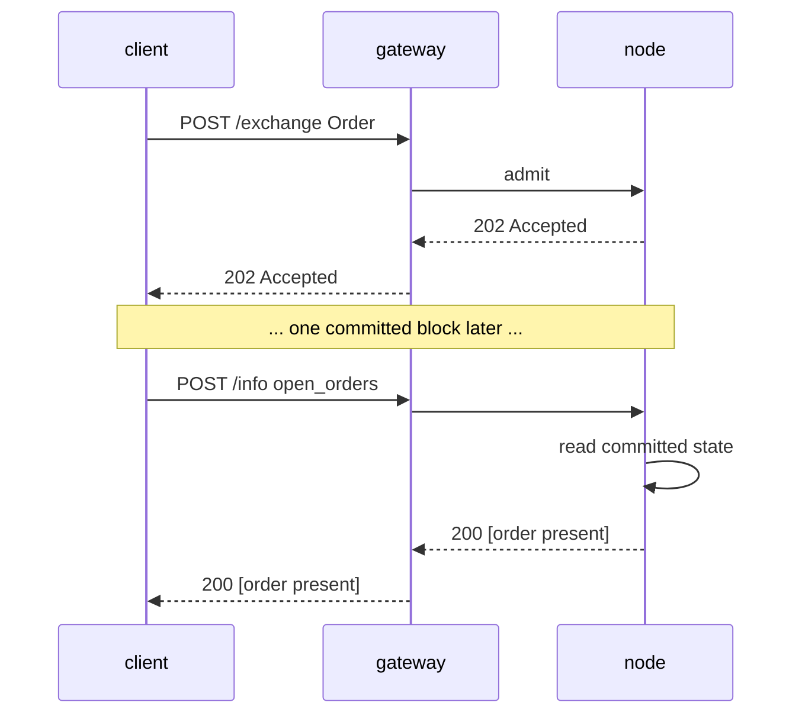

# `POST /info` — read & query endpoint

:::info
**Status.** **stable** shape. Query types are added over time; the envelope is committed.
:::

## TL;DR {#tldr}

Single endpoint, multi-type. Dispatches on the request body's `type` field. Read-only — never mutates state, never requires a signature.

:::tip
**Split by product.** Perp-market read queries are on [perpetual queries](./info/perpetuals.md); spot, spot-margin, and Earn read queries are on [spot & margin queries](./info/spot.md); closed-position lifecycle queries are on [position history](./info/position-history.md); governance queries are on [governance queries](./info/governance.md). This page covers the envelope, conventions, and account/vault/validator reads.
:::

## URL {#url}

```
POST  https://api.<net>.mtf.exchange/info
```

| Path | Wire shape |
|------|-----------|
| `POST /info` (gateway) | MTF-native (this document) |

The gateway serves the MTF-native `/info`. Running the node yourself, the same
native `/info` is served directly at `http://localhost:8080`.

## Envelope {#envelope}

Request:

```json
{ "type": "<query_type>", /* type-specific args */ }
```

Response:

```json
{ "type": "<query_type>", "data": { /* type-specific */ } }
```

On unknown `type`: `400 Bad Request` with `{"error":"unknown info type: <X>"}`.
On unknown resource (e.g. unknown vault id): `404 Not Found` with `{"error":"<resource> not found"}`.

## Query types {#query-types}

### Static node identity and protocol version {#node_info}

:::warning
**Operator lane only — this query is REFUSED on the public API.** It answers
with the same error an unknown type gets. It stays available to node operators
reading a node directly.
:::

Static node identity + protocol version. No parameters.

```json
{ "type": "node_info" }
```

Response:

```json
{
  "type": "node_info",
  "data": {
    "network":           "testnet",
    "chain_id":          114514,
    "protocol_version":  "1.0.0",
    "validator_index":   null,
    "build_commit":      "unknown",
    "version":           "0.0.1",
    "freeze_halt_supported": true,
    "uptime_seconds":    0
  }
}
```

| Field | Type | Description |
|-------|------|-------------|
| `network` | `"devnet" \| "testnet" \| "mainnet"` | Network variant, derived from `chain_id` (`31337`=devnet, `114514`=testnet, `8964`=mainnet) |
| `chain_id` | uint64 | EIP-712 chain id — the SAME value the `/exchange` signing domain must use |
| `protocol_version` | semver string | Wire-protocol version |
| `validator_index` | uint32 \| null | This node's index in the active validator set; **FLAGGED:** `null` until the runtime calls `set_validator_index` |
| `build_commit` | hex string | Operator-published build identifier; **FLAGGED:** `"unknown"` until published |
| `version` | semver string | Node software release version, baked in at build time. A release shares one `version` across its binaries — `build_commit` is the per-build distinguisher |
| `freeze_halt_supported` | bool | Always `true` for this binary — capability flag: the node halts cleanly with exit code `77` once the freeze height commits so a node supervisor can swap in the next release |
| `uptime_seconds` | uint64 | Process uptime; **FLAGGED:** `0` until the runtime calls `set_uptime_seconds` |

These are **per-node** fields (node identity / runtime), NOT consensus state, so they legitimately differ across nodes.

### Per-account margin, positions, and balances {#account_state}

Per-account snapshot.

```json
{ "type": "account_state", "address": "0x<addr>" }
```

| Arg | Type | Required |
|-----|------|----------|
| `address` | hex address | yes |

An **unknown address** (never seen on-chain) returns **200** with a fully zeroed
record (`account_value:"0"`, empty `clearinghouse_state` / `balances`), NOT a
`404`.

Response (a faucet-funded account, no positions):

```json
{
  "type": "account_state",
  "data": {
    "address":         "0x00000000000000000000000000000000000ca11e",
    "account_value":   "3000",
    "withdrawable":    "3000",
    "init_margin":     "0",
    "health":          "3000",
    "tier":            "Safe",
    "abstraction":     "unified",
    "clearinghouse_state": { "": { "positions": [] } },
    "balances": [
      { "asset": 100, "name": "USDC", "total": "3000", "hold": "0", "avg_entry_px": null }
    ],
    "pm_maint_margin":          "0",
    "pm_net_value":             "0",
    "pm_concentration_penalty": "0",
    "position_mode":            "one_way",
    "height": 562,
    "time":   1700000000555
  }
}
```

`account_state` carries **no account-level `maint_margin`** — that scalar
lives on the lighter [`margin_summary`](#margin_summary) read only, so a
liquidation-health poll does not have to pull the full position/balance walk.
`abstraction` is `"unified"` (default cross-collateral account) or
`"portfolio"` (portfolio-margin enrolled) — derive PM enrollment as
`abstraction == "portfolio"`. `pm_maint_margin` / `pm_net_value` /
`pm_concentration_penalty` are always present (whole-USDC strings, `"0"` when
not PM-enrolled) — see [portfolio margin](../../concepts/portfolio-margin.md).
`position_mode` is `"one_way"` or `"hedge"` — see [hedge mode](../../concepts/hedge-mode.md).

Each `balances[*]` row is `{asset, name, total, hold, avg_entry_px}`: `total` is
the full balance and `hold` is the part locked behind a resting spot order
(escrow). Row 0 is always USDC (asset id `100`); a token that is entirely held
still appears.

:::warning
**`total − hold` is NOT the spendable amount.** `hold` counts spot order escrow
only. USDC that margins an open PERPETUAL position stays in `total` and never
enters `hold`, so `total − hold` overstates the budget for every position holder.
The chain admits a spot buy against **free collateral** (equity minus held
initial margin), and refuses an order that only `total − hold` allows.

Read `withdrawable` for the spendable USDC figure — it is the same free-collateral
number the admission gate uses, clamped at zero. See
[account value](../../concepts/account-value.md#balances-and-hold) for the rule
and a worked example.
:::

For a **light** read of just the margin scalars (no position walk, no balance
scan — the right call for a liquidation-health poll), use
[`margin_summary`](#margin_summary).

A positioned account adds entries under `clearinghouse_state["<dex>"].positions`
— the empty-string key `""` is the core dex; a MIP-3 deployer dex keys by the
deployer's lowercase `0x` address:

```json
{
  "coin":              "BTC",
  "size":              "1.00000",
  "entry":             "67000.00",
  "upnl":              "5.00",
  "isolated":          false,
  "lev":               10,
  "liq":               "61000.00",
  "roe":               "0.0075",
  "funding":           "-0.12",
  "margin":            "201.00",
  "maint_margin":      "670.00",
  "notional":          "6705.00"
}
```

| Field | Type | Description |
|-------|------|-------------|
| `account_value` | Decimal string | Equity incl. settled PnL, **whole-USDC plane** (`"3000"` = 3000 USDC, NOT base units) |
| `withdrawable` | Decimal string | Cash you can take out, **clamped at zero**. Settled cash minus funding you owe minus `init_margin`. It does NOT count unrealised profit, so a healthy account funded by open profit reads `"0"` — see [account value](../../concepts/account-value.md#withdrawable). The admission gate still uses the raw signed figure, which can be negative; the read never is |
| `init_margin` | Decimal string | Held initial-margin requirement |
| `health` | Decimal string | `account_value − maint_margin` (signed dollar figure; can be negative) — **not a ratio** |
| `tier` | enum | `"Safe"`, `"T0"`, `"T1"`, `"T2"`, `"T3"` (BOLE band of `account_value / maint_margin`; `"Safe"` when no maint margin) — see [tiered liquidation](../../concepts/tiered-liquidation.md) |
| `abstraction` | enum | `"unified"` or `"portfolio"` (PM-enrolled) |
| `clearinghouse_state` | object | Keyed by dex (`""` = core dex, else a MIP-3 deployer's `0x` address); each value is `{positions: [...]}` |
| `clearinghouse_state["<dex>"].positions[*].coin` | string | Market symbol (e.g. `"BTC"`), not a numeric id |
| `clearinghouse_state["<dex>"].positions[*].size` | Decimal string | Signed **real** size (`raw lots / 10^sz_decimals`); negative = short |
| `clearinghouse_state["<dex>"].positions[*].entry` | Decimal string | Per-whole-unit entry price = `\|entry_notional\| / \|real size\|`, **whole-USDC plane** |
| `clearinghouse_state["<dex>"].positions[*].upnl` | Decimal string | Mark-to-market PnL = `real size × mark − signed entry_notional`, **whole-USDC plane** (signed) |
| `clearinghouse_state["<dex>"].positions[*].isolated` | bool | `true` unless the position is cross-margined |
| `clearinghouse_state["<dex>"].positions[*].lev` | uint8 | Position's chosen leverage |
| `clearinghouse_state["<dex>"].positions[*].liq` | Decimal string \| null | Mark price (whole-USDC) at which this leg reaches maintenance. **Solved on the leg's own margin plane**: a cross leg against the cross account, an isolated leg against its posted `isolated_margin` alone. `null` when no non-negative price breaches maintenance, and when size is zero — see below |
| `clearinghouse_state["<dex>"].positions[*].roe` | Decimal string | `upnl / initial_margin` as a decimal fraction; `"0"` at zero leverage / notional |
| `clearinghouse_state["<dex>"].positions[*].funding` | Decimal string | Accrued-but-unsettled funding for **this leg**, **whole-USDC** (signed; negative = you owe). Includes the accrual built up since the last funding charge, so it stays non-zero between funding periods — the same accrual `account_value` and `withdrawable` already fold in |
| `clearinghouse_state["<dex>"].positions[*].margin` | Decimal string | This leg's INITIAL margin, **whole-USDC** |
| `clearinghouse_state["<dex>"].positions[*].maint_margin` | Decimal string | This leg's maintenance-margin contribution, **whole-USDC**: `\|entry_notional\| × maint_margin_ratio` |
| `clearinghouse_state["<dex>"].positions[*].notional` | Decimal string | Position notional at mark, **whole-USDC** (signed): `real_size × mark_px` |
| `clearinghouse_state["<dex>"].positions[*].side` | enum \| absent | **[Hedge mode](../../concepts/hedge-mode.md) only** — `"long"` / `"short"`, the leg this object reports. **Omitted on a one-way account** (a single *net* position whose `size` may be negative). A hedge account holding both legs on one asset returns **two** objects, one per side. |
| `balances[*].asset` | uint32 | Asset id (`100` for USDC) |
| `balances[*].name` | string | Token symbol (`"USDC"` for row 0) |
| `balances[*].total` | Decimal string | Full balance. **Not** the spendable amount — perp margin sits inside it. Use `withdrawable` |
| `balances[*].hold` | Decimal string | Amount locked behind a resting spot order (escrow). Spot escrow only; it never holds perp margin |
| `balances[*].avg_entry_px` | Decimal string \| null | Average cost basis for the token; `null` when there is none (always `null` on the USDC row — USDC is the quote asset) |
| `pm_maint_margin` | Decimal string | PM engine's maintenance requirement, whole-USDC; `"0"` when not PM-enrolled |
| `pm_net_value` | Decimal string | PM engine's net scenario value, whole-USDC; `"0"` when not PM-enrolled |
| `pm_concentration_penalty` | Decimal string | PM single-asset concentration penalty, whole-USDC; `"0"` when not PM-enrolled |
| `position_mode` | enum | `"one_way"` (single net position per asset) or `"hedge"` (separate long/short legs) |
| `height` | uint64 | Committed block height this snapshot reflects. A **bare integer**, not a Decimal string. Advances on **every** commit, even when nothing else in the record changed |
| `time` | uint64 | Consensus block time in **milliseconds**. A **bare integer**. Advances on every commit, from the same consensus clock as `height` |

#### Reading `liq` {#reading-liq}

`liq` is solved on the plane that actually liquidates the leg. A **cross** leg
shares one margin pool with every other cross leg, so its `liq` moves when any
other cross position moves. An **isolated** leg is backed only by its own posted
`isolated_margin`; the cross balance never rescues it, and a large cross balance
never pushes its `liq` away.

`liq` is **`null`, never `"0"`**, when the leg has no liquidation price. Two
cases produce it: a zero-size leg, and a long whose solved price is negative —
that long cannot be price-liquidated, because no non-negative mark breaches its
maintenance requirement. Treat `null` as "no price triggers this leg", and treat
`"0"` — should you ever see it — as a real price of zero. A client that renders
`null` as `0` tells the user the position is at the brink when it is the
opposite.

`liq` answers "what price liquidates THIS leg". It is not a promise about the
account: a cross account can still be liquidated by a move on a different market.

`height` / `time` are an **as-of stamp**: they tell you which committed block the
snapshot was rendered against, and they advance on every commit regardless of
whether any monetary field moved. This lets a client tell a **fresh-but-quiet**
account (constant `account_value`, but `height`/`time` still climbing) apart from
a **stalled** read path (`height`/`time` frozen — the node or your connection has
stopped advancing). The same stamp appears on the WS
[`account_state`](../ws/subscriptions.md#account_state) channel with identical
values, so a client can cross-check or de-duplicate REST and WS against it.

### Lightweight margin-only account summary {#margin_summary}

The **margin scalars only** — `account_state` minus the `clearinghouse_state`
walk and the balance scan. The right call for a frequent liquidation-health
poll (a risk-watcher bot, an automated margin top-up) where the
position/balance detail is not needed. Required: `address` (0x hex).

```json
{ "type": "margin_summary", "address": "0x<addr>" }
```

Response (`data`): `address`, `account_value`, `withdrawable`,
`maint_margin`, `init_margin`, `health`, `tier`, `abstraction` — identical
field semantics to the same-named fields on [`account_state`](#account_state)
(computed by the shared helper, so the two never disagree). `maint_margin`
lives **only** here — `account_state` drops it.

### Per-vault TVL, share price, and strategy {#vault_state}

Per-vault snapshot.

```json
{ "type": "vault_state", "vault": "0x<vault_addr>" }
```

Response:

```json
{
  "type": "vault_state",
  "data": {
    "vault":              "0x<addr>",
    "name":               "MFlux Conservative",
    "tvl":             "10000000000",
    "share_price":     "10500000",
    "depositor_count":    142,
    "high_water_mark": "10500000",
    "performance_fee_bps":"1000",
    "lock_period_ms":     86400000,
    "strategy":           "User"
  }
}
```

`strategy` is the vault's `kind` — `"User"` or `"Metaliquidity"` — not a
free-text strategy label.

`tvl` and `share_price` are **mark-to-market NAV**: settled cash, plus unrealised
PnL on every open position at the latest oracle mark, plus unrealised funding.
The Metaliquidity backstop vault also subtracts its pending-loss reserve. This is
the same NAV that [`vault_withdraw`](exchange.md#vault_withdraw) burns shares
against, so the read and the payout agree.

`high_water_mark` is **not** NAV. It is a ratchet kept for performance-fee
accounting: profit raises it, a deposit bumps it, a withdrawal lowers it, and a
trading loss never does. A vault in drawdown therefore shows
`high_water_mark` above `share_price`, and the gap is exactly the profit the
leader must re-earn before the vault charges a performance fee again. Never price
a redemption off `high_water_mark`.

### Per-account staking and delegation state {#staking_state}

```json
{ "type": "staking_state", "address": "0x<addr>" }
```

Response:

```json
{
  "type": "staking_state",
  "data": {
    "address":                  "0x<addr>",
    "total_staked":             "1000000000",
    "undelegated_pool_balance": "250000000",
    "delegations": [
      {
        "validator":         "0x<val_addr>",
        "amount":         "500000000",
        "since_ts":          1735000000000,
        "pending_rewards":"1000000"
      }
    ],
    "pending_unstakes": [
      { "amount": "200000000", "matures_at_ts": 1735780000000 }
    ]
  }
}
```

| Field | Type | Description |
|-------|------|-------------|
| `address` | hex address | Resolved account address |
| `total_staked` | Decimal string | **Delegated** stake only (whole-MTF) — the sum of `delegations[*].amount` |
| `undelegated_pool_balance` | Decimal string | Stake deposited but **not delegated** (whole-MTF, the same plane as `total_staked`). See the upgrade notice below |
| `delegations[*].validator` | hex address | Validator the stake is delegated to |
| `delegations[*].amount` | Decimal string | Stake delegated to this validator (whole-MTF) |
| `delegations[*].since_ts` | uint64 | When the delegation began (consensus ms) |
| `delegations[*].pending_rewards` | Decimal string | Accrued, unclaimed rewards (whole-MTF) |
| `pending_unstakes[*].amount` | Decimal string | Stake in the unbonding window (whole-MTF) |
| `pending_unstakes[*].matures_at_ts` | uint64 | When that amount becomes withdrawable (consensus ms) |

> ⬆️ **Upgrade notice — not live yet.** `undelegated_pool_balance` is not served
> here. Treat a missing key as "this node predates the field", not as a zero
> balance. **The same figure IS live on another read**: take
> [`delegator_summary.undelegated`](#delegator_summary), which the node answers
> today.

**`total_staked` alone under-reports what an account holds.** It counts
**delegated** stake. `stakingDeposit` credits a free pool and `stakingWithdraw`
debits it, and stake can sit in that pool undelegated for as long as the holder
likes. A front end that shows only `total_staked` shows a user less than they
have. Add `undelegated_pool_balance` to get the account's full staked balance.

The free pool is also **not** the same thing as `pending_unstakes`. Undelegated
stake is already free. `pending_unstakes` is stake still inside its unbonding
window, which is not withdrawable until `matures_at_ts`.

### Volume-tiered maker and taker fees {#fee_schedule}

```json
{ "type": "fee_schedule" }
```

Response:

```json
{
  "type": "fee_schedule",
  "data": {
    "tiers": [
      { "volume_30d": "0",         "maker_bps": "2.0", "taker_bps": "5.0" },
      { "volume_30d": "100000000", "maker_bps": "1.5", "taker_bps": "4.5" },
      { "volume_30d": "1000000000","maker_bps": "1.0", "taker_bps": "4.0" }
    ],
    "builder_rebate_bps": "0.2",
    "burn_ratio":         "0.30",
    "referrer_share_bps": "1.0"
  }
}
```

Fee rates are decimal **basis points** as strings with one fractional digit (e.g. `"2.0"` = 2 bps = 0.02%, `"0.5"` = 0.5 bps = 0.005%), allowing fine-grained sub-basis-point precision. `burn_ratio` is a decimal fraction (`"0.30"` = 30% of fees burned). See [fees](../../concepts/fees.md).

### Account's resting orders across all books {#open_orders}

Account-scoped resting orders across every perp **and spot** book. A spot
entry labels `coin` with the pair name (e.g. `"BTC/USDC"`) and renders
`px` / `size` in the pair's own planes (pair tick, base-token size decimals).

```json
{ "type": "open_orders", "address": "0x<addr>" }
```

| Arg | Type | Required |
|-----|------|----------|
| `address` | hex address | yes |

The account is identified by `address` (0x hex). Missing `address` →
`400 {"error":"missing field address"}`.

Response:

```json
{
  "type": "open_orders",
  "data": {
    "address":    "0x<addr>",
    "orders": [
      {
        "oid":         12345,
        "coin":        "BTC",
        "side":        "B",
        "px":          "99000",
        "sz":          "0.007",
        "orig_sz":     null,
        "cloid":       "0x000000000000000000000000cafef00d",
        "tif":         "gtc",
        "reduce_only": false,
        "trigger":     null,
        "inserted_at": 1700000000000
      }
    ]
  }
}
```

Every row is the **same canonical shape** the WS
[`open_orders`](../ws/subscriptions.md#open_orders) snapshot renders, so REST and
WS never drift. An unknown field renders `null`.

| Field | Type | Description |
|-------|------|-------------|
| `address` | hex address | Resolved account address |
| `orders[*].oid` | uint64 | Server order id (the real resting id; cancellable per-`oid`) |
| `orders[*].coin` | string | Market symbol the order rests on (e.g. `"BTC"`, or a pair name like `"BTC/USDC"`) |
| `orders[*].side` | `"B"` / `"A"` | Order side — **`B` = bid, `A` = ask**. The `/exchange` order body uses `"bid"` / `"ask"` instead |
| `orders[*].px` | Decimal string | Resting price, whole units (tick-snapped) |
| `orders[*].sz` | Decimal string | Remaining size, whole units |
| `orders[*].orig_sz` | Decimal string \| null | Original size when known; `null` on a resting-order row |
| `orders[*].cloid` | hex string \| null | Client order id the order was placed with (`0x` + 32 hex chars); `null` when the order set none |
| `orders[*].tif` | string | Lowercase time-in-force (`"gtc"` / `"ioc"` / `"alo"`), or the literal `"trigger"` on a parked TP/SL row |
| `orders[*].reduce_only` | bool | Reduce-only flag |
| `orders[*].trigger` | object \| null | Trigger detail when the row is (or carries) a trigger; `null` otherwise |
| `orders[*].inserted_at` | uint64 | Placement / insertion timestamp (consensus ms) |

A parked TP/SL leg is an open order too: it renders with `tif: "trigger"` and a
populated `trigger` block.

### Recent fill history for an account {#user_fills}

Account-scoped fill history, served directly from committed on-node state (a
bounded per-account fill ring folded into the AppHash — no external indexer).

:::tip
**One row per EXECUTION.** This is the per-trade log. For one row per
**opened-then-closed position** — peak size, average entry, average close,
realized PnL and funding folded over a whole life — use
[position history](./info/position-history.md) instead.
:::

```json
{ "type": "user_fills", "address": "0x<addr>" }
```

| Arg | Type | Required | Description |
|-----|------|----------|-------------|
| `address` | hex address | yes | Account address |
| `limit` | uint32 | no | Cap the number of **most-recent** records returned; absent / `0` ⇒ the full ring |

The account is identified by `address` (0x hex). Missing `address` →
`400 {"error":"missing field address"}`.

Response:

```json
{
  "type": "user_fills",
  "data": {
    "address":    "0x<addr>",
    "fills": [
      {
        "coin":           "BTC",
        "side":           "B",
        "px":             "67042.50",
        "sz":             "0.125",
        "time":           1700000000555,
        "oid":            12345,
        "tid":            90123,
        "fee":            "4.19",
        "closed_pnl":     "0",
        "cause":          "twap",
        "twap_id":        41,
        "dir":            "Open Long",
        "start_position": "0",
        "block":          562,
        "hash":           "0x2315b79b9e82c2deb279a59448bf7841f3767d30d874e5b544d75bb9fd1e9b0c"
      }
    ]
  }
}
```

Records are ordered oldest-first (newest last). The ring is bounded, so this is
a recent window, not all history. An account with no fills returns
`"fills": []`.

| Field | Type | Description |
|-------|------|-------------|
| `address` | hex address | Resolved account address |
| `fills[*].coin` | string | Market symbol the fill executed on |
| `fills[*].side` | `"B"` / `"A"` | This leg's side token — `"B"` = buy/bid, `"A"` = sell/ask |
| `fills[*].px` | Decimal string | Execution price, **decimal USDC** (human-readable) |
| `fills[*].sz` | Decimal string | Filled size, **base units** (whole-unit) |
| `fills[*].time` | uint64 | Fill timestamp (consensus ms) |
| `fills[*].oid` | uint64 | This party's order id |
| `fills[*].tid` | uint64 | Deterministic trade id (shared by both legs of the print) |
| `fills[*].fee` | Decimal string | Fee this party paid, **decimal USDC** |
| `fills[*].closed_pnl` | Decimal string | Realized PnL on the closed portion, **decimal USDC** (signed) |
| `fills[*].dir` | string | Direction label, e.g. `"Open Long"`, `"Close Short"`, `"Open Short"`, `"Close Long"` |
| `fills[*].start_position` | Decimal string | Signed leg size BEFORE the fill, **base units** (whole-unit, signed) |
| `fills[*].block` | uint64 | Committed block height the fill settled in (on-chain locator) |
| `fills[*].cause` | string | **Present only when this leg did NOT execute by its own order crossing.** `"forced_close_partial"` / `"forced_close_full"` — the liquidation ladder; `"forced_close_isolated"` — an isolated leg breached its own bucket; `"forced_close_governance"` — a validator-quorum `force_close_position` settled against the book; `"trigger"` — a TP/SL fired; `"twap"` — a TWAP slice. **Absent on an ordinary fill and on EVERY maker leg** — a counterparty that was merely hit is not itself forced. **`forced_close_governance` is a forced close that is NOT a liquidation**: it charges no liquidation fee and does not bump the liquidation counters, so do not fold it into a liquidation total |
| `fills[*].liquidated_user` | hex address | **Present on a forced-close leg only, on BOTH sides of the print.** The account whose position was closed — so a taker can see whose liquidation it absorbed |
| `fills[*].mark_px` | Decimal string | Present with `liquidated_user`. The mark the LADDER priced from when it classified — **not** the fill price, and not a later mark |
| `fills[*].broker` | hex address | Present when a [broker code](../../concepts/broker-codes.md) routed the order. Taker leg only |
| `fills[*].broker_fee` | Decimal string | Present with `broker`. The carve charged on this fill, **decimal USDC**. `"0"` is legal — a zero-rate broker is still attributed |
| `fills[*].twap_id` | uint64 | Present on a TWAP slice (`cause` is `"twap"`). The parent order this slice belongs to. Taker leg only |
| `fills[*].hash` | hex string | Transaction hash of the originating signed order, `0x`-prefixed hex — lets the fill be traced on-chain. A taker leg carries its order's hash; a **maker leg carries the hash of the maker's own resting order** (its original `submit_order`), so both legs of a match are traceable to the action that placed them. **Empty string (`""`)** when there is no signed user order behind the leg — a system / begin-block / liquidation print — and, for maker legs, on fills recorded before the network upgrade |

**Archive-served fills carry no `cause`.** A window older than the node's fill
ring is answered from the archive, which stores the attribution fields
(`liquidated_user`, `mark_px`, `broker`, `broker_fee`, `twap_id`, `hash`) but
not the `cause` string. Classify a forced close by `liquidated_user` and a TWAP
slice by `twap_id` — both work on every row; a `cause` test silently misses
archive-era rows.

### Fill history filtered by time window {#user_fills_by_time}

Like [`user_fills`](#user_fills), but filtered to a time window over each
record's consensus `time`. Same fill-record shape.

```json
{ "type": "user_fills_by_time", "address": "0x<addr>", "start_time": 1700000000000, "end_time": 1700003600000 }
```

| Arg | Type | Required | Description |
|-----|------|----------|-------------|
| `address` | hex address | yes | Account address |
| `start_time` | uint64 | no | Window start (ms, inclusive); filters on the fill `time`. Absent ⇒ open lower bound |
| `end_time` | uint64 | no | Window end (ms, inclusive). Absent ⇒ open upper bound |

Response:

```json
{
  "type": "user_fills_by_time",
  "data": {
    "address":    "0x<addr>",
    "start_time": 1700000000000,
    "end_time":   1700003600000,
    "fills": [ /* same record shape as user_fills */ ]
  }
}
```

| Field | Type | Description |
|-------|------|-------------|
| `address` | hex address | Resolved account address |
| `start_time` | uint64 \| null | Echoed window start (`null` if omitted) |
| `end_time` | uint64 \| null | Echoed window end (`null` if omitted) |
| `fills` | array | In-window fill records (same per-fill shape as [`user_fills`](#user_fills)), oldest-first |

### Look up a single order's lifecycle {#order_status}

Single-order lifecycle lookup by `oid` (server order id) **or** `cloid` (client
order id). Reads the live books, the trigger registry, and the committed fill
ring — all on-node committed state.

```json
{ "type": "order_status", "oid": 12345 }
```

Or by client order id:

```json
{ "type": "order_status", "cloid": "0x000000000000000000000000cafef00d" }
```

| Arg | Type | Required | Description |
|-----|------|----------|-------------|
| `oid` | uint64 | one of `oid` / `cloid` | Server order id |
| `cloid` | hex string | one of `oid` / `cloid` | Client order id — `0x` + 32 hex chars |

Neither present → `400 {"error":"missing field oid or cloid"}`. A malformed
`cloid` → `400`. Resolution stops at the first hit, in this order: live resting
order → parked trigger → terminal fill → unknown.

The `data.status` discriminates the branch:

`"resting"` — a live order open in a perp or spot book:

```json
{
  "type": "order_status",
  "data": {
    "status": "resting",
    "order": {
      "oid":            12345,
      "market_id":      0,
      "side":           "bid",
      "px":             "67000",
      "size":           "700",
      "inserted_at_ms": 1700000000000,
      "cloid":          "0x000000000000000000000000cafef00d"
    }
  }
}
```

`"triggered"` — a parked TP/SL/stop entry awaiting its mark cross:

```json
{
  "type": "order_status",
  "data": {
    "status": "triggered",
    "trigger": {
      "oid":              12345,
      "market_id":        0,
      "side":             "ask",
      "trigger_px":       "66000",
      "trigger_above":    false,
      "is_market":        false,
      "limit_px":         "65000",
      "size":             "700",
      "registered_at": 1700000000000,
      "fired":            false
    }
  }
}
```

`"filled"` — the most recent matching fill in the per-account ring (the `fill`
object is the same shape as one [`user_fills`](#user_fills) record):

```json
{
  "type": "order_status",
  "data": {
    "status": "filled",
    "fill": { /* same shape as a user_fills fill record */ }
  }
}
```

`"unknown"` — never seen, or evicted from the bounded ring (a `cloid`-only query
that matched no resting/triggered order also resolves here, since the trigger
registry and fill ring are keyed by `oid`):

```json
{ "type": "order_status", "data": { "status": "unknown" } }
```

| Field | Type | Description |
|-------|------|-------------|
| `status` | `"resting" \| "triggered" \| "filled" \| "unknown"` | Resolved lifecycle state |
| `order` | object | Present on `"resting"` — `oid`, `market_id`, `side` (`"bid"`/`"ask"`), `px` / `size` (fixed-point decimal strings), `inserted_at_ms`, `cloid` (hex \| null) |
| `trigger` | object | Present on `"triggered"` — `oid`, `market_id`, `side`, `trigger_px` / `size` (fixed-point decimal strings), `trigger_above` (bool: fire when mark crosses above), `is_market` (bool: `true` = fires a market exit, `false` = rests a limit exit), `limit_px` (fixed-point decimal string \| `null`: the resting price for a limit trigger, `null` for a market trigger), `registered_at`, `fired` (bool) |
| `fill` | object | Present on `"filled"` — the matching fill record (see [`user_fills`](#user_fills)) |

### Latest committed block metadata {#block_info}

:::warning
**Operator lane only — this query is REFUSED on the public API.** It answers
with the same error an unknown type gets. It stays available to node operators
reading a node directly.
:::

Committed block metadata. No required args (`height` is accepted but ignored —
the read state keeps only the latest committed context).

Two of its fields were only ever restatements. `round` **equals** `height` —
each committed block advances exactly one round under the two-chain commit rule.
`epoch` is `height` divided by the fixed epoch length of `100000`. Derive both
from a height you already have.

```json
{ "type": "block_info" }
```

Response:

```json
{
  "type": "block_info",
  "data": {
    "height":       562,
    "round":        562,
    "epoch":        0,
    "timestamp": 1780475491562,
    "block_hash":   "0x2315b79b9e82c2deb279a59448bf7841f3767d30d874e5b544d75bb9fd1e9b0c"
  }
}
```

| Field | Type | Description |
|-------|------|-------------|
| `height` | uint64 | Latest committed block height |
| `round` | uint64 | Consensus round of that block |
| `epoch` | uint64 | Current epoch |
| `timestamp` | uint64 | Block timestamp (consensus ms) |
| `block_hash` | hex string (32 bytes) | Real committed block hash (now plumbed into the read state — no longer the all-zero placeholder) |

### Approved agent wallets for an account {#agents}

Approved agent / API wallets for an account.

```json
{ "type": "agents", "address": "0x<addr>" }
```

| Arg | Type | Required |
|-----|------|----------|
| `address` | hex address | yes |

Missing `address` → `400 {"error":"missing field address"}`.

Response:

```json
{
  "type": "agents",
  "data": {
    "address":    "0x<master>",
    "agents": [
      { "agent": "0x<agent_addr>", "name": "trading-bot", "expires_at_ms": 1700000500000 }
    ]
  }
}
```

| Field | Type | Description |
|-------|------|-------------|
| `address` | hex address | Resolved master address |
| `agents[*].agent` | hex address | Approved agent wallet address |
| `agents[*].name` | string \| null | Agent label set at approval time; `null` if unset |
| `agents[*].expires_at_ms` | uint64 \| null | Agent approval expiry (consensus ms); `null` for a never-expiring approval |

### List of an account's sub-accounts {#sub_accounts}

Sub-accounts of an account.

```json
{ "type": "sub_accounts", "address": "0x<addr>" }
```

| Arg | Type | Required |
|-----|------|----------|
| `address` | hex address | yes |

Missing `address` → `400 {"error":"missing field address"}`.

Response:

```json
{
  "type": "sub_accounts",
  "data": {
    "address":    "0x<parent>",
    "sub_accounts": [
      { "index": 0, "address": "0x<sub_addr>", "equity": "2500" }
    ]
  }
}
```

| Field | Type | Description |
|-------|------|-------------|
| `address` | hex address | Resolved parent address |
| `sub_accounts[*].index` | uint32 | Sub-account index under the parent |
| `sub_accounts[*].address` | hex address | Sub-account address |
| `sub_accounts[*].equity` | Decimal string | The sub-account's mark-to-market equity, whole-USDC — the same figure its own [`account_state.account_value`](#account_state) reports |

`equity` counts unrealised PnL on the sub-account's open positions. A sub-account
that is deep in loss therefore reads DOWN here, not at its settled cash, so a
parent scanning this list sees the one that is near liquidation.

### Protocol-wide counters and accumulators {#protocol_metrics}

Protocol-wide committed accumulators / counters. No parameters. Every field is
read straight off committed `Exchange` state (counters, fee pools, BOLE reserves,
staking) — nothing is computed off the match engine or oracle, so a replay
reproduces it exactly.

```json
{ "type": "protocol_metrics" }
```

Response:

```json
{
  "type": "protocol_metrics",
  "data": {
    "counters": {
      "total_orders":               1000,
      "total_fills":                750,
      "total_liquidations":         3,
      "total_deposits":             40,
      "total_withdrawals":          12,
      "total_vault_transfers":      0,
      "total_sub_account_transfers":0
    },
    "fee_pools": {
      "buyback_pool":   "8000",
      "validator_pool": "1000",
      "treasury":       "1000",
      "burned_mtf":     "55"
    },
    "buyback_status": {
      "mtf_asset_id":   null,
      "pool":           "12500",
      "held_at_hub":    "0",
      "trigger_usdc":   "10000",
      "interval_ms":    60000,
      "slice_usdc":     "250",
      "drip_active":    false,
      "blocking_guard": "mtf_asset_unbound"
    },
    "insurance_fund_total":    "750",
    "treasury_backstop_total": "9000",
    "bole_pool": {
      "total_deposits":     "20000",
      "shortfall_total":    "7",
      "insurance_fund":     [ { "asset": 0, "amount": "750" } ],
      "treasury_backstop":  [ { "asset": 0, "amount": "9000" } ],
      "asset_to_shortfall": [ { "asset": 0, "amount": "7" } ]
    },
    "evm": {
      "native_balance_wei": "12000000000000000000",
      "n_nonzero_holders":  3,
      "n_accounts":         11
    },
    "position_size_signed_sum_by_asset": [ { "asset": 0, "sum_signed": "0" } ],
    "open_interest_by_asset":            [ { "asset": 0, "amount": "0.015" } ],
    "staking": {
      "total_stake":   "100",
      "n_validators":  1,
      "n_active":      1,
      "n_jailed":      0,
      "current_epoch": 4
    },
    "counts": {
      "n_markets":             1,
      "n_spot_pairs":          5,
      "n_user_vaults":         0,
      "n_accounts_with_state": 12
    }
  }
}
```

| Field | Type | Description |
|-------|------|-------------|
| `counters.total_orders` | uint64 | Lifetime orders admitted |
| `counters.total_fills` | uint64 | Lifetime fills (the only itemized trade signal — a **count**, not a notional) |
| `counters.total_liquidations` | uint64 | Lifetime liquidations |
| `counters.total_deposits` / `total_withdrawals` | uint64 | Lifetime deposit / withdrawal counts |
| `counters.total_vault_transfers` | uint64 | Lifetime vault deposit/withdraw transfers |
| `counters.total_sub_account_transfers` | uint64 | Lifetime sub-account transfers |
| `fee_pools.buyback_pool` | Decimal string | USDC accrued to the buyback and not yet spent (whole-USDC). **Not cumulative** — a fire resets it to `0`. It is the same committed field `buyback_status.pool` serves |
| `fee_pools.validator_pool` | Decimal string | USDC accrued for validators and not yet paid out (whole-USDC). **Not cumulative** — a payout resets it to the unspent remainder |
| `fee_pools.treasury` | Decimal string | Cumulative treasury fee accrual (whole-USDC). This one only ever grows |
| `fee_pools.burned_mtf` | Decimal string | Cumulative MTF retired by the buyback executor |
| `buyback_status.mtf_asset_id` | uint32 \| null | The spot asset id the buyback buys. `null` = the executor is UNBOUND and the buyback can never fire — see below |
| `buyback_status.pool` | Decimal string | USDC accrued to the buyback and not yet realized (whole-USDC) |
| `buyback_status.held_at_hub` | Decimal string | The [assistance fund](../../concepts/system-addresses.md) address's whole USDC balance (whole-USDC). It is the buyback's realized, unspent carry **plus** any USDC a third party sent to that address — see below |
| `buyback_status.trigger_usdc` | Decimal string | The next fire needs `pool + held_at_hub` to reach this. Governed, floored at `1` |
| `buyback_status.interval_ms` | uint64 | Minimum consensus ms between two fires. Governed |
| `buyback_status.slice_usdc` | Decimal string | USDC one fire may spend once the drip is live. Governed, default `250` |
| `buyback_status.drip_active` | bool | `true` once the chain is at or above the drip activation height. `false` = one fire still spends everything available |
| `buyback_status.blocking_guard` | string \| null | Why the next fire cannot happen, or `null` when nothing stops it — see [the guard tokens](#buyback-blocking-guard) |
| `insurance_fund_total` | Decimal string | Σ per-asset `bole_pool.insurance_fund` reserves (whole-USDC) |
| `treasury_backstop_total` | Decimal string | Σ per-asset `bole_pool.treasury_backstop` reserves (whole-USDC) |
| `bole_pool.total_deposits` | Decimal string | BOLE lending-pool total deposits (whole-USDC) |
| `bole_pool.shortfall_total` | Decimal string | Σ residual bad debt parked after the ADL → insurance → treasury waterfall |
| `bole_pool.insurance_fund` | array&lt;{asset, amount}&gt; | Per-asset insurance reserve (whole-USDC), ascending `asset`. The total alone cannot say WHICH market holds the reserve |
| `bole_pool.treasury_backstop` | array&lt;{asset, amount}&gt; | Per-asset treasury backstop (whole-USDC), ascending `asset` |
| `bole_pool.asset_to_shortfall` | array&lt;{asset, amount}&gt; | Per-asset residual bad debt (whole-USDC), ascending `asset`. This names the market that carries the shortfall; `shortfall_total` only sums it |
| `evm.native_balance_wei` | u128 string | Σ native MTF held on the EVM side, in **wei**. Core-side mirror only — the authoritative EVM state root is separate |
| `evm.n_nonzero_holders` | uint64 | EVM accounts with a non-zero native balance |
| `evm.n_accounts` | uint64 | EVM accounts with any committed state |
| `position_size_signed_sum_by_asset` | array&lt;{asset, sum_signed}&gt; | Per market, Σ `size_signed` over **every** position row, ascending `asset`. `sum_signed` is a signed decimal string in the market's raw committed lot plane (per-asset `sz_decimals`), **not** 1e8. Every long leg has a short leg, so the honest value is `"0"` on every asset — a non-zero entry marks a committed one-sided write to a position row, which the open-interest figure cannot show. No market ⇒ typed empty `[]` |
| `open_interest_by_asset` | array&lt;{asset, amount}&gt; | Per-market open interest as a **whole-unit size string** on that market's own size plane, ascending `asset`. There is **no cross-market total** — see below. No market ⇒ typed empty `[]`. See the upgrade notice below |
| `staking.total_stake` | Decimal string | Total staked MTF (whole-MTF) |
| `staking.n_validators` | uint64 | Validators in the committed set |
| `staking.n_active` | uint64 | Validators active this epoch |
| `staking.n_jailed` | uint64 | Currently-jailed validators |
| `staking.current_epoch` | uint64 | Current staking epoch |
| `counts.n_markets` | uint64 | Registered MIP-3 perp markets (`mip3_market_specs`) |
| `counts.n_spot_pairs` | uint64 | Registered spot pairs (`mip3_spot_pair_specs`) |
| `counts.n_user_vaults` | uint64 | Registered user vaults |
| `counts.n_accounts_with_state` | uint64 | Accounts with committed user-state |

#### Why open interest is now per-asset {#open-interest-by-asset}

> ⬆️ **Upgrade notice — not live yet.** `open_interest_by_asset` replaces
> `open_interest_total_1e8`. The change is written and under test; it is **not on
> the live chain**. Until it ships, the live node still answers
> `open_interest_total_1e8` and does **not** answer `open_interest_by_asset`.
> Read both keys and prefer the new one when it is present.

`open_interest_total_1e8` was **not a usable number**. It summed each market's
stored open interest as a raw integer, and each market keeps that figure on its
**own** size plane (per-asset `sz_decimals`). Adding a market with 3 decimals to
a market with 8 decimals gives a total that means nothing in either plane, and no
client can un-mix it. The `_1e8` label made this worse by naming a single plane
the value never actually rode.

The replacement keeps every market separate and converts each one to a
**whole-unit size string** on its own plane. There is deliberately **no
cross-market total**, because no honest one exists. To get a protocol-wide
figure, convert each market to notional first — a size in one market is not
comparable to a size in another.

`position_size_signed_sum_by_asset` is a **different** quantity and stays.
Open interest is the stored per-market scalar; that field re-adds the individual
position rows, and the two disagreeing is the signal it exists to give.

#### Why the buyback is or is not firing {#buyback-blocking-guard}

:::caution
**`buyback_status` is LIVE** since node 0.8.9. A node that predates it carries
every other field on this page but no `buyback_status` key — treat an absent key
as "this node is older", not as "the buyback is healthy".
:::

The buyback stops for six unrelated reasons and reports the same silence for all
of them, so a stalled buyback and a healthy idle one look identical. `blocking_guard`
names the reason. The sample above is the founding case: no asset id is bound, so
the buyback has never fired and the pool only grows.

| `blocking_guard` | Meaning |
|---|---|
| `null` | Nothing stops the next fire. The interval throttle may still delay it |
| `mtf_asset_unbound` | No MTF asset id is bound. **The buyback has never fired and cannot fire.** The pool keeps growing |
| `pool_below_trigger` | `pool + held_at_hub` is under `trigger_usdc`. Normal — the buyback batches |
| `no_mtf_usdc_pair` | The bound asset has no MTF/USDC pair to buy on |
| `no_price_ceiling` | No trustworthy price reference exists, so the protocol defers rather than buy at an unverified price. See [Fees](../../concepts/fees.md#where-fees-go) |
| `book_unfillable` | The pair and the ceiling both resolve, but **no ask rests at or under the ceiling**, so the next fire would buy nothing. The book is too thin or too expensive right now |
| `slice_below_one_lot` | An ask DOES rest at or under the ceiling, but the whole accrued pool cannot afford **one lot** of it, so the next fire would buy nothing. The buyback waits and fires as soon as accrual passes one lot's cost. **Added in the next release; an older node never reports it** |

Two rules read the tokens correctly:

- **The checks run in the order the buyback runs them, and the token names the
  FIRST one that stops it.** A chain reporting `mtf_asset_unbound` may also have
  no pair; fix the first, then read again.
- **A throttled fire is never reported.** The interval is progress, not a block,
  so a buyback waiting out `interval_ms` reports `null`.
- **`book_unfillable` and `slice_below_one_lot` are different states.** The first
  says no ask is cheap enough. The second says an ask is cheap enough but the
  money is not there yet. Starting the next release the per-fire slice is floored
  at one lot's cost, so a fire buys nothing ONLY when the whole pool cannot
  afford a lot.

`pool` and `held_at_hub` are separate money. `pool` is accrued and unrealized;
`held_at_hub` is already realized as a real, explorer-visible balance. **The next
fire may spend their SUM**, and that sum is what `trigger_usdc` is compared
against. Each fire conserves it exactly: what leaves the pool is either spent to
the sellers it matched or held at the hub for the next fire. Nothing is minted and
nothing is lost.

**`held_at_hub` is the hub's whole USDC balance, not only the buyback's own
carry.** The assistance-fund address accepts an ordinary spot transfer, so anyone
may send USDC to it, and that USDC lands in this figure and counts toward
`trigger_usdc`. What a donation **cannot** do is keep a started drain running
below the trigger: only the schedule the buyback itself started may do that. See
[The buyback drips, it does not sweep](../../concepts/fees.md#buyback-drip).

:::info
**No cumulative traded-notional figure.** The engine tracks per-user **30-day fee
volume** (see [`user_fees`](#user_fees)) and a lifetime fill **count**
(`counters.total_fills`) — there is **no committed running protocol-wide traded-USD
accumulator**, so this read intentionally omits one rather than implying a volume
total exists. Counters are monotonic activity tallies, not money.
:::

State source: `locus.{counters, fee_tracker.fee_distribution, bole_pool}` + `c_staking` + registry sizes.

### Per-account fee tier and volume {#user_fees}

Per-account fee / volume tier. Required: `account_id` (u64) **OR** `address` (0x hex).

```json
{ "type": "user_fees", "account_id": 42 }
```

| Arg | Type | Required |
|-----|------|----------|
| `account_id` | uint64 | one of `account_id` / `address` |
| `address` | hex address | one of `account_id` / `address` |

Neither present → `400`. An account with no fee state returns a **200** with
zeroed volumes and the base-tier bps — the established zeroed idiom.

Response:

```json
{
  "type": "user_fees",
  "data": {
    "address":          "0x<addr>",
    "account_id":       42,
    "taker_volume_30d": "1250000",
    "maker_volume_30d": "800000",
    "vip_tier":         2,
    "mm_tier":          1,
    "referrer":         "0x<referrer>",
    "referrer_credit":  "420",
    "maker_bps":        "0.1",
    "taker_bps":        "0.3"
  }
}
```

| Field | Type | Description |
|-------|------|-------------|
| `address` | hex address | Resolved account address |
| `account_id` | uint64 | Echoed only when the request used `account_id` |
| `taker_volume_30d` | Decimal string | Rolling 30-day taker volume (whole-USDC) |
| `maker_volume_30d` | Decimal string | Rolling 30-day maker volume (whole-USDC) |
| `vip_tier` | uint | Committed per-user VIP tier index; `0` when untracked |
| `mm_tier` | uint | Committed per-user market-maker tier index; `0` when untracked |
| `referrer` | hex address \| null | This account's referrer if set, else `null` |
| `referrer_credit` | Decimal string | Σ rebate accrued *to* this address acting as a referrer (whole-USDC) |
| `maker_bps` | string | **Effective** maker fee in basis points, resolved from the committed [`fee_schedule`](#fee_schedule) volume-tier ladder at this account's 30-day maker volume. A decimal string with ONE fraction digit (`"8.0"`) — the ladder is stored in deci-bps, so a tier can sit on a tenth of a bp |
| `taker_bps` | string | **Effective** taker fee in basis points, resolved from the committed ladder at this account's 30-day taker volume. Same one-fraction-digit decimal string as `maker_bps` |

The effective `maker_bps` / `taker_bps` are resolved per side from the committed
volume-tier ladder ([`fee_schedule`](#fee_schedule)) — the maker rate at the
account's maker volume, the taker rate at its taker volume — using the same
routine the settlement path charges with, so the reported bps match what the
account is billed. A MIP-3 per-market spec override is **not** reflected here:
this is the cross-market base rate. `vip_tier` / `mm_tier` remain the committed
per-user tier indices and are a separate signal, surfaced alongside the effective
bps.

State source: `locus.fee_tracker.{user_to_taker_volume_30d, user_to_maker_volume_30d, user_to_vip_tier, user_to_mm_tier, referee_to_referrer, referrer_credit}` + the committed volume-tier ladder.

### Staking reward inputs {#staking_apr}

The committed inputs to the staking reward. No parameters.

> ⚠️ **This read serves NO APR, and that is deliberate.** The emission era is
> over. Rewards are funded from fees, not minted on a curve, so there is no
> annual rate to publish. The fields `effective_apr`, `effective_apr_bps`,
> `governance_rate_bps`, `emission_floor_stake` and `is_gross_pre_commission`
> were documented here and **no longer exist on the wire**. If your client reads
> any of them, it is reading a field the node does not send. Compute nothing from
> a missing value: a documented-wrong APR costs more than no APR.

```json
{ "type": "staking_apr" }
```

Response:

```json
{
  "type": "staking_apr",
  "data": {
    "total_stake":                "1000000",
    "pending_validator_pool_usdc": "25.75",
    "n_active_validators":         1,
    "current_epoch":               2,
    "reward_source":               "fee_funded_on_book_buy"
  }
}
```

| Field | Type | Description |
|-------|------|-------------|
| `total_stake` | Decimal string | Total staked MTF (whole-MTF) |
| `pending_validator_pool_usdc` | Decimal string | Fees accrued to the validator pool and not yet distributed, in whole USDC. This is the reward the next distribution draws from |
| `n_active_validators` | uint64 | Validators marked active this epoch |
| `current_epoch` | uint64 | Current staking epoch |
| `reward_source` | string | Always `"fee_funded_on_book_buy"`. A constant, present so a client can tell a fee-funded chain from an emission-funded one without inferring it |

**There is no APR to derive from these fields, and do not fabricate one.** The
pending pool is a snapshot of accrued fees, not a rate: it depends on trading
volume that has not happened yet. An APR needs a formula nobody has defined, and
a plausible-looking wrong number is worse than an honest absence.

State source: `c_staking.{total_stake, current_epoch, validators}` +
`locus.fee_tracker.fee_distribution.validator_pool`.

### Per-market oracle source subset {#oracle_sources}

The committed per-market oracle-source subset. Resolves the market by `coin` (symbol).

```json
{ "type": "oracle_sources", "coin": "BTC" }
```

| Arg | Type | Required |
|-----|------|----------|
| `coin` | symbol | yes |

Missing `coin` → `400 {"error":"missing field coin"}`; unknown market →
`404 {"error":"market not found"}`.

Response:

```json
{
  "type": "oracle_sources",
  "data": {
    "coin":              "BTC",
    "oracle_set":        true,
    "source_count":      10,
    "num_sources":       10,
    "enabled_sources":   [0, 1, 2, 3, 4, 5, 6, 7, 8, 9],
    "subset_mask":       1023,
    "weights_committed": false
  }
}
```

| Field | Type | Description |
|-------|------|-------------|
| `coin` | string | Echoed / resolved market symbol |
| `oracle_set` | bool | Whether the deployer explicitly confirmed the subset via `SetOracle` |
| `source_count` | uint64 | Number of enabled sources (popcount of the mask) |
| `num_sources` | uint8 | Total source slots (`NUM_ORACLE_SOURCES = 10`) |
| `enabled_sources` | uint8[] | Set bit indices of the subset mask (the enabled source slots) |
| `subset_mask` | uint16 | Committed 10-bit `oracle_source_subset_mask`. Bit `i` names source slot `i`. **Recorded and served, not yet enforced** — see the note below |
| `weights_committed` | bool | Always `false` — per-source weights are NOT committed (see flag) |

:::warning
**Only the numeric bitmask is on-chain — venue NAMES and WEIGHTS are NOT
committed** (`weights_committed: false`). The 10 source identities are
protocol-fixed off-chain and their weights are
protocol-fixed, so committed state carries only the subset bitmask. This read
surfaces `enabled_sources` as **bit indices**, not named venues, and emits no
per-venue weight list rather than fabricating one.
:::

:::warning
**The subset mask is recorded, not enforced.** An earlier version of this page
said that bit `i` decides whether source `i` feeds the weighted median. It does
not, yet. `perp_set_oracle` validates the mask and commits it, and this read
serves it back — but the price aggregator does not filter its inputs by the mask.
Every market therefore composes its oracle price from the same source set today.

Treat the mask as a **declared intent** you can read back, never as a live
filter. Do not size risk on it. Source filtering is a change to price formation,
so it needs a hard-fork boundary and its own feature gate; it is not scheduled
here. This note goes away when the aggregator honours the mask.
:::

State source: `mip3_market_specs[asset].{oracle_source_subset_mask, oracle_set}`.

### MIP-3 deployer-oracle liveness {#mip3_deployer_oracle}

One [MIP-3](../../mip/mip-3.md) market's **deployer-operated oracle**: who may
push its index price, when the last push landed, and whether the feed is stale.
A MIP-3 market prices from its own deployer, so this read is the market's
health check. Resolves the market by `coin` (symbol), exactly like
[`oracle_sources`](#oracle_sources).

Use it to monitor a market you deploy. A push cadence that misses the staleness
window flips the market **reduce-only for opens**, and this read is how you see
that coming before it happens.

```json
{ "type": "mip3_deployer_oracle", "coin": "WIF" }
```

| Arg | Type | Required |
|-----|------|----------|
| `coin` | symbol | yes |

Missing `coin` → `400 {"error":"missing field coin"}`; a coin that names no
MIP-3 market → `404 {"error":"market not found"}`. Those are the only two
rejections.

Response:

```json
{
  "type": "mip3_deployer_oracle",
  "data": {
    "coin":                "WIF",
    "asset":               1000,
    "feature_active":      true,
    "deployer_oracle_live": true,
    "deployer":            "0x0101010101010101010101010101010101010101",
    "sub_deployers":       ["0x0202020202020202020202020202020202020202"],
    "last_px":             "1250.500001",
    "last_push_ts":        70000,
    "source_ts":           70000,
    "stale_threshold_ms":  60000,
    "as_of_ts":            100000,
    "stale":               false,
    "until_stale_ms":      30000
  }
}
```

| Field | Type | Description |
|-------|------|-------------|
| `coin` | string | Resolved market symbol |
| `asset` | uint32 | Asset id. A MIP-3 market is always at or above `1000` |
| `feature_active` | bool | Whether the `mip3_deployer_oracle` protocol feature is active on **this** chain. See the note below |
| `deployer_oracle_live` | bool | Whether the market prices from its deployer **now**. `true` only when `feature_active` is `true` AND the market has taken at least one push |
| `deployer` | address | The market deployer. May always push |
| `sub_deployers` | address[] | Delegates the deployer authorized to push. Sorted, may be empty |
| `last_px` | string \| null | Last pushed index price, whole-USDC decimal. `null` before the first push |
| `last_push_ts` | uint64 \| null | Consensus ms of the block that recorded the last push. `null` before the first push |
| `source_ts` | uint64 | The **staleness reference**: the later of `last_push_ts` and the canonical per-asset price-source stamp. `0` when neither exists |
| `stale_threshold_ms` | uint64 | The staleness window in ms. Default `60000`, governance-tunable |
| `as_of_ts` | uint64 | The committed block time this answer is evaluated against. Consensus-derived, never the server's clock |
| `stale` | bool | Whether the feed is stale **and** the market prices from it. See the rules below |
| `until_stale_ms` | uint \| null | Milliseconds until the feed goes stale. **`null` when no countdown exists** — the market has had no push, or is not a deployer-oracle market. Never `0` for "no data": a `0` beside `"stale": false` would read as "about to expire". |

**Why `source_ts` is not just `last_push_ts`.** A push lands in one block; the
canonical price-source stamp for that asset is written one block later, when the
begin-block aggregation folds the push in. Reading either stamp alone leaves a
one-block hole, so the protocol takes the later of the two — and this read
reports the same reference the gate uses.

**What `stale` means, and what it does not.**

- `stale` is `stale_threshold_ms` measured against `source_ts` at `as_of_ts`,
  under the same guard the order-admission gate applies. The read calls the
  gate's own predicate, so the two cannot disagree.
- `stale` reports **one** condition: the staleness-driven, **market-wide**
  reduce-only state. While it is `true`, an order that opens or increases a
  position on this market is refused, and a closing order still passes.
- `stale` does **not** model the margin-isolation rejects. Those are decided
  **per sender and per order** from that account's own positions, so they are not
  market state and no market-wide read can predict them.
- `stale` is always `false` when `deployer_oracle_live` is `false`, because the
  gate itself does nothing on a market that does not price from a deployer. Read
  the two fields together; `stale: false` alone does not mean "feed healthy".
- The comparison is strict. An age exactly equal to `stale_threshold_ms` is not
  yet stale, so `until_stale_ms: 0` means "stale now, or stale on the next
  millisecond".

**Never-pushed markets answer `200`, not an error.** A registered MIP-3 market
that has taken no push returns the **full shape** with `last_px` and
`last_push_ts` set to `null`, `source_ts: 0` and `deployer_oracle_live: false`.
This is the house typed-empty rule: the shape is stable, so a client parses one
layout. Only market resolution rejects.

:::info
**`feature_active` is per chain — read it, do not assume it.** The
`mip3_deployer_oracle` feature is active from genesis on a chain that started
fresh, and dormant on any other chain until a two-thirds stake `ArmFeatures` vote
arms it. So the same node build answers differently on different networks. While
it is `false`, [`mip3_set_oracle_px`](../rest/exchange.md#mip3_set_oracle_px) is
refused with `mip3_deployer_oracle feature not active`, and a market cannot
become deployer-priced. Query this field against the network you target instead
of assuming a posture.
:::

State source: `mip3_market_specs[asset]` + `oracle_history.deployer_oracle` +
the governed staleness window.

## Account history query types {#account-history-query-types}

Per-account history reads — funding payments, ledger updates, past orders, TWAP
slice fills, and staking events. Same `{type, data}` envelope and MTF-native
conventions as the reads above (decimal-string money, `0x`-hex addresses, coin
**symbols**). Every type here requires `address` (0x hex; missing or malformed →
`400`); an **unknown address is never an error** — it answers **200** with the
empty shape (the established zeroed idiom).

Three of the six types ship the locked wire contract with an **honest-empty**
array today (marked **Status: empty (history retention pending)** below): their
backing events currently stream on the live
[WS channels](../ws/subscriptions.md) only and are not yet retained for REST.
The retention backfill fills them **without a wire change** — the
request/response envelopes below are final, and the documented record shapes are
the locked forms the arrays will carry.

[`user_ledger_updates`](#user_ledger_updates) is the fourth empty one, for a
different reason: its records live in the archive, not on the node. Read its own
notice below.

### Realized funding-payment history {#user_funding}

**Status: empty (history retention pending).** The envelope is live; `fundings`
is `[]` until funding payments are retained for REST. For live per-account
funding payments today, subscribe to the
[`user_fundings` WS channel](../ws/subscriptions.md#user_fundings).

```json
{ "type": "user_funding", "address": "0x<addr>", "start_time": 1700000000000, "end_time": 1700003600000 }
```

| Arg | Type | Required | Description |
|-----|------|----------|-------------|
| `address` | hex address | yes | Account address |
| `start_time` | uint64 | no | Window start (ms); echoed back (`null` when omitted) |
| `end_time` | uint64 | no | Window end (ms); echoed back (`null` when omitted) |

Response:

```json
{
  "type": "user_funding",
  "data": {
    "address":    "0x<addr>",
    "start_time": 1700000000000,
    "end_time":   1700003600000,
    "fundings":   []
  }
}
```

Future record shape (locked):

| Field | Type | Description |
|-------|------|-------------|
| `fundings[*].coin` | string | Market symbol the payment settled on |
| `fundings[*].payment` | Decimal string | Funding payment, whole-USDC (signed) |
| `fundings[*].szi` | Decimal string | Signed position size at settlement (whole units) |
| `fundings[*].funding_rate` | Decimal string | Funding rate applied (signed) |
| `fundings[*].time` | uint64 | Settlement timestamp (consensus ms) |

State source: the transient `user_fundings` WS sink (streamed, not yet retained for REST).

### Balance ledger update history {#user_ledger_updates}

> ⚠️ **This read answers `[]` today, and it is not scheduled.** The node holds
> no per-account ledger history for REST. The archive DOES retain the deltas,
> but it stores them in the node stream's own dialect — a SIGNED `delta` and a
> numeric token id — while the record shape below is locked to the
> [`ledger_updates` WS record](../ws/subscriptions.md#ledger_updates), which
> carries an UNSIGNED `amount` and a fine-grained `kind`. Routing the archive
> here would serve a shape this page forbids, so the gateway does not route it.
> It opens when the archive stores the record shape, not before.

**Neither side can answer this read today.** The node emits each balance delta
once on the [`ledger_updates` WS channel](../ws/subscriptions.md#ledger_updates)
and keeps nothing. The archive keeps the deltas in a lossier dialect. Use the WS
channel for live movement; there is no REST history for it yet.

**A deployment with no archive answers typed-empty**: `updates` is `[]`, never an
error. So `[]` carries two readings — "no archive here" and "no delta in this
window" — and the reply does not separate them. For a live per-account feed,
subscribe to the WS channel instead.

```json
{ "type": "user_ledger_updates", "address": "0x<addr>", "start_time": 1700000000000, "end_time": 1700003600000 }
```

| Arg | Type | Required | Description |
|-----|------|----------|-------------|
| `address` | hex address | yes | Account address |
| `start_time` / `end_time` | uint64 | no | Window (ms); echoed back (`null` when omitted) |

Response:

```json
{
  "type": "user_ledger_updates",
  "data": {
    "address":    "0x<addr>",
    "start_time": 1700000000000,
    "end_time":   1700003600000,
    "updates":    []
  }
}
```

Record shape (locked): the
[`ledger_updates` WS record](../ws/subscriptions.md#ledger_updates) verbatim —
`{kind, amount, time}` plus the kind-specific fields
(`destination`, `token`, `asset`, `to_perp`, `via`). Every `amount` is a
whole-token decimal string; no record carries raw base units.

State source: the archive's retained
[`node_ledger`](../../nodes/data-streams.md#node_ledger) stream. The node's own
`ledger_updates` WS sink is transient and feeds that stream; it is not a source
this read can query.

### Past executed orders {#historical_orders}

An account's past (executed) orders, folded from the same committed per-account
fill ring [`user_fills`](#user_fills) reads — one record per order (`oid`),
newest first, with `filled_sz` the exact sum of that order's fills.

```json
{ "type": "historical_orders", "address": "0x<addr>" }
```

| Arg | Type | Required | Description |
|-----|------|----------|-------------|
| `address` | hex address | yes | Account address |
| `limit` | uint32 | no | Cap the number of **most-recent** records returned; absent / `0` ⇒ all (bounded by the ring) |

Response:

```json
{
  "type": "historical_orders",
  "data": {
    "address": "0x<addr>",
    "orders": [
      {
        "oid":       12345,
        "coin":      "BTC",
        "side":      "B",
        "px":        "67042.5",
        "filled_sz": "1.2",
        "time":      1700000000555,
        "block":     562,
        "hash":      "0x2315b79b9e82c2deb279a59448bf7841f3767d30d874e5b544d75bb9fd1e9b0c",
        "status":    "filled"
      }
    ]
  }
}
```

| Field | Type | Description |
|-------|------|-------------|
| `orders[*].oid` | uint64 | Order id (the fold key) |
| `orders[*].coin` | string | Market **symbol** the order executed on |
| `orders[*].side` | `"B"` / `"A"` | Side token — `"B"` = buy/bid, `"A"` = sell/ask (same token as [`user_fills`](#user_fills)) |
| `orders[*].px` | Decimal string | Price of the order's most-recent fill, **decimal USDC** |
| `orders[*].filled_sz` | Decimal string | Total executed size — the exact sum of every fill of this `oid` (whole units) |
| `orders[*].time` | uint64 | Timestamp of the most-recent fill (consensus ms) |
| `orders[*].block` | uint64 | Committed block of the most-recent fill |
| `orders[*].hash` | hex string | Transaction hash of the originating order; `""` when none was recorded |
| `orders[*].status` | `"filled"` | The only status emitted today — see below |

Records are newest-first. The source ring is bounded, so this is a recent
window, not all history.

:::info
**`status` is `"filled"` only, today.** The committed ring holds **executed**
legs only, so cancel / reject / expire records are not yet emitted — a
partially-filled-then-cancelled order still renders as `"filled"` (with
`filled_sz` = the executed portion). Live resting orders and parked triggers are
deliberately **not** re-emitted here (they are derivable) — read them from
[`open_orders`](#open_orders) / [`order_status`](#order_status).
:::

State source: the committed per-account fill ring (`Exchange.account_fills[addr]`, the same ring behind [`user_fills`](#user_fills)), folded by `oid`.

### Commit-time verdict on a submitted action {#action_outcome}

:::warning
**Not live yet.** This read ships in the next node release. A network that does
not serve it answers `400` with `{"error":"unknown info type: action_outcome"}`,
so one probe tells you which side of the upgrade you are on. Keep the
confirm-by-effect loop from
[`accepted` is not `committed`](./exchange.md#accepted-is-not-committed) as your
fallback until the probe succeeds.
:::

Read whether a submitted action applied at commit, and if it did not, **why**.
This is the answer to the gap that `accepted: true` leaves: `POST /exchange` can
reply before the action commits, and a commit-time rejection has no other channel.

Address the action either way:

```json
{ "type": "action_outcome", "action_hash": "0x<action_hash>" }
{ "type": "action_outcome", "user": "0x<addr>", "nonce": 1735689600001 }
```

| Arg | Type | Required |
|-----|------|----------|
| `action_hash` | 0x hex | one of the two forms |
| `user` + `nonce` | hex address + uint64 | the other form; **both** are required together |

Response:

```json
{ "type": "action_outcome", "data": {
  "status": "error",
  "reason": "hedge account requires an explicit position_side",
  "round":  81234,
  "nonce":  1735689600001
} }
```

| Field | Type | Description |
|-------|------|-------------|
| `status` | enum | `"ok"` the action committed and applied · `"error"` it was rejected at commit · `"unknown"` this node retains no verdict |
| `reason` | string | Present on `"error"` only — the node's own rejection text |
| `round` | uint64 | The consensus round the verdict came from |
| `nonce` | uint64 | Echoed when the record carries one |

**`unknown` is not `rejected`.** The verdict comes from a **bounded per-node
ring** (about 8000 recent actions), not from committed state. `unknown` means
this node has no record: the action may still be in the mempool, may have
committed on a node that has since dropped the record, or may never have been
seen. Poll a few times before you conclude anything, and never treat `unknown`
as a failure you can safely resubmit past.

**Nodes disagree by design.** The ring is host-side, so two nodes can answer
differently for the same `action_hash`. It is a diagnostic, not a receipt: the
authoritative confirmation is still the state the action was meant to change.

**An action dropped before its signature was checked is readable by
`action_hash` only.** The `(user, nonce)` form deliberately cannot see it —
otherwise anyone could publish a rejection against another account's nonce.

State source: a bounded per-node outcome ring, populated at commit. Not committed
state, not replicated, not replayed.

### TWAP slice-fill history {#user_twap_slice_fills}

**Status: empty (history retention pending).** `fills` is `[]` until TWAP slice
fills are retained for REST. For live slice fills today, subscribe to the
`user_twap_slice_fills` [WS channel](../ws/subscriptions.md); the account's
**active** TWAP parents are on [`user_twaps`](#user_twaps).

```json
{ "type": "user_twap_slice_fills", "address": "0x<addr>" }
```

Response:

```json
{ "type": "user_twap_slice_fills", "data": { "address": "0x<addr>", "fills": [] } }
```

Future record shape (locked): `{twap_id, fill}` — `twap_id` (uint64) the parent
TWAP id, `fill` a full [`user_fills`](#user_fills) record for the slice.

State source: the transient TWAP slice-fill WS sink (streamed, not yet retained for REST).

### Staking delegation event history {#delegator_history}

**Status: empty (history retention pending).** `history` is `[]` — no
delegation event log is retained yet, and entries are deliberately **not**
synthesized from the current delegation set (event timestamps are not kept;
CURRENT state is already served by [`staking_state`](#staking_state) /
[`delegator_summary`](#delegator_summary)).

```json
{ "type": "delegator_history", "address": "0x<addr>", "start_time": 1700000000000, "end_time": 1700003600000 }
```

Response:

```json
{
  "type": "delegator_history",
  "data": {
    "address":    "0x<addr>",
    "start_time": 1700000000000,
    "end_time":   1700003600000,
    "history":    []
  }
}
```

Future record shape (locked):

| Field | Type | Description |
|-------|------|-------------|
| `history[*].time` | uint64 | Event timestamp (consensus ms) |
| `history[*].kind` | enum | `"delegate"` \| `"undelegate"` \| `"deposit"` \| `"withdraw"` \| `"claim"` |
| `history[*].validator` | hex address | Present on validator-scoped kinds; absent otherwise |
| `history[*].amount` | Decimal string | Event amount (whole-MTF) |
| `history[*].hash` | hex string | Acting transaction hash |

### Per-validator staking reward accruals {#delegator_rewards}

The delegator's live per-validator reward accruals, plus the total a claim-all
would pay right now. Required: `address` (0x hex).

```json
{ "type": "delegator_rewards", "address": "0x<addr>" }
```

Response:

```json
{
  "type": "delegator_rewards",
  "data": {
    "address":           "0x<addr>",
    "claimable_rewards": "9",
    "rewards": [
      { "validator": "0x<val_a>", "unclaimed": "3", "last_claim_time": 1700000000000 },
      { "validator": "0x<val_b>", "unclaimed": "4", "last_claim_time": 1700000500000 }
    ]
  }
}
```

| Field | Type | Description |
|-------|------|-------------|
| `claimable_rewards` | Decimal string | What a claim-all ([`claim_rewards`](./exchange.md#claim_rewards) without `validator`) pays the delegator now: Σ per-row `unclaimed` **plus** the account's legacy reward roll-up bucket (drained on claim). Delegator side only — the separate validator-commission credit a claim also routes is not delegator-claimable and is excluded |
| `rewards[*].validator` | hex address | Validator the delegation accrues under |
| `rewards[*].unclaimed` | Decimal string | Live unclaimed reward accrued on this delegation (whole-MTF) |
| `rewards[*].last_claim_time` | uint64 | Last claim timestamp on this delegation (consensus ms); `0` if never claimed |

Rows list in ascending validator-address order. An account with no staking state
returns `claimable_rewards: "0"` and an empty `rewards` array.

State source: `c_staking.delegations` (live per-row accrual) + `c_staking.delegator_rewards` (the legacy roll-up bucket).

## Governance query types {#governance-query-types}

**The governance reads have their own page now:
[governance queries](./info/governance.md).**

One read serves the whole surface —
[`validator_votes`](./info/governance.md#validator_votes). It reports votes that
are still open and votes that already enacted, over a time range. It is the ONE
place a caller learns that a governance action happened, who voted for it, and
what the parameter was before.

That matters because a governance vote can move a **margin** parameter. A
two-thirds-stake vote lowered `max_leverage` on BTC and ETH from 100 to 20, and
no public read reported that it had happened. Stake quorum is ⅔ (stake-weighted);
**jailed** validators are excluded from the denominator and from every tally.

The three older governance reads are **retired from the public gateway**. Each
answers `410 Gone` with a body naming `validator_votes`.

:::caution
**Neither half is live yet.** `validator_votes` still answers
`400 {"error":"unknown info type: validator_votes"}`, and the gateway still
serves the three retired reads with their old shape. Read the
[upgrade notices](./info/governance.md#upgrade-notices) before you change a
client.
:::

### `gov_state` — retired {#gov_state}

**REMOVED from the public API.** This read carried the open vote rounds and the
current value of every governed parameter. Use
[`validator_votes`](./info/governance.md#validator_votes) with `status: "voting"`
for the open votes. Current parameter VALUES are on the reads that own them — a
market's risk parameters on [`market_info`](./info/perpetuals.md#market_info),
the fee ladder on [`fee_schedule`](#fee_schedule), global trading flags on
[`exchange_status`](#exchange_status).

### `gov_proposals` — retired {#gov_proposals}

**REMOVED from the public API.** Use
[`validator_votes`](./info/governance.md#validator_votes) with `status: "voting"`.
It carries the same rounds and stake tallies, and adds one row per cast plus a
time range.

### `gov_history` — retired {#gov_history}

**REMOVED from the public API.** Use
[`validator_votes`](./info/governance.md#validator_votes) with
`status: "enacted"`.

**Do not port a client field-for-field — the old read was incomplete.** It
carried one value per entry, no asset, no voters and no prior value, and it did
not record every enactment. A margin-parameter vote could enact and leave no row
at all, which is the defect the replacement exists to fix.

## Advanced query types (RFQ / FBA / portfolio margin) {#advanced-query-types-rfq--fba--portfolio-margin}

These read the live state behind the RFQ, FBA, and portfolio-margin engines — they complement
the `market_info.fba_enabled` flag / `account_state.abstraction` with the engine
state itself. Same `{type, data}` envelope and MTF-native conventions.

**Price plane: every number in these three reads is HUMAN, not raw.** RFQ and FBA
prices and sizes are **decimal strings**, tick- and lot-normalized exactly as
[`market_info`](./info/perpetuals.md#market_info) renders them; portfolio-margin
magnitudes are **whole-USD decimal strings**. None of them is 1e8 fixed-point,
and none of them is USD cents.

This is a statement about `rfq_open`, `rfq_user`, `fba_batch_state` and
`pm_summary` — **not** a rule for every read on the site. A few operator-facing
reads do answer in a raw plane, and each says so on its own row
([`protocol_metrics`](#protocol_metrics) is the one to watch). Read the row.

The **write** side is the one that is raw. `/exchange` order and RFQ submission
fields carry raw integers on the 1e8 price plane and the per-asset lot plane. So
a price you read here is not a price you can post back without converting. Check
which side of the wire you are on before you compare two numbers.

### Open RFQ requests and maker quotes {#rfq_open}

Every open RFQ request plus its maker quotes. No parameters. See the [RFQ concept](../../concepts/rfq.md).

```json
{ "type": "rfq_open" }
```

Response:

```json
{
  "type": "rfq_open",
  "data": {
    "rfqs": [
      {
        "rfq_id":              1,
        "coin":                "SOL",
        "side":                "B",
        "sz":                  "1000",
        "requester":           "0x<addr>",
        "requester_stp_group": 42,
        "expiry":              5000,
        "limit_px":            "0.00000105",
        "created_at":          10,
        "quotes": [
          {
            "maker":           "0x<addr>",
            "maker_stp_group": null,
            "price":           "0.00000104",
            "max_size":        "800",
            "valid_until":     4000,
            "submitted_at":    20
          }
        ]
      }
    ]
  }
}
```

`rfqs` iterates deterministically by `rfq_id`. An empty engine returns `"rfqs": []`. This is a **read**, not the write side: unlike [`rfq_request`](./exchange.md#rfq_request)'s raw `u64` fields, every price/size here is a **human decimal string**, tick/lot-normalized the same way [`market_info`](./info/perpetuals.md#market_info) renders them — do not treat this as the 1e8 plane.

| Field | Type | Description |
|-------|------|-------------|
| `rfqs[*].rfq_id` | uint64 | RFQ request id |
| `rfqs[*].coin` | string | Market symbol the RFQ is for (join key, like `trades`/`fills`) |
| `rfqs[*].side` | `"B"` / `"A"` | Side the requester wants to take — `B` = bid, `A` = ask (same convention as [`open_orders`](#open_orders), not the write-side `"Bid"`/`"Ask"`) |
| `rfqs[*].sz` | decimal string | Requested size, whole units |
| `rfqs[*].requester` | hex address | Requesting account |
| `rfqs[*].requester_stp_group` | uint \| null | Requester self-trade-prevention group; `null` when unset |
| `rfqs[*].expiry` | uint64 | RFQ expiry timestamp (consensus ms) |
| `rfqs[*].limit_px` | decimal string \| null | Requester limit price, whole units, tick-rounded; `null` when unset |
| `rfqs[*].created_at` | uint64 | Creation timestamp (consensus ms) |
| `rfqs[*].quotes[*].maker` | hex address | Quoting maker |
| `rfqs[*].quotes[*].maker_stp_group` | uint \| null | Maker STP group; `null` when unset |
| `rfqs[*].quotes[*].price` | decimal string | Quote price, whole units, tick-rounded |
| `rfqs[*].quotes[*].max_size` | decimal string | Max size the maker will fill, whole units |
| `rfqs[*].quotes[*].valid_until` | uint64 | Quote validity deadline (consensus ms) |
| `rfqs[*].quotes[*].submitted_at` | uint64 | Quote submission timestamp (consensus ms) |

### RFQs an account requested or quoted {#rfq_user}

RFQs an account is party to — split into those it opened and those it quoted on. See the [RFQ concept](../../concepts/rfq.md).

```json
{ "type": "rfq_user", "address": "0x<addr>" }
```

| Arg | Type | Required |
|-----|------|----------|
| `address` | hex address | yes |

The account is identified by `address` (0x hex). Missing `address` →
`400 {"error":"missing field address"}`; malformed `address` →
`400 {"error":"invalid hex"}`.

Response:

```json
{
  "type": "rfq_user",
  "data": {
    "address":    "0x<addr>",
    "requested": [ /* <rfq>, same per-RFQ shape as rfq_open */ ],
    "quoted":    [ /* <rfq> */ ]
  }
}
```

| Field | Type | Description |
|-------|------|-------------|
| `address` | hex address | Resolved account address |
| `requested` | array&lt;rfq&gt; | RFQs this account opened (requester); same per-RFQ shape as [`rfq_open`](#rfq_open) |
| `quoted` | array&lt;rfq&gt; | RFQs this account quoted on (appears as a `maker`); same per-RFQ shape |

Each list iterates deterministically by `rfq_id`. An account party to nothing
returns a **200** with both lists empty (the established zeroed idiom).

### Live FBA pool and indicative clearing {#fba_batch_state}

Live FBA pool plus the indicative clearing for one market. See the [FBA concept](../../concepts/fba.md).

```json
{ "type": "fba_batch_state", "coin": "BTC" }
```

| Arg | Type | Required |
|-----|------|----------|
| `coin` | symbol | yes |

Missing `coin` → `400 {"error":"missing field coin"}`. There is **no 404** for an
unregistered market: FBA is per-market opt-in, so a market with no pool returns a
**200** with zeroed fields (`enabled:false`, `period_ms:0`, empty `orders`,
`indicative:null`).

Response:

```json
{
  "type": "fba_batch_state",
  "data": {
    "coin":        "BTC",
    "enabled":     true,
    "period_ms":   200,
    "min_lot":     "1",
    "last_settle": 500,
    "next_settle": 700,
    "order_count": 2,
    "bid_count":   1,
    "ask_count":   1,
    "bid_size":    "10",
    "ask_size":    "6",
    "orders": [
      {
        "oid":          1,
        "owner":        "0x<addr>",
        "side":         "bid",
        "price":        "105",
        "sz":           "10",
        "stp_group":    null,
        "submitted_at": 1
      }
    ],
    "indicative": { "clearing_px": "100", "matched_size": "6" }
  }
}
```

| Field | Type | Description |
|-------|------|-------------|
| `coin` | string | Echoed market symbol |
| `enabled` | bool | Whether FBA is on for this market |
| `period_ms` | uint32 | Batch period |
| `min_lot` | decimal string | Minimum lot size, whole units |
| `last_settle` | uint64 | Last batch-settle timestamp (consensus ms) |
| `next_settle` | uint64 | **Derived** `last_settle + period_ms` — the next due boundary the begin-block `is_due` check uses (not stored explicitly); `0` when `period_ms == 0` |
| `order_count` | uint64 | Orders in the current window |
| `bid_count` / `ask_count` | uint64 | Per-side order counts in the window |
| `bid_size` / `ask_size` | decimal string | Per-side summed size, whole units |
| `orders[*].oid` | uint64 | Server order id |
| `orders[*].owner` | hex address | Order owner |
| `orders[*].side` | `"bid"` / `"ask"` | Order side |
| `orders[*].price` | decimal string | Order price, whole units, tick-rounded |
| `orders[*].sz` | decimal string | Order size, whole units |
| `orders[*].stp_group` | uint \| null | Self-trade-prevention group; `null` when unset |
| `orders[*].submitted_at` | uint64 | Order submission timestamp (consensus ms) |
| `indicative` | object \| null | The volume-maximising uniform price + matched size the **next** batch *would* clear given the current window — computed read-only, **not yet settled / committed**. `null` when there is no cross (one-sided or empty window) |
| `indicative.clearing_px` | decimal string | Indicative uniform clearing price, whole units, tick-rounded |
| `indicative.matched_size` | decimal string | Size that would clear at `clearing_px`, whole units |

**Timestamp keys carry no `_ms` suffix.** The wire drops a redundant `_ms` on a
key that names a point in time; only a key that names a DURATION keeps it. So the
settle timestamps are `last_settle` / `next_settle` and the order stamp is
`submitted_at`, while the batch period stays `period_ms`. A client that reads
`last_settle_ms` or `submitted_at_ms` finds nothing.

### Portfolio margin enrollment and scenario figures {#pm_summary}

Portfolio-margin enrollment + last-computed scenario figures for an account. See [Portfolio margin](../../concepts/portfolio-margin.md).

```json
{ "type": "pm_summary", "address": "0x<addr>" }
```

| Arg | Type | Required |
|-----|------|----------|
| `address` | hex address | yes |

The account is identified by `address` (0x hex). Missing `address` →
`400 {"error":"missing field address"}`. A non-enrolled account returns a **200**
with `enrolled:false` and zeroed figures.

Response:

```json
{
  "type": "pm_summary",
  "data": {
    "address":                  "0x<addr>",
    "enrolled":                 true,
    "enrolled_at":              1000,
    "last_computed_block":      77,
    "pm_maint_margin":          "2500",
    "pm_net_value":             "90000",
    "pm_concentration_penalty": "15"
  }
}
```

| Field | Type | Description |
|-------|------|-------------|
| `address` | hex address | Resolved account address |
| `enrolled` | bool | Whether the account is enrolled in portfolio margin |
| `enrolled_at` | uint64 | Enrollment timestamp (consensus ms); `0` when not enrolled |
| `last_computed_block` | uint64 | Block height of the last PM scenario computation |
| `pm_maint_margin` | decimal string | Last-computed PM maintenance requirement, **whole USD** |
| `pm_net_value` | decimal string | Last-computed account net value, **whole USD**; may be negative |
| `pm_concentration_penalty` | decimal string | Last-computed concentration penalty, **whole USD** |

The portfolio-margin engine stores these three figures in **USD cents** as
integers. This read divides by 100 before it answers, so every one of them is a
whole-USD decimal string — the same plane as `account_state`. You never have to
know which read you asked. The key names carry **no** `_cents` suffix, and the
enrollment stamp carries no `_ms` suffix, for the same reason the FBA rows do
not: a key names the quantity, not the storage scale.

The worst-case scenario loss is intentionally **omitted**: it is not persisted in
committed state, and recomputing it would require re-running the scenario sweep,
which is not a read-only operation.

## Node snapshot query types {#node-snapshot-query-types}

The following query types expose the node's committed-state snapshot surface. Each reads committed `core_state::Exchange` and uses the same `{type, data}` envelope and MTF-native conventions (decimal-string money, `0x`-hex addresses, `u32` asset ids, `BTreeMap` order). Keyed lookups (by address / asset), not O(N) scans, except where the set is inherently small (markets / vaults / validators) or already indexed (`liquidatable` via the BOLE index). Spot / spot-margin / Earn snapshot reads have their own page ([spot & margin queries](./info/spot.md)); perpetual market reads are on the [perpetual queries](./info/perpetuals.md) page. The general (cross-cutting) snapshot reads are below.

## General node snapshot query types {#general-node-snapshot-query-types}

Node snapshot reads that are not specific to one trading product — exchange status,
frontend / open-order helpers, liquidation, rate limits, vaults, validators, and
multi-sig.

### Global exchange trading status {#exchange_status}

Global trading status. No parameters.

```json
{ "type": "exchange_status" }
```

Response:

```json
{
  "type": "exchange_status",
  "data": {
    "spot_disabled": false,
    "post_only": false,
    "mip3_enabled": true,
    "frozen": false,
    "timestamp": 1735689600000
  }
}
```

| Field | Type | Description |
|-------|------|-------------|
| `spot_disabled` | bool | Spot trading globally disabled |
| `post_only` | bool | A post-only window is in force — new orders must be maker-only |
| `frozen` | bool | The chain is in a pending upgrade halt |
| `timestamp` | uint64 | Consensus block time, ms — the "as of" for every field above |
| `mip3_enabled` | bool | `true` once any MIP-3 market/pair spec is registered |

:::info
**This answers "can I trade, and as of when" — nothing more.** The pending
upgrade height and the node's replay progress used to appear here and no longer
do. `frozen` still tells you a halt is coming; it does not date it.
:::

:::warning
**`frontend_open_orders` has been REMOVED** (folded into `open_orders`, wire-v2
phase 2). A request now returns `400 {"error":"unknown info type:
frontend_open_orders"}`. The TIF / `cloid` / `trigger` detail it used to carry
is on every [`open_orders`](#open_orders) row already — see that entry.
:::

### Active TWAP parents for an account {#user_twaps}

The account's **active** TWAP parent orders — the live slice schedulers, with
total vs executed size. Completed / cancelled TWAPs leave this set (it is the
live set, not history — slice-fill history is
[`user_twap_slice_fills`](#user_twap_slice_fills)). Required: `address` (0x hex).

```json
{ "type": "user_twaps", "address": "0x<addr>" }
```

Response:

```json
{
  "type": "user_twaps",
  "data": {
    "address": "0x<addr>",
    "twaps": [
      {
        "twap_id":         1,
        "coin":            "BTC",
        "side":            "B",
        "sz":              "1.5",
        "executed_sz":     "0.6",
        "slices_total":    10,
        "slices_done":     4,
        "delay_ms":        3000,
        "last_fire_ts": 42000,
        "reduce_only":     false
      }
    ]
  }
}
```

| Field | Type | Description |
|-------|------|-------------|
| `twaps[*].twap_id` | uint64 | Parent TWAP id (pass to [`twap_cancel`](./exchange.md#twap_cancel)) |
| `twaps[*].coin` | string | Market symbol |
| `twaps[*].side` | `"B"` / `"A"` | Side token — the same `"B"`/`"A"` form as [`user_fills`](#user_fills) |
| `twaps[*].sz` | Decimal string | Parent total size (whole units) |
| `twaps[*].executed_sz` | Decimal string | Size already filled by fired slices (whole units) |
| `twaps[*].slices_total` | uint32 | Slice count the parent was scheduled with |
| `twaps[*].slices_done` | uint32 | Slices fired so far |
| `twaps[*].delay_ms` | uint64 | Inter-slice delay (ms) |
| `twaps[*].last_fire_ts` | uint64 | Last slice fire timestamp (consensus ms) |
| `twaps[*].reduce_only` | bool | Parent is reduce-only |

Rows list in ascending `twap_id` order. There is **no `duration` field** — it is
derivable (`slices_total × delay_ms`); the wire carries the minimal independent
set.

State source: the perp DEX TWAP tracker, filtered by owner.

### Summary of all vaults {#vault_summaries}

All vaults summary. No parameters.

```json
{ "type": "vault_summaries" }
```

Response:

```json
{
  "type": "vault_summaries",
  "data": {
    "vaults": [
      { "id": 7, "address": "0x<vault>", "leader": "0x<leader>", "tvl": "10000000000", "follower_count": 2, "kind": "user" }
    ]
  }
}
```

| Field | Type | Description |
|-------|------|-------------|
| `vaults[*].id` | uint64 | Vault id |
| `vaults[*].address` / `leader` | hex address | Vault on-chain address / leader |
| `vaults[*].tvl` | decimal string | Mark-to-market NAV, whole-USDC — same figure as [`vault_state.tvl`](#vault_state) |
| `vaults[*].follower_count` | uint64 | Number of share holders |
| `vaults[*].kind` | `"user" \| "metaliquidity"` | Vault kind |

State source: `Exchange.user_vaults`.

### Vaults a user has deposited into {#user_vault_equities}

Vaults a user has deposited into + share / equity. Required: `address` (0x hex).

```json
{ "type": "user_vault_equities", "address": "0x<addr>" }
```

Response:

```json
{
  "type": "user_vault_equities",
  "data": {
    "address": "0x<addr>",
    "equities": [ { "vault_id": 7, "vault_address": "0x<vault>", "shares": "1", "equity": "5000000000" } ]
  }
}
```

| Field | Type | Description |
|-------|------|-------------|
| `equities[*].vault_id` | uint64 | Vault id |
| `equities[*].vault_address` | hex address | Vault address |
| `equities[*].shares` | decimal string | Caller's share count in **WHOLE shares**, not the raw 10¹⁸ integer. Send this exact string back to [`vault_withdraw`](./exchange.md#vault_withdraw) — read and write use one plane. See the note below |
| `equities[*].equity` | decimal string | `shares × share_price`, truncated — whole-USDC. The share price is mark-to-market NAV per share, so this is what a redemption pays right now, not a high-water-mark figure |

State source: `user_vaults[*].follower_shares[addr]` (keyed per vault).

**Shares are WHOLE shares on both read and write.** Committed state keeps shares
as a raw integer on a 10¹⁸ scale. This read divides by 10¹⁸ before it answers, so
`shares` is already a whole-share decimal string. Do **not** multiply it by 10¹⁸.
`vault_withdraw` reads the same plane, so the string this read gives you is the
string that action takes — round-tripping needs no conversion at all.

The whole-share plane is **live on both sides**. The write half arrived with the
`vault_withdraw_share_plane` behaviour at block 6,565,000; the read half needs no
activation height, because a read cannot change what a committed block did.

The division is exact for ordinary holdings. A holding too large for a decimal
mantissa drops its lowest fractional digits **toward zero**, so the string a
holder reads back is never larger than the shares they hold. That direction is
deliberate: a holder can under-ask, never over-burn.

### Vaults led by the user {#leading_vaults}

Vaults led by the user. Required: `address` (0x hex). Returns the same row shape as `vault_summaries`.

```json
{ "type": "leading_vaults", "address": "0x<addr>" }
```

Response:

```json
{ "type": "leading_vaults", "data": { "address": "0x<addr>", "vaults": [ /* <vault_summaries row> */ ] } }
```

State source: `Exchange.user_vaults` filtered by `leader == addr`.

### A user's action stats {#user_rate_limit}

A user's action counters. Required: `address` (0x hex).

**The name is historical: this read does NOT report a rate-limit budget.** It
returns nonce and action counters and nothing about bucket state. No read
publishes remaining budget — track your own spend against
[rate limits](../rate-limits.md).

```json
{ "type": "user_rate_limit", "address": "0x<addr>" }
```

Response:

```json
{
  "type": "user_rate_limit",
  "data": { "address": "0x<addr>", "last_nonce": 9, "pending_count": 2, "lifetime_count": 123 }
}
```

| Field | Type | Description |
|-------|------|-------------|
| `last_nonce` | uint64 | Last accepted action nonce |
| `pending_count` | uint32 | Pending (in-flight) action count |
| `lifetime_count` | uint64 | Lifetime actions submitted |

State source: `locus.user_action_registry[addr]` (`UserActionStats`); absent account → zeroed.

### Staking summary for an address {#delegator_summary}

Staking summary for an address. Required: `address` (0x hex).

```json
{ "type": "delegator_summary", "address": "0x<addr>" }
```

Response:

```json
{
  "type": "delegator_summary",
  "data": {
    "address": "0x<addr>", "undelegated": "250", "total_delegated": "500",
    "pending_withdrawal": "50", "claimable_rewards": "7", "n_delegations": 2
  }
}
```

| Field | Type | Description |
|-------|------|-------------|
| `undelegated` | decimal string | The free staking pool: MTF moved in with `staking_deposit` and **not yet delegated** (whole-MTF) |
| `total_delegated` | decimal string | Sum of active delegations |
| `pending_withdrawal` | decimal string | Sum of pending undelegations |
| `claimable_rewards` | decimal string | Accumulated delegator rewards |
| `n_delegations` | uint64 | Number of active delegations |

**The three balances are disjoint — add them for the whole staked holding.**
`staking_deposit` credits `undelegated`; `token_delegate` moves stake out of
`undelegated` into `total_delegated`; undelegating moves it out of
`total_delegated` into `pending_withdrawal` for the unbonding window. A screen
that shows `total_delegated` alone shows the user less than they hold.

**`undelegated` is the spendable figure a delegate form needs.** It is what
`token_delegate` draws from, so an amount above it is refused. It is also the
only one of the three that `staking_withdraw` can return to spot immediately —
no unbonding window applies to the free pool.

State source: `c_staking.{staking_balance, delegations, pending_undelegations, delegator_rewards}`.

### Approved builder fee ceiling {#max_builder_fee}

Approved builder-fee ceiling for `(address, builder)`. Required: `address` (0x hex) + `builder` (0x hex).

```json
{ "type": "max_builder_fee", "address": "0x<addr>", "builder": "0x<builder>" }
```

Response:

```json
{
  "type": "max_builder_fee",
  "data": { "address": "0x<addr>", "builder": "0x<builder>", "max_fee_bps": "8", "approved": true }
}
```

> ⬆️ **Upgrade notice — the last seven `*_bps` fields that were JSON numbers
> become STRINGS at the next node release.** The VALUE does not change; only the
> JSON type does. Most of the surface already served strings; these seven were
> the stragglers. Parse every `*_bps` field as a decimal string. **Most carry
> whole basis points; `maker_bps` and `taker_bps` carry ONE fraction digit**
> because the fee ladder is stored in deci-bps. A client that reads any of them
> as a number breaks on the day of that release, so accept a string now.


| Field | Type | Description |
|-------|------|-------------|
| `max_fee_bps` | string | Approved bps ceiling as a decimal string of whole basis points; `"0"` if not approved |
| `approved` | bool | Whether `(address, builder)` is an approved pair |

State source: `locus.fee_tracker.approved_builders[addr][builder]` (keyed).

### All approved builder-fee grants {#approved_builders}

Every builder-fee grant an account has approved — the **enumerated** counterpart
to the keyed-single [`max_builder_fee`](#max_builder_fee) lookup (same committed
value, field-identical `max_fee_bps`; the two reads are complementary, not
derivable from each other). Required: `address` (0x hex).

```json
{ "type": "approved_builders", "address": "0x<addr>" }
```

Response:

```json
{
  "type": "approved_builders",
  "data": {
    "address": "0x<addr>",
    "builders": [
      { "builder": "0x<builder_a>", "max_fee_bps": "25" },
      { "builder": "0x<builder_b>", "max_fee_bps": "50" }
    ]
  }
}
```

| Field | Type | Description |
|-------|------|-------------|
| `builders[*].builder` | hex address | Approved builder address |
| `builders[*].max_fee_bps` | string | Approved bps ceiling as a decimal string of whole basis points — the same committed value [`max_builder_fee`](#max_builder_fee) reports, in the same type |

Builders list in ascending address order; an account with no approvals returns
an empty array.

State source: `locus.fee_tracker.approved_builders[addr]` (the account's full grant map).

### Multisig configuration for an address {#user_to_multi_sig_signers}

Multisig config for an address. Required: `address` (0x hex).

```json
{ "type": "user_to_multi_sig_signers", "address": "0x<addr>" }
```

Response:

```json
{
  "type": "user_to_multi_sig_signers",
  "data": { "address": "0x<addr>", "is_multi_sig": true, "threshold": 2, "signers": ["0x…", "0x…"] }
}
```

| Field | Type | Description |
|-------|------|-------------|
| `is_multi_sig` | bool | Whether the account is multisig |
| `threshold` | uint32 | M-of-N threshold; `0` if not multisig |
| `signers` | hex address[] | Signer set; empty if not multisig |

State source: `multi_sig_tracker.configs[addr]` (`MultiSigConfig`).

### An account's derived role {#user_role}

Derived account role. Required: `address` (0x hex).

```json
{ "type": "user_role", "address": "0x<addr>" }
```

Response:

```json
{ "type": "user_role", "data": { "address": "0x<addr>", "role": "user" } }
```

| Field | Type | Description |
|-------|------|-------------|
| `role` | `"missing" \| "user" \| "agent" \| "vault" \| "sub_account"` | Derived role |

Precedence: `vault` (a `user_vaults[*].vault_address`) → `sub_account` (`sub_account_tracker.sub_to_parent`) → `agent` (an approved agent of some master) → `user` (has a user-state / config / spot entry) → `missing`.

### An account's abstraction entries {#abstraction_state}

The account's user-scoped and agent-scoped abstraction config entries — the
values written by
[`user_set_abstraction`](./exchange.md#user_set_abstraction) /
[`agent_set_abstraction`](./exchange.md#agent_set_abstraction). Required:
`address` (0x hex) — the **user** address in both cases (the `agent` list is
what agents set **for** that user, not the agents' own state).

```json
{ "type": "abstraction_state", "address": "0x<addr>" }
```

Response:

```json
{
  "type": "abstraction_state",
  "data": {
    "address": "0x<addr>",
    "user":  [ { "kind": 3, "value": "1.5" }, { "kind": 7, "value": "2" } ],
    "agent": [ { "kind": 1, "value": "9" } ]
  }
}
```

| Field | Type | Description |
|-------|------|-------------|
| `user` / `agent` | array | One entry per set `kind` — user-scoped vs agent-scoped writes |
| `*.kind` | uint8 | Sub-type tag (the dispatch key the set actions carry) |
| `*.value` | Decimal string | Stored setting value (interpretation is per-`kind`) |

Both arrays are honest-empty when nothing has been set.

State source: the committed abstraction entries keyed by the user address (user- and agent-scoped).

### Current per-validator oracle vote metadata {#validator_l1_votes}

Current validator L1 votes. No parameters.

```json
{ "type": "validator_l1_votes" }
```

Response:

```json
{
  "type": "validator_l1_votes",
  "data": {
    "latest_round": 5,
    "votes": [ { "round": 5, "validator": "0x<validator>", "submitted_at": 1700000000000 } ]
  }
}
```

| Field | Type | Description |
|-------|------|-------------|
| `latest_round` | uint64 | Latest accepted vote round |
| `votes[*].round` | uint64 | Vote round |
| `votes[*].validator` | hex address | Casting validator |
| `votes[*].submitted_at` | uint64 | Submission timestamp (consensus ms) |

State source: `validator_l1_vote_tracker.round_to_votes`. The vote payload is opaque oracle bytes (decoded by Module H) — the read surface reports metadata, not the raw payload.

### Per-validator stake and status snapshot {#validator_summaries}

Per-validator snapshot (HL `validatorSummaries`). Lists every validator in committed `c_staking.validators` (a small, bounded set) in committed `BTreeMap` order.

Optional: `address` (0x hex). Naming an address adds that caller's own stake to every row; it changes nothing else.

```json
{ "type": "validator_summaries", "address": "0x<addr>" }
```

Response:

```json
{
  "type": "validator_summaries",
  "data": {
    "total_stake": "1400",
    "n_active": 1,
    "validators": [
      {
        "validator": "0x1111…", "signer": "0xa1a1…", "validator_index": 0,
        "display_name": "alice.mtf",
        "stake": "1000", "self_stake": "100", "delegated_stake": "900",
        "your_stake": "7", "commission_bps": "500",
        "is_active": true, "is_jailed": false, "jailed_at": null,
        "unjail_at": null, "first_active_epoch": 2
      }
    ]
  }
}
```

| Field | Type | Description |
|-------|------|-------------|
| `total_stake` | decimal string | Σ stake across all validators |
| `n_active` | uint64 | Size of the active set |
| `validators[*].validator` | 0x address | Validator primary address |
| `validators[*].signer` | 0x address | Operational signer (hot key) |
| `validators[*].validator_index` | uint32 | Consensus index |
| `validators[*].display_name` | string \| null | The operator's chosen handle (`set_display_name`), or `null` when it set none |
| `validators[*].stake` | decimal string | Total stake: self plus everyone else's |
| `validators[*].self_stake` | decimal string | Validator's own contribution |
| `validators[*].delegated_stake` | decimal string | `stake − self_stake`: everything staked by someone OTHER than the validator |
| `validators[*].your_stake` | decimal string \| null | The stake the REQUESTING address has delegated to this validator |
| `validators[*].commission_bps` | string | Commission in whole basis points, as a decimal string |
| `validators[*].is_active` | bool | In the active set this epoch |
| `validators[*].is_jailed` | bool | Currently jailed |
| `validators[*].jailed_at` | uint64 \| null | Jail start ts (null if not jailed) |
| `validators[*].unjail_at` | uint64 \| null | Earliest unjail ts (null if not jailed) |
| `validators[*].first_active_epoch` | uint64 | First epoch the validator was active |

**`display_name` of `null` means UNSET, never "unknown".** Fall back to the
address. Do not invent a name, and do not treat `null` as a node that predates
the field.

**`your_stake` distinguishes two different blanks.** `"0"` means the request
named an address and that address has delegated nothing to THIS validator.
`null` means the request named **no** address, so the field is about nobody —
render the column as empty, not as a zero balance.

**`delegated_stake` is derived, not stored.** It is exactly `stake − self_stake`,
so it can never drift from the two figures beside it. Do not sum it across rows
to get `total_stake`: that sum excludes every validator's self-stake.

**There is no `epoch` key**, and there was never a live one. `c_staking.current_epoch`
has no production writer, so any value served would be a constant rather than the
chain's epoch. Read `first_active_epoch` per validator instead.

State source: `c_staking.{validators, jailed, validator_index, active_set, delegations, total_stake}` plus `display_name` off the validator's own account record. `n_recent_blocks` is not tracked on-chain — omitted rather than fabricated.

### Advertised peer roster {#gossip_root_ips}

The nodes this deployment advertises for peer discovery. No parameters. Network
topology, **not** committed state.

:::warning Not live yet
The `peers` shape below is the target state. The release that carries it has not
fired. Until it does, a live node answers this query with the previous shape,
`{ "root_ips": ["host:port", ...] }`. Do not ship a client against `peers`
before the release.
:::

```json
{ "type": "gossip_root_ips" }
```

Response:

```json
{
  "type": "gossip_root_ips",
  "data": {
    "peers": [
      {
        "id": 3,
        "gossip": "203.0.113.7:4001",
        "peer_rpc": "203.0.113.7:4002",
        "auth": "203.0.113.7:4003",
        "pubkey_hex": "02ab..."
      }
    ]
  }
}
```

| Field | Type | Description |
|-------|------|-------------|
| `peers` | object[] | One row per advertised node. Empty when the deployment advertises nothing. |
| `peers[*].id` | uint16 | The node's numeric id |
| `peers[*].gossip` | string | Public gossip endpoint, `host:port` |
| `peers[*].peer_rpc` | string | Public peer-RPC endpoint, `host:port` |
| `peers[*].auth` | string | Public auth endpoint, `host:port` |
| `peers[*].pubkey_hex` | string (optional) | Compressed secp256k1 public key for the peer's TCP auth. The key is **absent** when the operator did not publish it. |

**Why the rows look like this.** A row is a copy-shaped peer config: the five
fields map one-to-one onto a joining node's own peer entry, so you paste a row
and dial it. That is why all three ports and the public key ship together.

**Where the rows come from.** Each node serves an operator-curated roster from
its own config. The roster states public reachability. It is **not** the node's
internal dial list, and no address from that dial list can appear here.

**A node that advertises nothing is absent from the rows.** There is no
fallback. A validator can run, vote and serve while publishing no address — it
simply does not appear. An empty `peers` array is therefore the honest answer
for a deployment that advertises nothing, not an error and not a sign of an
unhealthy node.

State source: node config `network.advertised` (published to the read layer at
startup; NOT committed state, NOT folded into AppHash).

### `web_data2` — removed {#web_data2--removed}

:::warning
**`web_data2` has been REMOVED** (both the REST `/info` type and the WS channel).
A request now returns `400 {"error":"unknown info type: web_data2"}`; the WS
subscription returns `{"channel":"error","data":{"error":"unknown channel: web_data2"}}`.

Compose the equivalent view from the focused reads instead — they carry the same
data with stable, independently-versioned shapes:

| Old `web_data2` section | Use instead |
|-------------------------|-------------|
| `clearinghouse` (margin + positions) | [`account_state`](#account_state) (REST) / `account_state` WS channel |
| `spot_balances` | [`spot_clearinghouse_state`](./info/spot.md#spot_clearinghouse_state) (REST only — no live WS push for plain spot balances) |
| `open_orders` | [`open_orders`](#open_orders) (carries `tif` / `cloid` / `trigger` detail already) |
| `vault_equities` | [`user_vault_equities`](#user_vault_equities) |
| `exchange_status` | [`exchange_status`](#exchange_status) |
:::

## Errors {#errors}

| HTTP | Body | Cause |
|------|------|-------|
| 200 | normal response | success (an **unknown address** on `account_state` etc. is a **200** with a zeroed record, NOT a 404) |
| 400 | `{"error":"missing field \`type\`"}` | No `type` discriminator |
| 400 | `{"error":"unknown info type: <X>"}` | Misspelled or unsupported `type` |
| 400 | `{"error":"missing field: address"}` / `{"error":"missing field coin"}` | Required type-specific arg omitted (casing varies by reader) |
| 400 | `{"error":"invalid hex"}` | Address arg malformed |
| 404 | `{"error":"market not found"}` | `coin` symbol unknown (`market_info` etc.) |
| 404 | `{"error":"vault not found"}` | Vault address unknown (`vault_state` only) |
| 405 | (no body) | Not POST |
| 429 | `{"status":"err","response":"rate limit exceeded"}` | No retry hint is sent — see [rate limits](../rate-limits.md) |

:::warning
There is **no `account not found`** error: account-keyed readers (`account_state`,
`open_orders`, `user_rate_limit`, `staking_state`, …) return a **200** zeroed
record for an address that has never appeared on-chain — they never 404.
:::

## Read-after-write consistency {#read-after-write-consistency}

`/info` reads from the most recent committed block. A `POST /exchange` admitted at time `T` is not visible in `/info` until the leader commits the block containing it — one committed block later. Block cadence is a governed, per-deployment target, not a fixed duration; measure your own deployment's committed-round rate if you need a wall-clock estimate.

For read-your-writes semantics, subscribe to [`order_updates`](../ws/subscriptions.md#order_updates) (order lifecycle) and [`fills`](../ws/subscriptions.md#fills) (executions); committed events arrive in commit order, removing the need to poll.

## Sequence — query an account, see your own order {#sequence--query-an-account-see-your-own-order}


```mermaid
sequenceDiagram
    participant client
    participant gateway
    participant node
    client->>gateway: POST /exchange Order
    gateway->>node: admit
    node-->>gateway: 202 Accepted
    gateway-->>client: 202 Accepted
    Note over client,node: ... one committed block later ...
    client->>gateway: POST /info open_orders
    gateway->>node: 
    node->>node: read committed state
    node-->>gateway: 200 [order present]
    gateway-->>client: 200 [order present]
```

## See also {#see-also}

- [`POST /exchange`](./exchange.md) — write path
- [`POST /faucet`](./faucet.md) — devnet/testnet test-fund grant (USDC + MTF)
- [WS subscriptions](../ws/subscriptions.md) — push equivalents

## FAQ {#faq}

<details>
<summary>Show FAQ</summary>

**Q: How do I address a market — by id or by name?**
A: By `coin` symbol (`"BTC"`). The legacy numeric `asset_id` / `market_id` request
arguments were removed; only `coin` is accepted, and responses render coin symbols
everywhere. (The signed `/exchange` write path still uses the numeric `asset` —
that field is consensus-frozen and unrelated to these read args.)

**Q: Do `user_fills` / `recent_trades` need an external indexer?**
A: No. Both read a committed on-node tape (a bounded per-account fill ring and per-market trade ring folded into the AppHash), so any node serves real records directly — no external indexer required. The rings are bounded, so they hold a recent window; for an unbroken live feed subscribe to the [WS channels](../ws/subscriptions.md). History PAST the ring is a different question: the archive holds it, and from the next gateway release a RANGED `trades_by_time` ask reaches it. An un-ranged `recent_trades` always answers from the ring — see [Deep history, past the ring](./info/perpetuals.md#recent_trades-archive).

**Q: Is the response deterministic across nodes?**
A: Yes. Any honest node returns identical responses for the same query at the same committed height. Nodes with different commit heights may differ. Per-node identity fields (`node_info.validator_index` / `uptime_seconds`, `gossip_root_ips`) are NOT consensus state and legitimately differ. `gossip_root_ips` reads each node's own config, so nodes that carry the same roster answer identically, and nodes that do not may differ. Use [`block_info`](#block_info) to see the height a node has committed to.

</details>
