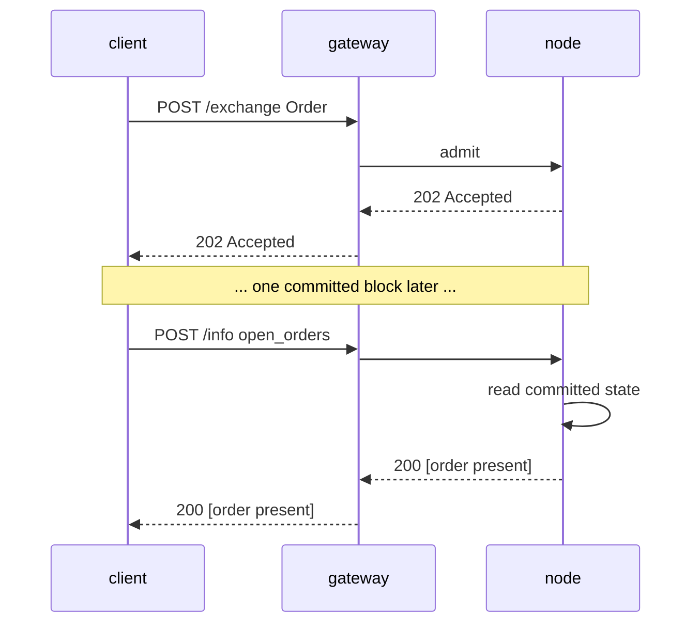

# `POST /info` — read & query endpoint

:::info
**Status.** **stable** shape. Query types are added over time; the envelope is committed.
:::

## TL;DR {#tldr}

Single endpoint, multi-type. Dispatches on the request body's `type` field. Read-only — never mutates state, never requires a signature.

:::tip
**Split by product.** Perp-market read queries are on [perpetual queries](./info/perpetuals.md); spot, spot-margin, and Earn read queries are on [spot & margin queries](./info/spot.md); closed-position lifecycle queries are on [position history](./info/position-history.md); governance queries are on [governance queries](./info/governance.md). This page covers the envelope, conventions, and account/vault/validator reads.
:::

## URL {#url}

```
POST  https://api.<net>.mtf.exchange/info
```

| Path | Wire shape |
|------|-----------|
| `POST /info` (gateway) | MTF-native (this document) |

The gateway serves the MTF-native `/info`. Running the node yourself, the same
native `/info` is served directly at `http://localhost:8080`.

## Envelope {#envelope}

Request:

```json
{ "type": "<query_type>", /* type-specific args */ }
```

Response:

```json
{ "type": "<query_type>", "data": { /* type-specific */ } }
```

On unknown `type`: `400 Bad Request` with `{"error":"unknown info type: <X>"}`.
On unknown resource (e.g. unknown vault id): `404 Not Found` with `{"error":"<resource> not found"}`.

## Query types {#query-types}

### Static node identity and protocol version {#node_info}

:::warning
**Operator lane only — this query is REFUSED on the public API.** It answers
with the same error an unknown type gets. It stays available to node operators
reading a node directly.
:::

Static node identity + protocol version. No parameters.

```json
{ "type": "node_info" }
```

Response:

```json
{
  "type": "node_info",
  "data": {
    "network":           "testnet",
    "chain_id":          114514,
    "protocol_version":  "1.0.0",
    "validator_index":   null,
    "build_commit":      "unknown",
    "version":           "0.0.1",
    "freeze_halt_supported": true,
    "uptime_seconds":    0
  }
}
```

| Field | Type | Description |
|-------|------|-------------|
| `network` | `"devnet" \| "testnet" \| "mainnet"` | Network variant, derived from `chain_id` (`31337`=devnet, `114514`=testnet, `8964`=mainnet) |
| `chain_id` | uint64 | EIP-712 chain id — the SAME value the `/exchange` signing domain must use |
| `protocol_version` | semver string | Wire-protocol version |
| `validator_index` | uint32 \| null | This node's index in the active validator set; **FLAGGED:** `null` until the runtime calls `set_validator_index` |
| `build_commit` | hex string | Operator-published build identifier; **FLAGGED:** `"unknown"` until published |
| `version` | semver string | Node software release version, baked in at build time. A release shares one `version` across its binaries — `build_commit` is the per-build distinguisher |
| `freeze_halt_supported` | bool | Always `true` for this binary — capability flag: the node halts cleanly with exit code `77` once the freeze height commits so a node supervisor can swap in the next release |
| `uptime_seconds` | uint64 | Process uptime; **FLAGGED:** `0` until the runtime calls `set_uptime_seconds` |

These are **per-node** fields (node identity / runtime), NOT consensus state, so they legitimately differ across nodes.

### Per-account margin, positions, and balances {#account_state}

Per-account snapshot.

```json
{ "type": "account_state", "address": "0x<addr>" }
```

| Arg | Type | Required | Description |
|-----|------|----------|-------------|
| `address` | hex address | yes | Account address |
| `detail` | `"full"` \| `"margin"` \| `"overview"` \| `"adl"` | no | Response depth. Absent ⇒ `"full"` |

`detail: "margin"` answers with the **margin scalars only** — `address`,
`account_value`, `total_raw_usd`, `withdrawable`, `total_margin_used`,
`cross_maintenance_margin_used`, `health`, `tier`, `abstraction`. It skips the
position walk and the balance scan, so it is the right call for a frequent
liquidation-health poll (a risk-watcher bot, an automated margin top-up). Both
depths compute the scalars with one shared helper, so the two can never
disagree.

```json
{
  "type": "account_state",
  "data": {
    "address":                       "0x00000000000000000000000000000000000ca11e",
    "account_value":                 "3000",
    "total_raw_usd":                 "3000",
    "withdrawable":                  "3000",
    "total_margin_used":             "0",
    "cross_maintenance_margin_used": "0",
    "health":                        "3000",
    "tier":                          "Safe",
    "abstraction":                   "unified",
    "height": 562,
    "time":   1700000000555
  }
}
```

The two depths do NOT carry the same scalar set, in both directions:

- **`cross_maintenance_margin_used` is served only at `detail: "margin"`.** The
  full depth carries the per-leg `maint_margin` on each position row instead.
  The two are different quantities — one is the account aggregate, one is a
  single leg's contribution.
- **`total_ntl_pos` is served only at the full depth.** It is a sum over the
  position walk, and `detail: "margin"` is defined by skipping that walk.

`detail: "overview"` answers with the account's **non-trading** state instead —
vaults, staking, sub-accounts, multisig, agents and the derived role. One
account has one state, so it has one read; `detail` chooses which half of that
state you want. `"full"` and `"margin"` both answer the trading half — `margin`
is the scalar-only subset of it — while `"overview"` answers the other half. The
only fields all three share are `address` and the `height` / `time` stamp. See
[`detail: "overview"`](#account_state-overview) below.

`detail: "adl"` answers the **full body widened**, not a different body: every
field of `"full"` plus `adl_lamps` on each position row. See
[`detail: "adl"`](#account_state-adl) below.

An **unknown address** (never seen on-chain) returns **200** with a fully zeroed
record (`account_value:"0"`, empty `clearinghouse_state` / `balances`), NOT a
`404`.

Response (a faucet-funded account, no positions):

```json
{
  "type": "account_state",
  "data": {
    "address":         "0x00000000000000000000000000000000000ca11e",
    "account_value":     "3000",
    "total_raw_usd":     "3000",
    "total_ntl_pos":     "0",
    "withdrawable":      "3000",
    "total_margin_used": "0",
    "health":            "3000",
    "tier":              "Safe",
    "abstraction":       "unified",
    "clearinghouse_state": { "": { "positions": [] } },
    "balances": [
      { "name": "USDC", "signing_id": 100, "total": "3000", "hold": "0", "avg_entry_px": null }
    ],
    "pm_maint_margin":          "0",
    "pm_net_value":             "0",
    "pm_concentration_penalty": "0",
    "position_mode":            "one_way",
    "height": 562,
    "time":   1700000000555
  }
}
```

`abstraction` is `"unified"` (default cross-collateral account) or
`"portfolio"` (portfolio-margin enrolled) — derive PM enrollment as
`abstraction == "portfolio"`. `pm_maint_margin` / `pm_net_value` /
`pm_concentration_penalty` are always present (whole-USDC strings, `"0"` when
not PM-enrolled) — see [portfolio margin](../../concepts/portfolio-margin.md).
`position_mode` is `"one_way"` or `"hedge"` — see [hedge mode](../../concepts/hedge-mode.md).

Each `balances[*]` row is `{asset, name, total, hold, avg_entry_px}`: `total` is
the full balance and `hold` is the part locked behind a resting spot order
(escrow). Row 0 is always USDC (asset id `100`); a token that is entirely held
still appears.

:::warning
**`total − hold` is NOT the spendable amount.** `hold` counts spot order escrow
only. USDC that margins an open PERPETUAL position stays in `total` and never
enters `hold`, so `total − hold` overstates the budget for every position holder.
The chain admits a spot buy against **free collateral** (equity minus held
initial margin), and refuses an order that only `total − hold` allows.

Read `withdrawable` for the spendable USDC figure — it is the same free-collateral
number the admission gate uses, clamped at zero. See
[account value](../../concepts/account-value.md#balances-and-hold) for the rule
and a worked example.
:::

**`balances` is the whole spot ledger.** Every token the account holds appears
here, so this read answers the spot-balance question as well as the margin one.
There is no separate spot-balance read.

A positioned account adds entries under `clearinghouse_state["<dex>"].positions`
— the empty-string key `""` is the core dex; a MIP-3 deployer dex keys by the
deployer's lowercase `0x` address:

```json
{
  "coin":              "BTC",
  "size":              "1.00000",
  "entry":             "67000.00",
  "upnl":              "5.00",
  "isolated":          false,
  "lev":               10,
  "liq":               "61000.00",
  "roe":               "0.0075",
  "funding":           "-0.12",
  "margin":            "201.00",
  "maint_margin":      "670.00",
  "notional":          "6705.00"
}
```

| Field | Type | Description |
|-------|------|-------------|
| `account_value` | Decimal string | Equity incl. settled PnL, **whole-USDC plane** (`"3000"` = 3000 USDC, NOT base units) |
| `total_raw_usd` | Decimal string | **Settled cash equity**, whole-USDC. Realized USDC only — deposits, closed-position PnL, fees already paid. It **excludes unrealised PnL**, which is the one difference from `account_value`. It is the `settled cash` term the `withdrawable` formula starts from, so a caller can now reconcile that formula from the read alone |
| `withdrawable` | Decimal string | Cash you can take out, **clamped at zero**. `total_raw_usd` minus funding you owe minus `total_margin_used`. It does NOT count unrealised profit, so a healthy account funded by open profit reads `"0"` — see [account value](../../concepts/account-value.md#withdrawable). The admission gate still uses the raw signed figure, which can be negative; the read never is |
| `total_margin_used` | Decimal string | Held initial-margin requirement |
| `total_ntl_pos` | Decimal string | Mark notional of the account's **CROSS** positions, summed: `Σ \|real size\| × mark_px`, whole-USDC, unsigned. **Isolated legs are excluded** — they are margined and liquidated on their own. Equal to the sum of the `notional` of every position row whose `isolated` is `false`. **Full depth only**: `detail: "margin"` skips the position walk that produces it |
| `cross_maintenance_margin_used` | Decimal string | The **CROSS** account's maintenance requirement, whole-USDC — the figure the liquidation engine judges the cross bucket against. **`detail: "margin"` only**; the full depth omits it. **The scope is why the name says `cross`:** an isolated position posts its own margin bucket and is liquidated per leg, so it contributes nothing here. An account holding only isolated legs reports `"0"` and can still be liquidated. To size an isolated position, read that leg's own `maint_margin` row instead |
| `health` | Decimal string | `account_value − cross_maintenance_margin_used` (signed dollar figure; can be negative) — **not a ratio** |
| `tier` | enum | `"Safe"`, `"T0"`, `"T1"`, `"T2"`, `"T3"` (BOLE band of `account_value / cross_maintenance_margin_used`; `"Safe"` when no maintenance margin) — see [tiered liquidation](../../concepts/tiered-liquidation.md) |
| `abstraction` | enum | `"unified"` or `"portfolio"` (PM-enrolled) |
| `clearinghouse_state` | object | Keyed by dex (`""` = core dex, else a MIP-3 deployer's `0x` address); each value is `{positions: [...]}` |
| `clearinghouse_state["<dex>"].positions[*].coin` | string | Market symbol (e.g. `"BTC"`), not a numeric id |
| `clearinghouse_state["<dex>"].positions[*].size` | Decimal string | Signed **real** size (`raw lots / 10^sz_decimals`); negative = short |
| `clearinghouse_state["<dex>"].positions[*].entry` | Decimal string | Per-whole-unit entry price = `\|entry_notional\| / \|real size\|`, **whole-USDC plane** |
| `clearinghouse_state["<dex>"].positions[*].upnl` | Decimal string | Mark-to-market PnL = `real size × mark − signed entry_notional`, **whole-USDC plane** (signed) |
| `clearinghouse_state["<dex>"].positions[*].isolated` | bool | `true` unless the position is cross-margined |
| `clearinghouse_state["<dex>"].positions[*].lev` | uint8 | Position's chosen leverage |
| `clearinghouse_state["<dex>"].positions[*].liq` | Decimal string \| null | Mark price (whole-USDC) at which this leg reaches maintenance. **Solved on the leg's own margin plane**: a cross leg against the cross account, an isolated leg against its posted `isolated_margin` alone. `null` when no non-negative price breaches maintenance, and when size is zero — see below |
| `clearinghouse_state["<dex>"].positions[*].roe` | Decimal string | `upnl / initial_margin` as a decimal fraction; `"0"` at zero leverage / notional |
| `clearinghouse_state["<dex>"].positions[*].funding` | Decimal string | Accrued-but-unsettled funding for **this leg**, **whole-USDC** (signed; negative = you owe). Includes the accrual built up since the last funding charge, so it stays non-zero between funding periods — the same accrual `account_value` and `withdrawable` already fold in |
| `clearinghouse_state["<dex>"].positions[*].margin` | Decimal string | This leg's INITIAL margin, **whole-USDC** |
| `clearinghouse_state["<dex>"].positions[*].maint_margin` | Decimal string | This leg's maintenance-margin contribution, **whole-USDC**: `\|entry_notional\| × maint_margin_ratio` |
| `clearinghouse_state["<dex>"].positions[*].notional` | Decimal string | Position notional at mark, **whole-USDC** (signed): `real_size × mark_px` |
| `clearinghouse_state["<dex>"].positions[*].side` | enum \| absent | **[Hedge mode](../../concepts/hedge-mode.md) only** — `"long"` / `"short"`, the leg this object reports. **Omitted on a one-way account** (a single *net* position whose `size` may be negative). A hedge account holding both legs on one asset returns **two** objects, one per side. |
| `clearinghouse_state["<dex>"].positions[*].adl_lamps` | uint8 \| absent | **`detail: "adl"` only** — the ADL queue indicator, `0` to `4`. More lamps = sooner deleveraged. Omitted at every other depth, and on the WS frame. See [`detail: "adl"`](#account_state-adl) |
| `balances[*].asset` | uint32 | Asset id (`100` for USDC) |
| `balances[*].name` | string | Token symbol (`"USDC"` for row 0) |
| `balances[*].total` | Decimal string | Full balance. **Not** the spendable amount — perp margin sits inside it. Use `withdrawable` |
| `balances[*].hold` | Decimal string | Amount locked behind a resting spot order (escrow). Spot escrow only; it never holds perp margin |
| `balances[*].avg_entry_px` | Decimal string \| null | Average cost basis for the token; `null` when there is none (always `null` on the USDC row — USDC is the quote asset) |
| `pm_maint_margin` | Decimal string | PM engine's maintenance requirement, whole-USDC; `"0"` when not PM-enrolled |
| `pm_net_value` | Decimal string | PM engine's net scenario value, whole-USDC; `"0"` when not PM-enrolled |
| `pm_concentration_penalty` | Decimal string | PM single-asset concentration penalty, whole-USDC; `"0"` when not PM-enrolled |
| `position_mode` | enum | `"one_way"` (single net position per asset) or `"hedge"` (separate long/short legs) |
| `height` | uint64 | Committed block height this snapshot reflects. A **bare integer**, not a Decimal string. Advances on **every** commit, even when nothing else in the record changed |
| `time` | uint64 | Consensus block time in **milliseconds**. A **bare integer**. Advances on every commit, from the same consensus clock as `height` |

#### Reading `liq` {#reading-liq}

`liq` is solved on the plane that actually liquidates the leg. A **cross** leg
shares one margin pool with every other cross leg, so its `liq` moves when any
other cross position moves. An **isolated** leg is backed only by its own posted
`isolated_margin`; the cross balance never rescues it, and a large cross balance
never pushes its `liq` away.

`liq` is **`null`, never `"0"`**, when the leg has no liquidation price. Two
cases produce it: a zero-size leg, and a long whose solved price is negative —
that long cannot be price-liquidated, because no non-negative mark breaches its
maintenance requirement. Treat `null` as "no price triggers this leg", and treat
`"0"` — should you ever see it — as a real price of zero. A client that renders
`null` as `0` tells the user the position is at the brink when it is the
opposite.

`liq` answers "what price liquidates THIS leg". It is not a promise about the
account: a cross account can still be liquidated by a move on a different market.

`height` / `time` are an **as-of stamp**: they tell you which committed block the
snapshot was rendered against, and they advance on every commit regardless of
whether any monetary field moved. This lets a client tell a **fresh-but-quiet**
account (constant `account_value`, but `height`/`time` still climbing) apart from
a **stalled** read path (`height`/`time` frozen — the node or your connection has
stopped advancing). The same stamp appears on the WS
[`account_state`](../ws/subscriptions.md#account_state) channel with identical
values, so a client can cross-check or de-duplicate REST and WS against it.

#### Cost basis and spot PnL {#avg-entry-px}

:::caution
**Treat a missing key exactly like `null`** — no basis known. An older node
serves `balances` rows carrying `name`, `total` and `hold` only.
:::

`avg_entry_px` is what the account paid, per token, for what it holds. It is the
one input spot PnL needs:

```
unrealized_spot_pnl = (mark_px − avg_entry_px) × total
```

It is a PRICE and not a total on purpose. `total` includes the part locked behind
resting orders (`hold`), so a server-computed notional would have to choose which
quantity to multiply by, and you could not see which it chose. Multiply by the
quantity YOU mean.

**The rule behind it — basis is recorded on spot BUYS only.**

- A spot **buy** rolls the weighted average acquisition cost forward.
- A spot **sell** reduces the balance but **keeps the per-unit average
  unchanged**. Selling does not re-price what remains.
- **Deposits record no basis.** Tokens that arrive by bridge deposit, by a
  Core↔EVM credit, by a spot transfer from another account, or by a governance
  adjustment were not bought on this chain, so there is no price to record.

**Consequences to code against:**

- A holding acquired **entirely** by deposit or transfer has **`avg_entry_px:
  null`**. It is never `"0"`. A zero would claim the tokens were free and make
  the whole balance look like profit; `null` says plainly that the basis is not
  known. This matches the `null`-over-wrong-but-plausible rule used by the
  [position history](./info/position-history.md#honesty-flags) completeness flags.
- A holding **partly** bought and partly transferred in prices the transferred
  tokens at the standing average, because the transfer wrote no basis of its own.
  `avg_entry_px` is then a real number, but it covers the bought portion's price
  applied across the whole balance.
- Do not render a PnL figure when `avg_entry_px` is `null`. Render "—" instead. A
  PnL computed against a null basis is not a small error; it is the entire
  notional reported as gain.

**Perp positions are unaffected.** They carry their own `entry` price on the
`clearinghouse_state` rows above; `avg_entry_px` is the spot ledger's equivalent.

:::info
**No basis on the USDC row.** USDC is the quote asset — its cost basis in USDC
is meaningless — so `balances[0].avg_entry_px` is always `null`. See
[USDC unification](../../concepts/usdc.md).
:::


#### `detail: "overview"` — everything that is not trading {#account_state-overview}

The account's full **non-trading** state: vaults, staking, sub-accounts,
multisig, agent wallets, and the derived role. The default depth owns margin,
positions and balances. This depth owns everything else.

**Why this is a depth and not its own read.** One account has one state, so it
answers on one read. The facets below change rarely — a vault deposit, a
delegation, an agent approval — while margin and positions change every commit.
A depth keeps the default answer small for the callers that poll it, and still
gives the whole account in ONE round trip to a caller that wants it. Ask for
this depth when you render an account page, approve an agent, or list
sub-accounts. Do not ask for it in a poll loop.

**The WS [`account_state`](../ws/subscriptions.md#account_state) channel pushes
the DEFAULT depth only.** A depth is a REST parameter. Read this depth over REST
when you need it.

```json
{ "type": "account_state", "address": "0x<addr>", "detail": "overview" }
```

An **unknown address** answers **200** with every sub-object honest-empty, NOT a
`404` — the same rule the default depth follows.

Response:

```json
{
  "type": "account_state",
  "data": {
    "address": "0x<addr>",
    "role":    "user",
    "vault": {
      "equities": [
        { "vault_id": 7, "vault_address": "0x<vault>", "shares": "1", "equity": "5000000000" }
      ],
      "vaults": [ /* a <vault_state> body per vault this account follows or leads */ ]
    },
    "staking": {
      "state":   { /* a <staking_state> body, minus the repeated address */ },
      "summary": {
        "undelegated":        "250",
        "total_delegated":    "500",
        "pending_withdrawal": "50",
        "claimable_rewards":  "7",
        "n_delegations":      2
      }
    },
    "sub_accounts": [
      { "index": 0, "address": "0x<sub_addr>", "equity": "2500" }
    ],
    "multisig": { "is_multi_sig": true, "threshold": 2, "signers": ["0x…", "0x…"] },
    "agents": [
      { "agent": "0x<agent_addr>", "name": "trading-bot", "expires_at_ms": 1700000500000 }
    ],
    "height": 562,
    "time":   1700000000555
  }
}
```

| Field | Type | Description |
|-------|------|-------------|
| `address` | hex address | Resolved account address. Carried ONCE at the top — no sub-object repeats it |
| `role` | `"missing" \| "user" \| "agent" \| "vault" \| "sub_account"` | Derived role. Precedence: `vault` (the address is a vault) → `sub_account` → `agent` (an approved agent of some master) → `user` (has account, config or spot state) → `missing` |
| `vault.equities[*].vault_id` | uint64 | Vault id |
| `vault.equities[*].vault_address` | hex address | Vault address |
| `vault.equities[*].shares` | Decimal string | The account's share count in **WHOLE shares**, not the raw 10¹⁸ integer. Send this exact string back to [`vault_withdraw`](./exchange.md#vault_withdraw) — read and write use one plane |
| `vault.equities[*].equity` | Decimal string | `shares × share_price`, truncated — whole-USDC. Share price is mark-to-market NAV per share, so this is what a redemption pays now, not a high-water-mark figure |
| `vault.vaults[*]` | object | One [`vault_state`](#vault_state) body per vault the account **follows or leads**, field-identical to that read. A leader with no deposit still gets a row |
| `staking.state` | object | A [`staking_state`](#staking_state) body for this account, minus the repeated `address` |
| `staking.summary.undelegated` | Decimal string | The free staking pool: MTF moved in with `staking_deposit` and **not yet delegated** (whole-MTF) |
| `staking.summary.total_delegated` | Decimal string | Sum of active delegations (whole-MTF) |
| `staking.summary.pending_withdrawal` | Decimal string | Sum of pending undelegations (whole-MTF) |
| `staking.summary.claimable_rewards` | Decimal string | Accumulated delegator rewards (whole-MTF) |
| `staking.summary.n_delegations` | uint64 | Number of active delegations |
| `sub_accounts[*].index` | uint32 | Sub-account index under this parent |
| `sub_accounts[*].address` | hex address | Sub-account address |
| `sub_accounts[*].equity` | Decimal string | The sub-account's mark-to-market equity, whole-USDC — the same figure its own `account_state.account_value` reports |
| `multisig.is_multi_sig` | bool | Whether the account is multisig |
| `multisig.threshold` | uint32 | M-of-N threshold; `0` if not multisig |
| `multisig.signers` | hex address[] | Signer set; empty if not multisig |
| `agents[*].agent` | hex address | Approved agent / API wallet address |
| `agents[*].name` | string \| null | Agent label set at approval time; `null` if unset |
| `agents[*].expires_at_ms` | uint64 \| null | Approval expiry (consensus ms); `null` for a never-expiring approval |
| `height` / `time` | uint64 | Committed block this snapshot was rendered against — the same as-of stamp the default depth carries |

**The three staking balances are disjoint — add them for the whole holding.**
`staking.summary.undelegated`, `total_delegated` and `pending_withdrawal` never
overlap. A screen that shows `total_delegated` alone shows the user less than
they hold. `undelegated` is the figure a delegate form needs: `token_delegate`
draws from it, so an amount above it is refused.

**`sub_accounts[*].equity` counts unrealised PnL.** A sub-account deep in loss
reads DOWN here, not at its settled cash, so a parent scanning this list sees the
one that is near liquidation.

**Shares are WHOLE shares on both read and write.** Committed state keeps shares
as a raw integer on a 10¹⁸ scale; this depth divides by 10¹⁸ before it answers.
Do **not** multiply `shares` by 10¹⁸. The division truncates **toward zero**, so
the string a holder reads back is never larger than the shares they hold — a
holder can under-ask, never over-burn.

**Every sub-object is honest-empty, never absent.** An account with no vaults,
no stake, no sub-accounts, no multisig and no agents still answers with all six
keys present and each one empty or zeroed.

State source: `user_vaults`, `c_staking`, `sub_account_tracker`,
`multi_sig_tracker.configs[addr]`, `locus.user_account_configs[addr].approved_agents`.

#### `detail: "adl"` — the ADL queue indicator {#account_state-adl}

`detail: "adl"` returns the DEFAULT body with one extra key on every position
row: `adl_lamps`, an integer from `0` to `4`. More lamps means the position sits
sooner in the auto-deleveraging queue. Nothing else changes, so a caller can
switch a screen from `"full"` to `"adl"` without touching any other field.

```json
{ "type": "account_state", "address": "0x<addr>", "detail": "adl" }
```

```json
{
  "coin":              "BTC",
  "size":              "1.00000",
  "entry":             "67000.00",
  "upnl":              "5.00",
  "isolated":          false,
  "lev":               10,
  "liq":               "61000.00",
  "roe":               "0.0075",
  "funding":           "-0.12",
  "margin":            "201.00",
  "maint_margin":      "670.00",
  "notional":          "6705.00",
  "adl_lamps":         3
}
```

**It is opt-in for a reason.** Each lamp ranks the position against every other
position in that market, so the node pays one extra pass over the market per
row. Ask for `"adl"` only on a screen that shows the column; poll the default
depth otherwise.

**It is REST-only.** The [WS `account_state`](../ws/subscriptions.md#account_state)
frame always carries the default shape and never `adl_lamps` — the lamp ranks
your seat against OTHER accounts, so a stranger's PnL crossing a quartile edge
would re-emit your frame.

:::warning
**Two rules a caller gets wrong.**

**1. It is a RANKING, not a probability.** The lamps say where you sit in the
queue among the profitable holders on your side — the quartile of your seat, `4`
= top quarter, `1` = bottom quarter. They do NOT say ADL is likely. Four lamps
with nobody being liquidated on the other side still means **nothing happens**.
Never render it as a risk percentage.

**2. ZERO lamps is meaningful.** Zero is not "unknown" and not "safest of the
ranked". Zero means **not in the queue at all**, which is the honest answer for
a position ADL cannot structurally reach: no committed mark for the market, no
unrealised profit, no cost basis, or **nobody on the opposite side to be
deleveraged against**. That last one includes a hedge account whose only
opposing leg is its OWN — ADL never nets an account against itself, so a sole
hedge holder reads `0` on both legs. A floor of one lamp would be a false alarm.
:::

**What the ranking is.** The queue is ordered by the same expression the settle
path uses to pick its counterparty: return on committed margin, `unrealised PnL
÷ |entry notional|`, highest first, with a `(address, leg)` ascending tiebreak.
So a small, highly levered winner is netted ahead of a large, lightly levered one
with bigger absolute PnL. Hedge legs rank SEPARATELY, because ADL settles per
leg: a long leg is only ever ranked against other longs.

This is the **netting-at-mark** queue — who gets deleveraged. It is a different
question from who pays the [deficit haircut](../../concepts/adl.md#2-allocation--deterministic-capacity-pro-rata),
which is allocated pro-rata by capacity and has no ranking at all.

### Per-vault TVL, share price, and strategy {#vault_state}

Per-vault snapshot.

```json
{ "type": "vault_state", "vault": "0x<vault_addr>" }
```

Response:

```json
{
  "type": "vault_state",
  "data": {
    "vault":              "0x<addr>",
    "name":               "MFlux Conservative",
    "tvl":             "10000000000",
    "share_price":     "10500000",
    "depositor_count":    142,
    "high_water_mark": "10500000",
    "performance_fee_bps":"1000",
    "lock_period_ms":     86400000,
    "strategy":           "User"
  }
}
```

`strategy` is the vault's `kind` — `"User"` or `"Metaliquidity"` — not a
free-text strategy label.

`tvl` and `share_price` are **mark-to-market NAV**: settled cash, plus unrealised
PnL on every open position at the latest oracle mark, plus unrealised funding.
The Metaliquidity backstop vault also subtracts its pending-loss reserve. This is
the same NAV that [`vault_withdraw`](exchange.md#vault_withdraw) burns shares
against, so the read and the payout agree.

`high_water_mark` is **not** NAV. It is a ratchet kept for performance-fee
accounting: profit raises it, a deposit bumps it, a withdrawal lowers it, and a
trading loss never does. A vault in drawdown therefore shows
`high_water_mark` above `share_price`, and the gap is exactly the profit the
leader must re-earn before the vault charges a performance fee again. Never price
a redemption off `high_water_mark`.

### Per-account staking and delegation state {#staking_state}

```json
{ "type": "staking_state", "address": "0x<addr>" }
```

Response:

```json
{
  "type": "staking_state",
  "data": {
    "address":                  "0x<addr>",
    "total_staked":             "1000000000",
    "undelegated_pool_balance": "250000000",
    "delegations": [
      {
        "validator":         "0x<val_addr>",
        "amount":         "500000000",
        "since_ts":          1735000000000,
        "pending_rewards":"1000000"
      }
    ],
    "pending_unstakes": [
      { "amount": "200000000", "matures_at_ts": 1735780000000 }
    ],
    "reward_pool": {
      "total_stake":                 "1000000",
      "pending_validator_pool_usdc": "25.75",
      "reward_source":               "fee_funded_on_book_buy"
    }
  }
}
```

| Field | Type | Description |
|-------|------|-------------|
| `address` | hex address | Resolved account address |
| `total_staked` | Decimal string | **Delegated** stake only (whole-MTF) — the sum of `delegations[*].amount` |
| `undelegated_pool_balance` | Decimal string | Stake deposited but **not delegated** (whole-MTF, the same plane as `total_staked`). See the upgrade notice below |
| `delegations[*].validator` | hex address | Validator the stake is delegated to |
| `delegations[*].amount` | Decimal string | Stake delegated to this validator (whole-MTF) |
| `delegations[*].since_ts` | uint64 | When the delegation began (consensus ms) |
| `delegations[*].pending_rewards` | Decimal string | Accrued, unclaimed rewards (whole-MTF) |
| `pending_unstakes[*].amount` | Decimal string | Stake in the unbonding window (whole-MTF) |
| `pending_unstakes[*].matures_at_ts` | uint64 | When that amount becomes withdrawable (consensus ms) |
| `reward_pool.total_stake` | Decimal string | Total staked MTF across the chain (whole-MTF) — the denominator this account's delegated stake competes in |
| `reward_pool.pending_validator_pool_usdc` | Decimal string | Fees accrued to the validator pool and not yet distributed, whole USDC. This is the reward the next distribution draws from |
| `reward_pool.reward_source` | string | Always `"fee_funded_on_book_buy"`. A constant, present so a client can tell a fee-funded chain from an emission-funded one without inferring it |

:::warning
**`reward_pool` serves NO APR, and that is deliberate.** The emission era is
over. Rewards are funded from fees, not minted on a curve, so there is no annual
rate to publish. **Do not derive one.** The pending pool is a snapshot of accrued
fees, not a rate: it depends on trading volume that has not happened yet. A
plausible-looking wrong number is worse than an honest absence.
:::

> ⬆️ **Upgrade notice — not live yet.** `undelegated_pool_balance` and
> `reward_pool` are not served here. Treat a missing key as "this node predates
> the field", not as a zero balance.

**`total_staked` alone under-reports what an account holds.** It counts
**delegated** stake. `stakingDeposit` credits a free pool and `stakingWithdraw`
debits it, and stake can sit in that pool undelegated for as long as the holder
likes. A front end that shows only `total_staked` shows a user less than they
have. Add `undelegated_pool_balance` to get the account's full staked balance.

The free pool is also **not** the same thing as `pending_unstakes`. Undelegated
stake is already free. `pending_unstakes` is stake still inside its unbonding
window, which is not withdrawable until `matures_at_ts`.

**The three balances are disjoint — add them for the whole staked holding.**
`staking_deposit` credits `undelegated_pool_balance`; `token_delegate` moves
stake out of that pool into `total_staked`; undelegating moves it out of
`total_staked` into `pending_unstakes` for the unbonding window.
`undelegated_pool_balance` is the spendable figure a delegate form needs — it is
what `token_delegate` draws from, and the only one of the three that
`staking_withdraw` returns to spot with no unbonding window.

### Volume-tiered maker and taker fees {#fee_schedule}

```json
{ "type": "fee_schedule" }
```

Response:

```json
{
  "type": "fee_schedule",
  "data": {
    "tiers": [
      { "volume_30d": "0",         "maker_bps": "2.0", "taker_bps": "5.0" },
      { "volume_30d": "100000000", "maker_bps": "1.5", "taker_bps": "4.5" },
      { "volume_30d": "1000000000","maker_bps": "1.0", "taker_bps": "4.0" }
    ],
    "builder_rebate_bps": "0.2",
    "burn_ratio":         "0.30",
    "referrer_share_bps": "1.0"
  }
}
```

Fee rates are decimal **basis points** as strings with one fractional digit (e.g. `"2.0"` = 2 bps = 0.02%, `"0.5"` = 0.5 bps = 0.005%), allowing fine-grained sub-basis-point precision. `burn_ratio` is a decimal fraction (`"0.30"` = 30% of fees burned). See [fees](../../concepts/fees.md).

### Account's resting orders across all books {#open_orders}

Account-scoped resting orders across every perp **and spot** book. A spot
entry labels `coin` with the pair name (e.g. `"BTC/USDC"`) and renders
`px` / `size` in the pair's own planes (pair tick, base-token size decimals).

```json
{ "type": "open_orders", "address": "0x<addr>" }
```

| Arg | Type | Required |
|-----|------|----------|
| `address` | hex address | yes |

The account is identified by `address` (0x hex). Missing `address` →
`400 {"error":"missing field address"}`.

Response:

```json
{
  "type": "open_orders",
  "data": {
    "address":    "0x<addr>",
    "orders": [
      {
        "oid":         12345,
        "coin":        "BTC",
        "side":        "B",
        "px":          "99000",
        "sz":          "0.007",
        "orig_sz":     null,
        "cloid":       "0x000000000000000000000000cafef00d",
        "tif":         "gtc",
        "reduce_only": false,
        "trigger":     null,
        "inserted_at": 1700000000000
      }
    ]
  }
}
```

Every row is the **same canonical shape** the WS
[`open_orders`](../ws/subscriptions.md#open_orders) snapshot renders, so REST and
WS never drift. An unknown field renders `null`.

| Field | Type | Description |
|-------|------|-------------|
| `address` | hex address | Resolved account address |
| `orders[*].oid` | uint64 | Server order id (the real resting id; cancellable per-`oid`) |
| `orders[*].coin` | string | Market symbol the order rests on (e.g. `"BTC"`, or a pair name like `"BTC/USDC"`) |
| `orders[*].side` | `"B"` / `"A"` | Order side — **`B` = bid, `A` = ask**. The `/exchange` order body uses `"bid"` / `"ask"` instead |
| `orders[*].px` | Decimal string | Resting price, whole units (tick-snapped) |
| `orders[*].sz` | Decimal string | Remaining size, whole units |
| `orders[*].orig_sz` | Decimal string \| null | Original size when known; `null` on a resting-order row |
| `orders[*].cloid` | hex string \| null | Client order id the order was placed with (`0x` + 32 hex chars); `null` when the order set none |
| `orders[*].tif` | string | Lowercase time-in-force (`"gtc"` / `"ioc"` / `"alo"`), or the literal `"trigger"` on a parked TP/SL row |
| `orders[*].reduce_only` | bool | Reduce-only flag |
| `orders[*].trigger` | object \| null | Trigger detail when the row is (or carries) a trigger; `null` otherwise |
| `orders[*].inserted_at` | uint64 | Placement / insertion timestamp (consensus ms) |

A parked TP/SL leg is an open order too: it renders with `tif: "trigger"` and a
populated `trigger` block.

**Inside the `trigger` block.** A resting book order with an attached trigger
carries `trigger_px` + `trigger_above` only. A parked (off-book) leg carries
`is_parked: true`, `is_market`, and `limit_px` as well. Two further keys appear
only on the leg that owns them:

| Key | Type | When it is present |
|-----|------|--------------------|
| `trigger_px` | Decimal string | Always. The mark level the leg fires at |
| `trigger_above` | bool | Always. `true` = fire when the mark rises to `trigger_px` |
| `is_parked` | bool | Parked legs only. Absent on a resting book order's block |
| `is_market` | bool | Parked legs only. `true` = fires a market exit; `false` = rests a limit exit |
| `limit_px` | Decimal string \| null | Parked legs only. The resting price of a limit trigger; `null` on a market trigger |
| `group` | uint64 | **Ladder legs only.** The handle every leg of one scaled TP/SL ladder shares |
| `trail_px` | Decimal string | **Trailing legs only.** The callback offset the level ratchets by |

:::info
**`group` and `trail_px` are ABSENT unless the leg owns them.** Read absence as
"not a ladder leg" and "not a trailing leg". Every row you read before these
keys existed is byte-identical, so a decoder that types them as optional needs
no other change. A decoder that makes them REQUIRED fails on every ordinary
trigger.
:::

**`group` — the scaled TP/SL ladder.** A
[`positionTpsl`](./exchange.md#position-tpsl-ladder) batch of **three or more**
protective legs parks a *ladder*: the legs share one `group`, and they are **not
OCO** — a fill of one leg does not cancel the others, which is the point of
scaling out in steps. One or two legs stay the older shapes: a lone trigger, or
an OCO pair whose first fill cancels its partner. Group the rows by this value to
render one ladder as one control. The whole ladder retires together the moment
the position it protects is closed, by any path.

**`trail_px` — the trailing stop.** The parked level ratchets toward the mark by
this offset and never away from it, once per block. So when `trail_px` is
present, **`trigger_px` is the RATCHETED level, not the level the owner sent** —
do not render it as a static order the user placed. A trailing leg is always a
stop-loss; the chain refuses a trailing take-profit, which would chase its level
away from a winning position. `trail_px` is a **read-only** field today — see
[trailing stops](./exchange.md#trailing-stops-read-only) for why no caller can
send one yet.

### Recent fill history for an account {#user_fills}

Account-scoped fill history, served directly from committed on-node state (a
bounded per-account fill ring folded into the AppHash — no external indexer).

:::tip
**One row per EXECUTION.** This is the per-trade log. For one row per
**opened-then-closed position** — peak size, average entry, average close,
realized PnL and funding folded over a whole life — use
[position history](./info/position-history.md) instead.
:::

```json
{ "type": "user_fills", "address": "0x<addr>" }
```

| Arg | Type | Required | Description |
|-----|------|----------|-------------|
| `address` | hex address | yes | Account address |
| `limit` | uint32 | no | Cap the number of **most-recent** records returned; absent / `0` ⇒ the full ring |
| `start_time` | uint64 | no | Window start (consensus ms, inclusive); filters on the fill `time`. Absent ⇒ open lower bound |
| `end_time` | uint64 | no | Window end (consensus ms, inclusive). Absent ⇒ open upper bound |

The account is identified by `address` (0x hex). Missing `address` →
`400 {"error":"missing field address"}`.

**One read, two asks.** Send `address` alone for the recent window. Add
`start_time` / `end_time` to filter the same records by time. The response
echoes both bounds as `start_time` / `end_time` (`null` for a bound you omit),
and the fill-record shape is identical either way.

Response:

```json
{
  "type": "user_fills",
  "data": {
    "address":    "0x<addr>",
    "fills": [
      {
        "coin":           "BTC",
        "side":           "B",
        "px":             "67042.50",
        "sz":             "0.125",
        "time":           1700000000555,
        "oid":            12345,
        "tid":            90123,
        "fee":            "4.19",
        "closed_pnl":     "0",
        "cause":          "twap",
        "twap_id":        41,
        "dir":            "Open Long",
        "start_position": "0",
        "block":          562,
        "hash":           "0x2315b79b9e82c2deb279a59448bf7841f3767d30d874e5b544d75bb9fd1e9b0c"
      }
    ]
  }
}
```

Records are ordered oldest-first (newest last). The ring is bounded, so this is
a recent window, not all history. An account with no fills returns
`"fills": []`.

**A ranged ask reaches past the ring.** A request that carries `start_time`
older than the oldest ring record is answered from the archive. An un-ranged
request always answers from the ring.

| Field | Type | Description |
|-------|------|-------------|
| `address` | hex address | Resolved account address |
| `fills[*].coin` | string | Market symbol the fill executed on |
| `fills[*].side` | `"B"` / `"A"` | This leg's side token — `"B"` = buy/bid, `"A"` = sell/ask |
| `fills[*].px` | Decimal string | Execution price, **decimal USDC** (human-readable) |
| `fills[*].sz` | Decimal string | Filled size, **base units** (whole-unit) |
| `fills[*].time` | uint64 | Fill timestamp (consensus ms) |
| `fills[*].oid` | uint64 | This party's order id |
| `fills[*].tid` | uint64 | Deterministic trade id (shared by both legs of the print) |
| `fills[*].fee` | Decimal string | Fee this party paid, **decimal USDC** |
| `fills[*].closed_pnl` | Decimal string | Realized PnL on the closed portion, **decimal USDC** (signed) |
| `fills[*].dir` | string | Direction label, e.g. `"Open Long"`, `"Close Short"`, `"Open Short"`, `"Close Long"` |
| `fills[*].start_position` | Decimal string | Signed leg size BEFORE the fill, **base units** (whole-unit, signed) |
| `fills[*].block` | uint64 | Committed block height the fill settled in (on-chain locator) |
| `fills[*].cause` | string | **Present only when this leg did NOT execute by its own order crossing.** `"forced_close_partial"` / `"forced_close_full"` — the liquidation ladder; `"forced_close_isolated"` — an isolated leg breached its own bucket; `"forced_close_governance"` — a validator-quorum `force_close_position` settled against the book; `"trigger"` — a TP/SL fired; `"twap"` — a TWAP slice. **Absent on an ordinary fill and on EVERY maker leg** — a counterparty that was merely hit is not itself forced. **`forced_close_governance` is a forced close that is NOT a liquidation**: it charges no liquidation fee and does not bump the liquidation counters, so do not fold it into a liquidation total |
| `fills[*].liquidated_user` | hex address | **Present on a forced-close leg only, on BOTH sides of the print.** The account whose position was closed — so a taker can see whose liquidation it absorbed |
| `fills[*].mark_px` | Decimal string | Present with `liquidated_user`. The mark the LADDER priced from when it classified — **not** the fill price, and not a later mark |
| `fills[*].broker` | hex address | Present when a [broker code](../../concepts/broker-codes.md) routed the order. Taker leg only |
| `fills[*].broker_fee` | Decimal string | Present with `broker`. The carve charged on this fill, **decimal USDC**. `"0"` is legal — a zero-rate broker is still attributed |
| `fills[*].twap_id` | uint64 | Present on a TWAP slice (`cause` is `"twap"`). The parent order this slice belongs to. Taker leg only |
| `fills[*].hash` | hex string | Transaction hash of the originating signed order, `0x`-prefixed hex — lets the fill be traced on-chain. A taker leg carries its order's hash; a **maker leg carries the hash of the maker's own resting order** (its original `submit_order`), so both legs of a match are traceable to the action that placed them. **Empty string (`""`)** when there is no signed user order behind the leg — a system / begin-block / liquidation print — and, for maker legs, on fills recorded before the network upgrade |

**Archive-served fills carry no `cause`.** A window older than the node's fill
ring is answered from the archive, which stores the attribution fields
(`liquidated_user`, `mark_px`, `broker`, `broker_fee`, `twap_id`, `hash`) but
not the `cause` string. Classify a forced close by `liquidated_user` and a TWAP
slice by `twap_id` — both work on every row; a `cause` test silently misses
archive-era rows.

### Look up a single order's lifecycle {#order_status}

Single-order lifecycle lookup by `oid` (server order id) **or** `cloid` (client
order id). Reads the live books, the trigger registry, and the committed fill
ring — all on-node committed state.

```json
{ "type": "order_status", "oid": 12345 }
```

Or by client order id:

```json
{ "type": "order_status", "cloid": "0x000000000000000000000000cafef00d" }
```

| Arg | Type | Required | Description |
|-----|------|----------|-------------|
| `oid` | uint64 | one of `oid` / `cloid` | Server order id |
| `cloid` | hex string | one of `oid` / `cloid` | Client order id — `0x` + 32 hex chars |

Neither present → `400 {"error":"missing field oid or cloid"}`. A malformed
`cloid` → `400`. Resolution stops at the first hit, in this order: live resting
order → parked trigger → terminal fill → unknown.

The `data.status` discriminates the branch:

`"resting"` — a live order open in a perp or spot book:

```json
{
  "type": "order_status",
  "data": {
    "status": "resting",
    "order": {
      "oid":         12345,
      "coin":        "BTC",
      "side":        "B",
      "px":          "67000",
      "sz":          "700",
      "inserted_at": 1700000000000,
      "cloid":       "0x000000000000000000000000cafef00d"
    }
  }
}
```

`"triggered"` — a parked TP/SL/stop entry awaiting its mark cross:

```json
{
  "type": "order_status",
  "data": {
    "status": "triggered",
    "trigger": {
      "oid":           12345,
      "coin":          "BTC",
      "side":          "A",
      "trigger_px":    "66000",
      "trigger_above": false,
      "is_market":     false,
      "limit_px":      "65000",
      "sz":            "700",
      "registered_at": 1700000000000,
      "fired":         false
    }
  }
}
```

A **ladder** leg adds `group`, and a **trailing** leg adds `trail_px`. Both keys
follow the same absence rule as on [`open_orders`](#open_orders) — the node
writes each one only on the leg that owns it, so an ordinary trigger carries
neither:

```json
{
  "type": "order_status",
  "data": {
    "status": "triggered",
    "trigger": {
      "oid":           12346,
      "coin":          "BTC",
      "side":          "A",
      "trigger_px":    "65750",
      "trigger_above": false,
      "is_market":     true,
      "limit_px":      null,
      "sz":            "250",
      "registered_at": 1700000000000,
      "fired":         false,
      "group":         12345,
      "trail_px":      "250"
    }
  }
}
```

`"filled"` — the most recent matching fill in the per-account ring (the `fill`
object is the same shape as one [`user_fills`](#user_fills) record):

```json
{
  "type": "order_status",
  "data": {
    "status": "filled",
    "fill": { /* same shape as a user_fills fill record */ }
  }
}
```

`"unknown"` — never seen, or evicted from the bounded ring (a `cloid`-only query
that matched no resting/triggered order also resolves here, since the trigger
registry and fill ring are keyed by `oid`):

```json
{ "type": "order_status", "data": { "status": "unknown" } }
```

| Field | Type | Description |
|-------|------|-------------|
| `status` | `"resting" \| "triggered" \| "filled" \| "unknown"` | Resolved lifecycle state |
| `order` | object | Present on `"resting"` — `oid`, `coin` (market symbol or spot pair name), `side` (`"B"` = bid / `"A"` = ask), `px` / `sz` (decimal strings), `inserted_at`, `cloid` (hex \| null) |
| `trigger` | object | Present on `"triggered"` — `oid`, `coin`, `side` (`"B"` / `"A"`), `trigger_px` / `sz` (decimal strings), `trigger_above` (bool: fire when mark crosses above), `is_market` (bool: `true` = fires a market exit, `false` = rests a limit exit), `limit_px` (fixed-point decimal string \| `null`: the resting price for a limit trigger, `null` for a market trigger), `registered_at`, `fired` (bool). **Ladder legs only:** `group` (uint64, the shared ladder handle). **Trailing legs only:** `trail_px` (decimal string, the callback; `trigger_px` is then the RATCHETED level). Both keys are absent on every other trigger — see [`open_orders`](#open_orders) |
| `fill` | object | Present on `"filled"` — the matching fill record (see [`user_fills`](#user_fills)) |

### Latest committed block metadata {#block_info}

:::warning
**Operator lane only — this query is REFUSED on the public API.** It answers
with the same error an unknown type gets. It stays available to node operators
reading a node directly.
:::

Committed block metadata. No required args (`height` is accepted but ignored —
the read state keeps only the latest committed context).

Two of its fields were only ever restatements. `round` **equals** `height` —
each committed block advances exactly one round under the two-chain commit rule.
`epoch` is `height` divided by the fixed epoch length of `100000`. Derive both
from a height you already have.

```json
{ "type": "block_info" }
```

Response:

```json
{
  "type": "block_info",
  "data": {
    "height":       562,
    "round":        562,
    "epoch":        0,
    "timestamp": 1780475491562,
    "block_hash":   "0x2315b79b9e82c2deb279a59448bf7841f3767d30d874e5b544d75bb9fd1e9b0c"
  }
}
```

| Field | Type | Description |
|-------|------|-------------|
| `height` | uint64 | Latest committed block height |
| `round` | uint64 | Consensus round of that block |
| `epoch` | uint64 | Current epoch |
| `timestamp` | uint64 | Block timestamp (consensus ms) |
| `block_hash` | hex string (32 bytes) | Real committed block hash (now plumbed into the read state — no longer the all-zero placeholder) |

### The live option series registry {#option_series}

Every live [option](../../products/options.md) series, oldest series first. No
parameters.

```json
{ "type": "option_series" }
```

Response:

```json
{
  "type": "option_series",
  "data": {
    "series": [
      {
        "signing_id":      2147483649,
        "underlying":      "BTC",
        "kind":            "put",
        "strike":          "100000",
        "expiry":          1735689600000,
        "sz_decimals":     5,
        "escrow_per_unit": "100000"
      },
      {
        "signing_id":      2147483650,
        "underlying":      "BTC",
        "kind":            "capped_call",
        "strike":          "100000",
        "cap":             "130000",
        "expiry":          1735689600000,
        "sz_decimals":     5,
        "escrow_per_unit": "30000"
      }
    ]
  }
}
```

| Field | Type | Description |
|-------|------|-------------|
| `signing_id` | uint32 | **The number to sign.** Put it in the `market` field of every RFQ action for this series |
| `underlying` | string | Symbol of the underlying market the settlement price comes from |
| `kind` | enum | `"put"` or `"capped_call"`. A call is always capped |
| `strike` | decimal string | Strike `K`, whole USDC |
| `cap` | decimal string | Cap `C`, whole USDC. Present on a `capped_call` only — **absent on a put** |
| `expiry` | uint64 | Expiry (consensus ms). The first settlement attempt runs at this stamp |
| `sz_decimals` | uint8 | Size precision. An RFQ `size` of `10^sz_decimals` is ONE whole unit |
| `escrow_per_unit` | decimal string | What a **writer** locks per whole unit, whole USDC |

An empty registry answers `200` with `"series": []`.

:::warning[`escrow_per_unit` on a call is the width, not the strike]
For a `capped_call` it is `cap − strike`. A $100,000 strike capped at $130,000
escrows **$30,000** per unit, not $100,000. Reading `strike` as the lock
overstates it by the whole strike. Take the served field.
:::

:::danger[Sign `signing_id`. Do not compute it]
`signing_id` is the number an RFQ action carries. It is served whole for that
reason. **There is no public formula, base, or arithmetic that turns a series
into it** — the encoding is internal and it can move. A client that derives the
number signs a market the chain may not resolve.
:::

**What the row does not carry.** There is no option price, no implied volatility,
and no open interest. The chain never prices an option: the premium is what two
accounts agree on in an [RFQ](../../concepts/rfq.md). There is also no read for
your own option position yet — see
[options](../../products/options.md#reads).

## Account history query types {#account-history-query-types}

Per-account history reads — funding payments, ledger updates, past orders, TWAP
slice fills, and staking rewards. Same `{type, data}` envelope and MTF-native
conventions as the reads above (decimal-string money, `0x`-hex addresses, coin
**symbols**). Every type here requires `address` (0x hex; missing or malformed →
`400`); an **unknown address is never an error** — it answers **200** with the
empty shape (the established zeroed idiom).

Some of these types ship the locked wire contract with an **honest-empty**
array today (marked **Status: empty (history retention pending)** below): their
backing events currently stream on the live
[WS channels](../ws/subscriptions.md) only and are not yet retained for REST.
The retention backfill fills them **without a wire change** — the
request/response envelopes below are final, and the documented record shapes are
the locked forms the arrays will carry.

[`user_ledger_updates`](#user_ledger_updates) is empty for a different reason:
its records live in the archive, not on the node. Read its own notice below.

**An honest-empty array is not the same as a hardcoded one.** A read that could
only ever answer `[]` was deleted rather than documented — see
[deleted reads](#deleted-reads).

### Realized funding-payment history {#user_funding}

**Status: empty (history retention pending).** The envelope is live; `fundings`
is `[]` until funding payments are retained for REST. For live per-account
funding payments today, subscribe to the
[`user_fundings` WS channel](../ws/subscriptions.md#user_fundings).

```json
{ "type": "user_funding", "address": "0x<addr>", "start_time": 1700000000000, "end_time": 1700003600000 }
```

| Arg | Type | Required | Description |
|-----|------|----------|-------------|
| `address` | hex address | yes | Account address |
| `start_time` | uint64 | no | Window start (ms); echoed back (`null` when omitted) |
| `end_time` | uint64 | no | Window end (ms); echoed back (`null` when omitted) |

Response:

```json
{
  "type": "user_funding",
  "data": {
    "address":    "0x<addr>",
    "start_time": 1700000000000,
    "end_time":   1700003600000,
    "fundings":   []
  }
}
```

Future record shape (locked):

| Field | Type | Description |
|-------|------|-------------|
| `fundings[*].coin` | string | Market symbol the payment settled on |
| `fundings[*].payment` | Decimal string | Funding payment, whole-USDC (signed) |
| `fundings[*].szi` | Decimal string | Signed position size at settlement (whole units) |
| `fundings[*].funding_rate` | Decimal string | Funding rate applied (signed) |
| `fundings[*].time` | uint64 | Settlement timestamp (consensus ms) |

State source: the transient `user_fundings` WS sink (streamed, not yet retained for REST).

### Balance ledger update history {#user_ledger_updates}

> ⚠️ **This read answers `[]` today, and it is not scheduled.** The node holds
> no per-account ledger history for REST. The archive DOES retain the deltas,
> but it stores them in the node stream's own dialect — a SIGNED `delta` and a
> numeric token id — while the record shape below is locked to the
> [`ledger_updates` WS record](../ws/subscriptions.md#ledger_updates), which
> carries an UNSIGNED `amount` and a fine-grained `kind`. Routing the archive
> here would serve a shape this page forbids, so the gateway does not route it.
> It opens when the archive stores the record shape, not before.

**Neither side can answer this read today.** The node emits each balance delta
once on the [`ledger_updates` WS channel](../ws/subscriptions.md#ledger_updates)
and keeps nothing. The archive keeps the deltas in a lossier dialect. Use the WS
channel for live movement; there is no REST history for it yet.

**A deployment with no archive answers typed-empty**: `updates` is `[]`, never an
error. So `[]` carries two readings — "no archive here" and "no delta in this
window" — and the reply does not separate them. For a live per-account feed,
subscribe to the WS channel instead.

```json
{ "type": "user_ledger_updates", "address": "0x<addr>", "start_time": 1700000000000, "end_time": 1700003600000 }
```

| Arg | Type | Required | Description |
|-----|------|----------|-------------|
| `address` | hex address | yes | Account address |
| `start_time` / `end_time` | uint64 | no | Window (ms); echoed back (`null` when omitted) |

Response:

```json
{
  "type": "user_ledger_updates",
  "data": {
    "address":    "0x<addr>",
    "start_time": 1700000000000,
    "end_time":   1700003600000,
    "updates":    []
  }
}
```

Record shape (locked): the
[`ledger_updates` WS record](../ws/subscriptions.md#ledger_updates) verbatim —
`{kind, amount, time}` plus the kind-specific fields
(`destination`, `token`, `asset`, `to_perp`, `via`). Every `amount` is a
whole-token decimal string; no record carries raw base units.

State source: the archive's retained
[`node_ledger`](../../nodes/data-streams.md#node_ledger) stream. The node's own
`ledger_updates` WS sink is transient and feeds that stream; it is not a source
this read can query.

### Past executed orders {#historical_orders}

An account's past (executed) orders, folded from the same committed per-account
fill ring [`user_fills`](#user_fills) reads — one record per order (`oid`),
newest first, with `filled_sz` the exact sum of that order's fills.

```json
{ "type": "historical_orders", "address": "0x<addr>" }
```

| Arg | Type | Required | Description |
|-----|------|----------|-------------|
| `address` | hex address | yes | Account address |
| `limit` | uint32 | no | Cap the number of **most-recent** records returned; absent / `0` ⇒ all (bounded by the ring) |

Response:

```json
{
  "type": "historical_orders",
  "data": {
    "address": "0x<addr>",
    "orders": [
      {
        "oid":       12345,
        "coin":      "BTC",
        "side":      "B",
        "px":        "67042.5",
        "filled_sz": "1.2",
        "time":      1700000000555,
        "block":     562,
        "hash":      "0x2315b79b9e82c2deb279a59448bf7841f3767d30d874e5b544d75bb9fd1e9b0c",
        "status":    "filled"
      }
    ]
  }
}
```

| Field | Type | Description |
|-------|------|-------------|
| `orders[*].oid` | uint64 | Order id (the fold key) |
| `orders[*].coin` | string | Market **symbol** the order executed on |
| `orders[*].side` | `"B"` / `"A"` | Side token — `"B"` = buy/bid, `"A"` = sell/ask (same token as [`user_fills`](#user_fills)) |
| `orders[*].px` | Decimal string | Price of the order's most-recent fill, **decimal USDC** |
| `orders[*].filled_sz` | Decimal string | Total executed size — the exact sum of every fill of this `oid` (whole units) |
| `orders[*].time` | uint64 | Timestamp of the most-recent fill (consensus ms) |
| `orders[*].block` | uint64 | Committed block of the most-recent fill |
| `orders[*].hash` | hex string | Transaction hash of the originating order; `""` when none was recorded |
| `orders[*].status` | `"filled"` | The only status emitted today — see below |

Records are newest-first. The source ring is bounded, so this is a recent
window, not all history.

:::info
**`status` is `"filled"` only, today.** The committed ring holds **executed**
legs only, so cancel / reject / expire records are not yet emitted — a
partially-filled-then-cancelled order still renders as `"filled"` (with
`filled_sz` = the executed portion). Live resting orders and parked triggers are
deliberately **not** re-emitted here (they are derivable) — read them from
[`open_orders`](#open_orders) / [`order_status`](#order_status).
:::

State source: the committed per-account fill ring (`Exchange.account_fills[addr]`, the same ring behind [`user_fills`](#user_fills)), folded by `oid`.

### Commit-time verdict on a submitted action {#action_outcome}

:::danger[Removed]
**`action_outcome` no longer exists.** The node answers it with
`unknown info type`, the same error a type that never existed gets.

There is nothing to migrate to, because the answer already arrives earlier.
`POST /exchange` waits for the commit and returns the real outcome — an order
gets its assigned `oid` and its resting or filled state, and any other action
gets a committed confirmation, or a rejection **with its reason**. Read
[the submit response](./exchange.md), not a second call.

The read existed for two residual cases, and neither earns a second endpoint:

- **The wait expired.** `/exchange` bounds its wait at about fifty blocks. If it
  gives up, the chain is not keeping up; the action may still commit. RE-READ the
  state the action was meant to change. Do not treat the timeout as a failure.
- **You passed `?confirm=async`.** You asked not to wait. For orders, subscribe
  to the `order_updates` [WS channel](../ws/subscriptions.md).

:::caution[Re-submitting the same nonce answers nothing]
It is replay-SAFE — the committed nonce window rejects the duplicate — but it is
usually SILENT. The block builder drops a committed replay before the commit loop
sees it, so no verdict is ever produced and the second call times out exactly
like the first. Re-read state instead.
:::
:::

### TWAP slice-fill history {#user_twap_slice_fills}

**Status: empty (history retention pending).** `fills` is `[]` until TWAP slice
fills are retained for REST. For live slice fills today, subscribe to the
`user_twap_slice_fills` [WS channel](../ws/subscriptions.md); the account's
**active** TWAP parents are on [`user_twaps`](#user_twaps).

```json
{ "type": "user_twap_slice_fills", "address": "0x<addr>" }
```

Response:

```json
{ "type": "user_twap_slice_fills", "data": { "address": "0x<addr>", "fills": [] } }
```

Future record shape (locked): `{twap_id, fill}` — `twap_id` (uint64) the parent
TWAP id, `fill` a full [`user_fills`](#user_fills) record for the slice.

State source: the transient TWAP slice-fill WS sink (streamed, not yet retained for REST).

### Per-validator staking reward accruals {#delegator_rewards}

The delegator's live per-validator reward accruals, plus the total a claim-all
would pay right now. Required: `address` (0x hex).

```json
{ "type": "delegator_rewards", "address": "0x<addr>" }
```

Response:

```json
{
  "type": "delegator_rewards",
  "data": {
    "address":           "0x<addr>",
    "claimable_rewards": "9",
    "rewards": [
      { "validator": "0x<val_a>", "unclaimed": "3", "last_claim_time": 1700000000000 },
      { "validator": "0x<val_b>", "unclaimed": "4", "last_claim_time": 1700000500000 }
    ]
  }
}
```

| Field | Type | Description |
|-------|------|-------------|
| `claimable_rewards` | Decimal string | What a claim-all ([`claim_rewards`](./exchange.md#claim_rewards) without `validator`) pays the delegator now: Σ per-row `unclaimed` **plus** the account's legacy reward roll-up bucket (drained on claim). Delegator side only — the separate validator-commission credit a claim also routes is not delegator-claimable and is excluded |
| `rewards[*].validator` | hex address | Validator the delegation accrues under |
| `rewards[*].unclaimed` | Decimal string | Live unclaimed reward accrued on this delegation (whole-MTF) |
| `rewards[*].last_claim_time` | uint64 | Last claim timestamp on this delegation (consensus ms); `0` if never claimed |

Rows list in ascending validator-address order. An account with no staking state
returns `claimable_rewards: "0"` and an empty `rewards` array.

State source: `c_staking.delegations` (live per-row accrual) + `c_staking.delegator_rewards` (the legacy roll-up bucket).

## Governance query types {#governance-query-types}

**The governance reads have their own page now:
[governance queries](./info/governance.md).**

One read serves the whole surface —
[`validator_votes`](./info/governance.md#validator_votes). It reports votes that
are still open and votes that already enacted, over a time range. It is the ONE
place a caller learns that a governance action happened, who voted for it, and
what the parameter was before.

That matters because a governance vote can move a **margin** parameter. A
two-thirds-stake vote lowered `max_leverage` on BTC and ETH from 100 to 20, and
no public read reported that it had happened. Stake quorum is ⅔ (stake-weighted);
**jailed** validators are excluded from the denominator and from every tally.

The three older governance reads are **retired from the public gateway**. Each
answers `410 Gone` with a body naming `validator_votes`.

### `gov_state` — retired {#gov_state}

**REMOVED from the public API.** This read carried the open vote rounds and the
current value of every governed parameter. Use
[`validator_votes`](./info/governance.md#validator_votes) with `status: "voting"`
for the open votes. Current parameter VALUES are on the reads that own them — a
market's risk parameters on [`markets_meta`](./info/perpetuals.md#markets_meta),
the fee ladder on [`fee_schedule`](#fee_schedule), global trading flags on
[`exchange_status`](#exchange_status).

### `gov_proposals` — retired {#gov_proposals}

**REMOVED from the public API.** Use
[`validator_votes`](./info/governance.md#validator_votes) with `status: "voting"`.
It carries the same rounds and stake tallies, and adds one row per cast plus a
time range.

### `gov_history` — retired {#gov_history}

**REMOVED from the public API.** Use
[`validator_votes`](./info/governance.md#validator_votes) with
`status: "enacted"`.

**Do not port a client field-for-field — the old read was incomplete.** It
carried one value per entry, no asset, no voters and no prior value, and it did
not record every enactment. A margin-parameter vote could enact and leave no row
at all, which is the defect the replacement exists to fix.

## Node snapshot query types {#node-snapshot-query-types}

The following query types expose the node's committed-state snapshot surface. Each reads committed `core_state::Exchange` and uses the same `{type, data}` envelope and MTF-native conventions (decimal-string money, `0x`-hex addresses, `u32` asset ids, `BTreeMap` order). Keyed lookups (by address / asset), not O(N) scans, except where the set is inherently small (markets / vaults / validators) or already indexed (`liquidatable` via the BOLE index). Spot / spot-margin / Earn snapshot reads have their own page ([spot & margin queries](./info/spot.md)); perpetual market reads are on the [perpetual queries](./info/perpetuals.md) page. The general (cross-cutting) snapshot reads are below.

## General node snapshot query types {#general-node-snapshot-query-types}

Node snapshot reads that are not specific to one trading product — exchange status,
frontend / open-order helpers, liquidation, rate limits, vaults, validators, and
multi-sig.

### Global exchange trading status {#exchange_status}

Global trading status. No parameters.

```json
{ "type": "exchange_status" }
```

Response:

```json
{
  "type": "exchange_status",
  "data": {
    "spot_disabled": false,
    "post_only": false,
    "mip3_enabled": true,
    "frozen": false,
    "timestamp": 1735689600000
  }
}
```

| Field | Type | Description |
|-------|------|-------------|
| `spot_disabled` | bool | Spot trading globally disabled |
| `post_only` | bool | A post-only window is in force — new orders must be maker-only |
| `frozen` | bool | The chain is in a pending upgrade halt |
| `timestamp` | uint64 | Consensus block time, ms — the "as of" for every field above |
| `mip3_enabled` | bool | `true` once any MIP-3 market/pair spec is registered |

:::info
**This answers "can I trade, and as of when" — nothing more.** The pending
upgrade height and the node's replay progress used to appear here and no longer
do. `frozen` still tells you a halt is coming; it does not date it.
:::

:::warning
**`frontend_open_orders` has been REMOVED** (folded into `open_orders`, wire-v2
phase 2). A request now returns `400 {"error":"unknown info type:
frontend_open_orders"}`. The TIF / `cloid` / `trigger` detail it used to carry
is on every [`open_orders`](#open_orders) row already — see that entry.
:::

### Active TWAP parents for an account {#user_twaps}

The account's **active** TWAP parent orders — the live slice schedulers, with
total vs executed size. Completed / cancelled TWAPs leave this set (it is the
live set, not history — slice-fill history is
[`user_twap_slice_fills`](#user_twap_slice_fills)). Required: `address` (0x hex).

```json
{ "type": "user_twaps", "address": "0x<addr>" }
```

Response:

```json
{
  "type": "user_twaps",
  "data": {
    "address": "0x<addr>",
    "twaps": [
      {
        "twap_id":         1,
        "coin":            "BTC",
        "side":            "B",
        "sz":              "1.5",
        "executed_sz":     "0.6",
        "slices_total":    10,
        "slices_done":     4,
        "delay_ms":        3000,
        "last_fire_ts": 42000,
        "reduce_only":     false
      }
    ]
  }
}
```

| Field | Type | Description |
|-------|------|-------------|
| `twaps[*].twap_id` | uint64 | Parent TWAP id (pass to [`twap_cancel`](./exchange.md#twap_cancel)) |
| `twaps[*].coin` | string | Market symbol |
| `twaps[*].side` | `"B"` / `"A"` | Side token — the same `"B"`/`"A"` form as [`user_fills`](#user_fills) |
| `twaps[*].sz` | Decimal string | Parent total size (whole units) |
| `twaps[*].executed_sz` | Decimal string | Size already filled by fired slices (whole units) |
| `twaps[*].slices_total` | uint32 | Slice count the parent was scheduled with |
| `twaps[*].slices_done` | uint32 | Slices fired so far |
| `twaps[*].delay_ms` | uint64 | Inter-slice delay (ms) |
| `twaps[*].last_fire_ts` | uint64 | Last slice fire timestamp (consensus ms) |
| `twaps[*].reduce_only` | bool | Parent is reduce-only |

Rows list in ascending `twap_id` order. There is **no `duration` field** — it is
derivable (`slices_total × delay_ms`); the wire carries the minimal independent
set.

State source: the perp DEX TWAP tracker, filtered by owner.

### Summary of all vaults {#vault_summaries}

All vaults summary. No parameters.

```json
{ "type": "vault_summaries" }
```

Response:

```json
{
  "type": "vault_summaries",
  "data": {
    "vaults": [
      { "id": 7, "address": "0x<vault>", "leader": "0x<leader>", "tvl": "10000000000", "follower_count": 2, "kind": "user" }
    ]
  }
}
```

| Field | Type | Description |
|-------|------|-------------|
| `vaults[*].id` | uint64 | Vault id |
| `vaults[*].address` / `leader` | hex address | Vault on-chain address / leader |
| `vaults[*].tvl` | decimal string | Mark-to-market NAV, whole-USDC — same figure as [`vault_state.tvl`](#vault_state) |
| `vaults[*].follower_count` | uint64 | Number of share holders |
| `vaults[*].kind` | `"user" \| "metaliquidity"` | Vault kind |

Every vault appears, and each row names its `leader`. To list the vaults ONE
address leads, filter these rows on `leader`; there is no per-leader read.

State source: `Exchange.user_vaults`.

### A user's action stats {#user_rate_limit}

A user's action counters. Required: `address` (0x hex).

**The name is historical: this read does NOT report a rate-limit budget.** It
returns nonce and action counters and nothing about bucket state. No read
publishes remaining budget — track your own spend against
[rate limits](../rate-limits.md).

```json
{ "type": "user_rate_limit", "address": "0x<addr>" }
```

Response:

```json
{
  "type": "user_rate_limit",
  "data": { "address": "0x<addr>", "last_nonce": 9, "pending_count": 2, "lifetime_count": 123 }
}
```

| Field | Type | Description |
|-------|------|-------------|
| `last_nonce` | uint64 | Last accepted action nonce |
| `pending_count` | uint32 | Pending (in-flight) action count |
| `lifetime_count` | uint64 | Lifetime actions submitted |

State source: `locus.user_action_registry[addr]` (`UserActionStats`); absent account → zeroed.

### All approved builder-fee grants {#approved_builders}

Every builder-fee grant an account has approved, and the bps ceiling on each.
Required: `address` (0x hex). To check one `(address, builder)` pair, look the
builder up in this list — an address that is absent is not approved, which is
the same answer as a `"0"` ceiling.

```json
{ "type": "approved_builders", "address": "0x<addr>" }
```

Response:

```json
{
  "type": "approved_builders",
  "data": {
    "address": "0x<addr>",
    "builders": [
      { "builder": "0x<builder_a>", "max_fee_bps": "25" },
      { "builder": "0x<builder_b>", "max_fee_bps": "50" }
    ]
  }
}
```

| Field | Type | Description |
|-------|------|-------------|
| `builders[*].builder` | hex address | Approved builder address |
| `builders[*].max_fee_bps` | string | Approved bps ceiling as a decimal string of whole basis points |

> ⬆️ **Upgrade notice — `max_fee_bps` becomes a STRING at the next node
> release.** The VALUE does not change; only the JSON type does. Parse every
> `*_bps` field as a decimal string. **Most carry whole basis points;
> `maker_bps` and `taker_bps` carry ONE fraction digit** because the fee ladder
> is stored in deci-bps. A client that reads any of them as a number breaks on
> the day of that release, so accept a string now.

Builders list in ascending address order; an account with no approvals returns
an empty array.

State source: `locus.fee_tracker.approved_builders[addr]` (the account's full grant map).

### Current per-validator oracle vote metadata {#validator_l1_votes}

Current validator L1 votes. No parameters.

```json
{ "type": "validator_l1_votes" }
```

Response:

```json
{
  "type": "validator_l1_votes",
  "data": {
    "latest_round": 5,
    "votes": [ { "round": 5, "validator": "0x<validator>", "submitted_at": 1700000000000 } ]
  }
}
```

| Field | Type | Description |
|-------|------|-------------|
| `latest_round` | uint64 | Latest accepted vote round |
| `votes[*].round` | uint64 | Vote round |
| `votes[*].validator` | hex address | Casting validator |
| `votes[*].submitted_at` | uint64 | Submission timestamp (consensus ms) |

State source: `validator_l1_vote_tracker.round_to_votes`. The vote payload is opaque oracle bytes (decoded by Module H) — the read surface reports metadata, not the raw payload.

### Per-validator stake and status snapshot {#validator_summaries}

Per-validator snapshot (HL `validatorSummaries`). Lists every validator in committed `c_staking.validators` (a small, bounded set) in committed `BTreeMap` order.

Optional: `address` (0x hex). Naming an address adds that caller's own stake to every row; it changes nothing else.

```json
{ "type": "validator_summaries", "address": "0x<addr>" }
```

Response:

```json
{
  "type": "validator_summaries",
  "data": {
    "total_stake": "1400",
    "n_active": 1,
    "validators": [
      {
        "validator": "0x1111…", "signer": "0xa1a1…", "validator_index": 0,
        "display_name": "alice.mtf",
        "stake": "1000", "self_stake": "100", "delegated_stake": "900",
        "your_stake": "7", "commission_bps": "500",
        "is_active": true, "is_jailed": false, "jailed_at": null,
        "unjail_at": null, "first_active_epoch": 2
      }
    ]
  }
}
```

| Field | Type | Description |
|-------|------|-------------|
| `total_stake` | decimal string | Σ stake across all validators |
| `n_active` | uint64 | Size of the active set |
| `validators[*].validator` | 0x address | Validator primary address |
| `validators[*].signer` | 0x address | Operational signer (hot key) |
| `validators[*].validator_index` | uint32 | Consensus index |
| `validators[*].display_name` | string \| null | The operator's chosen handle (`set_display_name`), or `null` when it set none |
| `validators[*].stake` | decimal string | Total stake: self plus everyone else's |
| `validators[*].self_stake` | decimal string | Validator's own contribution |
| `validators[*].delegated_stake` | decimal string | `stake − self_stake`: everything staked by someone OTHER than the validator |
| `validators[*].your_stake` | decimal string \| null | The stake the REQUESTING address has delegated to this validator |
| `validators[*].commission_bps` | string | Commission in whole basis points, as a decimal string |
| `validators[*].is_active` | bool | In the active set this epoch |
| `validators[*].is_jailed` | bool | Currently jailed |
| `validators[*].jailed_at` | uint64 \| null | Jail start ts (null if not jailed) |
| `validators[*].unjail_at` | uint64 \| null | Earliest unjail ts (null if not jailed) |
| `validators[*].first_active_epoch` | uint64 | First epoch the validator was active |

**`display_name` of `null` means UNSET, never "unknown".** Fall back to the
address. Do not invent a name, and do not treat `null` as a node that predates
the field.

**`your_stake` distinguishes two different blanks.** `"0"` means the request
named an address and that address has delegated nothing to THIS validator.
`null` means the request named **no** address, so the field is about nobody —
render the column as empty, not as a zero balance.

**`delegated_stake` is derived, not stored.** It is exactly `stake − self_stake`,
so it can never drift from the two figures beside it. Do not sum it across rows
to get `total_stake`: that sum excludes every validator's self-stake.

**There is no `epoch` key**, and there was never a live one. `c_staking.current_epoch`
has no production writer, so any value served would be a constant rather than the
chain's epoch. Read `first_active_epoch` per validator instead.

State source: `c_staking.{validators, jailed, validator_index, active_set, delegations, total_stake}` plus `display_name` off the validator's own account record. `n_recent_blocks` is not tracked on-chain — omitted rather than fabricated.

### Advertised peer roster {#gossip_root_ips}

The nodes this deployment advertises for peer discovery. No parameters. Network
topology, **not** committed state.

:::warning Not live yet
The `peers` shape below is the target state. The release that carries it has not
fired. Until it does, a live node answers this query with the previous shape,
`{ "root_ips": ["host:port", ...] }`. Do not ship a client against `peers`
before the release.
:::

```json
{ "type": "gossip_root_ips" }
```

Response:

```json
{
  "type": "gossip_root_ips",
  "data": {
    "peers": [
      {
        "id": 3,
        "gossip": "203.0.113.7:4001",
        "peer_rpc": "203.0.113.7:4002",
        "auth": "203.0.113.7:4003",
        "pubkey_hex": "02ab..."
      }
    ]
  }
}
```

| Field | Type | Description |
|-------|------|-------------|
| `peers` | object[] | One row per advertised node. Empty when the deployment advertises nothing. |
| `peers[*].id` | uint16 | The node's numeric id |
| `peers[*].gossip` | string | Public gossip endpoint, `host:port` |
| `peers[*].peer_rpc` | string | Public peer-RPC endpoint, `host:port` |
| `peers[*].auth` | string | Public auth endpoint, `host:port` |
| `peers[*].pubkey_hex` | string (optional) | Compressed secp256k1 public key for the peer's TCP auth. The key is **absent** when the operator did not publish it. |

**Why the rows look like this.** A row is a copy-shaped peer config: the five
fields map one-to-one onto a joining node's own peer entry, so you paste a row
and dial it. That is why all three ports and the public key ship together.

**Where the rows come from.** Each node serves an operator-curated roster from
its own config. The roster states public reachability. It is **not** the node's
internal dial list, and no address from that dial list can appear here.

**A node that advertises nothing is absent from the rows.** There is no
fallback. A validator can run, vote and serve while publishing no address — it
simply does not appear. An empty `peers` array is therefore the honest answer
for a deployment that advertises nothing, not an error and not a sign of an
unhealthy node.

State source: node config `network.advertised` (published to the read layer at
startup; NOT committed state, NOT folded into AppHash).

### `web_data2` — removed {#web_data2--removed}

:::warning
**`web_data2` has been REMOVED** (both the REST `/info` type and the WS channel).
A request now returns `400 {"error":"unknown info type: web_data2"}`; the WS
subscription returns `{"channel":"error","data":{"error":"unknown channel: web_data2"}}`.

Compose the equivalent view from the focused reads instead — they carry the same
data with stable, independently-versioned shapes:

| Old `web_data2` section | Use instead |
|-------------------------|-------------|
| `clearinghouse` (margin + positions) | [`account_state`](#account_state) (REST) / `account_state` WS channel |
| `spot_balances` | [`account_state`](#account_state) — the `balances` array carries every spot token |
| `open_orders` | [`open_orders`](#open_orders) (carries `tif` / `cloid` / `trigger` detail already) |
| `vault_equities` | [`account_state`](#account_state) with `detail: "overview"` — the `vault.equities` array |
| `exchange_status` | [`exchange_status`](#exchange_status) |
:::

## Reads that are no longer public {#retired-reads}

The read surface was cut so that **each question has exactly one read**. Two
reads that answered one question forced the caller to choose, and a wrong choice
was silent. Every name below now answers
`400 {"error":"unknown info type: <name>"}` on the public API.

### Merged into another read {#merged-reads}

Nothing is lost. Each row names the read that carries the same data.

| Retired | Ask this instead |
|---|---|
| `user_fees` | [`fee_schedule`](#fee_schedule) with `address` — it resolves the effective maker / taker bps for that account |
| `margin_summary` | [`account_state`](#account_state) with `detail: "margin"` |
| `spot_clearinghouse_state` | [`account_state`](#account_state) — `balances` is the whole token ledger |
| `agents` | [`account_state`](#account_state) with `detail: "overview"` — `agents` |
| `sub_accounts` | [`account_state`](#account_state) with `detail: "overview"` — `sub_accounts` |
| `user_to_multi_sig_signers` | [`account_state`](#account_state) with `detail: "overview"` — `multisig` |
| `user_vault_equities` | [`account_state`](#account_state) with `detail: "overview"` — `vault.equities` |
| `delegator_summary` | [`account_state`](#account_state) with `detail: "overview"` — `staking.summary` |
| `user_role` | [`account_state`](#account_state) with `detail: "overview"` — `role` |
| `web_data`, `account_overview` | [`account_state`](#account_state) with `detail: "overview"` — the same body, now a depth on the one account read |
| `pm_summary` | [`account_state`](#account_state) — the default depth carries `pm_maint_margin`, `pm_net_value` and `pm_concentration_penalty`, and `abstraction: "portfolio"` is the enrolment flag. Its `height` / `time` stamp tells you how fresh the figures are, which `pm_summary` never did |
| `evm_contract_bindings` | [`markets_meta`](./info/perpetuals.md#markets_meta) with `kind: "spot"` — the per-token `evm_contract` object |
| `bridge_chain_configs` | [`bridge_user_outbox`](./info/bridge.md#bridge_user_outbox) — it carries `withdrawals_halted` and `configs` alongside your own entries |
| `staking_apr` | [`staking_state`](#staking_state) — `reward_pool`. It never served an APR; see that entry |
| `user_fills_by_time` | [`user_fills`](#user_fills) with `start_time` / `end_time` |
| `recent_trades`, `trades_by_time` | [`trades`](./info/perpetuals.md#trades) — un-ranged for the recent window, ranged for a time window |
| `market_info` | [`markets`](./info/perpetuals.md#markets) with `coin` (dynamic) + [`markets_meta`](./info/perpetuals.md#markets_meta) with `coin` (static) |
| `token_info` | [`markets_meta`](./info/perpetuals.md#markets_meta) with `kind: "spot"` |
| `predicted_fundings` | [`markets`](./info/perpetuals.md#markets) — every row's `funding` block carries the charged rate and the next boundary |
| `max_market_order_ntls`, `perps_at_open_interest_cap` | [`markets`](./info/perpetuals.md#markets) `open_interest` + [`markets_meta`](./info/perpetuals.md#markets_meta) `oi_cap` |
| `dynamic_risk` | [`markets_meta`](./info/perpetuals.md#markets_meta) — the per-row `risk_override` object |
| `perp_dex_limits` | [`perp_dexs`](./info/perpetuals.md#perp_dexs) — the `limits` object |
| `spot_deploy_state` | [`spot_deploy_auction`](./info/spot.md#spot_deploy_auction) — the same read, renamed |
| `leading_vaults` | [`vault_summaries`](#vault_summaries) — filter the rows on `leader` |
| `max_builder_fee` | [`approved_builders`](#approved_builders) — look the builder up in the list |

### Deleted, with nothing to replace them {#deleted-reads}

| Deleted | Why |
|---|---|
| `delegator_history` | It answered a hardcoded `[]`. No delegation event log is committed, so the read documented a capability that does not exist. It comes back with the event log, not before |
| `abstraction_state` | Its `kind` / `value` pair is per-kind free-form, so the meaning of a value was never on the wire. It comes back when the kinds have a wire-defined meaning |
| `oracle_sources` | It served a per-market source bitmask that the price aggregator does not read. The mask was a declared intent, never a live filter, so the read invited callers to size risk on a number that decides nothing. The static facts it also carried are now prose — see [Oracle prices](../../concepts/oracle-prices.md#source-table). It comes back if and when the aggregator honours the mask |

### Operator lane {#operator-reads}

These reads stay available to a node operator reading a node directly. They
answer on the public API with the same error an unknown type gets.

| Read | Why it is not public |
|---|---|
| `protocol_metrics` | Every public fact it carried is on [`markets`](./info/perpetuals.md#markets), [`markets_meta`](./info/perpetuals.md#markets_meta) and [`staking_state`](#staking_state). The rest — value-conservation sums, the EVM full-account sum, the buyback executor's `buyback_status` — are operator diagnostics |
| `position_size_signed_sum_by_asset` | A fork detector for one-sided position writes, not a trading read |
| [`node_info`](#node_info), [`block_info`](#block_info) | Per-node identity and replay progress. Take the block head from the [`explorer_block`](../ws/subscriptions.md#explorer_block) WS channel |
| `bridge_outbox`, `bridge_finalized_cosignatures` | Whole-chain withdrawal queue and cosignature detail. One account's own withdrawals are on [`bridge_user_outbox`](./info/bridge.md#bridge_user_outbox) |
| `mip3_deployer_oracle` | Deployer-oracle liveness for one MIP-3 market — a read for the deployer who operates the feed |
| `fba_batch_state` | The FBA engine is not reachable from `/exchange` yet. The read ships publicly WITH the capability, not before |
| `gov_state`, `gov_proposals`, `gov_history` | Replaced by [`validator_votes`](./info/governance.md#validator_votes) — see [governance queries](./info/governance.md#retired-reads) |
| `encode_action` | Nothing left to encode. The multisig inner blob accepts the ordinary `{type, params}` wire action, so UTF-8 encode the action you would post to `/exchange` — see [signing the inner action](../../concepts/multi-sig.md#signing-the-inner-action) |


## Errors {#errors}

| HTTP | Body | Cause |
|------|------|-------|
| 200 | normal response | success (an **unknown address** on `account_state` etc. is a **200** with a zeroed record, NOT a 404) |
| 400 | `{"error":"missing field \`type\`"}` | No `type` discriminator |
| 400 | `{"error":"unknown info type: <X>"}` | Misspelled or unsupported `type` |
| 400 | `{"error":"missing field: address"}` / `{"error":"missing field coin"}` | Required type-specific arg omitted (casing varies by reader) |
| 400 | `{"error":"invalid hex"}` | Address arg malformed |
| 404 | `{"error":"market not found"}` | `coin` symbol unknown (`markets`, `l2_book` etc.) |
| 404 | `{"error":"vault not found"}` | Vault address unknown (`vault_state` only) |
| 405 | (no body) | Not POST |
| 429 | `{"status":"err","response":"rate limit exceeded"}` | No retry hint is sent — see [rate limits](../rate-limits.md) |

:::warning
There is **no `account not found`** error: account-keyed readers (`account_state`,
`open_orders`, `user_rate_limit`, `staking_state`, …) return a **200** zeroed
record for an address that has never appeared on-chain — they never 404.
:::

## Read-after-write consistency {#read-after-write-consistency}

`/info` reads from the most recent committed block. A `POST /exchange` admitted at time `T` is not visible in `/info` until the leader commits the block containing it — one committed block later. Block cadence is a governed, per-deployment target, not a fixed duration; measure your own deployment's committed-round rate if you need a wall-clock estimate.

For read-your-writes semantics, subscribe to [`order_updates`](../ws/subscriptions.md#order_updates) (order lifecycle) and [`fills`](../ws/subscriptions.md#fills) (executions); committed events arrive in commit order, removing the need to poll.

## Sequence — query an account, see your own order {#sequence--query-an-account-see-your-own-order}


```mermaid
sequenceDiagram
    participant client
    participant gateway
    participant node
    client->>gateway: POST /exchange Order
    gateway->>node: admit
    node-->>gateway: 202 Accepted
    gateway-->>client: 202 Accepted
    Note over client,node: ... one committed block later ...
    client->>gateway: POST /info open_orders
    gateway->>node: 
    node->>node: read committed state
    node-->>gateway: 200 [order present]
    gateway-->>client: 200 [order present]
```

## See also {#see-also}

- [`POST /exchange`](./exchange.md) — write path
- [`POST /faucet`](./faucet.md) — devnet/testnet test-fund grant (USDC + MTF)
- [WS subscriptions](../ws/subscriptions.md) — push equivalents

## FAQ {#faq}

<details>
<summary>Show FAQ</summary>

**Q: How do I address a market — by id or by name?**
A: By `coin` symbol (`"BTC"`). The legacy numeric `asset_id` / `market_id` request
arguments were removed; only `coin` is accepted, and responses render coin symbols
everywhere. (The signed `/exchange` write path still uses the numeric `asset` —
that field is consensus-frozen and unrelated to these read args.)

**Q: Do `user_fills` / `trades` need an external indexer?**
A: No. Both read a committed on-node tape (a bounded per-account fill ring and per-market trade ring folded into the AppHash), so any node serves real records directly — no external indexer required. The rings are bounded, so they hold a recent window; for an unbroken live feed subscribe to the [WS channels](../ws/subscriptions.md). History PAST the ring is a different question: the archive holds it, and a RANGED ask (one that carries `start_time`) reaches it. An un-ranged ask always answers from the ring — see [Deep history, past the ring](./info/perpetuals.md#trades-archive).

**Q: Is the response deterministic across nodes?**
A: Yes. Any honest node returns identical responses for the same query at the same committed height. Nodes with different commit heights may differ. Per-node identity fields (`node_info.validator_index` / `uptime_seconds`, `gossip_root_ips`) are NOT consensus state and legitimately differ. `gossip_root_ips` reads each node's own config, so nodes that carry the same roster answer identically, and nodes that do not may differ. Use [`block_info`](#block_info) to see the height a node has committed to.

</details>
