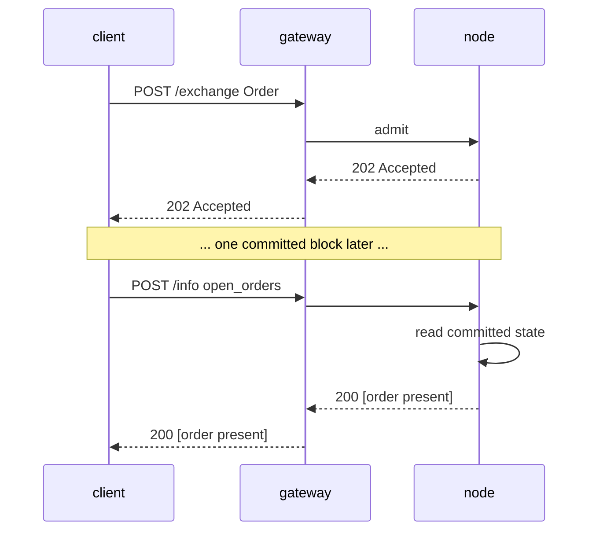

# `POST /info` — read & query endpoint

:::info
**Status.** **stable** shape. Query types are added over time; the envelope is committed.
:::

## TL;DR {#tldr}

Single endpoint, multi-type. Dispatches on the request body's `type` field. Read-only — never mutates state, never requires a signature.

:::tip
**Split by product.** Perp-market read queries are on [perpetual queries](./info/perpetuals.md); spot, spot-margin, and Earn read queries are on [spot & margin queries](./info/spot.md); closed-position lifecycle queries are on [position history](./info/position-history.md); governance queries are on [governance queries](./info/governance.md). This page covers the envelope, conventions, and account/vault/validator reads.
:::

## URL {#url}

```
POST  https://api.<net>.mtf.exchange/info
```

| Path | Wire shape |
|------|-----------|
| `POST /info` (gateway) | MTF-native (this document) |

The gateway serves the MTF-native `/info`. Running the node yourself, the same
native `/info` is served directly at `http://localhost:8080`.

## Envelope {#envelope}

Every `/info` response is one envelope. A success carries `data`. A failure
carries `error`. The two keys never appear together.

**Request**

```json
{ "type": "<query_type>", /* type-specific args */ }
```

**Success** — `200 OK`. The `type` discriminator is echoed INSIDE `data`:

```json
{
  "data": {
    "type": "<query_type>",
    /* type-specific payload */
  }
}
```

The payload fields keep their old path. A field you read at `body.data.fills`
before is still at `body.data.fills`. Only `type` moved: it was a sibling of
`data`, and it is now the first key of `data`.

**The history-archive reads are the exception: they still answer with `type` at
the TOP level.** Read `body.data.type ?? body.type` if you need it, and see
[the archive lane](#archive-lane) below.

A success has **no** `error` key. Do not test `error === null` — test whether
the key is present.

**A `data` of `null` is a SUCCESS.** A read can succeed with no content. That
answers `{"data": null}` with status `200`. Treat it as an empty result, not as
a failure.

**Failure** — no `data` key, and the HTTP status that the code maps to:

```json
{
  "error": {
    "code":    "UNKNOWN_TYPE",
    "message": "unknown info type: markest"
  }
}
```

| Field | Presence | Meaning |
|-------|----------|---------|
| `code` | always | The stable contract. **Match on this.** |
| `message` | always | Prose for a human. It can change in any release. **Never match on it.** |
| `details` | optional | The bound the request broke: `{"field","limit","actual"}`. It is **omitted** when the rejection carries no bound — never sent as `{}` |

The HTTP status keeps its normal meaning. One code always answers with one
status. Every code, its status, and the caller action for it are in the
[error reference](../errors.md).

Two common `/info` failures: an unknown `type` answers `400` with
`UNKNOWN_TYPE`; an unknown named resource, such as a vault id, answers `404`
with `NOT_FOUND`.

#### The history-archive reads answer in the OLD envelope {#archive-lane}

This is live behavior today, not a target state. A group of reads is served by
the history archive rather than by the node, and the archive was not migrated
to the envelope above. **It differs in two ways at once.**

The lane is `portfolio`, `historical_orders`, `user_funding`,
`user_funding_by_time`, `user_position_history`,
`user_position_history_by_time`, `user_non_funding_ledger_updates`,
[`recent_blocks`](#recent_blocks),
[`recent_transactions`](#recent_transactions) and `validator_votes`.

`portfolio` takes an `interval` alongside `address`, and it accepts exactly one
value: **`1d`**. Any other value is rejected `400 invalid interval: <value>`,
and the rejection now names `1d`.

**Difference 1 — `type` sits at the top level, beside `data`, not inside it.**

```json
{ "data": { "address": "0x<addr>", "fundings": [] }, "type": "user_funding" }
```

`body.data.type` is `undefined` on every read in this lane. Every other `/info`
read carries `type` inside `data`.

**Difference 2 — a rejection puts a bare STRING in `error`,** not the
`{code, message}` object. This applies to the reads in the lane that take an
`address`. Two strings occur, both with status `400`:

| String | Cause |
|--------|-------|
| `missing field: address` | The request carries no `address` |
| `invalid user address: <value>` | `address` is present but does not parse |

**A handler that branches on `error.code` reads `undefined` on this lane.**
Test the type of `error` before you read `code`.

**The collection key, per read.** The rows sit under a key named for what they
are, not under a generic `data[]`. Every key is snake_case, like the rest of
this wire:

| Read | Collection key |
|---|---|
| `historical_orders` | `orders` |
| `user_funding`, `user_funding_by_time` | `fundings` |
| `user_position_history`, `..._by_time` | `positions` |
| `user_non_funding_ledger_updates` | `ledger_updates` |
| `recent_transactions` | `txns` |
| `portfolio` | `points` |

> ⚠️ **`ledger_updates` was `ledgerUpdates`.** It was the one camelCase key on
> this wire. A client reading `data.ledgerUpdates` now gets `undefined` — read
> `data.ledger_updates`.

> ⚠️ **`user_ledger` and `user_ledger_by_time` are REMOVED.** Both were narrower
> views of the same source that `user_non_funding_ledger_updates` already
> serves, and its name states what it holds where theirs did not.

**What `user_non_funding_ledger_updates` means.** Every NON-TRADING movement of
an account's money, and nothing else. Funding is excluded because it has its own
read, [`user_funding`](#user_funding); a fill's realized PnL is excluded because
it is trading, and it already has [`user_fills`](#user_fills).

In scope: deposits, withdrawals, transfers between accounts and sub-accounts,
staking (moving MTF in and out of the staking balance, delegating, and CLAIMING
REWARDS), Earn, and vault deposits and withdrawals.

> ⚠️ **The read does not cover all of that yet, and it says so.** The node emits
> ledger events for bridge credits, withdrawals, transfers and forced-close
> settlements only — four kinds. Staking, Earn and vault movements produce no
> ledger event at all today, so they are absent from this read. A claimed
> staking reward credits the spot MTF balance and leaves NO record here. The
> `flag` field on every response names the gap. Do not read an empty result as
> "no money moved".

Membership of this lane is a deployment fact, not a wire guarantee. Do not
hard-code the list; write one handler that tolerates both shapes.

#### A malformed request body answers with no `error` key at all {#malformed-request}

The two shapes above both reject a request the server could read. A request the
server cannot even parse is refused earlier, and that answer carries **no
`error` key**. Two forms occur, on every read alike:

| Body | Status | Cause |
|------|--------|-------|
| A bare JSON **string**, such as `"Failed to deserialize the JSON body into the target type: ..."` | `422` | Valid JSON, but a field holds the wrong type — for example `limit` as a string |
| **Plain text**, such as `Failed to parse the request body as JSON: ...` | `400` | The body is not valid JSON |

Both messages are prose for a human and can change in any release. Never match
on them. Parse the body only after you check the status, and treat any `4xx`
whose body has no `error` object as a bug in your own request.

Not every wrong type is refused. A field the read treats as optional, such as
`detail` on [`account_state`](#account_state), falls back to its default rather
than failing. Only a field with a declared numeric or typed binding rejects.

#### Empty is not the same as absent {#empty-vs-absent}

A read that answers nothing and a request that asks the wrong question look
alike inside a client. The first is a fact about the account. The second is a
bug in your code. Three cases produce a plausible-looking zero — rule each one
out before you report a holding as missing.

**1. You sent a retired type name.** A name this API no longer serves NEVER
answers with an empty body. It answers `UNKNOWN_TYPE`, in one of two forms:

| What you sent | Status | Body |
|---|---|---|
| `spot_clearinghouse_state`, `oracle_sources`, `sub_accounts`, and every other name in [removed reads](#retired-reads) that is not in the row below | `400` | `{"error":{"code":"UNKNOWN_TYPE","message":"unknown info type: <name>"}}` — no `details` |
| `account_overview`, `action_outcome`, `bridge_chain_configs`, `bridge_user_outbox`, `encode_action`, `evm_contract_bindings`, `gov_history`, `gov_proposals`, `gov_state`, `pm_summary` | `410` | the same `code`, plus `details.use` naming the read to call instead |

So a `200` carrying an empty array IS an answer about a real account. A client
that shows "no balances" after calling `spot_clearinghouse_state` swallowed a
`4xx`. **Check the status before you read the body.**

**2. You read a key that is not there.** An absent key reads as `undefined`, and
`undefined` renders as empty almost everywhere. The spot ledger is the one that
catches people. It lives at **`data.spot.balances`**. There is no `balances` and
no `spot_balances` at the top level of an
[`account_state`](#account_state) body; both paths read as "this account holds
nothing", and both are wrong. Every field that moved is listed in
[where every field went](#account-state-lane-split).

**3. The read's source is not deployed on the endpoint you called.** The
[archive-lane](#archive-lane) reads answer with a typed empty body —
`{"orders":[]}`, `{"fundings":[]}` — when no history archive is configured
behind that endpoint. On the wire that is identical to an account with no
history. The public endpoints run the archive, so this is a self-hosted concern.

**The one-line control.** Send the same request with a `type` you KNOW is wrong,
such as `"type":"nope"`. If your client reports the same empty result it
reported before, it is hiding the error, not reading an empty account.

## Query types {#query-types}

### Per-account collateral and margin health {#account_state}

One account, one snapshot: the cross-account money figures at the top level, then
one summary per **lane** — `perp`, `spot`, `margin`, `option`.

:::info The lane split is live
A live node answers the lane shape on this page now. The top level no longer
carries `maint_margin` or `mode`. `position_mode` replaces `mode`, and
`cross_maintenance_margin_used` is served only at `detail: "margin"`. The perp
position table moved to [`clearinghouse_state`](#clearinghouse_state) and the
option legs to [`option_state`](#option_state). Read
[where every field went](#account-state-lane-split) if you are moving a client
off the old flat shape.
:::

**The rule behind the shape.** `account_state` answers one question: what the
account is worth, and how close it is to liquidation. Every figure in it is
rendered from one committed block, so the set is internally consistent. Position
DETAIL is a different question, so it has its own read —
[`clearinghouse_state`](#clearinghouse_state) for perp legs,
[`option_state`](#option_state) for option legs.

:::danger
**Do not join two frames to compute one number.** A summary and a detail frame
can be rendered a commit apart, so a health figure built from both was never true
at any single block. Every frame carries `height`; compare it before you combine
anything. If you need one consistent set, take it from `account_state` alone —
each lane summary is WHOLE inside that one body for exactly this reason.
:::

**Request**

```json
{ "type": "account_state", "address": "0x<addr>" }
```

| Arg | Type | Required | Meaning |
|-----|------|----------|-------------|
| `address` | hex address | yes | Account address |
| `detail` | `"full"` \| `"margin"` \| `"overview"` | no | Response depth. Absent ⇒ `"full"` |

**`detail: "adl"` is REFUSED**, with `400` / `INVALID_REQUEST`. The body carries
no position rows to widen. The rejection message names
[`clearinghouse_state`](#clearinghouse_state), which takes the same `detail`.

**Response** (a faucet-funded account, no positions):

```json
{
  "data": {
    "type": "account_state",
    "address":        "0x00000000000000000000000000000000000ca11e",
    "account_value":  "3000",
    "total_raw_usd":  "3000",
    "withdrawable":   "3000",
    "health":         "3000",
    "tier":           "Safe",
    "abstraction":    "unified",
    "pm_net_value":   "0",
    "perp": {
      "init_margin":              "0",
      "total_ntl_pos":            "0",
      "pm_maint_margin":          "0",
      "pm_concentration_penalty": "0"
    },
    "spot": {
      "balances": [
        { "name": "USDC", "signing_id": 100, "total": "3000", "hold": "0", "avg_entry_px": null }
      ]
    },
    "margin": { "collateral": "0", "debt": "0", "pairs": 0 },
    "option": { "escrow": "0", "legs": 0 },
    "position_mode": "one_way",
    "height": 562,
    "time":   1700000000555
  }
}
```

An **unknown address** (never seen on-chain) returns **200** with this zeroed
record, NOT a `404`.

#### Where every field went {#account-state-lane-split}

A working client finds its field here. `account_state` is the only read that
moved; every field still exists somewhere.

| Was, at the top level | Is now | Note |
|---|---|---|
| `address` | `address` | unchanged |
| `height`, `time` | `height`, `time` | unchanged, and on **every** frame of both new reads too |
| `abstraction` | `abstraction` | unchanged — an ACCOUNT setting, not a lane |
| `position_mode` | `position_mode` | unchanged — an ACCOUNT setting, not a lane |
| `account_value` | `account_value` | unchanged — folds perp AND spot-margin unrealised PnL |
| `total_raw_usd` | `total_raw_usd` | unchanged |
| `withdrawable` | `withdrawable` | unchanged — subtracts BOTH lanes' held initial margin |
| `health` | `health` | unchanged — derives from `account_value` |
| `tier` | `tier` | unchanged — derives from `health` |
| `health_deferred` | `health_deferred` | unchanged, still present only when `true` |
| `pm_net_value` | `pm_net_value` | **unchanged — it stays at the top level.** See the warning below |
| `total_margin_used` | `perp.init_margin` | **renamed as well as moved.** The name `total_margin_used` survives only on `detail: "margin"` |
| `total_ntl_pos` | `perp.total_ntl_pos` | |
| `pm_maint_margin` | `perp.pm_maint_margin` | |
| `pm_concentration_penalty` | `perp.pm_concentration_penalty` | |
| `balances` | `spot.balances` | the ROWS are unchanged, field for field |
| `clearinghouse_state` | its own read: [`clearinghouse_state`](#clearinghouse_state) | same wire name, same row shape. Also a WS channel |
| `cross_maintenance_margin_used` | `detail: "margin"` only | it was already only on that depth, and it stays there |

Two more names moved outside this body:

- `option_positions` is renamed [`option_state`](#option_state). The old name
  answers `unknown info type`; it is not an alias.
- `detail: "adl"` moves from `account_state` to
  [`clearinghouse_state`](#clearinghouse_state).

:::warning
**`pm_net_value` is NOT under `perp`, and that is deliberate.** Its cash term is
the whole unified USDC pool, and under multi-collateral it also folds
haircut-valued spot balances. It is the portfolio-margin twin of `account_value`,
so a client that sums the lanes would count the same USDC twice. The other three
`pm_*` figures ARE perp-scoped and do sit under `perp`.
:::

**There is no transition window.** One builder serves one shape. The old flat
names are not merely dropped — they are refused at the top level, so a
half-migrated body cannot ship.

#### Every lane key is always present {#account-state-lanes}

`perp`, `spot`, `margin` and `option` are **always** in the body, zeroed when the
lane is empty. A client never has to test for a missing lane key. Per lane, an
account with nothing in it reads:

| Lane | Empty-account value |
|---|---|
| `perp` | `{"init_margin":"0","total_ntl_pos":"0","pm_maint_margin":"0","pm_concentration_penalty":"0"}` |
| `spot` | `{"balances":[ <the USDC row, all zeros> ]}` — **never an empty array** |
| `margin` | `{"collateral":"0","debt":"0","pairs":0}` |
| `option` | `{"escrow":"0","legs":0}` — `next_expiry` is **absent** |

Two shapes to code against:

- **`spot.balances` is never `[]`.** The USDC row is unconditional, even for an
  account that has never been funded. An empty array is a shape no real account
  returns — if you see one, you are reading a placeholder, not an account. Check
  the `height` stamp: a placeholder stamps `0`.
- **`option.next_expiry` is absent when `legs` is `0`.** It is the one
  non-uniform key in the body. A zero timestamp would read as 1970, so the key is
  omitted instead of zeroed. Test `legs > 0`, or test for the key.

#### The two depths do not carry the same names {#account-state-detail-margin}

`detail: "margin"` answers with the **margin scalars only** — `address`,
`account_value`, `total_raw_usd`, `withdrawable`, `total_margin_used`,
`cross_maintenance_margin_used`, `health`, `tier`, `abstraction`, plus
`health_deferred` when true and the `height` / `time` stamp. It skips the
position walk and the balance scan, so it is the right call for a frequent
liquidation-health poll (a risk-watcher bot, an automated margin top-up). Both
depths compute the scalars with one shared helper, so the numbers can never
disagree.

```json
{
  "data": {
    "type": "account_state",
    "address":                       "0x00000000000000000000000000000000000ca11e",
    "account_value":                 "3000",
    "total_raw_usd":                 "3000",
    "withdrawable":                  "3000",
    "total_margin_used":             "0",
    "cross_maintenance_margin_used": "0",
    "health":                        "3000",
    "tier":                          "Safe",
    "abstraction":                   "unified",
    "height": 562,
    "time":   1700000000555
  }
}
```

:::caution
**The held initial margin has two names, one per depth.** `detail: "margin"`
calls it `total_margin_used` at the top level. The full depth calls it
`init_margin` and files it under `perp`. Same number, same helper — two names.
Read the one your depth serves; neither depth serves the other's name.
:::

The rest of the two depths differ in both directions:

- **`cross_maintenance_margin_used` is served only at `detail: "margin"`.** The
  full depth carries the per-leg `maint_margin` on each
  [`clearinghouse_state`](#clearinghouse_state) position row instead. The two are
  different quantities — one is the account aggregate, one is a single leg's
  contribution.
- **`perp.total_ntl_pos` is served only at the full depth.** It is a sum over the
  position walk, and `detail: "margin"` is defined by skipping that walk.

`detail: "overview"` answers the account's **non-trading** state instead — vaults,
staking, sub-accounts, multisig, agents and the derived role. One account has one
state, so it has one read; `detail` chooses which half of that state you want.
`"full"` and `"margin"` both answer the trading half — `margin` is the scalar-only
subset of it — while `"overview"` answers the other half. The only fields all
three share are `address` and the `height` / `time` stamp. See
[`detail: "overview"`](#account_state-overview) below.

#### Field reference {#account-state-fields}

**Top level — the cross-account figures.**

| Field | Type | Meaning |
|-------|------|-------------|
| `address` | hex address | The account this body describes |
| `account_value` | Decimal string | Equity incl. settled PnL, **whole-USDC plane** (`"3000"` = 3000 USDC, NOT base units). Cross-lane: it folds perp AND spot-margin unrealised PnL over the one unified pool |
| `total_raw_usd` | Decimal string | **Settled cash equity**, whole-USDC. Realized USDC only — deposits, closed-position PnL, fees already paid. It **excludes unrealised PnL**, which is the one difference from `account_value`. It is the `settled cash` term the `withdrawable` formula starts from, so a caller can reconcile that formula from the read alone |
| `withdrawable` | Decimal string | Cash you can take out, **clamped at zero**. `total_raw_usd` minus funding you owe minus held initial margin — **both lanes' held margin**, not the perp lane's alone. It does NOT count unrealised profit, so a healthy account funded by open profit reads `"0"` — see [account value](../../concepts/account-value.md#withdrawable). The admission gate uses the raw signed figure, which can be negative; the read never is |
| `health` | Decimal string | `account_value − cross_maintenance_margin_used` (signed dollar figure; can be negative) — **not a ratio** |
| `health_deferred` | `true` \| absent | Present, and only ever `true`, when the risk engine cannot price a leg. **The risk numbers are then not a solvency statement** — see [account value](../../concepts/account-value.md). Absent is the normal case; treat absent as `false` |
| `tier` | enum **string** | `"Safe"`, `"T0"`, `"T1"`, `"T2"`, `"T3"` (BOLE band of `account_value / cross_maintenance_margin_used`; `"Safe"` when no maintenance margin) — see [tiered liquidation](../../concepts/tiered-liquidation.md). It is a STRING, never a number |
| `abstraction` | enum | `"unified"` (default cross-collateral account), `"standard"` (per-product reservations — see [`user_set_abstraction`](../rest/exchange.md#user_set_abstraction)) or `"portfolio"` (portfolio-margin enrolled). Derive PM enrolment as `abstraction == "portfolio"`. A caller that switches on this field must handle all three values |
| `pm_net_value` | Decimal string | PM engine's net scenario value, whole-USDC; `"0"` when not PM-enrolled. **Account-scoped, so it is NOT under `perp`** — see the warning above |
| `position_mode` | enum | `"one_way"` (single net position per asset) or `"hedge"` (separate long/short legs) — see [hedge mode](../../concepts/hedge-mode.md) |
| `height` | uint64 | Committed block height this snapshot reflects. A **bare integer**, not a Decimal string. Advances on **every** commit, even when nothing else in the record changed |
| `time` | uint64 | Consensus block time in **milliseconds**. A **bare integer**. Advances on every commit, from the same consensus clock as `height` |

**`perp` — the perp lane summary.** Always present. It holds no position rows;
read [`clearinghouse_state`](#clearinghouse_state) for those.

| Field | Type | Meaning |
|-------|------|-------------|
| `perp.init_margin` | Decimal string | Held initial-margin requirement, whole-USDC. Called `total_margin_used` on `detail: "margin"` |
| `perp.total_ntl_pos` | Decimal string | Mark notional of the account's **CROSS** perp positions, summed: `Σ \|real size\| × mark_px`, whole-USDC, unsigned. **Isolated legs are excluded** — they are margined and liquidated on their own. Equal to the sum of `notional` over every `clearinghouse_state` position row whose `isolated` is `false`. Full depth only |
| `perp.pm_maint_margin` | Decimal string | PM engine's maintenance requirement, whole-USDC; `"0"` when not PM-enrolled |
| `perp.pm_concentration_penalty` | Decimal string | PM single-asset concentration penalty, whole-USDC; `"0"` when not PM-enrolled |

The three `pm_*` figures are always present and are **meaningful only when
`abstraction` is `"portfolio"`** — see [portfolio margin](../../concepts/portfolio-margin.md).

**`spot` — the spot lane summary.** Always present.

| Field | Type | Meaning |
|-------|------|-------------|
| `spot.balances` | array | The **whole** spot token ledger, one row per token held. Never empty: row 0 is USDC unconditionally |
| `spot.balances[*].name` | string | Token symbol (`"USDC"` for row 0). Rows are keyed and joined by `name` |
| `spot.balances[*].signing_id` | uint32 | The number you place in the `asset` field of a signed [`send_asset`](../rest/exchange.md#send_asset), and in `asset` of an `earn_deposit`. `100` for USDC. It has no other meaning on the read plane. **Not `spot_send`** — no such action exists; that name is a [ledger record kind](../ws/subscriptions.md#ledger_updates) |
| `spot.balances[*].total` | Decimal string | The **whole** holding of that token, escrow included. **Not** the spendable amount — perp margin sits inside it too. Use `withdrawable` |
| `spot.balances[*].hold` | Decimal string | Amount locked behind a resting spot order (escrow). **A part OF `total`, not a second bucket beside it** — never add the two. Spot escrow only; it never holds perp margin |
| `spot.balances[*].avg_entry_px` | Decimal string \| null | Average cost basis for the token; `null` when there is none (always `null` on the USDC row — USDC is the quote asset). See [cost basis](#avg-entry-px) |

**A spot balance IS the spot position**, so nothing split off the way the perp
positions did. This lane answers the spot-balance question in full; there is no
separate spot-balance read.

:::warning
**`total − hold` is NOT the spendable amount.** `hold` counts spot order escrow
only. USDC that margins an open PERPETUAL position stays in `total` and never
enters `hold`, so `total − hold` overstates the budget for every position holder.
The chain admits a spot buy against **free collateral** (equity minus held
initial margin), and refuses an order that only `total − hold` allows.

Read `withdrawable` for the spendable USDC figure — it is the same free-collateral
number the admission gate uses, clamped at zero. See
[account value](../../concepts/account-value.md#balances-and-hold) for the rule
and a worked example.
:::

**`margin` — the spot-margin lane summary.** Always present. The per-pair detail
is [`spot_margin_state`](./info/spot.md#spot_margin_state).

| Field | Type | Meaning |
|-------|------|-------------|
| `margin.collateral` | Decimal string | **Vestigial, and reads `"0"`.** Spot margin is cross-collateralized against the one unified USDC account, so there is no per-pair collateral bucket to sum. It is the sum of the equally vestigial per-pair [`spot_margin_state`](./info/spot.md#spot_margin_state) `collateral` field, kept for wire-shape compatibility |
| `margin.debt` | Decimal string | Borrowed principal **accrued to now**, summed across pairs, whole-USDC. It uses the same accrual the `spot_margin_state` rows report, so the summary can never disagree with the detail |
| `margin.pairs` | uint32 | Number of open spot-margin pairs. A **bare integer**, not a Decimal string |

`debt` adds up across pairs because the quote asset of every spot pair is USDC by
construction. **`base_held` is deliberately not folded in**: it is per-pair BASE
units with no common unit, and turning it into a notional needs a mark this read
must not fetch. Read `spot_margin_state` for it.

**`option` — the option lane summary.** Always present. The per-leg detail is
[`option_state`](#option_state).

| Field | Type | Meaning |
|-------|------|-------------|
| `option.escrow` | Decimal string | Total USDC this account has locked as a **writer** on PUT legs, whole-USDC. What it takes back if every put it wrote settles worthless |
| `option.legs` | uint32 | Number of series the account is party to, **puts and calls alike**. A **bare integer** |
| `option.next_expiry` | uint64 \| **absent** | Nearest expiry among those legs, consensus ms. **Absent when `legs` is `0`** — a zero timestamp reads as 1970 |

:::warning `option.escrow` counts PUT legs only
A [call](../../products/options.md#why-a-call-escrows-one-coin) escrows **one
coin** per unit, not dollars. `option.escrow` is one USDC number, so adding a call
leg would sum coins into dollars. Call legs are therefore left out of the sum,
while `legs` still counts them.

So `escrow` can read `"0"` on an account with several written calls. That is not a
bug and it is not an unencumbered account: the coin escrow already left the
writer's spot balance. Read
[`option_state`](#option_state) for the per-series amounts and their
`settle_asset`.
:::

The chain never prices an option, so this lane carries no mark-priced figure. See
[options](../../products/options.md).

#### The as-of stamp {#account-state-as-of}

`height` / `time` tell you which committed block the snapshot was rendered
against, and they advance on every commit regardless of whether any monetary
field moved. This lets a client tell a **fresh-but-quiet** account (constant
`account_value`, but `height` / `time` still climbing) apart from a **stalled**
read path (`height` / `time` frozen — the node or your connection has stopped
advancing). The same stamp appears on the WS
[`account_state`](../ws/subscriptions.md#account_state) channel with identical
values, so a client can cross-check or de-duplicate REST and WS against it.

It is also how you check that a detail frame belongs with a summary frame: equal
`height` means one commit, and only then do the two describe the same instant.

#### Cost basis and spot PnL {#avg-entry-px}

:::caution
**Treat a missing key exactly like `null`** — no basis known. An older node
serves `spot.balances` rows carrying `name`, `total` and `hold` only.
:::

`avg_entry_px` is what the account paid, per token, for what it holds. It is the
one input spot PnL needs:

```
unrealized_spot_pnl = (mark_px − avg_entry_px) × total
```

It is a PRICE and not a total on purpose. `total` includes the part locked behind
resting orders (`hold`), so a server-computed notional would have to choose which
quantity to multiply by, and you could not see which it chose. Multiply by the
quantity YOU mean.

**The rule behind it — basis is recorded on spot BUYS only.**

- A spot **buy** rolls the weighted average acquisition cost forward.
- A spot **sell** reduces the balance but **keeps the per-unit average
  unchanged**. Selling does not re-price what remains.
- **Deposits record no basis.** Tokens that arrive by bridge deposit, by a
  Core↔EVM credit, by a spot transfer from another account, or by a governance
  adjustment were not bought on this chain, so there is no price to record.

**Consequences to code against:**

- A holding acquired **entirely** by deposit or transfer has **`avg_entry_px:
  null`**. It is never `"0"`. A zero would claim the tokens were free and make
  the whole balance look like profit; `null` says plainly that the basis is not
  known. This matches the `null`-over-wrong-but-plausible rule used by the
  [position history](./info/position-history.md#honesty-flags) completeness flags.
- A holding **partly** bought and partly transferred in prices the transferred
  tokens at the standing average, because the transfer wrote no basis of its own.
  `avg_entry_px` is then a real number, but it covers the bought portion's price
  applied across the whole balance.
- Do not render a PnL figure when `avg_entry_px` is `null`. Render "—" instead. A
  PnL computed against a null basis is not a small error; it is the entire
  notional reported as gain.

**Perp positions are unaffected.** They carry their own `entry` price on the
[`clearinghouse_state`](#clearinghouse_state) rows; `avg_entry_px` is the spot
ledger's equivalent.

:::info
**No basis on the USDC row.** USDC is the quote asset — its cost basis in USDC
is meaningless — so `spot.balances[0].avg_entry_px` is always `null`. See
[USDC unification](../../concepts/usdc.md).
:::


#### `detail: "overview"` — everything that is not trading {#account_state-overview}

The account's full **non-trading** state: vaults, staking, sub-accounts,
multisig, agent wallets, and the derived role. The default depth owns the
account's collateral and margin health. This depth owns everything else.

The facets in this depth change rarely — a vault deposit, a delegation, an
agent approval — unlike margin and positions, which change every commit. Ask
for this depth when you render an account page, approve an agent, or list
sub-accounts. Do not ask for it in a poll loop; use the default depth there.

**The WS [`account_state`](../ws/subscriptions.md#account_state) channel pushes
the DEFAULT depth only.** A depth is a REST parameter. Read this depth over REST
when you need it.

```json
{ "type": "account_state", "address": "0x<addr>", "detail": "overview" }
```

An **unknown address** answers **200** with every sub-object honest-empty, NOT a
`404` — the same rule the default depth follows.

**Response**

```json
{
  "data": {
    "type": "account_state",
    "address": "0x<addr>",
    "role":    "user",
    "vault": {
      "equities": [
        { "vault_id": 7, "vault_address": "0x<vault>", "shares": "1", "equity": "5000000000" }
      ],
      "vaults": [ /* a <vault_state> body per vault this account follows or leads */ ]
    },
    "staking": {
      "state":   { /* a <staking_state> body, minus the repeated address */ },
      "summary": {
        "undelegated":        "250",
        "total_delegated":    "500",
        "pending_withdrawal": "50",
        "claimable_rewards":  "7",
        "n_delegations":      2
      }
    },
    "sub_accounts": [
      { "index": 0, "address": "0x<sub_addr>", "equity": "2500" }
    ],
    "multisig": { "is_multi_sig": true, "threshold": 2, "signers": ["0x…", "0x…"] },
    "agents": [
      { "agent": "0x<agent_addr>", "name": "trading-bot", "expires_at_ms": 1700000500000 }
    ],
    "height": 562,
    "time":   1700000000555
  }
}
```

| Field | Type | Meaning |
|-------|------|-------------|
| `address` | hex address | Resolved account address. Carried ONCE at the top — no sub-object repeats it |
| `role` | `"missing" \| "user" \| "agent" \| "vault" \| "sub_account"` | Derived role. Precedence: `vault` (the address is a vault) → `sub_account` → `agent` (an approved agent of some master) → `user` (has account, config or spot state) → `missing` |
| `vault.equities[*].vault_id` | uint64 | Vault id |
| `vault.equities[*].vault_address` | hex address | Vault address |
| `vault.equities[*].shares` | Decimal string | The account's share count in **WHOLE shares**, not the raw 10¹⁸ integer. Send this exact string back to [`vault_withdraw`](./exchange.md#vault_withdraw) — read and write use one plane |
| `vault.equities[*].equity` | Decimal string | `shares × share_price`, truncated — whole-USDC. Share price is mark-to-market NAV per share, so this is what a redemption pays now, not a high-water-mark figure |
| `vault.vaults[*]` | object | One [`vault_state`](#vault_state) body per vault the account **follows or leads**, field-identical to that read. A leader with no deposit still gets a row |
| `staking.state` | object | A [`staking_state`](#staking_state) body for this account, minus the repeated `address` |
| `staking.summary.undelegated` | Decimal string | The free staking pool: MTF moved in with [`c_deposit`](./exchange.md#c_deposit) and **not yet delegated** (whole-MTF) |
| `staking.summary.total_delegated` | Decimal string | Sum of active delegations (whole-MTF) |
| `staking.summary.pending_withdrawal` | Decimal string | Sum of pending undelegations (whole-MTF) |
| `staking.summary.claimable_rewards` | Decimal string | Accumulated delegator rewards (whole-MTF) |
| `staking.summary.n_delegations` | uint64 | Number of active delegations |
| `sub_accounts[*].index` | uint32 | Sub-account index under this parent |
| `sub_accounts[*].address` | hex address | Sub-account address |
| `sub_accounts[*].equity` | Decimal string | The sub-account's mark-to-market equity, whole-USDC — the same figure its own `account_state.account_value` reports |
| `multisig.is_multi_sig` | bool | Whether the account is multisig |
| `multisig.threshold` | uint32 | M-of-N threshold; `0` if not multisig |
| `multisig.signers` | hex address[] | Signer set; empty if not multisig |
| `agents[*].agent` | hex address | Approved agent / API wallet address |
| `agents[*].name` | string \| null | Agent label set at approval time; `null` if unset |
| `agents[*].expires_at_ms` | uint64 \| null | Approval expiry (consensus ms); `null` for a never-expiring approval |
| `height` / `time` | uint64 | Committed block this snapshot was rendered against — the same as-of stamp the default depth carries |

**The three staking balances are disjoint — add them for the whole holding.**
`staking.summary.undelegated`, `total_delegated` and `pending_withdrawal` never
overlap. A screen that shows `total_delegated` alone shows the user less than
they hold. `undelegated` is the figure a delegate form needs: `token_delegate`
draws from it, so an amount above it is refused.

**`sub_accounts[*].equity` counts unrealised PnL.** A sub-account deep in loss
reads DOWN here, not at its settled cash, so a parent scanning this list sees the
one that is near liquidation.

**Shares are WHOLE shares on both read and write.** Committed state keeps shares
as a raw integer on a 10¹⁸ scale; this depth divides by 10¹⁸ before it answers.
Do **not** multiply `shares` by 10¹⁸. The division truncates **toward zero**, so
the string a holder reads back is never larger than the shares they hold — a
holder can under-ask, never over-burn.

**Every sub-object is honest-empty, never absent.** An account with no vaults,
no stake, no sub-accounts, no multisig and no agents still answers with all six
keys present and each one empty or zeroed.

### The account's perp positions {#clearinghouse_state}

The perp position DETAIL for one account, keyed by dex. This is the table that
used to sit inside `account_state`; the row shape is unchanged.

:::info Live
This read and its WS channel are live. The response is keyed by dex, and
`detail: "adl"` widens the rows. The row shape is the one
[`account_state`](#account_state) used to carry.
:::

**Request**

```json
{ "type": "clearinghouse_state", "address": "0x<addr>" }
```

| Arg | Type | Required | Meaning |
|-----|------|----------|-------------|
| `address` | hex address | yes | Account address |
| `detail` | `"adl"` | no | Widen every row with `adl_lamps`. See [`detail: "adl"`](#account_state-adl) |

**Response**

```json
{
  "data": {
    "type": "clearinghouse_state",
    "address": "0x00000000000000000000000000000000000ca11e",
    "clearinghouse_state": {
      "": {
        "positions": [
          {
            "coin":         "BTC",
            "size":         "1.00000",
            "entry":        "67000.00",
            "upnl":         "5.00",
            "isolated":     false,
            "lev":          10,
            "liq":          "61000.00",
            "roe":          "0.0075",
            "funding":      "-0.12",
            "margin":       "201.00",
            "maint_margin": "670.00",
            "notional":     "6705.00"
          }
        ]
      }
    },
    "height": 562,
    "time":   1700000000555
  }
}
```

An **unknown address** returns **200** with `{"": {"positions": []}}`, NOT a
`404`. The core-dex key `""` is **always present**, even for an account with no
positions, so a client can index it without a guard.

| Field | Type | Meaning |
|-------|------|-------------|
| `address` | hex address | The account these positions belong to |
| `clearinghouse_state` | object | Keyed by dex NAME (`""` = core dex, else a deployed dex's name, e.g. `"GRAD"`); each value is `{positions: [...]}`. See [the dex key](#dex-key) |
| `positions[*].coin` | string | Market symbol (e.g. `"BTC"`), not a numeric id |
| `positions[*].size` | Decimal string | Signed **real** size (`raw lots / 10^sz_decimals`); negative = short |
| `positions[*].entry` | Decimal string | Per-whole-unit entry price = `\|entry_notional\| / \|real size\|`, **whole-USDC plane** |
| `positions[*].upnl` | Decimal string | Mark-to-market PnL = `real size × mark − signed entry_notional`, **whole-USDC plane** (signed) |
| `positions[*].isolated` | bool | `true` unless the position is cross-margined |
| `positions[*].lev` | uint8 | Position's chosen leverage |
| `positions[*].liq` | Decimal string \| null | Mark price (whole-USDC) at which this leg reaches maintenance. **Solved on the leg's own margin plane**: a cross leg against the cross account, an isolated leg against its posted `isolated_margin` alone. `null` when no non-negative price breaches maintenance, and when size is zero — see below |
| `positions[*].roe` | Decimal string | `upnl / initial_margin` as a decimal fraction; `"0"` at zero leverage / notional |
| `positions[*].funding` | Decimal string | Accrued-but-unsettled funding for **this leg**, **whole-USDC** (signed; negative = you owe). Includes the accrual built up since the last funding charge, so it stays non-zero between funding periods — the same accrual `account_value` and `withdrawable` already fold in |
| `positions[*].margin` | Decimal string | This leg's INITIAL margin, **whole-USDC** |
| `positions[*].maint_margin` | Decimal string | This leg's maintenance-margin contribution, **whole-USDC**: `\|entry_notional\| × maint_margin_ratio` |
| `positions[*].notional` | Decimal string | Position notional at mark, **whole-USDC** (signed): `real_size × mark_px` |
| `positions[*].side` | enum \| absent | **[Hedge mode](../../concepts/hedge-mode.md) only** — `"long"` / `"short"`, the leg this object reports. **Omitted on a one-way account** (a single *net* position whose `size` may be negative). A hedge account holding both legs on one asset returns **two** objects, one per side |
| `positions[*].adl_lamps` | uint8 \| absent | **`detail: "adl"` only** — the ADL queue indicator, `0` to `4`. More lamps = sooner deleveraged. Omitted otherwise, and always omitted on the WS frame. See [`detail: "adl"`](#account_state-adl) |
| `height` | uint64 | Committed block height this snapshot reflects. A **bare integer** |
| `time` | uint64 | Consensus block time in **milliseconds**. A **bare integer** |

:::danger
**This read carries no account figures, on purpose.** There is no
`account_value`, no `withdrawable`, no `health`, no `balances` here. Read those
from [`account_state`](#account_state), and do not compute an account-level
number by combining the two frames — they can be rendered a commit apart. Compare
the `height` of both frames before you treat them as one instant.
:::

#### The dex key is the dex NAME {#dex-key}

:::warning Not live yet
The dex key changes from the deployer's address to the dex NAME with the next
network upgrade. Until that upgrade fires, a live node still keys every non-core
bucket by the deployer's lowercase `0x` address. There is no window in which both
forms answer. A client that reads the key opaquely and joins it to
[`perp_dexs`](./info/perpetuals.md#perp_dexs) survives the change; a client that
parses the key as an address does not.
:::

The map key is the **dex name**. `""` is the core dex and is always present.
Every other key is the name of one deployed perp dex.

A dex name is 1 to 16 ASCII alphanumeric bytes. Names are unique without regard
to case, so `grad` cannot exist while `GRAD` does. A name is set when the dex is
created, and it never changes — there is no rename.

**The name, the symbol prefix and this key are ONE identifier.** Every market on
dex `NAME` carries the symbol `NAME:SUFFIX`, matched byte-exactly, with a
non-empty suffix. So every position under the key `GRAD` has a `coin` that starts
with `GRAD:`, and the same string is the `name` field of that dex's
[`perp_dexs`](./info/perpetuals.md#perp_dexs) row. One string joins the account
read, the market symbol and the dex registry. A core-dex symbol never contains
`:`, so the core bucket and a named bucket can never claim one symbol.

**At the upgrade, the dexes that already exist receive names.** The dex deployed
by `0x10572bc485ee62403eb8778c1303857d6f4f9913` becomes `GRAD`. Any other
deployed dex becomes `DEX<index>`, where `<index>` is the `index` that dex
already reports in `perp_dexs`. The core dex stays `""`.

**If you cached the old address keys, re-join through the registry.** Every
`perp_dexs` row serves both `name` and `deployer`, so one read maps each cached
address to its new key. An integrator that is offline through the upgrade does
this once on the next connect.

**This names PERP dexes only.** A spot pair symbol such as `GRAD:USDCNY/USDC` is
a naming habit of its deployer. A dex name reserves nothing on the spot side, and
spot naming does not change.

#### Reading `liq` {#reading-liq}

`liq` is solved on the plane that actually liquidates the leg. A **cross** leg
shares one margin pool with every other cross leg, so its `liq` moves when any
other cross position moves. An **isolated** leg is backed only by its own posted
`isolated_margin`; the cross balance never rescues it, and a large cross balance
never pushes its `liq` away.

`liq` is **`null`, never `"0"`**, when the leg has no liquidation price. Two
cases produce it: a zero-size leg, and a long whose solved price is negative —
that long cannot be price-liquidated, because no non-negative mark breaches its
maintenance requirement. Treat `null` as "no price triggers this leg", and treat
`"0"` — should you ever see it — as a real price of zero. A client that renders
`null` as `0` tells the user the position is at the brink when it is the
opposite.

`liq` answers "what price liquidates THIS leg". It is not a promise about the
account: a cross account can still be liquidated by a move on a different market.

#### `detail: "adl"` — the ADL queue indicator {#account_state-adl}

`detail: "adl"` returns the DEFAULT body with one extra key on every position
row: `adl_lamps`, an integer from `0` to `4`. More lamps means the position sits
sooner in the auto-deleveraging queue. Nothing else changes, so a caller can
switch a screen from the default depth to `"adl"` without touching any other
field.

**It moved read.** `detail: "adl"` was a depth of `account_state`. It is a
parameter of `clearinghouse_state` now, because that is where the rows it widens
live. `account_state` refuses it with `400` rather than answering a body with no
rows in it.

```json
{ "type": "clearinghouse_state", "address": "0x<addr>", "detail": "adl" }
```

```json
{
  "coin":              "BTC",
  "size":              "1.00000",
  "entry":             "67000.00",
  "upnl":              "5.00",
  "isolated":          false,
  "lev":               10,
  "liq":               "61000.00",
  "roe":               "0.0075",
  "funding":           "-0.12",
  "margin":            "201.00",
  "maint_margin":      "670.00",
  "notional":          "6705.00",
  "adl_lamps":         3
}
```

**It is opt-in for a reason.** Each lamp ranks the position against every other
position in that market, so the node pays one extra pass over the market per
row. Ask for `"adl"` only on a screen that shows the column; poll the default
depth otherwise.

**It is REST-only.** The WS
[`clearinghouse_state`](../ws/subscriptions.md#clearinghouse_state) frame always
carries the default shape and never `adl_lamps` — the lamp ranks your seat
against OTHER accounts, so a stranger's PnL crossing a quartile edge would
re-emit your frame.

:::warning
**Two rules a caller gets wrong.**

**1. It is a RANKING, not a probability.** The lamps say where you sit in the
queue among the profitable holders on your side — the quartile of your seat, `4`
= top quarter, `1` = bottom quarter. They do NOT say ADL is likely. Four lamps
with nobody being liquidated on the other side still means **nothing happens**.
Never render it as a risk percentage.

**2. ZERO lamps is meaningful.** Zero is not "unknown" and not "safest of the
ranked". Zero means **not in the queue at all**, which is the honest answer for
a position ADL cannot structurally reach: no committed mark for the market, no
unrealised profit, no cost basis, or **nobody on the opposite side to be
deleveraged against**. That last one includes a hedge account whose only
opposing leg is its OWN — ADL never nets an account against itself, so a sole
hedge holder reads `0` on both legs. A floor of one lamp would be a false alarm.
:::

**What the ranking is.** The queue is ordered by the same expression the settle
path uses to pick its counterparty: return on committed margin, `unrealised PnL
÷ |entry notional|`, highest first, with a `(address, leg)` ascending tiebreak.
So a small, highly levered winner is netted ahead of a large, lightly levered one
with bigger absolute PnL. Hedge legs rank SEPARATELY, because ADL settles per
leg: a long leg is only ever ranked against other longs.

This is the **netting-at-mark** queue — who gets deleveraged. It is a different
question from who pays the [deficit haircut](../../concepts/adl.md#2-allocation--deterministic-capacity-pro-rata),
which is allocated pro-rata by capacity and has no ranking at all.

### Per-vault TVL, share price, and strategy {#vault_state}

Returns a snapshot of one vault: TVL, share price, and strategy.

**Request**

```json
{ "type": "vault_state", "vault": "0x<vault_addr>" }
```

| Field | Type | Required | Meaning |
|-------|------|----------|---------|
| `vault` | hex address | yes | Vault to read |

**Response**

```json
{
  "data": {
    "type": "vault_state",
    "vault":              "0x<addr>",
    "name":               "MFlux Conservative",
    "tvl":             "10000000000",
    "share_price":     "10500000",
    "depositor_count":    142,
    "high_water_mark": "10500000",
    "performance_fee_bps":"1000",
    "lock_period_ms":     86400000,
    "strategy":           "User"
  }
}
```

| Field | Type | Meaning |
|-------|------|---------|
| `vault` | hex address | Vault address |
| `name` | string | Vault display name |
| `tvl` | Decimal string | Mark-to-market net asset value — see Rules |
| `share_price` | Decimal string | Mark-to-market value of one share — see Rules |
| `depositor_count` | uint | Number of depositors |
| `high_water_mark` | Decimal string | Performance-fee ratchet, not NAV — see Rules |
| `performance_fee_bps` | Decimal string | Performance fee, in basis points |
| `lock_period_ms` | uint64 | Minimum deposit lock period, in milliseconds |
| `strategy` | string | Vault kind: `"User"` or `"Metaliquidity"` |

**Rules**

- `strategy` is the vault's kind, `"User"` or `"Metaliquidity"`. It is not a free-text strategy label.
- `tvl` and `share_price` are mark-to-market NAV: settled cash, plus unrealised PnL on every open position at the latest oracle mark, plus unrealised funding. The Metaliquidity backstop vault also subtracts its pending-loss reserve. This is the same NAV that [`vault_withdraw`](exchange.md#vault_withdraw) burns shares against, so the read and the payout agree.
- `high_water_mark` is not NAV. It is a ratchet for performance-fee accounting: profit raises it, a deposit raises it, a withdrawal lowers it, and a trading loss never changes it. In drawdown, `high_water_mark` sits above `share_price` — the gap is the profit the vault must re-earn before it charges a performance fee again. Never price a redemption off `high_water_mark`.

### Per-account staking and delegation state {#staking_state}

Returns one account's staking, delegation, and unbonding state.

**Request**

```json
{ "type": "staking_state", "address": "0x<addr>" }
```

| Field | Type | Required | Meaning |
|-------|------|----------|---------|
| `address` | hex address | yes | Account to read |

**Response**

```json
{
  "data": {
    "type": "staking_state",
    "address":                  "0x<addr>",
    "total_staked":                "1000000000",
    "delegations": [
      {
        "validator":        "0x<val_addr>",
        "amount":           "500000000",
        "since_ts":         1735000000000,
        "pending_rewards":  "1000000"
      }
    ],
    "pending_unstakes": [
      { "amount": "200000000", "matures_at_ts": 1735780000000 }
    ],
    "total_stake":                 "87600000",
    "pending_validator_pool_usdc": "8800.447354",
    "n_active_validators":         5,
    "reward_source":               "fee_funded_on_book_buy"
  }
}
```

**The response is FLAT.** `total_stake`, `pending_validator_pool_usdc`,
`n_active_validators` and `reward_source` sit at the top level. There is no
`reward_pool` object.

| Field | Type | Meaning |
|-------|------|---------|
| `address` | hex address | Resolved account address |
| `total_staked` | Decimal string | This account's delegated stake only, whole-MTF — the sum of `delegations[*].amount`. It is `"0"` for an account that delegates nothing |
| `delegations[*].validator` | hex address | Validator the stake is delegated to |
| `delegations[*].amount` | Decimal string | Stake delegated to this validator, whole-MTF |
| `delegations[*].since_ts` | uint64 | **Last reward-claim time, consensus ms — not the time the delegation began.** Committed state keeps the last-claim stamp only. Do not compute a delegation age from it |
| `delegations[*].pending_rewards` | Decimal string | Accrued, unclaimed rewards, whole-MTF |
| `pending_unstakes[*].amount` | Decimal string | Stake in the unbonding window, whole-MTF |
| `pending_unstakes[*].matures_at_ts` | uint64 | When that amount becomes withdrawable, consensus ms |
| `total_stake` | Decimal string | Total staked MTF across the **whole chain**, whole-MTF — the denominator this account's delegated stake competes in. Chain-wide, not per-account |
| `pending_validator_pool_usdc` | Decimal string | Fees accrued to the validator pool, not yet distributed, whole USDC. This is the reward the next distribution draws from. **A constant value is normal** — see the rule below |
| `n_active_validators` | uint64 | Count of validators marked active in committed staking state |
| `reward_source` | string | Always `"fee_funded_on_book_buy"`. Lets a client tell a fee-funded chain from an emission-funded one without inferring it |

**Rules**

- **This read serves no APR, on purpose.** The emission era is over: rewards are funded from fees, not minted on a curve, so there is no annual rate to publish. Do not derive one. `pending_validator_pool_usdc` is a snapshot of accrued fees, not a rate — it depends on trading volume that has not happened yet.
- **A pool that does not move is not a stalled read.** `reward_source` is `"fee_funded_on_book_buy"`, and the second half of that name is a real step: the distribution spends the pooled USDC on the MTF/USDC book, then pays the MTF it ACQUIRED out by stake weight. It never credits USDC into an MTF-denominated reward, so a buy that fills nothing pays nothing. **With no resting asks on MTF/USDC the buy acquires nothing, the distribution is skipped, and the pool carries forward unchanged.** The pool is not spent and not stranded; it waits. A pool above the floor therefore does NOT mean a payout is due — check `height` on another read to tell a waiting pool from a frozen connection.
- **This read does NOT serve the undelegated free pool.** [`c_deposit`](./exchange.md#c_deposit) credits a free pool and [`c_withdraw`](./exchange.md#c_withdraw) debits it, and stake can sit in that pool undelegated for as long as the holder likes. No field on this read reports it. `total_staked` therefore **under-reports** what an account holds: it counts delegated stake only, so an account with a funded free pool and no delegation reads `"0"`. Do not present `total_staked` as the account's whole staked balance.
- The free pool is not the same as `pending_unstakes`. Undelegated stake is already free. `pending_unstakes` is stake still inside its unbonding window, not withdrawable until `matures_at_ts`.
- `total_staked` and `pending_unstakes` are disjoint. `token_delegate` moves stake out of the free pool into `total_staked`; undelegating moves it out of `total_staked` into `pending_unstakes` for the unbonding window. Only the free pool is the figure [`c_withdraw`](./exchange.md#c_withdraw) returns to spot with no unbonding window.
- `total_stake` and `total_staked` are different figures with near-identical names. `total_stake` is chain-wide; `total_staked` is this account. Do not swap them.

### Volume-tiered maker and taker fees {#fee_schedule}

Returns the maker/taker fee schedule and its volume tiers.

**Request**

```json
{ "type": "fee_schedule" }
```

| Arg | Type | Required | Meaning |
|-----|------|----------|---------|
| `address` | hex address | no | Adds the per-account `user` block described below |
| `days` | uint | no | Bounds `user.daily_volume` to its newest `days` buckets. Range `1` to `30`. Default `30` |

`days` does nothing without an `address`, because only the `user` block carries a
series. **A `days` that is not an integer in `1`–`30` does not fail — it falls
back to the full 30-day window.** That is deliberate: a typo cannot turn the
series into an empty array.

**Response**

```json
{
  "data": {
    "type": "fee_schedule",
    "tiers": [
      { "volume_30d": "0",         "maker_bps": "2.0", "taker_bps": "5.0" },
      { "volume_30d": "100000000", "maker_bps": "1.5", "taker_bps": "4.5" },
      { "volume_30d": "1000000000","maker_bps": "1.0", "taker_bps": "4.0" }
    ],
    "pooled_volume_sunset_day": 20340,
    "pooled_volume_sunset_ms":  "1757376000000",
    "pooled_volume_counts":     true,
    "burn_ratio":         "0.30",
    "referrer_share_bps": "1.0"
  }
}
```

| Field | Type | Meaning |
|-------|------|---------|
| `tiers[*].volume_30d` | Decimal string | 30-day trailing volume threshold for this tier |
| `tiers[*].maker_bps` | Decimal string | Maker fee rate at this tier, in basis points |
| `tiers[*].taker_bps` | Decimal string | Taker fee rate at this tier, in basis points |
| `pooled_volume_sunset_day` | uint64 | The day the pooled volume counter stops buying a discount. `0` = not armed yet |
| `pooled_volume_sunset_ms` | Decimal string | The same instant in milliseconds. `"0"` = not armed yet |
| `pooled_volume_counts` | bool | `true` while pooled volume still feeds a tier |
| `burn_ratio` | Decimal string | Fraction of fees burned |
| `referrer_share_bps` | Decimal string | Referrer's share of fees, in basis points |

**Rules**

- Fee rates are decimal basis points as strings with one fractional digit (e.g. `"2.0"` = 2 bps = 0.02%, `"0.5"` = 0.5 bps = 0.005%), for sub-basis-point precision.
- `burn_ratio` is a decimal fraction (`"0.30"` = 30% of fees burned).
- **There is no builder-rebate field on this read, and there is no protocol rebate to a broker.**
  A broker is paid the `builder.fee` it sets on each order, and that rate is capped by the
  ceiling the trader granted it — read the ceiling from
  [`approved_builders`](#approved_builders) `max_fee_bps`. The broker fee is charged ON TOP of
  the schedule above, so no field here changes when a broker is paid. See
  [broker codes](../../concepts/broker-codes.md#claiming).

**Send an `address` to get that account's resolved rates.** The response then also
carries a `user` block:

```json
{
  "data": {
    "type": "fee_schedule",
    "tiers": [],
    "user": {
      "address":                   "0x<addr>",
      "taker_volume_30d":          "12500000",
      "maker_volume_30d":          "3100000",
      "taker_bps":                 "4.5",
      "maker_bps":                 "1.5",
      "effective_taker_bps":       "4.05",
      "effective_maker_bps":       "1.2",
      "staking_discount_permille": 100,
      "maker_rebate_bps":          "0.3",
      "vip_tier":                  0,
      "mm_tier":                   0,
      "referrer":                  null,
      "referrer_credit":           "0",
      "products": [
        { "product": "perp",        "taker_bps": "4.05", "maker_bps": "1.2",
          "taker_volume_30d": "12500000", "maker_volume_30d": "3100000" },
        { "product": "spot",        "taker_bps": "9.0",  "maker_bps": "2.0",
          "taker_volume_30d": "12500000", "maker_volume_30d": "3100000" },
        { "product": "spot_margin", "taker_bps": "9.0",  "taker_volume_30d": "12500000" },
        { "product": "option",      "option_taker_bps": "0.5", "option_premium_cap_ppm": 150000 }
      ],
      "daily_volume": [
        { "day": 0, "taker_volume": "1416854.124376258", "maker_volume": "0",
          "exchange_maker_volume": "140430596.722835936" }
      ]
    }
  }
}
```

| Field | Type | Meaning |
|-------|------|---------|
| `user.taker_volume_30d` | Decimal string | Pooled trailing 30-day taker volume, every product together |
| `user.maker_volume_30d` | Decimal string | Pooled trailing 30-day maker volume |
| `user.taker_bps` / `maker_bps` | Decimal string | The PERP base rate, before the discount and the rebate |
| `user.effective_taker_bps` | Decimal string | The PERP rate a fill charges, discount applied |
| `user.effective_maker_bps` | Decimal string | The PERP rate a fill charges, rebate subtracted. Negative = a credit |
| `user.staking_discount_permille` | uint32 | Taker-only staking discount, per mille (`100` = 10%) |
| `user.maker_rebate_bps` | Decimal string | The PERP maker rebate, before it is subtracted |
| `user.vip_tier` | uint | The account's VIP-tier override index. `0` when the account holds no override, which is the common case |
| `user.mm_tier` | uint | The account's market-maker-tier override index. `0` when the account holds no override |
| `user.referrer` | hex address \| null | The referrer this account is bound to. **`null`, not absent, when the account is bound to nobody** |
| `user.referrer_credit` | Decimal string | Credit this account has accrued AS a referrer, whole USDC. It is the credit owed TO this address, not the discount it receives |
| `user.daily_volume` | array | Per-day volume buckets, oldest day first. See the rules below |
| `user.daily_volume[*].day` | uint64 | **Consensus day index**, that is `consensus_time_ms / 86400000`. It is not a calendar date and not an offset from today. **`0` is a real day index, not an unset marker** — a bucket rolled at consensus time zero reports `0`, and the current chain serves such a row |
| `user.daily_volume[*].taker_volume` | Decimal string | This account's taker volume on that day |
| `user.daily_volume[*].maker_volume` | Decimal string | This account's maker volume on that day |
| `user.daily_volume[*].exchange_maker_volume` | Decimal string | Exchange-wide **maker** volume on that day. There is no exchange-wide taker total — do not read this as total traded volume |
| `user.products[*].product` | string | `perp`, `spot`, `spot_margin` or `option` |
| `user.products[*].taker_bps` | Decimal string | The rate a fill on THIS product charges, discount applied |
| `user.products[*].maker_bps` | Decimal string | The rate a fill on THIS product charges, rebate subtracted. ABSENT on a product with no maker leg |
| `user.products[*].taker_volume_30d` | Decimal string | The volume THIS product's tier reads |
| `user.products[*].maker_volume_30d` | Decimal string | The volume THIS product's maker tier reads. ABSENT on a product with no maker leg |
| `user.products[*].option_taker_bps` | Decimal string | OPTION ROW ONLY. The rate charged on the option's STRIKE FACE (`strike` x `size`), for puts and calls alike |
| `user.products[*].option_premium_cap_ppm` | uint32 | OPTION ROW ONLY. The fee ceiling as a fraction of the premium, in ppm |

**The four products price apart. Read `products`, not the top-level pair.** The
top-level `effective_*_bps` fields are the PERP rate, which is what they have
always meant. A spot or an option fill can charge a different rate. See
[Each product has its own fee table](../../concepts/fees.md#per-product-fees).

**The `option` row has a DIFFERENT shape, because an option does not price on a
volume ladder.** It carries no `taker_bps` and no volume; instead it carries
`option_taker_bps` and `option_premium_cap_ppm`, and the fee charged is the
SMALLER of a rate on the option's strike face and that fraction of the premium.
Both start unset, which charges nothing. The strike face is `strike` x `size` on
BOTH kinds: a
[call escrows one coin](../../products/options.md#why-a-call-escrows-one-coin),
whose dollar worth the chain cannot read without a price, so the strike is the
notional it uses. The fee is charged in USDC on both kinds. See
[the option fee](../../products/options.md#option-fee).

**A row with no `maker_bps` has no maker leg.** A maker rests on the shared spot
book and never carries a lane, so a maker is always priced as `spot`. That leaves
`spot_margin` and `option` with a taker leg only, and those two rows omit both
maker keys rather than render a rate nothing can charge.

**Every `products[*]` row can carry the same volume today, and later cannot.**
Until the pooled window sunsets, a product's tier reads the LARGER of your pooled
volume and the volume you traded on that product, so the rows agree. After the
sunset each row reads only its own product. `pooled_volume_sunset_ms` in the same
response is the date; the rule is in
[the pooled window](../../concepts/fees.md#pooled-volume-sunset).

**`daily_volume` is SPARSE. A quiet day has NO ROW — it is not a zero row.**
All three series roll only when a fill charges a **positive protocol fee**. A
zero-fee market and a fully rebated maker leg never reach them. So a day on
which the account traded can still be missing, and a gap does not mean the
account was idle. Index the array by `day`; never assume row `n` is `n` days
ago, and never assume the array length is the number of days elapsed.

**The rows are a UNION of three sources**: the account's taker buckets, its
maker buckets, and the exchange-wide maker buckets. A day that carries only
exchange volume still appears, with the account's own two figures at `"0"`.
Those zeros are real zeros; a missing day is not.

**`days` bounds each source separately, not the union.** Each of the three
sources contributes its own newest `days` buckets. The three ranges can be
disjoint, so the returned array can hold more than `days` rows. Treat `days` as
a bound on work, not as an exact row count.

See [fees](../../concepts/fees.md).

### Accrued referral credit for one account {#referral_state}

One account's claimable referral credit, and the referrer it is bound to.

**The parameter is `user`, not `address`.** Most reads on this page take
`address`. These two fee-credit reads take `user`. Sending `address` answers
`400 INVALID_REQUEST`, with `details.field` set to `user`.

**Request**

```json
{ "type": "referral_state", "user": "0x<addr>" }
```

| Arg | Type | Required | Meaning |
|-----|------|----------|---------|
| `user` | hex address | yes | The account to read |

**Response**

```json
{
  "data": {
    "type": "referral_state",
    "user":              "0x00000000000000000000000000000000000ca11e",
    "claimable_rewards": "12.451",
    "referrer":          "0x00000000000000000000000000000000000000bb"
  }
}
```

| Field | Type | Meaning |
|-------|------|---------|
| `user` | hex address | The account read, echoed back |
| `claimable_rewards` | Decimal string | USDC credit this account can claim right now |
| `referrer` | hex address \| null | The referrer this account is bound to. `null` = never bound |

**Rules**

- **Read the credit here before you claim it. The claim action reports no
  amount.** [`claim_referral_rewards`](./exchange.md#claim_referral_rewards)
  drains the whole balance and answers with no figure, so this read is the only
  way to show a claimable balance or to decide whether a claim is worth sending.
- **`claimable_rewards` of `"0"` is normal, not an error state.** Claiming with
  nothing accrued claims `0` and succeeds. Do not block the button on it.
- **`referrer: null` means the account never bound one.** It does not mean the
  node is old and it does not mean the referrer is unknown. A referrer is bound
  once with [`set_referrer`](./exchange.md#set_referrer) and is immutable after
  that, so `null` is a durable answer until the account sends that action.
- **This read cannot list the accounts YOU referred.** The referral graph is
  address-based and one-directional: the chain stores each referee's referrer,
  and no reverse map. There is no read that enumerates a referrer's referees,
  and no referral code to enumerate them by. Track your own referees off-chain.
- **`claimable_rewards` can under-report what a referrer earned.** A referrer
  share on a spot BUY arrives in the base token, paid at the fill, and a base
  amount cannot join this USDC-denominated credit. Only the USDC shares
  accumulate here. See
  [in-kind fees](../../concepts/fees.md#referrer-credit).

### Accrued broker credit for one account {#builder_state}

One broker's claimable broker-code fee credit.

**Request**

```json
{ "type": "builder_state", "user": "0x<addr>" }
```

| Arg | Type | Required | Meaning |
|-----|------|----------|---------|
| `user` | hex address | yes | The broker account to read |

**Response**

```json
{
  "data": {
    "type": "builder_state",
    "user":              "0x00000000000000000000000000000000000000aa",
    "claimable_rewards": "308.9"
  }
}
```

| Field | Type | Meaning |
|-------|------|---------|
| `user` | hex address | The account read, echoed back |
| `claimable_rewards` | Decimal string | USDC credit this broker can claim right now |

**Rules**

- **Read the credit here before you claim it. The claim action reports no
  amount.** [`claim_builder_rewards`](../../concepts/broker-codes.md#claiming)
  drains the whole balance and answers with no figure.
- **The read keeps the `builder` spelling.** The wire type is `builder_state`.
  There is no `broker_state` read.
- **A broker credit and a referral credit are separate balances with separate
  claims.** One fill can pay both. Reading one tells you nothing about the
  other. See [broker credit is not referrer credit](../../concepts/fees.md#referrer-credit).
- **This is a credit balance, not a fee rate.** The rate a broker charges is the
  `builder.fee` on each order, capped by its
  [`approved_builders`](#approved_builders) grant.

### Account's resting orders across all books {#open_orders}

Returns an account's resting orders, across every perp book and every spot book.

**Request**

```json
{ "type": "open_orders", "address": "0x<addr>" }
```

| Field | Type | Required | Meaning |
|-------|------|----------|---------|
| `address` | hex address | yes | Account to read |

**Response**

```json
{
  "data": {
    "type": "open_orders",
    "address":    "0x<addr>",
    "orders": [
      {
        "oid":         "12345",
        "coin":        "BTC",
        "side":        "B",
        "px":          "99000",
        "sz":          "0.007",
        "orig_sz":     null,
        "cloid":       "0x000000000000000000000000cafef00d",
        "tif":         "gtc",
        "reduce_only": false,
        "trigger":     null,
        "inserted_at": 1700000000000
      }
    ]
  }
}
```

| Field | Type | Meaning |
|-------|------|---------|
| `address` | hex address | Resolved account address |
| `orders[*].oid` | decimal-digit string | Server order id — the real resting id, cancellable per-`oid`. Send it straight back on a cancel: a request takes the string or a number |
| `orders[*].coin` | string | Market symbol the order rests on (e.g. `"BTC"`, or a pair name like `"BTC/USDC"`) |
| `orders[*].side` | `"B"` / `"A"` | Order side. `B` = bid, `A` = ask. The `/exchange` order body uses `"bid"` / `"ask"` instead |
| `orders[*].px` | Decimal string | Resting price, whole units, tick-snapped |
| `orders[*].sz` | Decimal string | Remaining size, whole units |
| `orders[*].orig_sz` | Decimal string \| null | **Always `null`.** This read keeps no request size. `sz` is the size still resting |
| `orders[*].cloid` | hex string \| null | Client order id the order was placed with (`0x` + 32 hex chars); `null` when the order set none |
| `orders[*].tif` | string | Lowercase time-in-force (`"gtc"` / `"ioc"` / `"alo"`), or the literal `"trigger"` on a parked TP/SL row |
| `orders[*].reduce_only` | bool | **A row-kind label, not the order's flag.** `false` on every book row, `true` on every parked TP/SL row. See the rule below |
| `orders[*].trigger` | object \| null | Trigger detail when the row is, or carries, a trigger; `null` otherwise |
| `orders[*].inserted_at` | uint64 | Placement / insertion timestamp, consensus ms |

**Errors**

- Missing `address` → `400 INVALID_REQUEST`.

**Rules**

- A spot entry labels `coin` with the pair name (e.g. `"BTC/USDC"`) and renders `px` / `sz` in the pair's own planes: pair tick, base-token size decimals.
- Every row is the same canonical shape the WS [`open_orders`](../ws/subscriptions.md#open_orders) snapshot renders, so REST and WS never drift. An unknown field renders `null`.
- A parked TP/SL leg is an open order too: it renders with `tif: "trigger"` and a populated `trigger` block.
- **`reduce_only` here is set by row kind and never read from the order.** A
  resting book row renders `false`; a parked TP/SL row renders `true`. So a
  reduce-only limit order reads `false`, and a fired TP/SL leg — which IS
  reduce-only and rests as an ordinary book order — reads `false` as well.
  **Never recover an order's reduce-only flag from this read.** Read it from the
  order the account submitted. When no action submitted the order, the flag is
  not recoverable at all.
- `tif` and `cloid` ARE read from the order, so both are recoverable here for as
  long as the order rests.

**Inside the `trigger` block**

A resting book order with an attached trigger carries `trigger_px` and
`trigger_above` only. A parked (off-book) leg also carries `is_parked`,
`is_market`, and `limit_px`. Two more keys appear only on the leg that owns
them.

| Key | Type | When it is present |
|-----|------|--------------------|
| `trigger_px` | Decimal string | Always. The mark level the leg fires at |
| `trigger_above` | bool | Always. `true` = fire when the mark rises to `trigger_px` |
| `is_parked` | bool | Parked legs only. Absent on a resting book order's block |
| `is_market` | bool | Parked legs only. `true` = fires a market exit; `false` = rests a limit exit |
| `limit_px` | Decimal string \| null | Parked legs only. The resting price of a limit trigger; `null` on a market trigger |
| `group` | uint64 | Ladder legs only. The handle every leg of one scaled TP/SL ladder shares |
| `trail_px` | Decimal string | Trailing legs only. The callback offset the level ratchets by |

`group` and `trail_px` are absent unless the leg owns them. Read absence as
"not a ladder leg" and "not a trailing leg". A decoder that types them as
optional needs no change when they first appear on a leg; a decoder that
makes them required fails on every ordinary trigger.

**`group` — the scaled TP/SL ladder.** A
[`positionTpsl`](./exchange.md#position-tpsl-ladder) batch of three or more
protective legs parks a ladder: the legs share one `group`, and they are not
OCO — a fill of one leg does not cancel the others, which is the point of
scaling out in steps. One or two legs stay the older shapes: a lone trigger,
or an OCO pair whose first fill cancels its partner. Group the rows by this
value to render one ladder as one control. The whole ladder retires together
the moment the position it protects is closed, by any path.

**`trail_px` — the trailing stop.** The parked level ratchets toward the mark
by this offset, and never away from it, once per block. So when `trail_px`
is present, `trigger_px` is the ratcheted level, not the level the owner
sent — do not render it as a static order the user placed. A trailing leg is
always a stop-loss; the chain refuses a trailing take-profit, which would
chase its level away from a winning position. `trail_px` is submittable —
see [trailing stops](./exchange.md#trailing-stops), and note that sending it
changes the order's signing digest.
### Recent fill history for an account {#user_fills}

Account-scoped fill history: one row per execution, served directly from the
node's committed on-chain state (a bounded per-account fill ring folded into
the AppHash — no external indexer). For one row per
**opened-then-closed position** instead — peak size, average entry, average
close, realized PnL and funding folded over the whole life — use
[position history](./info/position-history.md).

#### The lanes that record no fill {#unrecorded-fills}

This read is not the complete list of an account's executions. Some order lanes
settle a fill that nothing reports. This page calls that an **unrecorded fill**.
The chain matches the order, moves both positions and moves the money. No read
and no stream carries the fill, for either party.

| The order was placed by | Recorded |
|---|---|
| [`modify`](./exchange.md#modify) or [`batch_modify`](./exchange.md#batch_modify), when the replacement crosses the book on placement | nothing about the fill |
| [CoreWriter `LimitOrder`](../../evm/interacting-with-core.md) from MetaFluxEVM, when it crosses on placement | nothing about the fill |
| a [`multi_sig`](../../concepts/multi-sig.md) envelope holding `order`, `spot_order`, `batch_order`, `scale_order`, `modify` or `batch_modify` | nothing about the fill |
| a [frequent batch auction](../../concepts/fba.md) clearing, on a market in FBA mode | nothing about the fill |

"Nothing" is the whole surface: no row on this read, no `filled` record on
[`historical_orders`](#historical_orders), no print on the
[public trade tape](./info/perpetuals.md#trades), no message on the WS
[`fills`](../ws/subscriptions.md#fills) or
[`trades`](../ws/subscriptions.md#trades) channel, and no record in the
[node streams](../../nodes/data-streams.md).

**The maker gets no `open_orders` frame either.** That channel re-emits an
account's set when a fill touches it, and an unrecorded fill touches nothing.
So the maker's live view keeps the consumed order at its old size until some
other event on that account forces a new frame. Read
[`open_orders`](#open_orders) over REST to settle what is really resting.

**One lane is half-recorded.** A [`multi_sig`](../../concepts/multi-sig.md)
envelope holding `spot_margin_open` or `spot_margin_close` records the fill on
THIS read, and records it nowhere else: no node stream, no WS channel, and no
maker execution record. A caller reconciling this read against the streams sees
a fill on one side only.

**What a caller does about it**

- **Trust the position, not the fill list.** A position change with no matching
  fill row is a real trade, not a lost message. Read the position and the
  balance from [`account_state`](#account_state); it always reflects every fill.
  Sum fills for reporting, never for a balance check.
- **Send an order you must audit as a top-level
  [`order`](./exchange.md#submit_order),
  [`batch_order`](./exchange.md#batch_order), `scale_order` or `spot_order`.**
  Those four lanes record both legs.
- **To amend an order you must audit, cancel it and place a new one.** A
  `modify` is atomic and unrecorded. A cancel plus a place is recorded and not
  atomic. Pick the property your use needs.
- **A maker cannot opt out.** A resting order hit through one of these lanes
  records nothing, and its owner chose none of it. So a missing fill row never
  proves that an order was not hit.
- **The sender can size the fill, from `open_orders` only.** A `modify`
  replacement rests under a NEW order id. Read that id's `sz` on
  [`open_orders`](#open_orders): the fill is the size you sent minus that `sz`.
  If neither the original id nor the new id is resting, the replacement filled
  in full — a rejected amend leaves the original in place.
- **Volume totals read low.** Every figure built from the trade tape, the
  24-hour volume fields included, excludes these fills.

**Request**

```json
{ "type": "user_fills", "address": "0x<addr>" }
```

| Field | Type | Required | Meaning |
|-------|------|----------|---------|
| `address` | hex address | yes | Account address. Missing `address` returns `400 INVALID_REQUEST` |
| `limit` | uint32 | no | Cap on the number of most-recent records returned. Absent or `0` returns the full ring |
| `start_time` | uint64 | no | Window start (consensus ms, inclusive), filtered on the fill `time`. Absent is an open lower bound |
| `end_time` | uint64 | no | Window end (consensus ms, inclusive). Absent is an open upper bound |

Send `address` alone for the recent window, or add `start_time` / `end_time` to
filter the same records by time. The response echoes both bounds back as
`start_time` / `end_time` (`null` for a bound you omit); the fill-record shape
is identical either way.

**Response**

```json
{
  "data": {
    "type": "user_fills",
    "address":    "0x<addr>",
    "start_time": null,
    "end_time":   null,
    "fills": [
      {
        "coin":           "BTC",
        "side":           "B",
        "px":             "67042.50",
        "sz":             "0.125",
        "time":           1700000000555,
        "oid":            "12345",
        "tid":            "16613428288414605024",
        "fee":            "4.19",
        "fee_token":      "USDC",
        "closed_pnl":     "0",
        "cause":          "twap",
        "twap_id":        41,
        "dir":            "Open Long",
        "start_position": "0",
        "block":          562,
        "hash":           "0x2315b79b9e82c2deb279a59448bf7841f3767d30d874e5b544d75bb9fd1e9b0c"
      }
    ]
  }
}
```

Records are ordered oldest-first (newest last). The ring is bounded, so this is
a recent window, not the account's full history. An account with no fills
returns `"fills": []`.

A request whose `start_time` is older than the oldest ring record is answered
from the archive instead. A request with no time bound always answers from the
ring.

| Field | Type | Meaning |
|-------|------|---------|
| `address` | hex address | Resolved account address |
| `fills[*].coin` | string | Market symbol the fill executed on |
| `fills[*].side` | `"B"` / `"A"` | This leg's side: `"B"` = buy/bid, `"A"` = sell/ask |
| `fills[*].px` | Decimal string | Execution price, **decimal USDC** (human-readable) |
| `fills[*].sz` | Decimal string | Filled size, **base units** (whole-unit) |
| `fills[*].time` | uint64 | Fill timestamp (consensus ms) |
| `fills[*].oid` | decimal-digit string | This party's order id |
| `fills[*].tid` | decimal-digit string | Deterministic trade id, shared by both legs of the print. It is a 64-bit hash-derived value and routinely exceeds 2^53, so it is a STRING: a JSON number loses its low digits in JavaScript, and a `user_fills` to `trades` join by `tid` then matches nothing, silently. Compare it as a string, or convert it with `BigInt` |
| `fills[*].fee` | Decimal string | Fee this party paid. **Read `fee_token` for the denomination — it is not always USDC** |
| `fills[*].fee_token` | string | Coin symbol the `fee` is charged in. A perp fill and a spot SELL pay `"USDC"`; a **spot BUY pays the BASE token**, so a `BTC/USDC` buy pays its fee in BTC. That rule has been live since block 6,565,000; the field is derived per record, so an older fill correctly reports `"USDC"` on both sides. **Without it, summing `fee` across a spot account adds one token to another.** On a spot BUY it also warns you that `fee` is not the whole story: the base fee is NETTED out of the size delivered, not debited, so `fee` can read `"0"` while the real charge is the gap between `sz` and the balance credit — see [a spot BUY pays its fee in the base token](../../concepts/fees.md#spot-buy-fee-in-base) |
| `fills[*].closed_pnl` | Decimal string | Realized PnL on the closed portion, **decimal USDC** (signed) |
| `fills[*].dir` | string | Direction label: `"Open Long"`, `"Close Short"`, `"Open Short"`, or `"Close Long"` |
| `fills[*].start_position` | Decimal string | Signed leg size before the fill, **base units** (whole-unit, signed) |
| `fills[*].block` | uint64 | Committed block height the fill settled in |
| `fills[*].cause` | string | Present only when this leg did not execute by its own order crossing. `"forced_close_partial"` / `"forced_close_full"` — the liquidation ladder; `"forced_close_isolated"` — an isolated leg breached its own bucket; `"forced_close_governance"` — a validator-quorum forced close settled against the book; `"trigger"` — a TP/SL fired; `"twap"` — a TWAP slice. Absent on an ordinary fill and on every maker leg: a counterparty that was merely hit is not itself forced. `forced_close_governance` is a forced close that is NOT a liquidation — it charges no liquidation fee and does not count toward liquidation totals |
| `fills[*].liquidated_user` | hex address | Present on a forced-close leg only, on both sides of the print. The account whose position was closed — so a taker can see whose liquidation it absorbed |
| `fills[*].mark_px` | Decimal string | Present with `liquidated_user`. The mark the liquidation ladder priced from when it classified the leg — not the fill price, and not a later mark |
| `fills[*].broker` | hex address | Present when a [broker code](../../concepts/broker-codes.md) routed the order. Taker leg only |
| `fills[*].broker_fee` | Decimal string | Present with `broker`. The carve charged on this fill, **decimal USDC**. `"0"` is legal — a zero-rate broker is still attributed |
| `fills[*].twap_id` | uint64 | Present on a TWAP slice (`cause` is `"twap"`). The parent order this slice belongs to. Taker leg only |
| `fills[*].hash` | hex string | Transaction hash of the originating signed order, `0x`-prefixed hex, letting the fill be traced on-chain. A taker leg carries its order's hash; a **maker leg carries the hash of the maker's own resting order** (its original order-submit action), so both legs of a match trace to the action that placed them. **Empty string (`""`)** when no signed user order stands behind the leg — a system, begin-block, or liquidation print — and, for maker legs, on fills recorded before the network upgrade |

**Rules**

- Archive-served fills (a window older than the fill ring) carry the
  attribution fields (`liquidated_user`, `mark_px`, `broker`, `broker_fee`,
  `twap_id`, `hash`) but never `cause`. Classify a forced close by
  `liquidated_user` and a TWAP slice by `twap_id` — both work on every row; a
  `cause` test silently misses archive-era rows.
- **The archive holds no forced-close, TWAP-slice or trigger row before the
  next node release.** Those fills reach the committed ring, but they never
  reached the stream the archive folds. So a ring-window read has always
  returned them, and an archive-window read over that earlier period returns
  nothing for them. From that release on, both windows agree.

### A single order's lifecycle {#order_status}

Single-order lifecycle lookup by `oid` (server order id) or `cloid` (client
order id). Reads the resting books, the trigger registry, and the committed
fill ring.

**Request**

```json
{ "type": "order_status", "oid": 12345 }
```

Or by client order id:

```json
{ "type": "order_status", "cloid": "0x000000000000000000000000cafef00d" }
```

| Field | Type | Required | Meaning |
|-------|------|----------|---------|
| `oid` | uint64 \| decimal-digit string | one of `oid` / `cloid` | Server order id. A number and a string are both accepted, so an `oid` read back off any response can be sent straight back |
| `cloid` | hex string | one of `oid` / `cloid` | Client order id — `0x` + 32 hex chars |

Neither field present returns `400 INVALID_REQUEST`. A
malformed `cloid` returns `400`. Resolution stops at the first hit, in this
order: live resting order, then parked trigger, then the order's fills, then a
terminal outcome, then unknown.

**A `cloid` resolves at every one of those stages.** It used to die the moment
the write completed — the fill ring is keyed by `oid` and carried no cloid, so a
filled order stopped answering by `cloid`. The node now carries the cloid into
its read-side rings.

**Response**

The `data.status` field discriminates which shape follows.

`"resting"` — a live order open in a perp or spot book:

```json
{
  "data": {
    "type": "order_status",
    "status": "resting",
    "order": {
      "oid":         "12345",
      "coin":        "BTC",
      "side":        "B",
      "px":          "67000",
      "sz":          "700",
      "inserted_at": 1700000000000,
      "cloid":       "0x000000000000000000000000cafef00d"
    }
  }
}
```

`"triggered"` — a parked TP/SL/stop entry awaiting its mark cross:

```json
{
  "data": {
    "type": "order_status",
    "status": "triggered",
    "trigger": {
      "oid":           "12345",
      "coin":          "BTC",
      "side":          "A",
      "trigger_px":    "66000",
      "trigger_above": false,
      "is_market":     false,
      "limit_px":      "65000",
      "sz":            "700",
      "registered_at": 1700000000000,
      "fired":         false
    }
  }
}
```

A **ladder** leg adds `group`, and a **trailing** leg adds `trail_px`. Both
keys follow the same absence rule as on [`open_orders`](#open_orders) — the
node writes each one only on the leg that owns it, so an ordinary trigger
carries neither:

```json
{
  "data": {
    "type": "order_status",
    "status": "triggered",
    "trigger": {
      "oid":           "12346",
      "coin":          "BTC",
      "side":          "A",
      "trigger_px":    "65750",
      "trigger_above": false,
      "is_market":     true,
      "limit_px":      null,
      "sz":            "250",
      "registered_at": 1700000000000,
      "fired":         false,
      "group":         12345,
      "trail_px":      "250"
    }
  }
}
```

`"filled"` — EVERY matching leg, plus the summed size:

```json
{
  "data": {
    "type": "order_status",
    "status": "filled",
    "fills": [ /* each leg, oldest first — same shape as a user_fills record */ ],
    "total_filled_sz": "1.49"
  }
}
```

**`fills` is a LIST because an order fills in more than one print.** The read
used to serve a single `fill` object holding one arbitrary leg, with nothing to
mark it partial: measured live, order `32535358` filled `0.62` and then `0.87`,
and the read answered `0.62` — wrong by 58%. Compare `total_filled_sz` with the
order's own size to tell a full fill from a partial one. If you want one leg,
read `fills[0]` and know that is what you chose.

`"canceled"` / `"cancel_rejected"` / `"rejected"` — the order reached a terminal
state without filling. All three carry the same `outcome` object:

```json
{
  "data": {
    "type": "order_status",
    "status": "canceled",
    "outcome": {
      "oid":    "32535358",
      "coin":   "BTC",
      "side":   null,
      "time":   1788004665371,
      "reason": null
    }
  }
}
```

**There are exactly three terminal tokens.** Branch on `status`. `reason` is
prose and its wording changes:

| Token | What it means |
|-------|---------------|
| `canceled` | The cancel ran and it succeeded. `reason` is `null` |
| `cancel_rejected` | The CANCEL request failed. The order had already left this node's live view. The ORDER is gone; it is the cancel that did not run. `reason` carries the refusal text |
| `rejected` | The order itself was refused. It never rested and it never got an id, so it is reachable by `cloid` only, and `outcome.oid` is `null`. `reason` carries the refusal text |

**There is no `expired` token.** No node path writes one. Do not code a branch
for it.

**`outcome` carries five fields and no others.** It has no `sz`, no `filled_sz`
and no `cloid`. Two rules put them out of reach, and both are permanent:

- **A fill wins before an outcome does.** Resolution reaches the fill ring
  BEFORE the terminal window, so an order with even one fill answers `"filled"`
  and never reaches this branch. An order that does reach it has no fills, so a
  `filled_sz` here could only ever read `"0"`.
- **A cancel names the order, not its shape.** The event the node records
  carries the id, the market and the time — not the size and not the side. That
  is why `side` is `null` on both cancel outcomes.

`outcome` is a SEPARATE key from the `order` of a resting hit. The two answer
different questions, and one name over two field sets is how a caller reads the
wrong one.

`"unknown"` — **outside this node's retention view.** It is not proof the order
never existed:

```json
{ "data": { "type": "order_status", "status": "unknown", "outcome_coverage": 42 } }
```

`outcome_coverage` rides the `unknown` answer alone. It counts the orders the
terminal window holds right now. **Read it before you trust an `unknown`:** a
`0` says the window is empty — the node restarted — so the `unknown` carries no
information about your order at all.

The terminal states above come from a **node-local retention window**, not from
committed state. A node restart empties that window, so after a restart the node
answers `unknown` for orders it would have named before. For the archive answer,
read [`historical_orders`](#historical_orders). This is the same retention
contract `historical_orders` already carries.

| Field | Type | Meaning |
|-------|------|---------|
| `status` | `"resting" \| "triggered" \| "filled" \| "canceled" \| "cancel_rejected" \| "rejected" \| "unknown"` | Resolved lifecycle state. These seven tokens are the whole set |
| `order` | object | Present on `"resting"` — `oid` (decimal-digit string), `coin` (market symbol or spot pair name), `side` (`"B"` = bid / `"A"` = ask), `px` / `sz` (decimal strings), `inserted_at`, `cloid` (hex \| null) |
| `trigger` | object | Present on `"triggered"` — `oid` (decimal-digit string), `coin`, `side` (`"B"` / `"A"`), `trigger_px` / `sz` (decimal strings), `trigger_above` (bool: fire when mark crosses above), `is_market` (bool: `true` = fires a market exit, `false` = rests a limit exit), `limit_px` (decimal string \| `null`: the resting price for a limit trigger, `null` for a market trigger), `registered_at`, `fired` (bool). **Ladder legs only:** `group` (uint64, the shared ladder handle). **Trailing legs only:** `trail_px` (decimal string, the callback; `trigger_px` is then the RATCHETED level). Both keys are absent on every other trigger — see [`open_orders`](#open_orders) |
| `fills` | array | Present on `"filled"` — EVERY matching leg, oldest first, each the shape of one [`user_fills`](#user_fills) record |
| `total_filled_sz` | Decimal string | Present on `"filled"` — the sum of `fills[*].sz` |
| `outcome` | object | Present on `"canceled"` / `"cancel_rejected"` / `"rejected"` — exactly five fields: `oid` (decimal-digit string \| `null`; `null` when the node holds no id for the record — always on `rejected`, and on a `cancel_rejected` for a `cloid` that never mapped to an order), `coin` (market symbol or spot pair name), `side` (`"B"` / `"A"` \| `null`; `null` on both cancel outcomes — a cancel names the order, not its side), `time` (uint64, consensus ms of the transition), `reason` (string \| `null`; `null` on a successful cancel — **branch on `status`, never on this string**). No `sz`, no `filled_sz`, no `cloid` — see [above](#order_status) |
| `outcome_coverage` | uint | Present on `"unknown"` ONLY — how many orders the terminal window holds. `0` means the window is empty (a restart), so the `unknown` says nothing about your order |

### The live option series registry {#option_series}

Every live [option](../../products/options.md) series, oldest series first.

:::info Live
The **standard European** option lane is live. A live series carries `kind` of
`"put"` or `"call"` only, carries `settle_asset`, and carries no `cap` field.
The capped-call lane and its third `kind` token are removed. See
[what changed](../../products/options.md#what-changed).
:::

**Request**

```json
{ "type": "option_series" }
```

No parameters.

**Response**

```json
{
  "data": {
    "type": "option_series",
    "series": [
      {
        "signing_id":      2147483649,
        "underlying":      "BTC",
        "kind":            "put",
        "strike":          "100000",
        "expiry":          1735689600000,
        "sz_decimals":     5,
        "settle_asset":    "USDC",
        "escrow_per_unit": "100000"
      },
      {
        "signing_id":      2147483650,
        "underlying":      "BTC",
        "kind":            "call",
        "strike":          "100000",
        "expiry":          1735689600000,
        "sz_decimals":     5,
        "settle_asset":    "BTC",
        "escrow_per_unit": "1"
      }
    ]
  }
}
```

| Field | Type | Meaning |
|-------|------|---------|
| `signing_id` | uint32 | **The number to sign.** Put it in the `market` field of every RFQ action for this series |
| `underlying` | string | Symbol of the underlying market the settlement price comes from |
| `kind` | enum | `"put"` or `"call"`. Standard European, both of them |
| `strike` | Decimal string | Strike `K`, whole USDC. A USDC price for both kinds |
| `expiry` | uint64 | Expiry (consensus ms). The first settlement attempt runs at this stamp |
| `sz_decimals` | uint8 | Size precision. An RFQ `size` of `10^sz_decimals` is ONE whole unit |
| `settle_asset` | string | **The currency of `escrow_per_unit` and of every settlement amount.** `"USDC"` on a put; the underlying's spot-token symbol on a call |
| `escrow_per_unit` | Decimal string | What a **writer** locks per whole unit, **in `settle_asset`** — the strike on a put, `"1"` (one coin) on a call |

An empty registry returns `200` with `"series": []`.

**Rules**

- **`settle_asset` is the field to read before you format anything.** A put
  escrows and pays USDC. A **call escrows and pays the underlying coin** — one
  coin per unit, whatever the strike. So `escrow_per_unit` of `"1"` on a call is
  ONE BTC, not one dollar. A client that assumes dollars is wrong about every
  call by the whole asset class.
- **Why the call is denominated that way:** a cash call pays `max(S* − K, 0)`,
  which has no ceiling, so no finite cash escrow can cover it. Read in the coin
  the same payoff is `max(1 − K / S*, 0)`, which is below one at every price. One
  coin per contract therefore funds the worst case, which is what keeps the lane
  free of margin and of liquidation. See
  [why a call escrows one coin](../../products/options.md#why-a-call-escrows-one-coin).
- **`settle_asset` does NOT govern the premium.** An RFQ `price` is a premium per
  whole unit in **USDC** on both kinds, and the taker fee is USDC on both kinds.
  Only the escrow and the settlement payout follow `settle_asset`. See
  [the premium is always USDC](../../products/options.md#the-premium-is-always-usdc).
- Sign `signing_id`; do not compute it. There is no public formula, base, or
  arithmetic that derives it from the series terms — the encoding is internal
  and it can move. A client that derives its own number signs a market the
  chain may not resolve.
- The row carries no option price, implied volatility, or open interest. The
  chain never prices an option: the premium is what two accounts agree on in
  an [RFQ](../../concepts/rfq.md). For your own holding in a series, read
  [`option_state`](#option_state).
- There is no `cap` field. The chain lists single legs only, so no series row can
  describe a spread.

### An account's open option legs {#option_state}

Every open [option](../../products/options.md) leg one account holds. Each row
carries the series terms beside the position, so one call answers both
questions.

:::warning Renamed
**This read was called `option_positions`.** The old name is **not an alias** —
it answers `unknown info type`, the same as a name that never existed. Send the
new name.
:::

:::warning Not live yet
`settle_asset` and the coin-denominated `escrow` land with the same release as
the [`option_series`](#option_series) shape above. Until then a live node answers
the retired call token in `kind`, omits `settle_asset`, and renders every `escrow`
in USDC.
:::

For the account-wide totals — escrow, leg count and nearest expiry — read the
`option` lane of [`account_state`](#account_state) instead. This read is the
per-leg detail behind that summary, and it is the **only** read that gives a call
leg's escrow a currency.

**Request**

```json
{ "type": "option_state", "address": "0x0000000000000000000000000000000000000000" }
```

| Field | Type | Required | Meaning |
|-------|------|----------|---------|
| `address` | hex address | yes | Account to read |

**Response**

```json
{
  "data": {
    "type": "option_state",
    "address": "0x0000000000000000000000000000000000000000",
    "positions": [
      {
        "signing_id":   2147483649,
        "underlying":   "BTC",
        "kind":         "put",
        "strike":       "100000",
        "expiry":       1735689600000,
        "long":         "2.5",
        "short":        "0",
        "settle_asset": "USDC",
        "escrow":       "0"
      },
      {
        "signing_id":   2147483650,
        "underlying":   "BTC",
        "kind":         "call",
        "strike":       "100000",
        "expiry":       1735689600000,
        "long":         "0",
        "short":        "1.5",
        "settle_asset": "BTC",
        "escrow":       "1.5"
      }
    ],
    "height": 562,
    "time":   1700000000555
  }
}
```

| Field | Type | Plane | Meaning |
|-------|------|-------|---------|
| `signing_id` | uint32 | — | **The number to sign.** The same value [`option_series`](#option_series) serves for this series |
| `underlying` | string | — | Symbol of the underlying market the settlement price comes from |
| `kind` | enum | — | `"put"` or `"call"` |
| `strike` | Decimal string | money | Strike `K`, whole USDC |
| `expiry` | uint64 | — | Expiry (consensus ms) |
| `long` | Decimal string | **units** | Units held, on the series size scale. Already whole units |
| `short` | Decimal string | **units** | Units written, on the series size scale. Already whole units |
| `settle_asset` | string | — | The currency of `escrow` on THIS row. `"USDC"` on a put; the underlying's spot-token symbol on a call |
| `escrow` | Decimal string | **money, in `settle_asset`** | What this account has locked in the series pot. Whole USDC on a put; whole coins on a call |
| `height` | uint64 | — | Committed block height this snapshot reflects. A **bare integer**, not a Decimal string |
| `time` | uint64 | — | Consensus timestamp of that block, unix ms |

An account that is party to no series returns `200` with `"positions": []`. A
missing `address` returns `400` with `missing field: address`.

**Rules**

- `long` and `short` are unit counts, on the series size scale and already
  divided — the node applies `sz_decimals` for you, so `"2.5"` means two and a
  half whole units. `escrow` is money in `settle_asset`. All three are decimal
  strings, so a caller that reads `escrow` as a unit count, or a call's `escrow`
  as a dollar figure, reads a wrong number that still parses.
- **`escrow` is dollars on a put and COIN on a call.** The rate is the strike on
  a put and exactly one coin per unit on a call, so on a call row `escrow` and
  `short` carry the same digits and mean different things: `"1.5"` units written,
  `"1.5"` BTC locked. Read `settle_asset` before you render either.
- `escrow` on a call is coin the writer no longer holds on its spot balance. It
  is NOT counted by `option.escrow` on
  [`account_state`](#account_state), which sums put legs only.
- Exactly one of `long` / `short` is `"0"` on any row. A fill consumes an
  account's opposite leg before it opens a new one: a holder that writes gives
  up long units, and a writer that buys closes short units. So a row is either
  a holding or a written position, never both. `escrow` is what stays locked
  after that netting, and it is `"0"` on a pure holding.
- The row omits the series-wide terms: no `sz_decimals` and no
  `escrow_per_unit`. Read [`option_series`](#option_series) for those.
- An option fill writes no ledger row of its own. Between the fill and expiry,
  this is the only read where a writer sees the escrow it locked and a holder
  sees the units it owns.

## Account history query types {#account-history-query-types}

Per-account history reads — funding payments, ledger updates, past orders,
TWAP slice fills, and staking rewards. Same `{type, data}` envelope and
MTF-native conventions as the reads above (decimal-string money, `0x`-hex
addresses, coin **symbols**). Every type here requires `address` (0x hex;
missing or malformed → `400`); an **unknown address is never an error** — it
returns **200** with the empty shape (the zeroed-default convention used
elsewhere in this reference).

[`user_funding`](#user_funding), [`historical_orders`](#historical_orders) and
[`user_twap_slice_fills`](#user_twap_slice_fills) are live and populated.

An empty array alone does not tell you which case you are in: an account with
no matching history also reads `[]`, and a node-local retention window is empty
right after a restart. Read the notice on the type itself.

[`user_ledger_updates`](#user_ledger_updates) is empty for a different reason:
its records live in the archive, not on the node. Read its own notice below.

**An honest-empty array is not the same as a hardcoded one.** A read that
could only ever answer `[]` was deleted rather than documented — see
[removed reads](#retired-reads).
### Realized funding-payment history {#user_funding}

Realized funding payments for an account, over an optional time window.

This read is **live and populated**. For a push feed of the same payments,
subscribe to the
[`user_fundings` WS channel](../ws/subscriptions.md#user_fundings).

**Request**

```json
{ "type": "user_funding", "address": "0x<addr>", "start_time": 1700000000000, "end_time": 1700003600000 }
```

| Field | Type | Required | Meaning |
|-------|------|----------|---------|
| `address` | hex address | yes | Account address |
| `start_time` | uint64 | no | Window start, ms. Echoed back; `null` when omitted |
| `end_time` | uint64 | no | Window end, ms. Echoed back; `null` when omitted |

**Response**

```json
{
  "data": {
    "type": "user_funding",
    "address": "0x<addr>",
    "fundings": [
      {
        "coin":         "BTC",
        "funding_rate": "-0.00037488090540037165490589",
        "szi":          "-0.13362",
        "time":         1788148800041,
        "usdc":         "-3.8933688206827414955873986380"
      }
    ]
  }
}
```

**The response does NOT echo `start_time` or `end_time`.** It carries `address`
and `fundings` and nothing else. A caller that reads back the window it sent
gets `undefined`. Keep the window you requested on your own side.

| Field | Type | Meaning |
|-------|------|---------|
| `address` | hex address | Echoes the request address |
| `fundings` | array | Funding-payment records, **newest first** |
| `fundings[*].coin` | string | Market symbol the payment settled on |
| `fundings[*].usdc` | Decimal string | The payment, whole USDC, signed. **The amount key is `usdc`.** A negative value is paid BY the account |
| `fundings[*].szi` | Decimal string | Signed position size at settlement, whole units |
| `fundings[*].funding_rate` | Decimal string | Funding rate applied, signed |
| `fundings[*].time` | uint64 | Settlement timestamp, consensus ms |

**The amount field is `usdc`, never `payment`.** `payment` is the internal name
and it is not emitted on the wire. A client that reads `payment` reads
`undefined` on every row.

**The page cap is 500 rows. History goes past it.** A request with no window
returns the newest 500 payments, and that is not the whole history. To walk
back, re-request with `end_time` set to the oldest `time` you received.

**`end_time` is INCLUSIVE.** The row at exactly `end_time` comes back again on
the next page. Drop the duplicate by `time`, and stop when a page returns only
rows you already hold — otherwise a pager that re-sends the same `end_time`
never advances.

### Balance ledger update history {#user_ledger_updates}

> ⚠️ **This read answers `[]` today, and it is not scheduled.** The node keeps
> no per-account ledger history for REST. The archive does retain the deltas,
> but in the node stream's own record shape: a signed `delta` and a numeric
> token id. The locked record shape below instead matches the
> [`ledger_updates` WS record](../ws/subscriptions.md#ledger_updates), which
> carries an unsigned `amount` and a fine-grained `kind`. The gateway will not
> route the archive's data through a shape it does not match. This opens when
> the archive stores the matching record shape, not before.

**Neither side can answer this read today.** The node emits each balance delta
once, on the [`ledger_updates` WS channel](../ws/subscriptions.md#ledger_updates),
and keeps nothing after. The archive keeps the deltas, in the different shape
above. Use the WS channel for live movement; there is no REST history for it
yet.

**A deployment with no archive answers typed-empty**: `updates` is `[]`, never
an error. So `[]` carries two meanings — "no archive here" and "no delta in
this window" — and the reply does not tell them apart. For a live per-account
feed, subscribe to the WS channel instead.

**Request**

```json
{ "type": "user_ledger_updates", "address": "0x<addr>", "start_time": 1700000000000, "end_time": 1700003600000 }
```

| Field | Type | Required | Meaning |
|-------|------|----------|---------|
| `address` | hex address | yes | Account address |
| `start_time` / `end_time` | uint64 | no | Window, ms. Echoed back; `null` when omitted |

**Response**

```json
{
  "data": {
    "type": "user_ledger_updates",
    "address":    "0x<addr>",
    "start_time": 1700000000000,
    "end_time":   1700003600000,
    "updates":    []
  }
}
```

| Field | Type | Meaning |
|-------|------|---------|
| `address` | hex address | Echoes the request address |
| `start_time` | uint64 \| null | Echoes the request window start |
| `end_time` | uint64 \| null | Echoes the request window end |
| `updates` | array | Ledger-update records. Always `[]` today |

Locked record shape: the
[`ledger_updates` WS record](../ws/subscriptions.md#ledger_updates) verbatim —
`{kind, amount, time}` plus the kind-specific fields
(`destination`, `token`, `asset`, `to_perp`, `via`). Every `amount` is a
whole-token decimal string; no record carries raw base units. The underlying
deltas, once retention lands, come from the archive's
[`node_ledger`](../../nodes/data-streams.md#node_ledger) stream.

### Past executed orders {#historical_orders}

An account's past orders, newest first. A record is one **order transition**,
not one order. An order that rested and then filled contributes at least two
records: one `resting` record, then one `filled` record for every block in
which it executed. So `oid` is not unique across the array.

A resting order that is HIT gets a `filled` record too, with one exception.
This page calls that a **maker execution record**. The maker sent no action in
that block, so the node derives the record from the fill. A liquidation, a TWAP
slice and a trigger order all produce the same record for the maker they hit.
**The exception is an [unrecorded fill](#unrecorded-fills)**: a `modify`, a
CoreWriter `LimitOrder`, a `multi_sig` envelope and a batch-auction clearing
each match against a resting order and derive nothing for it.

**Request**

```json
{ "type": "historical_orders", "address": "0x<addr>" }
```

| Field | Type | Required | Meaning |
|-------|------|----------|---------|
| `address` | hex address | yes | Account address |
| `limit` | int | no | Cap on the number of most-recent records returned. Absent returns every retained record |

**`limit: 0` returns ONE record, not all of them.** `limit` clamps to a minimum
of `1`, so `0` and any negative value both return a single record. Omit the key
to get everything; do not pass a computed `0`. A `limit` that is not a number is
rejected — see [malformed requests](#malformed-request).

**Response**

```json
{
  "type": "historical_orders",
  "data": {
    "address": "0x<addr>",
    "orders": [
      {
        "oid":           "32535358",
        "coin":          "GRAD:000001SH",
        "side":          "A",
        "status":        "filled",
        "time":          1787982042382,
        "px":            "585.56189134",
        "limit_px":      "558.58000000",
        "avg_px":        "585.56189134",
        "sz":            "4.97",
        "orig_sz":       "4.97",
        "total_sz":      "4.97",
        "filled_sz":     "4.97",
        "tif":           "Ioc",
        "reduce_only":   true,
        "cloid":         null,
        "cancel_reason": null,
        "error":         null,
        "hash":          ""
      }
    ]
  }
}
```

**`type` sits at the TOP level on this read, beside `data`.** The history
archive serves it, and that lane was not migrated to the current envelope — see
[the archive lane](#archive-lane). `body.data.type` reads `undefined` here.

| Field | Type | Meaning |
|-------|------|---------|
| `orders[*].oid` | decimal-digit string | Order id. **Not unique** — see the rules below. `"0"` on an `"error"` record, which never reached the book |
| `orders[*].coin` | string | Market symbol the order was placed on |
| `orders[*].side` | `"B"` / `"A"` | Side token — `"B"` = buy/bid, `"A"` = sell/ask. Same token as [`user_fills`](#user_fills) |
| `orders[*].status` | `"filled"` \| `"resting"` \| `"error"` | The transition this record reports. **`"filled"` is not a terminal flag** — see the maker execution rule below |
| `orders[*].time` | uint64 | Timestamp of the transition, consensus ms |
| `orders[*].px` | Decimal string | `avg_px` when the order filled, else `limit_px`. **Absent**, not null, if the record carries neither |
| `orders[*].limit_px` | Decimal string | The limit price submitted |
| `orders[*].avg_px` | Decimal string \| null | Realized average fill price. **`null` unless `status` is `"filled"`**. Equals `limit_px` on a maker execution record: a resting order executes at its own price |
| `orders[*].sz` | Decimal string | Size on the record, whole units. On a maker execution record: the size executed in THAT block |
| `orders[*].orig_sz` | Decimal string | Size as submitted, whole units. **`"0"` on a maker execution record** — a fill does not carry the request size. Read it from the same order's `resting` record, same `oid` |
| `orders[*].total_sz` | Decimal string \| null | Total executed size. **`null` unless `status` is `"filled"`**. On a maker execution record: the size executed in THAT block, not the lifetime total |
| `orders[*].filled_sz` | Decimal string | Executed size. **`"0"` unless `status` is `"filled"`** — a string zero, never null. On a maker execution record: the size executed in THAT block, not the lifetime total. For the lifetime total read [`user_fills`](#user_fills) |
| `orders[*].tif` | string \| null | Time in force: `"Gtc"`, `"Ioc"` or `"Alo"`. **`null` on a maker execution record** — a fill does not carry it |
| `orders[*].reduce_only` | bool | Whether the order was submitted reduce-only. **`false` on a maker execution record, whatever the order carried** — a fill does not carry it |
| `orders[*].cloid` | string \| null | Client order id. `null` when the order carried none, **and on every maker execution record even when the order carried one** |
| `orders[*].cancel_reason` | string \| null | Why the order was cancelled. `null` when it was not |
| `orders[*].error` | string \| null | The rejection message. **Non-null only when `status` is `"error"`** |
| `orders[*].hash` | string | **Always the empty string `""`.** This read records no transaction hash. Never key on it |

**Rules**

- Records list newest-first by `time`. The underlying history is bounded, so
  this is a recent window, not the full account history.
- **`oid` is not a unique key. Do not use it to deduplicate.** A record is one
  order transition, so one `oid` can appear more than once. Worse, every
  `"error"` record carries `oid: "0"`, so an account with many rejections holds
  many records sharing that single id. Key on `oid` plus `time` plus `status`,
  or do not key at all.
- **Maker execution records.** A resting order that is HIT sends no action, so
  the node derives its record from the block's fills. **A fill describes the
  fill, not the order.** Four fields are therefore missing from it: `tif` and
  `cloid` read `null`, `reduce_only` reads `false`, and `orig_sz` reads `"0"` —
  whatever the order carried. Join to that order's own `resting` record on the
  same `oid` for the real values.
  **A `resting` record exists only for an order that a signed
  [`order`](./exchange.md#submit_order), `batch_order`, `scale_order`,
  `spot_order` or `chase_order` placed**, so for two groups of order the join
  has no target.
  The first group is the two the node rests by itself:
  a [chase](../../concepts/order-types.md) leg after a reprice — a reprice
  cancels the leg and rests a NEW `oid` — and a TP/SL trigger leg that fired as
  a limit order. A chase's FIRST leg is not in this group: `chase_order` is a
  signed action and its opening leg does get a `resting` record. Only the legs
  a reprice rests are missing one. For these two orders, recover what you can and treat the rest
  as gone. While the order still rests, [`open_orders`](#open_orders) carries
  its real `tif` (lowercase on that read) and its real `cloid` under the same
  `oid`, and it is where the new `oid` of a repriced chase leg appears.
  **`reduce_only` is NOT recoverable from that read**: it is a constant there,
  `false` on every book row, whatever the order carried. **`orig_sz` is not
  recoverable anywhere**: that read serves `null` for it, and no action ever
  submitted a request size for the leg. Once the order leaves the book, `tif`
  and `cloid` go too. Only the two values fixed by construction survive: a chase
  leg is always `"Alo"` and never reduce-only; a fired trigger leg is always
  `"Gtc"` and always reduce-only, so `reduce_only: false` is wrong on exactly
  that record — and `open_orders` repeats that same wrong `false` while the leg
  rests.
  **The second group is any order an
  [unrecorded-fill lane](#unrecorded-fills) rested.** A `modify`, a CoreWriter
  `LimitOrder` and a `multi_sig` envelope each rest an order with no `resting`
  record. That order is an ordinary resting order after that, so an ordinary
  taker DOES give it a maker execution record later — and that record has
  nothing to join to. Its `tif`, `cloid`,
  `reduce_only` and `orig_sz` stay missing for the whole life of the order.
  **The record reports what executed IN THAT BLOCK, and `"filled"` is not a
  terminal flag.** A maker hit in three blocks yields three `filled` records,
  and the order can still rest after all three. For the lifetime executed size
  read [`user_fills`](#user_fills); do not read the newest record's `total_sz`
  as cumulative.
  The node sums every match against one `oid` inside one block into ONE record,
  so `(oid, time, status)` stays unique within a block. **EDGE:** consensus time
  never moves backward, so two adjacent blocks can carry the same `time`. Two
  maker execution records for one `oid` then share the key. They are two
  separate executions: add them, never drop one.
- **Some order lanes record no transition here at all** — the
  [unrecorded fills](#unrecorded-fills).
  A [`multi_sig`](../../concepts/multi-sig.md) envelope is the committed action
  and reports only its own outcome, so an inner `order`, `spot_order`,
  `batch_order`, `scale_order`, `modify` or `batch_modify` produces no
  `resting`, no `filled` and no `error` record.
  A [`modify`](./exchange.md#modify) or
  [`batch_modify`](./exchange.md#batch_modify) sent on its own records no
  transition either — not the fill, and not the replacement's rest. **The
  replacement's new `oid` appears only on [`open_orders`](#open_orders)**, so
  poll that read after an amend if you track order ids.
  A CoreWriter `LimitOrder` records nothing here.
  A [frequent batch auction](../../concepts/fba.md) clearing records nothing
  here for either side.
  None of them writes a [`user_fills`](#user_fills) entry, and the maker each
  one hits gets no maker execution record. So a missing maker record is not
  proof that the order was not hit.
- **`"error"` is a real status, and it carries a human-readable `error`
  string.** An order rejected at commit time is recorded here, not dropped. The
  message is prose for a human and can change in any release — do not match on
  it. Example: `"precondition failed: hedge leg-reducing order must be
  reduce_only"`.
- **`block` is not served.** Earlier drafts of this page listed it. There is no
  block field on any record.
- Every key above is present on every record. The optional ones hold `null`;
  none of them is omitted. The one exception is `px`, which is absent when the
  record has neither an average nor a limit price.
- Live resting orders and parked triggers are also readable from
  [`open_orders`](#open_orders) or [`order_status`](#order_status), which carry
  the current book state rather than a transition history.

### Commit-time verdict on a submitted action {#action_outcome}

:::danger[Removed]
**`action_outcome` no longer exists.** The public gateway answers `410` with
`error.code: "UNKNOWN_TYPE"` and `details.use: "/exchange"`. A node called
directly answers `400` with the same code and no `details` — the same error a
type that never existed gets. **Match on the code, not on the status**: the two
entry points disagree on the status and agree on the code.

There is nothing to migrate to, because the answer already arrives earlier.
`POST /exchange` waits for the commit and returns the real outcome: an order
gets its assigned `oid` and its resting or filled state; any other action gets
a committed confirmation, or a rejection with its reason. Read
[the submit response](./exchange.md) instead of calling this a second time.

The read existed for two residual cases, and neither needs a second endpoint:

- **The wait expired.** `/exchange` bounds its wait at about fifty blocks. If
  it gives up, the chain is not keeping up; the action may still commit.
  Re-read the state the action was meant to change. Do not treat the timeout
  as a failure.
- **You passed `?confirm=async`.** You asked not to wait. For orders,
  subscribe to the `order_updates` [WS channel](../ws/subscriptions.md)
  instead.

:::caution[Re-submitting the same nonce answers nothing]
Re-submitting is replay-safe — the committed nonce window rejects the
duplicate — but it is usually silent. The block builder drops a committed
replay before the commit loop sees it, so no verdict is ever produced, and the
second call times out exactly like the first. Re-read state instead.
:::
:::

### TWAP slice-fill history {#user_twap_slice_fills}

Fill history for individual TWAP order slices — the executions of one TWAP
parent, so a caller can attribute fills to the order that produced them. The
account's active TWAP parents are on [`user_twaps`](#user_twaps); live slices
also stream on the `user_twap_slice_fills`
[WS channel](../ws/subscriptions.md#user_twap_slice_fills).

**It is a node-local RETENTION WINDOW, not a history.** A node restart empties
it, so an empty `fills` after a restart is not the same fact as "this account has
never run a TWAP". Read the coverage envelope to tell the two apart.

**Request**

```json
{ "type": "user_twap_slice_fills", "address": "0x<addr>" }
```

No parameters beyond `address`, which is required (hex address).

**Response**

```json
{ "data": { "type": "user_twap_slice_fills", "address": "0x<addr>", "fills": [
  { "twap_id": 41, "fill": { /* same shape as a user_fills record */ } }
] } }
```

| Field | Type | Meaning |
|-------|------|---------|
| `address` | hex address | Echoes the request address |
| `fills` | array | Slice-fill records, oldest first |
| `fills[*].twap_id` | uint64 | The parent TWAP this slice belongs to. It stays a NUMBER — a small per-account counter, not a derived 64-bit value |
| `fills[*].fill` | object | A full [`user_fills`](#user_fills) record for the slice, `oid` / `tid` decimal-digit strings included |

### Per-validator staking reward accruals {#delegator_rewards}

The delegator's live per-validator reward accruals, plus the total a
claim-all would pay right now.

**Request**

```json
{ "type": "delegator_rewards", "address": "0x<addr>" }
```

No parameters beyond `address`, which is required (hex address).

**Response**

```json
{
  "data": {
    "type": "delegator_rewards",
    "address":           "0x<addr>",
    "claimable_rewards": "9",
    "rewards": [
      { "validator": "0x<val_a>", "unclaimed": "3", "last_claim_time": 1700000000000 },
      { "validator": "0x<val_b>", "unclaimed": "4", "last_claim_time": 1700000500000 }
    ]
  }
}
```

| Field | Type | Meaning |
|-------|------|---------|
| `claimable_rewards` | Decimal string | What a claim-all ([`claim_rewards`](./exchange.md#claim_rewards) without `validator`) pays the delegator now: the sum of every row's `unclaimed`, plus the account's legacy reward roll-up bucket, which drains on claim. Delegator side only — the separate validator-commission credit a claim also pays out is not delegator-claimable, and is excluded |
| `rewards[*].validator` | hex address | Validator the delegation accrues under |
| `rewards[*].unclaimed` | Decimal string | Live unclaimed reward accrued on this delegation, whole MTF |
| `rewards[*].last_claim_time` | uint64 | Last claim timestamp on this delegation, consensus ms. `0` if never claimed |

**Rules**

- Rows list in ascending validator-address order.
- An account with no staking state returns `claimable_rewards: "0"` and an
  empty `rewards` array.

## Chain activity query types {#chain-activity-query-types}

Recent blocks and recent order-lifecycle events, served by the gateway from the
standalone history archive. **They are the replacement for the removed
`explorer_block` / `explorer_txs` WS channels** — see the
[upgrade notice](../upgrade-notice-ids-and-shapes.md#explorer-channels-removed)
for why a validator no longer pushes that firehose.

Both answer in the [history-archive envelope](#archive-lane): `type` sits beside
`data`, not inside it. A gateway with no archive configured answers an empty
array with a `flag`, never an error.

### Recent committed blocks {#recent_blocks}

**Request**

```json
{ "type": "recent_blocks", "limit": 100 }
```

| Field | Type | Required | Meaning |
|-------|------|----------|---------|
| `limit` | uint32 | no | Cap on rows returned, newest first |

**Response**

```json
{
  "data": {
    "blocks": [
      { "height":       26616908,
        "block_hash":   "0x3bbcfeea4bcebded111b4407fe46ea2fbda57457fad926e27de9012eceabd583",
        "ts_ms":        1788169351971,
        "action_count": 0,
        "fill_count":   0 }
    ]
  },
  "type": "recent_blocks"
}
```

| Field | Type | Meaning |
|-------|------|---------|
| `blocks[*].height` | uint64 | Committed block height. Each committed block advances exactly one consensus round |
| `blocks[*].block_hash` | hex string \| null | Block hash |
| `blocks[*].ts_ms` | uint64 | Block timestamp (consensus ms) |
| `blocks[*].action_count` | uint32 | Signed actions committed in the block |
| `blocks[*].fill_count` | uint32 | Fills settled in the block |

**There is no `proposer`.** The removed WS header carried the proposing
validator index; the archive record does not. Nothing else serves it today.

**Size a poll so it cannot gap.** The block cadence is about 100 ms, so 100 rows
span roughly 10 seconds of chain and a 2-second poll always overlaps. Measure the
cadence rather than trusting that figure — it moves between releases.

### Recent order-lifecycle events {#recent_transactions}

One row per order TRANSITION, not per order. A single order emits several rows
(placed, then filled, then cancelled), so `oid` repeats and cannot key a list.

**Request**

```json
{ "type": "recent_transactions", "limit": 100 }
```

| Field | Type | Required | Meaning |
|-------|------|----------|---------|
| `limit` | uint32 | no | Cap on rows returned, newest first |

**Response**

```json
{
  "data": {
    "txns": [
      { "oid":    "34143530",
        "user":   "0x0c4ec1cba7310669b08145f17a29b1048d9196ab",
        "coin":   "PUMP",
        "action": "resting",
        "status": 1,
        "side":   0,
        "time":   1788169342234 }
    ]
  },
  "type": "recent_transactions"
}
```

| Field | Type | Meaning |
|-------|------|---------|
| `txns[*].oid` | decimal-digit string | Order id. **Not unique across rows** — one order emits one row per transition |
| `txns[*].user` | hex address | Acting account |
| `txns[*].coin` | string | Market symbol or spot pair name |
| `txns[*].action` | string | Readable lifecycle label (`"resting"` / `"filled"` / `"canceled"` …). Treat it as an open set |
| `txns[*].status` | uint8 | The raw status code behind `action` |
| `txns[*].side` | uint8 | `0` = bid, `1` = ask |
| `txns[*].time` | uint64 | Event timestamp (consensus ms) |

**There is no `hash`.** The removed WS row carried the originating action hash,
and [`/exchange`](./exchange.md) pointed at it as the hash-keyed way to check a
submitted action. Correlate by `cloid` instead, or read
[`action_outcome`](#action_outcome).

## Governance query types {#governance-query-types}

**The governance reads have their own page now:
[governance queries](./info/governance.md).**

One read serves the whole surface —
[`validator_votes`](./info/governance.md#validator_votes). It reports votes
that are still open and votes that already enacted, over a time range. It is
the one place a caller learns that a governance action happened, who voted for
it, and what the parameter was before.

That matters because a governance vote can move a **margin** parameter. A
two-thirds-stake vote once lowered `max_leverage` on BTC and ETH from 100 to
20, and no public read reported that it had happened. Stake quorum is ⅔,
stake-weighted; **jailed** validators are excluded from the denominator and
from every tally.

The three older governance reads are retired from the public gateway. Each
answers `410 Gone` with a body naming `validator_votes`.

## Node snapshot query types {#node-snapshot-query-types}

These reads answer from the node's committed state, over the same
`{type, data}` envelope and the same conventions as every read above: money as
decimal strings, addresses as `0x`-hex, asset ids as unsigned integers, map
keys in sorted order. Each is a keyed lookup, not a scan, except where the set
is inherently small (markets, vaults, validators).

Perpetual market reads are on the [perpetual queries](./info/perpetuals.md)
page, and spot, spot-margin and Earn reads on the
[spot & margin queries](./info/spot.md) page. The reads below are the ones
that belong to no single product: exchange status, open-order helpers,
liquidation, rate limits, vaults, validators and multi-sig.
### Global exchange trading status {#exchange_status}

Global trading status. No parameters.

```json
{ "type": "exchange_status" }
```

**Response**

```json
{
  "data": {
    "type": "exchange_status",
    "chain_identity": "c114514-t1788275280000-g8f6fce34e462c553",
    "spot_disabled": false,
    "post_only": false,
    "mip3_enabled": true,
    "frozen": false,
    "timestamp": 1735689600000
  }
}
```

| Field | Type | Meaning |
|-------|------|-------------|
| `chain_identity` | string | Which chain answered. See [chain identity](#chain-identity) below |
| `spot_disabled` | bool | Spot trading globally disabled |
| `post_only` | bool | A post-only window is in force — new orders must be maker-only |
| `frozen` | bool | The chain is in a pending upgrade halt |
| `timestamp` | uint64 | Consensus block time, ms — the "as of" for every field above |
| `mip3_enabled` | bool | `true` once any MIP-3 market/pair spec is registered |

:::info
This reports current status only. It does not return the pending upgrade
height or the node's replay progress. `frozen` shows a halt is coming; it does
not give a date.
:::

#### Chain identity {#chain-identity}

**A `chain_id` does not identify a chain.** Two chains can run the same
`chain_id`, and everything else that is stable about them — the endpoint shape,
the validator addresses, the `eth_chainId` answer — can be identical too. Only
the moving state differs, and moving state cannot be asserted on.

`chain_identity` is the value that does identify one. It reads
`c<chain_id>-t<chain start, ms>-g<first 16 hex of the genesis hash>`. The
genesis hash folds the validator set, the epoch length and the initial state
root, so two chains that agree on all three parts are the same chain.

**Assert it at startup and refuse to run on a mismatch.** Put the expected value
in your configuration next to the endpoint URL, read `exchange_status` before
your first write, compare the two strings, and exit on a difference. Requiring
the URL to be configured is not enough on its own: that stops a default endpoint
from being used, not a wrong one. Rows written against the wrong chain are
byte-identical in shape to correct rows and carry a colliding `chain_id` as
their only provenance, so the mistake cannot be found afterwards.

| Value | Meaning | What to do |
|-------|---------|------------|
| `c…-t…-g…` | The chain the node runs | Compare to your configured constant |
| `underivable` | The node proves no genesis | Treat as a mismatch. Never as a match |
| absent | A node older than the field | Treat as a mismatch |

`underivable` can never collide with a real chain's value, because a derived
identity always starts `c` and a digit.

**What it changes on.** Only a re-genesis of the chain you are reading. It
survives a node restart, a release, a node upgrade and a validator-set change,
and a re-genesis of a DIFFERENT chain does not move it. So cache it for the life
of your process, and re-read it on every reconnect to a new endpoint.

It also survives any config edit the node still boots on. Two edits are not in
that set: removing the genesis file turns the value to `underivable`, and
changing the genesis timestamp under a genesis file stops the boot. Neither can
produce a false match — one refuses, the other never starts.

:::warning
`frontend_open_orders` is removed (folded into `open_orders`, wire-v2 phase 2).
A request now returns `400 UNKNOWN_TYPE`.
The TIF / `cloid` / trigger detail it used to carry is on every
[`open_orders`](#open_orders) row already — see that entry.
:::

### Active TWAP parents for an account {#user_twaps}

The account's active TWAP parent orders: the live slice schedulers, with total
size versus executed size. A completed or cancelled TWAP leaves this set — it
is the live set, not history. For slice-fill history, use
[`user_twap_slice_fills`](#user_twap_slice_fills). Required: `address` (0x hex).

```json
{ "type": "user_twaps", "address": "0x<addr>" }
```

**Response**

```json
{
  "data": {
    "type": "user_twaps",
    "address": "0x<addr>",
    "twaps": [
      {
        "twap_id":         1,
        "coin":            "BTC",
        "side":            "B",
        "sz":              "1.5",
        "executed_sz":     "0.6",
        "slices_total":    10,
        "slices_done":     4,
        "delay_ms":        3000,
        "last_fire_ts": 42000,
        "reduce_only":     false
      }
    ]
  }
}
```

| Field | Type | Meaning |
|-------|------|-------------|
| `twaps[*].twap_id` | uint64 | Parent TWAP id (pass to [`twap_cancel`](./exchange.md#twap_cancel)) |
| `twaps[*].coin` | string | Market symbol |
| `twaps[*].side` | `"B"` / `"A"` | Side token — the same `"B"`/`"A"` form as [`user_fills`](#user_fills) |
| `twaps[*].sz` | Decimal string | Parent total size (whole units) |
| `twaps[*].executed_sz` | Decimal string | Size already filled by fired slices (whole units) |
| `twaps[*].slices_total` | uint32 | Slice count the parent was scheduled with |
| `twaps[*].slices_done` | uint32 | Slices fired so far |
| `twaps[*].delay_ms` | uint64 | Inter-slice delay (ms) |
| `twaps[*].last_fire_ts` | uint64 | Last slice fire timestamp (consensus ms) |
| `twaps[*].reduce_only` | bool | Parent is reduce-only |

Rows are listed in ascending `twap_id` order. There is no `duration` field:
compute it as `slices_total × delay_ms`. The wire carries only the independent
values.

### Summary of all vaults {#vault_summaries}

All vaults summary. No parameters.

```json
{ "type": "vault_summaries" }
```

**Response**

```json
{
  "data": {
    "type": "vault_summaries",
    "vaults": [
      { "id": 7, "address": "0x<vault>", "leader": "0x<leader>", "name": "MLP", "tvl": "10000000000", "follower_count": 2, "kind": "user" }
    ]
  }
}
```

| Field | Type | Meaning |
|-------|------|-------------|
| `vaults[*].id` | uint64 | Vault id |
| `vaults[*].address` / `leader` | hex address | Vault on-chain address / leader |
| `vaults[*].name` | string | Display name of the vault. Present on every row |
| `vaults[*].tvl` | decimal string | Mark-to-market NAV, whole-USDC — same figure as [`vault_state.tvl`](#vault_state) |
| `vaults[*].follower_count` | uint64 | Number of share holders |
| `vaults[*].kind` | `"user" \| "metaliquidity"` | Vault kind |

Every vault appears, and each row names its `leader`. To list the vaults led
by one address, filter these rows on `leader` — there is no per-leader read.

### A user's action stats {#user_rate_limit}

A user's action counters. Required: `address` (0x hex).

**Despite the name, this does not report a rate-limit budget.** It returns
nonce and action counters only, not bucket state. No read exposes remaining
budget — track your own spend against [rate limits](../rate-limits.md).

```json
{ "type": "user_rate_limit", "address": "0x<addr>" }
```

**Response**

```json
{
  "data": { "type": "user_rate_limit", "address": "0x<addr>", "last_nonce": 9, "pending_count": 2, "lifetime_count": 123 }
}
```

| Field | Type | Meaning |
|-------|------|-------------|
| `last_nonce` | uint64 | Last accepted action nonce |
| `pending_count` | uint32 | Pending (in-flight) action count |
| `lifetime_count` | uint64 | Lifetime actions submitted |

An address with no record reads as all zeros.

### All approved builder-fee grants {#approved_builders}

Every builder-fee grant an account has approved, and the bps ceiling on each.
Required: `address` (0x hex). To check one `(address, builder)` pair, look the
builder up in this list — an address that is absent is not approved, which is
the same answer as a `"0"` ceiling.

```json
{ "type": "approved_builders", "address": "0x<addr>" }
```

**Response**

```json
{
  "data": {
    "type": "approved_builders",
    "address": "0x<addr>",
    "builders": [
      { "builder": "0x<builder_a>", "max_fee_bps": "25" },
      { "builder": "0x<builder_b>", "max_fee_bps": "50" }
    ]
  }
}
```

| Field | Type | Meaning |
|-------|------|-------------|
| `builders[*].builder` | hex address | Approved builder address |
| `builders[*].max_fee_bps` | string | Approved bps ceiling as a decimal string of whole basis points |

Builders list in ascending address order; an account with no approvals returns
an empty array.

### Current per-validator oracle vote metadata {#validator_l1_votes}

Current validator L1 votes. No parameters.

```json
{ "type": "validator_l1_votes" }
```

**Response**

```json
{
  "data": {
    "type": "validator_l1_votes",
    "latest_round": 0,
    "votes": [ { "round": 43000000, "validator": "0x<validator>", "submitted_at": 1700000000000 } ]
  }
}
```

| Field | Type | Meaning |
|-------|------|-------------|
| `latest_round` | uint64 | **A governance proposal-id counter. It is NOT the latest vote round, and it is not the maximum `round` in `votes`.** The governance proposal path increments it; nothing derives it from the votes. On a chain that has opened no proposal it stays `0` while `votes[*].round` runs into the millions. Never use it to page or to date the votes |
| `votes[*].round` | uint64 | Vote round |
| `votes[*].validator` | hex address | Casting validator |
| `votes[*].submitted_at` | uint64 | Submission timestamp (consensus ms) |

The vote payload is opaque oracle bytes, decoded internally. This read reports
metadata only, not the raw payload.

### Per-validator stake and status snapshot {#validator_summaries}

Per-validator snapshot: stake, status, and delegation for every validator in
the active validator registry (a small, bounded set), in ascending key order.

Optional: `address` (0x hex). Naming an address adds that caller's own stake
to every row; it changes nothing else.

```json
{ "type": "validator_summaries", "address": "0x<addr>" }
```

**Response**

```json
{
  "data": {
    "type": "validator_summaries",
    "total_stake": "1400",
    "n_active": 1,
    "validators": [
      {
        "validator": "0x1111…", "signer": "0xa1a1…", "validator_index": 0,
        "display_name": "alice.mtf",
        "stake": "1000", "self_stake": "100", "delegated_stake": "900",
        "your_stake": "7", "commission_bps": "500",
        "is_active": true, "is_jailed": false, "jailed_at": null,
        "unjail_at": null, "first_active_epoch": 2
      }
    ]
  }
}
```

| Field | Type | Meaning |
|-------|------|-------------|
| `total_stake` | decimal string | Σ stake across all validators |
| `n_active` | uint64 | Size of the active set |
| `validators[*].validator` | 0x address | Validator primary address |
| `validators[*].signer` | 0x address | Operational signer (hot key) |
| `validators[*].validator_index` | uint32 | Consensus index |
| `validators[*].display_name` | string \| null | The operator's chosen handle (`set_display_name`), or `null` when it set none |
| `validators[*].stake` | decimal string | Total stake: self plus everyone else's |
| `validators[*].self_stake` | decimal string | Validator's own contribution |
| `validators[*].delegated_stake` | decimal string | `stake − self_stake`: everything staked by someone OTHER than the validator |
| `validators[*].your_stake` | decimal string \| null | The stake the REQUESTING address has delegated to this validator |
| `validators[*].commission_bps` | string | Commission in whole basis points, as a decimal string |
| `validators[*].is_active` | bool | In the active set this epoch |
| `validators[*].is_jailed` | bool | Currently jailed |
| `validators[*].jailed_at` | uint64 \| null | Jail start ts (null if not jailed) |
| `validators[*].unjail_at` | uint64 \| null | Earliest unjail ts (null if not jailed) |
| `validators[*].first_active_epoch` | uint64 | First epoch the validator was active |

**`display_name` of `null` means UNSET, never "unknown".** Fall back to the
address. Do not invent a name, and do not treat `null` as a node that predates
the field.

**`your_stake` distinguishes two different blanks.** `"0"` means the request
named an address and that address has delegated nothing to THIS validator.
`null` means the request named **no** address, so the field is about nobody —
render the column as empty, not as a zero balance.

**`delegated_stake` is derived, not stored.** It is exactly `stake − self_stake`,
so it can never drift from the two figures beside it. Do not sum it across rows
to get `total_stake`: that sum excludes every validator's self-stake.

**There is no `epoch` key**, and there was never a live one. The chain's
current-epoch counter has no production writer, so any value served would be a
constant rather than the chain's real epoch. Read `first_active_epoch` per
validator instead.

`n_recent_blocks` is not tracked on-chain — omitted rather than fabricated.

### Advertised peer roster {#gossip_root_ips}

The nodes this deployment advertises for peer discovery. No parameters. Network
topology, **not** committed state.

:::info Live
A live node answers the `peers` shape below. The previous shape,
`{ "root_ips": ["host:port", ...] }`, is removed — there is no `root_ips` key.
:::

```json
{ "type": "gossip_root_ips" }
```

**Response**

```json
{
  "data": {
    "type": "gossip_root_ips",
    "peers": [
      {
        "id": 3,
        "gossip": "203.0.113.7:4001",
        "peer_rpc": "203.0.113.7:4002",
        "auth": "203.0.113.7:4003",
        "pubkey_hex": "02ab..."
      }
    ]
  }
}
```

| Field | Type | Meaning |
|-------|------|-------------|
| `peers` | object[] | One row per advertised node. Empty when the deployment advertises nothing. |
| `peers[*].id` | uint16 | The node's numeric id |
| `peers[*].gossip` | string | Public gossip endpoint, `host:port` |
| `peers[*].peer_rpc` | string | Public peer-RPC endpoint, `host:port` |
| `peers[*].auth` | string | Public auth endpoint, `host:port` |
| `peers[*].pubkey_hex` | string (optional) | Compressed secp256k1 public key for the peer's TCP auth. The key is **absent** when the operator did not publish it. |

**Why a row holds all three ports.** A row is a copy-shaped peer config: the
five fields map one-to-one onto a joining node's own peer entry, so you paste
a row and dial it.

**Where the rows come from.** Each node serves an operator-curated roster from
its own config. The roster states public reachability. It is **not** the
node's internal dial list, and no address from that dial list can appear here.

**A node that advertises nothing is absent from the rows.** There is no
fallback. A validator can run, vote and serve while publishing no address — it
simply does not appear. An empty `peers` array is therefore the honest answer
for a deployment that advertises nothing, not an error and not a sign of an
unhealthy node.

The roster reflects node config published at startup. It is not committed
state and is not folded into the AppHash.

## Removed reads {#retired-reads}

Each name here answers `UNKNOWN_TYPE`. The read surface is cut so that **each
question has exactly one read**: two reads for one question force a choice, and
a wrong choice is silent. For the release a removal landed in, see
[migration](../migration.md).

The status splits the two kinds of removal:

- **`400`** — the name never named a read on this API, or its answer is gone.
- **`410`** — the name was public and its answer MOVED. Ten names get this:
  `account_overview`, `action_outcome`, `bridge_chain_configs`,
  `bridge_user_outbox`, `encode_action`, `evm_contract_bindings`,
  `gov_history`, `gov_proposals`, `gov_state` and `pm_summary`. The error
  carries `details.use`, naming the read to call instead, so a client can
  follow the move without reading this table.

**`details.use` does not always name another `/info` type.** `action_outcome`
and `encode_action` both answer `"use": "/exchange"`, which is an ENDPOINT.
Read the value as prose for a human, not as a type you can post back.

| Removed | Call this instead |
|---|---|
| `abstraction_state` | Nothing. Its `kind` / `value` pair was per-kind free-form, so a value had no wire-defined meaning |
| `account_overview`, `web_data` | [`account_state`](#account_state) with `detail: "overview"` — the same body |
| `action_outcome` | [`POST /exchange`](./exchange.md) — the submit call already waits for the commit and returns the verdict. See [the section above](#action_outcome) |
| `agents` | [`account_state`](#account_state) with `detail: "overview"` — `agents` |
| `block_info` | [`account_state`](#account_state) for the committed `height` / `time` stamp; the archive-backed `recent_blocks` read for the block head. (The `explorer_block` WS channel that used to answer this is [removed](../upgrade-notice-ids-and-shapes.md#explorer-channels-removed) — a validator must not serve a per-block firehose) |
| `bridge_chain_configs` | [`bridge_withdrawal_history`](./info/bridge.md#bridge_withdrawal_history) — `withdrawals_halted` and `configs` |
| `bridge_finalized_cosignatures`, `bridge_outbound_queue` | [`bridge_withdrawal_history`](./info/bridge.md#bridge_withdrawal_history) for one account's own withdrawals. The whole-chain queue and the raw validator cosignature bytes are not part of this API |
| `delegator_history` | Nothing. No delegation event log is committed |
| `delegator_summary` | [`account_state`](#account_state) with `detail: "overview"` — `staking.summary` |
| `dynamic_risk` | [`markets_meta`](./info/perpetuals.md#markets_meta) — `risk_override` |
| `encode_action` | Nothing. The multisig inner blob takes the ordinary `{type, params}` wire action — see [signing the inner action](../../concepts/multi-sig.md#signing-the-inner-action) |
| `evm_contract_bindings` | [`markets_meta`](./info/perpetuals.md#markets_meta) with `kind: "spot"` — `evm_contract` |
| `gov_state`, `gov_proposals`, `gov_history` | [`validator_votes`](./info/governance.md#validator_votes) — `status: "voting"` for open votes, `status: "enacted"` for history. A parameter VALUE is on the read that owns it: [`markets_meta`](./info/perpetuals.md#markets_meta), [`fee_schedule`](#fee_schedule), [`exchange_status`](#exchange_status) |
| `leading_vaults` | [`vault_summaries`](#vault_summaries) — filter the rows on `leader` |
| `margin_summary` | [`account_state`](#account_state) with `detail: "margin"` |
| `market_info` | [`markets`](./info/perpetuals.md#markets) with `coin`, plus [`markets_meta`](./info/perpetuals.md#markets_meta) with `coin` |
| `max_builder_fee` | [`approved_builders`](#approved_builders) — look the builder up in the list |
| `max_market_order_ntls`, `perps_at_open_interest_cap` | [`markets_meta`](./info/perpetuals.md#markets_meta) — `max_market_order_ntl` is the served headroom, one row per market. `null` = uncapped, `"0"` = at the cap. Do not rebuild it from `open_interest` and `oi_cap`: an uncapped row OMITS `oi_cap`, so that arithmetic reads uncapped as zero headroom |
| `node_info` | Nothing on this API. Per-node identity is not consensus state, so two honest nodes answer differently. The chain id is fixed per network — see [networks](../../networks.md#summary) |
| `oracle_sources` | Nothing. The per-market bitmask it served is not read by the price aggregator. The static source facts are prose — see [oracle prices](../../concepts/oracle-prices.md#source-table) |
| `perp_dex_limits` | [`perp_dexs`](./info/perpetuals.md#perp_dexs) — `limits` |
| `pm_summary` | [`account_state`](#account_state) — `perp.pm_maint_margin`, `perp.pm_concentration_penalty` and the top-level `pm_net_value`, with `abstraction: "portfolio"` as the enrolment flag |
| `predicted_fundings` | [`markets`](./info/perpetuals.md#markets) — each row's `funding` block carries the charged rate and the next boundary |
| `protocol_metrics` | [`markets`](./info/perpetuals.md#markets), [`markets_meta`](./info/perpetuals.md#markets_meta) and [`staking_state`](#staking_state) carry every public fact it held. The rest was node diagnostics |
| `recent_trades`, `trades_by_time` | [`trades`](./info/perpetuals.md#trades) — un-ranged for the recent window, ranged for a time window |
| `spot_clearinghouse_state` | [`account_state`](#account_state) — `spot.balances` is the whole token ledger |
| `spot_deploy_state` | [`spot_deploy_auction`](./info/spot.md#spot_deploy_auction) — the same read, renamed |
| `staking_apr` | [`staking_state`](#staking_state) — `pending_validator_pool_usdc` and `total_stake`. It never served an APR |
| `sub_accounts` | [`account_state`](#account_state) with `detail: "overview"` — `sub_accounts` |
| `token_info` | [`markets_meta`](./info/perpetuals.md#markets_meta) with `kind: "spot"` |
| `user_fees` | [`fee_schedule`](#fee_schedule) with `address` — it resolves the effective maker / taker bps |
| `user_fills_by_time` | [`user_fills`](#user_fills) with `start_time` / `end_time` |
| `user_role` | [`account_state`](#account_state) with `detail: "overview"` — `role` |
| `user_to_multi_sig_signers` | [`account_state`](#account_state) with `detail: "overview"` — `multisig` |
| `user_vault_equities` | [`account_state`](#account_state) with `detail: "overview"` — `vault.equities` |
| `web_data2` | [`account_state`](#account_state) for margin and balances, [`clearinghouse_state`](#clearinghouse_state) for positions, `detail: "overview"` for vault equities; [`open_orders`](#open_orders) for resting orders; [`exchange_status`](#exchange_status) for status. The WS channel is removed too, and answers `{"channel":"error","data":{"error":"unknown channel: web_data2"}}` |

## Reads gated by their capability {#operator-reads}

These two reads exist on the wire already. Each answers with the same error an
unknown type gets, not because it is restricted to an operator, but because the
capability it reads is not reachable yet. Each ships publicly the day that
capability does.

| Read | Ships when |
|---|---|
| `mip3_deployer_oracle` | The `mip3_deployer_oracle` protocol feature is armed on the target chain |
| `fba_batch_state` | The FBA engine becomes reachable from `/exchange` |


## Errors {#errors}

Read the full list, with the caller action for each code, in the
[error reference](../errors.md). These are the codes `/info` produces:

| HTTP | `error.code` | Cause |
|------|--------------|-------|
| 200 | — | Success. An **unknown address** on `account_state` and its siblings is a **200** with a zeroed record, NOT a 404 |
| 400 | `INVALID_REQUEST` | No `type` discriminator, a required type-specific argument omitted, or a malformed address |
| 400 | `UNKNOWN_TYPE` | The `type` names no read. It is misspelled, or the read is removed |
| 410 | `UNKNOWN_TYPE` | The `type` names a read whose answer MOVED. `details.use` names the read to call instead — see [removed reads](#retired-reads) |
| 404 | `MARKET_NOT_FOUND` | The `coin` symbol is unknown (`markets`, `l2_book` and other market reads) |
| 404 | `NOT_FOUND` | A named resource is unknown, such as a vault address on `vault_state` |
| 429 | `RATE_LIMITED` | No retry hint is sent — see [rate limits](../rate-limits.md) |
| 500 | `INTERNAL` | Our defect, not your request. Retry, then report it |

A `405` carries no envelope: the endpoint is POST-only, and the router refuses
another method before the envelope exists.

:::warning
There is **no `account not found`** error: account-keyed readers (`account_state`,
`open_orders`, `user_rate_limit`, `staking_state`, …) return a **200** zeroed
record for an address that has never appeared on-chain — they never 404.
:::

## Read-after-write consistency {#read-after-write-consistency}

`/info` reads from the most recent committed block. A `POST /exchange` admitted at time `T` is not visible in `/info` until the leader commits the block containing it — one committed block later. Block cadence is a governed, per-deployment target, not a fixed duration; measure your own deployment's committed-round rate if you need a wall-clock estimate.

For read-your-writes semantics, subscribe to [`order_updates`](../ws/subscriptions.md#order_updates) (order lifecycle) and [`fills`](../ws/subscriptions.md#fills) (executions); committed events arrive in commit order, removing the need to poll.

## Sequence — query an account, see your own order {#sequence--query-an-account-see-your-own-order}


```mermaid
sequenceDiagram
    participant client
    participant gateway
    participant node
    client->>gateway: POST /exchange Order
    gateway->>node: admit
    node-->>gateway: 202 Accepted
    gateway-->>client: 202 Accepted
    Note over client,node: ... one committed block later ...
    client->>gateway: POST /info open_orders
    gateway->>node: 
    node->>node: read committed state
    node-->>gateway: 200 [order present]
    gateway-->>client: 200 [order present]
```

## See also {#see-also}

- [`POST /exchange`](./exchange.md) — write path
- [`POST /faucet`](./faucet.md) — devnet/testnet test-fund grant (USDC + MTF)
- [WS subscriptions](../ws/subscriptions.md) — push equivalents

## FAQ {#faq}

<details>
<summary>Show FAQ</summary>

**Q: How do I address a market — by id or by name?**
A: By `coin` symbol (`"BTC"`). The legacy numeric `asset_id` / `market_id` request
arguments were removed; only `coin` is accepted, and responses render coin symbols
everywhere. (The signed `/exchange` write path still uses the numeric `asset` —
that field is consensus-frozen and unrelated to these read args.)

**Q: Do `user_fills` / `trades` need an external indexer?**
A: No. Both read a committed on-node tape (a bounded per-account fill ring and per-market trade ring folded into the AppHash), so any node serves real records directly — no external indexer required. The rings are bounded, so they hold a recent window; for an unbroken live feed subscribe to the [WS channels](../ws/subscriptions.md). History PAST the ring is a different question: the archive holds it, and a RANGED ask (one that carries `start_time`) reaches it. An un-ranged ask always answers from the ring — see [Deep history, past the ring](./info/perpetuals.md#trades-archive).

**Q: Is the response deterministic across nodes?**
A: Yes. Any honest node returns identical responses for the same query at the same committed height. Nodes with different commit heights may differ, so compare the `height` / `time` stamp [`account_state`](#account_state) carries before you call two answers inconsistent. `gossip_root_ips` is the one field that is NOT consensus state: it reads each node's own config, so nodes that carry the same roster answer identically, and nodes that do not may differ.

</details>
