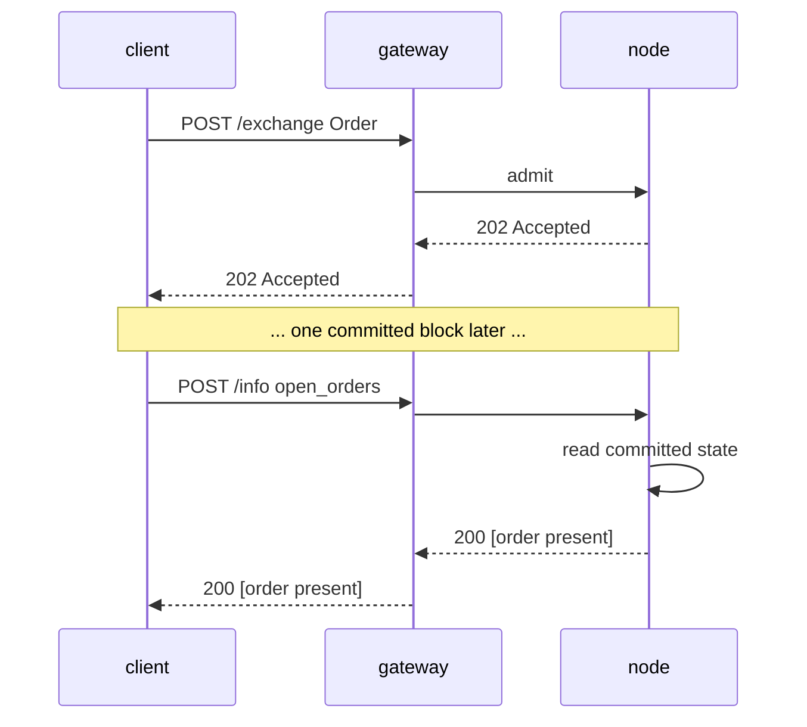

# `POST /info` {#post-info--read--query-endpoint}

The info endpoint returns exchange, market and account data. This page covers its envelope, its conventions and the list of query types.

:::info
**Status.** **stable** shape. New query types are added over time. The envelope is committed.
:::


:::info
Every account-scoped query takes the account as `address`. Four queries first
shipped with `user`: `broker_state`, `referral_state`, `spot_margin_state` and
`user_interest`. These four still accept `user`, and their replies carry the
account under both names. Send `address` in new code.
:::

## Overview {#tldr}

One endpoint serves every read. It dispatches on the `type` field of the request body. It is read-only. It never changes state and never requires a signature.

:::tip
Each product has its own page of queries:

- Perp-market reads are on [perpetual queries](./info/perpetuals.md).
- Spot, spot-margin and Earn reads are on [spot & margin queries](./info/spot.md).
- Closed-position lifecycle reads are on [position history](./info/position-history.md).
- Governance reads are on [governance queries](./info/governance.md).

This page covers the envelope, the conventions, and the account, vault and validator reads.
:::

## URL {#url}

```
POST  https://api.<net>.mtf.exchange/info
```

| Path | Wire shape |
|------|-----------|
| `POST /info` (gateway) | MTF-native (this document) |

The gateway serves the MTF-native `/info`. A node that you run yourself serves
the same native `/info` at `http://localhost:8080`.

## Envelope {#envelope}

Every `/info` response is one envelope. A success carries `data`. A failure
carries `error`. The two keys never appear together.

**Request**

```json
{ "type": "<query_type>", /* type-specific args */ }
```

**Success.** Status `200 OK`. The `type` discriminator is echoed inside `data`:

```json
{
  "data": {
    "type": "<query_type>",
    /* type-specific payload */
  }
}
```

The payload fields keep their old path. A field that you read at `body.data.fills`
before is still at `body.data.fills`. Only `type` moved. It was a sibling of
`data`, and it is now the first key of `data`.

Every read carries `type` inside `data`, and this includes the history-archive
reads. The archive lane differs from this envelope in one place only: the shape
of a rejection. See [the archive lane](#archive-lane).

A success has no `error` key. Test whether the key is present. Do not test
`error === null`.

A `data` of `null` is a success. A read can succeed with no content. It
answers `{"data": null}` with status `200`. Treat it as an empty result. It is
not a failure.

**Failure.** The body has no `data` key. The HTTP status is the one that the code maps to:

```json
{
  "error": {
    "code":    "UNKNOWN_TYPE",
    "message": "unknown info type: markest"
  }
}
```

| Field | Presence | Meaning |
|-------|----------|---------|
| `code` | always | The stable contract. Match on this field. |
| `message` | always | Prose for a human. It can change in any release. Never match on it. |
| `details` | optional | The bound that the request broke: `{"field","limit","actual"}`. It is omitted when the rejection carries no bound. It is never sent as `{}` |

The HTTP status keeps its normal meaning. One code always answers with one
status. The [error reference](../errors.md) lists every code, its status and
the caller action for it.

Two failures are common on `/info`. An unknown `type` answers `400` with
`UNKNOWN_TYPE`. An unknown named resource, such as a vault id, answers `404`
with `NOT_FOUND`.

#### History-archive reads {#archive-lane}

The history archive serves a group of reads. The node does not serve them. A
success answers in the envelope above. A rejection does not.

The lane holds `portfolio`, `historical_orders`, `user_funding`,
`user_funding_by_time`, `user_position_history`,
`user_position_history_by_time`, `user_non_funding_ledger_updates`,
[`recent_blocks`](./info/chain.md#recent_blocks),
[`recent_transactions`](./info/chain.md#recent_transactions), `validator_votes` and
[`user_volume_history`](./info/account-history.md#user_volume_history).

`portfolio` takes an `interval` with `address`. The only accepted value is
`1d`. Any other value is rejected with `400 invalid interval: <value>`, and the
rejection names `1d`.

A rejection on this lane puts a bare string in `error`. It does not send the
`{code, message}` object. This applies to the lane reads that take an
`address`. Two strings occur, both with status `400`:

| String | Cause |
|--------|-------|
| `missing field: address` | The request carries no `address` |
| `invalid user address: <value>` | `address` is present but does not parse |

A handler that branches on `error.code` reads `undefined` on this lane.
Test the type of `error` before you read `code`.

Each read puts its rows under a key that names what they are. There is no
generic `data[]`. Every key is snake_case, like the rest of this wire:

| Read | Collection key |
|---|---|
| `historical_orders` | `orders` |
| `user_funding`, `user_funding_by_time` | `fundings` |
| `user_position_history`, `..._by_time` | `positions` |
| `user_non_funding_ledger_updates` | `ledger_updates` |
| `recent_transactions` | `txns` |
| `portfolio` | `points` |
| `user_volume_history` | `days` |

:::warning
`ledger_updates` was `ledgerUpdates`. It was the one camelCase key on this
wire. A client that reads `data.ledgerUpdates` gets `undefined`. Read
`data.ledger_updates`.
:::

:::warning
`user_ledger` and `user_ledger_by_time` are removed. Both were narrower views of
the source that `user_non_funding_ledger_updates` serves. Its name states what
it holds. Their names did not.
:::

`user_non_funding_ledger_updates` returns every non-trading movement of an
account's money, and nothing else. It excludes funding, because funding has its
own read, [`user_funding`](./info/account-history.md#user_funding). It excludes
the realized PnL of a fill, because that is trading, and
[`user_fills`](./info/orders-fills.md#user_fills) serves it.

Every row carries a `kind` and a signed `delta`. The sign of `delta` is taken
from the side that the holder could spend a moment earlier. Money that leaves
that side is negative. Money that arrives is positive. `coin` names the token.
The kinds are:

| `kind` | What produced it | Extra fields |
|---|---|---|
| `deposit` | A MetaBridge inbound credit, a system spot credit, or an EVM-to-Core credit | `chain` on a bridge credit |
| `withdraw` | A withdrawal to an EVM chain | |
| `transfer` | An account, sub-account or spot transfer, and a vault deposit or withdrawal | `counterparty` when the move has one |
| `liquidation` | A forced-close settlement, or a delist settlement | `market`, `mark_px` |
| `staking_deposit` | MTF moves from spot into the staking free pool | |
| `staking_withdraw` | MTF returns from the free pool to spot | |
| `delegate` | MTF moves from the free pool to a validator | |
| `undelegate` | MTF leaves a validator for the unbonding window | |
| `staking_reward` | A claimed staking reward, credited to the free pool | |
| `earn_deposit` / `earn_withdraw` | An Earn deposit or withdrawal | |

A vault movement is a `transfer`. It has no kind of its own. It carries no
`counterparty`, because the other side is the vault.

`market` on a `liquidation` row is the perp market ID as a number. It is not a
symbol. It is the only market reference on this read that the read does not
resolve. Map it with [`markets_meta`](./info/perpetuals.md#markets_meta).

A forced close and a [delist settlement](../../products/perpetuals.md#delisting)
write the same `liquidation` row. This read carries no `cause` to tell them
apart. Read the cause from [`ledger_updates`](../ws/subscriptions.md#ledger_updates).

`delegate` and `undelegate` do not change the total that the account holds.
They move MTF between the part that it can withdraw and the part that it
cannot. This read shows that movement.

:::warning
Handle every kind in the table. A `kind` that your client does not know must never throw.
:::

Membership of this lane is a deployment fact. The wire does not guarantee it.
Do not hard-code the list. Write one handler that accepts both rejection shapes.

#### Malformed request body {#malformed-request}

The two shapes above reject a request that the server could read. The server
refuses a request that it cannot parse at an earlier step, and that answer
carries no `error` key. Two forms occur, on every read:

| Body | Status | Cause |
|------|--------|-------|
| A bare JSON string, such as `"Failed to deserialize the JSON body into the target type: ..."` | `422` | Valid JSON, but a field holds the wrong type, for example `limit` as a string |
| Plain text, such as `Failed to parse the request body as JSON: ...` | `400` | The body is not valid JSON |

Both messages are prose for a human, and they can change in any release. Never
match on them. Check the status before you parse the body. Treat any `4xx`
whose body has no `error` object as a bug in your own request.

The server does not refuse every wrong type. A field that the read treats as
optional, such as `detail` on [`account_state`](./info/account.md#account_state),
falls back to its default and does not fail. Only a field with a declared
numeric or typed binding rejects.

#### Empty results {#empty-vs-absent}

Inside a client, a read that answers nothing looks like a request that asks the
wrong question. The first is a fact about the account. The second is a bug in
your code. Three cases produce a zero that looks correct. Rule out each one
before you report a holding as missing.

**1. A retired type name.** A name that this API no longer serves never
answers with an empty body. It answers `UNKNOWN_TYPE` in one of two forms:

| What you sent | Status | Body |
|---|---|---|
| `spot_clearinghouse_state`, `oracle_sources`, `sub_accounts`, and every other name in [removed reads](#retired-reads) that is not in the row below | `400` | `{"error":{"code":"UNKNOWN_TYPE","message":"unknown info type: <name>"}}`, with no `details` |
| `account_overview`, `action_outcome`, `active_asset_ctx`, `all_mids`, `bridge_chain_configs`, `bridge_user_outbox`, `encode_action`, `evm_contract_bindings`, `gov_history`, `gov_proposals`, `gov_state`, `pm_summary`, `spot_meta`, `user_events`, `user_ledger_updates` | `410` | The same `code`, plus `details.use`, which names the read to call instead. Before gateway 0.9.8, four of these names answered a bare `400`: `spot_meta`, `all_mids`, `active_asset_ctx` and `user_events`. See [relocated reads](../../changelog/block-11550001.md#relocated-reads) |

So a `200` with an empty array is an answer about a real account. A client
that shows "no balances" after it calls `spot_clearinghouse_state` has
swallowed a `4xx`. Check the status before you read the body.

**2. A key that is not there.** An absent key reads as `undefined`, and most
code renders `undefined` as empty. The spot ledger is the common case. It is at
`data.spot.balances`. An [`account_state`](./info/account.md#account_state)
body has no `balances` and no `spot_balances` at the top level. Both paths read
as "this account holds nothing", and both are wrong.
[Where every field went](./info/account.md#account-state-lane-split) lists
every field that moved.

**3. A source that the endpoint does not deploy.** When no history archive is
configured behind an endpoint, the [archive-lane](#archive-lane) reads answer
with a typed empty body, such as `{"orders":[]}` or `{"fundings":[]}`. On the
wire, this is identical to an account with no history. The public endpoints run
the archive, so this case applies only to a self-hosted endpoint.

To test your client, send the same request with a `type` that you know is
wrong, such as `"type":"nope"`. If your client reports the same empty result,
it hides the error. It does not read an empty account.

## Query types {#query-types}

This table lists every `type` that the endpoint accepts, grouped by what it
answers. Each link opens the request fields and the response schema of that type.

| Group | `type` |
|---|---|
| **[Account state](./info/account.md)**<br/>collateral, margin health, positions, reservations | [`account_state`](./info/account.md#account_state) · [`clearinghouse_state`](./info/account.md#clearinghouse_state) |
| **[Orders & fills](./info/orders-fills.md)**<br/>resting orders, fill history, one order's lifecycle | [`open_orders`](./info/orders-fills.md#open_orders) · [`user_fills`](./info/orders-fills.md#user_fills) · [`order_status`](./info/orders-fills.md#order_status) |
| **[Account history](./info/account-history.md)**<br/>funding payments, past orders, TWAP history | [`user_funding`](./info/account-history.md#user_funding) · [`user_volume_history`](./info/account-history.md#user_volume_history) · [`user_interest`](./info/account-history.md#user_interest) · [`historical_orders`](./info/account-history.md#historical_orders) · [`action_outcome`](./info/account-history.md#action_outcome) · [`user_twap_slice_fills`](./info/account-history.md#user_twap_slice_fills) · [`delegator_rewards`](./info/account-history.md#delegator_rewards) |
| **[Perpetual markets](./info/perpetuals.md)**<br/>market metadata, books, trades, candles, funding | [`markets`](./info/perpetuals.md#markets) · [`markets_meta`](./info/perpetuals.md#markets_meta) · [`l2_book`](./info/perpetuals.md#l2_book) · [`trades`](./info/perpetuals.md#trades) · [`candle_snapshot`](./info/perpetuals.md#candle_snapshot) · [`funding_history`](./info/perpetuals.md#funding_history) · [`mip3_active_bids`](./info/perpetuals.md#mip3_active_bids) · [`liquidatable`](./info/perpetuals.md#liquidatable) · [`active_asset_data`](./info/perpetuals.md#active_asset_data) · [`perp_dexs`](./info/perpetuals.md#perp_dexs) |
| **[Spot, margin & Earn](./info/spot.md)**<br/>spot markets and balances, the margin lane, the lending pool | [`spot_meta`](./info/spot.md#spot_meta) · [`spot_margin_state`](./info/spot.md#spot_margin_state) · [`earn_state`](./info/spot.md#earn_state) · [`user_interest`](./info/spot.md#user_interest) · [`spot_deploy_auction`](./info/spot.md#spot_deploy_auction) |
| **[Position history](./info/position-history.md)**<br/>closed position lifecycles | [`user_position_history`](./info/position-history.md#user_position_history) · [`user_position_history_by_time`](./info/position-history.md#user_position_history_by_time) · [`identities`](./info/position-history.md#identities) |
| **[Options](./info/options.md)**<br/>the series registry and an account's open legs | [`option_series`](./info/options.md#option_series) · [`option_state`](./info/options.md#option_state) |
| **[Vaults & staking](./info/vaults-staking.md)**<br/>vault TVL and share price, delegation state | [`vault_state`](./info/vaults-staking.md#vault_state) · [`staking_state`](./info/vaults-staking.md#staking_state) |
| **[Fees & credit](./info/fees-credit.md)**<br/>the fee card, the referral program, broker credit | [`fee_schedule`](./info/fees-credit.md#fee_schedule) · [`referral_state`](./info/fees-credit.md#referral_state) · [`referral_code`](./info/fees-credit.md#referral_code) · [`referral_referees`](./info/fees-credit.md#referral_referees) · [`referral_leaderboard`](./info/fees-credit.md#referral_leaderboard) · [`broker_state`](./info/fees-credit.md#broker_state) |
| **[Governance](./info/governance.md)**<br/>proposals, votes and the parameter set | [`validator_votes`](./info/governance.md#validator_votes) · [`gov_state`](./info/governance.md#gov_state) · [`gov_proposals`](./info/governance.md#gov_proposals) · [`gov_history`](./info/governance.md#gov_history) |
| **[Chain activity](./info/chain.md)**<br/>recent blocks, and one action's outcome | [`recent_blocks`](./info/chain.md#recent_blocks) · [`recent_transactions`](./info/chain.md#recent_transactions) |
| **[Node snapshots](./info/node.md)**<br/>peers, sync state and node-scoped figures | [`exchange_status`](./info/node.md#exchange_status) · [`user_twaps`](./info/node.md#user_twaps) · [`vault_summaries`](./info/node.md#vault_summaries) · [`user_rate_limit`](./info/node.md#user_rate_limit) · [`approved_brokers`](./info/node.md#approved_brokers) · [`validator_l1_votes`](./info/node.md#validator_l1_votes) · [`validator_summaries`](./info/node.md#validator_summaries) · [`gossip_root_ips`](./info/node.md#gossip_root_ips) |
| **[Points](#points-reads)** (not active yet)<br/>the weekly points table | [`points_weeks`](#points_weeks) · [`points_leaderboard`](#points_leaderboard) · [`points_user`](#points_user) |

## Removed reads {#retired-reads}

Each name in this section answers `UNKNOWN_TYPE`. The API keeps exactly one
read for each question. Two reads for one question force a choice, and a wrong
choice fails silently. For the release that removed each name, see
[migration](../../changelog/migrations.md).

The HTTP status tells the two kinds of removal apart:

- `400`: the name never named a read on this API, or its answer is gone.
- `410`: the name was public and its answer moved to another read. Fifteen
  names get this status: `account_overview`, `action_outcome`, `active_asset_ctx`,
  `all_mids`, `bridge_chain_configs`, `bridge_user_outbox`, `encode_action`,
  `evm_contract_bindings`, `gov_history`, `gov_proposals`, `gov_state`,
  `pm_summary`, `spot_meta`, `user_events` and `user_ledger_updates`. The error
  carries `details.use`, which names the read to call instead. A client can
  follow the move without this table. Branch on the status and on `error.code`.
  Never branch on the status alone.

`details.use` does not always name an `/info` type. `action_outcome` and
`encode_action` both answer `"use": "/exchange"`, which is an endpoint. Read the
value as prose for a human. Do not post it back as a type.

| Removed | Call this instead |
|---|---|
| `abstraction_state` | Nothing. Its `kind` / `value` pair was free-form for each kind, so a value had no meaning that the wire defined |
| `account_overview`, `web_data` | [`account_state`](./info/account.md#account_state) with `detail: "overview"`. It returns the same body |
| `action_outcome` | [`POST /exchange`](./exchange.md). The submit call waits for the commit and returns the verdict. See [its section](./info/account-history.md#action_outcome) |
| `agents` | [`account_state`](./info/account.md#account_state) with `detail: "overview"`, field `agents` |
| `block_info` | [`account_state`](./info/account.md#account_state) for the committed `height` / `time` stamp. The archive-backed `recent_blocks` read for the block head. The `explorer_block` WS channel that answered this before is [removed](../../changelog/ids-and-wire-shapes.md#explorer-channels-removed), because a validator must not serve a per-block firehose |
| `bridge_chain_configs` | Nothing. No public read carries the deployment row. A node publishes it on its [`node_bridge_outbox`](../../nodes/data-streams.md#node_bridge_outbox-configs) stream. The custody address for each chain is in the [Deployments](../../bridge/index.md#deployments) table |
| `bridge_finalized_cosignatures`, `bridge_outbound_queue` | [`bridge_withdrawal_history`](./info/bridge.md#bridge_withdrawal_history) for the withdrawals of one account. The queue of the whole chain and the raw validator cosignature bytes are not part of this API |
| `delegator_history` | Nothing. No delegation event log is committed |
| `delegator_summary` | [`account_state`](./info/account.md#account_state) with `detail: "overview"`, field `staking.summary` |
| `dynamic_risk` | [`markets_meta`](./info/perpetuals.md#markets_meta), field `risk_override` |
| `encode_action` | Nothing. The multisig inner blob takes the ordinary `{type, params}` wire action. See [signing the inner action](../../concepts/multi-sig.md#signing-the-inner-action) |
| `evm_contract_bindings` | [`markets_meta`](./info/perpetuals.md#markets_meta) with `kind: "spot"`, field `evm_contract` |
| `gov_state`, `gov_proposals`, `gov_history` | [`validator_votes`](./info/governance.md#validator_votes): `status: "voting"` for open votes, `status: "enacted"` for history. A parameter value is on the read that owns it: [`markets_meta`](./info/perpetuals.md#markets_meta), [`fee_schedule`](./info/fees-credit.md#fee_schedule), [`exchange_status`](./info/node.md#exchange_status) |
| `leading_vaults` | [`vault_summaries`](./info/node.md#vault_summaries). Filter the rows on `leader` |
| `margin_summary` | [`account_state`](./info/account.md#account_state) with `detail: "margin"` |
| `market_info` | [`markets`](./info/perpetuals.md#markets) with `coin`, plus [`markets_meta`](./info/perpetuals.md#markets_meta) with `coin` |
| `max_builder_fee` | [`approved_brokers`](./info/node.md#approved_brokers). Find the builder in the list |
| `max_market_order_ntls`, `perps_at_open_interest_cap` | [`markets_meta`](./info/perpetuals.md#markets_meta). `max_market_order_ntl` is the served headroom, one row per market. `null` means uncapped. `"0"` means at the cap. Do not compute it from `open_interest` and `oi_cap`. An uncapped row omits `oi_cap`, so that arithmetic reads an uncapped market as zero headroom |
| `node_info` | Nothing on this API. Per-node identity is not consensus state, so two honest nodes answer differently. The chain id is fixed for each network. See [networks](../../networks.md#summary) |
| `oracle_sources` | Nothing. The price aggregator does not read the per-market bitmask that it served. The static source facts are in prose. See [oracle prices](../../concepts/oracle-prices.md#source-table) |
| `perp_dex_limits` | [`perp_dexs`](./info/perpetuals.md#perp_dexs), field `limits` |
| `pm_summary` | [`account_state`](./info/account.md#account_state): `perp.pm_maint_margin`, `perp.pm_concentration_penalty` and the top-level `pm_net_value`. `abstraction: "portfolio"` is the enrolment flag |
| `predicted_fundings` | [`markets`](./info/perpetuals.md#markets). The `funding` block of each row carries the charged rate and the next boundary |
| `protocol_metrics` | [`markets`](./info/perpetuals.md#markets), [`markets_meta`](./info/perpetuals.md#markets_meta) and [`staking_state`](./info/vaults-staking.md#staking_state) carry every public fact that it held. The rest was node diagnostics |
| `recent_trades`, `trades_by_time` | [`trades`](./info/perpetuals.md#trades). Send no range for the recent window. Send a range for a time window |
| `spot_clearinghouse_state` | [`account_state`](./info/account.md#account_state). `spot.balances` is the whole token ledger |
| `spot_deploy_state` | [`spot_deploy_auction`](./info/spot.md#spot_deploy_auction). It is the same read with a new name |
| `staking_apr` | [`staking_state`](./info/vaults-staking.md#staking_state): `pending_validator_pool_usdc` and `total_stake`. It never served an APR |
| `sub_accounts` | [`account_state`](./info/account.md#account_state) with `detail: "overview"`, field `sub_accounts` |
| `token_info` | [`markets_meta`](./info/perpetuals.md#markets_meta) with `kind: "spot"` |
| `user_fees` | [`fee_schedule`](./info/fees-credit.md#fee_schedule) with `address`. It resolves the effective maker / taker bps |
| `user_fills_by_time` | [`user_fills`](./info/orders-fills.md#user_fills) with `start_time` / `end_time` |
| `user_ledger_updates` | [`user_non_funding_ledger_updates`](#archive-lane). The node keeps no per-account ledger history. The archive keeps every balance movement in the record shape of the stream, with a signed `delta` and a token `coin`. That read serves it. One question has one read. The gateway answers `410` with `details.use`. A node that you call directly answers `400` `UNKNOWN_TYPE`. Before [block 25,599,540](../../changelog/block-25599540.md#user-ledger-updates-removed), the name answered `200` with `updates: []` |
| `user_role` | [`account_state`](./info/account.md#account_state) with `detail: "overview"`, field `role` |
| `user_to_multi_sig_signers` | [`account_state`](./info/account.md#account_state) with `detail: "overview"`, field `multisig` |
| `user_vault_equities` | [`account_state`](./info/account.md#account_state) with `detail: "overview"`, field `vault.equities` |
| `web_data2` | [`account_state`](./info/account.md#account_state) for margin and balances, [`clearinghouse_state`](./info/account.md#clearinghouse_state) for positions, `detail: "overview"` for vault equities, [`open_orders`](./info/orders-fills.md#open_orders) for resting orders, [`exchange_status`](./info/node.md#exchange_status) for status. The WS channel is removed too. It answers `{"channel":"error","data":{"error":"unknown channel: web_data2"}}` |

## Capability-gated reads {#operator-reads}

These two reads exist on the wire. Each one answers with the error that an
unknown type gets. The cause is that the capability it reads is not reachable
yet. The read is not restricted to operators. Each read becomes public on the
day that its capability becomes reachable.

| Read | Ships when |
|---|---|
| `mip3_deployer_oracle` | The `mip3_deployer_oracle` protocol feature is armed on the target chain |
| `fba_batch_state` | The FBA engine becomes reachable from `/exchange` |

## Points reads {#points-reads}

:::caution
**Not active yet.** These three reads ship with the next archive and gateway
release. Until then, each one answers `400` `UNKNOWN_TYPE`, the same answer
that a misspelled type gets. Points still count from genesis. When publication
starts after the release, the archive publishes every past week.
:::

The [points program](../../concepts/points.md) publishes one table a week. The
history archive computes it, and these three reads serve it.

Amounts are decimal strings in whole units: USD for a volume, points for a
point count. They carry up to six decimals. Week numbers, season numbers, blocks
and times are numbers. A time is in milliseconds.

Weeks count from genesis. Week 1 ends 2026-09-09 00:00 UTC. Each later week
ends seven days after the week before it, at a Wednesday 00:00 UTC cut. A
`week` argument is this number. It is not a week number inside a season.

A rejected argument answers `400` with the message `missing field: season`,
`missing field: address` or `invalid user address: <value>`. Test the type of
`error` before you read `code`, as on [the archive lane](#archive-lane).

With no archive behind the endpoint, each read answers `200` with `rows: []`
and a `flag` string. The public endpoint runs the archive.

### `points_weeks` {#points_weeks}

Returns every published week, oldest first. A published week never changes, so
its two hashes never change.

**Request**

```json
{ "type": "points_weeks" }
```

**Response**

```json
{
  "data": {
    "type": "points_weeks",
    "rows": [
      {
        "week": 5,
        "season": 1,
        "week_start": 1790726400000,
        "week_end": 1791331200000,
        "block_from": 23140512,
        "block_to": 28617903,
        "gap_blocks": 0,
        "pool": "1000000",
        "q_floor": "50000000",
        "total_qualifying_volume": "8000000",
        "issued_points": "160000",
        "table_sha256": "a5c941fbd48fb9774d4938a4cd625f345a324562f2e19c3d80e8ae84f492828e",
        "inputs_sha256": "3103ca2c526671100cddc82b201afff8768a8c39b2dafefc6f0c5ccc9cc66441",
        "published_at": 1791332400000
      }
    ]
  }
}
```

| Field | Meaning |
|---|---|
| `week` | Week number since genesis |
| `season` | Season number, 1 to 4 |
| `week_start` / `week_end` | The start of the week (inclusive) and its cut (exclusive) |
| `block_from` / `block_to` | The first block of the week, and the cut block: the last block before `week_end` |
| `gap_blocks` | Blocks of the range where the archive has a recorded gap in fills. The week counts the fills that the archive holds, and the pool does not change |
| `pool` | Points that the week shares. `"1000000"`, except the partial last week before the TGE |
| `q_floor` | `Q_floor`, in USD |
| `total_qualifying_volume` | `Σqv` over every root, in USD |
| `issued_points` | Points that the week issued. Below `pool` when `Σqv` is below `q_floor` |
| `table_sha256` | SHA-256 of the full table. See [check the table hash](../../concepts/points.md#how-to-check) |
| `inputs_sha256` | SHA-256 of the exclusion, root and cluster inputs of the week. It commits to them and does not show them |
| `published_at` | When the archive published the week |

### `points_leaderboard` {#points_leaderboard}

Returns the full table of one week, or the season total. Rows are ranked by
points, highest first, then by address. A page holds 1,000 rows.

**Request**

```json
{ "type": "points_leaderboard", "season": 1, "week": 5, "offset": 0 }
```

| Field | Type | Required | Meaning |
|---|---|---|---|
| `season` | number | yes | Season number |
| `week` | number | no | Week number since genesis. Omit it for the season total. A week outside `season` answers no rows |
| `offset` | number | no | Rows to skip. Default `0`. Add 1,000 for the next page |

**Response**

```json
{
  "data": {
    "type": "points_leaderboard",
    "season": 1,
    "week": 5,
    "offset": 0,
    "rows": [
      {
        "rank": 1,
        "address": "0x1933587ffa064e26bf8f6c7b0fdec771644b56de",
        "raw_volume": "5350000",
        "qualifying_volume": "5350000",
        "points": "107000"
      },
      {
        "rank": 2,
        "address": "0xac7dc3a2f08610ddc46c7a3e4f54b80745cbd8e9",
        "raw_volume": "3000000",
        "qualifying_volume": "2650000",
        "points": "53000"
      }
    ]
  }
}
```

| Field | Meaning |
|---|---|
| `week` | The week that you asked for, or `null` for the season total |
| `rank` | `offset` plus the place of the row on the page, from 1 |
| `address` | The root account |
| `raw_volume` / `qualifying_volume` | `raw` and `qv`, in USD |
| `points` | Points for the week, or for the season |

The table holds every root that has raw volume, including roots that earned no
points. A root under the $1,000 minimum has a row with `points` `"0"`. Excluded
accounts have no row. A page with fewer than 1,000 rows is the last page.

### `points_user` {#points_user}

Returns the points of one account, one row per week that it traded.

**Request**

```json
{ "type": "points_user", "address": "0xdaca1e722d0a355b2242f144b3dfb1cc378e9405", "season": 1 }
```

| Field | Type | Required | Meaning |
|---|---|---|---|
| `address` | address | yes | Any account. A sub-account or user vault answers with the rows of its root |
| `season` | number | no | Season number. Omit it for every season |

**Response**

```json
{
  "data": {
    "type": "points_user",
    "address": "0xdaca1e722d0a355b2242f144b3dfb1cc378e9405",
    "root": "0xac7dc3a2f08610ddc46c7a3e4f54b80745cbd8e9",
    "season": 1,
    "rows": [
      {
        "week": 5,
        "season": 1,
        "week_end": 1791331200000,
        "raw_volume": "3000000",
        "qualifying_volume": "2650000",
        "points": "53000"
      }
    ]
  }
}
```

| Field | Meaning |
|---|---|
| `address` | The address that you sent, in lower case |
| `root` | The account that earns for `address`. It differs from `address` for a sub-account or a user vault |
| `season` | The season that you asked for, or `null` for every season |
| `rows` | The weeks of the root, oldest first |

The rows belong to the root. A sub-account and its parent answer the same
`rows`.

An empty `rows` has three possible causes: the account had no raw volume, no
week is published yet, or the account is excluded. The read does not tell them
apart.


## Errors {#errors}

The [error reference](../errors.md) has the full list, with the caller action
for each code. `/info` produces these codes:

| HTTP | `error.code` | Cause |
|------|--------------|-------|
| 200 | — | Success. An unknown address on `account_state` and its siblings answers 200 with a zeroed record. It is not a 404 |
| 400 | `INVALID_REQUEST` | No `type` discriminator, a required type-specific argument is missing, or an address is malformed |
| 400 | `UNKNOWN_TYPE` | The `type` names no read. It is misspelled, or the read is removed |
| 410 | `UNKNOWN_TYPE` | The `type` names a read whose answer moved. `details.use` names the read to call instead. See [removed reads](#retired-reads) |
| 404 | `MARKET_NOT_FOUND` | The `coin` symbol is unknown (`markets`, `l2_book` and other market reads) |
| 404 | `NOT_FOUND` | A named resource is unknown, such as a vault address on `vault_state` |
| 429 | `RATE_LIMITED` | No retry hint is sent. See [rate limits](../rate-limits.md) |
| 500 | `INTERNAL` | A server defect. Your request is not the cause. Retry, then report it |

A `405` carries no envelope. The endpoint is POST-only, and the router refuses
another method before the envelope exists.

:::warning
There is no `account not found` error. Account-keyed reads, such as
`account_state`, `open_orders`, `user_rate_limit` and `staking_state`, return a
200 zeroed record for an address that never appeared on-chain. They never
answer 404.
:::

## Read-after-write consistency {#read-after-write-consistency}

`/info` reads from the most recent committed block. A `POST /exchange` admitted at time `T` becomes visible in `/info` when the leader commits the block that contains it. That is one committed block later. Block cadence is a governed target for each deployment. It is not a fixed duration. For a wall-clock estimate, measure the committed-round rate of your deployment.

To read your own writes, subscribe to [`order_updates`](../ws/subscriptions.md#order_updates) for the order lifecycle and [`fills`](../ws/subscriptions.md#fills) for executions. Committed events arrive in commit order, so you do not need to poll.

## Order visibility sequence {#sequence--query-an-account-see-your-own-order}


```mermaid
sequenceDiagram
    participant client
    participant gateway
    participant node
    client->>gateway: POST /exchange Order
    gateway->>node: admit
    node-->>gateway: 202 Accepted
    gateway-->>client: 202 Accepted
    Note over client,node: ... one committed block later ...
    client->>gateway: POST /info open_orders
    gateway->>node: 
    node->>node: read committed state
    node-->>gateway: 200 [order present]
    gateway-->>client: 200 [order present]
```

## See also {#see-also}

- [`POST /exchange`](./exchange.md): the write path
- [`POST /faucet`](./faucet.md): the testnet grant of test funds (USDC and MTF)
- [WS subscriptions](../ws/subscriptions.md): the push equivalents

## FAQ {#faq}

<details>
<summary>Show FAQ</summary>

**Q: Do I address a market by id or by name?**
A: By `coin` symbol (`"BTC"`). The numeric `asset_id` / `market_id` request
arguments are removed. Only `coin` is accepted, and responses show coin symbols
everywhere. The signed `/exchange` write path still uses the numeric `asset`.
That field is consensus-frozen, and it is not related to these read arguments.

**Q: Do `user_fills` / `trades` need an external indexer?**
A: No. On the gateway, since [block 25,599,540](../../changelog/block-25599540.md#tape-retirement-reads), the node keeps no committed fill ring and no trade ring. The gateway answers both reads from the archive and from its own 24-hour trade window. A bare node answers `trades` with `"trades": []`. For a continuous real-time feed, subscribe to the [WS channels](../ws/subscriptions.md). See [deep history past the ring](./info/perpetuals.md#trades-archive).

**Q: Is the response deterministic across nodes?**
A: Yes. Every honest node returns identical responses for the same query at the same committed height. Nodes at different commit heights can differ. Compare the `height` / `time` stamp that [`account_state`](./info/account.md#account_state) carries before you call two answers inconsistent. `gossip_root_ips` is the one field that is not consensus state. It reads the config of each node. Nodes that carry the same roster answer identically, and nodes that do not can differ.

</details>
