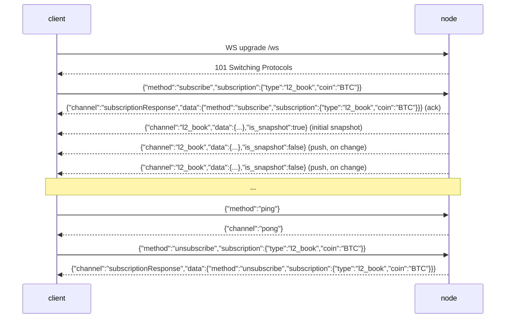

# WebSocket API

:::info
**Status.** Live on the node today for `l2_book`, `bbo` (book/top-of-book), `trades`, `active_asset_ctx` (per-market mark/oracle/funding/OI), `all_mids`, `markets`, `fills`, `user_events`, `order_updates`, `open_orders`, `notifications`, `ledger_updates`, `active_asset_data`, `user_fundings`, `user_twap_slice_fills`, `user_twap_history`, `account_state`, `spot_state`, `explorer_block`, `explorer_txs`, and `candles` (rolling OHLCV bars, per `(coin, interval)`) — all push real committed data, change-driven (a channel emits a frame only when its state changed since the last commit) — plus `post` (request/response over WS) and `ping`/`pong`. See [subscriptions](./subscriptions.md#channel-status-at-a-glance) for the per-channel shapes and the up-to-date status list.
:::

:::info
**Channel names are snake_case (MTF-native).** The node `/ws` surface is MTF-native, so channel wire names are snake_case: `l2_book`, `bbo`, `trades`, `active_asset_ctx`, `fills`, `candles`, `user_events`. The gateway serves this same native WS at `api.<net>.mtf.exchange/ws`.
:::

## TL;DR {#tldr}

A single WS connection multiplexes subscriptions to many channels. The frame protocol mirrors HL's (`{"method":"subscribe","subscription":{"type":...}}`), but the **channel names are MTF-native snake_case** (`l2_book`, `user_events`, …): you send a subscribe, the server replies with a `subscriptionResponse` ack followed by an initial snapshot, and then pushes `{"channel":...,"data":...}` frames as state commits. Book channels (`l2_book`, `bbo`) are **per-market** and require a `coin`. Read this page for the connection lifecycle; see [subscriptions](./subscriptions.md) for the channel catalog.

## URL {#url}

```
wss://api.<net>.mtf.exchange/ws
```

MTF-native WS (snake_case channels) is served by the gateway at `/ws`. The gateway front door terminates TLS (`wss://`). Running the node yourself, the same native WS is served plain at `ws://localhost:8080/ws` — the frame protocol is identical either way.

## Connection lifecycle {#connection-lifecycle}



## Frames {#frames}

All frames are JSON **text** frames. Binary frames are rejected with an error frame (the connection stays open). Inbound frames are keyed by `method`; outbound frames are keyed by `channel`.

### `subscribe` {#subscribe}

```json
{
  "method": "subscribe",
  "subscription": { "type": "<channel>", "coin": "<coin>" }
}
```

- `subscription.type` (required) — the channel name (snake_case, e.g. `l2_book`). Unknown names produce an error frame.
- `subscription.coin` (required for per-market channels `l2_book` / `bbo` / `trades` / `active_asset_ctx`; omitted for `user_events`) — see [Coin parameter](#coin-parameter).

The server replies with **two** frames, in order:

1. The ack:

```json
{
  "channel": "subscriptionResponse",
  "data": { "method": "subscribe", "subscription": { "type": "l2_book", "coin": "BTC" } }
}
```

2. An initial snapshot frame on the subscribed channel (see each channel in [subscriptions](./subscriptions.md)). For `l2_book` / `bbo` this is a real snapshot of the latest committed book; for channels with no live source yet it is an empty-but-valid body.

A duplicate subscribe to the same `(type, coin)` is **silently ignored** (no second ack, no error) — matching HL behavior.

### `unsubscribe` {#unsubscribe}

```json
{ "method": "unsubscribe", "subscription": { "type": "l2_book", "coin": "BTC" } }
```

Ack (mirrors the subscribe ack with `method: "unsubscribe"`):

```json
{
  "channel": "subscriptionResponse",
  "data": { "method": "unsubscribe", "subscription": { "type": "l2_book", "coin": "BTC" } }
}
```

After the ack no more frames arrive on that `(type, coin)` until you re-subscribe. Unsubscribing a `(type, coin)` you never subscribed to is a no-op (you still get the ack).

### `ping` / `pong` {#ping--pong}

```json
{ "method": "ping" }
```

```json
{ "channel": "pong" }
```

A bare `{"method":"ping"}` (no `subscription`) is the application-level heartbeat; the server replies `{"channel":"pong"}`. The node also answers low-level WebSocket control-frame pings (RFC 6455 `Ping`) with a `Pong` automatically, so either heartbeat mechanism works.

### Error frame {#error-frame}

Any malformed or unrecognized inbound frame produces an error frame **without closing the connection**:

```json
{ "channel": "error", "data": { "error": "<reason>" } }
```

Causes include: malformed JSON, missing `method`, missing `subscription` / `subscription.type`, an unknown channel name (`"unknown channel: <name>"`), a binary frame, or an unknown method. The client can correct and retry on the same socket.

### Push messages {#push-messages}

Live data frames share one envelope:

```json
{ "channel": "<channel>", "data": { /* channel-specific */ }, "is_snapshot": false }
```

- `is_snapshot` is a boolean: `true` on the initial on-subscribe frame (the full snapshot), `false` on the subsequent change-driven pushes. **Every frame body is a full snapshot regardless** (e.g. `l2_book` is the full top-20 levels, `all_mids` the full map, `account_state` the full account state) — `is_snapshot` is informational, not a "this is a diff" flag. A client that simply replaces its local state on every frame stays correct and can ignore the field.
- There is **no** `seq`, `ts`, or `sub_id` field on the frame. Demultiplex on `channel` (and, for per-market channels, the `coin` inside `data`).

Updates are **change-driven**: after each commit the node publishes a frame for a subscribed channel **only when that channel's committed state actually changed** since the previous commit. A commit that leaves a watched channel untouched emits nothing for it — so you receive fewer frames than there are blocks, never a redundant re-push of unchanged data (see [Per-subscriber push](#per-subscriber-push)).

### `post` (request/response over WS) {#post-requestresponse-over-ws}

A `post` lets you issue a one-shot request/response call over the same socket instead of opening a REST connection. The `request` body is the same `{type, payload}` envelope the REST routes accept and is dispatched through the **exact same handlers** as `POST /info` and `POST /exchange` — signature verification on actions included.

Request:

```json
{
  "method": "post",
  "id": 42,
  "request": { "type": "info", "payload": { "type": "node_info" } }
}
```

Response (correlate on `id`):

```json
{
  "channel": "post",
  "data": {
    "id": 42,
    "response": { "type": "info", "payload": { /* same body as POST /info */ } }
  }
}
```

- `request.type` is `"info"` or `"action"`.
- For `"action"`, `payload` must be a full signed-exchange envelope (`signature` / `nonce` / `action`, plus the optional [`expires_after`](../rest/exchange.md#optional-action-expiry-expiresafter)), identical to [`POST /exchange`](../rest/exchange.md). The action is signed over the **compact `serde_json` serialization of the `action` object** — the deterministic canonical form the SDK pins.
- Errors are returned as a normal `post` frame with `response.type: "error"` and a string `payload` (never a connection close):

```json
{ "channel": "post", "data": { "id": 42, "response": { "type": "error", "payload": "<message>" } } }
```

A failed-but-well-formed action (e.g. bad signature) comes back as a normal `action` response with `payload.accepted: false` and an `error` string, not an `error`-type response.

## Coin parameter {#coin-parameter}

The fanout hub is keyed by `(channel, coin)`. For the per-market channels `l2_book` and `bbo` this means:

- **`coin` is required.** Without it you land on the coinless `(channel, None)` bucket, which the per-market book publisher never writes to — you would receive only the initial empty snapshot and no live updates.
- **A `BTC` subscriber only receives `BTC` frames.** ETH commits never reach a BTC subscription, and vice-versa.

`coin` is canonicalized to an **asset-id string** before keying, so two forms resolve to the same bucket:

- A **numeric asset id** — e.g. `"0"`, `"7"` — maps directly to that market (the MTF-native canonical key). A spot **pair id** works the same way.
- A **symbol** — e.g. `"BTC"` — is resolved against the committed universe (`mip3_market_specs`, matching on `symbol` or `asset_name`) to its asset id.
- A **spot pair name** — e.g. `"BTC/USDC"` — is resolved against the registered spot pairs to its pair id, so `l2_book` / `bbo` stream real spot depth for the pair (in the pair's own tick / size planes).

A subscriber keyed by `"BTC"` and one keyed by the numeric id `"0"` (if BTC is asset 0) therefore share the **same** routing bucket as the per-commit publish. A coin that is neither numeric nor a known universe symbol is kept verbatim as its own bucket — you get the ack + empty snapshot but never live frames (honest "unknown market" rather than a fabricated mapping).

## Per-subscriber push {#per-subscriber-push}

Pushes are **subscriber-gated, per-market, and change-driven**. After each committed block the node, for each market, checks `has_receivers(channel, coin)` — an O(1) lookup — and only then aggregates that market's book, and broadcasts it **only if it changed** since the previous commit. Consequences:

- A market nobody is watching costs only the O(1) check; no book is built.
- A `BTC` subscriber never triggers an `ETH` book build.
- A market whose book is unchanged on a commit broadcasts nothing for it that commit — no redundant re-push.
- Frames are delivered to **every** current subscriber of that `(channel, coin)` bucket.

## Backpressure & lag {#backpressure--lag}

Each subscription is backed by a bounded broadcast ring buffer (capacity **256** frames). A consumer that falls more than 256 frames behind is **dropped**: the server sends a final error frame describing the lag and then stops forwarding on that subscription.

```json
{ "channel": "error", "data": { "error": "lagged behind broadcast by <n> messages" } }
```

On this signal, re-subscribe (you will get a fresh snapshot). The node does **not** silently skip ahead — for a derivatives chain a gap in book state is worse than an explicit drop.

## Authentication {#authentication}

Public market channels (`l2_book`, `bbo`, `trades`, `all_mids`) require **no auth**.

Per-account channels (`fills`, `user_events`) are live and route per 0x `user` address, but there is **no auth gate yet** — any connection can subscribe to any address's feed (the data is the same public committed fills, keyed by account). A dedicated auth-at-subscribe envelope (so a connection only sees its own account) is roadmap. For authenticated reads/writes today, use the `post` channel (info reads, and signed actions through the same EIP-712 verification as `POST /exchange`). See [subscriptions](./subscriptions.md).

## Multiplexing {#multiplexing}

A single connection can hold many subscriptions; each is demuxed by its `(channel, coin)`. Each subscription owns its own broadcast receiver and forwarder task; the connection interleaves their frames onto the one socket. Route inbound frames by `channel` plus the `coin` inside `data`.

```
l2_book  coin "0" (BTC)
l2_book  coin "1" (ETH)
bbo      coin "0" (BTC)
```

## Close behavior {#close-behavior}

- A client `close` frame (or EOF) tears down the connection and aborts every forwarder task.
- A read error logs and closes.
- A lagging subscription is dropped individually (error frame), but the **connection stays open** — other subscriptions on it keep flowing.

There is no custom close-code table today; standard WebSocket close codes apply.

## Reconnect strategy {#reconnect-strategy}

1. On disconnect, reconnect with exponential backoff (suggested: base 200 ms, max 30 s, jitter ±20%).
2. Re-subscribe each `(type, coin)` from scratch. The first frame after each subscribe is a fresh snapshot, so there is no resume token to manage — discard local book state and rebuild from the snapshot.
3. On a `lagged` error frame, treat it the same as a disconnect for that subscription and re-subscribe.

:::warning
There is **no** `seq` / `resume` / `resume_token` mechanism today. Every (re)subscribe starts from a fresh snapshot. Resume buffers are roadmap, not implemented.
:::

## See also {#see-also}

- [WS subscriptions catalog](./subscriptions.md)
- [`POST /exchange`](../rest/exchange.md) — same EIP-712 envelope used by the `post` action path
- [`POST /info`](../rest/info.md) — REST equivalents for one-shot reads (also reachable via `post`)
