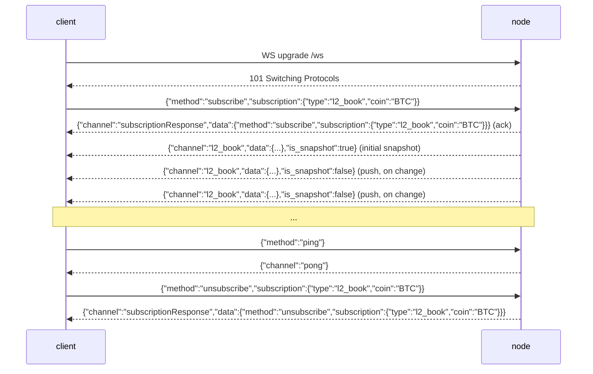

# WebSocket API

:::info
The node `/ws` surface pushes real committed data, change-driven: a channel emits a frame only when its state changed since the last commit. It also serves `post` (request/response over WS) and `ping`/`pong`. See [subscriptions](./subscriptions.md#channels-at-a-glance) for the channel list, the key each one takes, and their frame shapes.
:::

:::info
**Channel names are snake_case (MTF-native).** The node `/ws` surface is MTF-native, so channel wire names are snake_case: `l2_book`, `bbo`, `trades`, `markets`, `fills`, `order_updates`. The gateway serves this same native WS at `api.<net>.mtf.exchange/ws`, and adds `candles` on top of it.
:::

## TL;DR {#tldr}

A single WS connection multiplexes subscriptions to many channels. The frame protocol mirrors HL's (`{"method":"subscribe","subscription":{"type":...}}`), but the **channel names are MTF-native snake_case** (`l2_book`, `order_updates`, …): you send a subscribe, the server replies with a `subscriptionResponse` ack followed by an initial snapshot, and then pushes `{"channel":...,"data":...}` frames as state commits. Book channels (`l2_book`, `bbo`) are **per-market** and require a `coin`. Read this page for the connection lifecycle; see [subscriptions](./subscriptions.md) for the channel catalog.

## URL {#url}

```
wss://api.<net>.mtf.exchange/ws
```

MTF-native WS (snake_case channels) is served by the gateway at `/ws`. The gateway front door terminates TLS (`wss://`). Running the node yourself, the same native WS is served plain at `ws://localhost:8080/ws` — the frame protocol is identical either way.

:::warning
**`candles` is a serving-layer channel. The node does not serve it.** The node does not aggregate OHLCV. The serving layer (the gateway) builds the bars from the node's `trades` firehose and its price-sample tape. Every other channel on this page is served by both.

A node-direct `candles` subscribe is refused as an unknown channel, and gets no `subscriptionResponse` ack:

```json
{"channel":"error","data":{"error":"unknown channel: candles"}}
```

An `unsubscribe` gets the same frame. Subscribe to `candles` through the gateway (`wss://api.<net>.mtf.exchange/ws`).
:::

## Connection lifecycle {#connection-lifecycle}


```mermaid
sequenceDiagram
    participant client
    participant node
    client->>node: WS upgrade /ws
    node-->>client: 101 Switching Protocols
    client->>node: {"method":"subscribe","subscription":{"type":"l2_book","coin":"BTC"}}
    node-->>client: {"channel":"subscriptionResponse","data":{"method":"subscribe","subscription":{"type":"l2_book","coin":"BTC"}}} (ack)
    node-->>client: {"channel":"l2_book","data":{...},"is_snapshot":true} (initial snapshot)
    node-->>client: {"channel":"l2_book","data":{...},"is_snapshot":false} (push, on change)
    node-->>client: {"channel":"l2_book","data":{...},"is_snapshot":false} (push, on change)
    Note over client,node: ...
    client->>node: {"method":"ping"}
    node-->>client: {"channel":"pong"}
    client->>node: {"method":"unsubscribe","subscription":{"type":"l2_book","coin":"BTC"}}
    node-->>client: {"channel":"subscriptionResponse","data":{"method":"unsubscribe","subscription":{"type":"l2_book","coin":"BTC"}}}
```

## Frames {#frames}

All frames are JSON **text** frames by default. Binary frames from the client are rejected with an error frame (the connection stays open). Inbound frames are keyed by `method`; outbound frames are keyed by `channel`.

A connection that negotiates [compression](#websocket-compression-zstd) receives its data frames as **binary** frames that hold the same JSON, compressed. Compression is opt-in: a client that offers no subprotocol receives text frames, unchanged. Frames you send stay text in every mode.

### `subscribe` {#subscribe}

```json
{
  "method": "subscribe",
  "subscription": { "type": "<channel>", "coin": "<coin>" }
}
```

- `subscription.type` (required) — the channel name (snake_case, e.g. `l2_book`). Unknown names produce an error frame.
- `subscription.coin` (required for per-market channels `l2_book` / `bbo` / `trades`; omitted for the account channels) — see [Coin parameter](#coin-parameter).

The server replies with **two** frames, in order:

1. The ack:

```json
{
  "channel": "subscriptionResponse",
  "data": { "method": "subscribe", "subscription": { "type": "l2_book", "coin": "BTC" } }
}
```

2. An initial snapshot frame on the subscribed channel (see each channel in [subscriptions](./subscriptions.md)). For `l2_book` / `bbo` this is a real snapshot of the latest committed book; for channels with no live source yet it is an empty-but-valid body.

A duplicate subscribe to the same `(type, coin)` is **silently ignored** (no second ack, no error) — matching HL behavior.

### `unsubscribe` {#unsubscribe}

```json
{ "method": "unsubscribe", "subscription": { "type": "l2_book", "coin": "BTC" } }
```

Ack (mirrors the subscribe ack with `method: "unsubscribe"`):

```json
{
  "channel": "subscriptionResponse",
  "data": { "method": "unsubscribe", "subscription": { "type": "l2_book", "coin": "BTC" } }
}
```

After the ack no more frames arrive on that `(type, coin)` until you re-subscribe. Unsubscribing a `(type, coin)` you never subscribed to is a no-op (you still get the ack).

### `ping` / `pong` {#ping--pong}

```json
{ "method": "ping" }
```

```json
{ "channel": "pong" }
```

A bare `{"method":"ping"}` (no `subscription`) is the application-level heartbeat; the server replies `{"channel":"pong"}`. The node also answers low-level WebSocket control-frame pings (RFC 6455 `Ping`) with a `Pong` automatically, so either heartbeat mechanism works.

### Error frame {#error-frame}

Any malformed or unrecognized inbound frame produces an error frame **without closing the connection**:

```json
{ "channel": "error", "data": { "error": "<reason>" } }
```

Causes include: malformed JSON, missing `method`, missing `subscription` / `subscription.type`, an unknown channel name (`"unknown channel: <name>"`), a binary frame, or an unknown method. The client can correct and retry on the same socket.

### Push messages {#push-messages}

Live data frames share one envelope:

```json
{ "channel": "<channel>", "data": { /* channel-specific */ }, "is_snapshot": false }
```

- `is_snapshot` is a boolean: `true` on the initial on-subscribe frame (the full snapshot), `false` on the subsequent change-driven pushes. **Every frame body is a full snapshot regardless** (e.g. `l2_book` is the full top-20 levels, `account_state` the full account state) — `is_snapshot` is informational, not a "this is a diff" flag. A client that simply replaces its local state on every frame stays correct and can ignore the field.
- There is **no** `seq`, `ts`, or `sub_id` field on the frame. Demultiplex on `channel` (and, for per-market channels, the `coin` inside `data`).

Updates are **change-driven**: after each commit the node publishes a frame for a subscribed channel **only when that channel's committed state actually changed** since the previous commit. A commit that leaves a watched channel untouched emits nothing for it — so you receive fewer frames than there are blocks, never a redundant re-push of unchanged data (see [Per-subscriber push](#per-subscriber-push)).

### `post` (request/response over WS) {#post-requestresponse-over-ws}

:::warning
**Not available on the public endpoint yet.** `post` is implemented on the validator's own WebSocket,
but the public endpoint is served by the gateway, and the gateway does not carry `post` today. A
`post` frame sent to the public endpoint gets no response.

Until that lands, place and cancel orders over [`POST /exchange`](../rest/exchange.md) and take your
market data from the subscription channels on this page. Track it as the WS write lane.
:::

A `post` lets you issue a one-shot request/response call over the same socket instead of opening a REST connection. The `request` body is the same `{type, payload}` envelope the REST routes accept and is dispatched through the **exact same handlers** as `POST /info` and `POST /exchange` — signature verification on actions included. The shapes below are what the validator serves, and what the gateway will serve when the lane opens.

Request:

```json
{
  "method": "post",
  "id": 42,
  "request": { "type": "info", "payload": { "type": "fee_schedule" } }
}
```

Response (correlate on `id`):

```json
{
  "channel": "post",
  "data": {
    "id": 42,
    "response": { "type": "info", "payload": { /* same body as POST /info */ } }
  }
}
```

- `request.type` is `"info"` or `"action"`.
- For `"action"`, `payload` must be a full signed-exchange envelope (`signature` / `nonce` / `action`, plus the optional [`expires_after`](../rest/exchange.md#optional-action-expiry-expiresafter)), identical to [`POST /exchange`](../rest/exchange.md). The action is signed over the **compact `serde_json` serialization of the `action` object** — the deterministic canonical form the SDK pins.
- Errors are returned as a normal `post` frame with `response.type: "error"` and a string `payload` (never a connection close):

```json
{ "channel": "post", "data": { "id": 42, "response": { "type": "error", "payload": "<message>" } } }
```

A failed-but-well-formed action (e.g. bad signature) comes back as a normal `action` response with `payload.accepted: false` and an `error` string, not an `error`-type response.

## WebSocket compression (zstd) {#websocket-compression-zstd}

> ⬆️ **Upgrade notice — not live yet.** Frame compression ships in the next
> gateway release. A gateway that predates it ignores the subprotocol you offer
> and sends plain JSON **text** frames. That answer is safe and correct — rely on
> it. Write the client now: it keeps working today, and it starts to compress on
> the day the gateway ships, with no client change.

Compression is **opt-in** and per connection. You ask for it in the WebSocket
handshake, and the server answers in the same handshake. Market-data frames
compress well, because they repeat a small set of keys, coins and price shapes;
expect a large reduction on `l2_book`, which dominates a normal client's byte
budget.

Compression is a **gateway** capability. A node-direct socket
(`ws://localhost:8080/ws`) selects no subprotocol and sends text frames, exactly
as it does today.

### Negotiation {#compression-negotiation}

Offer subprotocols on connect, in the `Sec-WebSocket-Protocol` request header, in
this preference order:

| Token | Meaning |
| --- | --- |
| `mtf-zstd.v1.d<id>` | zstd **with** dictionary `<id>`. Offer it only if you hold those dictionary bytes. |
| `mtf-zstd.v1` | zstd, **no** dictionary. |

The server echoes **one** token in the `Sec-WebSocket-Protocol` response header,
or echoes nothing. That answer is the mode:

| Server selects | Data frames you receive |
| --- | --- |
| `mtf-zstd.v1.d<id>` | binary, zstd, compressed with dictionary `<id>` |
| `mtf-zstd.v1` | binary, zstd, no dictionary |
| nothing | text, plain JSON |

In a browser:

```js
const ws = new WebSocket("wss://api.<net>.mtf.exchange/ws", [
  "mtf-zstd.v1.d1a2b3c4",
  "mtf-zstd.v1",
]);
ws.onopen = () => console.log(ws.protocol); // "" when the server selects nothing
```

**Why the handshake carries this.** The server's answer arrives before the first
frame. You know the mode up front, so you never guess it from the bytes of the
first frame, and you never race your own `subscribe` messages.

**Why opt-in.** An existing client drops a binary frame it does not expect. A
client that offers nothing receives plain JSON text frames, unchanged, forever.
Compression can never reach a client that did not ask for it.

### Frame format {#compression-frame-format}

The rule is by **WebSocket opcode**, never by channel:

- A **binary** frame is one standard zstd frame. Decompress it. The result is
  exactly the JSON text you receive without compression — same envelope, same
  fields, same bytes.
- A **text** frame is plain JSON. Parse it.

Handle both on **any** channel. Do not build a per-channel table.

**Why opcode-based.** Which frames the server compresses can change. The opcode
always tells you what to do with the bytes in your hand, so your client stays
correct across that change.

**Control frames stay text in every mode**: `subscriptionResponse`, `error`,
`pong`, and `post` replies. They are small and request/response shaped, so
compression buys nothing on them.

**Frames you send stay text in every mode.** The server still rejects an inbound
binary frame with an [error frame](#error-frame). There is no inbound
compression, so a binary frame from a client is still a client defect.

### Dictionary {#compression-dictionary}

Fetch the dictionary over HTTP from the same host:

```
GET /ws/dict
```

| Part | Value |
| --- | --- |
| Body | the dictionary bytes |
| `Content-Type` | `application/octet-stream` |
| `x-mtf-dict-id` | the dictionary id |
| `ETag` | `"<id>"` — the same id, quoted |

The id is the **first 8 lowercase hex characters of the SHA-256 of the dictionary
bytes**. It is a content hash, so an id names exactly one set of bytes.

Client flow:

1. `GET /ws/dict`. Read `x-mtf-dict-id`.
2. Cache the bytes under that id.
3. Connect, and offer `mtf-zstd.v1.d<id>` first, then `mtf-zstd.v1`.
4. When the server selects the dict token, load the cached bytes into your zstd
   decoder for that connection.

**Why a dictionary at all.** One frame is small, so a compressor finds little to
learn inside it. The dictionary holds the shared structure — the envelope keys,
the coin names, the common price and size shapes — so each frame carries only
what is new in that frame.

Dictionary-compressed frames also carry zstd's own 4-byte dictionary id in the
standard frame header. Your zstd decoder checks it for you. **Why two ids:** the
8-hex id rides the handshake and the HTTP headers, so it costs no bytes per
frame; the in-frame id is a decode-time check only.

### Degradation — never corruption {#compression-degradation}

If the id in your dict token is not the server's current id, that token matches
nothing on the server. The server selects `mtf-zstd.v1` instead. You still get
zstd, without the dictionary: always decodable, a weaker ratio.

**Why the fork happens once, at the handshake.** A dictionary-compressed frame
cannot be decoded without those exact dictionary bytes. So the server decides
before it sends any frame. There is no per-frame fallback, and the dictionary
never changes during a connection.

**Read "I offered a dict token and the server selected the plain token" as "my
dictionary is stale."** Refetch `GET /ws/dict`, and use the new id on your next
connect. A reconnect straight after a gateway upgrade can run dictionary-free
until you refetch. That costs ratio, never data.

### Per-account channels {#compression-per-account-channels}

Per-account frames (`fills`, `order_updates`, and the other account channels) are
compressed with the **same public dictionary** as every other frame. The compress
path does not look at the channel.

The dictionary is trained on **public market channels only**. It is never trained
on account data.

**Why that rule exists.** A zstd dictionary holds literal byte sequences from the
samples it was trained on, and it is published to every client. A dictionary
trained on account channels would hand one account's balances, positions and
order flow to everyone.

**Why using it on your private frames is still safe.** Compressing your frame
with the public dictionary emits only your own frame, on your own subscription.
The dictionary contributes bytes that are already public.

A per-account frame gains less than a book frame, because the public dictionary
knows less about its content. That is a ratio note, not a limit.

## Coin parameter {#coin-parameter}

The fanout hub is keyed by `(channel, coin)`. For the per-market channels `l2_book` and `bbo` this means:

- **`coin` is required.** Without it you land on the coinless `(channel, None)` bucket, which the per-market book publisher never writes to — you would receive only the initial empty snapshot and no live updates.
- **A `BTC` subscriber only receives `BTC` frames.** ETH commits never reach a BTC subscription, and vice-versa.

`coin` is canonicalized to an **asset-id string** before keying, so two forms resolve to the same bucket:

- A **numeric asset id** — e.g. `"0"`, `"7"` — maps directly to that market (the MTF-native canonical key). A spot **pair id** works the same way.
- A **symbol** — e.g. `"BTC"` — is resolved against the committed universe (`mip3_market_specs`, matching on `symbol` or `asset_name`) to its asset id.
- A **spot pair name** — e.g. `"BTC/USDC"` — is resolved against the registered spot pairs to its pair id, so `l2_book` / `bbo` stream real spot depth for the pair (in the pair's own tick / size planes).

A subscriber keyed by `"BTC"` and one keyed by the numeric id `"0"` (if BTC is asset 0) therefore share the **same** routing bucket as the per-commit publish. A coin that is neither numeric nor a known universe symbol is kept verbatim as its own bucket — you get the ack + empty snapshot but never live frames (honest "unknown market" rather than a fabricated mapping).

## Per-subscriber push {#per-subscriber-push}

Pushes are **subscriber-gated, per-market, and change-driven**. After each committed block the node, for each market, checks `has_receivers(channel, coin)` — an O(1) lookup — and only then aggregates that market's book, and broadcasts it **only if it changed** since the previous commit. Consequences:

- A market nobody is watching costs only the O(1) check; no book is built.
- A `BTC` subscriber never triggers an `ETH` book build.
- A market whose book is unchanged on a commit broadcasts nothing for it that commit — no redundant re-push.
- Frames are delivered to **every** current subscriber of that `(channel, coin)` bucket.

## Backpressure & lag {#backpressure--lag}

Each subscription is backed by a bounded broadcast ring buffer (capacity **256** frames). A consumer that falls more than 256 frames behind is **dropped**: the server sends a final error frame describing the lag and then stops forwarding on that subscription.

```json
{ "channel": "error", "data": { "error": "lagged behind broadcast by <n> messages" } }
```

On this signal, re-subscribe (you will get a fresh snapshot). The node does **not** silently skip ahead — for a derivatives chain a gap in book state is worse than an explicit drop.

## Authentication {#authentication}

Public market channels (`l2_book`, `bbo`, `trades`, `markets`) require **no auth**.

Per-account channels (`fills`, `order_updates`) are live and route per 0x `user` address, but there is **no auth gate yet** — any connection can subscribe to any address's feed (the data is the same public committed fills, keyed by account). A dedicated auth-at-subscribe envelope (so a connection only sees its own account) is roadmap. For authenticated reads/writes today, use the `post` channel (info reads, and signed actions through the same EIP-712 verification as `POST /exchange`). See [subscriptions](./subscriptions.md).

## Multiplexing {#multiplexing}

A single connection can hold many subscriptions; each is demuxed by its `(channel, coin)`. Each subscription owns its own broadcast receiver and forwarder task; the connection interleaves their frames onto the one socket. Route inbound frames by `channel` plus the `coin` inside `data`.

```
l2_book  coin "0" (BTC)
l2_book  coin "1" (ETH)
bbo      coin "0" (BTC)
```

## Close behavior {#close-behavior}

- A client `close` frame (or EOF) tears down the connection and aborts every forwarder task.
- A read error logs and closes.
- A lagging subscription is dropped individually (error frame), but the **connection stays open** — other subscriptions on it keep flowing.

There is no custom close-code table today; standard WebSocket close codes apply.

## Reconnect strategy {#reconnect-strategy}

1. On disconnect, reconnect with exponential backoff (suggested: base 200 ms, max 30 s, jitter ±20%).
2. Re-subscribe each `(type, coin)` from scratch. The first frame after each subscribe is a fresh snapshot, so there is no resume token to manage — discard local book state and rebuild from the snapshot.
3. On a `lagged` error frame, treat it the same as a disconnect for that subscription and re-subscribe.

:::warning
There is **no** `seq` / `resume` / `resume_token` mechanism today. Every (re)subscribe starts from a fresh snapshot. Resume buffers are roadmap, not implemented.
:::

## See also {#see-also}

- [WS subscriptions catalog](./subscriptions.md)
- [`POST /exchange`](../rest/exchange.md) — same EIP-712 envelope used by the `post` action path
- [`POST /info`](../rest/info.md) — REST equivalents for one-shot reads (also reachable via `post`)
