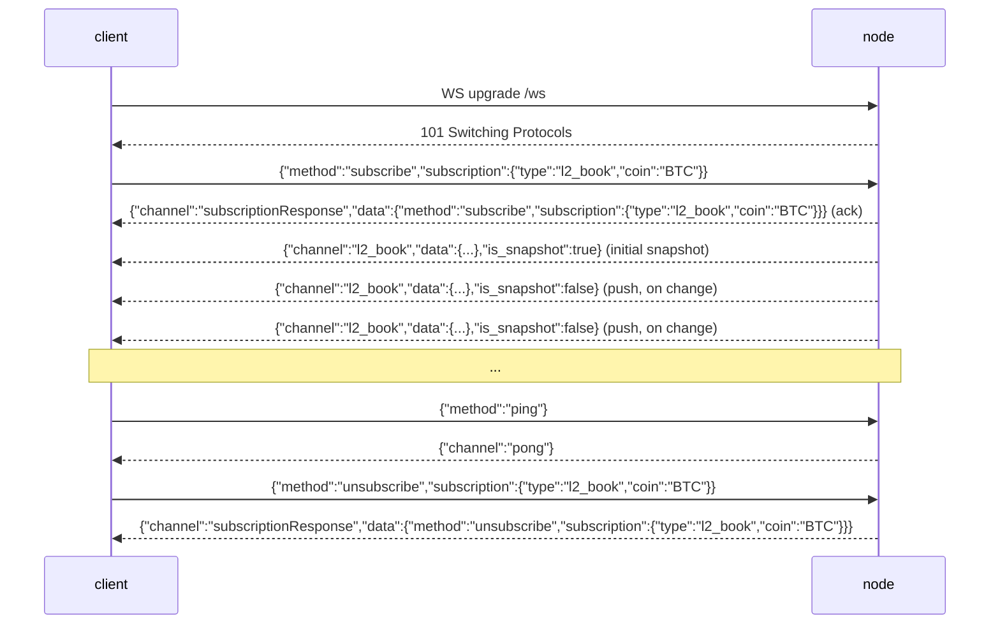

# WebSocket API

:::info
The node `/ws` surface pushes committed data. A channel emits a frame only when its state changed since the last commit. The surface also serves `post` (request and response over WS) and `ping` / `pong`. See [subscriptions](./subscriptions.md#channels-at-a-glance) for the channel list, the key of each channel and the frame shapes.
:::

:::info
Channel names are snake_case, for example `l2_book`, `bbo`, `trades`, `markets`, `fills` and `order_updates`. The gateway serves the same WS at `api.<net>.mtf.exchange/ws` and adds `candles`.
:::

## Overview {#tldr}

One WS connection carries subscriptions to many channels. The frame protocol uses the same shape as Hyperliquid (`{"method":"subscribe","subscription":{"type":...}}`). The channel names are snake_case (`l2_book`, `order_updates`).

1. The client sends a subscribe.
2. The server replies with a `subscriptionResponse` ack, then an initial snapshot.
3. The server pushes `{"channel":...,"data":...}` frames as state commits.

The book channels (`l2_book`, `bbo`) are per-market and need a `coin`. This page describes the connection lifecycle. [Subscriptions](./subscriptions.md) lists the channels.

## URL {#url}

```
wss://api.<net>.mtf.exchange/ws
```

The gateway serves the WS at `/ws` and terminates TLS (`wss://`). If you run the node yourself, it serves the same WS in plain text at `ws://localhost:8080/ws`. The frame protocol is the same in both cases.

:::warning
`candles` is a serving-layer channel. The node does not serve it, and it does not aggregate OHLCV. The gateway builds the bars from the `trades` feed of the node and its price-sample tape. Both serve every other channel on this page.

A `candles` subscribe sent directly to the node fails as an unknown channel. The node sends no `subscriptionResponse` ack:

```json
{"channel":"error","data":{"error":"unknown channel: candles"}}
```

An `unsubscribe` gets the same frame. Subscribe to `candles` through the gateway (`wss://api.<net>.mtf.exchange/ws`).
:::

## Connection lifecycle {#connection-lifecycle}


```mermaid
sequenceDiagram
    participant client
    participant node
    client->>node: WS upgrade /ws
    node-->>client: 101 Switching Protocols
    client->>node: {"method":"subscribe","subscription":{"type":"l2_book","coin":"BTC"}}
    node-->>client: {"channel":"subscriptionResponse","data":{"method":"subscribe","subscription":{"type":"l2_book","coin":"BTC"}}} (ack)
    node-->>client: {"channel":"l2_book","data":{...},"is_snapshot":true} (initial snapshot)
    node-->>client: {"channel":"l2_book","data":{...},"is_snapshot":false} (push, on change)
    node-->>client: {"channel":"l2_book","data":{...},"is_snapshot":false} (push, on change)
    Note over client,node: ...
    client->>node: {"method":"ping"}
    node-->>client: {"channel":"pong"}
    client->>node: {"method":"unsubscribe","subscription":{"type":"l2_book","coin":"BTC"}}
    node-->>client: {"channel":"subscriptionResponse","data":{"method":"unsubscribe","subscription":{"type":"l2_book","coin":"BTC"}}}
```

## Frames {#frames}

All frames are JSON text frames by default. The server rejects a binary frame from the client with an error frame, and the connection stays open. Inbound frames use the key `method`. Outbound frames use the key `channel`.

A connection that negotiates [compression](#websocket-compression-zstd) receives its data frames as binary frames. They hold the same JSON, compressed. Compression is opt-in. A client that offers no subprotocol receives text frames. Frames that you send stay text in every mode.

### `subscribe` {#subscribe}

```json
{
  "method": "subscribe",
  "subscription": { "type": "<channel>", "coin": "<coin>" }
}
```

- `subscription.type` (required): the channel name in snake_case, for example `l2_book`. An unknown name produces an error frame.
- `subscription.coin`: required for the per-market channels `l2_book`, `bbo` and `trades`. Omit it for the account channels. See [Coin parameter](#coin-parameter).

The server replies with two frames, in this order:

1. The ack:

```json
{
  "channel": "subscriptionResponse",
  "data": { "method": "subscribe", "subscription": { "type": "l2_book", "coin": "BTC" } }
}
```

2. An initial snapshot frame on the subscribed channel (see each channel in [subscriptions](./subscriptions.md)). For `l2_book` and `bbo`, this is a snapshot of the latest committed book. A channel with no live source yet sends an empty body that is still valid.

The server ignores a duplicate subscribe to the same `(type, coin)`. It sends no second ack and no error. Hyperliquid behaves the same way.

### `unsubscribe` {#unsubscribe}

```json
{ "method": "unsubscribe", "subscription": { "type": "l2_book", "coin": "BTC" } }
```

The ack mirrors the subscribe ack, with `method: "unsubscribe"`:

```json
{
  "channel": "subscriptionResponse",
  "data": { "method": "unsubscribe", "subscription": { "type": "l2_book", "coin": "BTC" } }
}
```

After the ack, no more frames arrive on that `(type, coin)` until you subscribe again. An unsubscribe for a `(type, coin)` that you never subscribed to does nothing. You still get the ack.

### `ping` / `pong` {#ping--pong}

```json
{ "method": "ping" }
```

```json
{ "channel": "pong" }
```

A bare `{"method":"ping"}` with no `subscription` is the application-level heartbeat. The server replies `{"channel":"pong"}`. The node also answers WebSocket control-frame pings (RFC 6455 `Ping`) with a `Pong`. Either heartbeat works.

### Error frame {#error-frame}

A malformed or unrecognized inbound frame produces an error frame. The connection stays open:

```json
{ "channel": "error", "data": { "error": "<reason>" } }
```

These inputs cause an error frame:

- Malformed JSON.
- A missing `method`.
- A missing `subscription` or `subscription.type`.
- An unknown channel name (`"unknown channel: <name>"`).
- A binary frame.
- An unknown method.

The client can correct the frame and retry on the same socket.

### Push messages {#push-messages}

All live data frames use one envelope:

```json
{ "channel": "<channel>", "data": { /* channel-specific */ }, "is_snapshot": false }
```

- `is_snapshot` is a boolean. It is `true` on the initial frame after a subscribe and `false` on later pushes.
- Every frame body is a full snapshot. For example, `l2_book` holds the full top 20 levels and `account_state` holds the full account state. `is_snapshot` is informational and never marks a diff. A client that replaces its local state on every frame stays correct and can ignore the field.
- The frame has no `seq`, `ts` or `sub_id` field. Demultiplex on `channel`. For per-market channels, also use the `coin` inside `data`.

Updates are change-driven. After each commit, the node publishes a frame for a subscribed channel only when the committed state of that channel changed since the previous commit. A commit that leaves a watched channel unchanged emits nothing for it. You receive fewer frames than blocks, and never a repeat of unchanged data (see [Per-subscriber push](#per-subscriber-push)).

### `post` (request/response over WS) {#post-requestresponse-over-ws}

A `post` is a one-shot request and response on the same socket. It replaces a separate [`POST /exchange`](../rest/exchange.md) connection for each action. The gateway carries it, so the public endpoint answers it today. You can place and cancel orders over the socket.

The `request` body is the same `{type, payload}` envelope that the REST routes accept. The same handlers process it as `POST /info` and `POST /exchange`, including signature verification on actions. The validator and the gateway serve the same shapes.

Request:

```json
{
  "method": "post",
  "id": 42,
  "request": { "type": "info", "payload": { "type": "fee_schedule" } }
}
```

The response carries the same `id`:

```json
{
  "channel": "post",
  "data": {
    "id": 42,
    "response": { "type": "info", "payload": { /* same body as POST /info */ } }
  }
}
```

- `request.type` is `"info"` or `"action"`.
- For `"action"`, `payload` must be a full signed-exchange envelope: `signature`, `nonce` and `action`, plus the optional [`expires_after`](../rest/exchange.md#optional-action-expiry-expiresafter). It is identical to [`POST /exchange`](../rest/exchange.md). The signature covers the compact `serde_json` serialization of the `action` object. This is the deterministic canonical form that the SDK pins.
- An error comes back as a normal `post` frame with `response.type: "error"` and a string `payload`. The connection stays open:

```json
{ "channel": "post", "data": { "id": 42, "response": { "type": "error", "payload": "<message>" } } }
```

A well-formed action that the node refuses is not an `error`-type response. It comes back as a normal `action` response. Its `payload` is the REST [rejection envelope](../rest/exchange.md#rejection-envelope): `{"error": {"code": …, "message": …}}`. A bad signature reads `AUTH_BAD_SIGNATURE` there. Neither this lane nor REST has an `accepted` field. The presence of `error` marks the refusal.

## WebSocket compression (zstd) {#websocket-compression-zstd}

Compression is opt-in and applies to one connection. The client asks for it in the WebSocket handshake, and the server answers in the same handshake. Market-data frames compress well because they repeat a small set of keys, coins and price shapes. Expect a large reduction on `l2_book`, which uses most of the bytes of a normal client.

Compression is a gateway feature. A socket that connects directly to the node (`ws://localhost:8080/ws`) selects no subprotocol and sends text frames.

### Negotiation {#compression-negotiation}

Offer subprotocols on connect in the `Sec-WebSocket-Protocol` request header. Use this order of preference:

| Token | Meaning |
| --- | --- |
| `mtf-zstd.v1.d<id>` | zstd with dictionary `<id>`. Offer it only if you hold those dictionary bytes. |
| `mtf-zstd.v1` | zstd, no dictionary. |

The server echoes one token in the `Sec-WebSocket-Protocol` response header, or echoes nothing. That answer sets the mode:

| Server selects | Data frames you receive |
| --- | --- |
| `mtf-zstd.v1.d<id>` | binary, zstd, compressed with dictionary `<id>` |
| `mtf-zstd.v1` | binary, zstd, no dictionary |
| nothing | text, plain JSON |

In a browser:

```js
const ws = new WebSocket("wss://api.<net>.mtf.exchange/ws", [
  "mtf-zstd.v1.d1a2b3c4",
  "mtf-zstd.v1",
]);
ws.onopen = () => console.log(ws.protocol); // "" when the server selects nothing
```

The handshake carries the mode because the answer of the server arrives before the first frame. You know the mode up front. You never guess it from the bytes of the first frame, and your `subscribe` messages never race it.

Compression is opt-in because an existing client drops a binary frame that it does not expect. A client that offers nothing always receives plain JSON text frames. Compression never reaches a client that did not ask for it.

### Frame format {#compression-frame-format}

The WebSocket opcode sets the rule. The channel does not.

- A binary frame is one standard zstd frame. Decompress it. The result is the JSON text that you receive without compression, with the same envelope, fields and bytes.
- A text frame is plain JSON. Parse it.

Handle both on any channel. Do not build a table for each channel.

The rule uses the opcode because the set of frames that the server compresses can change. The opcode always tells you what to do with the bytes in your hand, so your client stays correct across a change.

Control frames stay text in every mode: `subscriptionResponse`, `error`, `pong` and `post` replies. They are small and have a request and response shape, so compression gains nothing on them.

Frames that you send stay text in every mode. The server still rejects an inbound binary frame with an [error frame](#error-frame). There is no inbound compression, so a binary frame from a client is a client defect.

### Dictionary {#compression-dictionary}

Fetch the dictionary over HTTP from the same host:

```
GET /ws/dict
```

| Part | Value |
| --- | --- |
| Body | the dictionary bytes |
| `Content-Type` | `application/octet-stream` |
| `x-mtf-dict-id` | the dictionary id |
| `ETag` | `"<id>"`, the same id in quotes |

The id is the first 8 lowercase hex characters of the SHA-256 of the dictionary bytes. It is a content hash, so an id names exactly one set of bytes.

Client flow:

1. `GET /ws/dict`. Read `x-mtf-dict-id`.
2. Cache the bytes under that id.
3. Connect, and offer `mtf-zstd.v1.d<id>` first, then `mtf-zstd.v1`.
4. When the server selects the dict token, load the cached bytes into your zstd
   decoder for that connection.

A frame is small, so a compressor finds little to learn inside it. The dictionary holds the shared structure: the envelope keys, the coin names and the common price and size shapes. Each frame then carries only what is new in that frame.

A dictionary-compressed frame also carries the 4-byte dictionary id of zstd in the standard frame header. Your zstd decoder checks it for you. The two ids have different jobs. The 8-hex id travels in the handshake and the HTTP headers, so it costs no bytes for each frame. The in-frame id is a check at decode time only.

### Degradation without corruption {#compression-degradation}

If the id in your dict token is not the current id of the server, the token matches nothing. The server selects `mtf-zstd.v1` instead. You still get zstd without the dictionary. Every frame stays decodable, with a weaker ratio.

The choice happens once, at the handshake. A dictionary-compressed frame cannot be decoded without those exact dictionary bytes, so the server decides before it sends any frame. There is no fallback for each frame, and the dictionary never changes during a connection.

If you offered a dict token and the server selected the plain token, your dictionary is stale. Fetch `GET /ws/dict` again and use the new id on your next connect. A reconnect right after a gateway upgrade can run without the dictionary until you fetch it again. This costs ratio and never loses data.

### Per-account channels {#compression-per-account-channels}

Account frames (`fills`, `order_updates` and the other account channels) use the same public dictionary as every other frame. The compression path does not look at the channel.

The dictionary is trained on public market channels only. It is never trained on account data. A zstd dictionary holds literal byte sequences from its training samples, and the server publishes it to every client. A dictionary trained on account channels would show the balances, positions and order flow of one account to everyone.

Using the public dictionary on your private frames is safe. The compressed output is only your own frame, on your own subscription. The dictionary adds only bytes that are already public.

An account frame gains less than a book frame, because the public dictionary knows less about its content. This affects the ratio only. It is not a limit.

## Coin parameter {#coin-parameter}

The fanout hub uses the key `(channel, coin)`. For the per-market channels `l2_book` and `bbo`, this has two effects:

- `coin` is required. Without it, you land in the coinless `(channel, None)` bucket. The per-market book publisher never writes to that bucket, so you receive only the initial empty snapshot and no live updates.
- A `BTC` subscriber receives only `BTC` frames. An ETH commit never reaches a BTC subscription, and the reverse is also true.

The node converts `coin` to an asset-id string before it builds the key. Three forms resolve to the same bucket:

- A numeric asset id, for example `"0"` or `"7"`, maps directly to that market. This is the canonical key. A spot pair id works the same way.
- A symbol, for example `"BTC"`, resolves against the committed universe (`mip3_market_specs`, matching on `symbol` or `asset_name`) to its asset id.
- A spot pair name, for example `"BTC/USDC"`, resolves against the registered spot pairs to its pair id. Then `l2_book` and `bbo` stream spot depth for the pair, in the tick and size planes of the pair.

A subscriber keyed by `"BTC"` and one keyed by the numeric id `"0"` (if BTC is asset 0) share the same routing bucket for the publish on each commit. A coin that is neither numeric nor a known universe symbol stays as its own bucket. You get the ack and an empty snapshot but never live frames. This reports an unknown market and does not invent a mapping.

## Per-subscriber push {#per-subscriber-push}

Pushes depend on subscribers, apply to one market and follow changes. After each committed block, the node checks `has_receivers(channel, coin)` for each market. This is an O(1) lookup. Only then does it aggregate the book of that market. It broadcasts the book only if the book changed since the previous commit. This has four effects:

- A market that nobody watches costs only the O(1) check. The node builds no book.
- A `BTC` subscriber never triggers an `ETH` book build.
- A market whose book did not change on a commit broadcasts nothing for that commit.
- The node delivers frames to every current subscriber of that `(channel, coin)` bucket.

## Backpressure & lag {#backpressure--lag}

Each subscription uses a bounded broadcast ring buffer with a capacity of 256 frames. The server drops a consumer that falls more than 256 frames behind. It sends a final error frame that describes the lag, then stops forwarding on that subscription.

```json
{ "channel": "error", "data": { "error": "lagged behind broadcast by <n> messages" } }
```

On this signal, subscribe again. You get a fresh snapshot. The node never skips ahead silently, because a gap in book state is worse than an explicit drop on a derivatives chain.

## Authentication {#authentication}

The public market channels (`l2_book`, `bbo`, `trades`, `markets`) need no authentication.

The account channels (`fills`, `order_updates`) are live and route by the 0x `user` address. They have no authentication gate yet. Any connection can subscribe to the feed of any address. The data is the same public committed fills, keyed by account. An authentication envelope at subscribe time, so that a connection sees only its own account, is planned. For authenticated reads and writes today, use the `post` channel. It serves info reads, and it checks signed actions with the same EIP-712 verification as `POST /exchange`. See [subscriptions](./subscriptions.md).

## Multiplexing {#multiplexing}

One connection can hold many subscriptions. The `(channel, coin)` pair identifies each one. Each subscription has its own broadcast receiver and forwarder task. The connection interleaves their frames on the one socket. Route inbound frames by `channel` and the `coin` inside `data`.

```
l2_book  coin "0" (BTC)
l2_book  coin "1" (ETH)
bbo      coin "0" (BTC)
```

## Close behavior {#close-behavior}

- A client `close` frame or EOF ends the connection and aborts every forwarder task.
- A read error is logged and closes the connection.
- The server drops a lagging subscription on its own and sends an error frame. The connection stays open, and the other subscriptions on it keep flowing.

There is no custom close-code table today. Standard WebSocket close codes apply.

## Reconnect strategy {#reconnect-strategy}

1. On disconnect, reconnect with exponential backoff. Suggested values: base 200 ms, maximum 30 s, jitter ±20%.
2. Subscribe again to each `(type, coin)`. The first frame after each subscribe is a fresh snapshot, so there is no resume token to manage. Discard the local book state and rebuild it from the snapshot.
3. On a `lagged` error frame, treat the subscription as disconnected and subscribe again.

:::warning
There is no `seq`, `resume` or `resume_token` mechanism today. Every subscribe starts from a fresh snapshot. Resume buffers are planned and not implemented.
:::

## See also {#see-also}

- [WS subscriptions catalog](./subscriptions.md)
- [`POST /exchange`](../rest/exchange.md): the EIP-712 envelope that the `post` action path uses.
- [`POST /info`](../rest/info.md): the REST equivalents for one-shot reads. `post` also reaches them.
