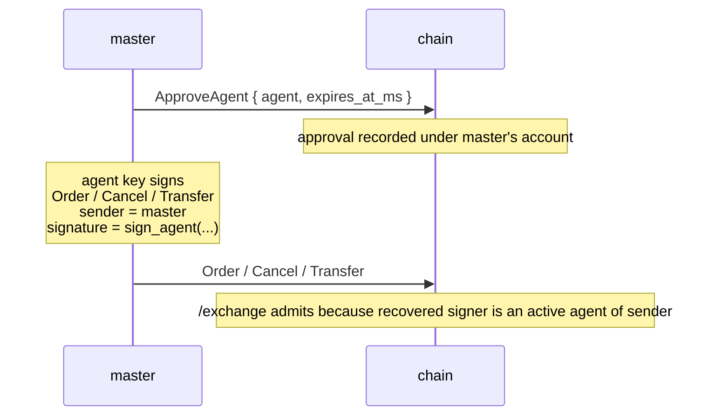

# Agent wallets

:::tip
**Stable.**
:::

An **agent wallet** (a.k.a. "API wallet") is a key that signs trading actions on behalf of a master account without ever holding withdrawal authority. It's how every serious market maker actually operates: the master key stays in cold storage, a hot key runs the bots.

Same primitive as the dominant on-chain perp DEX's API wallets. Drop-in compatible at the protocol level.

## Why use one {#why-use-one}

- **Cold-storage master.** Approve once from cold, then never sign again from the high-value key.
- **Per-bot scoping.** Different agents per strategy or per machine; revoke the one that gets compromised without touching the others.
- **Expiry.** Approve with an expiry timestamp; the key dies on its own even if you forget to revoke.
- **Audit.** Every action is signed by a specific agent, so the chain log is forensically clean.

## The lifecycle {#the-lifecycle}



The master signs `ApproveAgent` once. After that block commits, the agent can sign any action with `sender = master_addr` and the chain treats it as if the master signed it. Approvals can carry an explicit expiry so hot keys self-retire even if you never explicitly revoke them.

## The authorization check {#the-authorization-check}

Every request to [`POST /exchange`](../api/rest/exchange.md) carries three pieces:

```
sender    = "0x<claimed master address>"
signature = secp256k1 ECDSA over the EIP-712 envelope
action    = the state-mutating action
```

The chain runs this check on every admission:

```
recovered_addr = ecrecover(eip712_envelope(action), signature)

if recovered_addr == sender:
    admit                                # master signed
else if recovered_addr is an active agent of sender (not expired):
    admit                                # an active agent of sender signed
else:
    return 401
```

Two consequences worth highlighting:

1. **No bearer tokens, no API keys.** The signature itself IS the authentication. Possession of an agent's private key is what proves authority; nothing about the request URL or headers grants access.
2. **`sender` is server-trusted only because of the signature.** Saying `sender = anyone` proves nothing until the recovered signer matches that account's approved set.

## EIP-712 envelope, in detail {#eip-712-envelope-in-detail}

The signed payload for any action is:

```
message_hash  = keccak256( msgpack(action) )
signed_hash   = keccak256( 0x1901 ‖ domain_separator ‖ message_hash )
signature     = secp256k1_sign( signed_hash, agent_private_key )
```

where:

```
domain_separator = keccak256(
    keccak256("EIP712Domain(string name,string version,uint256 chainId,address verifyingContract)") ‖
    keccak256("MetaFlux") ‖
    keccak256("1") ‖
    chain_id_as_uint256_be ‖
    address(0).padded_to_32
)
```

This composition matches EIP-712 standard envelope semantics; clients on the EVM stack that already speak EIP-712 (MetaMask, Rabby, Ledger, WalletConnect) can be pointed at this domain unmodified.

`action` is signed as **EIP-712 structured typed data** — one primary type per action variant (`MetaFluxTransaction:<Action>`), so wallets render each field by name. See [typed-data signing](../integration/typed-data-signing.md) for the per-action type strings. Signature recovery and EVM-compat are unchanged whether the master or an approved agent signs.

## What the chain stores {#what-the-chain-stores}

Per master account, an approved-agent set:

```
approval = {
  agent          : address (20 bytes),
  approved_at_ms : u64 (block time at approval),
  expires_at_ms  : u64 or null (null = no expiry),
  name           : optional label for bookkeeping
}
```

All time fields are consensus-derived block time, not wall clock. Determinism: every validator agrees on agent status at the same block height.

## Approving an agent {#approving-an-agent}

The master submits an `ApproveAgent` action via [`POST /exchange`](../api/rest/exchange.md):

```json
{
  "sender":    "0x<master_addr>",
  "signature": "0x<master_signature>",
  "action": {
    "type": "ApproveAgent",
    "params": {
      "agent":          "0x<agent_addr>",
      "expires_at_ms":  1735689600000,
      "name":           "trading-bot-1"
    }
  }
}
```

`expires_at_ms`:
- `null` → no expiry (lives until explicitly retired)
- a positive integer → unix ms after which the chain rejects agent-signed requests

`name` is purely a label for your own bookkeeping — show it back in `userState` / `subAccounts` info queries.

## Trading from the agent {#trading-from-the-agent}

After the approval block commits, sign anything with the **agent's** key but submit with the **master's** address as `sender`. Your SDK handles the EIP-712 envelope and submits the signed bundle. The chain recovers the agent's address from the signature, sees the mismatch with `sender`, checks the approval set, and admits.

## Propagation delay {#propagation-delay}

After `ApproveAgent` commits at block height `H`:
- requests in block `H+1` and later see the new approval

In practice this means: wait one consensus tick after sending `ApproveAgent` before starting agent-signed traffic. SDK retry policy with linear backoff handles the boundary cleanly.

Tightening expiry (effectively retiring an agent) follows the same one-block delay.

## Rotation and expiry {#rotation-and-expiry}

Two ways an agent stops being effective:

- **Expiry** is set at approval time and is self-executing — once `now > expires_at_ms`, requests fail. You don't need to send anything else.
- **Re-approval** with a tightened expiry. Submitting a new `ApproveAgent` for the same agent address overwrites the previous record; setting `expires_at_ms` to the past effectively retires the key.

For routine rotation, prefer expiry. The SDKs handle the renewal cadence transparently.

## Replay protection {#replay-protection}

The chain enforces per-user nonces:

- Each action carries a `nonce`
- Reusing a nonce against the same user is rejected even if the signature is otherwise valid

Practical implication: the same agent can submit concurrent actions safely as long as each carries a unique nonce. SDKs typically use unix-ms-with-jitter.

For agent-signed requests, the nonce space is keyed off the **master** (`sender`), not the agent. Two different agents of the same master share the nonce space.

## Production checklist {#production-checklist}

Battle-tested patterns for running an agent-key fleet in production:

| Item | Why |
|------|-----|
| Master in cold storage (hardware wallet / HSM) | Master only signs `ApproveAgent` (and `WithdrawUsdc` on withdrawals) — rare events |
| One agent per host / container | If a host is compromised, only that agent's authority is exposed; revoke without touching others |
| `expires_at_ms` set to ≤ 30 days from approval | Forces a renewal cadence; missed renewals are auto-revoke |
| Agent name encodes the host + start time | Makes audit forensics trivial: `mm-host-3 / 2026-Q2` |
| Rotation script: pre-stage new agent before old expires | Submit `ApproveAgent` for new key 24h before old expiry; switch traffic; let old expire |
| Compromise drill: revoke + rotate runbook tested quarterly | When a key actually leaks, mechanical execution matters |
| Watch `userEvents` for `agentApproved` / `agentExpired` events | Confirm chain-side state matches your expectation |
| Use a different agent for cancel-only vs full trading | Cancel-only keys are safer in semi-trusted environments |

### Rotation pattern {#rotation-pattern}

```
day -1   submit ApproveAgent { agent: new_key, expires_at_ms: NOW + 30d }
          wait 1 block (consensus tick); confirm via /info agents
day 0    flip traffic in your bot: stop using old_key, start using new_key
day 0    submit ApproveAgent { agent: old_key, expires_at_ms: NOW + 1h }
          to bound the old key's remaining authority window
day +1h  old_key expires automatically
```

The pre-stage avoids any window where both keys could be used in parallel
(which is also fine — concurrent agents share the master's nonce space).

## What an agent cannot do {#what-an-agent-cannot-do}

By design, agents have **no withdrawal authority**. Anything that moves funds out of the master account (withdrawals to external chains, transfers to other addresses) must be signed by the master key. Agent management itself (creating or extending approvals) is also master-only — no agent-of-agent recursion.

Agents *can* trade, cancel, modify margin mode within bounds, place / cancel TWAP, and most ordinary trading flow.

## Failure cases {#failure-cases}

| Symptom | Cause | Fix |
|---------|-------|-----|
| `401` on every agent-signed request | Approval hasn't committed yet | Wait one block after `ApproveAgent` |
| `401` after a known-good period | Agent expired | Approve again (new expiry) or rotate to a fresh agent |
| `401` only on withdraw actions | Agents can't withdraw (by design) | Sign with the master key for withdrawals |
| `401` immediately on a fresh master | `sender` claimed as master but signer was someone else and no approval exists | Sanity-check that you're signing with the right key |

## See also {#see-also}

- [`POST /exchange`](../api/rest/exchange.md) — the admission path
- [Signing walkthrough](../integration/signing.md) — concrete EIP-712 example end-to-end
- [Migrating from HL](../integration/migrating-from-hl.md) — drop-in patterns for HL bots
