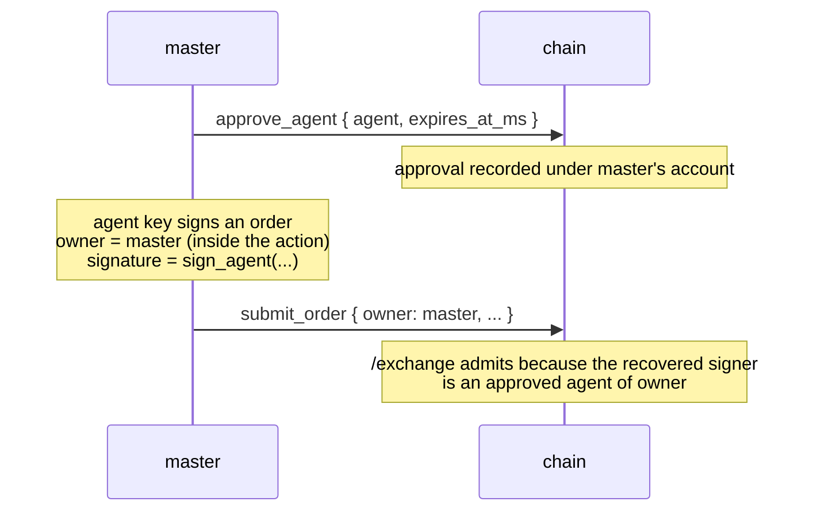

# Agent wallets

:::tip
**Stable.**
:::

An **agent wallet** (a.k.a. "API wallet") is a key that signs trading actions on behalf of a master account without ever holding withdrawal authority. It's how every serious market maker actually operates: the master key stays in cold storage, a hot key runs the bots.

Same primitive as the dominant on-chain perp DEX's API wallets. Drop-in compatible at the protocol level.

## Why use one {#why-use-one}

- **Cold-storage master.** Approve once from cold, then never sign again from the high-value key.
- **Per-bot scoping.** Different agents per strategy or per machine; revoke the one that gets compromised without touching the others.
- **Expiry.** Approve with an expiry timestamp; the key dies on its own even if you forget to revoke.
- **Audit.** Every action is signed by a specific agent, so the chain log is forensically clean.

## The lifecycle {#the-lifecycle}


```mermaid
sequenceDiagram
    participant master
    participant chain
    master->>chain: approve_agent { agent, expires_at_ms }
    Note over chain: approval recorded under master's account
    Note over master: agent key signs an order<br/>owner = master (inside the action)<br/>signature = sign_agent(...)
    master->>chain: submit_order { owner: master, ... }
    Note over chain: /exchange admits because the recovered signer<br/>is an approved agent of owner
```

The master signs `approve_agent` once. After that block commits, the agent key
signs order actions. Approvals can carry an expiry, so hot keys retire themselves
even if you never revoke them.

## The authorization check {#the-authorization-check}

:::warning
**An agent is not a general proxy for the master.** An agent can sign an action
**only** if that action carries an `owner` field. Order, cancel, amend and margin
actions carry one. Fund movement and account control do not. See
[what an agent cannot do](#what-an-agent-cannot-do).
:::

A request to [`POST /exchange`](../api/rest/exchange.md) carries three pieces:

```
action    = the state-mutating action
nonce     = per-account replay nonce
signature = secp256k1 ECDSA over the EIP-712 typed-data digest
```

**There is no top-level `sender` field.** The chain reads the account from the
action body, then runs one of two checks.

```
recovered_addr = ecrecover(eip712_typed_digest(action), signature)

if action has an `owner` field:                 # e.g. submit_order, batch_order
    if recovered_addr == owner:            admit    # master signed
    elif recovered_addr is an approved,
         unexpired agent of owner:         admit    # agent signed for master
    else:                                  401

else:                                           # e.g. mb_withdraw, approve_agent
    account = recovered_addr                    # the signer IS the account
```

Three consequences worth highlighting:

1. **No bearer tokens, no API keys.** The signature is the authentication.
   Possession of the agent's private key proves the authority. Nothing in the URL
   or the headers grants access.
2. **The agent claim rides inside the action.** You name the master at `owner`
   (or at `params.owner` on a batch). Claiming an `owner` proves nothing until the
   recovered signer matches that account or its approved agent set.
3. **An owner-less action signed by an agent does not fail.** It acts on the
   agent's own account. See [what an agent cannot do](#what-an-agent-cannot-do).

## EIP-712 envelope, in detail {#eip-712-envelope-in-detail}

The signed payload for any action is:

```
struct_hash   = keccak256( eip712_encode(action) )   # per-action typed struct
signed_hash   = keccak256( 0x1901 ‖ domain_separator ‖ struct_hash )
signature     = secp256k1_sign( signed_hash, agent_private_key )
```

:::warning
**`struct_hash` is EIP-712 typed-data encoding, not a serialization of the JSON
you post.** Each action has its own frozen type string, and the digest binds only
the fields that type string names. A field the type string omits is unsigned. Use
your SDK's digest builder; do not hash the request body.
:::

where:

```
domain_separator = keccak256(
    keccak256("EIP712Domain(string name,string version,uint256 chainId,address verifyingContract)") ‖
    keccak256("MetaFlux") ‖
    keccak256("1") ‖
    chain_id_as_uint256_be ‖
    address(0).padded_to_32
)
```

This composition matches EIP-712 standard envelope semantics; clients on the EVM stack that already speak EIP-712 (MetaMask, Rabby, Ledger, WalletConnect) can be pointed at this domain unmodified.

`action` is signed as **EIP-712 structured typed data** — one primary type per action variant (`MetaFluxTransaction:<Action>`), so wallets render each field by name. See [typed-data signing](../integration/typed-data-signing.md) for the per-action type strings. Signature recovery and EVM-compat are unchanged whether the master or an approved agent signs.

## What the chain stores {#what-the-chain-stores}

Per master account, an approved-agent set:

```
approval = {
  agent          : address (20 bytes),
  approved_at_ms : u64 (block time at approval),
  expires_at_ms  : u64 or null (null = no expiry),
  name           : optional label for bookkeeping
}
```

All time fields are consensus-derived block time, not wall clock. Determinism: every validator agrees on agent status at the same block height.

:::tip
**A vault operator is an agent of the VAULT, not of the leader.** A
Metaliquidity vault leader registers a strategy key with
`register_metaliquidity_operator`, and the chain writes that key into the VAULT
address's own approved-agent set — the same set this page describes. So an
operator signs an order whose `owner` is the vault address, and the
authorization check below resolves it with no special case.

The practical consequence: **do not require `owner == signer` in a client.** That
equality is not the chain's rule, and enforcing it locally makes the vault lane
unreachable. Read the vault's agents with
`{"type":"account_state","address":"<vault>","detail":"overview"}`
if you want to check before signing.
:::

## Approving an agent {#approving-an-agent}

The master submits an [`approve_agent`](../api/rest/exchange.md#approve_agent)
action via [`POST /exchange`](../api/rest/exchange.md). Sign it with the
**master** key: the action has no `owner`, so the signer becomes the approving
account.

```json
{
  "signature": "0x<master_signature>",
  "nonce": 1735689600001,
  "action": {
    "type": "approve_agent",
    "params": {
      "agent":          "0x<agent_addr>",
      "expires_at_ms":  1735689600000,
      "name":           "trading-bot-1"
    }
  }
}
```

`expires_at_ms`:
- `null` → no expiry (lives until explicitly retired)
- a positive integer → unix ms after which the chain rejects agent-signed requests

`name` is purely a label for your own bookkeeping — show it back in `userState` / `subAccounts` info queries.

## Trading from the agent {#trading-from-the-agent}

After the approval block commits, sign the action with the **agent's** key and
name the master at `owner` inside the action body. There is no `sender` field to
set. Your SDK builds the EIP-712 digest and submits the signed bundle. The chain
recovers the agent's address, sees it differs from `owner`, checks the master's
approval set, and admits.

```json
{
  "signature": "0x<agent_signature>",
  "nonce": 1735689600002,
  "action": {
    "type": "submit_order",
    "order": {
      "owner":    "0x<master_addr>",
      "market":   0,
      "side":     "bid",
      "kind":     "limit",
      "size":     10000,
      "limit_px": 5000000000000,
      "tif":      "gtc",
      "stp_mode": "cancel_oldest",
      "reduce_only": false
    }
  }
}
```

On [`batch_order`](../api/rest/exchange.md#batch_order) the routing `owner` sits
at `params.owner`, the batch level. The per-leg `owner` is ignored.

## Propagation delay {#propagation-delay}

After `approve_agent` commits at block height `H`:
- requests in block `H+1` and later see the new approval

In practice this means: wait one consensus tick after sending `approve_agent` before starting agent-signed traffic. SDK retry policy with linear backoff handles the boundary cleanly.

Tightening expiry (effectively retiring an agent) follows the same one-block delay.

## Rotation and expiry {#rotation-and-expiry}

Two ways an agent stops being effective:

- **Expiry** is set at approval time and is self-executing — once `now > expires_at_ms`, requests fail. You don't need to send anything else.
- **Re-approval** with a tightened expiry. Submitting a new `approve_agent` for the same agent address overwrites the previous record; setting `expires_at_ms` to the past effectively retires the key.

For routine rotation, prefer expiry. The SDKs handle the renewal cadence transparently.

## Replay protection {#replay-protection}

The chain enforces per-user nonces:

- Each action carries a `nonce`
- Reusing a nonce against the same user is rejected even if the signature is otherwise valid

Practical implication: the same agent can submit concurrent actions safely as long as each carries a unique nonce. SDKs typically use unix-ms-with-jitter.

For agent-signed requests, the nonce space is keyed off the **master** (the resolved account), not the agent. Two different agents of the same master share the nonce space.

## Production checklist {#production-checklist}

Battle-tested patterns for running an agent-key fleet in production:

| Item | Why |
|------|-----|
| Master in cold storage (hardware wallet / HSM) | The master signs `approve_agent` and withdrawals (`mb_withdraw`) — rare events |
| One agent per host / container | If a host is compromised, only that agent's authority is exposed; revoke without touching others |
| `expires_at_ms` set to ≤ 30 days from approval | Forces a renewal cadence; missed renewals are auto-revoke |
| Agent name encodes the host + start time | Makes audit forensics trivial: `mm-host-3 / 2026-Q2` |
| Rotation script: pre-stage new agent before old expires | Submit `approve_agent` for the new key 24h before the old expiry; switch traffic; let the old key expire |
| Compromise drill: revoke + rotate runbook tested quarterly | When a key actually leaks, mechanical execution matters |
| Poll `/info` `account_state` with `detail: "overview"` after every approval / rotation | Confirm chain-side state matches your expectation — there is no live event for an agent-approval change |
| Use a different agent for cancel-only vs full trading | Cancel-only keys are safer in semi-trusted environments |

### Rotation pattern {#rotation-pattern}

```
day -1   submit approve_agent { agent: new_key, expires_at_ms: NOW + 30d }
          wait 1 block (consensus tick); confirm via /info agents
day 0    flip traffic in your bot: stop using old_key, start using new_key
day 0    submit approve_agent { agent: old_key, expires_at_ms: NOW + 1h }
          to bound the old key's remaining authority window
day +1h  old_key expires automatically
```

The pre-stage avoids any window where both keys could be used in parallel
(which is also fine — concurrent agents share the master's nonce space).

## What an agent cannot do {#what-an-agent-cannot-do}

An agent can sign an action **only if that action carries an `owner` field**.
That is the whole rule. It gives agents the trading surface and nothing else.

**An agent can sign these, and only these:**

| Group | Actions |
|-------|---------|
| Perp orders | `submit_order`, `batch_order`, `scale_order`, `chase_order`, `twap_order` |
| Cancels | `cancel_order`, `batch_cancel`, `cancel_by_cloid`, `cancel_all_orders`, `cancel_scale`, `cancel_chase`, `twap_cancel`, `schedule_cancel` |
| Amends | `modify`, `batch_modify` |
| Spot | `spot_order`, `spot_cancel` |
| Margin | `update_leverage`, `update_isolated_margin`, `top_up_isolated_only_margin`, `set_position_mode` |
| Specialist venues | `rfq_request`, `rfq_quote`, `rfq_accept`, `fba_submit` |

**Everything else is master-key work**, including every withdrawal and transfer
(`mb_withdraw`, `core_evm_transfer`, `send_asset`, `usd_class_transfer`), every
vault action, Earn and spot-margin, staking, sub-accounts, multi-sig conversion,
`approve_broker_fee`, `set_referrer`, `set_display_name`, portfolio-margin
enrolment, and `approve_agent` itself. There is no agent-of-agent recursion.

:::danger
**An agent-signed master-only action does not return `401`. It silently acts on
the agent's own account.**

Those actions have no `owner` field, so the chain treats the recovered signer as
the account. An agent-signed `mb_withdraw` tries to withdraw the **agent's**
balance — normally zero, so it fails for the wrong reason or moves the wrong
funds. An agent-signed `approve_agent` approves a sub-agent **of the agent**, and
grants nothing over the master.

Never route a master-only action through an agent key and never treat its success
as proof the master acted.
:::

## Failure cases {#failure-cases}

| Symptom | Cause | Fix |
|---------|-------|-----|
| `401 signer is neither the owner nor an approved agent` on every request | The approval has not committed yet | Wait one block after `approve_agent` |
| The same `401` after a known-good period | The agent expired | Approve again with a new expiry, or rotate to a fresh agent |
| The same `401` from the first request | The signing `chainId` does not match the node, so recovery returns a different address | Read `chain_id` from `/info` `node_info` and sign against it |
| A withdrawal or transfer "succeeds" but the master's balance is unchanged | A master-only action was signed by the agent key, so it acted on the **agent's** account | Sign every master-only action with the master key. See [what an agent cannot do](#what-an-agent-cannot-do) |
| `400 action carries no owner` | The action needs an `owner` and none was sent | Set `owner` (or `params.owner` on a batch) |

## See also {#see-also}

- [`POST /exchange`](../api/rest/exchange.md) — the admission path
- [Signing walkthrough](../integration/signing.md) — concrete EIP-712 example end-to-end
- [Migrating from HL](../integration/migrating-from-hl.md) — drop-in patterns for HL bots
