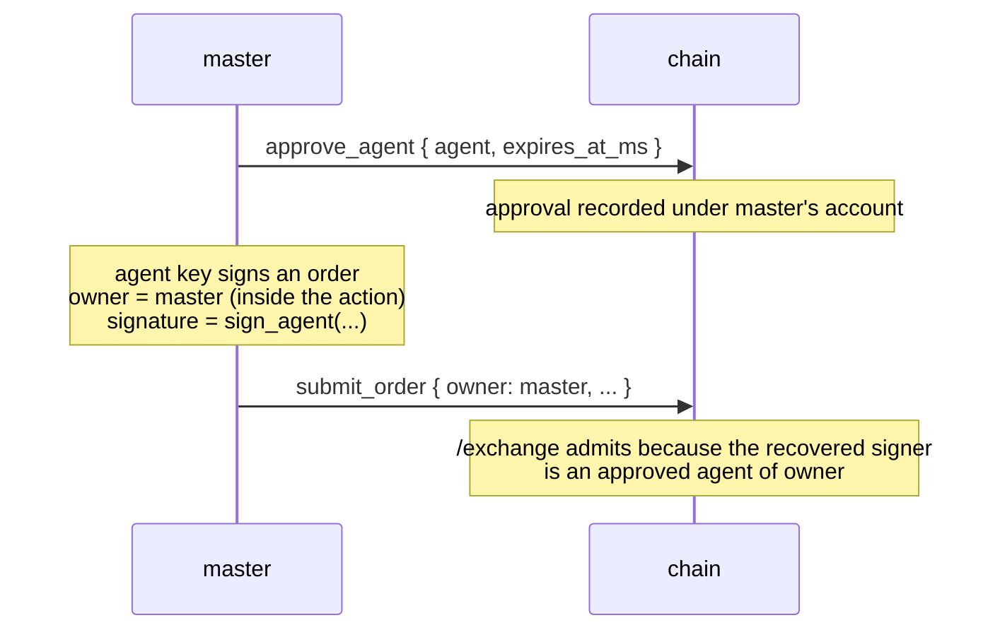

# Agent wallets

An agent wallet is a key that signs trading actions for a master account. This page describes how to approve, use and rotate one.

:::tip
**Stable.**
:::

An **agent wallet**, also called an "API wallet", is a key that signs trading actions for a master account. It never has withdrawal authority. Market makers use this setup: the master key stays in cold storage, and a hot key runs the bots.

The agent wallet is the same primitive as the API wallets of the dominant on-chain perp DEX. It is a drop-in match at the protocol level.

## Benefits {#why-use-one}

- **Cold-storage master.** Approve once from the cold key. After that, the high-value key does not sign again.
- **Per-bot scope.** Use a different agent for each strategy or each machine. If one agent is compromised, revoke it and leave the others.
- **Expiry.** Approve with an expiry timestamp. The key stops working on its own, even if you do not revoke it.
- **Audit.** A specific agent signs each action, so the chain log shows which key did what.

## The lifecycle {#the-lifecycle}


```mermaid
sequenceDiagram
    participant master
    participant chain
    master->>chain: approve_agent { agent, expires_at_ms }
    Note over chain: approval recorded under master's account
    Note over master: agent key signs an order<br/>owner = master (inside the action)<br/>signature = sign_agent(...)
    master->>chain: submit_order { owner: master, ... }
    Note over chain: /exchange admits because the recovered signer<br/>is an approved agent of owner
```

The master signs `approve_agent` once. After that block commits, the agent key
signs order actions. An approval can have an expiry, so a hot key retires itself
even if you never revoke it.

## The authorization check {#the-authorization-check}

:::warning
An agent is not a general proxy for the master. An agent can sign an action only
if that action has an `owner` field. Order, cancel, amend and margin actions
have one. Fund movement and account control do not. See
[what an agent cannot do](#what-an-agent-cannot-do).
:::

A request to [`POST /exchange`](../api/rest/exchange.md) has three parts:

```
action    = the state-mutating action
nonce     = per-account replay nonce
signature = secp256k1 ECDSA over the EIP-712 typed-data digest
```

There is no top-level `sender` field. The chain reads the account from the
action body, then runs one of two checks.

```
recovered_addr = ecrecover(eip712_typed_digest(action), signature)

if action has an `owner` field:                 # e.g. submit_order, batch_order
    if recovered_addr == owner:            admit    # master signed
    elif recovered_addr is an approved,
         unexpired agent of owner:         admit    # agent signed for master
    else:                                  401

else:                                           # e.g. bridge_withdraw, approve_agent
    account = recovered_addr                    # the signer IS the account
```

This has three results:

1. There are no bearer tokens and no API keys. The signature is the
   authentication. Possession of the agent's private key proves the authority.
   Nothing in the URL or the headers grants access.
2. The agent claim is inside the action. You name the master at `owner`, or at
   `params.owner` on a batch. A claimed `owner` proves nothing until the
   recovered signer matches that account or its set of approved agents.
3. An owner-less action that an agent signs does not fail. It acts on the
   agent's own account. See [what an agent cannot do](#what-an-agent-cannot-do).

## EIP-712 envelope {#eip-712-envelope-in-detail}

The signed payload for any action is:

```
struct_hash   = keccak256( eip712_encode(action) )   # per-action typed struct
signed_hash   = keccak256( 0x1901 ‖ domain_separator ‖ struct_hash )
signature     = secp256k1_sign( signed_hash, agent_private_key )
```

:::warning
`struct_hash` is EIP-712 typed-data encoding. It is not a serialization of the
JSON that you post. Each action has its own frozen type string, and the digest
binds only the fields that the type string names. A field that the type string
omits is unsigned. Use the digest builder of your SDK. Do not hash the request
body.
:::

The domain separator is:

```
domain_separator = keccak256(
    keccak256("EIP712Domain(string name,string version,uint256 chainId,address verifyingContract)") ‖
    keccak256("MetaFlux") ‖
    keccak256("1") ‖
    chain_id_as_uint256_be ‖
    address(0).padded_to_32
)
```

This composition follows the standard EIP-712 envelope. EVM clients that already support EIP-712 (MetaMask, Rabby, Ledger, WalletConnect) can use this domain without changes.

The `action` is signed as EIP-712 structured typed data. Each action variant has one primary type (`MetaFluxTransaction:<Action>`), so wallets show each field by name. [Typed-data signing](../integration/typed-data-signing.md) gives the type string for each action. Signature recovery and EVM compatibility are the same when the master signs and when an approved agent signs.

## What the chain stores {#what-the-chain-stores}

For each master account, the chain stores a set of approved agents:

```
approval = {
  agent          : address (20 bytes),
  approved_at_ms : u64 (block time at approval),
  expires_at_ms  : u64 or null (null = no expiry),
  name           : optional label for bookkeeping
}
```

All time fields are block time from consensus, not wall-clock time. Thus every
validator agrees on the status of an agent at the same block height.

:::tip
A vault operator is an agent of the vault, not of the leader. A Metaliquidity
vault leader registers a strategy key with `register_metaliquidity_operator`.
The chain writes that key into the approved-agent set of the vault address. This
is the same set that this page describes. An operator thus signs an order whose
`owner` is the vault address, and the authorization check resolves it with no
special case.

As a result, do not require `owner == signer` in a client. That equality is not
the chain's rule. If a client enforces it, the vault path becomes unreachable.
To check the vault's agents before you sign, read
`{"type":"account_state","address":"<vault>","detail":"overview"}`.
:::

## Approving an agent {#approving-an-agent}

The master sends an [`approve_agent`](../api/rest/exchange/account.md#approve_agent)
action to [`POST /exchange`](../api/rest/exchange.md). Sign it with the master
key. The action has no `owner`, so the signer becomes the approving account.

```json
{
  "signature": "0x<master_signature>",
  "nonce": 1735689600001,
  "action": {
    "type": "approve_agent",
    "params": {
      "agent":          "0x<agent_addr>",
      "expires_at_ms":  1735689600000,
      "name":           "trading-bot-1"
    }
  }
}
```

`expires_at_ms`:

- `null`: no expiry. The agent stays valid until you retire it.
- A positive integer: the unix time in ms after which the chain rejects requests that the agent signs.

`name` is only a label for your own records. The `userState` and `subAccounts`
info queries show it.

## Trading from the agent {#trading-from-the-agent}

After the approval block commits, sign the action with the agent's key. Name the
master at `owner` inside the action body. There is no `sender` field. Your SDK
builds the EIP-712 digest and sends the signed bundle. The chain recovers the
agent's address and sees that it is different from `owner`. It then checks the
approval set of the master and admits the action.

```json
{
  "signature": "0x<agent_signature>",
  "nonce": 1735689600002,
  "action": {
    "type": "submit_order",
    "order": {
      "owner":    "0x<master_addr>",
      "market":   0,
      "side":     "bid",
      "kind":     "limit",
      "size":     10000,
      "limit_px": 5000000000000,
      "tif":      "gtc",
      "stp_mode": "cancel_oldest",
      "reduce_only": false
    }
  }
}
```

On [`batch_order`](../api/rest/exchange/orders.md#batch_order), the routing
`owner` is at `params.owner`, on the batch level. The node ignores the per-leg
`owner`.

## Propagation delay {#propagation-delay}

After `approve_agent` commits at block height `H`, requests in block `H+1` and
later see the new approval.

Thus, after you send `approve_agent`, wait one consensus tick before you start
agent-signed traffic. An SDK retry policy with linear backoff handles the
boundary.

A shorter expiry, which retires an agent, has the same one-block delay.

## Rotation and expiry {#rotation-and-expiry}

An agent stops working in one of two ways:

- **Expiry.** You set it at approval time, and it executes itself. When `now > expires_at_ms`, requests fail. You do not need to send anything else.
- **Re-approval** with a shorter expiry. A new `approve_agent` for the same agent address overwrites the previous record. An `expires_at_ms` in the past retires the key.

For routine rotation, use expiry. The SDKs handle the renewal schedule.

## Replay protection {#replay-protection}

The chain enforces per-user nonces:

- Each action has a `nonce`.
- The chain rejects a nonce that the same user already used, even when the signature is valid.

Thus the same agent can send concurrent actions safely when each one has a
unique nonce. SDKs usually use unix ms with jitter.

For a request that an agent signs, the nonce space belongs to the master (the
resolved account), not to the agent. Two different agents of the same master
share the nonce space.

## Production checklist {#production-checklist}

Practices for a fleet of agent keys in production:

| Item | Why |
|------|-----|
| Master in cold storage (hardware wallet / HSM) | The master signs `approve_agent` and withdrawals (`bridge_withdraw`). These are rare events |
| One agent per host / container | A compromised host exposes only the authority of its agent. You revoke it and leave the others |
| `expires_at_ms` set to ≤ 30 days from approval | Sets a renewal schedule. A missed renewal revokes the key automatically |
| Agent name encodes the host + start time | Gives a clear audit trail: `mm-host-3 / 2026-Q2` |
| Rotation script: pre-stage new agent before old expires | Send `approve_agent` for the new key 24h before the old expiry, move the traffic, and let the old key expire |
| Compromise drill: revoke + rotate runbook tested quarterly | When a key leaks, the steps must run without thought |
| Poll `/info` `account_state` with `detail: "overview"` after every approval / rotation | Confirms that the chain state matches what you expect. No live event reports a change to an agent approval |
| Use a different agent for cancel-only vs full trading | A cancel-only key is safer in a semi-trusted environment |

### Rotation pattern {#rotation-pattern}

```
day -1   submit approve_agent { agent: new_key, expires_at_ms: NOW + 30d }
          wait 1 block (consensus tick); confirm via /info agents
day 0    flip traffic in your bot: stop using old_key, start using new_key
day 0    submit approve_agent { agent: old_key, expires_at_ms: NOW + 1h }
          to bound the old key's remaining authority window
day +1h  old_key expires automatically
```

The pre-stage step avoids a window in which both keys are in use in parallel.
Such a window is also safe, because concurrent agents share the nonce space of
the master.

## What an agent cannot do {#what-an-agent-cannot-do}

An agent can sign an action only if that action has an `owner` field. That is
the full rule. It gives agents the trading surface and nothing else.

An agent can sign these actions, and only these:

| Group | Actions |
|-------|---------|
| Perp orders | `submit_order`, `batch_order`, `scale_order`, `chase_order`, `twap_order` |
| Cancels | `cancel_order`, `batch_cancel`, `cancel_by_cloid`, `cancel_all_orders`, `cancel_scale`, `cancel_chase`, `twap_cancel`, `schedule_cancel` |
| Amends | `modify`, `batch_modify` |
| Spot | `spot_order`, `spot_cancel` |
| Margin | `update_leverage`, `update_isolated_margin`, `top_up_isolated_only_margin`, `set_position_mode` |
| Specialist venues | `rfq_request`, `rfq_quote`, `rfq_accept`, `fba_submit` |

The master key signs every other action. These include every withdrawal
and transfer (`bridge_withdraw`, `core_evm_transfer`, `send_asset`,
`usd_class_transfer`), every vault action, Earn and spot margin, staking,
sub-accounts, multi-sig conversion, `approve_broker_fee`, `set_referrer`,
`set_referrer_by_code`, `register_referral_code`, `set_display_name`,
portfolio-margin enrolment, and `approve_agent` itself. There is no agent-of-agent
recursion.

:::danger
A master-only action that an agent signs does not return `401`. It acts on the
agent's own account, with no warning.

Those actions have no `owner` field, so the chain treats the recovered signer as
the account. An agent-signed `bridge_withdraw` tries to withdraw the agent's
balance. That balance is normally zero, so the action fails for the wrong reason
or moves the wrong funds. An agent-signed `approve_agent` approves a sub-agent
of the agent, and grants nothing over the master.

Never send a master-only action through an agent key. Never treat its success as
proof that the master acted.
:::

## Failure cases {#failure-cases}

| Symptom | Cause | Fix |
|---------|-------|-----|
| `401 signer is neither the owner nor an approved agent` on every request | The approval has not committed yet | Wait one block after `approve_agent` |
| The same `401` after a period of correct operation | The agent expired | Approve again with a new expiry, or rotate to a new agent |
| The same `401` from the first request | The signing `chainId` does not match the node, so recovery returns a different address | Sign against the chain id for your network. See [networks](../networks.md#summary) |
| A withdrawal or transfer "succeeds" but the master's balance does not change | The agent key signed a master-only action, so it acted on the agent's account | Sign every master-only action with the master key. See [what an agent cannot do](#what-an-agent-cannot-do) |
| `400 action carries no owner` | The action needs an `owner` and none was sent | Set `owner` (or `params.owner` on a batch) |

## See also {#see-also}

- [`POST /exchange`](../api/rest/exchange.md): the admission path.
- [Signing walkthrough](../integration/signing.md): a full EIP-712 example.
- [Migrating from HL](../integration/migrating-from-hl.md): patterns to move HL bots without changes.
