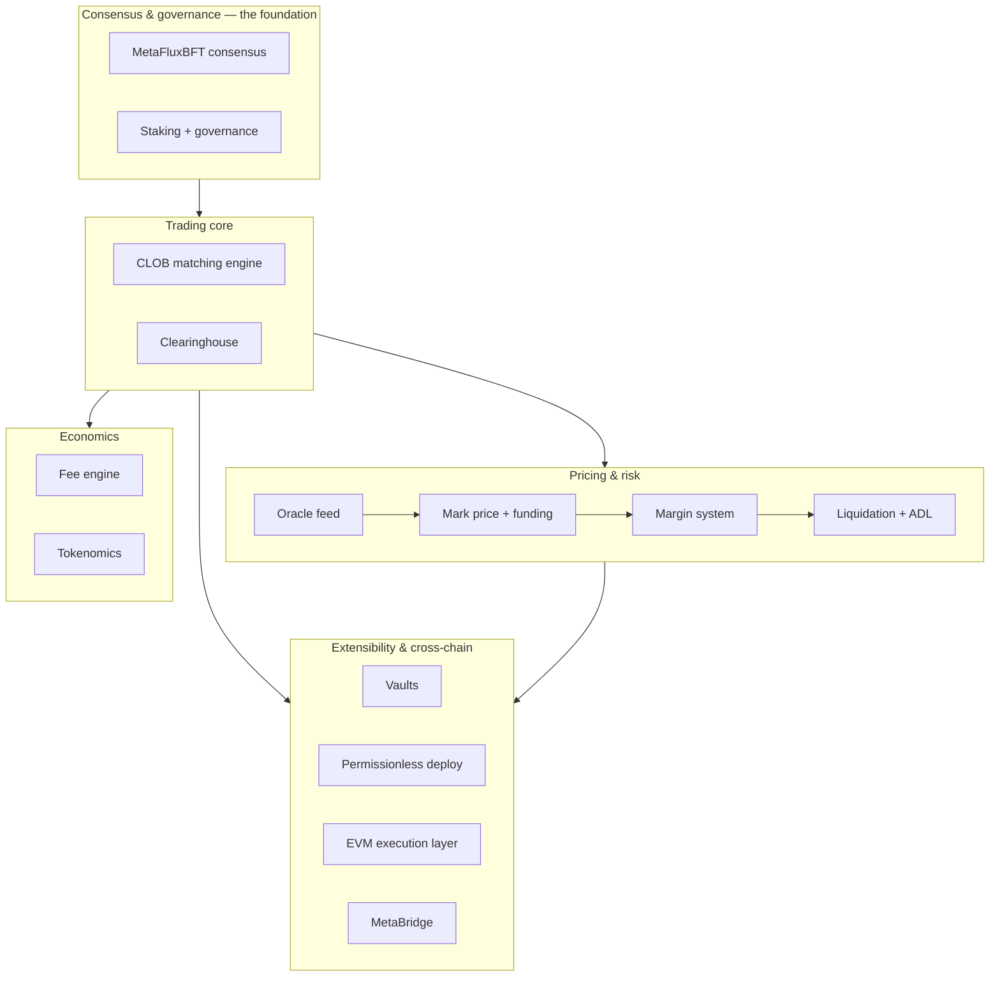

# Architecture

:::info
**Orientation map.** This page names each major component inside **MetaFlux
Core** — the L1 — says in a sentence or two what it does, and links to the page
that explains it in full. It is the fastest way to build a mental model of how
the protocol is put together. Per-component status (stable / preview / planned)
lives on each linked page.
:::

## TL;DR

MetaFlux Core is a single deterministic state machine that runs a fully on-chain
exchange. Every participant submits an action; [consensus](./consensus.md) fixes
one canonical order for those actions; then every node runs the **same** state
transition over that order. That state machine is not one monolith — it is a set
of cooperating components: a **matching engine** that runs the order books, a
**clearinghouse** that keeps the accounting, a **pricing** layer (oracle, mark,
funding), a **risk** layer (margin, liquidation), an **economics** layer (fees,
staking, token supply), and **extension** layers (vaults, permissionless market
deploy, an inline EVM, and a cross-chain bridge). This page is the map of those
components.

## How the pieces fit together

Everything sits on top of consensus. Consensus decides *what happened and in what
order*; the trading core decides *what that means for balances and positions*;
the pricing and risk layers value and protect those positions; and the extension
layers add markets, programmability, and cross-chain value.

## Trading core

The heart of the exchange: the books that match orders and the ledger that
settles them.

| Component | What it does | Learn more |
|---|---|---|
| **Clearinghouse** | The accounting core. Tracks every account's balances, open positions, collateral, realized and unrealized PnL, and margin usage across perps and spot. Every fill, funding payment, and liquidation is a write against this ledger. | [Perpetuals](../products/perpetuals.md) · [Spot](../products/spot.md) |
| **Matching engine (on-chain CLOB)** | The central-limit order book and its deterministic matching. Resting limit orders, market and IOC/FOK fills, post-only, and other time-in-force rules all match against the single consensus-ordered stream, so the same inputs always produce the same fills. | [Order types](./order-types.md) · [FBA](./fba.md) |
| **Order types & trading features** | The order and account tooling built on top of matching: TWAP and scale orders, TP/SL trigger orders, reduce-only, hedge (two-way) mode, sub-accounts, delegated agent wallets, and institutional multi-sig accounts. | [Order types](./order-types.md) · [Hedge mode](./hedge-mode.md) · [Sub-accounts](./sub-accounts.md) · [Agent wallets](./agent-wallets.md) · [Multi-sig](./multi-sig.md) · [RFQ](./rfq.md) |

## Pricing & risk

How positions are valued and how the protocol keeps accounts solvent.

| Component | What it does | Learn more |
|---|---|---|
| **Oracle price feed** | The per-asset reference price the protocol trusts for each market — a validator-aggregated spot price, resistant to any single source. It anchors the mark price and feeds risk calculations. | [Oracle prices](./oracle-prices.md) |
| **Mark price + funding** | The mark price is the manipulation-resistant value used for margin, liquidation, and triggers — composed from the oracle, the book, and external references, not the last trade. Funding is the periodic long/short payment that tethers each perp to its underlying, paid directly between traders. | [Mark prices](./mark-prices.md) · [Funding rates](./funding-rates.md) |
| **Margin system** | Decides how much collateral each position requires and how collateral is shared or walled off: cross vs. isolated margin, cross-asset portfolio (SPAN-style) margin for large accounts, and spot-margin borrowing supplied by the Earn lending pool. | [Margin modes](./margin-modes.md) · [Portfolio margin](./portfolio-margin.md) · [Spot margin](../products/spot-margin.md) · [Earn](./earn.md) |
| **Liquidation** | Protects solvency when a position's margin runs out. A gradual, tiered ladder unwinds positions in steps — an early warning and partial reductions rather than a single wipeout — with an auto-deleverage backstop as the final line of defense. | [Tiered liquidation](./tiered-liquidation.md) · [ADL](./adl.md) |

## Economics

The fee mechanics and the token that ties incentives together.

| Component | What it does | Learn more |
|---|---|---|
| **Fee engine** | Computes the fee on every fill: volume-based maker/taker tiers, maker rebates, staking discounts, plus builder and referrer credits and separate spot and liquidation fees. Determines where collected fees flow. | [Fees](./fees.md) · [Fee schedule](./fee-schedule.md) |
| **Tokenomics** | The MTF token: supply, emissions, the fee-funded buyback and burn, and how value accrues. Staking rewards and governance weight both draw on this. | [Tokenomics](./tokenomics.md) |

## Consensus & governance

The foundation every other component executes on, and how its parameters change.

| Component | What it does | Learn more |
|---|---|---|
| **Consensus (MetaFluxBFT)** | The Byzantine-fault-tolerant Proof-of-Stake engine that orders every transaction into one canonical chain with instant, deterministic finality. This total ordering is what makes fair on-chain matching possible — no reorgs, no probabilistic confirmations. | [Consensus](./consensus.md) |
| **Staking** | The Proof-of-Stake layer: delegate MTF to back validators, earn rewards, and share in slashing/jailing risk. Stake determines the validator set and each validator's voting power. | [Staking](./staking.md) |
| **Governance** | How protocol parameters are changed. Adjustments — such as fee, risk, and market parameters, and new market listings — are enacted by stake-weighted validator vote rather than by any single operator, and committed through the chain like any other state change. | [Consensus](./consensus.md) · [Improvement proposals](../mip/index.md) |

## Extensibility

Ways the protocol grows: pooled strategies and new markets.

| Component | What it does | Learn more |
|---|---|---|
| **Vaults (metaliquidity)** | Depositor-funded vaults with a whitelisted operator. The protocol's own vault acts as the insurance/backstop pool; community vaults let depositors pool capital into a strategy that a designated operator runs, sharing profit and loss pro-rata by shares. | [Vaults](./vaults.md) · [MIP-2 metaliquidity](../mip/mip-2.md) |
| **Permissionless market deploy** | Anyone meeting the requirements can list new markets — spot tokens and pairs, and builder-deployed perp markets — without gatekeeper approval, subject to on-chain safeguards. | [MIP-3 permissionless perp deploy](../mip/mip-3.md) · [MIP-1 spot deploy](../mip/mip-1.md) |

## Cross-chain & EVM

Programmability and moving value in and out of Core.

| Component | What it does | Learn more |
|---|---|---|
| **EVM execution layer** | An inline EVM that runs ordinary Solidity contracts as part of every consensus block, sharing the same finality as Core. Contracts can read Core state through system precompiles and submit Core actions through a system contract, and value moves between Core and the EVM through dedicated transfer paths. | [EVM overview](../evm/index.md) · [Execution model](../evm/execution-model.md) · [Interacting with Core](../evm/interacting-with-core.md) · [Core ↔ EVM transfers](../evm/core-evm-transfers.md) |
| **MetaBridge** | The validator-cosigned custody bridge for deposits and withdrawals across chains (Base first, then more). A source-chain contract holds custody; a two-thirds stake-weighted validator co-signature releases funds behind a dispute window — the same trust assumption as the chain itself, with no admin key. | [Bridge](../bridge/index.md) |

## Following an order through Core

To see how the components chain together, trace one perp order:

1. You submit a signed order (directly, or via an [agent wallet](./agent-wallets.md)).
2. [Consensus](./consensus.md) places it at a fixed position in the canonical order.
3. The [matching engine](./order-types.md) matches it against the book, producing fills.
4. The [clearinghouse](../products/perpetuals.md) updates your position and balance, and the [fee engine](./fees.md) charges the fill.
5. From then on, your position is valued against the [mark price](./mark-prices.md), pays or receives [funding](./funding-rates.md), and consumes [margin](./margin-modes.md).
6. If margin runs out, [tiered liquidation](./tiered-liquidation.md) steps in, with [ADL](./adl.md) as the backstop.

Every node runs steps 3–6 identically over the same ordered input, which is why
the on-chain exchange stays in exact agreement without trusting any single node.

## See also

- [Start here](../start-here.md) — a plain-language introduction for newcomers
- [Products](../products/index.md) — the tradeable markets (perpetuals, spot, spot margin)
- [Concepts](./index.md) — the full set of deep-dive mechanism pages
- [Consensus (MetaFluxBFT)](./consensus.md) — the ordering-and-finality foundation
- [Glossary](./glossary.md) — every protocol-specific term defined
