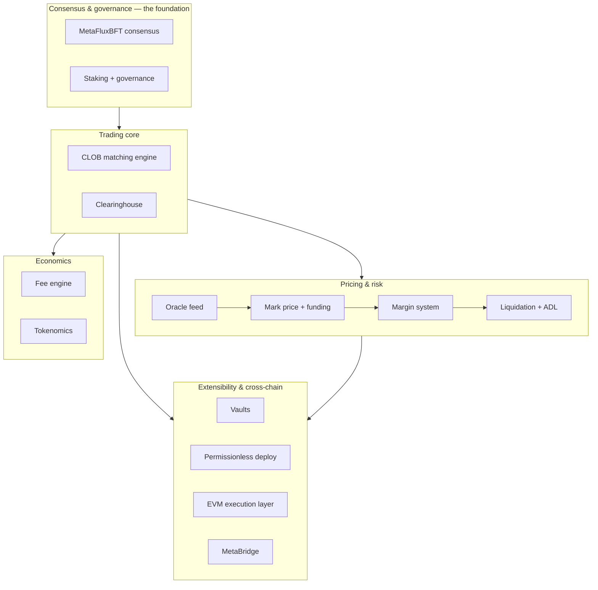

# Architecture

This page is a map of the components inside MetaFlux Core and how they connect.

:::info
This page names each major component inside MetaFlux Core, the L1. For each one,
it gives a short description and a link to the page that explains it in full.
Each linked page shows the status of its component (stable / preview / planned).
:::

## Summary {#tldr}

MetaFlux Core is one deterministic state machine that runs a fully on-chain
exchange. Every participant sends actions. [Consensus](./consensus.md) puts those
actions in one canonical order. Then every node runs the same state transition
over that order. The state machine is a set of components that work together:

- a *matching engine* that runs the order books;
- a *clearinghouse* that keeps the accounts;
- a *pricing* layer: oracle, mark and funding;
- a *risk* layer: margin and liquidation;
- an *economics* layer: fees, staking and token supply;
- *extension* layers: vaults, permissionless market deploy, an inline EVM and a
  cross-chain bridge.

## Component layers {#how-the-pieces-fit-together}

All layers sit on top of consensus. Consensus decides what happened and in what
order. The trading core decides what that means for balances and positions. The
pricing and risk layers value and protect those positions. The extension layers
add markets, programmability and cross-chain value.

```mermaid
flowchart TB
    subgraph L0["Consensus & governance — the foundation"]
      CONS[MetaFluxBFT consensus]
      GOV[Staking + governance]
    end
    subgraph L1["Trading core"]
      MATCH[CLOB matching engine]
      CLEAR[Clearinghouse]
    end
    subgraph L2["Pricing & risk"]
      ORACLE[Oracle feed]
      MARKF[Mark price + funding]
      MARG[Margin system]
      LIQU[Liquidation + ADL]
    end
    subgraph L3["Economics"]
      FEES[Fee engine]
      TOKEN[Tokenomics]
    end
    subgraph L4["Extensibility & cross-chain"]
      VLT[Vaults]
      DEPLOY[Permissionless deploy]
      EVM[EVM execution layer]
      BRIDGE[MetaBridge]
    end
    L0 --> L1
    L1 --> L2
    ORACLE --> MARKF --> MARG --> LIQU
    L1 --> L3
    L1 --> L4
    L2 --> L4
```

## Trading core {#trading-core}

The trading core is the order books that match orders and the ledger that
settles them.

| Component | What it does | Learn more |
|---|---|---|
| **Clearinghouse** | The accounting core. It tracks the balances, open positions, collateral, realized and unrealized PnL, and margin usage of every account, across perps and spot. Every fill, funding payment and liquidation is a write to this ledger. | [Perpetuals](../products/perpetuals.md) · [Spot](../products/spot.md) |
| **Matching engine (on-chain CLOB)** | The central limit order book and its deterministic matching. Resting limit orders, market and IOC/FOK fills, post-only and the other time-in-force rules all match against one stream in consensus order. The same inputs always produce the same fills. | [Order types](./order-types.md) · [FBA](./fba.md) |
| **Order types and trading features** | The order and account tools on top of matching: TWAP and scale orders, TP/SL trigger orders, reduce-only, hedge (two-way) mode, sub-accounts, agent wallets and multi-sig accounts for institutions. | [Order types](./order-types.md) · [Hedge mode](./hedge-mode.md) · [Sub-accounts](./sub-accounts.md) · [Agent wallets](./agent-wallets.md) · [Multi-sig](./multi-sig.md) · [RFQ](./rfq.md) |

## Pricing and risk {#pricing--risk}

These components value positions and keep accounts solvent.

| Component | What it does | Learn more |
|---|---|---|
| **Oracle price feed** | The reference price per asset that the protocol uses for each market. It is a spot price that validators aggregate, so no single source controls it. It anchors the mark price and is an input to risk calculations. | [Oracle prices](./oracle-prices.md) |
| **Mark price + funding** | The mark price is the value for margin, liquidation and triggers. It resists manipulation. It is built from the oracle, the book and external references, not from the last trade. Funding is the periodic payment between longs and shorts that keeps each perp near its underlying. Traders pay it directly to each other. | [Mark prices](./mark-prices.md) · [Funding rates](./funding-rates.md) |
| **Margin system** | Sets how much collateral each position needs, and whether collateral is shared or kept separate. It covers cross and isolated margin, cross-asset portfolio margin (SPAN-style) for large accounts, and spot-margin borrowing that the Earn lending pool supplies. | [Margin modes](./margin-modes.md) · [Portfolio margin](./portfolio-margin.md) · [Spot margin](../products/spot-margin.md) · [Earn](./earn.md) |
| **Liquidation** | Keeps accounts solvent when the margin of a position runs out. A tiered ladder unwinds positions in steps: first a warning, then partial reductions, not one full close. Auto-deleverage is the last backstop. | [Tiered liquidation](./tiered-liquidation.md) · [ADL](./adl.md) |

## Economics {#economics}

These components are the fee mechanics and the token.

| Component | What it does | Learn more |
|---|---|---|
| **Fee engine** | Computes the fee on every fill: maker/taker tiers by volume, maker rebates, staking discounts, builder and referrer credits, and separate spot and liquidation fees. It also sets where collected fees go. | [Fees](./fees.md) · [Fee schedule](./fee-schedule.md) |
| **Tokenomics** | The MTF token: supply, emissions, the buyback and burn that fees fund, and how value accrues. Staking rewards and governance weight both depend on it. | [Tokenomics](./tokenomics.md) |

## Consensus and governance {#consensus--governance}

Consensus is the base that every other component runs on. Governance changes its
parameters.

| Component | What it does | Learn more |
|---|---|---|
| **Consensus (MetaFluxBFT)** | The Byzantine-fault-tolerant Proof-of-Stake protocol. It puts every transaction into one canonical chain. A committed block is final, with no reorgs and no probabilistic confirmations. This total order makes fair on-chain matching possible. | [Consensus](./consensus.md) |
| **Staking** | The Proof-of-Stake layer. Delegators stake MTF to back validators, earn rewards, and share the slashing and jailing risk. Stake sets the validator set and the voting power of each validator. | [Staking](./staking.md) |
| **Governance** | Changes protocol parameters, such as fee, risk and market parameters, and new market listings. A stake-weighted validator vote enacts each change, not a single operator. The change commits through the chain like any other state change. | [Consensus](./consensus.md) · [Improvement proposals](../mip/index.md) |

## Extensibility {#extensibility}

These components add pooled strategies and new markets.

| Component | What it does | Learn more |
|---|---|---|
| **Vaults (metaliquidity)** | Vaults that depositors fund and a whitelisted operator runs. The protocol's own vault is the insurance and backstop pool. In a community vault, depositors pool capital into a strategy that a designated operator runs. They share profit and loss pro-rata by shares. | [Vaults](./vaults.md) · [MIP-2 metaliquidity](../mip/mip-2.md) |
| **Permissionless market deploy** | Anyone who meets the requirements can list new markets: spot tokens and pairs, and builder-deployed perp markets. No gatekeeper approves them. On-chain safeguards apply. | [MIP-3 permissionless perp deploy](../mip/mip-3.md) · [MIP-1 spot deploy](../mip/mip-1.md) |

## Cross-chain and EVM {#cross-chain--evm}

These components add programmability and move value into and out of Core.

| Component | What it does | Learn more |
|---|---|---|
| **EVM execution layer** | An inline EVM that runs ordinary Solidity contracts as part of every consensus block, with the same finality as Core. Contracts read Core state through system precompiles and send Core actions through a system contract. Value moves between Core and the EVM through dedicated transfer paths. | [EVM overview](../evm/index.md) · [Execution model](../evm/execution-model.md) · [Interacting with Core](../evm/interacting-with-core.md) · [Core ↔ EVM transfers](../evm/core-evm-transfers.md) |
| **MetaBridge** | The custody bridge that validators co-sign, for deposits and withdrawals across chains (Base first, then more). A contract on the source chain holds custody. A co-signature from validators with two-thirds of the stake releases funds after a dispute window. The trust assumption is the same as the chain's, and there is no admin key. | [Bridge](../bridge/index.md) |

## An order through Core {#following-an-order-through-core}

This trace shows how the components connect for one perp order:

1. You send a signed order, directly or through an [agent wallet](./agent-wallets.md).
2. [Consensus](./consensus.md) gives it a fixed position in the canonical order.
3. The [matching engine](./order-types.md) matches it against the book and produces fills.
4. The [clearinghouse](../products/perpetuals.md) updates your position and balance, and the [fee engine](./fees.md) charges the fill.
5. After that, the [mark price](./mark-prices.md) values your position. The position pays or receives [funding](./funding-rates.md) and uses [margin](./margin-modes.md).
6. If the margin runs out, [tiered liquidation](./tiered-liquidation.md) starts, with [ADL](./adl.md) as the backstop.

Every node runs steps 3–6 in the same way over the same ordered input. Thus the
exchange stays in exact agreement without trust in any single node.

## See also {#see-also}

- [Start here](../start-here.md): an introduction for new users.
- [Products](../products/index.md): the tradeable markets (perpetuals, spot, spot margin).
- [Concepts](./index.md): all the mechanism pages.
- [Consensus (MetaFluxBFT)](./consensus.md): the base for order and finality.
- [Glossary](./glossary.md): a definition of every protocol-specific term.
