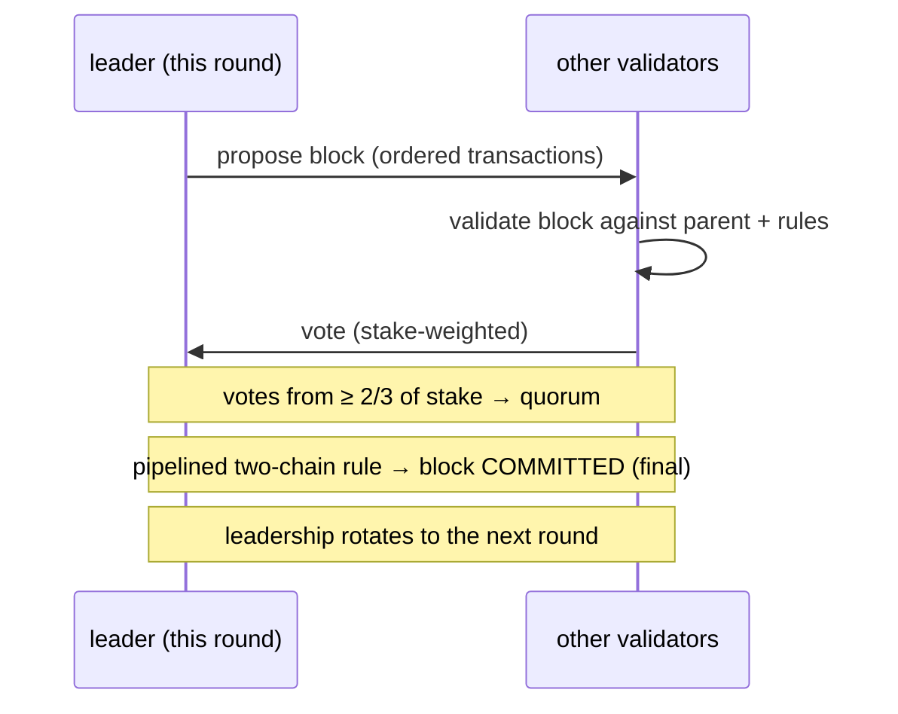
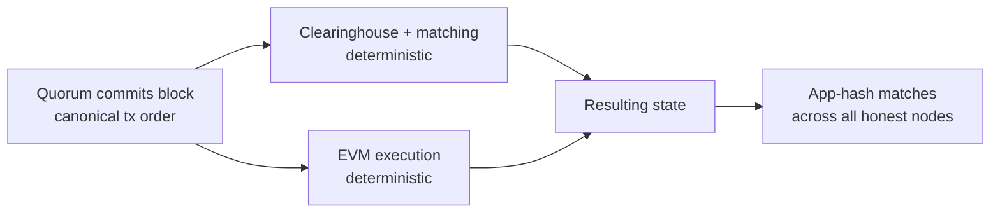

# Consensus (MetaFluxBFT)

:::info
**Live.** MetaFluxBFT is the production consensus engine securing the MetaFlux
L1. It orders every transaction — orders, cancels, liquidations, transfers,
EVM calls — into one canonical chain with deterministic, instant finality.
:::

## TL;DR {#tldr}

**MetaFluxBFT** is MetaFlux's Byzantine-fault-tolerant (BFT) Proof-of-Stake
consensus engine. A stake-weighted set of validators agrees, block by block,
on a single canonical ordering of every transaction. Once a block is committed
by a quorum it is **final immediately** — no probabilistic confirmations, no
"wait N blocks," no reorganizations. That instant, total ordering is exactly
what lets MetaFlux run a fully on-chain order book and clearinghouse: every
match, fill, funding payment, and liquidation settles against an order that the
whole network already agrees on.

## Why an exchange needs this {#why-an-exchange-needs-this}

A trading venue is only fair if everyone sees the same book in the same order.
MetaFluxBFT provides two properties that matter directly to traders and
builders:

| Property | What it means for you |
|----------|------------------------|
| **Total ordering** | Every transaction has one agreed position in the sequence. The matching engine processes orders in that exact order — there is no privileged side-channel that can reorder around you. |
| **Instant finality** | A committed block cannot be reverted. A fill or settlement is done the moment it commits — you never have to discount for the chance of a reorg. |

Together these give **front-running-resistant matching** and **immediate
settlement**: the same canonical sequence that secures the chain is the sequence
the order book matches against.

## Design lineage {#design-lineage}

MetaFluxBFT is a **MetaFlux-native** implementation in the academic lineage of
the **HotStuff / Jolteon** family of pipelined BFT protocols (the line of
research that also includes DiemBFT). That family is:

- **Leader-based** — in each round one validator proposes the next block, and
  the others vote on it.
- **Partially synchronous** — it stays *safe* (never produces conflicting
  finalized history) at all times, and makes *progress* once the network is
  delivering messages in a timely way.
- **Two-chain commit** — finality is reached through a short, pipelined chain of
  votes rather than a single all-or-nothing round, which keeps confirmation
  latency low while preserving BFT safety.

MetaFlux builds its own engine on these public research foundations rather than
forking an existing codebase, so the protocol can be tuned to the needs of an
on-chain exchange (deterministic execution, integrated EVM, stake-derived
validator set).

## Validators and staking {#validators-and-staking}

The validator set is derived directly from **on-chain stake** — MetaFluxBFT is a
Proof-of-Stake protocol. Anyone who meets the stake requirements can run a
validator; delegators back validators with MTF (see [Staking](./staking.md)).

- **Stake-weighted voting.** A validator's influence over consensus is
  proportional to the stake backing it, not one-vote-per-node.
- **Quorum = two-thirds of stake.** A block is committed only when validators
  representing **at least two-thirds of total staked voting power** vote for it.
  This two-thirds quorum is the heart of the BFT guarantee.
- **Leader rotation.** The right to propose rotates across the validator set, so
  no single validator controls block production.

### Epochs {#epochs}

The validator set is fixed within an **epoch** and can change only at epoch
boundaries. Holding the set steady for the duration of an epoch keeps consensus
deterministic and predictable, while still letting the set evolve over time as
stake shifts, validators join, or validators leave. When an epoch rolls over,
the protocol adopts the new stake-derived set for the next epoch.

## Safety and liveness {#safety-and-liveness}

Two guarantees define what MetaFluxBFT promises, in the classic BFT sense:

:::tip Safety
**The chain never finalizes two conflicting histories**, as long as **more than
two-thirds** of staked voting power is honest. Equivalently, MetaFluxBFT
tolerates up to **one-third** of voting power being Byzantine (arbitrarily
faulty) without ever committing conflicting blocks. Safety holds even when the
network is slow or messages are delayed.
:::

:::tip Liveness
**The chain keeps making progress** — committing new blocks — once the network
is synchronous enough to deliver messages in a timely way. Because leadership
rotates, a single stalled or unresponsive leader cannot halt the chain: the
protocol moves leadership forward and continues.
:::

This is the standard separation in partially-synchronous BFT: *safety always*,
*liveness under synchrony*.

## Finality and deterministic execution {#finality-and-deterministic-execution}

Finality in MetaFluxBFT is **immediate and absolute**. The moment a quorum
commits a block, that block — and the exact transaction ordering it carries — is
permanent. There is no probabilistic settling period and no reorg risk.

Execution is layered on top of that committed ordering, and it is **fully
deterministic**:

1. Consensus fixes the canonical order of transactions in a block.
2. Every node runs the **same** state transition over that order — the
   clearinghouse and matching engine for trading, and the EVM for smart-contract
   transactions.
3. Because the inputs (ordered transactions) and the transition function are
   identical, every honest node independently arrives at the **identical
   resulting state**.

Nodes confirm they agree by comparing a compact fingerprint of the resulting
state (an "app-hash"). Identical ordering plus deterministic execution means
every honest node's app-hash matches — the network stays in exact agreement
without trusting any single node's computation.

## Accountability {#accountability}

Validators are economically accountable for how they participate. A validator
that **provably misbehaves** can be **jailed** (removed from active
participation) and **slashed** (lose a portion of stake). Sustained
unavailability can likewise lead to jailing. This ties a validator's economic
position to honest operation and backs the consensus guarantees with real
stake at risk. Delegators should weigh a validator's operational track record;
see [Staking](./staking.md) for how slashing and jailing flow through to
delegated stake.

## How it fits together {#how-it-fits-together}

MetaFluxBFT is the foundation the rest of the protocol stands on:

- The **order book and clearinghouse** match and settle against the single
  canonical ordering — that is what makes on-chain matching fair.
- **Liquidations** and **funding** are applied at consensus-derived points in
  that same ordering, so every node liquidates and funds identically.
- The **EVM sidechain** executes on the committed ordering too, sharing the same
  finality.
- **Staking** and **governance** feed back into consensus: stake determines the
  validator set, and governance-set parameters are themselves committed through
  the chain.

## See also {#see-also}

- [Staking](./staking.md) — delegate MTF, back validators, earn rewards, and the
  slashing/jailing rules that secure consensus
- [Mark prices](./mark-prices.md) — consensus-derived prices that drive margin
  and liquidation
- [Tiered liquidation](./tiered-liquidation.md) — how liquidations are applied on
  the committed ordering
- [EVM execution model](../evm/execution-model.md) — how the EVM executes on the
  committed block ordering

## FAQ {#faq}

Show FAQ

**Q: How many confirmations should I wait for?**
A: None. Finality is instant — once a block commits, it is final and cannot be
reorganized. A fill is settled the moment its block commits.

**Q: Can the chain roll back a trade?**
A: No. There are no reorganizations. Committed history is permanent.

**Q: What happens if the current leader goes offline?**
A: Leadership rotates. A stalled leader cannot halt the chain; the protocol
advances leadership and continues committing blocks once the network is
delivering messages in a timely way.

**Q: How much faulty stake can the network tolerate?**
A: Up to one-third of total staked voting power can be Byzantine without the
chain ever finalizing conflicting history. Safety requires more than two-thirds
of voting power to be honest.

**Q: Is this Proof-of-Work?**
A: No. MetaFluxBFT is Proof-of-Stake — the validator set and voting power are
derived from on-chain MTF stake, not from mining.

