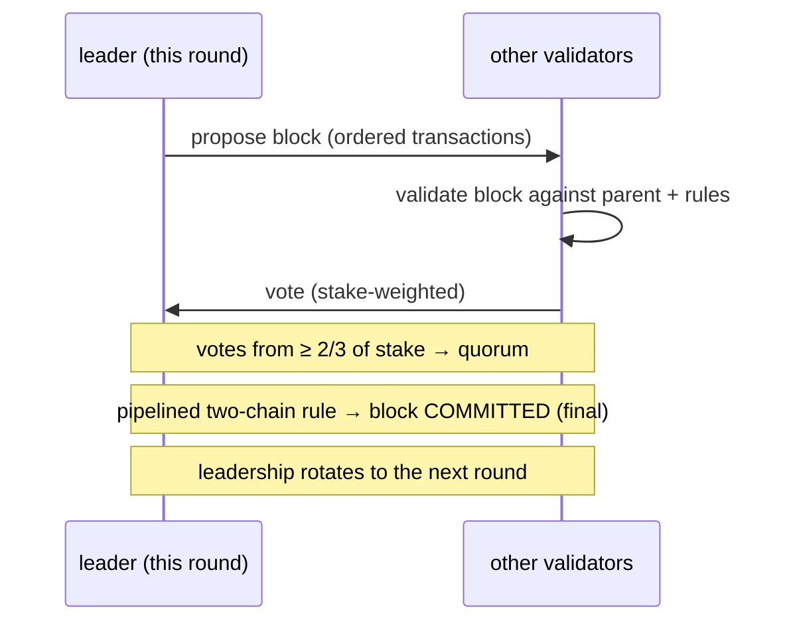
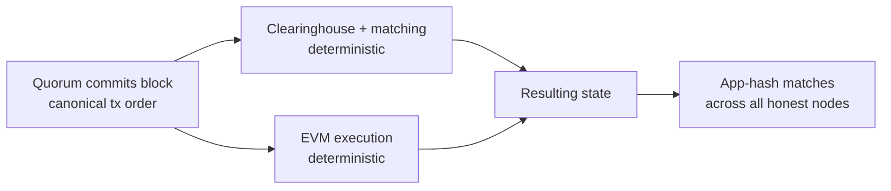

# Consensus (MetaFluxBFT)

MetaFluxBFT is the consensus protocol of MetaFlux. This page describes how it orders transactions and what it guarantees.

:::info
**Live.** MetaFluxBFT is the production consensus protocol of the MetaFlux L1. It
puts every transaction in one order: orders, cancels, liquidations, transfers
and EVM calls. A committed block is final.
:::

## Summary {#tldr}

**MetaFluxBFT** is the Byzantine-fault-tolerant (BFT) Proof-of-Stake consensus
protocol of MetaFlux. A stake-weighted set of validators agrees, block by block,
on one canonical order of every transaction. When a quorum commits a block, the
block is final at once. There are no probabilistic confirmations, no "wait N
blocks" and no reorganizations. This total order lets MetaFlux run a fully
on-chain order book and clearinghouse. Every match, fill, funding payment and
liquidation settles against an order that the whole network already agrees on.

## Properties for an exchange {#why-an-exchange-needs-this}

A trading venue is fair only if all users see the same book in the same order.
MetaFluxBFT gives two properties that matter to traders and builders:

| Property | What it means for you |
|----------|------------------------|
| **Total ordering** | Every transaction has one agreed position in the sequence. The matching engine processes orders in that exact order. No privileged side channel can reorder transactions around yours. |
| **One-block finality** | A committed block cannot be reverted. A fill or settlement is complete when it commits. You never need to allow for a reorg. |

Together, these give matching that resists front-running, and immediate
settlement. The order book matches against the same canonical sequence that
secures the chain.

## Design lineage {#design-lineage}

MetaFluxBFT is a MetaFlux-native implementation in the academic line of the
*HotStuff / Jolteon* family of pipelined BFT protocols. DiemBFT is in the same
line of research. Protocols in this family are:

- **Leader-based.** In each round, one validator proposes the next block, and
  the others vote on it.
- **Partially synchronous.** The protocol is always *safe*: it never produces
  conflicting finalized history. It makes *progress* when the network delivers
  messages in time.
- **Two-chain commit.** Finality comes from a short, pipelined chain of votes,
  not from one all-or-nothing round. This keeps confirmation latency low and
  keeps BFT safety.

MetaFlux builds its own engine on this public research. It does not fork an
existing codebase. Thus the protocol can fit the needs of an on-chain exchange:
deterministic execution, an integrated EVM and a validator set derived from
stake.

## Validators and staking {#validators-and-staking}

MetaFluxBFT is a Proof-of-Stake protocol: the validator set comes directly from
on-chain stake. Anyone who meets the stake requirements can run a validator.
Delegators back validators with MTF (see [Staking](./staking.md)).

- **Stake-weighted voting.** The influence of a validator on consensus is
  proportional to the stake behind it. It is not one vote per node.
- **Quorum = two-thirds of stake.** A block commits only when validators with at
  least two-thirds of the total staked voting power vote for it. This
  two-thirds quorum is the core of the BFT guarantee.
- **Leader rotation.** The right to propose rotates across the validator set, so
  no single validator controls block production.

```mermaid
sequenceDiagram
    participant L as leader (this round)
    participant V as other validators
    L->>V: propose block (ordered transactions)
    V->>V: validate block against parent + rules
    V->>L: vote (stake-weighted)
    Note over L,V: votes from ≥ 2/3 of stake → quorum
    Note over L,V: pipelined two-chain rule → block COMMITTED (final)
    Note over L,V: leadership rotates to the next round
```

### Epochs {#epochs}

The validator set is fixed within an *epoch*. It can change only at an epoch
boundary. A fixed set for each epoch keeps consensus deterministic and
predictable. The set can still change over time as stake moves and validators
join or leave. When an epoch ends, the protocol adopts the new set, derived from
stake, for the next epoch.

## Safety and liveness {#safety-and-liveness}

MetaFluxBFT gives two guarantees, in the classic BFT sense:

:::tip Safety
The chain never finalizes two conflicting histories while more than two-thirds
of staked voting power is honest. Thus MetaFluxBFT tolerates up to one-third of
voting power that is Byzantine (arbitrarily faulty), and never commits
conflicting blocks. Safety holds also when the network is slow or messages are
delayed.
:::

:::tip Liveness
The chain continues to commit new blocks when the network is synchronous enough
to deliver messages in time. Leadership rotates, so one stalled or unresponsive
leader cannot halt the chain. The protocol moves leadership forward and
continues.
:::

This is the standard split in partially synchronous BFT: *safety always*,
*liveness under synchrony*.

## Finality and deterministic execution {#finality-and-deterministic-execution}

Finality in MetaFluxBFT is immediate and absolute. When a quorum commits a
block, that block and its exact transaction order are permanent. There is no
probabilistic settlement period and no reorg risk.

Execution runs on top of that committed order, and it is fully deterministic:

1. Consensus fixes the canonical order of the transactions in a block.
2. Every node runs the same state transition over that order: the clearinghouse
   and matching engine for trading, and the EVM for smart-contract
   transactions.
3. The inputs (the ordered transactions) and the transition function are
   identical. Thus every honest node independently gets the identical resulting
   state.

Nodes confirm that they agree with a compact fingerprint of the resulting state,
the *app-hash*. Identical order plus deterministic execution means that the
app-hash of every honest node matches. The network stays in exact agreement
without trust in the computation of any single node.

```mermaid
flowchart LR
    A[Quorum commits block<br/>canonical tx order] --> B[Clearinghouse + matching<br/>deterministic]
    A --> C[EVM execution<br/>deterministic]
    B --> D[Resulting state]
    C --> D
    D --> E[App-hash matches<br/>across all honest nodes]
```

## Block cadence {#block-cadence}

The chain has a target block interval, in milliseconds. It is a target, not a
guarantee. It sets how often a validator proposes. The rate that you observe
also depends on load and network conditions. Never size a deadline from the
configured target. Measure the chain instead.
[`account_state`](../api/rest/info/account.md#account_state) returns the
committed `height` and the consensus `time` at which it answers. It is the only
read that does this. Sample it twice with a gap between the samples, or read a
window of recent heads from
[`recent_blocks`](../api/rest/info/chain.md#recent_blocks).

A validator vote with two-thirds of stake sets the target, with
`set_target_block_interval_ms`. The value must be in `[50, 2000]` ms. Both
bounds are hard. A floor below the real round time only holds proposals back.
The same ticker drives the timeout pacemaker, so the ceiling limits how fast the
network recovers from a silent proposer.

This vote needs no activation height. The period sets the pace of one node's own
proposals and never changes what a committed block does. Thus each node adopts
the new value when it commits the block that enacts it. The enactment shows on
[`validator_votes`](../api/rest/info/governance.md#validator_votes) as
`changes[*].field: "bole_pool.target_block_interval_ms"`.

Contract execution has its own, slower cadence. See the
[EVM execution model](../evm/execution-model.md).

## Accountability {#accountability}

Validators are economically accountable for how they take part. A validator that
provably misbehaves can be *jailed* (removed from active participation) and
*slashed* (it loses a portion of its stake). Long unavailability can also lead to
jailing. This links the economic position of a validator to honest operation,
and puts real stake behind the consensus guarantees. Delegators should consider
the operational record of a validator. [Staking](./staking.md) describes how
slashing and jailing affect delegated stake.

## Role in the protocol {#how-it-fits-together}

The rest of the protocol depends on MetaFluxBFT:

- The order book and clearinghouse match and settle against the one canonical
  order. This makes on-chain matching fair.
- The engine applies liquidations and funding at points in that same order that
  consensus sets, so every node liquidates and funds identically.
- The EVM also executes on the committed order, with the same finality.
- Staking and governance feed back into consensus. Stake sets the validator
  set, and governance parameters commit through the chain.

## See also {#see-also}

- [Staking](./staking.md): delegate MTF, back validators and earn rewards. It
  also covers the slashing and jailing rules that secure consensus.
- [Mark prices](./mark-prices.md): prices from consensus that drive margin and
  liquidation.
- [Tiered liquidation](./tiered-liquidation.md): how the engine applies
  liquidations on the committed order.
- [EVM execution model](../evm/execution-model.md): how the EVM executes on the
  committed block order.

## FAQ {#faq}

Show FAQ

**Q: How many confirmations should I wait for?**
A: None. When a block commits, it is final and cannot be reorganized. A fill
settles when its block commits.

**Q: Can the chain roll back a trade?**
A: No. There are no reorganizations. Committed history is permanent.

**Q: What happens if the current leader goes offline?**
A: Leadership rotates. A stalled leader cannot halt the chain. The protocol
moves leadership forward and continues to commit blocks when the network
delivers messages in time.

**Q: How much faulty stake can the network tolerate?**
A: Up to one-third of total staked voting power can be Byzantine, and the chain
never finalizes conflicting history. Safety requires that more than two-thirds
of voting power is honest.

**Q: Is this Proof-of-Work?**
A: No. MetaFluxBFT is Proof-of-Stake. The validator set and voting power come
from on-chain MTF stake, not from mining.

