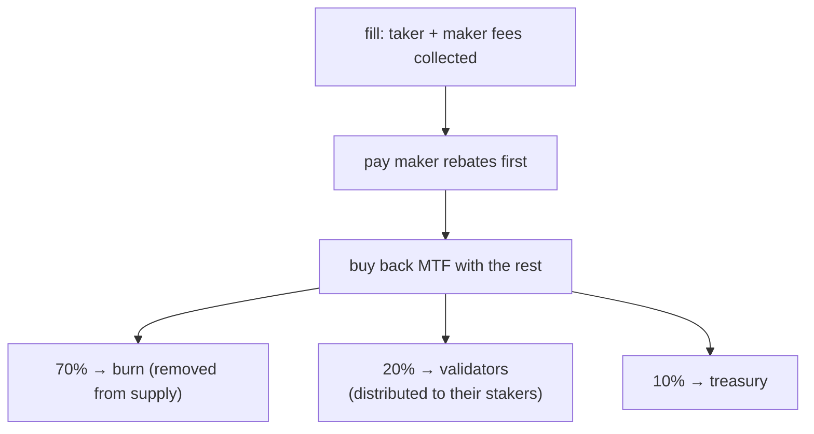

# Fees

:::info
**Concepts page.** This page explains how a trading fee is computed per fill, the
builder and referrer credits, spot and liquidation fees, and where collected fees
go. For the actual rates — volume fee tiers, maker-rebate tiers, and staking
discount tiers — see the [Fee schedule](./fee-schedule.md). Fee values are network
parameters and can be updated by governance.
:::

## TL;DR

Every fill charges a maker and a taker fee, set by the [Fee schedule](./fee-schedule.md).
A builder credit can route a share to the order-flow originator, and a referrer
credit can route a share of the taker fee to a referrer. After maker rebates are
paid, the protocol uses the remaining fee revenue to **buy back MTF**, then splits
the bought MTF **70% burn / 20% validators / 10% treasury**. Fees are deducted from
your balance at fill time and shown in [`userFills`](../api/rest/info.md#user_fills).

## How a fee is computed

Fees settle on the whole-USDC plane: notional is the price-times-size product,
truncated toward zero.

### Per fill

```text
notional    = |price × size|
taker_fee   = notional × taker_rate
maker_fee   = notional × maker_rate
builder_fee = notional × builder_rate    # additive, taker-only, capped
```

The taker and maker rates come from your tier on the [Fee schedule](./fee-schedule.md):
your base rate from 30-day volume, an extra maker rebate from your maker-volume
share, and a taker discount from how much MTF you stake. A negative effective maker
rate is a rebate paid **to** the maker, funded out of taker fees collected on the
same flow — the protocol never pays out more than it takes in.

Per-fill fee appears in every [`userFills`](../api/rest/info.md#user_fills) entry as
`fee` (USDC base units; positive = paid, negative = rebate received).

## Builder credit

An order-flow originator can claim a share of the taker fee by setting a builder
address on the order. The credit is paid per fill to that address. Typical uses:

- a front-end or aggregator that routed the flow,
- a market-data API that bundles execution,
- an automated risk service that placed protective orders.

The builder must be a registered address (see
[`approve_builder_fee`](../api/rest/exchange.md#approve_builder_fee)). Unregistered
builders are silently dropped. The builder credit is additive and taker-only, with
a per-order cap; it does not change the maker side.

## Referrer credit

When an account has a referrer set, a share of its **taker fee** is routed to the
referrer **before** the rest is distributed — it comes out of the protocol's take,
not as an extra charge to the taker. The maker fee carries no referrer credit.

Referrals are single-level (no multi-level chain — anti-Ponzi). A referrer is set
once with [`set_referrer`](../api/rest/exchange.md#set_referrer) and is immutable
thereafter; setting yourself as your own referrer is rejected.

A builder credit and a referrer credit can both apply to the same fill — they pay
out independently.

## Where fees go

Collected fees flow through one value-accrual pipeline:



1. **Maker rebates are paid first.** Negative net maker rates (see the
   [Fee schedule](./fee-schedule.md)) are settled out of the fees collected on the
   same flow.
2. **The remainder buys back MTF.** All fee revenue left after rebates is used to
   market-buy MTF at the protocol mark. This creates buy pressure and converts fee
   revenue into MTF before it is distributed.
3. **The bought-back MTF splits 70 / 20 / 10:**
   - **70% is burned** — permanently removed from circulation (deflationary).
   - **20% goes to validators**, who distribute it to their stakers. This is the
     **staker dividend** — fee revenue reaches stakers via their validator's share.
   - **10% goes to the treasury** (and absorbs rounding dust so the split is
     leak-free).

Cumulative pool totals (bought-back-and-burned MTF, validator pool, treasury) are
tracked in committed state and exposed on the read path via
[`protocol_metrics`](../api/rest/info.md#protocol_metrics):

```bash
curl -X POST https://devnet-gateway.mtf.exchange/info -d '{"type":"protocol_metrics"}'
```

Because the staker dividend is delivered through the validator share, stake more
MTF (or delegate to a validator) to receive a larger slice — see [Staking](./staking.md).

## Spot fees

The same maker/taker shape applies to spot fills, but spot fees are charged on a
**separate fee account** from perps, and they are taken **from the leg each side
receives** — not always from the quote balance:

- the **taker** fee is taken from the leg the taker receives,
- the **maker** fee is taken from the leg the maker receives.

So a spot **buyer** (receiving base) pays its fee in **base**, and a **seller**
(receiving quote) pays its fee in **quote**. Each spot pair may set its own
maker/taker rate; when a pair leaves them unset, the global spot default applies.
See the spot tiers in the [`/info fee_schedule`](../api/rest/info.md#fee_schedule)
response, and [spot trading](../products/spot.md#matching-fills-and-fees) for the
settlement model.

## Fees on liquidation fills

Liquidation closes route through the standard taker-fee path described above. A
discrete liquidation fee — an extra charge split between the insurance pool and
treasury to keep insurance solvent and compensate makers who absorb forced flow —
is a design intent that is not yet active. When it lands, liquidated accounts will
pay it as part of the loss settled on close, flagged on the liquidation fills in
[`userFills`](../api/rest/info.md#user_fills). See
[tiered liquidation](./tiered-liquidation.md) for the close mechanics.

## Querying

```bash
# tier overview (MTF-native — gateway default path; running the node yourself: localhost:8080)
curl -X POST https://devnet-gateway.mtf.exchange/info -d '{"type":"fee_schedule"}'

# your personal tier and recent volume — MTF-native (gateway default path)
curl -X POST https://devnet-gateway.mtf.exchange/info \
  -d '{"type":"user_fees","address":"0x<addr>"}'

# or the HL-compat shape under /hl on the gateway
curl -X POST https://devnet-gateway.mtf.exchange/hl/info \
  -d '{"type":"userFees","user":"0x<addr>"}'
```

## Edge cases

<details>
<summary>Show edge cases</summary>

- **Volume across sub-accounts.** A master and all its subs share one volume tier.
  A desk that runs many strategies under one master gets the aggregate tier.
- **Tier evaluation cadence.** Tiers are re-evaluated continuously on the current
  30-day window — there is no periodic snapshot. A trade that pushes you into a new
  tier applies on the next fill.
- **Builder credit ≠ referrer credit.** Both can apply to the same fill — a user's
  account has a referrer and that fill's order specified a builder. Both routes pay
  out independently.
- **Negative-fee maker tier.** When the net maker rate is below zero, the maker is
  paid from taker fees collected on the same flow (and across all fills in the same
  block); the protocol never pays out more than it takes in.

</details>

## See also

- [Fee schedule](./fee-schedule.md) — the rate card: volume fee tiers, maker-rebate
  tiers, and staking discount tiers, and how the three combine
- [Staking](./staking.md) — stake MTF for the validator-share dividend and the taker discount
- [`POST /info fee_schedule`](../api/rest/info.md#fee_schedule)
- [`POST /info user_fees`](../api/rest/info.md#user_fees) — MTF-native per-user tier / 30-day volume
- [`POST /info protocol_metrics`](../api/rest/info.md#protocol_metrics) — cumulative fee pools (burn / treasury / validator)
- [`POST /info userFees`](../api/rest/hl-compat.md#userfees) — HL-compat
- [Tiered liquidation](./tiered-liquidation.md) — liquidation mechanics

## FAQ

<details>
<summary>Show FAQ</summary>

**Q: Are fees applied per-fill or per-order?**
A: Per-fill. A partially-filled order accrues fee in proportion to the filled size
at each fill event.

**Q: Are fees paid in USDC or in MTF?**
A: You pay in the fill currency (USDC for perps; the received leg for spot). The
protocol then uses fee revenue to buy back MTF, and it is the bought-back MTF that
is burned and distributed.

**Q: Is there a min-fee floor?**
A: No floor. A tiny fill computes a sub-cent fee (rounded down on display, charged
at full precision internally).

**Q: Do TWAP slices each pay taker?**
A: Yes — each slice is an IOC at the protocol's discretion. Total TWAP fee = sum of
slice fees.

**Q: Can the builder credit be zero?**
A: Yes. If you don't set a builder on an order, no credit is allocated; the full
protocol share flows into the buyback-and-distribute pipeline.

**Q: How do stakers earn from fees?**
A: Through the validator share. After buyback, 20% of the bought-back MTF goes to
validators, who distribute it to their stakers — so staking (or delegating) earns
you a slice of fee revenue. See [Staking](./staking.md).

</details>
</content>
</invoke>
