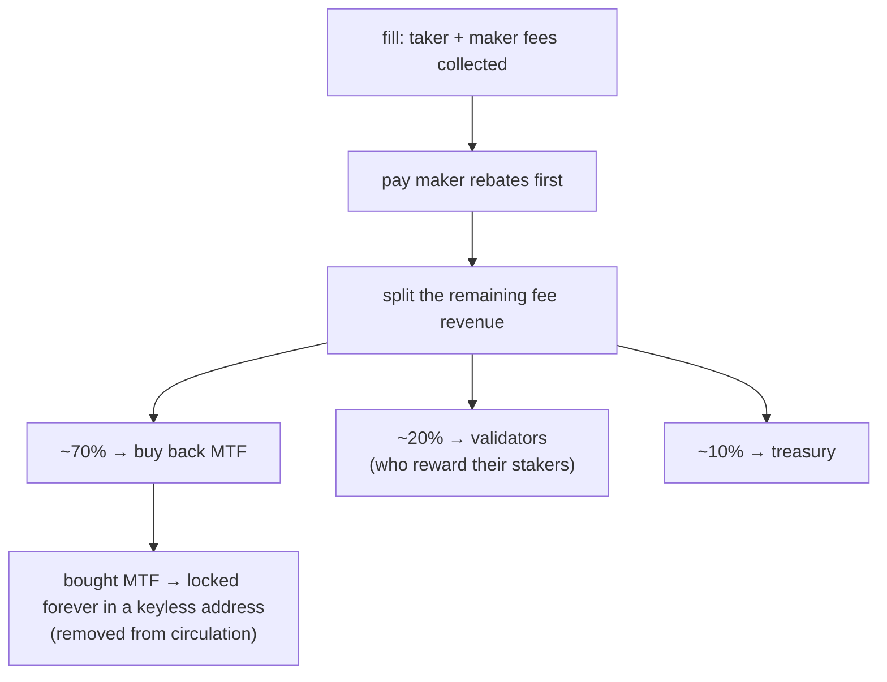

# Fees

:::info
**Concepts page.** This page explains how a trading fee is computed per fill, the
broker and referrer credits, spot and liquidation fees, and where collected fees
go. For the actual rates — volume fee tiers, maker-rebate tiers, and staking
discount tiers — see the [Fee schedule](./fee-schedule.md). Fee values are network
parameters and can be updated by governance.
:::

## TL;DR {#tldr}

Every fill charges a maker and a taker fee, set by the [Fee schedule](./fee-schedule.md).
A broker credit adds a charge for the order-flow originator, and a referrer
credit routes a share of the taker fee to a referrer. After maker rebates are
paid, the protocol splits the remaining fee revenue **~70% buyback / ~20%
validators / ~10% treasury**. The buyback share buys MTF on the open market and
locks it forever in a keyless protocol address — permanently removing it from
circulation. Fees are deducted from
your balance at fill time and shown in [`userFills`](../api/rest/info.md#user_fills).

## How a fee is computed {#how-a-fee-is-computed}

Fees are charged at **micro-USDC** (1e-6 USDC) granularity, truncated toward zero:
the fee is the price-times-size notional times the rate, rounded **down** to the
nearest 1e-6 USDC. A small fill therefore pays its true fractional fee (a `$20`
fill pays a real `$0.02` taker fee instead of rounding to `$0`), not a value
rounded to a whole cent or dollar.

### Per fill {#per-fill}

```text
notional    = |price × size|
taker_fee   = notional × taker_rate
maker_fee   = notional × maker_rate
broker_fee  = notional × broker_rate     # additive, taker-only, capped
```

The taker and maker rates come from your tier on the [Fee schedule](./fee-schedule.md):
your base rate from 30-day volume, an extra maker rebate from your maker-volume
share, and a taker discount from how much MTF you stake. A negative effective maker
rate is a rebate paid **to** the maker, funded out of taker fees collected on the
same flow — the protocol never pays out more than it takes in.

Per-fill fee appears in every [`userFills`](../api/rest/info.md#user_fills) entry as
`fee` (USDC base units; positive = paid, negative = rebate received).

## Broker credit {#builder-credit}

An order-flow originator can charge its own fee. It sets a broker address on the
order. The charge is **additive**: the taker pays it on top of the base taker
fee. It does not reduce the referrer share and it does not reduce the protocol
split. The credit is paid per fill to that address. Typical uses:

- a front-end or aggregator that routed the flow,
- a market-data API that bundles execution,
- an automated risk service that placed protective orders.

The trader must approve the broker first (see
[`approve_broker_fee`](../api/rest/exchange.md#approve_builder_fee)). An order
that names an unapproved broker is **rejected before it rests**. So is an order
whose rate is above the trader's approved ceiling or above the protocol cap. The
broker credit is taker-only, with a per-order cap. It does not change the maker
side. For the full rules, see [broker codes](./broker-codes.md).

## Referrer credit {#referrer-credit}

When an account has a referrer set, a share of its **taker fee** is routed to the
referrer **before** the rest is distributed — it comes out of the protocol's take,
not as an extra charge to the taker. The maker fee carries no referrer credit.

Referrals are single-level (no multi-level chain — anti-Ponzi). A referrer is set
once with [`set_referrer`](../api/rest/exchange.md#set_referrer) and is immutable
thereafter; setting yourself as your own referrer is rejected.

A broker credit and a referrer credit can both apply to the same fill — they pay
out independently.

## Where fees go {#where-fees-go}

Collected fees flow through one value-accrual pipeline:


```mermaid
flowchart TD
    fill["fill: taker + maker fees collected"]
    rebate["pay maker rebates first"]
    split["split the remaining fee revenue"]
    buyback["~70% → buy back MTF"]
    sink["bought MTF → locked forever in a keyless address<br/>(removed from circulation)"]
    validators["~20% → validators<br/>(who reward their stakers)"]
    treasury["~10% → treasury"]

    fill --> rebate
    rebate --> split
    split --> buyback
    split --> validators
    split --> treasury
    buyback --> sink
```

1. **Maker rebates are paid first.** Negative net maker rates (see the
   [Fee schedule](./fee-schedule.md)) are settled out of the fees collected on the
   same flow.
2. **The fee revenue splits ~70 / ~20 / ~10.** After rebates, the remaining fee
   revenue is split three ways: **~70% buyback, ~20% validators, ~10% treasury**
   (the treasury share absorbs rounding dust so the split is leak-free).
3. **The ~70% buyback buys MTF, never above a manipulation-resistant ceiling.**
   The buyback share is used to buy MTF on the open market by matching resting
   sell orders on the MTF/USDC book, lowest price first, and the protocol never
   pays above a price ceiling. When MTF has an external mark, that ceiling is the
   oracle-bounded mark plus a governance-set slippage allowance. When it does not,
   the ceiling is anchored to a smoothed average of the protocol's *own* recent
   buyback execution prices — a self-referential reference no third party can move
   by trading, only by making the protocol itself execute higher, which is
   rate-limited to a small per-round step and can be hard-capped to a fixed band by
   a governance-set reference price. Sell orders priced above the ceiling are
   skipped and the unspent balance carries to the next round; if no trustworthy
   reference exists yet, the buyback defers rather than buying at an unverified
   price. In fast-moving markets it may lag price by design.
4. **Every MTF the buyback acquires is locked forever.** The bought-back MTF is
   sent to a keyless protocol address it can never leave — so it is permanently
   removed from the circulating float. This is the deflationary force: real
   exchange revenue continuously buys MTF and takes it out of circulation, at a
   rate that scales with trading volume. (The token's headline total supply is a
   separate figure and is not changed by the buyback.)
5. **Validators reward their stakers from the ~20% validator share.** The staker
   dividend is funded from the validator fee share, not from the bought-back MTF.

Cumulative pool totals (MTF bought back and locked out of circulation, validator
pool, treasury) are tracked in committed state and exposed on the read path via
[`protocol_metrics`](../api/rest/info.md#protocol_metrics):

```bash
curl -X POST https://api.devnet.mtf.exchange/info -d '{"type":"protocol_metrics"}'
```

Because the staker dividend is delivered through the validator share, stake more
MTF (or delegate to a validator) to receive a larger slice — see [Staking](./staking.md).

## Spot fees {#spot-fees}

The same maker/taker shape applies to spot fills, but spot fees are charged on a
**separate fee account** from perps.

**Today both sides pay in the QUOTE token of the pair.** The fee leaves the
payer's spendable quote balance, never the base balance. Each spot pair may set
its own maker/taker rate; when a pair leaves them unset, the global spot default
applies. See the spot tiers in the
[`/info fee_schedule`](../api/rest/info.md#fee_schedule) response, and
[spot trading](../products/spot.md#matching-fills-and-fees) for the settlement
model.

### A spot BUY will pay its fee in the BASE token {#spot-buy-fee-in-base}

:::caution Scheduled change — read this before you reconcile balances
This rule is **built but not yet active**. It switches on at one announced block
height. Below that height the behavior above applies unchanged. The height is
published in the release notes; there is no field on the wire that flips with it,
so the height is the only boundary you can key on.
:::

**Each side pays out of the leg it RECEIVES.** A sell receives USDC and already
pays from it. A **buy receives the base token, so the buy fee comes out of the
base**, for the taker and the maker alike. The rule closes a real hole: a fee
denominated in a token the buyer is not receiving can be charged against an empty
balance, and a resting buyer holding no spendable quote paid nothing.

Four consequences a caller must handle:

1. **The fill `sz` is GROSS; the balance credit is NET.** A taker buying `1.0`
   BTC at a `0.035%` rate sees `sz: "1.0"` on the fill and receives
   `0.99965` BTC. **Summing fill sizes over-counts holdings.** Read the balance,
   not the sum of fills, to know what you own. The fill's `fee` field stays `"0"`
   for spot at every height and gains **no** fee-token field — the fee is
   observable as the difference between `sz` and the balance change, and
   deliberately nowhere else, so the committed trade record is unchanged.
2. **A referrer share and a maker rebate on a BUY arrive IN KIND.** They are
   credited as a spot balance in that pair's **base token**, directly at the fill.
   They do **not** enter the claimable USDC
   [referrer credit](#referrer-credit) — that accumulator is USDC-denominated and
   a base amount cannot join it. So a referrer of a BTC buyer receives BTC, with
   nothing to claim; a referrer of a seller still receives claimable USDC.
3. **Netted balances carry permanent sub-lot dust.** The fee is computed
   **exactly**, not quantized to the token's tradeable lot, so the netted credit
   ends below one lot of precision (a 1-lot BTC taker buy leaves about `3.5e-9`
   BTC). That residue is real and yours, but it is **smaller than one lot, so no
   order can sell it**. It is truncated when you withdraw. This is deliberate:
   quantizing instead would keep balances clean but re-open a zero-fee window —
   any BTC buy under ten lots would pay nothing — and a window can be farmed while
   dust cannot.
4. **A zero-rate pair still rolls NO volume into the tier ladder.** Volume rolls
   only when a positive fee is actually collected. On a positive-rate pair that is
   now every fill, including the resting-buy fills that used to roll nothing. On a
   pair whose rate is zero, nothing rolls — so a free pair cannot be used to farm
   a cheaper tier. The 30-day ladder itself stays **USD-denominated**: a
   base-token fee does not change the currency volume is measured in.

## Fees on liquidation fills {#fees-on-liquidation-fills}

Liquidation closes route through the standard taker-fee path described above. A
discrete liquidation fee — an extra charge split between the insurance pool and
treasury to keep insurance solvent and compensate makers who absorb forced flow —
is a design intent that is not yet active. When it lands, liquidated accounts will
pay it as part of the loss settled on close, flagged on the liquidation fills in
[`userFills`](../api/rest/info.md#user_fills). See
[tiered liquidation](./tiered-liquidation.md) for the close mechanics.

## Querying {#querying}

```bash
# tier overview (MTF-native — gateway default path; running the node yourself: localhost:8080)
curl -X POST https://api.devnet.mtf.exchange/info -d '{"type":"fee_schedule"}'

# your personal tier and recent volume — MTF-native
curl -X POST https://api.devnet.mtf.exchange/info \
  -d '{"type":"user_fees","address":"0x<addr>"}'
```

## Edge cases {#edge-cases}

<details>
<summary>Show edge cases</summary>

- **Volume across sub-accounts.** A master and all its subs share one volume tier.
  A desk that runs many strategies under one master gets the aggregate tier.
- **Tier evaluation cadence.** Tiers are re-evaluated continuously on the current
  30-day window — there is no periodic snapshot. A trade that pushes you into a new
  tier applies on the next fill.
- **Broker credit ≠ referrer credit.** Both can apply to the same fill — a user's
  account has a referrer and that fill's order specified a broker. Both routes pay
  out independently.
- **Negative-fee maker tier.** When the net maker rate is below zero, the maker is
  paid from taker fees collected on the same flow (and across all fills in the same
  block); the protocol never pays out more than it takes in.

</details>

## See also {#see-also}

- [Fee schedule](./fee-schedule.md) — the rate card: volume fee tiers, maker-rebate
  tiers, and staking discount tiers, and how the three combine
- [Staking](./staking.md) — stake MTF for the validator-share dividend and the taker discount
- [`POST /info fee_schedule`](../api/rest/info.md#fee_schedule)
- [`POST /info user_fees`](../api/rest/info.md#user_fees) — MTF-native per-user tier / 30-day volume
- [`POST /info protocol_metrics`](../api/rest/info.md#protocol_metrics) — cumulative fee pools (burn / treasury / validator)
- [Tiered liquidation](./tiered-liquidation.md) — liquidation mechanics

## FAQ {#faq}

<details>
<summary>Show FAQ</summary>

**Q: Are fees applied per-fill or per-order?**
A: Per-fill. A partially-filled order accrues fee in proportion to the filled size
at each fill event.

**Q: Are fees paid in USDC or in MTF?**
A: You pay in the fill currency (USDC for perps; the pair's quote token for spot). The
protocol splits that fee revenue ~70/20/10; the ~70% buyback share buys MTF on the
open market and locks it out of circulation, while the validator and treasury
shares stay in the fill currency.

**Q: Is there a min-fee floor?**
A: No floor. A tiny fill computes a sub-cent fee, and the wire carries that
fractional amount directly: the `fee` field on a fill is a decimal-USDC string
truncated toward zero at 1e-6 (micro-USDC) granularity — there is no separate
display-vs-internal precision, the charged value is what you see.

**Q: Do TWAP slices each pay taker?**
A: Yes — each slice is an IOC at the protocol's discretion. Total TWAP fee = sum of
slice fees.

**Q: Can the broker credit be zero?**
A: Yes. If you don't set a broker on an order, no credit is allocated; the full
protocol share flows into the buyback-and-distribute pipeline.

**Q: How do stakers earn from fees?**
A: Through the validator share. After buyback, 20% of the bought-back MTF goes to
validators, who distribute it to their stakers — so staking (or delegating) earns
you a slice of fee revenue. See [Staking](./staking.md).

</details>
</content>
</invoke>
