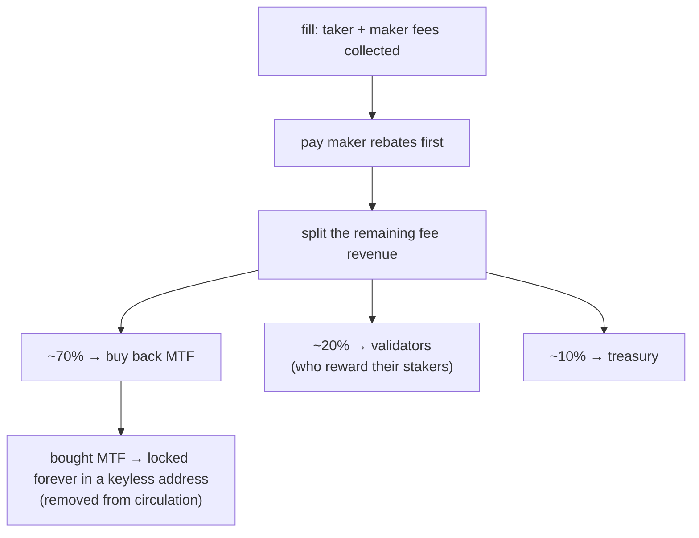

# Fees

:::info
**Concepts page.** This page explains how a trading fee is computed per fill, the
broker and referrer credits, spot and liquidation fees, the
[Core to EVM transfer fee](#core-evm-transfer-fee), and where collected fees
go. For the actual rates — volume fee tiers, maker-rebate tiers, and staking
discount tiers — see the [Fee schedule](./fee-schedule.md). Fee values are network
parameters and can be updated by governance.
:::

## TL;DR {#tldr}

Every fill charges a maker and a taker fee, set by the [Fee schedule](./fee-schedule.md).
A broker credit adds a charge for the order-flow originator, and a referrer
credit routes a share of the taker fee to a referrer. After maker rebates are
paid, the protocol splits the remaining fee revenue **~70% buyback / ~20%
validators / ~10% treasury**. The buyback share buys MTF on the open market and
locks it forever in a keyless protocol address — permanently removing it from
circulation. Fees are deducted from
your balance at fill time and shown in [`userFills`](../api/rest/info.md#user_fills).
One fee here is not a trading fee: a transfer from Core to MetaFluxEVM charges a
[fee in MTF](#core-evm-transfer-fee), which is `0` today.

## How a fee is computed {#how-a-fee-is-computed}

Fees are charged at **micro-USDC** (1e-6 USDC) granularity, truncated toward zero:
the fee is the price-times-size notional times the rate, rounded **down** to the
nearest 1e-6 USDC. A small fill therefore pays its true fractional fee (a `$20`
fill pays a real `$0.02` taker fee instead of rounding to `$0`), not a value
rounded to a whole cent or dollar.

### Per fill {#per-fill}

```text
notional    = |price × size|
taker_fee   = notional × taker_rate
maker_fee   = notional × maker_rate
broker_fee  = notional × broker_rate     # additive, taker-only, capped
```

The taker and maker rates come from your tier on the [Fee schedule](./fee-schedule.md):
your base rate from 30-day volume, an extra maker rebate from your maker-volume
share, and a taker discount from how much MTF you stake. A negative effective maker
rate is a rebate paid **to** the maker, funded out of taker fees collected on the
same flow — the protocol never pays out more than it takes in.

Per-fill fee appears in every [`userFills`](../api/rest/info.md#user_fills) entry as
`fee` (USDC base units; positive = paid, negative = rebate received).

### Resolving your rate {#resolving-your-rate}

Each fill resolves its base rate from **each party's own trailing 30-day volume**
— the taker leg from the taker's volume, the maker leg from the maker's volume.
The two can differ on the same fill, because they read different ladders:

```text
tier(volume)    = the highest tier whose volume floor the trader's trailing
                   30-day volume clears (else the base rate)
taker_base_rate = tier(taker's trailing 30-day TAKER volume).taker_rate
maker_base_rate = tier(maker's trailing 30-day MAKER volume).maker_rate
```

Volume only rolls into that trailing window when a fill actually charges a
**positive** fee — a fee-free market cannot farm a cheaper tier by trading with
itself. Because volume updates fill by fill, a single order that crosses many
resting orders can walk its own taker leg into a new tier partway through: the
fifth fill of one order can price at a different rate than the first.

The taker discount, then the maker rebate, apply on top of the base rate:

```text
effective_taker_rate = taker_base_rate × (1 − staking_discount)
effective_maker_rate = maker_base_rate − maker_rebate_rate
```

`staking_discount` comes from how much MTF you stake or delegate, against the
staking discount tiers on the [Fee schedule](./fee-schedule.md) — taker-only, and
it can only shrink the rate, never flip it negative.

`maker_rebate_rate` comes from your **share of the exchange's total 30-day maker
volume** — your maker volume divided by every maker's maker volume, summed —
against the maker-rebate tiers on the [Fee schedule](./fee-schedule.md). Because
it is **subtracted**, a high enough rebate tier carries `effective_maker_rate`
below zero: that is the rebate case above, a credit paid to the maker.

**Rounding, in order.** The discounted taker rate is truncated toward zero to the
nearest 0.1 basis point *before* it prices a fee. The dollar fee it then computes
— taker, maker, or rebate — is truncated toward zero again, independently, to the
nearest 1e-6 USDC. Two truncations, both toward zero, never a round-up.

**Where to read it.** [`/info fee_schedule`](../api/rest/info.md#fee_schedule)
called with your `address` returns `taker_volume_30d`, `maker_volume_30d`,
`effective_taker_bps`, `effective_maker_bps`, `staking_discount_permille`, and
`maker_rebate_bps` for that account — the resolved numbers this section derives,
not just the ladder.

### Worked example {#worked-example}

A taker buys `0.1` BTC at `$67,000` (notional `$6,700`) against a resting maker
ask. Both accounts are new — base tier, no MTF staked, and the maker has not
cleared a maker-rebate share tier:

```text
notional         = 67000 × 0.1              = 6700 USDC
taker_base_rate  = 0.035 %  (base tier)
maker_base_rate  = 0.010 %  (base tier)

taker_fee = trunc(6700 × 0.00035) = 2.345 USDC   (paid by the taker)
maker_fee = trunc(6700 × 0.00010) = 0.67  USDC   (paid by the maker)
```

Both are charged in full; the maker's `fee` on `userFills` reads a positive
`"0.67"`.

**Add a referrer.** The taker has a referrer on file:

```text
referrer_share = trunc(taker_fee × 10%) = trunc(2.345 × 0.10) = 0.2345 USDC
protocol_fee   = taker_fee − referrer_share = 2.1105 USDC
```

The referrer share leaves the taker's *fee*, not an extra charge — the taker
still pays exactly `2.345` in total. The credit accrues where
[`/info fee_schedule`](../api/rest/info.md#fee_schedule) reports
`user.referrer_credit`, for the referrer's own address.

**A different maker, at a rebate tier.** Now the maker sits at the top volume
tier (`maker_base_rate = 0.0000%`) and clears the 3%-share rebate tier
(`maker_rebate_rate = 0.0030%`):

```text
effective_maker_rate = 0.0000% − 0.0030% = −0.0030%   (negative: a credit)
rebate                = trunc(6700 × 0.000030) = 0.201 USDC
rebate_paid           = min(rebate, protocol_fee) = min(0.201, 2.1105) = 0.201 USDC
```

The maker is credited `0.201` USDC instead of paying; `userFills` reports the
maker's `fee` as `"-0.201"`. The credit is funded from this same fill's taker
protocol fee — never minted — so it can never exceed what that fee has left
after the referrer carve. On a fill where the taker fee is too small to cover
the rebate, the maker is credited only the available remainder, not the full
rebate rate.

**What is left funds the 70 / 20 / 10 split:**

```text
pooled    = protocol_fee − rebate_paid = 2.1105 − 0.201 = 1.9095 USDC
buyback   = trunc(pooled × 70%)        = 1.33665 USDC
validator = trunc(pooled × 20%)        = 0.3819  USDC
treasury  = pooled − buyback − validator = 0.19095 USDC
```

See [Where fees go](#where-fees-go) for what each share does next. A maker fee
that is **paid, not credited**, skips the referrer step entirely and joins this
same 70/20/10 split at its full amount — see
[Referrer credit](#referrer-credit): the maker fee carries no referrer carve.

## Broker credit {#builder-credit}

An order-flow originator can charge its own fee. It sets a broker address on the
order. The charge is **additive**: the taker pays it on top of the base taker
fee. It does not reduce the referrer share and it does not reduce the protocol
split. The credit is paid per fill to that address. Typical uses:

- a front-end or aggregator that routed the flow,
- a market-data API that bundles execution,
- an automated risk service that placed protective orders.

The trader must approve the broker first (see
[`approve_broker_fee`](../api/rest/exchange.md#approve_builder_fee)). An order
that names an unapproved broker is **rejected before it rests**. So is an order
whose rate is above the trader's approved ceiling or above the protocol cap. The
broker credit is taker-only, with a per-order cap. It does not change the maker
side. For the full rules, see [broker codes](./broker-codes.md).

`broker_rate` is bounded twice before an order can even rest: at or below the
protocol cap (a governed value, default 8 basis points) and at or below the
ceiling the trader's own `approve_broker_fee` set for that broker. The charge is
`notional × broker_rate`, truncated toward zero to the nearest 1e-6 USDC — the
exact amount credited to the broker's address, so the debit and the credit never
drift apart.

## Referrer credit {#referrer-credit}

When an account has a referrer set, a share of its **taker fee** is routed to the
referrer **before** the rest is distributed — it comes out of the protocol's take,
not as an extra charge to the taker. The maker fee carries no referrer credit.

```text
referrer_share = taker_fee × 10%     # truncated toward zero, 1e-6 USDC
```

That share is a fixed 10% of the **collected fee**, not of the notional, and it
is deducted before the remainder splits 70/20/10 (see
[Where fees go](#where-fees-go)). A **maker** fee skips this step outright and
joins the split at its full amount — the maker side never carries a referrer
carve, positive or negative.

Referrals are single-level (no multi-level chain — anti-Ponzi). A referrer is set
once with [`set_referrer`](../api/rest/exchange.md#set_referrer) and is immutable
thereafter; setting yourself as your own referrer is rejected.

A broker credit and a referrer credit can both apply to the same fill — they pay
out independently.

## Where fees go {#where-fees-go}

Collected fees flow through one value-accrual pipeline:


```mermaid
flowchart TD
    fill["fill: taker + maker fees collected"]
    rebate["pay maker rebates first"]
    split["split the remaining fee revenue"]
    buyback["~70% → buy back MTF"]
    sink["bought MTF → locked forever in a keyless address<br/>(removed from circulation)"]
    validators["~20% → validators<br/>(who reward their stakers)"]
    treasury["~10% → treasury"]

    fill --> rebate
    rebate --> split
    split --> buyback
    split --> validators
    split --> treasury
    buyback --> sink
```

1. **Maker rebates are paid first.** Negative net maker rates (see the
   [Fee schedule](./fee-schedule.md)) are settled out of the fees collected on the
   same flow.
2. **The fee revenue splits ~70 / ~20 / ~10.** After rebates, the remaining fee
   revenue is split three ways: **~70% buyback, ~20% validators, ~10% treasury**
   (the treasury share absorbs rounding dust so the split is leak-free).
3. **The ~70% buyback buys MTF, never above a manipulation-resistant ceiling.**
   The buyback share is used to buy MTF on the open market by matching resting
   sell orders on the MTF/USDC book, lowest price first, and the protocol never
   pays above a price ceiling. When MTF has an external mark, that ceiling is the
   oracle-bounded mark plus a governance-set slippage allowance. When it does not,
   the ceiling is anchored to a smoothed average of the protocol's *own* recent
   buyback execution prices — a self-referential reference no third party can move
   by trading, only by making the protocol itself execute higher, which is
   rate-limited to a small per-round step and can be hard-capped to a fixed band by
   a governance-set reference price. Sell orders priced above the ceiling are
   skipped and the unspent balance carries to the next round; if no trustworthy
   reference exists yet, the buyback defers rather than buying at an unverified
   price. In fast-moving markets it may lag price by design.
4. **Every MTF the buyback acquires is locked forever.** The bought-back MTF is
   sent to a keyless protocol address it can never leave — so it is permanently
   removed from the circulating float. This is the deflationary force: real
   exchange revenue continuously buys MTF and takes it out of circulation, at a
   rate that scales with trading volume. (The token's headline total supply is a
   separate figure and is not changed by the buyback.)
5. **Validators reward their stakers from the ~20% validator share.** The staker
   dividend is funded from the validator fee share, not from the bought-back MTF.

Cumulative pool totals (MTF bought back and locked out of circulation, validator
pool, treasury) are tracked in committed state. **No read serves them** — see
[deleted reads](../api/rest/info.md#retired-reads).

Because the staker dividend is delivered through the validator share, stake more
MTF (or delegate to a validator) to receive a larger slice — see [Staking](./staking.md).

### The buyback needs a bound MTF asset id {#buyback-asset-binding}

:::caution
**Both votes on this page are LIVE** since node 0.8.9. `set_mtf_asset_id` is
additionally refused below block 13,350,001 — see the sequencing rule below.
:::

The buyback executor buys ONE asset, and it must be told which one. That binding
is a single asset id. **Until it is bound the buyback cannot fire at all**, and the
accrued USDC keeps growing behind it. The chain records the unbound state as
`buyback_status.mtf_asset_id: null` with `blocking_guard: "mtf_asset_unbound"`, but
**no read serves that record** — see [deleted reads](../api/rest/info.md#retired-reads).

Genesis binds the id by name. A chain whose MTF token was registered AFTER genesis
therefore starts with nothing bound, which is the state of the hosted sandbox
today. A two-thirds-stake vote, `set_mtf_asset_id`, binds it at runtime.

Four rules govern that vote:

- **The voted value is `asset_id + 1`, not the asset id.** The offset is what keeps
  `0` meaning "no vote". A vote of `1` binds asset `0`. There is no way to express
  "unbind".
- **A bound id is IMMUTABLE.** The staking ledger, the assistance-fund holdings and
  the native-gas lane are all keyed to it, so re-pointing would strand them under
  the old id with no migration. Only an idempotent re-vote of the SAME id enacts;
  a vote for a different id is refused.
- **The asset must already be registered, and it may not be the USDC quote asset.**
- **The vote is REFUSED until the drip is live** — see the sequencing rule below.

The enactment appears on
[`validator_votes`](../api/rest/info/governance.md#validator_votes) as
`changes[*].field: "mtf_asset_id"`.

:::danger
**The chain REFUSES this vote until the drip is live. The order is enforced, not
advised.**

Below the drip activation height ONE fire spends the WHOLE available balance. On a
chain that has accrued for months, binding the asset id first would make the very
next fire sweep the entire pool onto the MTF/USDC book as a single aggressive buy —
exactly what the drip exists to prevent. So the enactment refuses, and the reason
it gives says so:

```
… binding mtf_asset_id now would let the next buyback spend the whole pool in one buy
```

**A quorum reached too early does not bank the result.** The stake tallies, the
enactment is rejected, and no state is written. The row on
[`validator_votes`](../api/rest/info/governance.md#validator_votes) never reaches
`"enacted"` — it reads `"voting"`, then `"expired"` once its lifetime elapses. The
validator that cast the deciding vote sees the reason on its own action outcome;
nobody watching the public read sees an error at all, only a vote that never
enacted.

**Wait for `buyback_status.drip_active` to read `true`, then cast again.**
:::

### The buyback drips, it does not sweep {#buyback-drip}

:::caution
**LIVE since block 13,350,001.** Below that height one fire spent the whole
available balance. Read `buyback_status.drip_active` to confirm on any node.
:::

Today a fire spends everything available in one buy. At and above the activation
height a fire spends **one slice**: `min(available, slice_usdc)`, default 250 USDC.
The rest is realized at the [assistance fund](./system-addresses.md) and the next
fire continues from there, so a large pool reaches the book over many blocks
instead of in one order.

Two rules follow:

- **A schedule that has started runs to completion.** The first slice drops the
  pool under `trigger_usdc`, so a drain already in progress SKIPS the trigger test.
  Without that, a started drain would stall until fees re-accrued.
- **Conservation is unchanged.** Every fire satisfies `available == spent + held`.
  The drip changes how fast the USDC reaches the book, never how much of it does.

:::info
**Only the buyback itself can start a drain.** "In progress" is a marker the
firing effect writes, **not** the assistance fund's balance. The difference
matters because the fund address accepts an ordinary spot transfer: a balance test
would let anyone send it 1 USDC and make every later fire skip the trigger, which
turns a two-thirds-stake parameter into a suggestion.

So money sent to that address **counts toward** `trigger_usdc` — it is real USDC
the next fire may spend — but it
**cannot start a drain** below the trigger. The `held_at_hub` figure that reports
it is an operator read and is no longer public. Only a slice the buyback already
fired does that.

A drain that is **already running** is a different case. Its next fire folds in
whatever the fund holds — donations included — so money sent mid-drain is spent
by that drain and burned with the rest.
:::

The slice is governed by a two-thirds-stake vote, `set_buyback_slice_usdc`, bounded
to `(0, 100000000]` USDC. **The floor is hard: a `0` slice would stop the drip and
leave the pool undrainable.** To slow the buyback down, raise the interval instead.
The enactment appears on
[`validator_votes`](../api/rest/info/governance.md#validator_votes) as
`changes[*].field: "fee.buyback_slice_usdc"`.

**A slice vote enacts at any height; the buyback only READS it above the
activation height.** So a slice voted early is recorded and does nothing until the
boundary is crossed.

## Spot fees {#spot-fees}

The same maker/taker shape applies to spot fills, but spot fees are charged on a
**separate fee account** from perps. Spot resolves its rate through the exact
mechanics in [Resolving your rate](#resolving-your-rate) — the 30-day tier from
each party's own volume, the staking discount on the taker leg, the maker rebate
on the maker leg, the same ladders and the same rates. There is no separate spot
multiplier.

**A SELLER pays in the QUOTE token of the pair; a BUYER pays in the BASE token
it receives** (see [below](#spot-buy-fee-in-base)). Each spot pair may set
its own maker/taker rate; when a pair leaves them unset, the global spot default
applies. See the spot tiers in the
[`/info fee_schedule`](../api/rest/info.md#fee_schedule) response, and
[spot trading](../products/spot.md#matching-fills-and-fees) for the settlement
model.

### A spot BUY pays its fee in the BASE token {#spot-buy-fee-in-base}

:::caution LIVE since block 6,565,000 — read this before you reconcile balances
Below that height a spot buyer paid its fee in the quote token. There is no field
on the wire that flips with the change, so the block height is the only boundary
you can key on.
:::

**Each side pays out of the leg it RECEIVES.** A sell receives USDC and already
pays from it. A **buy receives the base token, so the buy fee comes out of the
base**, for the taker and the maker alike. The rule closes a real hole: a fee
denominated in a token the buyer is not receiving can be charged against an empty
balance, and a resting buyer holding no spendable quote paid nothing.

```text
buyer_rate = effective_taker_rate if the taker is buying, else effective_maker_rate
base_fee   = gross_size × buyer_rate         # exact — see rounding below
base_fee   = min(base_fee, gross_size)        # can never exceed what was bought
net_credit = gross_size − base_fee
```

It is always the **buyer's own** resolved rate — the taker's when the taker is
buying, the maker's when the maker is buying (the taker sold). A seller pays no
base fee at all; its leg is untouched.

**Rounding is different here than everywhere else on this page.** The base fee
is computed at the token's own size precision plus five more decimal places —
fine enough that the product never needs rounding for any realistic trade size.
It is **not** truncated to the 1e-6 USDC quantum the quote-side fee uses:
quantizing here would zero the fee on a small lot and reopen the hole this rule
closes (see consequence 3 below). For a taker buying `1.0` BTC at the `0.035%`
base rate: `base_fee = 1.0 × 0.00035 = 0.00035` BTC exactly, `net_credit =
0.99965` BTC — the numbers in consequence 1 below. The referrer share and maker
rebate carve out of this same `base_fee`, in kind, by the same 10% and rebate-tier
rules as [above](#resolving-your-rate) — see consequence 2.

Four consequences a caller must handle:

1. **The fill `sz` is GROSS; the balance credit is NET.** A taker buying `1.0`
   BTC at a `0.035%` rate sees `sz: "1.0"` on the fill and receives
   `0.99965` BTC. **Summing fill sizes over-counts holdings.** Read the balance,
   not the sum of fills, to know what you own. The fill's `fee` field stays `"0"`
   for spot at every height and gains **no** fee-token field — the fee is
   observable as the difference between `sz` and the balance change, and
   deliberately nowhere else, so the committed trade record is unchanged.
2. **A referrer share and a maker rebate on a BUY arrive IN KIND.** They are
   credited as a spot balance in that pair's **base token**, directly at the fill.
   They do **not** enter the claimable USDC
   [referrer credit](#referrer-credit) — that accumulator is USDC-denominated and
   a base amount cannot join it. So a referrer of a BTC buyer receives BTC, with
   nothing to claim; a referrer of a seller still receives claimable USDC.
3. **Netted balances carry permanent sub-lot dust.** The fee is computed
   **exactly**, not quantized to the token's tradeable lot, so the netted credit
   ends below one lot of precision (a 1-lot BTC taker buy leaves about `3.5e-9`
   BTC). That residue is real and yours, but it is **smaller than one lot, so no
   order can sell it**. It is truncated when you withdraw. This is deliberate:
   quantizing instead would keep balances clean but re-open a zero-fee window —
   any BTC buy under ten lots would pay nothing — and a window can be farmed while
   dust cannot.
4. **A zero-rate pair still rolls NO volume into the tier ladder.** Volume rolls
   only when a positive fee is actually collected. On a positive-rate pair that is
   now every fill, including the resting-buy fills that used to roll nothing. On a
   pair whose rate is zero, nothing rolls — so a free pair cannot be used to farm
   a cheaper tier. The 30-day ladder itself stays **USD-denominated**: a
   base-token fee does not change the currency volume is measured in.

## Fees on liquidation fills {#fees-on-liquidation-fills}

Liquidation closes route through the standard taker-fee path described above. A
discrete liquidation fee — an extra charge split between the insurance pool and
treasury to keep insurance solvent and compensate makers who absorb forced flow —
is a design intent that is not yet active. When it lands, liquidated accounts will
pay it as part of the loss settled on close, flagged on the liquidation fills in
[`userFills`](../api/rest/info.md#user_fills). See
[tiered liquidation](./tiered-liquidation.md) for the close mechanics.

## Core to EVM transfer fee {#core-evm-transfer-fee}

:::info
**Not charged today. The parameter is `0`.** This is the only fee on this page that
is not a trading fee, and no transfer pays it yet. Charging starts as soon as a
governance vote enacts a value above `0` — there is no height to wait for. Watch
for the enactment on
[`validator_votes`](../api/rest/info/governance.md#validator_votes): the row
carries `changes[*].field: "fee.core_evm_fee_mtf"`.
:::

A transfer from the Core ledger to MetaFluxEVM charges its own fee. Both actions
that make the move —
[`core_evm_transfer`](../api/rest/exchange.md#core_evm_transfer) and
[`send_to_evm_with_data`](../api/rest/exchange.md#send_to_evm_with_data) — charge
it under one rule, so neither lane is cheaper.

**The fee is a quantity of MTF, charged on top of the amount you move.** It is a
separate debit and it is independent of the asset in the transfer: a transfer of
BTC debits BTC for the amount and MTF for the fee. The chain takes the fee from
your **spot MTF** balance first; then from your **USDC**, at the MTF reference
price, when spot MTF cannot cover it; and it **refuses the transfer** when neither
covers it. All of the proceeds are validator revenue — this fee is not split three
ways the way a trading fee is — so they reach validators and their stakers through
the same payout as the validator share in [where fees go](#where-fees-go).

:::warning
**A transfer can be refused for a reason that has nothing to do with the asset you
are moving.** MTF is priced from its own book, so the USDC step needs that
reference price. When that price is not usable the chain refuses the transfer
instead of charging at a guessed price. Hold enough spot MTF to cover the fee and
the reference price is never read. The rejection strings are on
[the fee](../api/rest/exchange.md#core-evm-fee).
:::

### The governance parameter {#core-evm-fee-parameter}

| | |
|---|---|
| Vote | `set_core_evm_fee_mtf`, a two-thirds-stake vote |
| Value | The fee as a **quantity of MTF**, not a rate and not a USDC amount |
| Bounds | `0` to `1000` MTF, at most **8 decimal places** |
| `0` | Clears the fee — no transfer is charged. **This is the value today** |
| Enactment | Shows on [`validator_votes`](../api/rest/info/governance.md#validator_votes) as `changes[*].field: "fee.core_evm_fee_mtf"` |

The value is a quantity, so the fee does not scale with the amount transferred: a
`1` USDC transfer and a `100000` USDC transfer pay the same MTF fee.

## Querying {#querying}

```bash
# tier overview (MTF-native — gateway default path; running the node yourself: localhost:8080)
curl -X POST https://api.devnet.mtf.exchange/info -d '{"type":"fee_schedule"}'

# your effective tier and recent volume — same read, with an address
curl -X POST https://api.devnet.mtf.exchange/info \
  -d '{"type":"fee_schedule","address":"0x<addr>"}'
```

## Edge cases {#edge-cases}

<details>
<summary>Show edge cases</summary>

- **Volume across sub-accounts.** A master and all its subs share one volume tier.
  A desk that runs many strategies under one master gets the aggregate tier.
- **Tier evaluation cadence.** Tiers are re-evaluated continuously on the current
  30-day window — there is no periodic snapshot. A trade that pushes you into a new
  tier applies on the next fill.
- **Broker credit ≠ referrer credit.** Both can apply to the same fill — a user's
  account has a referrer and that fill's order specified a broker. Both routes pay
  out independently.
- **Negative-fee maker tier.** When the net maker rate is below zero, the maker is
  paid from taker fees collected on the same flow (and across all fills in the same
  block); the protocol never pays out more than it takes in.

</details>

## See also {#see-also}

- [Fee schedule](./fee-schedule.md) — the rate card: volume fee tiers, maker-rebate
  tiers, and staking discount tiers, and how the three combine
- [Staking](./staking.md) — stake MTF for the validator-share dividend and the taker discount
- [`POST /info fee_schedule`](../api/rest/info.md#fee_schedule) — the ladder, and the effective rate for one address
- [Tiered liquidation](./tiered-liquidation.md) — liquidation mechanics
- [Core ↔ EVM transfers](../evm/core-evm-transfers.md) — the lane the
  [Core to EVM transfer fee](#core-evm-transfer-fee) applies to

## FAQ {#faq}

<details>
<summary>Show FAQ</summary>

**Q: Are fees applied per-fill or per-order?**
A: Per-fill. A partially-filled order accrues fee in proportion to the filled size
at each fill event.

**Q: Are fees paid in USDC or in MTF?**
A: You pay in the fill currency (USDC for perps; the pair's quote token for spot). The
protocol splits that fee revenue ~70/20/10; the ~70% buyback share buys MTF on the
open market and locks it out of circulation, while the validator and treasury
shares stay in the fill currency.

**Q: Is there a min-fee floor?**
A: No floor. A tiny fill computes a sub-cent fee, and the wire carries that
fractional amount directly: the `fee` field on a fill is a decimal-USDC string
truncated toward zero at 1e-6 (micro-USDC) granularity — there is no separate
display-vs-internal precision, the charged value is what you see.

**Q: Do TWAP slices each pay taker?**
A: Yes — each slice is an IOC at the protocol's discretion. Total TWAP fee = sum of
slice fees.

**Q: Can the broker credit be zero?**
A: Yes. If you don't set a broker on an order, no credit is allocated; the full
protocol share flows into the buyback-and-distribute pipeline.

**Q: How do stakers earn from fees?**
A: Through the validator share. After buyback, 20% of the bought-back MTF goes to
validators, who distribute it to their stakers — so staking (or delegating) earns
you a slice of fee revenue. See [Staking](./staking.md).

</details>
