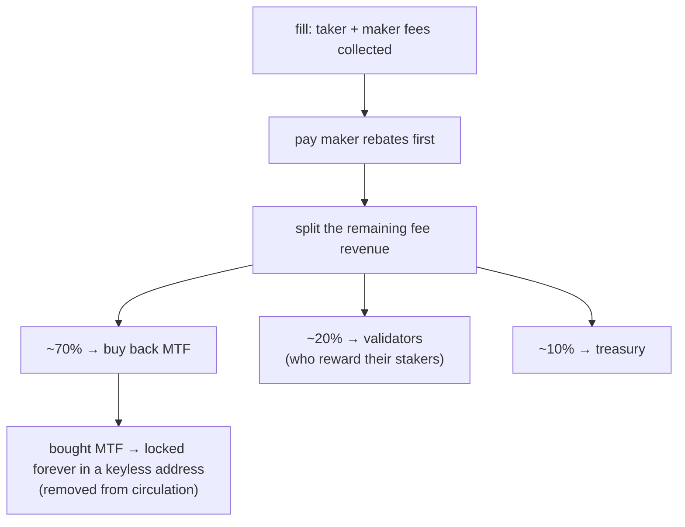

# Fees

This page explains how MetaFlux charges a fee on each fill and where collected fees go.

The rates are on the [fee schedule](./fee-schedule.md): volume fee tiers, maker-rebate tiers
and staking discount tiers. This page covers the fee formula, the broker and referrer credits,
spot and liquidation fees, the [Core to EVM transfer fee](#core-evm-transfer-fee) and the fee
split. Fee values are network parameters. Governance can change them.

## Overview {#tldr}

Every fill charges a maker fee and a taker fee. The [fee schedule](./fee-schedule.md) sets the
rates. A broker credit adds a charge for the account that sent the order flow. The
[referral program](#referrer-credit) sends a share of the taker fee to a referrer.

After the protocol pays maker rebates, it splits the remaining fee revenue ~70% buyback, ~20%
validators and ~10% treasury. The buyback share buys MTF on the open market. It locks that MTF
forever in a keyless protocol address, which removes it from circulation permanently.

The chain deducts each fee from your balance at fill time. Each
[`userFills`](../api/rest/info/orders-fills.md#user_fills) entry shows it. One fee on this page
is not a trading fee: a transfer from Core to MetaFluxEVM charges a
[fee in MTF](#core-evm-transfer-fee). That fee is `0` today.

## Fee computation {#how-a-fee-is-computed}

The chain charges fees in *micro-USDC* (1e-6 USDC) and truncates toward zero. The fee is the
notional (price times size) times the rate, rounded down to the nearest 1e-6 USDC. So a small
fill pays its true fractional fee. A `$20` fill pays a `$0.02` taker fee. The fee does not round
to `$0`, and it does not round to a whole cent or dollar.

### Per fill {#per-fill}

```text
notional    = |price × size|
taker_fee   = notional × taker_rate
maker_fee   = notional × maker_rate
broker_fee  = notional × broker_rate     # additive, taker-only, capped
```

The taker and maker rates come from your tier on the [fee schedule](./fee-schedule.md). Three
inputs set them:

- your base rate, from your 30-day volume
- an extra maker rebate, from your share of maker volume
- a taker discount, from the MTF you stake

A negative effective maker rate is a rebate that the protocol pays to the maker. Taker fees
collected on the same flow fund it. The protocol never pays out more than it takes in.

Each [`userFills`](../api/rest/info/orders-fills.md#user_fills) entry shows the per-fill fee as
`fee`, in USDC base units. A positive value is a fee paid. A negative value is a rebate received.

### Rate resolution {#resolving-your-rate}

Each fill resolves its base rate from each party's own trailing 30-day volume. The taker leg
reads the taker's volume. The maker leg reads the maker's volume. The two rates can differ on
the same fill, because they read different ladders:

```text
tier(volume)    = the highest tier whose volume floor the trader's trailing
                   30-day volume clears (else the base rate)
taker_base_rate = tier(taker's trailing 30-day TAKER volume).taker_rate
maker_base_rate = tier(maker's trailing 30-day MAKER volume).maker_rate
```

Volume enters the trailing window only when a fill charges a positive fee. So a fee-free market
cannot farm a cheaper tier by trading with itself. Volume updates fill by fill. One order that
crosses many resting orders can move its own taker leg into a new tier partway through. The
fifth fill of one order can price at a different rate than the first.

The taker discount and then the maker rebate apply on top of the base rate:

```text
effective_taker_rate = taker_base_rate × (1 − staking_discount)
effective_maker_rate = maker_base_rate − maker_rebate_rate
```

`staking_discount` comes from the MTF you stake or delegate, against the staking discount tiers
on the [fee schedule](./fee-schedule.md). It applies to the taker only. It can only make the rate
smaller. It never makes the rate negative. An account bound to a referrer uses the larger of this
discount and the [referee discount](#referral-share-and-discount). It never uses their sum.

`maker_rebate_rate` comes from your share of the exchange's total 30-day maker volume. That share
is your maker volume divided by the sum of the maker volume of every maker. The maker-rebate tiers
on the [fee schedule](./fee-schedule.md) map the share to a rate. The chain subtracts that rate,
so a high rebate tier can take `effective_maker_rate` below zero. That is the rebate case above:
a credit paid to the maker.

Rounding happens in two steps, both toward zero:

1. The chain truncates the discounted taker rate to the nearest 0.1 basis point. This happens
   before the rate prices a fee.
2. The chain truncates the dollar fee (taker, maker or rebate) to the nearest 1e-6 USDC. This
   step is independent of the first.

Neither step rounds up.

### Product fee tables {#per-product-fees}

MetaFlux prices four products separately. Each product has its own fee ladder, base rates,
maker-rebate ladder, broker-fee ceiling and trailing 30-day volume counters.

| Product | Fills that take this rate |
|---|---|
| `perp` | Every perpetual fill |
| `spot` | An ordinary spot order |
| `spot_margin` | The taker of a leveraged spot open or close |
| `option` | The taker of an RFQ option fill. It is priced separately. See [the option fee](../products/options.md#option-fee) |

Only the taker carries a product. A maker rests on the shared spot book and does not know which
lane crossed it. So the chain always prices and counts a maker as `spot`. A leveraged taker that
crosses a resting spot maker pays the `spot_margin` rate. The maker it hit pays the `spot` rate on
the same fill.

So `spot_margin` and `option` have no maker leg. Their rows on
[`/info fee_schedule`](../api/rest/info/fees-credit.md#fee_schedule) carry no maker fields.

A forced liquidation pays the `spot` rate. The owner of a forced close did not choose to take,
and their history is not on the margin counter. The `spot_margin` rate would charge them the
worst rung, and that fee comes out of the proceeds that repay the lending pool.

A product with no table prices as before, from the chain-wide ladder. Governance sets a product
table by a ⅔-stake vote.

A product table replaces the chain-wide table. It does not merge into it. When a product has a
table, every rate for that product comes from that table:

- An empty volume ladder in a product table sends every account to that table's two base rates.
  It does not fall back to the chain-wide ladder.
- An empty maker-rebate ladder in a product table means no rebate on that product. To keep a
  rebate, restate the ladder in the vote.

A zero rate is a rate. It does not remove the table. A table voted with zero base rates makes
that product free. To remove a table and return the product to the chain-wide schedule, a vote
sets a separate explicit flag. A vote that sets that flag must carry no rates.

The `option` rates have a different shape. Every other product prices on notional against a
volume ladder. An option prices on the smaller of two amounts: its strike face (`strike` x
`size`) and a fraction of its premium. The option product's table sets its two rates. No ladder
sets them. The strike face is the notional on a call as well as on a put. A call escrows one coin,
and the chain cannot read the dollar value of that coin without a price. The fee is in USDC on
both kinds. Both rates start unset, which charges nothing. See
[the option fee](../products/options.md#option-fee).

### Pooled volume sunset {#pooled-volume-sunset}

Before this change, one pooled counter fed every tier. Volume traded on any product bought a
discount on every product. Per-product counters close that gap.

To close the gap at once would drop accounts a tier with no notice. So the two counters run in
parallel for one full 30-day window:

- During the window, a product's tier reads the larger of your pooled volume and your volume on
  that product. At the start the per-product counters are empty, so you keep your old rate.
  Nobody drops a tier on day one.
- On the sunset day, the pooled counter stops buying a discount. Each product reads only the
  volume you traded on it.

The window opens on the first fill after the upgrade and closes 30 days later. Read the date. Do
not assume it. [`/info fee_schedule`](../api/rest/info/fees-credit.md#fee_schedule) serves it as
`pooled_volume_sunset_ms`. `pooled_volume_counts` tells you whether the window is still open.

The same response shows the effect on you. `products[*].taker_volume_30d` is the per-product
number that a tier reads after the window closes. Compare it with the pooled `taker_volume_30d`
in the `user` block. While the two differ, part of your current tier rests on volume that will
stop counting.

This is a rate change on a date, and it needs no vote. If your tier today rests on volume from
more than one product, your rate goes up on the sunset day. This happens even if governance sets
no product table.

The maker rebate reads one plane only, never the better of two. The rebate is a share of total
maker volume, and a new per-product denominator would make a small maker look large. So during
the window the rebate reads the pooled plane only, as before. It changes to per-product on the
sunset day, together with the tiers.

To read the resolved numbers for one account, call
[`/info fee_schedule`](../api/rest/info/fees-credit.md#fee_schedule) with its `address`. The
response returns `taker_volume_30d`, `maker_volume_30d`, `effective_taker_bps`,
`effective_maker_bps`, `staking_discount_permille` and `maker_rebate_bps`. These are the numbers
this section derives, in addition to the ladder.

### Worked example {#worked-example}

A taker buys `0.1` BTC at `$67,000` (notional `$6,700`) against a resting maker ask. Both
accounts are new. They are on the base tier, they stake no MTF, and the maker does not clear a
maker-rebate share tier:

```text
notional         = 67000 × 0.1              = 6700 USDC
taker_base_rate  = 0.035 %  (base tier)
maker_base_rate  = 0.010 %  (base tier)

taker_fee = trunc(6700 × 0.00035) = 2.345 USDC   (paid by the taker)
maker_fee = trunc(6700 × 0.00010) = 0.67  USDC   (paid by the maker)
```

The chain charges both fees in full. The maker's `fee` on `userFills` reads a positive `"0.67"`.

Now add a referrer. The taker has a referrer on file, at the default 10% share:

```text
referrer_share = trunc(taker_fee × 10%) = trunc(2.345 × 0.10) = 0.2345 USDC
protocol_fee   = taker_fee − referrer_share = 2.1105 USDC
```

The referrer share comes out of the taker's fee. It is not an extra charge. The taker still pays
`2.345` in total. The credit accrues on the referrer's own address, where
[`/info fee_schedule`](../api/rest/info/fees-credit.md#fee_schedule) reports
`user.referrer_credit`.

Now take a different maker at a rebate tier. This maker is at the top volume tier
(`maker_base_rate = 0.0000%`) and clears the 3%-share rebate tier
(`maker_rebate_rate = 0.0030%`):

```text
effective_maker_rate = 0.0000% − 0.0030% = −0.0030%   (negative: a credit)
rebate                = trunc(6700 × 0.000030) = 0.201 USDC
rebate_paid           = min(rebate, protocol_fee) = min(0.201, 2.1105) = 0.201 USDC
```

The chain credits the maker `0.201` USDC and charges no fee. `userFills` reports the maker's
`fee` as `"-0.201"`. The protocol fee from the taker on this same fill funds the credit. The
chain does not mint it. So the credit can never be more than what that fee has left after the
referrer share. When the taker fee is too small to cover the rebate, the maker gets only the
remainder, not the full rebate rate.

What is left funds the 70 / 20 / 10 split:

```text
pooled    = protocol_fee − rebate_paid = 2.1105 − 0.201 = 1.9095 USDC
buyback   = trunc(pooled × 70%)        = 1.33665 USDC
validator = trunc(pooled × 20%)        = 0.3819  USDC
treasury  = pooled − buyback − validator = 0.19095 USDC
```

See [Where fees go](#where-fees-go) for what each share does next. A maker fee that the maker
pays, and does not receive as a credit, skips the referrer step. It joins the same 70/20/10 split
at its full amount, because the maker fee carries no referrer share. See
[Referral program](#referrer-credit).

## Broker credit {#broker-credit}

An account that sends order flow can charge its own fee. It sets a broker address on the order.
The charge is additive: the taker pays it on top of the base taker fee. It does not reduce the
referrer share or the protocol split. The chain pays the credit to that address on each fill.
Typical uses:

- a front end or aggregator that routed the flow
- a market-data API that bundles execution
- an automated risk service that placed protective orders

The trader must approve the broker first (see
[`approve_broker_fee`](../api/rest/exchange/account.md#approve_builder_fee)). The chain rejects
an order before it rests if the order names a broker that is not approved. It also rejects an
order whose rate is above the trader's approved ceiling or above the protocol cap. The broker
credit applies to the taker only, with a per-order cap. It does not change the maker side. For
the full rules, see [broker codes](./broker-codes.md).

The chain checks two bounds on `broker_rate` before an order can rest:

- at or below the protocol cap, a governed value with a default of 8 basis points
- at or below the ceiling that the trader's own `approve_broker_fee` set for that broker

The charge is `notional × broker_rate`, truncated toward zero to the nearest 1e-6 USDC. The
broker's address receives this exact amount, so the debit and the credit always match.

## Referral program {#referrer-credit}

A **referrer** brings a trader to the exchange. That trader is the **referee**. When the referee
pays a taker fee, the referrer gets a **share** of that fee. The referee can get a **discount** on
its taker rate. Both stop at a **cap** on the referee's volume.

### Program overview {#referral-overview}

Governance turned referral codes on 2026-10-05. Every value below is a governed parameter. Read
the value in force from [`fee_schedule`](../api/rest/info/fees-credit.md#fee_schedule) before you
show it.

| Step | Rule | Value on 2026-10-05 |
|---|---|---|
| Get a code | Your trailing 30-day taker plus maker volume reaches `referral_code_min_volume_usd`. Then you register one code. The code is permanent | 10,000 USDC |
| Share the code | Send the invite link `https://app.mtf.exchange/join/<code>` | — |
| Bind | The trader binds to the code once. The bind is permanent | — |
| The referee earns | `referee_discount_permille` off its taker rate | `50` (5%) |
| The referrer earns | `referrer_share_bps` of each taker fee the referee pays | `1000` (10%) |
| The discount stops | The referee's taker volume since the bind reaches `referee_discount_cap_usd` | 25,000,000 USDC |
| The share stops | The same volume reaches `referrer_reward_cap_usd` | 1,000,000,000 USDC |

- **Bind with a code.** While codes are on, a bind by address works only to an account that
  holds a code. So an invite link must carry the code, not an address.
- **Single level.** A referred account cannot get a code, and a code holder cannot bind.
- **USDC credit.** The share is USDC credit. Read it with
  [`referral_state`](../api/rest/info/fees-credit.md#referral_state) and claim it with
  [`claim_referral_rewards`](../api/rest/exchange/account.md#claim_referral_rewards). The claim
  also drains the broker credit.

### Referral codes {#referral-codes}

A **referral code** is a short name for a referrer address. A referee binds with the code, so a
referrer can hand out a name instead of an address. Register a code with
[`register_referral_code`](../api/rest/exchange/account.md#register_referral_code).

- **Format.** A code has 3 to 16 characters, `a-z` and `0-9` only. The node refuses an uppercase
  letter and does not fold the case. So the signed payload and the stored code are the same
  bytes, and one code has one spelling.
- **One code per account.** The code never changes. A referee who bound to a code must keep the
  same referrer. If a code could move, the referee would move with it.
- **Reserved words.** The node refuses `mtf`, `metaflux`, `admin`, `official`, `support`, `team`,
  `help`, `referral`, `hyperliquid` and `hl`. A code that reads as the exchange would mislead a
  referee about who it binds to.
- **No code on a referee.** Referrals are single-level. A code on a referee would make a chain of
  two levels.
- **Volume minimum.** The account's pooled 30-day taker volume plus its pooled 30-day maker
  volume must reach the governed minimum. So each new referrer identity must trade first, and a
  farm of fresh addresses cannot mint codes for free. The chain keeps a 30-day counter and no
  lifetime counter, so the rule reads the 30-day counter.
- **Codes off.** A minimum of `0` turns codes off. Then the node refuses every registration, and
  `set_referrer` by address needs no code. The minimum is 10,000 USDC since 2026-10-05, so codes
  are on.

### Referrer binding {#referral-binding}

A referee binds once, with
[`set_referrer_by_code`](../api/rest/exchange/account.md#set_referrer_by_code) or with
[`set_referrer`](../api/rest/exchange/account.md#set_referrer) and an address.

- **Permanent.** No action and no governance vote can change or remove a referrer. If a referrer
  could change, a trader could sell its flow to the highest bidder after the first referrer did
  the work.
- **Single level in both directions.** A referee cannot bind to an account that has its own
  referrer. An account that already has referees cannot bind. An account that holds a code
  cannot bind.
- **Address binds need a code holder.** While codes are on, `set_referrer` refuses a referrer
  that holds no code, with `referrer has no referral code`. Codes are on, so an invite link that
  carries an address fails for every address without a code. Without this rule, one trader could
  bind a fresh second address to itself. It could then take the share on its own fees without
  the 30-day volume that a code costs.
- **Not retroactive.** You can bind after your first trade. The share, the discount and the
  counters start at the bind.

### Share and discount {#referral-share-and-discount}

On each taker fill of a bound referee:

```text
discount_permille = max(staking_discount_permille, referee_discount_permille)
taker_rate        = trunc_0.1bps(taker_base_rate × (1 − discount_permille / 1000))
fee_paid          = trunc_1e-6(notional × taker_rate)
referrer_share    = trunc_1e-6(fee_paid × referrer_share_bps / 10000)
```

- **Share.** The share is a governed part of the fee that the referee actually paid, measured
  after the discount. The default is `1000` bps, which is 10%. The share comes out of the
  protocol's part of the fee, before the maker rebate and the 70/20/10 split. It is not an extra
  charge to the referee.
- **Discount.** The discount is governed and applies to the taker only. It is the larger of two
  discounts, never their sum: the referee discount and the [staking discount](./fee-schedule.md).
  A sum would let two ladders stack past the bound that each one was set to. The discount applies
  on perp and spot taker fills, where the staking discount applies.
- **Truncation.** The rate truncates to a whole 0.1 basis point. So the real discount can be a
  little larger than the permille. At the base taker rate of 0.035%, a 50‰ discount gives
  0.033%, not 0.03325%.
- **Maker fees.** A maker fee carries no share and no discount.
- **Liquidation fills.** A liquidation fill carries no share and no discount. The liquidation
  engine placed that order, not the referee, so the referrer brought no flow to it. The staking
  discount still applies.
- **Spot buys.** A spot buy that pays its fee in the base token pays the share in kind. See
  [spot fees](#spot-fees) below. That share never enters the claimable USDC credit.

The share accrues as USDC credit on the referrer's address. Read it with
[`referral_state`](../api/rest/info/fees-credit.md#referral_state) and claim it with
[`claim_referral_rewards`](../api/rest/exchange/account.md#claim_referral_rewards). The claim
moves it into the referrer's cross-collateral.

### Caps {#referral-caps}

Two governed caps stop the program for one referee:

| Cap | Stops | When |
|---|---|---|
| `referee_discount_cap_usd` | the referee discount | the referee's taker volume since the bind reaches the cap |
| `referrer_reward_cap_usd` | the referrer share on that referee's fees | the same volume reaches this cap |

- **`0` means no cap.** The default of every cap is `0`. Governance set both caps on 2026-10-05:
  25,000,000 USDC for the discount and 1,000,000,000 USDC for the share.
- **Crossing fill.** The fill that crosses a cap still counts. The node compares the volume from
  before the fill. The next fill gets nothing.
- **Taker fills only.** Only a taker fill adds volume. A maker fill and a liquidation fill add
  none, because they carry no share and no discount.
- **Option fills.** An option fill adds no volume. It pays the share on its fee and gets no
  referee discount. Its fee is priced on the strike face, not on a traded notional, so it does
  not move a cap.
- **Older bindings.** A binding made before block 25,599,540 starts its volume at `0`. The chain
  did not count that volume before, so it cannot charge it against a cap.

### Governed parameters {#referral-parameters}

Validators change each value with a `vote_global` of the kind below. The node checks the bounds
at the vote.

| Kind | `kind_name` | Sets | Bounds | Default | Value on 2026-10-05 |
|---|---|---|---|---|---|
| 131 | `set_referrer_share_bps` | the referrer share, bps of the fee paid | `0` to `10000` | `1000` (10%) | `1000` (10%) |
| 132 | `set_referee_discount_permille` | the referee discount, permille off the taker rate | `0` to `1000` | `0` | `50` (5%) |
| 133 | `set_referral_code_min_volume_usd` | the 30-day volume a code needs, whole USDC. `0` = codes off | integer, `0` to 10^12 | `0` | `10000` |
| 134 | `set_referee_discount_cap_usd` | the discount cap, whole USDC of referee volume. `0` = no cap | integer, `0` to 10^15 | `0` | `25000000` |
| 135 | `set_referrer_reward_cap_usd` | the share cap, whole USDC of referee volume. `0` = no cap | integer, `0` to 10^15 | `0` | `1000000000` |

The defaults change no fee. The votes of 2026-10-05 turned the program on. A later vote can
change any value without a release, so this table can lag the chain.
[`fee_schedule`](../api/rest/info/fees-credit.md#fee_schedule) serves the values in force.

### Self-referral bound {#referral-self-referral-bound}

A trader can bind a second address to its own code. As a fraction of the fee at the undiscounted
rate, that pair gets back at most:

```text
discount + share × (1 − discount)
```

`discount` is the real discount after the rate truncation. With the values of 2026-10-05 at the
base taker rate, the rate falls from 0.035% to 0.033%. So the discount is 2/35, about 5.7%. The
pair gets back about `0.057 + 0.10 × 0.943 ≈ 15.1%`. That is never more than the fee. So a
self-referral is a discount that the pair paid volume to earn. It is not a way to take funds. The
code minimum makes each referrer identity trade first, and the caps limit what one referee can
collect.

A broker credit and a referrer credit can both apply to the same fill. They accrue
independently.

The two credits are separate balances with one claim. Read the referrer balance with
[`referral_state`](../api/rest/info/fees-credit.md#referral_state) and the broker balance with
[`broker_state`](../api/rest/info/fees-credit.md#broker_state).
[`claim_referral_rewards`](../api/rest/exchange/account.md#claim_referral_rewards) and
[`claim_broker_rewards`](../api/rest/exchange/account.md#claim_builder_rewards) do the same
thing: each one drains both balances. The claim reply reports no amount, so read both balances
first.

## Where fees go {#where-fees-go}

Collected fees go through one value-accrual pipeline:


```mermaid
flowchart TD
    fill["fill: taker + maker fees collected"]
    rebate["pay maker rebates first"]
    split["split the remaining fee revenue"]
    buyback["~70% → buy back MTF"]
    sink["bought MTF → locked forever in a keyless address<br/>(removed from circulation)"]
    validators["~20% → validators<br/>(who reward their stakers)"]
    treasury["~10% → treasury"]

    fill --> rebate
    rebate --> split
    split --> buyback
    split --> validators
    split --> treasury
    buyback --> sink
```

1. **Maker rebates.** The chain pays negative net maker rates (see the
   [fee schedule](./fee-schedule.md)) first, from the fees collected on the same flow.
2. **Split.** After rebates, the chain splits the remaining fee revenue three ways: ~70%
   buyback, ~20% validators and ~10% treasury. The treasury share takes the rounding dust, so the
   split loses nothing.
3. **Buyback.** The ~70% buyback share buys MTF on the open market. It matches resting sell
   orders on the MTF/USDC book, lowest price first. The protocol never pays above a price
   ceiling that resists manipulation:
   - When MTF has an external mark, the ceiling is the oracle-bounded mark plus a
     governance-set slippage allowance.
   - When MTF has no external mark, the ceiling uses a smoothed average of the protocol's *own*
     recent buyback execution prices. No third party can move this reference by trading. The
     only way to move it is to make the protocol itself execute higher. That move is
     rate-limited to a small step per round. A governance-set reference price can also cap it
     to a fixed band.

   The buyback skips sell orders above the ceiling, and the unspent balance carries to the next
   round. If no trustworthy reference exists yet, the buyback waits. It does not buy at an
   unverified price. In fast markets the buyback can lag the price, by design.
4. **Lock.** The buyback sends every MTF it buys to a keyless protocol address. The MTF can never
   leave that address, so it leaves the circulating float permanently. This is the deflationary
   force: exchange revenue buys MTF and takes it out of circulation, at a rate that scales with
   trading volume. The buyback does not change the token's headline total supply, which is a
   separate figure.
5. **Staker rewards.** Validators reward their stakers from the ~20% validator share. The
   validator fee share funds the staker dividend. The bought-back MTF does not fund it. The
   validator pool accrues in the fill currency and buys its own MTF on the book from time to
   time. The chain distributes that MTF (see [Staking](./staking.md#reward-sources)). Only
   delegators with a lock of 1 month or more get this share. Flexible (no-lock) stakers keep
   their fee discount but get no part of this share.

The chain tracks the cumulative pool totals in committed state: the MTF bought back and locked,
the validator pool and the treasury. No read serves them. See
[deleted reads](../api/rest/info.md#retired-reads).

The staker dividend comes through the validator share. To get a larger part of it, stake more
MTF or delegate to a validator. See [Staking](./staking.md).

### Buyback asset binding {#buyback-asset-binding}

The buyback executor buys one asset, and a binding tells it which one. That binding is one asset
id. Until the id is bound, the buyback cannot fire, and the accrued USDC keeps growing. The chain
records the unbound state as `buyback_status.mtf_asset_id: null` with
`blocking_guard: "mtf_asset_unbound"`. No read serves that record. See
[deleted reads](../api/rest/info.md#retired-reads).

Genesis binds the id by name. So a chain that registered its MTF token after genesis starts with
no id bound. The hosted sandbox is in that state today. A two-thirds-stake vote,
`set_mtf_asset_id`, binds the id at runtime.

Three rules govern that vote:

- **Offset value.** The voted value is `asset_id + 1`, not the asset id. The offset keeps `0` as
  "no vote". A vote of `1` binds asset `0`. No value means "unbind".
- **Immutable id.** A bound id never changes. The staking ledger, the assistance-fund holdings
  and the native-gas lane all use it as a key. A new id would strand them under the old id with
  no migration. Only a re-vote of the same id enacts, and it changes nothing. The chain refuses a
  vote for a different id.
- **Registered asset.** The asset must already be registered. It cannot be the USDC quote asset.

The enactment appears on
[`validator_votes`](../api/rest/info/governance.md#validator_votes) as
`changes[*].field: "mtf_asset_id"`.

### Buyback slices {#buyback-drip}

Each fire spends one slice: `min(available, slice_usdc)`, default 250 USDC. The rest is realized
at the [assistance fund](./system-addresses.md), and the next fire continues from there. So a
large pool reaches the book over many blocks, not in one order.

Two rules follow:

- **A started schedule runs to the end.** The first slice takes the pool below `trigger_usdc`, so
  a drain in progress skips the trigger test. Without this rule, a started drain would stop until
  fees accrued again.
- **Conservation does not change.** Every fire satisfies `available == spent + held`. The slices
  change how fast the USDC reaches the book. They never change how much reaches it.

:::info
Only the buyback itself can start a drain. "In progress" is a marker that the firing effect
writes. It is not the assistance fund's balance. This matters because the fund address accepts
an ordinary spot transfer. A balance test would let anyone send it 1 USDC and make every later
fire skip the trigger. That would turn a two-thirds-stake parameter into a suggestion.

So money sent to that address counts toward `trigger_usdc`, because it is real USDC that the next
fire can spend. But it cannot start a drain below the trigger. Only a slice that the buyback
already fired can start one. The `held_at_hub` figure that reports donated money is an operator
read and is no longer public.

A drain that is already running is a different case. Its next fire includes everything the fund
holds, donations too. So money sent during a drain is spent by that drain and burned with the
rest.
:::

A two-thirds-stake vote, `set_buyback_slice_usdc`, sets the slice. Its bounds are
`(0, 100000000]` USDC. The floor is hard: a `0` slice would stop the slices and leave the pool
with no way to drain. To slow the buyback, raise the interval instead. The enactment appears on
[`validator_votes`](../api/rest/info/governance.md#validator_votes) as
`changes[*].field: "fee.buyback_slice_usdc"`.

## Spot fees {#spot-fees}

Spot fills use the same maker and taker shape as perps. The chain charges spot fees on a separate
fee account from perps. Spot resolves its rate with the same steps as
[Rate resolution](#resolving-your-rate): the 30-day tier from each party's own volume, the staking
discount on the taker leg and the maker rebate on the maker leg. It uses the same ladders and the
same rates. Spot has no separate multiplier.

A seller pays in the quote token of the pair. A buyer pays in the base token it receives (see
[below](#spot-buy-fee-in-base)). Each spot pair can set its own maker and taker rate. When a pair
leaves them unset, the global spot default applies. See the spot tiers in the
[`/info fee_schedule`](../api/rest/info/fees-credit.md#fee_schedule) response, and
[spot trading](../products/spot.md#matching-fills-and-fees) for the settlement model.

### Spot buy fee in the base token {#spot-buy-fee-in-base}

:::note Historical fills before block 6,565,000
Below that height, a spot buyer paid its fee in the quote token. Every fill now carries
[`fee_token`](../api/rest/info/orders-fills.md#user_fills), derived per record. An older fill
reports `"USDC"` on both sides, and a newer fill reports the base token on the buy leg. Read
`fee_token`. Do not derive the boundary from the block height yourself.
:::

Each side pays from the leg it receives. A sell receives USDC and pays from it. A buy receives
the base token, so the buy fee comes out of the base, for the taker and the maker alike. The rule
closes a real hole. A fee in a token that the buyer does not receive can be charged against an
empty balance. Before the rule, a resting buyer with no spendable quote paid nothing.

```text
buyer_rate = effective_taker_rate if the taker is buying, else effective_maker_rate
base_fee   = gross_size × buyer_rate         # exact — see rounding below
base_fee   = min(base_fee, gross_size)        # can never exceed what was bought
net_credit = gross_size − base_fee
```

The rate is always the buyer's own resolved rate. It is the taker's rate when the taker buys. It
is the maker's rate when the maker buys and the taker sells. A seller pays no base fee, and its
leg does not change.

Rounding here is different from the rest of this page. The chain computes the base fee at the
token's own size precision plus five more decimal places. That precision is fine enough that the
product never needs rounding for any realistic trade size. The chain does not truncate the base
fee to the 1e-6 USDC quantum that the quote-side fee uses. That truncation would make the fee
zero on a small lot and reopen the hole that this rule closes (see consequence 3 below).

Example: a taker buys `1.0` BTC at the `0.035%` base rate. Then
`base_fee = 1.0 × 0.00035 = 0.00035` BTC exactly, and `net_credit = 0.99965` BTC. These are the
numbers in consequence 1 below. The referrer share and the maker rebate come out of this same
`base_fee`, in kind. They use the same referrer-share and rebate-tier rules as
[above](#resolving-your-rate). See consequence 2.

A caller must handle four consequences:

1. **Gross fill size, net balance credit.** A taker buying `1.0` BTC at a `0.035%` rate sees
   `sz: "1.0"` on the fill and receives `0.99965` BTC. So a sum of fill sizes is more than the
   holdings. To know what you own, read the balance, not the sum of fills.

   The chain nets the base fee from the credit and does not debit it. So the fill's `fee` field
   does not carry it. The committed trade record does not change. You can see the fee only as the
   difference between `sz` and the balance change, by design. The read-side
   [`fee_token`](../api/rest/info/orders-fills.md#user_fills) field names the denomination, so a
   caller knows which case it is in. On a spot buy it reads the base token, which tells you that
   the `fee` number is not the full fee. The chain derives `fee_token` at read time, and it
   changes no committed field.
2. **Referrer share and maker rebate in kind.** On a buy, the chain credits them as a spot
   balance in that pair's base token, at the fill. They do not enter the claimable USDC
   [referrer credit](#referrer-credit). That balance is in USDC, and a base amount cannot join
   it. So the referrer of a BTC buyer receives BTC and has nothing to claim. The referrer of a
   seller still receives claimable USDC.
3. **Sub-lot dust.** Netted balances carry permanent dust below one lot. The chain computes the
   fee exactly and does not quantize it to the token's tradeable lot. So the netted credit ends
   below one lot of precision: a 1-lot BTC taker buy leaves about `3.5e-9` BTC. That residue is
   real and yours, but it is smaller than one lot, so no order can sell it. The chain truncates
   it when you withdraw. This is by design. Quantizing would keep balances clean but reopen a
   zero-fee window: any BTC buy under ten lots would pay nothing. A window can be farmed, and
   dust cannot.
4. **Zero-rate pairs.** A zero-rate pair still adds no volume to the tier ladder. Volume rolls
   only when the chain collects a positive fee. On a positive-rate pair that is now every fill,
   including the resting-buy fills that used to add nothing. On a pair whose rate is zero,
   nothing rolls, so a free pair cannot farm a cheaper tier. The 30-day ladder stays
   USD-denominated. A base-token fee does not change the currency that measures volume.

## Fees on liquidation fills {#fees-on-liquidation-fills}

A liquidation close uses the standard taker-fee path above. A separate liquidation fee is a
design intent: an extra charge, split between the insurance pool and the treasury, to keep
insurance solvent and to pay makers who absorb forced flow. The protocol charges no such fee. A
liquidated account pays the loss settled on close and nothing more. See
[tiered liquidation](./tiered-liquidation.md) for the close mechanics.

A liquidation fill pays no referrer share and gets no referee discount. See
[the referral program](#referral-share-and-discount).

## Core to EVM transfer fee {#core-evm-transfer-fee}

:::info
Not charged today. The parameter is `0`. This is the only fee on this page that is not a trading
fee, and no transfer pays it yet. Charging starts when a governance vote enacts a value above
`0`. There is no height to wait for. Watch for the enactment on
[`validator_votes`](../api/rest/info/governance.md#validator_votes). The row carries
`changes[*].field: "fee.core_evm_fee_mtf"`.
:::

A transfer from the Core ledger to MetaFluxEVM charges its own fee. Two actions make the move:
[`core_evm_transfer`](../api/rest/exchange/transfers.md#core_evm_transfer) and
[`send_to_evm_with_data`](../api/rest/exchange/transfers.md#send_to_evm_with_data). Both charge
the fee under one rule, so neither lane is cheaper.

The fee is a quantity of MTF, charged on top of the amount you move. It is a separate debit, and
it does not depend on the asset in the transfer. A transfer of BTC debits BTC for the amount and
MTF for the fee. The chain takes the fee in this order:

1. From your spot MTF balance.
2. From your USDC, at the MTF reference price, when spot MTF cannot cover it.

The chain refuses the transfer when neither covers the fee. All proceeds are validator revenue.
This fee is not split three ways like a trading fee. The proceeds reach validators and their
stakers through the same payout as the validator share in [where fees go](#where-fees-go).

:::warning
A transfer can be refused for a reason that has nothing to do with the asset you move. MTF is
priced from its own book, so the USDC step needs that reference price. When that price is not
usable, the chain refuses the transfer. It does not charge at a guessed price. If you hold enough
spot MTF to cover the fee, the chain never reads the reference price. The rejection strings are
on [the fee](../api/rest/exchange/transfers.md#core-evm-fee).
:::

### Governance parameter {#core-evm-fee-parameter}

| | |
|---|---|
| Vote | `set_core_evm_fee_mtf`, a two-thirds-stake vote |
| Value | The fee as a quantity of MTF. It is not a rate and not a USDC amount |
| Bounds | `0` to `1000` MTF, at most 8 decimal places |
| `0` | Clears the fee, so no transfer is charged. This is the value today |
| Enactment | Shows on [`validator_votes`](../api/rest/info/governance.md#validator_votes) as `changes[*].field: "fee.core_evm_fee_mtf"` |

The value is a quantity, so the fee does not scale with the amount. A `1` USDC transfer and a
`100000` USDC transfer pay the same MTF fee.

## Queries {#querying}

```bash
# tier overview (MTF-native — gateway default path; running the node yourself: localhost:8080)
curl -X POST https://api.testnet.mtf.exchange/info -d '{"type":"fee_schedule"}'

# your effective tier and recent volume — same read, with an address
curl -X POST https://api.testnet.mtf.exchange/info \
  -d '{"type":"fee_schedule","address":"0x<addr>"}'
```

## Edge cases {#edge-cases}

<details>
<summary>Show edge cases</summary>

- **Volume across sub-accounts.** A master account and all its sub-accounts share one volume
  tier. A desk that runs many strategies under one master gets the aggregate tier.
- **Tier evaluation.** The chain evaluates tiers continuously on the current 30-day window. It
  takes no periodic snapshot. A trade that moves you into a new tier applies from the next fill.
- **Broker credit and referrer credit.** Both can apply to the same fill: the account has a
  referrer, and the order names a broker. The two pay out independently.
- **Negative-fee maker tier.** When the net maker rate is below zero, the chain pays the maker
  from taker fees collected on the same flow, and across all fills in the same block. The
  protocol never pays out more than it takes in.

</details>

## See also {#see-also}

- [Fee schedule](./fee-schedule.md): the rate card. It lists volume fee tiers, maker-rebate tiers
  and staking discount tiers, and how the three combine.
- [Staking](./staking.md): stake MTF for the validator-share dividend and the taker discount.
- [`POST /info fee_schedule`](../api/rest/info/fees-credit.md#fee_schedule): the ladder, and the
  effective rate for one address.
- [Tiered liquidation](./tiered-liquidation.md): liquidation mechanics.
- [Core and EVM transfers](../evm/core-evm-transfers.md): the lane that the
  [Core to EVM transfer fee](#core-evm-transfer-fee) applies to.

## FAQ {#faq}

<details>
<summary>Show FAQ</summary>

**Q: Are fees applied per fill or per order?**
A: Per fill. A partly filled order pays a fee on the filled size at each fill.

**Q: Are fees paid in USDC or in MTF?**
A: You pay in the fill currency: USDC for perps, and the pair's quote token for spot. The
protocol splits that fee revenue ~70/20/10. The ~70% buyback share buys MTF on the open market
and locks it out of circulation. The validator share accrues in the fill currency, and the chain
converts it to MTF before it pays stakers. The treasury share stays in the fill currency.

**Q: Is there a minimum fee?**
A: No. A small fill computes a sub-cent fee, and the wire carries that fractional amount. The
`fee` field on a fill is a decimal-USDC string, truncated toward zero at 1e-6 (micro-USDC). There
is no separate display precision. The value you see is the value charged.

**Q: Does each TWAP slice pay the taker fee?**
A: Yes. Each slice is an IOC at the protocol's discretion. The total TWAP fee is the sum of the
slice fees.

**Q: Can the broker credit be zero?**
A: Yes. If you set no broker on an order, the chain allocates no credit. The full protocol share
goes to the buyback-and-lock pipeline.

**Q: How do stakers earn from fees?**
A: Through the validator share. 20% of net fee revenue accrues to the validator pool. The chain
converts it to MTF on the book and passes it to stakers with a lock of 1 month or more. So a
delegation with a lock earns a part of fee revenue, paid in MTF. See
[Staking](./staking.md#reward-sources).

</details>
