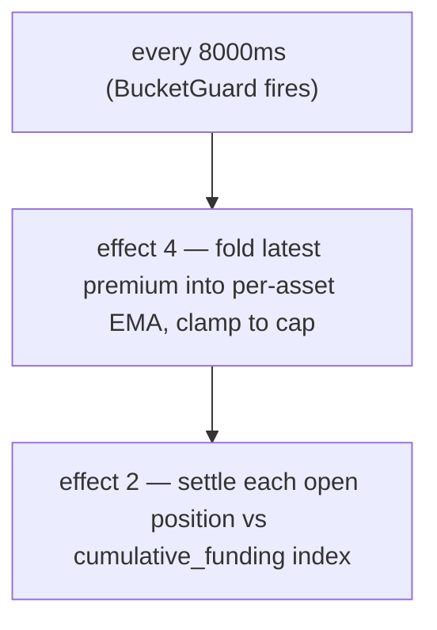

# Funding rates

:::tip
**Stable.**
:::

## TL;DR

Perpetual positions accrue a continuous funding payment (settled every **8 s** on-chain) proportional to the perp's **premium over the oracle** — measured from the depth-weighted **impact price**, not a single trade — plus a small baseline **interest** term. Longs pay shorts when the perp trades above the oracle; shorts pay longs when below. The result is capped at a per-market default of **`±4% / hour`**, and settles against the **oracle**.

## Why funding exists

Perps have no expiry, so there's no arbitrage force to peg them to the underlying. Funding does that job: when perp price drifts above spot, longs pay, which incentivises shorts and disincentivises longs until the perp drifts back down. The protocol never takes either side — it's user-to-user.

## Formula

> The TL;DR above is the conceptual model. The numbers below are the **implemented** values. Where the prose and the code differ, the code wins; the differences are flagged inline.

### How it's computed

Funding is driven by a **deterministic EMA** of the premium (impact price − oracle), settled every **8 seconds**, not hourly. The cap is **4 % / hour**, not 0.05 %.

Two begin-block effects run the cycle, each behind an 8000 ms `BucketGuard`:

- **effect 4 `update_funding_rates`** — folds the latest premium sample into the per-asset EMA, then clamps.
- **effect 2 `distribute_funding`** — settles each open position against the cumulative funding index.

#### 0. Premium basis — the impact price (not the last trade)

The per-block **premium sample** is the gap between the perp's **impact price** and the oracle:

```
premium = (impact_mid − oracle) / oracle
impact_mid = mid( impact_bid, impact_ask )
impact_bid/ask = VWAP of walking the committed book to fill a fixed notional (default ~$10k)
```

Using the *impact* price — the volume-weighted price to fill a real clip — rather than the last trade or the best quote means a single print, or a one-lot order at a silly price, **cannot** move funding: you have to move genuine depth. This mirrors the reference perp design. (A legacy per-market mode instead samples `premium = (mark − oracle)/oracle`; new and migrated markets use the impact basis above.)

#### 1. Premium index EMA (per market)

The premium is smoothed by a **deterministic EMA** (the *premium index*). The accumulator stores a fixed-point fraction `(num, denom)` — no floats, exact `rust_decimal::Decimal` arithmetic so node-to-node state is bit-identical. Each sample folds in as:

```
num'   = num   * decay + sample
denom' = denom * decay + 1
value  = num / denom
```

- `sample` = latest premium for the asset × the per-asset `funding_rate_multiplier` (default `1.0`; auto-driven by the dynamic-risk engine).
- `decay = 0.5` (proposed default → ≈ 7 s half-life at the 5 s sample cadence). Clamped to `[0, 1]` at update time.
- Sample cadence: **5 s**; EMA fold + settle cadence: **8000 ms** (`funding_update_guard` / `funding_distribute_guard`).

> **Status:** the full funding loop is **live** end to end. Each 8 s period the rate driver samples the premium from committed state (the impact-vs-oracle premium above, one sample per perp market), folds it into the per-asset premium-index EMA, derives the rate (interest + clamp), caps it, then settlement advances the cumulative funding index and moves `size × Δindex` between position owners' balances (zero-sum: longs pay shorts or vice versa, no mint/burn) — all from committed market state, no external premium feeder. Conservation- and determinism-fuzzed, with a 4-node e2e proving divergence → premium → EMA → index → balance transfer.

#### 2. Rate from the premium index (interest + clamp)

The funding rate is **not** the raw premium index. The smoothed index `premium_idx` is combined with a baseline **interest** term through a per-step clamp:

```
interest = 0.0000125 / h        # = 0.01% / 8h — the baseline carry
clamp    = ±0.0005              # per-step bound

funding = premium_idx + clamp( interest − premium_idx, −clamp, +clamp )
```

When the premium index is small, funding drifts toward the `interest` baseline; when the premium is large, the `premium_idx` term dominates and the clamp bounds how hard the interest pulls back each step. Both `interest` and `clamp` are per-asset governance-overridable. (The legacy per-market mode instead reads the EMA value directly as the rate, with no interest/clamp transform.)

#### 3. Outer cap

`funding` is finally clamped to the per-hour cap:

```
cap_per_hour = 0.04          # 4 %/h default
funding = clamp(funding, −cap_per_hour, +cap_per_hour)
```

The cap is a per-market governance parameter: a `dynamic_risk_overrides[asset].funding_rate_cap` replaces the `0.04` default when set.

#### 4. Payment (per position, per settle)

Funding accrues into a cumulative index per market (`clearinghouse.cumulative_funding`); each position carries its last-settled index (`funding_entry`). At settle:

```
payment = size_signed * oracle_px * (cum_global - funding_entry) * funding_rate_multiplier[asset]
funding_entry := cum_global      # roll forward
```

(The arithmetic is wired and determinism-locked; the actual balance transfer lands with full BOLE settlement.)

| Symbol | Meaning / plane |
|--------|-----------------|
| `size_signed` | Signed position size; `i128`. Long > 0, short < 0. |
| `oracle_px` | Composed oracle price — whole-USDC `Decimal` plane (see [mark prices](./mark-prices.md)). |
| `cum_global − funding_entry` | Cumulative funding accrued for this market since the position last settled. |
| `decay` | EMA decay 0.5. |
| `cap_per_hour` | Default `0.04` (4 %/h); per-market override via dynamic risk. |
| `funding_rate_multiplier` | Per-asset multiplier, default `1.0`, auto-driven by dynamic risk. |

`funding_rate` (the EMA value) is signed: positive → longs pay shorts; negative → shorts pay longs.

**Base interest:** `0.0000125/h` (= `0.01%/8h`) — the baseline carry the premium EMA is added to.

> ⚠️ **Correction vs. prior text.** The older prose said "every hour", "60-minute EMA window", and "cap 0.05 %/hour". The implementation settles every **8 s**, the EMA `decay` is **0.5** (≈ 7 s half-life), and the cap is **4 %/hour**. The hourly mental model is fine for back-of-envelope carry math, but the on-chain cadence and cap are as above.

## Payment cadence

Funding settles **every 8 seconds** (the `funding_distribute_guard` interval), driven by consensus-derived block timestamps — not wall-clock hours. Positions are settled against the cumulative funding index, so a position opened mid-interval only pays for the accrual since it opened (no "snapshot at the hour" step).



Payments settle as balance adjustments — no on-chain trade, no fee. They show on the user's history as `kind: "funding"`.

## Gating when the oracle is untrusted

Funding **settles against the oracle**, so a price the protocol does not trust must not drive a payment. Each period the premium sample is *gated*: it is skipped (sampled as **0**) when

- the **oracle is missing or ≤ 0** for the market, or
- the **oracle is stale** beyond `funding_oracle_staleness_ms` (default **60 s**), or
- the **book is too thin** to fill the impact notional on both sides (no impact price).

A skipped sample is folded as 0, so the premium-index EMA **decays toward 0** and the funding rate fades out rather than settling off a stale or manipulable basis. (See also [edge cases](#edge-cases).)

:::info
**This is why you can see a large mark↔oracle gap with funding ≈ 0.** If a market's oracle feed is broken or distrusted, funding is gated off and decays to 0 — even while the [mark](./mark-prices.md#mark-vs-oracle--why-they-diverge) (which is built from the book and external perps) sits far from the last good oracle. A wide gap with ~0 funding is the protocol *declining to charge funding off a bad oracle*, not a funding bug.
:::

## Worked example

Market: BTC perp, current state (oracle plane in whole USDC):

```
mark         = 100.50
oracle       = 100.00
premium      = mark - oracle = 0.50
EMA(premium) settles toward 0.50 with decay 0.5 over a few 5s samples
funding cap  = 4% / hour (default)
```

Suppose the EMA value resolves to a funding rate of `+0.0005` (0.05 %) for the interval (well inside the 4 %/h cap). Account positions:

```
long 1 BTC      → pays funding
short 0.5 BTC   → receives funding
```

```
funding_rate = clamp(ema_value, -0.04, +0.04) = +0.0005   (not capped — far below 4%/h)

long 1 BTC:
  payment = +1   * oracle_px * Δcum  ≈ +1   * 100.00 * 0.0005 = +0.0500 USDC  (long pays)

short 0.5 BTC:
  payment = -0.5 * oracle_px * Δcum  ≈ -0.5 * 100.00 * 0.0005 = -0.0250 USDC  (short receives 0.0250)
```

(Payment uses `size_signed * oracle_px * (cum_global - funding_entry)`; here `Δcum` is the funding accrued since the position last settled.) Settled every 8 s, the per-interval magnitude is tiny; the cap matters only for sustained one-sided imbalance, where 4 %/h is the ceiling.

## Funding caps & dynamic limits

| Parameter | Default | Source / override |
|-----------|---------|-------------------|
| funding cap (per hour) | `0.04` (`4 %/h`) | `dynamic_risk_overrides[asset].funding_rate_cap` (governance vote) |
| EMA `decay` | `0.5` (≈ 7 s half-life) | Proposed; calibration may retune to 0.3/0.7 |
| sample cadence | `5 s` | protocol-fixed |
| settle / update interval | `8000 ms` | `funding_distribute_guard` / `funding_update_guard` BucketGuards |
| base interest | `0.0000125/h` (`0.01 %/8h`) | protocol-fixed |
| `funding_rate_multiplier` | `1.0` | per-asset, auto-driven by dynamic risk |

The per-asset `funding_rate_multiplier` is MTF's improvement over HL's governance-static value: it's auto-driven from 30-day realized volatility by the dynamic-risk engine, scaling the premium sample before it enters the EMA.

## Funding history

Per-account history via [`POST /info userFills`](../api/rest/info.md) or [HL-compat `userFills`](../api/rest/hl-compat.md) — funding payments appear with `kind: "funding"` and the relevant asset.

Per-market history:

```bash
curl -X POST https://devnet-gateway.mtf.exchange/info \
  -H 'content-type: application/json' \
  -d '{"type":"funding_history","market_id":0}'
```

Returns the ordered ring of `(ts_ms, premium)` samples (see
[`funding_history`](../api/rest/info/perpetuals.md#funding_history)):

```json
{
  "type": "funding_history",
  "data": {
    "market_id": 0,
    "samples": [
      { "ts_ms": 1700000000000, "premium": "0.0015" },
      { "ts_ms": 1700000008000, "premium": "-0.0007" }
    ]
  }
}
```

A dedicated `fundingTicks` WS channel is on the [WS roadmap](../api/ws/subscriptions.md#roadmap--not-yet-available); poll [`funding_history`](../api/rest/info/perpetuals.md#funding_history) meanwhile.

## What funding doesn't do

- **No relation to fees.** Funding is user-to-user; fees are maker/taker rebates to the venue. See [fees](./fees.md).
- **No interest on collateral.** USDC balance does not accrue interest from funding. Funding is purely about closing the mark-oracle gap.
- **Not predictable across long windows.** Funding can flip sign hour-to-hour. Don't model it as a constant carry.

## Edge cases

<details>
<summary>Show edge cases</summary>

- **Position opens mid-interval.** There is **no hourly snapshot** — funding accrues into a cumulative index, and a position only ever pays for the index movement since it last settled. Open just after a settle and you pay almost nothing for that period; there is no "in the snapshot / not in the snapshot" cliff.
- **Position closes mid-interval.** Same — the position settles its accrual-to-date on the way out; no partial-period rounding either way.
- **Negative regime.** A market with the perp persistently below the oracle (shorts paying longs) sees `funding_rate` negative for sustained periods; longs receive funding.
- **Oracle stale / thin book.** The premium sample is gated to 0 and the rate decays toward 0 — see [Gating](#gating-when-the-oracle-is-untrusted). Funding does not settle off a distrusted oracle.

</details>

## See also

- [Mark prices](./mark-prices.md) — how `oracle` is derived
- [Tiered liquidation](./tiered-liquidation.md) — funding payments adjust `account_value`, which moves `health`
- [`fundingTicks` WS channel (roadmap)](../api/ws/subscriptions.md#roadmap--not-yet-available)
- [Fees](./fees.md) — separate from funding

## FAQ

<details>
<summary>Show FAQ</summary>

**Q: Is funding the same as on a CEX?**
A: Same mental model. Most CEXes pay every 8 hours; MetaFlux settles every 8 seconds (the `funding_distribute_guard` interval) so the impact per payment is tiny and the carry is steadier. The 4 %/h cap is what bounds a sustained one-sided rate.

**Q: Can funding force-liquidate me?**
A: Yes — a funding payment reduces `account_value`. Settlements are every 8 s in tiny increments (no large hourly debit), but a sustained one-sided rate near the cap still bleeds `account_value` over time and can push you from the T0 band into T1. Watch `health` if your position is large and the rate is persistently against you.

**Q: Does funding apply to spot positions?**
A: No. Funding is a perp mechanism only. Spot positions accrue no carry.

**Q: Are funding receipts taxable?**
A: That's not a protocol question. Talk to your jurisdiction's accountants.

</details>
