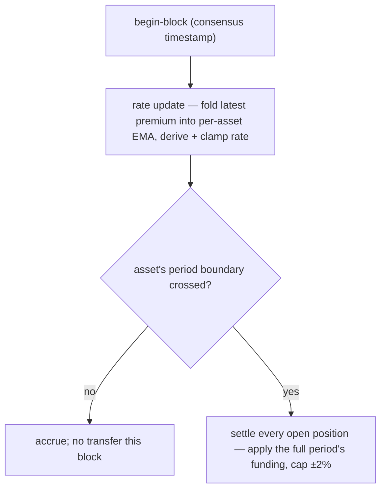

# Funding rates

:::tip
**Stable.**
:::

## TL;DR {#tldr}

Perpetual positions accrue funding proportional to the perp's **premium over the oracle** — measured from the depth-weighted **impact price**, not a single trade — plus a small baseline **interest** term. Longs pay shorts when the perp trades above the oracle; shorts pay longs when below.

Funding **settles discretely, once per asset's funding period** — each market has its own period (e.g. 8 h for a major like BTC, 1 h for a fast meme market), governance-configurable per asset (default 1 h). The amount charged at each settlement is the funding accrued over that whole period, **capped at a per-asset default of `±2%` per period**, and settles against the **oracle**.

> This is a **discrete, per-asset** model: funding is paid in one step at each asset's period boundary — not continuously, and not on a single network-wide hourly clock. It supersedes an earlier scheme that swept a tiny pro-rata payment every few seconds.

## Why funding exists {#why-funding-exists}

Perps have no expiry, so there's no arbitrage force to peg them to the underlying. Funding does that job: when perp price drifts above spot, longs pay, which incentivises shorts and disincentivises longs until the perp drifts back down. The protocol never takes either side — it's user-to-user.

## Formula {#formula}

> The TL;DR above is the conceptual model. The numbers below are the **implemented** values. Where the prose and the code differ, the code wins; the differences are flagged inline.

### How it's computed {#how-its-computed}

The funding **rate** is driven by a **deterministic EMA** of the premium (impact price − oracle), refreshed continuously from committed state. The **settlement** — the actual transfer between longs and shorts — happens **discretely, once per asset's funding period** (default 1 h, governance-configurable per asset).

Two effects run the cycle:

- **rate update** — folds the latest premium sample into the per-asset premium-index EMA each begin-block, then derives and clamps the rate. A live, smoothed rate is therefore available for display at any time.
- **settlement** — at each asset's funding-period boundary, settles every open position in that market against the cumulative funding index, moving the full period's accrued funding between position owners.

#### 0. Premium basis — the impact price (not the last trade) {#0-premium-basis--the-impact-price-not-the-last-trade}

The per-block **premium sample** is the gap between the perp's **impact price** and the oracle:

```
premium = (impact_mid − oracle) / oracle
impact_mid = mid( impact_bid, impact_ask )
impact_bid/ask = VWAP of walking the committed book to fill a fixed notional (default ~$10k)
```

Using the *impact* price — the volume-weighted price to fill a real clip — rather than the last trade or the best quote means a single print, or a one-lot order at a silly price, **cannot** move funding: you have to move genuine depth. This mirrors the reference perp design. (A legacy per-market mode instead samples `premium = (mark − oracle)/oracle`; new and migrated markets use the impact basis above.)

#### 1. Premium index EMA (per market) {#1-premium-index-ema-per-market}

The premium is smoothed by a **deterministic EMA** (the *premium index*). The accumulator stores a fixed-point fraction `(num, denom)` — no floats, exact `rust_decimal::Decimal` arithmetic so node-to-node state is bit-identical. Each sample folds in as:

```
num'   = num   * decay + sample
denom' = denom * decay + 1
value  = num / denom
```

- `sample` = latest premium for the asset × the per-asset `funding_rate_multiplier` (default `1.0`; auto-driven by the dynamic-risk engine).
- `decay = 0.5` (proposed default). Clamped to `[0, 1]` at update time.
- The premium-index EMA is folded each begin-block; **settlement** runs once per asset's funding period (default 1 h, governance-configurable per asset).

> **Status:** the funding loop runs entirely from committed market state — no external premium feeder. Each begin-block the rate driver samples the premium (the impact-vs-oracle premium above, one sample per perp market), folds it into the per-asset premium-index EMA, derives the rate (interest + clamp), and caps it. At each asset's funding-period boundary, settlement advances the cumulative funding index and moves `size × Δindex` between position owners' balances (zero-sum: longs pay shorts or vice versa, no mint/burn). Conservation- and determinism-checked end to end.

#### 2. Rate from the premium index (interest + clamp) {#2-rate-from-the-premium-index-interest--clamp}

The funding rate is **not** the raw premium index. The smoothed index `premium_idx` is combined with a baseline **interest** term through a per-step clamp:

```
interest = 0.0000125 / h        # = 0.01% / 8h — the baseline carry
clamp    = ±0.0005              # per-step bound

funding = premium_idx + clamp( interest − premium_idx, −clamp, +clamp )
```

When the premium index is small, funding drifts toward the `interest` baseline; when the premium is large, the `premium_idx` term dominates and the clamp bounds how hard the interest pulls back each step. Both `interest` and `clamp` are per-asset governance-overridable. (The legacy per-market mode instead reads the EMA value directly as the rate, with no interest/clamp transform.)

#### 3. Per-period cap {#3-per-period-cap}

The funding accrued over a period is clamped to the per-asset cap before it settles:

```
cap_per_period = 0.02        # ±2% per funding period, per-asset default
funding = clamp(funding, −cap_per_period, +cap_per_period)
```

The cap is a per-market governance parameter: a `dynamic_risk_overrides[asset].funding_rate_cap` replaces the `0.02` default when set. Because settlement is per-period, the cap bounds the **total** funding charged at each settlement to ±2% of notional (default), independent of how long the asset's period is.

#### 4. Payment (per position, per period) {#4-payment-per-position-per-period}

Funding accrues into a cumulative index per market; each position carries its last-settled index (`funding_entry`). Settlement runs at the asset's **period boundary** (`boundary = floor(ts_ms / period_ms) * period_ms`): a market settles only when its boundary has advanced since the last settlement, and it then applies the **full period's** accrued funding:

```
payment = size_signed * oracle_px * (cum_global - funding_entry) * funding_rate_multiplier[asset]
funding_entry := cum_global      # roll forward at the period boundary
```

(Zero-sum: longs pay shorts or vice versa, no mint/burn.)

| Symbol | Meaning / plane |
|--------|-----------------|
| `size_signed` | Signed position size; `i128`. Long > 0, short < 0. |
| `oracle_px` | Composed oracle price — whole-USDC `Decimal` plane (see [mark prices](./mark-prices.md)). |
| `cum_global − funding_entry` | Cumulative funding accrued for this market since the position last settled. |
| `decay` | EMA decay 0.5. |
| `cap_per_period` | Default `0.02` (±2% per funding period); per-market override via dynamic risk. |
| `funding_rate_multiplier` | Per-asset multiplier, default `1.0`, auto-driven by dynamic risk. |

`funding_rate` (the EMA value) is signed: positive → longs pay shorts; negative → shorts pay longs.

**Base interest:** `0.0000125/h` (= `0.01%/8h`) — the baseline carry the premium EMA is added to.

> ⚠️ **Settlement model.** Funding **settles discretely, once per asset's funding period** (default 1 h, governance-configurable per asset — e.g. 8 h for BTC, 1 h for a meme market), not continuously and not on a single network-wide hourly clock. The amount charged at each settlement is the funding accrued over that whole period, capped at a per-asset **±2%** default. The EMA `decay` is **0.5**; the rate itself is refreshed continuously so a live value is always available for display.

## Settlement cadence {#settlement-cadence}

Each perpetual market has its own **funding period** (`funding_period_ms`, default 1 h), set per asset by governance. Settlement is **discrete**: the protocol settles a market only when the current consensus timestamp crosses that asset's next period boundary, and it then charges the **full period's** accrued funding in one step. Different markets settle on their own clocks — a market on an 8 h period and a market on a 1 h period are independent.



Payments settle as balance adjustments — no on-chain trade, no fee. They show on the user's history as `kind: "funding"`.

> **Known timing gap.** Mid-period account value and health do **not** reflect funding that has accrued but not yet settled — pending funding lands as a single discrete step at the period boundary, not smoothly. The size of that step is bounded by the per-asset cap (≤2% of notional per period by default), so the jump is small; but a position sitting near a liquidation band should account for the next settlement landing as a step rather than a gradual drift.

## Gating when the oracle is untrusted {#gating-when-the-oracle-is-untrusted}

Funding **settles against the oracle**, so a price the protocol does not trust must not drive a payment. Each period the premium sample is *gated*: it is skipped (sampled as **0**) when

- the **oracle is missing or ≤ 0** for the market, or
- the **oracle is stale** beyond `funding_oracle_staleness_ms` (default **60 s**), or
- the **book is too thin** to fill the impact notional on both sides (no impact price).

A skipped sample is folded as 0, so the premium-index EMA **decays toward 0** and the funding rate fades out rather than settling off a stale or manipulable basis. (See also [edge cases](#edge-cases).)

:::info
**This is why you can see a large mark↔oracle gap with funding ≈ 0.** If a market's oracle feed is broken or distrusted, funding is gated off and decays to 0 — even while the [mark](./mark-prices.md#mark-vs-oracle--why-they-diverge) (which is built from the book and external perps) sits far from the last good oracle. A wide gap with ~0 funding is the protocol *declining to charge funding off a bad oracle*, not a funding bug.
:::

## Worked example {#worked-example}

Market: BTC perp on an 8 h funding period, current state (oracle plane in whole USDC):

```
mark         = 100.50
oracle       = 100.00
premium      = mark - oracle = 0.50
EMA(premium) settles toward 0.50 with decay 0.5
funding cap  = ±2% per period (default)
```

Suppose the funding accrued over the period resolves to `+0.0005` (0.05 %) — well inside the ±2% per-period cap. Account positions:

```
long 1 BTC      → pays funding
short 0.5 BTC   → receives funding
```

```
funding = clamp(period_accrual, -0.02, +0.02) = +0.0005   (not capped — far below ±2%)

long 1 BTC:
  payment = +1   * oracle_px * Δcum  ≈ +1   * 100.00 * 0.0005 = +0.0500 USDC  (long pays)

short 0.5 BTC:
  payment = -0.5 * oracle_px * Δcum  ≈ -0.5 * 100.00 * 0.0005 = -0.0250 USDC  (short receives 0.0250)
```

(Payment uses `size_signed * oracle_px * (cum_global - funding_entry)`; here `Δcum` is the funding accrued since the position last settled.) The transfer lands once at the period boundary; the ±2% per-period cap bounds the most a single settlement can charge.

## Funding caps & dynamic limits {#funding-caps--dynamic-limits}

| Parameter | Default | Source / override |
|-----------|---------|-------------------|
| funding cap (per period) | `0.02` (`±2%`) | `dynamic_risk_overrides[asset].funding_rate_cap` (governance vote) |
| funding period | `1 h` per asset | `set_funding_config` (governance vote) — see below |
| EMA `decay` | `0.5` | Proposed; calibration may retune to 0.3/0.7 |
| rate-update cadence | begin-block | protocol-fixed |
| base interest | `0.0000125/h` (`0.01 %/8h`) | protocol-fixed |
| `funding_rate_multiplier` | `1.0` | per-asset, auto-driven by dynamic risk |

The per-asset `funding_rate_multiplier` is auto-driven from 30-day realized volatility by the dynamic-risk engine, scaling the premium sample before it enters the EMA.

### Per-asset funding config (governance) {#per-asset-funding-config-governance}

A market's funding period and oracle basis are set per asset by a stake-weighted
validator vote (`set_funding_config`):

| Field | Meaning |
|-------|---------|
| `asset` | Perp market id |
| `use_binance` | Whether to include the external CEX reference in the premium basis |
| `funding_period_ms` | Optional; the asset's settlement period in milliseconds. Omit to leave the current period untouched. |

So a major market can be put on an 8 h period while a fast-moving listing runs on a
1 h period, independently. The per-asset `funding_rate_cap` override (the ±2%
default above) is a separate dynamic-risk parameter, voted the same way.

## Funding history {#funding-history}

Per-account history via [`POST /info user_fills`](../api/rest/info.md) — funding payments appear with `kind: "funding"` and the relevant asset.

Per-market history:

```bash
curl -X POST https://api.devnet.mtf.exchange/info \
  -H 'content-type: application/json' \
  -d '{"type":"funding_history","coin":"BTC"}'
```

Returns the ordered ring of `(ts_ms, premium)` samples (see
[`funding_history`](../api/rest/info/perpetuals.md#funding_history)):

```json
{
  "type": "funding_history",
  "data": {
    "coin": "BTC",
    "samples": [
      { "ts_ms": 1700000000000, "premium": "0.0015" },
      { "ts_ms": 1700000008000, "premium": "-0.0007" }
    ]
  }
}
```

A dedicated `fundingTicks` WS channel is on the [WS roadmap](../api/ws/subscriptions.md#roadmap--not-yet-available); poll [`funding_history`](../api/rest/info/perpetuals.md#funding_history) meanwhile.

## What funding doesn't do {#what-funding-doesnt-do}

- **No relation to fees.** Funding is user-to-user; fees are maker/taker rebates to the venue. See [fees](./fees.md).
- **No interest on collateral.** USDC balance does not accrue interest from funding. Funding is purely about closing the mark-oracle gap.
- **Not predictable across long windows.** Funding can flip sign hour-to-hour. Don't model it as a constant carry.

## Edge cases {#edge-cases}

<details>
<summary>Show edge cases</summary>

- **Position open/close between settlements.** Funding is applied at the asset's period boundary, not continuously — a position's funding events line up with its market's funding period. Account value and health do not reflect pending (accrued-but-unsettled) funding until the boundary lands; see the [known timing gap](#settlement-cadence).
- **Negative regime.** A market with the perp persistently below the oracle (shorts paying longs) sees `funding_rate` negative for sustained periods; longs receive funding.
- **Oracle stale / thin book.** The premium sample is gated to 0 and the rate decays toward 0 — see [Gating](#gating-when-the-oracle-is-untrusted). Funding does not settle off a distrusted oracle.

</details>

## See also {#see-also}

- [Mark prices](./mark-prices.md) — how `oracle` is derived
- [Tiered liquidation](./tiered-liquidation.md) — funding payments adjust `account_value`, which moves `health`
- [`fundingTicks` WS channel (roadmap)](../api/ws/subscriptions.md#roadmap--not-yet-available)
- [Fees](./fees.md) — separate from funding

## FAQ {#faq}

<details>
<summary>Show FAQ</summary>

**Q: Is funding the same as on a CEX?**
A: Same mental model, and the cadence is familiar: each market settles on its own period (e.g. 8 h for a major, 1 h for a fast listing), set per asset by governance. The ±2% per-period cap is what bounds a sustained one-sided rate.

**Q: Can funding force-liquidate me?**
A: Yes — a funding payment reduces `account_value`, and it lands as a discrete step at the period boundary (not a gradual drip). The step is bounded by the ±2% per-period cap, but if your position is large and the rate is persistently against you, that periodic debit can push you from the T0 band into T1. Watch `health` around your market's funding times.

**Q: Does funding apply to spot positions?**
A: No. Funding is a perp mechanism only. Spot positions accrue no carry.

**Q: Are funding receipts taxable?**
A: That's not a protocol question. Talk to your jurisdiction's accountants.

</details>
