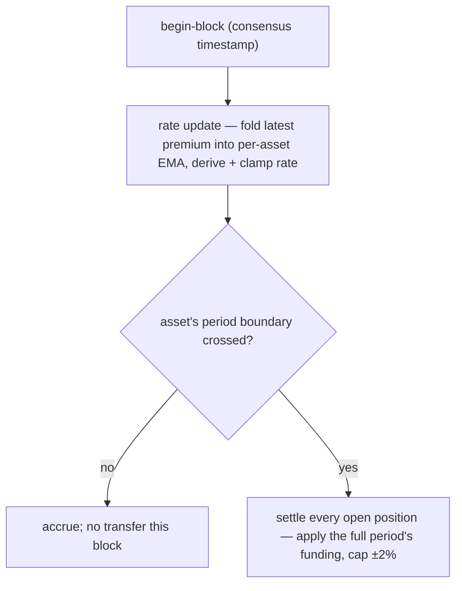

# Funding rates

This page explains how a perpetual market charges and pays funding between longs and shorts.

:::tip
**Stable.**
:::

## Overview {#tldr}

A perpetual position accrues funding in proportion to the premium of the perp over the oracle. The
chain measures the premium from the depth-weighted *impact price*, not from a single trade. A small
baseline *interest* term adds to it. Longs pay shorts when the perp trades above the oracle. Shorts
pay longs when it trades below.

Funding settles discretely, once for each funding period of an asset. Each market has its own
period. For example, a major like BTC can use 8 h and a fast meme market 1 h. Governance sets the
period per asset, and the default is 1 h. Each settlement charges the funding accrued over the whole
period. The cap is `±2%` per period by default for each asset. Settlement uses the oracle.

This is a discrete, per-asset model. Funding is paid in one step at the period boundary of each
asset. It is not continuous, and it does not run on one network-wide hourly clock. It replaces an
earlier scheme that swept a tiny pro-rata payment every few seconds.

## Why funding exists {#why-funding-exists}

Perps have no expiry, so no arbitrage force pegs them to the underlying. Funding does that job.
When the perp price drifts above spot, longs pay. That rewards shorts and discourages longs until
the perp drifts back down. The protocol never takes either side. Funding moves between users.

## Formula {#formula}

The overview gives the conceptual model. The numbers below are the implemented values. Where the
prose and the code differ, the code wins, and the text flags the difference.

### Computation {#how-its-computed}

A deterministic EMA of the premium (impact price minus oracle) drives the funding rate. The chain
refreshes it continuously from committed state. Settlement is the actual transfer between longs and
shorts. It happens discretely, once for each funding period of an asset. The default is 1 h, and
governance can configure it per asset.

Two effects run the cycle:

- Rate update. Each begin-block, it folds the latest premium sample into the per-asset
  premium-index EMA. It then derives and clamps the rate. A live, smoothed rate is therefore
  available for display at any time.
- Settlement. At each funding-period boundary of an asset, it settles every open position in that
  market against the cumulative funding index. It moves the full period's accrued funding between
  position owners.

#### Premium basis from the impact price {#0-premium-basis--the-impact-price-not-the-last-trade}

The per-block premium sample is the gap between the impact price of the perp and the oracle:

```
premium = (impact_mid − oracle) / oracle
impact_mid = mid( impact_bid, impact_ask )
impact_bid/ask = VWAP of walking the committed book to fill a fixed notional (default ~$10k)
```

The impact price is the volume-weighted price to fill a real clip. The last trade and the best
quote are not the basis. So a single print, or a one-lot order at a silly price, cannot move
funding. You must move genuine depth. This mirrors the reference perp design. A legacy per-market
mode samples `premium = (mark − oracle)/oracle` instead. New and migrated markets use the impact
basis above.

#### Premium index EMA {#1-premium-index-ema-per-market}

A deterministic EMA smooths the premium. This is the *premium index*, kept for each market. The
accumulator stores a fixed-point fraction `(num, denom)`. It uses no floats. It uses exact
`rust_decimal::Decimal` arithmetic, so the state is bit-identical from node to node. Each sample
folds in as:

```
num'   = num   * decay + sample
denom' = denom * decay + 1
value  = num / denom
```

- `sample` is the latest premium for the asset times the per-asset `funding_rate_multiplier`. The
  default multiplier is `1.0`, and the dynamic-risk engine drives it automatically.
- `decay = 0.5` (proposed default). The chain clamps it to `[0, 1]` at update time.
- The premium-index EMA folds each begin-block. Settlement runs once for each funding period of an
  asset (default 1 h, governance-configurable per asset).

:::note Status
The funding loop runs entirely from committed market state. There is no external premium feeder.
Each begin-block, the rate driver samples the premium (the impact-vs-oracle premium above, one
sample for each perp market). It folds the sample into the per-asset premium-index EMA, derives the
rate (interest plus clamp) and caps it. At each funding-period boundary of an asset, settlement
advances the cumulative funding index. It moves `size × Δindex` between the balances of the
position owners. The transfer is zero-sum: longs pay shorts or the reverse, with no mint or burn.
Tests check conservation and determinism end to end.
:::

#### Rate from the premium index {#2-rate-from-the-premium-index-interest--clamp}

The funding rate is not the raw premium index. A per-step clamp combines the smoothed index
`premium_idx` with a baseline interest term:

```
interest = 0.0000125 / h        # = 0.01% / 8h — the baseline carry
clamp    = ±0.0005              # per-step bound

funding = premium_idx + clamp( interest − premium_idx, −clamp, +clamp )
```

When the premium index is small, funding drifts toward the `interest` baseline. When the premium is
large, the `premium_idx` term dominates. The clamp then bounds how hard the interest pulls back at
each step. Governance can override `interest` and `clamp` for each asset. The legacy per-market mode
reads the EMA value directly as the rate, with no interest or clamp transform.

#### Per-period cap {#3-per-period-cap}

The chain clamps the funding accrued over a period to the per-asset cap before it settles:

```
cap_per_period = 0.02        # ±2% per funding period, per-asset default
funding = clamp(funding, −cap_per_period, +cap_per_period)
```

The cap is a per-market governance parameter. A `dynamic_risk_overrides[asset].funding_rate_cap`
replaces the `0.02` default when set. Settlement is per period, so the cap bounds the total funding
charged at each settlement to ±2% of notional (default). The length of the period of the asset does
not change this bound.

#### Payment {#4-payment-per-position-per-period}

Funding accrues into a cumulative index for each market. Each position carries its last-settled
index (`funding_entry`). Settlement runs at the period boundary of the asset
(`boundary = floor(ts_ms / period_ms) * period_ms`). A market settles only when its boundary has
advanced since the last settlement. It then applies the full period's accrued funding:

```
payment = size_signed * oracle_px * (cum_global - funding_entry) * funding_rate_multiplier[asset]
funding_entry := cum_global      # roll forward at the period boundary
```

The transfer is zero-sum: longs pay shorts or the reverse, with no mint or burn.

| Symbol | Meaning / plane |
|--------|-----------------|
| `size_signed` | Signed position size; `i128`. Long > 0, short < 0. |
| `oracle_px` | Composed oracle price, on the whole-USDC `Decimal` plane (see [mark prices](./mark-prices.md)). |
| `cum_global − funding_entry` | Cumulative funding accrued for this market since the position last settled. |
| `decay` | EMA decay 0.5. |
| `cap_per_period` | Default `0.02` (±2% per funding period); per-market override via dynamic risk. |
| `funding_rate_multiplier` | Per-asset multiplier, default `1.0`, driven automatically by dynamic risk. |

`funding_rate` (the EMA value) is signed. A positive value means longs pay shorts. A negative value
means shorts pay longs.

The base interest is `0.0000125/h` (`0.01%/8h`). It is the baseline carry that the chain adds to
the premium EMA.

:::warning Settlement model
Funding settles discretely, once for each funding period of an asset. The default is 1 h, and
governance can configure it per asset. For example, BTC can use 8 h and a meme market 1 h. Funding
is not continuous, and it does not run on one network-wide hourly clock. Each settlement charges
the funding accrued over the whole period, capped at a per-asset ±2% default. The EMA `decay` is
0.5. The chain refreshes the rate continuously, so a live value is always available for display.
:::

## Settlement cadence {#settlement-cadence}

Each perpetual market has its own funding period (`funding_period_ms`, default 1 h). Governance sets
it per asset. Settlement is discrete. The protocol settles a market only when the current consensus
timestamp crosses the next period boundary of that asset. It then charges the full period's accrued
funding in one step. Different markets settle on their own clocks. A market on an 8 h period and a
market on a 1 h period are independent.


```mermaid
flowchart TD
    Tick["begin-block (consensus timestamp)"] --> RU["rate update — fold latest premium into per-asset EMA, derive + clamp rate"]
    RU --> B{"asset's period boundary crossed?"}
    B -- "no" --> Skip["accrue; no transfer this block"]
    B -- "yes" --> Settle["settle every open position — apply the full period's funding, cap ±2%"]
```

Payments settle as balance adjustments. They create no on-chain trade and charge no fee. They show
on the user's history as `kind: "funding"`.

:::note Known timing gap
Mid-period account value and health do not reflect funding that has accrued but not yet settled.
Pending funding lands as a single discrete step at the period boundary, not as a smooth drift. The
per-asset cap bounds the size of that step (2% of notional per period or less by default), so the
jump is small. A position near a liquidation band must account for the next settlement landing as a
step.
:::

## Gating when the oracle is untrusted {#gating-when-the-oracle-is-untrusted}

Funding settles against the oracle, so a price the protocol does not trust must not drive a
payment. Each period, the chain *gates* the premium sample. It skips the sample (samples it as 0)
when any of these holds:

- The oracle is missing or `≤ 0` for the market.
- The oracle is stale beyond `funding_oracle_staleness_ms` (default 60 s).
- The book is too thin to fill the impact notional on both sides, so there is no impact price.

The chain folds a skipped sample in as 0. The premium-index EMA decays toward 0, and the funding
rate fades out. It does not settle off a stale or manipulable basis. See also
[edge cases](#edge-cases).

:::info
A large mark-to-oracle gap can sit beside funding of about 0. If the oracle feed of a market is
broken or distrusted, the chain gates funding off and it decays to 0. This holds even while the
[mark](./mark-prices.md#mark-vs-oracle--why-they-diverge) sits far from the last good oracle. The
mark comes from the book and from external perps. A wide gap with funding near 0 means the protocol
declines to charge funding off a bad oracle. It is not a funding bug.
:::

## A paused or closed market {#paused-market}

Governance can stop trading on a market in steps. Funding follows one rule: funding settles only
while a holder can close the position.

| Market state | How a caller reads it | Funding |
|---|---|---|
| Closing disabled | `close: false` on [`markets_meta`](../api/rest/info/perpetuals.md#markets_meta), whatever the other flags say | Stops. No payment settles |
| Reduce-only | `open: false` with `close: true`, or `halted: true` on [`markets`](../api/rest/info/perpetuals.md#markets) | Continues. A holder can close the position to stop paying |
| Settled | `settled: true` on `markets` | None. No position is open. See [Delisting a perp market](../products/perpetuals.md#delisting) |

While closing is disabled, the period boundary still advances, so no funding builds up for the
paused span. When closing is allowed again, the next boundary charges one period, not the paused
span. The liquidation engine also counts no funding for the paused span.

## Worked example {#worked-example}

The market is a BTC perp on an 8 h funding period. The current state is below, on the oracle plane
in whole USDC:

```
mark         = 100.50
oracle       = 100.00
premium      = mark - oracle = 0.50
EMA(premium) settles toward 0.50 with decay 0.5
funding cap  = ±2% per period (default)
```

Say the funding accrued over the period resolves to `+0.0005` (0.05 %). That is well inside the ±2%
per-period cap. The account positions are:

```
long 1 BTC      → pays funding
short 0.5 BTC   → receives funding
```

```
funding = clamp(period_accrual, -0.02, +0.02) = +0.0005   (not capped — far below ±2%)

long 1 BTC:
  payment = +1   * oracle_px * Δcum  ≈ +1   * 100.00 * 0.0005 = +0.0500 USDC  (long pays)

short 0.5 BTC:
  payment = -0.5 * oracle_px * Δcum  ≈ -0.5 * 100.00 * 0.0005 = -0.0250 USDC  (short receives 0.0250)
```

The payment uses `size_signed * oracle_px * (cum_global - funding_entry)`. Here `Δcum` is the
funding accrued since the position last settled. The transfer lands once, at the period boundary.
The ±2% per-period cap bounds the most that one settlement can charge.

## Funding caps and dynamic limits {#funding-caps--dynamic-limits}

| Parameter | Default | Source / override |
|-----------|---------|-------------------|
| funding cap (per period) | `0.02` (`±2%`) | `dynamic_risk_overrides[asset].funding_rate_cap` (governance vote) |
| funding period | `1 h` per asset | `set_funding_config` (governance vote), see below |
| EMA `decay` | `0.5` | `set_funding_ema_decay` (governance vote), see below |
| rate-update cadence | begin-block | protocol-fixed |
| base interest | `0.0000125/h` (`0.01 %/8h`) | protocol-fixed |
| `funding_rate_multiplier` | `1.0` | per-asset, driven automatically by dynamic risk |

The dynamic-risk engine drives the per-asset `funding_rate_multiplier` from 30-day realized
volatility. It scales the premium sample before the sample enters the EMA.

### EMA decay vote {#set-funding-ema-decay}

The EMA `decay` is one number for the whole chain. A two-thirds-stake validator vote,
`set_funding_ema_decay`, moves it. The bounds are `[0.01, 0.99]`, and both ends are hard:

- `0` is the unset value, and it would also stop the fold from reading any history.
- A decay near `1` freezes the rate for hours.

The fold runs every 8 seconds. The half-life is `ln(0.5) / ln(decay)` folds. A decay of `0.5` is
one fold (8 s), and `0.99` is about 9.2 minutes. Raise the decay to make funding steadier and
slower to react. Lower it to make funding track the premium more closely.

The enactment appears on [`validator_votes`](../api/rest/info/governance.md#validator_votes) as
`changes[*].field: "bole_pool.funding_ema_decay"`.

### Per-asset funding config {#per-asset-funding-config-governance}

A stake-weighted validator vote (`set_funding_config`) sets the funding period and oracle basis of
a market for each asset:

| Field | Meaning |
|-------|---------|
| `asset` | Perp market id |
| `use_binance` | Whether to include the external CEX reference in the premium basis |
| `funding_period_ms` | Optional. The settlement period of the asset in milliseconds. Omit it to leave the current period untouched. |

So a major market can run on an 8 h period while a fast-moving listing runs on a 1 h period,
independently. The per-asset `funding_rate_cap` override (the ±2% default above) is a separate
dynamic-risk parameter. Governance votes it the same way.

## Funding history {#funding-history}

For per-account history, use [`POST /info user_fills`](../api/rest/info.md). Funding payments
appear with `kind: "funding"` and the relevant asset.

For per-market history:

```bash
curl -X POST https://api.testnet.mtf.exchange/info \
  -H 'content-type: application/json' \
  -d '{"type":"funding_history","coin":"BTC"}'
```

The read returns the ordered ring of `(ts_ms, premium)` samples (see
[`funding_history`](../api/rest/info/perpetuals.md#funding_history)):

```json
{
  "type": "funding_history",
  "data": {
    "coin": "BTC",
    "samples": [
      { "ts_ms": 1700000000000, "premium": "0.0015" },
      { "ts_ms": 1700000008000, "premium": "-0.0007" }
    ]
  }
}
```

A dedicated `fundingTicks` WS channel is on the
[WS roadmap](../api/ws/subscriptions.md#roadmap--not-yet-available). Until then, poll
[`funding_history`](../api/rest/info/perpetuals.md#funding_history).

## What funding does not do {#what-funding-doesnt-do}

- It has no relation to fees. Funding moves between users. Fees are maker and taker charges that go
  to the venue. See [fees](./fees.md).
- It pays no interest on collateral. A USDC balance does not accrue interest from funding. Funding
  closes the mark-oracle gap and does nothing else.
- It is not predictable across long windows. Funding can flip sign from hour to hour. Do not model
  it as a constant carry.

## Edge cases {#edge-cases}

<details>
<summary>Show edge cases</summary>

- **Position open or close between settlements.** The chain applies funding at the period boundary
  of the asset, not continuously. The funding events of a position line up with the funding period
  of its market. Account value and health do not reflect pending (accrued but unsettled) funding
  until the boundary lands. See the [known timing gap](#settlement-cadence).
- **Negative regime.** A market where the perp stays below the oracle (shorts paying longs) sees a
  negative `funding_rate` for sustained periods. Longs receive funding.
- **Oracle stale or thin book.** The chain gates the premium sample to 0, and the rate decays
  toward 0. See [Gating](#gating-when-the-oracle-is-untrusted). Funding does not settle off a
  distrusted oracle.

</details>

## See also {#see-also}

- [Mark prices](./mark-prices.md): how `oracle` is derived
- [Tiered liquidation](./tiered-liquidation.md): funding payments adjust `account_value`, which moves `health`
- [`fundingTicks` WS channel (roadmap)](../api/ws/subscriptions.md#roadmap--not-yet-available)
- [Fees](./fees.md): separate from funding

## FAQ {#faq}

<details>
<summary>Show FAQ</summary>

**Q: Is funding the same as on a CEX?**
A: The model is the same, and the cadence is familiar. Each market settles on its own period (for
example 8 h for a major, 1 h for a fast listing). Governance sets the period per asset. The ±2%
per-period cap bounds a sustained one-sided rate.

**Q: Can funding force-liquidate me?**
A: Yes. A funding payment reduces `account_value`. It lands as a discrete step at the period
boundary, not as a gradual drip. The ±2% per-period cap bounds the step. But if your position is
large and the rate stays against you, that periodic debit can push you from the T0 band into T1.
Watch `health` around the funding times of your market.

**Q: Does funding apply to spot positions?**
A: No. Funding is a perp mechanism only. Spot positions accrue no carry.

**Q: Are funding receipts taxable?**
A: That is not a protocol question. Ask an accountant in your jurisdiction.

</details>
