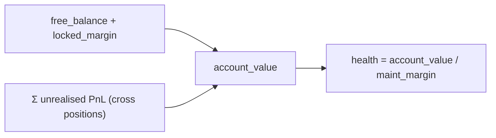
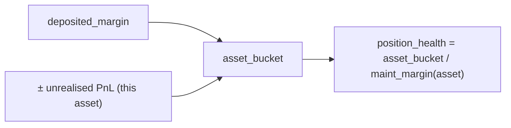
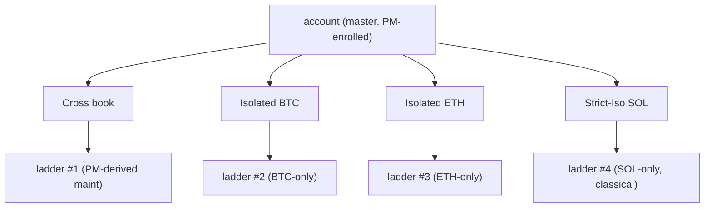
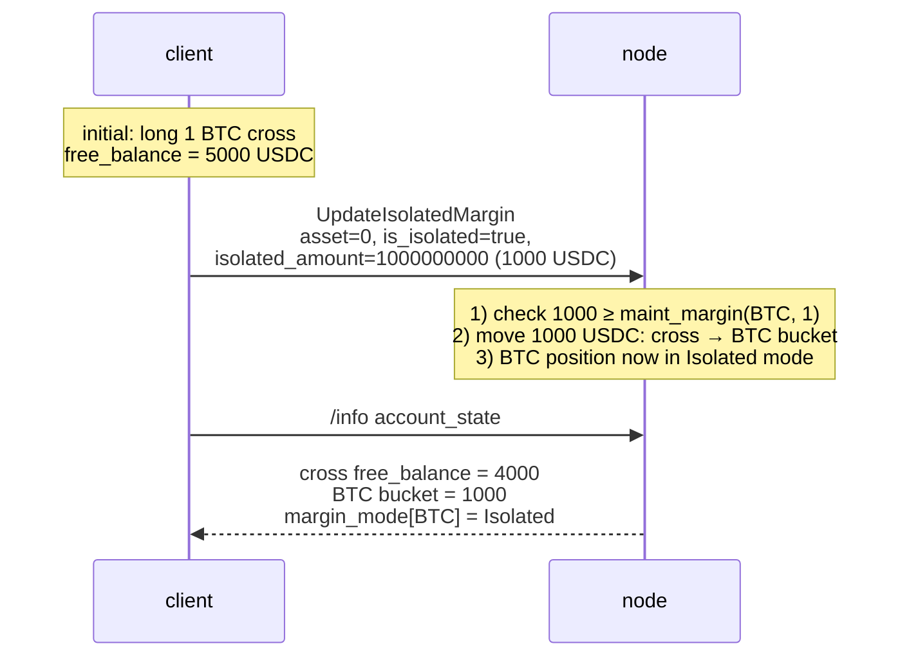

# Margin modes

:::tip
**Stable.**
:::

## TL;DR

Three modes per-asset: **Cross**, **Isolated**, **Strict-Iso**. Cross pools collateral across all your positions; Isolated walls off margin per asset; Strict-Iso additionally excludes that asset from any [portfolio-margin](./portfolio-margin.md) netting.

## Comparison

| Mode | Collateral source | Loss can drain | PM eligible | Liquidation isolation |
|------|-------------------|----------------|-------------|----------------------|
| **Cross** | Free balance, account-wide | Other positions | Yes | Whole-account ladder |
| **Isolated** | Pre-allocated bucket per asset | Only that bucket | No | Per-asset ladder; max loss = bucket |
| **Strict-Iso** | Pre-allocated bucket per asset | Only that bucket | No (excluded even when master is PM-enrolled) | Per-asset ladder |

In Cross, profitable positions can carry less-healthy ones — your free balance is fungible across the account. In Isolated, blowing up one asset is contained to that asset's bucket.

## How margin is computed

> All amounts are on the **whole-USDC `Decimal` plane** (notional, collateral, margin), not the 1e8 book plane — see [mark prices: two price planes](./mark-prices.md#two-price-planes-read-this-before-reading-any-number).

### Initial margin (pre-trade gate)

An order opening new exposure must post initial margin:

```
notional        = |px × size|                         # raw integer product, Decimal scale-0
effective_lev   = dynamic_risk_override.max_leverage   # if set, else position cap, else MAX_LEVERAGE_CAP (50)
required_init    = ceil( notional / effective_lev )    # rounded UP — conservative
free_collateral  = cross_account_value − Σ held_initial_margin
reject  iff  required_init > free_collateral            # InsufficientMargin
```

So `init_margin = notional / max_leverage` — the classic `1 / max_leverage` ratio. `effective_lev` is `max(1, …)`; the global cap is `MAX_LEVERAGE_CAP = 50`, with a hard `UpdateLeverage` ceiling of **100×** and per-asset dynamic-risk overrides that can tighten it. Rounding is **up** (`Decimal::ceil`) so a remainder always tightens the gate. `reduce_only` orders bypass the gate (they only shrink exposure).

`held_initial_margin` sums `ceil(|entry_notional| / effective_lev(asset))` over every **cross** open position (isolated positions are excluded — their collateral is the separately-posted bucket).

### Maintenance margin & health

```
health = account_value / maint_margin
```

- `account_value` = `cross_account_value` (free balance ± unrealised PnL), signed `i128`.
- `maint_margin` = the sum over every held position leg of `|entry_notional| × maint_margin_ratio` (derived live from positions) **or** the PM number when [portfolio margin](./portfolio-margin.md) is enrolled (`last_computed_pm_cents / 100`).

The per-asset maintenance ratio is the market's dynamic-risk override when one has been set by governance, else the protocol baseline of **300 bps = 3 %**. The derived forced-close slippage floor is half the effective ratio (1.5 % for a baseline market) unless explicitly overridden.

Maintenance sits below the initial requirement (`notional / max_leverage`), so a position can be opened and then ride down to the maintenance floor before liquidation. Health < 1.0 enters the [liquidation ladder](./tiered-liquidation.md) at the tier bands (1.1 / 1.0 / 0.8 / 0.667).

> The arithmetic uses `Decimal` / `i128` throughout (no floats); the tier decision even right-shifts both operands by a common amount before the `Decimal` division when an account value would exceed `Decimal::MAX`, preserving the health ratio so the tier decision is unaffected.

## Cross — the default



`maint_margin` is the sum of per-position maintenance requirements (or the PM number if [portfolio margin](./portfolio-margin.md) is enrolled).

Implication: a 10% adverse move on BTC reduces account-wide health, even if your ETH position is fine. You can prop up the BTC position by closing the ETH winner.

## Isolated

:::warning
**Implementation gap.** The conceptual model below is the **target behaviour**.
The pre-trade margin gate currently implements the **Cross / pooled-collateral
path only** — the trading path opens every position cross. The position
`margin_mode` field (0 = cross, 1 = isolated) is already read to *exclude*
isolated positions from the cross held-margin sum, but a dedicated
isolated-margin pre-trade gate (checking the order's own posted `isolated_margin`
against its notional) is not yet wired.
:::

When you toggle `is_isolated: true` for an asset, the protocol moves `isolated_amount` USDC from cross balance into a per-position bucket. That position's gain/loss settles into the bucket only:



If `position_health` falls into a liquidation tier, the **per-position** ladder fires. The rest of the account is untouched.

You can deposit/withdraw to the bucket while the position is open:

```json
// add 500 USDC to the isolated bucket on asset 0
{ "type":"UpdateIsolatedMargin", "params": {
  "asset": 0, "is_isolated": true, "isolated_amount": "500000000"
}}
```

`isolated_amount` can be **positive** (move cross → bucket) or **negative** (withdraw bucket → cross). Withdrawal that would push the position into a worse tier is rejected.

## Strict-Iso

Same wall as Isolated, plus an explicit opt-out from PM scenario inclusion. Even if your master is portfolio-margin-enrolled, a Strict-Iso position:

- Does NOT contribute to the cross scenario engine
- Does NOT receive netting credit
- Is margined under the **classical** model (per-asset baseline)

Use Strict-Iso for:
- New / illiquid assets where PM's correlation assumptions don't apply
- Speculation budget you want firewalled from your hedged core book
- Listings (MIP-3) where the maintenance ratio is conservative until liquidity builds

## When to use each

| Goal | Mode |
|------|------|
| Maximise capital efficiency on a coherent book | Cross (+ PM) |
| Run multiple uncorrelated strategies under one account | Isolated per strategy, OR sub-accounts |
| Contain one risky position from threatening the rest | Isolated or Strict-Iso |
| Hedge across assets, want netting credit | Cross + PM |
| Trade a long-tail listing with unknown vol regime | Strict-Iso |

For multi-strategy isolation, [sub-accounts](./sub-accounts.md) are usually a better fit than Isolated — sub-accounts isolate the entire account, including agent keys and order space, not just margin.

## Transitions

Switching modes uses the [`update_isolated_margin`](../api/rest/exchange.md#update_isolated_margin) action (the `is_isolated` flag — there is no separate margin-mode action) and is allowed only when:

| From → To | Allowed when |
|-----------|--------------|
| Cross → Isolated | You specify `isolated_amount` covering at least the maintenance margin |
| Isolated → Cross | Bucket merges into cross balance; allowed any time the merged account stays in `Safe` tier |
| Isolated → Strict-Iso | Always (no margin movement) |
| Strict-Iso → Isolated | Always |
| Strict-Iso/Isolated → Cross (under PM-enrolled master) | Requires the position to fit under the PM scenario set |

Switching mode mid-position is **not** a flat-and-reopen — the position stays, only the margin accounting changes.

## Liquidation behaviour

The [tiered liquidation](./tiered-liquidation.md) ladder applies independently per scope:

- **Cross**: one ladder for the whole account
- **Isolated**: one ladder per isolated asset
- **Strict-Iso**: one ladder per strict-iso asset

A Cross-tier T1 closes positions on the cross book proportional to their contribution to maintenance. An Isolated T1 closes only the isolated position. T3 backstop and T4 ADL are per-scope — an isolated blowup doesn't claw back from cross winners.



## Sequence — flip cross → isolated



## Edge cases

<details>
<summary>Show edge cases</summary>

- **Auto-deposit on margin add.** Isolated positions take maintenance shortfall from the bucket only — once the bucket is depleted, the position liquidates. Cross does NOT auto-cover an Isolated bucket; you must manually `UpdateIsolatedMargin` with positive `isolated_amount` to top up.
- **Closing an Isolated position.** Closing the full position releases the bucket back into cross balance.
- **Mode of a fresh asset.** New positions default to Cross unless the asset's `meta` flag `onlyIsolated: true` forces Isolated (set per-market at deploy time via [MIP-3](../mip/mip-3.md)).
- **Isolated under PM master.** PM netting credit applies to Cross positions only. Isolated positions are summed classically. A PM-enrolled master with one giant Isolated position and tiny Cross book sees almost no PM benefit.

</details>

## See also

- [Portfolio margin](./portfolio-margin.md) — PM-vs-classical math
- [Tiered liquidation](./tiered-liquidation.md) — per-scope ladders
- [Sub-accounts](./sub-accounts.md) — full account-level isolation
- [`update_isolated_margin`](../api/rest/exchange.md#update_isolated_margin) — margin mode is the `is_isolated` flag here; there is no separate margin-mode action

## FAQ

<details>
<summary>Show FAQ</summary>

**Q: Can one asset have both Isolated and Strict-Iso buckets?**
A: No. The mode is per-asset, single-value: `Cross | Isolated | StrictIso`.

**Q: Does switching modes cost a trade?**
A: No fees, no fills. It's a pure state transition.

**Q: What happens if I deplete an Isolated bucket below maintenance?**
A: That asset's liquidation ladder fires. The rest of your account is unaffected.

**Q: Is auto-deleverage (ADL) cross-scope or per-scope?**
A: Per-scope. ADL on an Isolated position only claws back from counter-parties of *that* asset, not from your Cross book or other Isolated positions.

</details>
