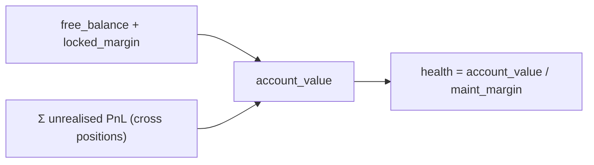
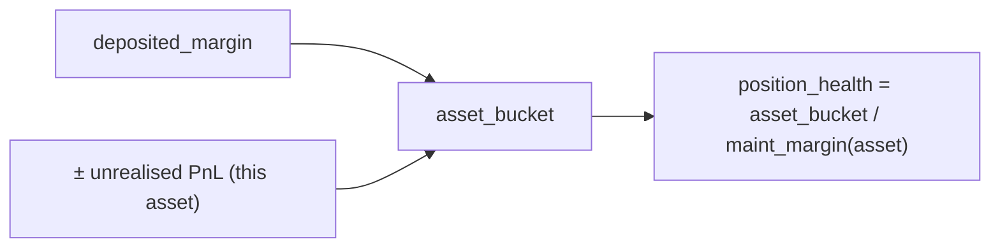
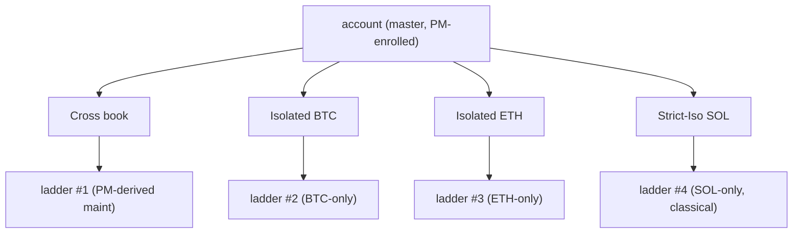
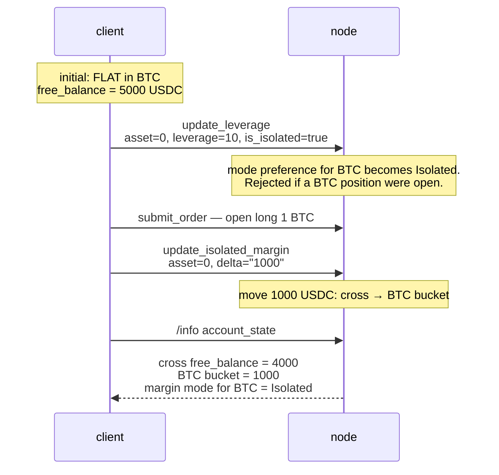

# Margin modes

:::tip
**Stable.**
:::

## TL;DR {#tldr}

Three modes per-asset: **Cross**, **Isolated**, **Strict-Iso**. Cross pools collateral across all your positions; Isolated walls off margin per asset; Strict-Iso additionally excludes that asset from any [portfolio-margin](./portfolio-margin.md) netting.

## Comparison {#comparison}

| Mode | Collateral source | Loss can drain | PM eligible | Liquidation isolation |
|------|-------------------|----------------|-------------|----------------------|
| **Cross** | Free balance, account-wide | Other positions | Yes | Whole-account ladder |
| **Isolated** | Pre-allocated bucket per asset | Only that bucket | No | Per-asset ladder; max loss = bucket |
| **Strict-Iso** | Pre-allocated bucket per asset | Only that bucket | No (excluded even when master is PM-enrolled) | Per-asset ladder |

In Cross, profitable positions can carry less-healthy ones — your free balance is fungible across the account. In Isolated, blowing up one asset is contained to that asset's bucket.

## How margin is computed {#how-margin-is-computed}

> All amounts are on the **whole-USDC `Decimal` plane** (notional, collateral, margin), not the 1e8 book plane — see [mark prices: two price planes](./mark-prices.md#two-price-planes-read-this-before-reading-any-number).

### Initial margin (pre-trade gate) {#initial-margin-pre-trade-gate}

An order opening new exposure must post initial margin:

```
notional         = |px × size|                        # raw integer product, scale-0
effective_lev    = the market's max leverage           # see the ladder below
required_init    = ceil( notional / effective_lev )    # rounded UP — conservative
free_collateral  = cross_account_value − Σ held_initial_margin
reject  iff  required_init > free_collateral
```

So `init_margin = notional / max_leverage` — the classic `1 / max_leverage` ratio.

`effective_lev` resolves in this order, and is never below 1:

1. your own leverage preference for the asset, set with [`update_leverage`](../api/rest/exchange.md#update_leverage);
2. tightened by the market's dynamic-risk override when governance has set one — with a margin-tier ladder, the rung your notional falls into decides the cap, so a larger position gets less leverage;
3. bounded by the market's own maximum.

`update_leverage` rejects any request above **100×**. A market listed through [MIP-3](../mip/mip-3.md) is separately capped at **50×** when it is deployed, so most markets sit well under the 100× ceiling. Read the live value from a market's fields on [`market_info`](../api/rest/info/perpetuals.md#market_info) rather than assuming either number.

Rounding is **up** so a remainder always tightens the gate. `reduce_only` orders bypass the gate — they only shrink exposure.

`held_initial_margin` sums `ceil(|entry_notional| / effective_lev(asset))` over every **cross** open position (isolated positions are excluded — their collateral is the separately-posted bucket).

This gate applies to every live order path that can open new exposure:
`submit_order` / `batch_order` (limit, IOC, ALO), `scale_order`, `chase_order`,
`twap_order`, and an accepted RFQ quote (`rfq_accept`). Frequent batch auctions
(FBA) are not a live exposure path today — no market has FBA armed.

### Maintenance margin & health {#maintenance-margin--health}

```
health = account_value / maint_margin
```

- `account_value` = `cross_account_value` (free balance ± unrealised PnL), signed `i128`.
- `maint_margin` = the sum over every held position leg of `|entry_notional| × maint_margin_ratio` (derived live from positions) **or** the PM number when [portfolio margin](./portfolio-margin.md) is enrolled (`last_computed_pm_cents / 100`).

The per-asset maintenance ratio is the market's dynamic-risk override when one has been set by governance, else the protocol's baseline maintenance ratio — a governed parameter (`set_risk_base_maint_ratio`). Read the live value from a market's `maint_margin_ratio` field on [`market_info`](../api/rest/info/perpetuals.md#market_info) or [`markets_meta`](../api/rest/info/perpetuals.md#markets_meta); never assume a fixed percentage. The derived forced-close slippage floor is half the effective ratio unless explicitly overridden.

Maintenance sits below the initial requirement (`notional / max_leverage`), so a position can be opened and then ride down to the maintenance floor before liquidation. Health < 1.0 enters the [liquidation ladder](./tiered-liquidation.md) at the tier bands (1.1 / 1.0 / 0.8 / 0.667).

> The arithmetic is exact fixed-point throughout — no floating point anywhere on this path. At extreme account values the tier decision scales both operands down by the same factor before it divides, which leaves the health ratio unchanged, so the tier you land in is the same.

## Cross — the default {#cross--the-default}


```mermaid
flowchart LR
    A["free_balance + locked_margin"] --> AV["account_value"]
    PNL["Σ unrealised PnL (cross positions)"] --> AV
    AV --> H["health = account_value / maint_margin"]
```

`maint_margin` is the sum of per-position maintenance requirements (or the PM number if [portfolio margin](./portfolio-margin.md) is enrolled).

Implication: a 10% adverse move on BTC reduces account-wide health, even if your ETH position is fine. You can prop up the BTC position by closing the ETH winner.

### Spot margin joins the cross account {#spot-margin-cross}

A [spot-margin](../products/spot-margin.md) position is **cross-margined against
the same unified USDC account**. Its initial-margin requirement is subtracted from
`free_collateral` (like a perpetual open), and its unrealised PnL and maintenance
requirement enter the account-level health decision. Two consequences follow:

- An open spot-margin position **reduces your perpetual margin headroom**.
- A perpetual loss **reduces the collateral that backs a spot-margin position**,
  and a spot-margin loss can draw on the same account collateral your perpetual
  positions use.

There is no per-pair spot-margin collateral bucket and no separate deposit — the
one unified USDC account is the collateral. See
[spot margin](../products/spot-margin.md).

## Isolated {#isolated}

:::warning
**Implementation gap.** The conceptual model below is the **target behaviour**.
The pre-trade margin gate currently implements the **Cross / pooled-collateral
path only** — the trading path opens every position cross. The position
`margin_mode` field (0 = cross, 1 = isolated) is already read to *exclude*
isolated positions from the cross held-margin sum, but a dedicated
isolated-margin pre-trade gate (checking the order's own posted `isolated_margin`
against its notional) is not yet wired.
:::

When you toggle `is_isolated: true` for an asset, the protocol moves `isolated_amount` USDC from cross balance into a per-position bucket. That position's gain/loss settles into the bucket only:


```mermaid
flowchart LR
    DM["deposited_margin"] --> AB["asset_bucket"]
    PNL["± unrealised PnL (this asset)"] --> AB
    AB --> PH["position_health = asset_bucket / maint_margin(asset)"]
```

If `position_health` falls into a liquidation tier, the **per-position** ladder fires. The rest of the account is untouched.

You can deposit/withdraw to the bucket while the position is open:

```json
// add 500 USDC to the isolated bucket on asset 0
{ "type":"update_isolated_margin", "params": { "asset": 0, "delta": "500" } }
```

`delta` can be **positive** (move cross → bucket) or **negative** (withdraw bucket → cross). Withdrawal that would push the position into a worse tier is rejected. Flipping the position itself into isolated mode is a separate step — the `is_isolated` flag on [`update_leverage`](../api/rest/exchange.md#update_leverage); see [Transitions](#transitions).

## Strict-Iso {#strict-iso}

Same wall as Isolated, plus an explicit opt-out from PM scenario inclusion. Even if your master is portfolio-margin-enrolled, a Strict-Iso position:

- Does NOT contribute to the cross scenario engine
- Does NOT receive netting credit
- Is margined under the **classical** model (per-asset baseline)

:::warning
**Not a user choice.** Unlike Cross and Isolated, Strict-Iso is never
something you request for your own position. It is stamped onto a position
**only** by the governance market-level flag described below — there is no
action that moves a position from Isolated into Strict-Iso, or back, at the
trader's request.
:::

## Governance-imposed strict isolation (market-level) {#governance-imposed-strict-isolation-market-level}

MetaFlux lets **governance** impose strict isolation at the **market level** — a
per-market risk flag that forces *every* participant in that market into
Strict-Iso margin, regardless of their own preference. It is **not a user
toggle**; the only way a position becomes Strict-Iso is by opening it on a
market that already carries this flag.

When a market carries the governance strict-isolated flag:

- **New positions open isolated.** At settlement, a fill on that market lands in
  isolated margin mode, not cross — so its loss is contained to its own bucket and
  it earns no [portfolio-margin](./portfolio-margin.md) netting credit.
- **Cross opens are rejected.** An order that would open or grow a *cross* position
  on that market is refused.
- **You cannot switch it to cross.** A leverage / margin-mode change that targets
  cross on that market is rejected.

The flag is set by a **stake-weighted validator vote** (a per-market dynamic-risk
parameter), not on the trading path. It lets the protocol ring-fence a market whose
risk profile warrants it — new, thin, or volatile listings — so a blow-up there
cannot drain cross-collateralised positions on other markets. The constraint is
surfaced in the per-market metadata returned by
[`/info`](../api/rest/info/perpetuals.md), so a client can show it before a user
tries to open cross.

Unlike the `onlyIsolated` deploy-time flag (fixed once when a
[MIP-3](../mip/mip-3.md) market is created), the governance strict-isolated flag can
be turned **on or off on a live market** by a later vote as its risk profile
changes.

## When to use each {#when-to-use-each}

| Goal | Mode |
|------|------|
| Maximise capital efficiency on a coherent book | Cross (+ PM) |
| Run multiple uncorrelated strategies under one account | Isolated per strategy, OR sub-accounts |
| Contain one risky position from threatening the rest | Isolated (your own choice) |
| Hedge across assets, want netting credit | Cross + PM |
| Trade a long-tail listing governance has flagged strict-isolated | Strict-Iso — automatic, not requested |

For multi-strategy isolation, [sub-accounts](./sub-accounts.md) are usually a better fit than Isolated — sub-accounts isolate the entire account, including agent keys and order space, not just margin.

## Transitions {#transitions}

Switching between Cross and Isolated uses the
[`update_leverage`](../api/rest/exchange.md#update_leverage) action's
`is_isolated` flag — there is no separate margin-mode action, and no way to
request Strict-Iso (see [above](#strict-iso)).

**You can only change mode on an asset while flat in it.** If you hold any
open position (long or short) on that asset, an `update_leverage` call whose
`is_isolated` differs from the position's current mode is rejected — the
position keeps its mode until it is closed. A leverage-only change (same
mode, different `leverage`) is unaffected and always allowed. Once flat,
switching Cross → Isolated takes effect on the next position you open on
that asset; funding its isolated bucket is a separate
[`update_isolated_margin`](#maintenance-margin--health) call.

## Liquidation behaviour {#liquidation-behaviour}

The [tiered liquidation](./tiered-liquidation.md) ladder applies independently per scope:

- **Cross**: one ladder for the whole account
- **Isolated**: one ladder per isolated asset
- **Strict-Iso**: one ladder per strict-iso asset

A Cross-tier T1 closes positions on the cross book proportional to their contribution to maintenance. An Isolated T1 closes only the isolated position. T3 backstop and T4 ADL are per-scope — an isolated blowup doesn't claw back from cross winners.


```mermaid
flowchart TD
    ACC["account (master, PM-enrolled)"]
    ACC --> CB["Cross book"]
    ACC --> IB["Isolated BTC"]
    ACC --> IE["Isolated ETH"]
    ACC --> SS["Strict-Iso SOL"]
    CB --> L1["ladder #1 (PM-derived maint)"]
    IB --> L2["ladder #2 (BTC-only)"]
    IE --> L3["ladder #3 (ETH-only)"]
    SS --> L4["ladder #4 (SOL-only, classical)"]
```

## Sequence — flip cross → isolated {#sequence--flip-cross--isolated}


```mermaid
sequenceDiagram
    participant client
    participant node
    Note over client: initial: FLAT in BTC<br/>free_balance = 5000 USDC
    client->>node: update_leverage<br/>asset=0, leverage=10, is_isolated=true
    Note over node: mode preference for BTC becomes Isolated.<br/>Rejected if a BTC position were open.
    client->>node: submit_order — open long 1 BTC
    client->>node: update_isolated_margin<br/>asset=0, delta="1000"
    Note over node: move 1000 USDC: cross → BTC bucket
    client->>node: /info account_state
    node-->>client: cross free_balance = 4000<br/>BTC bucket = 1000<br/>margin mode for BTC = Isolated
```

## Edge cases {#edge-cases}

<details>
<summary>Show edge cases</summary>

- **Auto-deposit on margin add.** Isolated positions take maintenance shortfall from the bucket only — once the bucket is depleted, the position liquidates. Cross does NOT auto-cover an Isolated bucket; you must top it up yourself with [`update_isolated_margin`](../api/rest/exchange.md#update_isolated_margin) and a positive `delta`.
- **Closing an Isolated position.** Closing the full position releases the bucket back into cross balance.
- **Mode of a fresh asset.** New positions default to Cross, unless governance has flagged the market strict-isolated — then every position on it opens in [Strict-Iso](#strict-iso), whatever you prefer. There is no per-asset "isolated only" field on the market metadata; the flag lives on the market's governance risk parameters.
- **Isolated under PM master.** PM netting credit applies to Cross positions only. Isolated positions are summed classically. A PM-enrolled master with one giant Isolated position and tiny Cross book sees almost no PM benefit.

</details>

## See also {#see-also}

- [Portfolio margin](./portfolio-margin.md) — PM-vs-classical math
- [Tiered liquidation](./tiered-liquidation.md) — per-scope ladders
- [Sub-accounts](./sub-accounts.md) — full account-level isolation
- [`update_leverage`](../api/rest/exchange.md#update_leverage) — margin mode is the `is_isolated` flag here; there is no separate margin-mode action

## FAQ {#faq}

<details>
<summary>Show FAQ</summary>

**Q: Can one asset have both Isolated and Strict-Iso buckets?**
A: No. The mode is per-asset and single-valued. The read surface reports it as `"cross"`, `"isolated"` or `"strict_iso"`.

**Q: Does switching modes cost a trade?**
A: No fees, no fills. It's a pure state transition.

**Q: What happens if I deplete an Isolated bucket below maintenance?**
A: That asset's liquidation ladder fires. The rest of your account is unaffected.

**Q: Is auto-deleverage (ADL) cross-scope or per-scope?**
A: Per-scope. ADL on an Isolated position only claws back from counter-parties of *that* asset, not from your Cross book or other Isolated positions.

</details>
