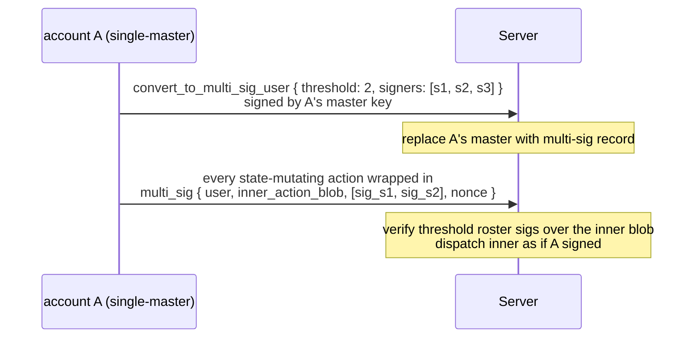
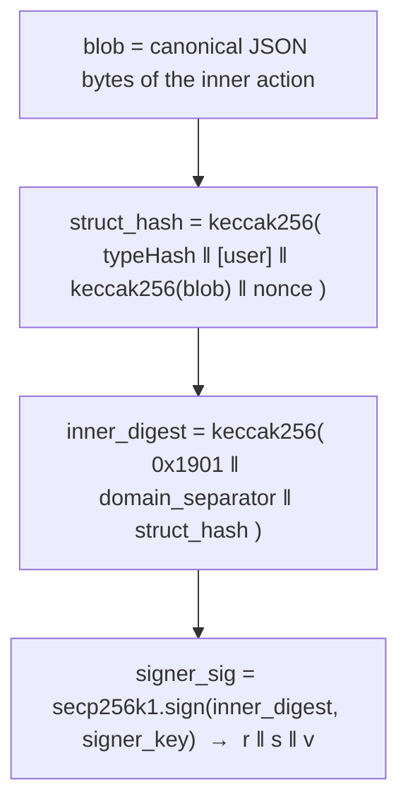

# Multi-sig accounts

:::info
**Preview.**
:::

## TL;DR {#tldr}

Convert a regular account into an M-of-N multi-sig: the master key is replaced by a signer set, every state-mutating action must collect `threshold` signatures from `signers`, and the conversion is **irreversible**. Designed for institutional custody, DAO treasuries, and joint-control trading desks.

## Why multi-sig {#why-multi-sig}

Regular accounts have a single master key. Loss = total loss. Multi-sig spreads custody risk across signers:

- 2-of-3: any two of three signers can act; one can be lost without locking the account.
- 3-of-5: 3 signatures required; up to 2 lost keys are tolerated; up to 2 compromised keys cannot move funds.

This is the same primitive that backs every Gnosis Safe / institutional self-custody setup, native at the protocol layer rather than via a smart contract.

## Lifecycle {#lifecycle}



## Conversion {#conversion}

```json
{
  "type": "convert_to_multi_sig_user",
  "params": {
    "threshold": 2,
    "signers": [ "0x...s1", "0x...s2", "0x...s3" ]
  }
}
```

Signed by the **current** master key (single-sig, the last solo signature this account ever makes).

| Constraint | Value |
|------------|-------|
| `threshold` | `[1, len(signers)]` |
| `len(signers)` | `[2, 16]` |
| `signers[*]` | distinct addresses |

After commit:
- The account's `is_multisig: true` and `multisig_set: { threshold, signers }` are stored.
- Subsequent direct (non-wrapped) actions signed by anyone (including the old master key) are rejected with `{"error":"account is multisig"}`.

**Irreversible**: there is no revert to a single-master key. The signer set can be **rotated** — or the multi-sig requirement retired — via a multi-sig-wrapped `convert_to_multi_sig_user` (see [Updating the signer set](#updating-the-signer-set)), but the account cannot return to plain single-key control.

## Acting as multi-sig {#acting-as-multi-sig}

Every state-mutating action for the account is wrapped in a `multi_sig` action
and posted to [`POST /exchange`](../api/rest/exchange.md) as a normal signed
envelope. The wrapper carries **four** params:

```json
{
  "signature": "0x<submitter_sig>",
  "nonce":     1735689600099,
  "action": {
    "type": "multi_sig",
    "params": {
      "user":              "0x<multisig_addr>",
      "inner_action_blob": "0x<hex of the canonical inner-action JSON>",
      "signatures":        [ "0x<roster_sig_1>", "0x<roster_sig_2>" ],
      "nonce":             1735689600099
    }
  }
}
```

| Field | Meaning |
|-------|---------|
| `user` | The multi-sig account whose state the inner action mutates. |
| `inner_action_blob` | `0x`-hex of the **canonical JSON bytes** of the inner action (e.g. a `submit_order`). These exact bytes are what each signer signs and what the server hashes — they are never re-serialized. |
| `signatures` | A **flat array** of `0x`-hex 65-byte roster signatures over the inner digest (see below). There is no per-entry `signer` field — the signer is recovered from each signature. |
| `nonce` | The wrapper nonce. It is **also** the nonce each signer folds into the inner digest, and it is the value that advances `user`'s nonce window. Set the outer envelope `nonce` to this same value. |

The wrapper is a normal EIP-712-signed `/exchange` envelope: the **submitter**
signs the outer `multi_sig` action with their own key. The submitter can be **any
account** — it does **not** need to be a member of the signer set. The authority
that moves the multi-sig account's state comes **entirely from the inner roster
signatures**, so a coordinator service (or any one signer) can broadcast the
assembled bundle.

Server checks:

1. Each entry in `signatures` is recovered over the inner digest of the raw
   `inner_action_blob` bytes.
2. The recovered signers are all in the account's roster, distinct, and number
   ≥ `threshold`.
3. The inner action is **executable as a multi-sig inner** (privileged / system
   actions, stake votes, and a nested `multi_sig` are rejected).
4. If all checks pass, the inner action is dispatched as if `user` had signed it
   directly, and `user`'s nonce advances to the wrapper `nonce`.

If a check fails: `{"error":"multisig threshold not met"}`,
`{"error":"multisig duplicate signer"}`, or `{"error":"signer not in set"}`.

### Signing the inner action {#signing-the-inner-action}

Each signer signs a standard EIP-712 digest over the **exact `inner_action_blob`
bytes** (the canonical inner-action JSON), under the standard MetaFlux
[domain](../integration/typed-data-signing.md#eip-712-domain). The struct that is
hashed depends on the network version:



- **`nonce`** is the wrapper's `nonce` (they must match), big-endian in the final
  32-byte word.
- **`[user]`** — the multi-sig account address — is present **only in the
  user-bound scheme** (see the next section). The legacy scheme omits it.

The assembled `signatures` array is collected off-chain (a coordinator gathers
each member's signature over the identical `inner_action_blob`) and submitted by
any account.

### User-bound inner signatures {#user-bound-inner-signatures}

:::info
**Availability.** The user-bound scheme is the signing scheme **from the
scheduled network upgrade**. Before that upgrade the network accepts the previous
(unbound) scheme; from the upgrade onward it accepts **only** the user-bound
scheme. Exactly one scheme is valid at a time — there is no dual-accept window —
so a signer must produce the user-bound digest for any bundle that will land
at/after the upgrade.
:::

Each signer signs the EIP-712 struct:

```
MetaFluxMultiSigInner(address user,string action,uint64 nonce)
```

| Field | Value |
|-------|-------|
| `user` | The **multi-sig account** (the wrapper's `user`), left-padded to 32 bytes per EIP-712 `address` encoding. |
| `action` | The inner action, hashed as `keccak256` of the **exact `inner_action_blob` bytes** (not re-serialized). |
| `nonce` | The wrapper `nonce`. |

Binding `user` into the signed struct means a roster signature now authorizes
**exactly one account**. Two multi-sig accounts that share the same signer set
(for example a hot/cold pair, or several desks under one custody policy) can **no
longer replay each other's bundles** — a signature collected for one account is
cryptographically useless against the other.

The previous scheme signed only `MetaFluxAction(string action,uint64 nonce)` (no
`user`), so from the upgrade onward any bundle whose inner signatures were built
under the old, unbound struct is rejected. Re-collect signatures under the
user-bound struct for any bundle submitted at/after the upgrade.

## Updating the signer set {#updating-the-signer-set}

:::info
**Availability.** Rotating or disabling the signer set through the quorum is
available **from the scheduled network upgrade**.
:::

There is no separate "update" action. To rotate the roster, the account's current
signers **re-run [`convert_to_multi_sig_user`](../api/rest/exchange.md#convert_to_multi_sig_user)
wrapped in `multi_sig`** — it requires `threshold` signatures from the **current**
set and overwrites the stored roster with the new `{ threshold, signers }`:

```json
{
  "type": "convert_to_multi_sig_user",
  "params": {
    "threshold": 3,
    "signers":   [ "0x...s1", "0x...s2", "0x...s4", "0x...s5", "0x...s6" ]
  }
}
```

To **disable** multi-sig entirely (remove the requirement), the current signers
submit the same wrapped `convert_to_multi_sig_user` with an **empty `signers`
array and `threshold: 0`**. Both the re-key and the disable path require a full
quorum of the current set.

Use to:
- Rotate compromised keys
- Add or remove signers
- Change `threshold` (e.g. moving from 2-of-3 to 3-of-5 as the desk grows)
- Retire the multi-sig requirement (empty roster + `threshold: 0`)

## Off-chain coordination {#off-chain-coordination}

The protocol doesn't bundle the multi-sig flow — signers need an out-of-band way to share the message to sign and to collect signatures. Common patterns:

| Pattern | Mechanism |
|---------|-----------|
| Internal coordinator service | Each signer's wallet polls a shared inbox; serialises the inner action; signs; uploads signature back; coordinator submits when threshold reached |
| Shared private channel | Encrypted group chat / email; each signer pastes their signature; one signer aggregates and submits |
| Multi-sig SDK (planned) | Official SDK ships a signer-collection workflow that hides the coordination layer |

Until the SDK lands, integrators implement their own coordinator. The on-chain side is unchanged — only the signatures matter.

## Compatibility with sub-accounts and agents {#compatibility-with-sub-accounts-and-agents}

| Question | Answer |
|----------|--------|
| Can a multi-sig account have sub-accounts? | Yes. `CreateSubAccount` is itself a multi-sig-wrapped action. Each sub inherits the multi-sig signing requirement. |
| Can a multi-sig account approve agent wallets? | Yes. `ApproveAgent` is multi-sig-wrapped. Once approved, the agent can sign normally **without** further multi-sig collection — the agent's signature alone is enough for the actions it's allowed to perform. This is the typical institutional setup: multi-sig holds withdrawal authority + agent management; an agent runs the daily trading flow. |
| Can the multi-sig account itself sign as an agent for another account? | Yes — multi-sig accounts can be approved as agents. Other accounts that approve them call `ApproveAgent { agent: <multisig_addr> }`. The multi-sig signer set then signs as needed. |

## Edge cases {#edge-cases}

<details>
<summary>Show edge cases</summary>

- **Lost keys**: M-of-N tolerates up to `N - M` losses. Plan key custody to spread the loss surface (different jurisdictions, different HSMs, different humans).
- **Compromised key**: M-of-N tolerates up to `M - 1` compromises before funds can be moved. Detect early — set rate-monitor alerts on `userEvents` for the multi-sig account.
- **Nonce collisions**: the multi-sig's nonce is per-account, monotonic, same as single-sig. Two parallel signing efforts that pick the same nonce: only one commits; the other returns `{"error":"nonce_too_small"}`. Coordinator should assign nonces.
- **Signature expiry**: roster signatures over the inner blob don't expire on their own — a signature collected today is valid until the bundle is submitted. Some integrators add their own off-chain TTL. (The optional [action `expiresAfter`](../integration/typed-data-signing.md#action-expiry-expiresafter) applies to the **outer** `/exchange` envelope, not to the inner roster signatures.)

</details>

## Querying {#querying}

```bash
curl -X POST https://api.devnet.mtf.exchange/info \
  -d '{"type":"user_to_multi_sig_signers","user":"0x<multisig>"}'
```

```json
{
  "type": "user_to_multi_sig_signers",
  "data": {
    "address":      "0x<multisig>",
    "is_multi_sig": true,
    "threshold":    2,
    "signers":      ["0x...", "0x...", "0x..."]
  }
}
```

`is_multi_sig` is `false` (and `signers` empty) for a plain account. The signer
set + threshold come straight from the committed `multi_sig_tracker` config.

## Sequence — multi-sig order {#sequence--multi-sig-order}

```mermaid
sequenceDiagram
    participant S1 as signer s1
    participant S2 as signer s2
    participant C as coordinator
    participant Chain as chain
    Note over S1: T-1 prepares inner blob = submit_order{...}<br/>computes inner_digest — signs → sig_s1
    S1->>C: sends inner blob + sig_s1 to coordinator
    Note over S2: T-2 receives inner blob via coordinator<br/>verifies inner_digest — signs → sig_s2
    S2->>C: sends sig_s2 to coordinator
    Note over C: T-3 coordinator (any signer or service):<br/>assembles multi_sig{ user, inner_action_blob, signatures: [sig_s1, sig_s2], nonce }<br/>posts it as a normal signed /exchange envelope (own key)
    C->>Chain: POST /exchange
    Note over Chain: T-4 chain admits:<br/>recover both roster sigs over the inner blob ≥ threshold(2)<br/>dispatch inner order as user → admit to mempool
    Chain-->>C: return 202
    Note over Chain: T+commit inner Order applied — orderEvents fires;<br/>multi-sig account now has the new resting order
```

## See also {#see-also}

- [`POST /exchange convert_to_multi_sig_user`](../api/rest/exchange.md#convert_to_multi_sig_user)
- [`/exchange` signed-by semantics](../api/rest/exchange.md#signed-by-semantics) — multi-sig wrapper envelope
- [Agent wallets](./agent-wallets.md) — combine multi-sig with agent delegation
- [Sub-accounts](./sub-accounts.md) — multi-sig accounts can have subs

## FAQ {#faq}

<details>
<summary>Show FAQ</summary>

**Q: Can I do 1-of-N (an "any" sig)?**
A: Yes — `threshold: 1`. Useful for redundancy without coordination. Functionally equivalent to having N separate accounts with shared withdrawal authority, but cheaper on-chain.

**Q: Are inner-action signatures shareable across different inner actions?**
A: No. Each signature is over a specific inner action + nonce. Trying to reuse a signature on a different inner action returns `{"error":"multisig threshold not met"}`.

**Q: Is the multi-sig wrapping recursive?**
A: No. A `multi_sig` whose inner blob is itself a `multi_sig` is rejected. One layer only.

**Q: Can multi-sig wrap a `multi_sig`? (Meta-question.)**
A: Same as above — recursion blocked. To act as a multi-sig on behalf of another multi-sig, the outer account approves the inner multi-sig as an agent.

</details>
