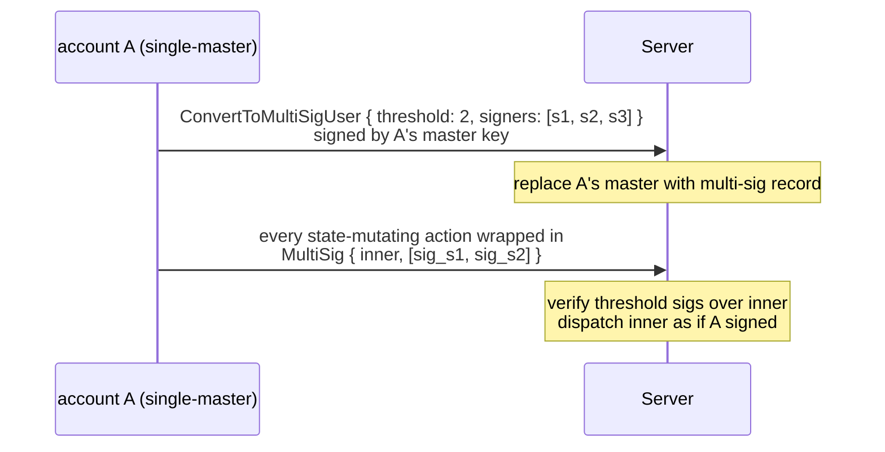
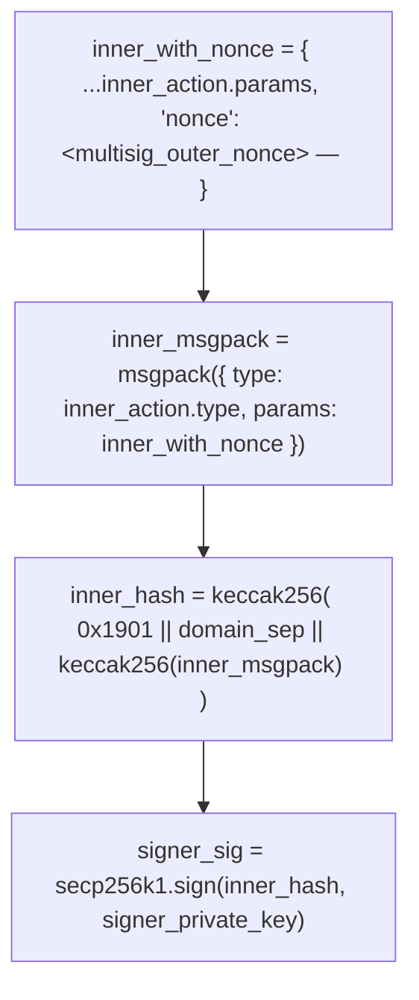

# Multi-sig accounts

:::info
**Preview.**
:::

## TL;DR

Convert a regular account into an M-of-N multi-sig: the master key is replaced by a signer set, every state-mutating action must collect `threshold` signatures from `signers`, and the conversion is **irreversible**. Designed for institutional custody, DAO treasuries, and joint-control trading desks.

## Why multi-sig

Regular accounts have a single master key. Loss = total loss. Multi-sig spreads custody risk across signers:

- 2-of-3: any two of three signers can act; one can be lost without locking the account.
- 3-of-5: 3 signatures required; up to 2 lost keys are tolerated; up to 2 compromised keys cannot move funds.

This is the same primitive that backs every Gnosis Safe / institutional self-custody setup, native at the protocol layer rather than via a smart contract.

## Lifecycle



## Conversion

```json
{
  "type": "ConvertToMultiSigUser",
  "params": {
    "threshold": 2,
    "signers": [ "0x...s1", "0x...s2", "0x...s3" ]
  }
}
```

Signed by the **current** master key (single-sig, the last solo signature this account ever makes).

| Constraint | Value |
|------------|-------|
| `threshold` | `[1, len(signers)]` |
| `len(signers)` | `[2, 16]` |
| `signers[*]` | distinct addresses |

After commit:
- The account's `is_multisig: true` and `multisig_set: { threshold, signers }` are stored.
- Subsequent direct (non-wrapped) actions signed by anyone (including the old master key) are rejected with `{"error":"account is multisig"}`.

**Irreversible**: there is no `RevertFromMultiSig`. The signer set can be **updated** via a multi-sig-wrapped `UpdateMultiSig` (see below), but you cannot go back to single-master.

## Acting as multi-sig

Wrap every action in `MultiSig`:

```json
{
  "sender":    "0x<multisig_addr>",
  "signature": "0x<any_signer_sig>",   ← outer envelope signed by any one signer
  "action": {
    "type": "MultiSig",
    "params": {
      "inner_action": {
        "type": "Order",
        "params": { ... }
      },
      "signatures": [
        { "signer": "0x...s1", "signature": "0x<sig over inner>" },
        { "signer": "0x...s2", "signature": "0x<sig over inner>" }
      ],
      "nonce": 1735689600099
    }
  }
}
```

Server checks:

1. The outer envelope's signature recovers to one of `signers` (any single-sig of the set).
2. Each `signatures[*].signature` recovers to `signatures[*].signer`.
3. The recovered signers are all in `signers`, distinct, and number ≥ `threshold`.
4. Each inner signature is over the **canonical msgpack of `inner_action` with the wrapper's `nonce`**, wrapped in the EIP-712 envelope identical to a regular action.

If any check fails: `{"error":"multisig threshold not met"}` or `{"error":"multisig duplicate signer"}` or `{"error":"signer not in set"}`.

If all checks pass: the inner action is dispatched as if `sender` had signed it directly.

### Signing the inner action

Each signer computes:



The wrapper bundle is then constructed off-chain (coordinator gathers signatures) and submitted by any signer.

## Updating the signer set

```json
{
  "type": "UpdateMultiSig",
  "params": {
    "threshold": 3,
    "signers":   [ "0x...s1", "0x...s2", "0x...s4", "0x...s5", "0x...s6" ]
  }
}
```

Wrapped in `MultiSig`, requiring `threshold` signatures from the **current** set. Effective at next block; from then on the new set is in force.

Use to:
- Rotate compromised keys
- Add or remove signers
- Change `threshold` (e.g. moving from 2-of-3 to 3-of-5 as the desk grows)

## Off-chain coordination

The protocol doesn't bundle the multi-sig flow — signers need an out-of-band way to share the message to sign and to collect signatures. Common patterns:

| Pattern | Mechanism |
|---------|-----------|
| Internal coordinator service | Each signer's wallet polls a shared inbox; serialises the inner action; signs; uploads signature back; coordinator submits when threshold reached |
| Shared private channel | Encrypted group chat / email; each signer pastes their signature; one signer aggregates and submits |
| Multi-sig SDK (planned) | Official SDK ships a signer-collection workflow that hides the coordination layer |

Until the SDK lands, integrators implement their own coordinator. The on-chain side is unchanged — only the signatures matter.

## Compatibility with sub-accounts and agents

| Question | Answer |
|----------|--------|
| Can a multi-sig account have sub-accounts? | Yes. `CreateSubAccount` is itself a multi-sig-wrapped action. Each sub inherits the multi-sig signing requirement. |
| Can a multi-sig account approve agent wallets? | Yes. `ApproveAgent` is multi-sig-wrapped. Once approved, the agent can sign normally **without** further multi-sig collection — the agent's signature alone is enough for the actions it's allowed to perform. This is the typical institutional setup: multi-sig holds withdrawal authority + agent management; an agent runs the daily trading flow. |
| Can the multi-sig account itself sign as an agent for another account? | Yes — multi-sig accounts can be approved as agents. Other accounts that approve them call `ApproveAgent { agent: <multisig_addr> }`. The multi-sig signer set then signs as needed. |

## Edge cases

<details>
<summary>Show edge cases</summary>

- **Lost keys**: M-of-N tolerates up to `N - M` losses. Plan key custody to spread the loss surface (different jurisdictions, different HSMs, different humans).
- **Compromised key**: M-of-N tolerates up to `M - 1` compromises before funds can be moved. Detect early — set rate-monitor alerts on `userEvents` for the multi-sig account.
- **Nonce collisions**: the multi-sig's nonce is per-account, monotonic, same as single-sig. Two parallel signing efforts that pick the same nonce: only one commits; the other returns `{"error":"nonce_too_small"}`. Coordinator should assign nonces.
- **Signature expiry**: signatures don't expire on their own — a signature collected today is valid until the bundle is submitted. Some integrators add their own off-chain TTL.

</details>

## Querying

```bash
curl -X POST https://devnet-gateway.mtf.exchange/info \
  -d '{"type":"user_to_multi_sig_signers","user":"0x<multisig>"}'
```

```json
{
  "type": "user_to_multi_sig_signers",
  "data": {
    "address":      "0x<multisig>",
    "is_multi_sig": true,
    "threshold":    2,
    "signers":      ["0x...", "0x...", "0x..."]
  }
}
```

`is_multi_sig` is `false` (and `signers` empty) for a plain account. The signer
set + threshold come straight from the committed `multi_sig_tracker` config.

## Sequence — multi-sig order

```mermaid
sequenceDiagram
    participant S1 as signer s1
    participant S2 as signer s2
    participant C as coordinator
    participant Chain as chain
    Note over S1: T-1 prepares inner_action = Order{...}<br/>computes inner_hash — signs → sig_s1
    S1->>C: sends inner_action + sig_s1 to coordinator
    Note over S2: T-2 receives inner_action via coordinator<br/>verifies inner_hash — signs → sig_s2
    S2->>C: sends sig_s2 to coordinator
    Note over C: T-3 coordinator (any signer or service):<br/>assembles MultiSig{ inner_action, signatures: [sig_s1, sig_s2], nonce }<br/>wraps in outer envelope — signs outer with own key
    C->>Chain: POST /exchange
    Note over Chain: T-4 chain admits:<br/>verify outer sig<br/>verify both inner sigs ≥ threshold(2)<br/>dispatch Order → admit to mempool
    Chain-->>C: return 202
    Note over Chain: T+commit inner Order applied — orderEvents fires;<br/>multi-sig account now has the new resting order
```

## See also

- [`POST /exchange convert_to_multi_sig_user`](../api/rest/exchange.md#convert_to_multi_sig_user)
- [`/exchange` signed-by semantics](../api/rest/exchange.md#signed-by-semantics) — multi-sig wrapper envelope
- [Agent wallets](./agent-wallets.md) — combine multi-sig with agent delegation
- [Sub-accounts](./sub-accounts.md) — multi-sig accounts can have subs

## FAQ

<details>
<summary>Show FAQ</summary>

**Q: Can I do 1-of-N (an "any" sig)?**
A: Yes — `threshold: 1`. Useful for redundancy without coordination. Functionally equivalent to having N separate accounts with shared withdrawal authority, but cheaper on-chain.

**Q: Are inner-action signatures shareable across different inner actions?**
A: No. Each signature is over a specific inner action + nonce. Trying to reuse a signature on a different inner action returns `{"error":"multisig threshold not met"}`.

**Q: Is the multi-sig wrapping recursive?**
A: No. `MultiSig { inner_action: MultiSig { ... } }` is rejected. One layer only.

**Q: Can multi-sig wrap a `MultiSig`? (Meta-question.)**
A: Same as above — recursion blocked. To act-as-a-multisig-on-behalf-of-another-multisig, the outer account approves the inner multi-sig as an agent.

</details>
