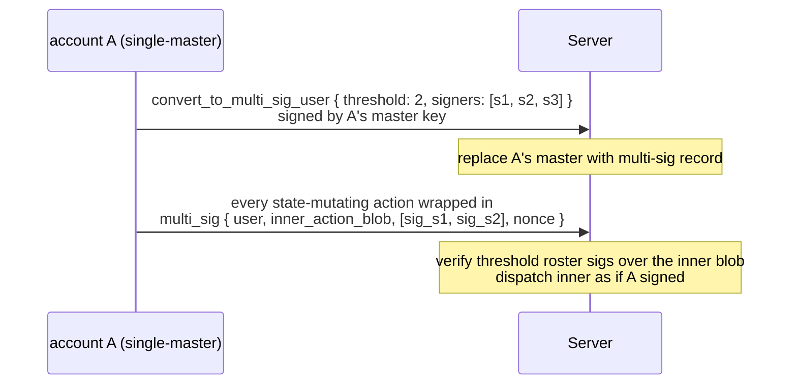
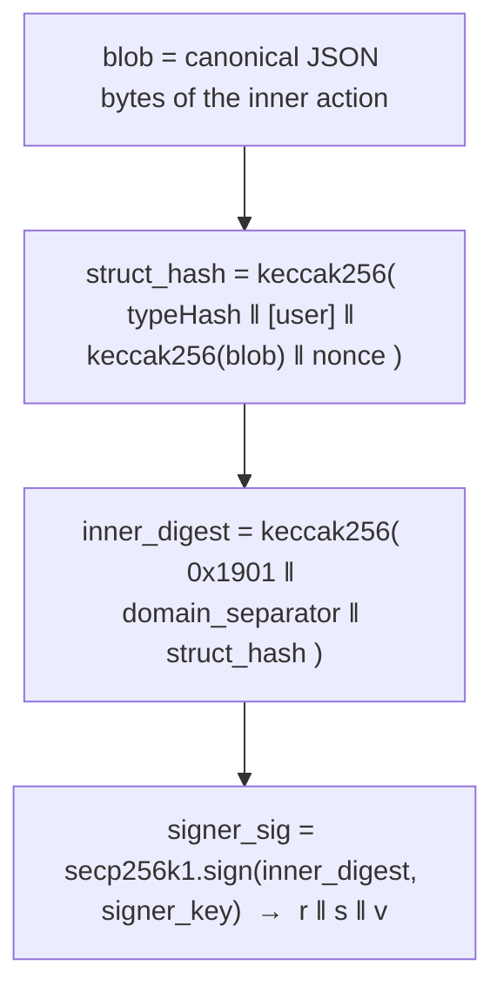

# Multi-sig accounts

A multi-sig account needs M of N signers to act. This page describes the conversion, the signed wrapper, signer rotation and the read.

:::info
**Preview.**
:::

## Summary {#tldr}

You can convert a regular account into an M-of-N multi-sig. A signer set replaces the master key. Every state-mutating action must then collect `threshold` signatures from `signers`. The conversion is irreversible. The design is for institutional custody, DAO treasuries and trading desks with joint control.

## Benefits {#why-multi-sig}

A regular account has a single master key. If that key is lost, the account is lost. Multi-sig spreads the custody risk across signers:

- 2-of-3: any two of three signers can act. One key can be lost and the account stays usable.
- 3-of-5: 3 signatures are required. The account tolerates up to 2 lost keys. Up to 2 compromised keys cannot move funds.

This is the same primitive as in a Gnosis Safe or other institutional self-custody setups. In MetaFlux it is native to the protocol layer, not a smart contract.

## Lifecycle {#lifecycle}


```mermaid
sequenceDiagram
    participant A as account A (single-master)
    participant S as Server
    A->>S: convert_to_multi_sig_user { threshold: 2, signers: [s1, s2, s3] }<br/>signed by A's master key
    Note over S: replace A's master with multi-sig record
    A->>S: every state-mutating action wrapped in<br/>multi_sig { user, inner_action_blob, [sig_s1, sig_s2], nonce }
    Note over S: verify threshold roster sigs over the inner blob<br/>dispatch inner as if A signed
```

## Conversion {#conversion}

```json
{
  "type": "convert_to_multi_sig_user",
  "params": {
    "threshold": 2,
    "signers": [ "0x...s1", "0x...s2", "0x...s3" ]
  }
}
```

The current master key signs this action. It is a single-sig action and the last solo signature that the account makes.

| Constraint | Value |
|------------|-------|
| `threshold` | `[1, len(signers)]` |
| `len(signers)` | `[1, 16]` |
| `signers[*]` | distinct addresses |

The chain refuses a roster of more than 16 signers with `at most 16 signers`. It
refuses a roster that repeats an address with `signers must be distinct`. Both
answer `PRECONDITION_FAILED`. Both rules apply from
[block 16,450,001](../changelog/block-16450001.md).

The signers must be distinct for this reason. The quorum counts distinct
signers, but the chain checks `threshold` against the array length. A `[A, A]`
roster at `threshold: 2` could thus never reach quorum. A converted account
refuses every single-sig path, also the re-key that would repair it. That
account could thus never act again. The refusal stops such a roster before it
commits.

:::warning
A roster that committed before block 16,450,001 is not repaired. If it has fewer
distinct addresses than its `threshold`, that account cannot act.
:::

After the commit:

- The chain stores `is_multisig: true` and `multisig_set: { threshold, signers }` for the account.
- The chain rejects later direct (non-wrapped) actions, signed by anyone, with `PRECONDITION_FAILED`. This includes the old master key.

The conversion is irreversible. The account cannot return to a single master
key. A multi-sig-wrapped `convert_to_multi_sig_user` can rotate the signer set,
or retire the multi-sig requirement (see
[Updating the signer set](#updating-the-signer-set)). The account still cannot
return to plain single-key control.

## Acting as multi-sig {#acting-as-multi-sig}

Every state-mutating action for the account is wrapped in a `multi_sig` action
and posted to [`POST /exchange`](../api/rest/exchange.md) as a normal signed
envelope. The wrapper has four params:

```json
{
  "signature": "0x<submitter_sig>",
  "nonce":     1735689600099,
  "action": {
    "type": "multi_sig",
    "params": {
      "user":              "0x<multisig_addr>",
      "inner_action_blob": "0x<hex of the canonical inner-action JSON>",
      "signatures":        [ "0x<roster_sig_1>", "0x<roster_sig_2>" ],
      "nonce":             1735689600099
    }
  }
}
```

| Field | Meaning |
|-------|---------|
| `user` | The multi-sig account whose state the inner action changes. |
| `inner_action_blob` | `0x`-hex of the canonical JSON bytes of the inner action (for example a `submit_order`). Each signer signs these exact bytes, and the server hashes them. They are never serialized again. |
| `signatures` | A flat array of `0x`-hex 65-byte roster signatures over the inner digest (see below). There is no per-entry `signer` field. The chain recovers the signer from each signature. At most 16 entries. Above 16, the chain refuses the action with `PRECONDITION_FAILED` (`at most 16 signatures`). Each entry costs one recovery on every validator, and a roster has at most 16 signers, so extra entries can never increase the count that matters. |
| `nonce` | The wrapper nonce. Each signer also folds it into the inner digest. It is the only value that advances a nonce window: the window of `user`. Set the outer envelope `nonce` to the same value. The outer `nonce` advances no window, so the window of the posting account does not move. |

The wrapper is a normal EIP-712-signed `/exchange` envelope. The *submitter*
signs the outer `multi_sig` action with its own key. The submitter can be any
account. It does not need to be in the signer set. The authority that changes
the state of the multi-sig account comes only from the inner roster signatures.
A coordinator service, or any one signer, can thus broadcast the assembled
bundle.

Server checks:

1. The chain recovers each entry in `signatures` over the inner digest of the raw
   `inner_action_blob` bytes.
2. The recovered signers must all be in the roster of the account, be distinct,
   and number at least `threshold`.
3. The inner action must be executable as a multi-sig inner. The chain rejects
   privileged and system actions, stake votes and a nested `multi_sig`.
4. If all checks pass, the chain dispatches the inner action as if `user` had
   signed it directly, and the nonce of `user` advances to the wrapper `nonce`.

A failed quorum check answers `AUTH_UNAUTHORIZED` with the flat message
`unauthorized`. It does not say which check failed. To find out, derive the inner
digest and the recovered addresses again on your side.

### Signing the inner action {#signing-the-inner-action}

Each signer signs a standard EIP-712 digest over the exact `inner_action_blob`
bytes (the canonical inner-action JSON), under the standard MetaFlux
[domain](../integration/typed-data-signing.md#eip-712-domain). The hashed struct
depends on the network version:


```mermaid
flowchart TD
    A["blob = canonical JSON bytes of the inner action"]
    B["struct_hash = keccak256( typeHash ‖ [user] ‖ keccak256(blob) ‖ nonce )"]
    C["inner_digest = keccak256( 0x1901 ‖ domain_separator ‖ struct_hash )"]
    D["signer_sig = secp256k1.sign(inner_digest, signer_key)  →  r ‖ s ‖ v"]
    A --> B --> C --> D
```

- `nonce` is the wrapper `nonce` (the two must match), big-endian in the final
  32-byte word.
- `[user]`, the multi-sig account address, is present only in the user-bound
  scheme (see the next section). The legacy scheme omits it.

The `signatures` array is assembled off-chain. A coordinator collects the
signature of each member over the identical `inner_action_blob`. Any account can
then submit it.

Use the ordinary wire action as the blob. Encode in UTF-8 the same
`{type, params}` object that you would post to `/exchange`, and have every
member sign those bytes. The node decodes the blob through the same lowering
that `/exchange` admission runs. A member thus signs the action that the chain
executes.

Build the blob once and distribute it. Every member must sign identical bytes.
If two members each serialize their own copy, they depend on two JSON writers to
agree on key order and spacing. One blob with one distribution cannot disagree.

The node also accepts the core `Action` JSON, which older bundles carry. Do not
build that form by hand. Its variant names are defined in the node and change
when actions change. The node refuses a blob that drifts, after the member
signatures are already used.

### User-bound inner signatures {#user-bound-inner-signatures}

:::info
**One scheme, not two.** The network accepts only the user-bound scheme. Exactly
one scheme is valid at a time, with no window in which both are accepted. A
signer must thus produce the user-bound digest for any bundle that lands at or
after the upgrade.
:::

Each signer signs the EIP-712 struct:

```
MetaFluxMultiSigInner(address user,string action,uint64 nonce)
```

| Field | Value |
|-------|-------|
| `user` | The multi-sig account (the wrapper's `user`), left-padded to 32 bytes per EIP-712 `address` encoding. |
| `action` | The inner action, hashed as `keccak256` of the exact `inner_action_blob` bytes (not serialized again). |
| `nonce` | The wrapper `nonce`. |

With `user` in the signed struct, a roster signature authorizes exactly one
account. Two multi-sig accounts can share the same signer set, for example a
hot/cold pair, or several desks under one custody policy. They can no longer
replay the bundles of each other. A signature collected for one account is
cryptographically useless for the other.

The previous scheme signed only `MetaFluxAction(string action,uint64 nonce)`,
with no `user`. From the upgrade on, the chain rejects any bundle whose inner
signatures use the old, unbound struct. Collect the signatures again under the
user-bound struct for any bundle submitted at or after the upgrade.

## Updating the signer set {#updating-the-signer-set}

:::info
**Availability.** Rotating or disabling the signer set through the quorum is
available.
:::

There is no separate "update" action. To rotate the roster, the current signers
of the account run
[`convert_to_multi_sig_user`](../api/rest/exchange/account.md#convert_to_multi_sig_user)
again, wrapped in `multi_sig`. It requires `threshold` signatures from the
current set. It overwrites the stored roster with the new
`{ threshold, signers }`:

```json
{
  "type": "convert_to_multi_sig_user",
  "params": {
    "threshold": 3,
    "signers":   [ "0x...s1", "0x...s2", "0x...s4", "0x...s5", "0x...s6" ]
  }
}
```

To disable multi-sig fully (remove the requirement), the current signers send
the same wrapped `convert_to_multi_sig_user` with an empty `signers` array and
`threshold: 0`. The re-key path and the disable path both require a full quorum
of the current set.

Use it to:

- Rotate compromised keys.
- Add or remove signers.
- Change `threshold`, for example from 2-of-3 to 3-of-5 as the desk grows.
- Retire the multi-sig requirement (empty roster + `threshold: 0`).

## Off-chain coordination {#off-chain-coordination}

The protocol does not include the multi-sig flow. Signers need an out-of-band way to share the message to sign and to collect signatures. Common patterns:

| Pattern | Mechanism |
|---------|-----------|
| Internal coordinator service | The wallet of each signer polls a shared inbox, serializes the inner action, signs it and uploads the signature. The coordinator submits when the threshold is reached |
| Shared private channel | Encrypted group chat or email. Each signer pastes its signature. One signer aggregates and submits |
| Multi-sig SDK (planned) | The official SDK ships a signer-collection workflow that hides the coordination layer |

Until the SDK is available, integrators build their own coordinator. The on-chain side does not change: only the signatures matter.

## Sub-accounts and agents {#compatibility-with-sub-accounts-and-agents}

| Question | Answer |
|----------|--------|
| Can a multi-sig account have sub-accounts? | Yes. `create_sub_account` is itself a multi-sig-wrapped action. Each sub-account inherits the multi-sig signing requirement. |
| Can a multi-sig account approve agent wallets? | Yes. `approve_agent` is multi-sig-wrapped. After the approval, the agent signs normally, with no further multi-sig collection. The signature of the agent alone is enough for the actions that it can perform. This is the usual institutional setup: the multi-sig holds withdrawal authority and agent management, and an agent runs the daily trading. |
| Can the multi-sig account itself sign as an agent for another account? | Yes. A multi-sig account can be approved as an agent. The other account calls `approve_agent { agent: <multisig_addr> }`. The multi-sig signer set then signs as needed. |

## Edge cases {#edge-cases}

<details>
<summary>Show edge cases</summary>

- **Lost keys.** M-of-N tolerates up to `N - M` lost keys. Spread key custody to reduce the loss risk: different jurisdictions, different HSMs, different people.
- **Compromised key.** M-of-N tolerates up to `M - 1` compromised keys before funds can move. Detect a compromise early, but not from the order feeds. In the past, an inner order inside a multi-sig envelope produced no [`order_updates`](../api/ws/subscriptions.md#order_updates) message, no [`fills`](../api/ws/subscriptions.md#fills) message and no [`historical_orders`](../api/rest/info/account-history.md#historical_orders) record. A watcher could thus not see the action that it looked for. Node 0.9.5 records it. See [unrecorded fills](../api/rest/info/orders-fills.md#unrecorded-fills). Against an older node, or for defence in depth, watch [`ledger_updates`](../api/ws/subscriptions.md#ledger_updates), and compare [`account_state`](../api/rest/info/account.md#account_state) and [`open_orders`](../api/rest/info/orders-fills.md#open_orders) over time.
- **Nonce collisions.** The multi-sig nonce is per account and monotonic, the same as single-sig. If two parallel signing efforts pick the same nonce, only one commits. The chain refuses the other with `PRECONDITION_FAILED` (`stale or replayed multi-sig nonce`). The coordinator should assign nonces.
- **Signature expiry.** Roster signatures over the inner blob do not expire on their own. A signature collected today is valid until the bundle is submitted. Some integrators add their own off-chain TTL. The optional [action `expiresAfter`](../integration/typed-data-signing.md#action-expiry-expiresafter) applies to the outer `/exchange` envelope, not to the inner roster signatures.

</details>

## Querying {#querying}

```bash
curl -X POST https://api.testnet.mtf.exchange/info \
  -d '{"type":"account_state","address":"0x<multisig>","detail":"overview"}'
```

```json
{
  "type": "account_state",
  "data": {
    "address":  "0x<multisig>",
    "multisig": {
      "is_multi_sig": true,
      "threshold":    2,
      "signers":      ["0x...", "0x...", "0x..."]
    }
  }
}
```

`multisig.is_multi_sig` is `false`, and `signers` is empty, for a plain account.
The signer set and threshold come directly from the committed
`multi_sig_tracker` config. See
[`detail: "overview"`](../api/rest/info/account.md#account_state-overview).

## Multi-sig order sequence {#sequence--multi-sig-order}

```mermaid
sequenceDiagram
    participant S1 as signer s1
    participant S2 as signer s2
    participant C as coordinator
    participant Chain as chain
    Note over S1: T-1 prepares inner blob = submit_order{...}<br/>computes inner_digest — signs → sig_s1
    S1->>C: sends inner blob + sig_s1 to coordinator
    Note over S2: T-2 receives inner blob via coordinator<br/>verifies inner_digest — signs → sig_s2
    S2->>C: sends sig_s2 to coordinator
    Note over C: T-3 coordinator (any signer or service):<br/>assembles multi_sig{ user, inner_action_blob, signatures: [sig_s1, sig_s2], nonce }<br/>posts it as a normal signed /exchange envelope (own key)
    C->>Chain: POST /exchange
    Note over Chain: T-4 chain admits:<br/>recover both roster sigs over the inner blob ≥ threshold(2)<br/>dispatch inner order as user → admit to mempool
    Chain-->>C: return 202
    Note over Chain: T+commit inner Order applied — NO order_updates, NO fills message;<br/>multi-sig account now has the new resting order<br/>read open_orders to see it
```

## See also {#see-also}

- [`POST /exchange convert_to_multi_sig_user`](../api/rest/exchange/account.md#convert_to_multi_sig_user)
- [`/exchange` signed-by semantics](../api/rest/exchange.md#signed-by-semantics): the multi-sig wrapper envelope.
- [Agent wallets](./agent-wallets.md): combine multi-sig with agent delegation.
- [Sub-accounts](./sub-accounts.md): a multi-sig account can have sub-accounts.

## FAQ {#faq}

<details>
<summary>Show FAQ</summary>

**Q: Can I do 1-of-N (any one signature)?**
A: Yes, with `threshold: 1`. It gives redundancy with no coordination. It works like N separate accounts with shared withdrawal authority, but it costs less on-chain.

**Q: Can I use an inner-action signature for a different inner action?**
A: No. Each signature covers one specific inner action and nonce. The chain refuses a reused signature on a different inner action with `AUTH_UNAUTHORIZED`.

**Q: Is the multi-sig wrapping recursive?**
A: No. The chain rejects a `multi_sig` whose inner blob is itself a `multi_sig`. Only one layer is allowed.

**Q: Can multi-sig wrap a `multi_sig`?**
A: No, as above. Recursion is blocked. To act as a multi-sig for another multi-sig, the outer account approves the inner multi-sig as an agent.

</details>
