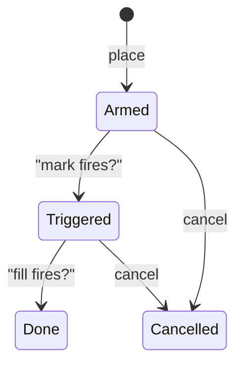
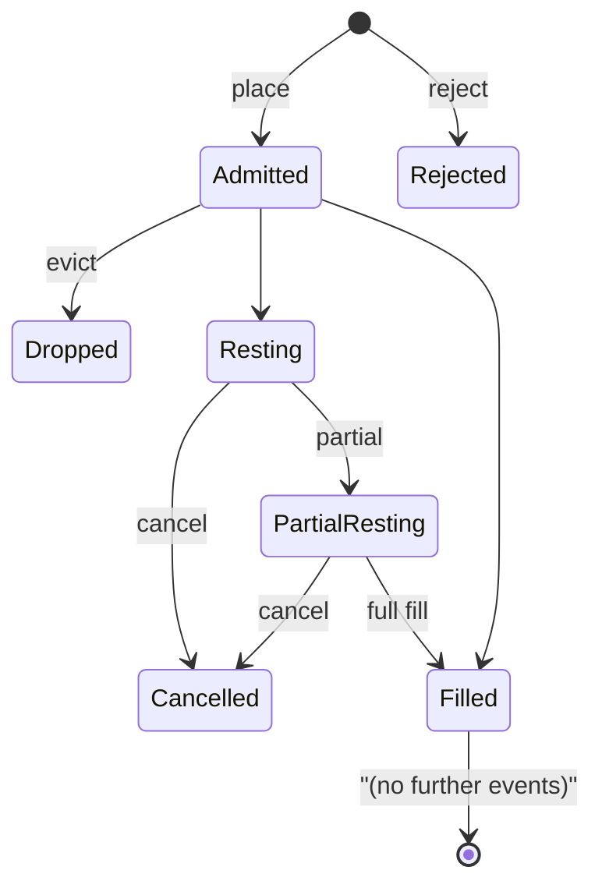

# Order types

:::tip
**Stable.**
:::

## TL;DR {#tldr}

MetaFlux supports a full ladder of order primitives — limit, IOC, ALO, FOK, market, stop-loss, take-profit, trigger limits, TWAP, scale, and reduce-only — plus self-trade-prevention (STP) modes that gate matching against your own orders. Every variant is a `POST /exchange { type: "Order", ... }` shape; specialised flows like TWAP and Scale use their own action variants.

## Time-in-force {#time-in-force}

| TIF | Behaviour | Use when |
|-----|-----------|----------|
| `Gtc` | Good-till-cancelled. Rest on the book until filled or cancelled. | Default; passive making, persistent quoting |
| `Ioc` | Immediate-or-cancel. Match what's available, cancel any unfilled remainder. | Take liquidity now; never want to be on the book |
| `Alo` | Add-limit-only ("post-only"). If any portion would cross the book, the entire order is cancelled. | Strict maker; guaranteed to never pay taker fee |
| `Fok` | Fill-or-kill. Either fill the whole size immediately or cancel everything. | Atomic execution at a single price level |

```
Buy 1 BTC @ 100.5 Gtc      →  rests on book, fills as ask reaches 100.5 or lower
Buy 1 BTC @ 100.5 Ioc      →  immediately matches asks ≤ 100.5; cancels rest
Buy 1 BTC @ 100.5 Alo      →  IF any ask ≤ 100.5  THEN reject  ELSE rest
Buy 1 BTC @ 100.5 Fok      →  IF total ≥ 1.0 @ ≤ 100.5  THEN fill  ELSE reject
```

## Reduce-only {#reduce-only}

`reduce_only: true` rejects the order at admission if filling it would **grow** the absolute position size. Useful for protective exits — a reduce-only stop-loss can't accidentally flip you long-to-short.

```
position: long 1 BTC
sell 0.5 reduce_only=true   →  ok (closes 0.5 of long)
sell 2.0 reduce_only=true   →  rejected: would flip to short 1
buy  0.5 reduce_only=true   →  rejected: would grow long to 1.5
```

Reduce-only is evaluated **at commit**, not admission, when the position is read from the latest committed state. A racing fill that closes your position between admit and dispatch can cause a commit-time `reduce_only_violation_post_admit` (see [errors](../api/errors.md#commit-time-errors-not-http-in-event-stream)).

## Self-trade prevention {#self-trade-prevention}

If a new order would match against an existing order from the same `sender`, STP kicks in.

| STP mode | When new crosses old | When equal-priced both rest |
|----------|---------------------|-----------------------------|
| `None` | Trade allowed | Both rest |
| `CancelNewest` | New is cancelled | New is cancelled |
| `CancelOldest` | Old is cancelled, new can match elsewhere | Old is cancelled, new rests |
| `CancelBoth` | Both cancelled | Both cancelled |
| `DecrementAndCancel` | Match for `min(new, old)`; cancel the smaller; the larger keeps the remainder | Same — match then cancel smaller |

Worked example — `DecrementAndCancel`:

```
your resting bid:  buy 1 BTC @ 100.5  (oid 1)
you place sell:    sell 0.4 BTC @ 100.5  (oid 2)  with stp=DecrementAndCancel

result:
  - oid 1 is decremented to 0.6 BTC remaining
  - oid 2 is cancelled (smaller order)
  - no trade fires (no fee, no fill event)
  - your position is unchanged
```

STP is enforced at the match step, so it works across asset side, price, and time. STP only considers orders signed against the same `sender` — orders from agents under the same master count.

## Triggers {#triggers}

A **trigger order** is a reduce-only protective leg that parks off the book and
fires when the mark price crosses its `trigger_px`. A trigger always **reduces** —
it can never open or grow a position.

:::info
**Market and limit triggers are live.** The `is_market` flag is control from the
scheduled network upgrade on testnet `114514`: `is_market: true` fires a market
exit, `is_market: false` rests a limit exit. Before the upgrade every trigger
fires as a market exit.
:::

The `tpsl` label names the intent; the fired direction comes from the leg `side`
versus the mark, not from the label. An `ask` trigger closes a long; a `bid`
trigger closes a short.

| `tpsl` | Protects | Fires when |
|--------|----------|-----------|
| `sl` (stop-loss) | a long | mark falls to `trigger_px` |
| `sl` (stop-loss) | a short | mark rises to `trigger_px` |
| `tp` (take-profit) | a long | mark rises to `trigger_px` |
| `tp` (take-profit) | a short | mark falls to `trigger_px` |

`is_market` selects the fired exit:

| `is_market` | On the mark cross |
|-------------|-------------------|
| `true` | Fire a reduce-only **market** exit — a slippage-bounded IOC clamped to what reduces the position. `limit_px` is ignored. |
| `false` | Rest a reduce-only **limit** at the order's `limit_px` (`limit_px > 0`, `tif: gtc`). It rests until it fills or you cancel it. |

`trigger_px` keeps every role for both variants — park price, fire direction, and
the mark cross. For a limit trigger, `limit_px` is only the resting order's price.

**OCO collapse.** Trigger legs grouped as OCO collapse when one fires. A **market**
trigger and its sibling collapse on the first fill; a **limit** trigger and its
sibling collapse at **conversion** — the instant the resting limit is placed —
because the live limit order is now the protection.

Trigger state machine:



Triggers are evaluated on every mark-price update (each commit). They survive
across blocks and across restarts. See
[`POST /exchange` → trigger orders](../api/rest/exchange.md#trigger-orders-stop_loss--take_profit)
for the wire fields.

## Grouping {#grouping}

`Order { grouping: ... }` groups legs into a family.

| Grouping | Meaning |
|----------|---------|
| `Na` | Independent orders |
| `NormalTpsl` | Two orders: an entry + one of {StopLoss, TakeProfit}. Filling one cancels the other (OCO). |
| `PositionTpsl` | Two trigger orders that attach to the **position**, not the entry order. They survive position changes (e.g. averaging in) and only cancel when the position closes. |

Use `PositionTpsl` for "I always want a stop on my net position" — the same TPSL braces stay armed as you add to or trim the position.

## Scale orders {#scale-orders}

:::info
**Scale ladders are live from the scheduled network upgrade on testnet `114514`.**
:::

A **scale ladder** is `n` resting limit rungs spread evenly across `[px_low,
px_high]` on one perpetual market, placed from **one signature**. You sign a
compact request — the range, the rung count, the total size, and a distribution —
and the node expands it into the rungs. Every rung shares the one `cloid` you
supply, which is the ladder handle.

```json
{
  "type": "scale_order",
  "params": {
    "market": 7, "side": "bid",
    "n": 5,
    "px_low": 9800000000, "px_high": 10000000000,
    "total_size": 500000000,
    "dist": "flat", "weights": [],
    "tif": "alo", "reduce_only": false,
    "stp_mode": "cancel_oldest",
    "cloid": "0x5c000000000000000000000000000001"
  }
}
```

Rung `0` sits at `px_low` and rung `n − 1` at `px_high` for both sides.
`total_size` is split across the rungs by the distribution:

| `dist` | Size across rungs |
|--------|-------------------|
| `flat` | Equal on every rung |
| `lin_asc` | Rises with rung index — smallest at `px_low`, largest at `px_high` |
| `lin_desc` | Falls with rung index — largest at `px_low`, smallest at `px_high` |
| `custom` | Your `weights` array (length `n`, each `≥ 1`); send an **empty** array for any other `dist` |

`tif` is `alo` or `gtc` (a ladder must rest); `ioc` / `aon` are rejected.
Placement is **not** all-or-nothing — each rung runs the full order gate on its
own, and the response echoes every rung's price, size, and `oid`.

**Cancel the whole ladder** with
[`cancel_scale`](../api/rest/exchange.md#cancel_scale) — one action cancels every
resting rung that carries the shared `cloid`, no `oid` needed. A parked trigger leg
that carries the same `cloid` is **not** swept, so keep trigger legs on their own
handle. Use a fresh handle per ladder — the SDKs tag ladder handles with a `0x5c`
prefix. See [`POST /exchange` → scale_order](../api/rest/exchange.md#scale_order)
for the full field table and admission rules.

## TWAP {#twap}

`TwapOrder` schedules slices over `duration_ms`.

```
duration = 1 hour = 3,600,000 ms
slices   = duration / SLICE_INTERVAL  (default 60s slice; 60 slices per hour)
sz_per_slice = size / slices

slice  1: send IOC near mid at t = randomize(0, SLICE_INTERVAL * (1 + jitter%))
slice  2: send IOC at t = slice_1_t + SLICE_INTERVAL * (1 + jitter%)
...
slice 60: send last IOC just before t = duration
```

`randomize_pct` ∈ `[0, 50]` jitters slice times by ±`randomize_pct/100 × slice_interval`. Set higher to be harder to detect; set lower for tight time-control.

Slices are submitted by the protocol; nothing for the client to do after submitting `TwapOrder`. Slice events ride the [`userEvents` WS channel](../api/ws/subscriptions.md#userevents) (a dedicated `twap*` stream is roadmap).

TWAP is cancellable mid-run via `TwapCancel`; already-filled slices stay filled, future slices stop.

## Market orders {#market-orders}

There is no distinct "market" action — a "market order" is an `Ioc` limit at an extreme price (`MAX_PRICE` for buys, `0` for sells). The SDKs do this for you when you call `marketBuy(...)`. The book matches at whatever liquidity exists; uncrossed remainder is cancelled.

Caveat: ALL market orders are subject to the **mark-price band** — if the best ask is 5% above mark, your market buy will fill the available liquidity up to `mark × (1 + band_pct)` and cancel the remainder. See [mark prices](./mark-prices.md).

## Order lifecycle state machine {#order-lifecycle-state-machine}



Each state transition emits a corresponding event on [`userEvents`](../api/ws/subscriptions.md#userevents) (order-lifecycle events ride this channel).

## Edge cases {#edge-cases}

<details>
<summary>Show edge cases</summary>

- **Reduce-only race with fill.** Stop is reduce-only; a fill closes the position; the stop fires; commit-time check fails with `reduce_only_violation_post_admit`. Solution: wire `userFills` events back into your bot to cancel braces on full close.
- **STP at admit vs at match.** STP is only enforced at the match step. Two opposite-side orders that don't cross will both rest. STP fires only when they would actually trade.
- **TWAP mid-volatility.** Each slice is an IOC near mid — if liquidity dries up between slices, slices can return fully unfilled. Watch slice events.
- **ALO + crossing book.** ALO that would cross *any* level is rejected entirely, not partially. To slip into the book at a tight price, use a non-crossing limit at one tick worse than best opposite.
- **Trigger and TIF.** A `StopLoss` with `limit_px` set rests as a Gtc limit on trigger. Add a TWAP-like spray manually if you want sliced exit.

</details>

## Examples — TypeScript {#examples--typescript}

```typescript
// limit buy, GTC, post-only
await client.order({
  asset: 0, side: 'Buy', priceE8: '10050000000', sizeE8: '100000000',
  tif: 'Alo', reduceOnly: false, stpMode: 'CancelNewest'
});

// stop-loss attached to a long position
await client.trigger({
  asset: 0, side: 'Sell', sizeE8: '100000000',
  triggerPxE8: '9500000000', limitPxE8: null,
  triggerKind: 'StopLoss', reduceOnly: true
});

// 1-hour TWAP buy
await client.twap({
  asset: 0, side: 'Buy', sizeE8: '1000000000',
  durationMs: 3_600_000, randomizePct: 20, reduceOnly: false
});

// 5-rung scale buy ladder (one signature; node expands the rungs)
await client.scaleOrder({
  market: 0, side: 'bid',
  n: 5,
  pxLow: '9800000000', pxHigh: '10000000000',
  totalSize: '500000000',
  dist: 'flat',
  cloid: '0x5c000000000000000000000000000001'
});
```

## See also {#see-also}

- [`POST /exchange`](../api/rest/exchange.md) — full per-variant schemas
- [Margin modes](./margin-modes.md)
- [Mark prices](./mark-prices.md) — how triggers fire
- [Tiered liquidation](./tiered-liquidation.md) — how positions are managed under stress

## FAQ {#faq}

<details>
<summary>Show FAQ</summary>

**Q: Does an ALO order ever pay taker fee?**
A: Never. If it would cross, the entire order is rejected at admission — no partial taker.

**Q: Can a single `Order` action mix TIFs?**
A: Yes. `orders: []` is heterogeneous; each entry has its own `tif`.

**Q: How does the matching engine break ties at the same price?**
A: Strict FIFO — earliest `oid` wins. ALO orders gain priority by sitting on the book first; that's their natural fee-rebate edge.

**Q: Do TWAP slices count against my rate limit?**
A: No — they're submitted internally by the protocol, not by your client. Submitting the `TwapOrder` is one rate-limit charge.

</details>
