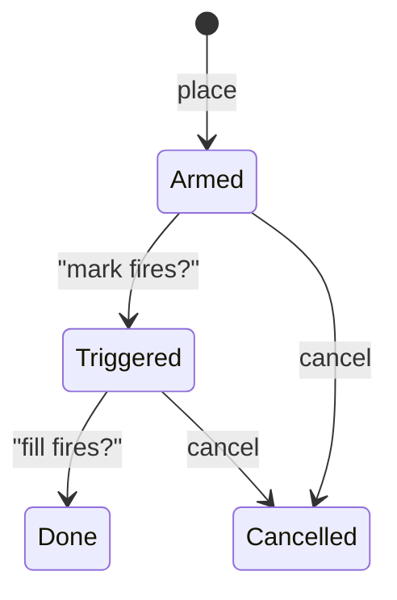
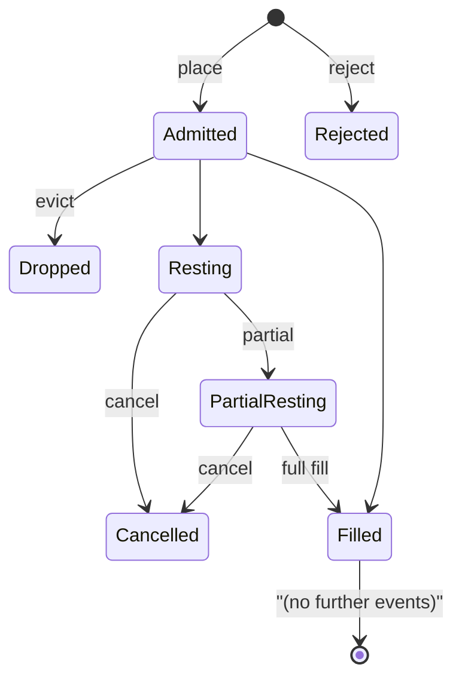

# Order types

:::tip
**Stable.**
:::

## TL;DR {#tldr}

**There is one perp order shape, not a list of order types.** You send
[`submit_order`](../api/rest/exchange.md#submit_order) (or
[`batch_order`](../api/rest/exchange.md#batch_order) for many at once) and pick
the behaviour with fields on the order body:

| You want | Set this | Not a separate action |
|----------|----------|-----------------------|
| Rest, take, or post-only | `tif` | ✅ |
| A market order | `tif: "ioc"` at an extreme `limit_px` | ✅ |
| Stop-loss / take-profit | a `trigger` block | ✅ |
| Reduce-only | `reduce_only: true` | ✅ |
| Self-trade behaviour | `stp_mode` | ✅ |
| Entry + protective legs | `grouping` on `batch_order` | ✅ |

Only four behaviours need their **own** action, because the node holds state for
them or runs them over time: [TWAP](#twap), [scale](#scale-orders),
[chase](#chase-orders), and the spot book
([`spot_order`](../api/rest/exchange.md#spot_order), a separate engine).

This page describes the fields. For the end-to-end request see
[placing orders](../integration/placing-orders.md).

## Time-in-force {#time-in-force}

Wire field `tif` on the order body. The values are lowercase.

| `tif` | Behaviour | Use when |
|-------|-----------|----------|
| `"gtc"` | Good-till-cancelled. Rest on the book until filled or cancelled. | Default; passive making, persistent quoting |
| `"ioc"` | Immediate-or-cancel. Match what is available, cancel any unfilled remainder. | Take liquidity now; never rest on the book |
| `"alo"` | Add-limit-only ("post-only"). If any portion would cross the book, the whole order is cancelled. | Strict maker; never pay a taker fee |

```
Buy 1 BTC @ 100.5 gtc      →  rests on book, fills as ask reaches 100.5 or lower
Buy 1 BTC @ 100.5 ioc      →  immediately matches asks ≤ 100.5; cancels rest
Buy 1 BTC @ 100.5 alo      →  IF any ask ≤ 100.5  THEN reject  ELSE rest
```

:::warning
**There is no fill-or-kill and no all-or-none.** The matching engine has exactly
the three values above. The wire also parses `"aon"`, but the node **rejects** it
rather than downgrade it to `ioc` — that would change execution semantics
silently. To approximate fill-or-kill, send `ioc` and treat a partial fill as a
failure in your own code.
:::

## Reduce-only {#reduce-only}

`reduce_only: true` rejects the order at admission if filling it would **grow** the absolute position size. Useful for protective exits — a reduce-only stop-loss can't accidentally flip you long-to-short.

```
position: long 1 BTC
sell 0.5 reduce_only=true   →  ok (closes 0.5 of long)
sell 2.0 reduce_only=true   →  rejected: would flip to short 1
buy  0.5 reduce_only=true   →  rejected: would grow long to 1.5
```

Reduce-only is evaluated **at commit**, not admission, when the position is read from the latest committed state. A racing fill that closes your position between admit and dispatch can cause a commit-time `reduce_only_violation_post_admit` (see [errors](../api/errors.md#commit-time-errors-not-http-in-event-stream)).

## Self-trade prevention {#self-trade-prevention}

If a new order would match an existing order from the same account, STP acts.
Wire field `stp_mode` on the order body. The values are lowercase.

| `stp_mode` | When new crosses old | When equal-priced both rest |
|------------|---------------------|-----------------------------|
| `"cancel_newest"` | New is cancelled | New is cancelled |
| `"cancel_oldest"` | Old is cancelled, new can match elsewhere | Old is cancelled, new rests |
| `"cancel_both"` | Both cancelled | Both cancelled |

`"cancel_newest"` is the default.

:::warning
**There is no "off" mode.** STP always acts. If you need two of your own orders
to trade with each other, use two different accounts.

The wire also parses `"reject"`, but the node **rejects** that value. The
matching engine has a fourth internal mode, decrement-and-cancel, that
`/exchange` **cannot** select — no wire value maps to it. Do not build against
it.
:::

STP runs at the match step, so it applies across side, price, and time. STP
groups orders by the account that owns them. Orders an agent places for a master
count as that master's orders.

## Triggers {#triggers}

A **trigger order** is a reduce-only protective leg that parks off the book and
fires when the mark price crosses its `trigger_px`. A trigger always **reduces** —
it can never open or grow a position.

:::info
**Market and limit triggers are live.** `is_market` is control:
`is_market: true` fires a market exit, `is_market: false` rests a limit exit.
:::

The `tpsl` label names the intent; the fired direction comes from the leg `side`
versus the mark, not from the label. An `ask` trigger closes a long; a `bid`
trigger closes a short.

| `tpsl` | Protects | Fires when |
|--------|----------|-----------|
| `sl` (stop-loss) | a long | mark falls to `trigger_px` |
| `sl` (stop-loss) | a short | mark rises to `trigger_px` |
| `tp` (take-profit) | a long | mark rises to `trigger_px` |
| `tp` (take-profit) | a short | mark falls to `trigger_px` |

`is_market` selects the fired exit:

| `is_market` | On the mark cross |
|-------------|-------------------|
| `true` | Fire a reduce-only **market** exit — a slippage-bounded IOC clamped to what reduces the position. `limit_px` is ignored. |
| `false` | Rest a reduce-only **limit** at the order's `limit_px` (`limit_px > 0`, `tif: gtc`). It rests until it fills or you cancel it. |

`trigger_px` keeps every role for both variants — park price, fire direction, and
the mark cross. For a limit trigger, `limit_px` is only the resting order's price.

**OCO collapse.** Trigger legs grouped as OCO collapse when one fires. A **market**
trigger and its sibling collapse on the first fill; a **limit** trigger and its
sibling collapse at **conversion** — the instant the resting limit is placed —
because the live limit order is now the protection.

:::info
**Not live yet.** Trailing stops are written here ahead of activation. The
network REFUSES an order carrying `trail_px` until the release that binds it
activates — the current node answers `trail_px is not bound by the order signing
type yet`. Everything below is the target behaviour, including the digest rules:
build against it, but do not submit one until the release lands.
:::

**Trailing stops.** A trigger leg that carries `trail_px` parks a *trailing*
stop: the level ratchets toward the mark by that callback offset once per block
and never away from it, so it fires at the ratcheted level, not the one you sent.
Only the stop-loss leg may trail. `trail_px` is part of the signed order —
sending it changes the EIP-712 type string — so see
[`POST /exchange` → trailing stops](../api/rest/exchange.md#trailing-stops)
before you build a write path.

Trigger state machine:


```mermaid
stateDiagram-v2
    [*] --> Armed: place
    Armed --> Triggered: "mark fires?"
    Triggered --> Done: "fill fires?"
    Armed --> Cancelled: cancel
    Triggered --> Cancelled: cancel
```

Triggers are evaluated on every mark-price update (each commit). They survive
across blocks and across restarts. See
[`POST /exchange` → trigger orders](../api/rest/exchange.md#trigger-orders-stop_loss--take_profit)
for the wire fields.

## Grouping {#grouping}

`grouping` on [`batch_order`](../api/rest/exchange.md#batch_order) links legs into
a family. It is the one **camelCase** corner of an otherwise snake_case wire.

| `grouping` | Meaning |
|------------|---------|
| `"na"` | Independent orders. The default. |
| `"normalTpsl"` | An entry leg plus its protective legs. The entry is index 0. Filling one protective leg cancels the other (OCO). |
| `"positionTpsl"` | Protective legs that attach to the **position**, not to an entry order. They survive position changes (for example averaging in) and cancel only when the position closes. |

Use `"positionTpsl"` when you always want a stop on your net position. The same
braces stay armed as you add to or trim the position.

## Scale orders {#scale-orders}

:::info
**Live on the hosted sandbox and on mainnet** — active from block 0 on chain
`114514` and on chain `8964`, with no vote and no activation height. A node you
run yourself under the default chain id `31337` must arm the feature by validator
vote first.
:::

A **scale ladder** is `n` resting limit rungs spread evenly across `[px_low,
px_high]` on one perpetual market, placed from **one signature**. A spot pair is
refused today — see [The three on a spot pair](#synth-on-spot). You sign a
compact request — the range, the rung count, the total size, and a distribution —
and the node expands it into the rungs. Every rung shares the one `cloid` you
supply, which is the ladder handle.

```json
{
  "type": "scale_order",
  "params": {
    "market": 7, "side": "bid",
    "n": 5,
    "px_low": 9800000000, "px_high": 10000000000,
    "total_size": 500000000,
    "dist": "flat", "weights": [],
    "tif": "alo", "reduce_only": false,
    "stp_mode": "cancel_oldest",
    "cloid": "0x5c000000000000000000000000000001"
  }
}
```

The example above is a **one-way** account's body. A [hedge-mode](./hedge-mode.md)
account must add `position_side` (`"long"` or `"short"`); a one-way account must
omit it. Get that wrong and the ladder is rejected at commit, where nothing
reports it — see [`accepted` is not `committed`](../api/rest/exchange.md#accepted-is-not-committed).

Rung `0` sits at `px_low` and rung `n − 1` at `px_high` for both sides.
`total_size` is split across the rungs by the distribution:

| `dist` | Size across rungs |
|--------|-------------------|
| `flat` | Equal on every rung |
| `lin_asc` | Rises with rung index — smallest at `px_low`, largest at `px_high` |
| `lin_desc` | Falls with rung index — largest at `px_low`, smallest at `px_high` |
| `custom` | Your `weights` array (length `n`, each `≥ 1`); send an **empty** array for any other `dist` |

`tif` is `alo` or `gtc` (a ladder must rest); `ioc` / `aon` are rejected.
Placement is **not** all-or-nothing — each rung runs the full order gate on its
own, and the response echoes every rung's price, size, and `oid`.

**Cancel the whole ladder** with
[`cancel_scale`](../api/rest/exchange.md#cancel_scale) — one action cancels every
resting rung that carries the shared `cloid`, no `oid` needed. A parked trigger leg
that carries the same `cloid` is **not** swept, so keep trigger legs on their own
handle. Use a fresh handle per ladder — the SDKs tag ladder handles with a `0x5c`
prefix. See [`POST /exchange` → scale_order](../api/rest/exchange.md#scale_order)
for the full field table and admission rules.

## Chase orders {#chase-orders}

:::info
**Live on the hosted sandbox and on mainnet** — same gate as the scale ladder:
active from block 0 on chain `114514` and on chain `8964`. A node you run yourself
under the default chain id `31337` must arm the feature by validator vote first.
:::

A **chase order** is a single resting **post-only** leg that the node automatically
re-prices to stay one tick inside the top of the book. You sign one compact request
— the market, side, size, a reprice cadence, a time-to-live, and a reprice budget —
and the node keeps the leg pegged to the best price with **no client round-trip**.
Because the leg is post-only and always rests strictly inside the spread, a chase
never takes liquidity and never pays a taker fee. A spot pair is refused today —
see [The three on a spot pair](#synth-on-spot).

```json
{
  "type": "chase_order",
  "params": {
    "market": 7, "side": "bid",
    "size": 100000000,
    "cloid": "0x5c000000000000000000000000000002",
    "stp_mode": "cancel_oldest",
    "interval_blocks": 4,
    "ttl_ms": 3600000,
    "max_reprices": 500
  }
}
```

The example above is a **one-way** account's body. A [hedge-mode](./hedge-mode.md)
account must add `position_side`; a one-way account must omit it. A chase carries
**no** `reduce_only` — its leg always opens or adds, so a chase cannot close a
position.

The node pegs the leg one tick inside the touch — a buy chase one tick above the
best bid, a sell chase one tick below the best ask — and re-prices it at most once
per `interval_blocks` committed blocks. Each reprice cancels the old leg and places
a new leg at the fresh price under the **same re-stamped `cloid`**, so correlate the
leg across reprices by `cloid`, not by its `oid`.

The chase ends when `ttl_ms` elapses, when `max_reprices` is reached, or when the
leg fills or is cancelled by another path. A partial fill keeps the chase running on
the remaining size. A reprice that would cross the book, a book too thin to peg
against, or a halted market **pauses** the leg at its current price and retries
later.

**Cancel a chase** with [`cancel_chase`](../api/rest/exchange.md#cancel_chase),
passing the `chase_oid` handle returned when you placed it (the handle is stable;
the leg `oid` is not). There is **no chase-specific WS channel** — the placement and
every reprice ride the account
[`order_updates`](../api/ws/subscriptions.md#order_updates) and
[`open_orders`](../api/ws/subscriptions.md#open_orders) feeds as an ordinary cancel
plus a new resting order. See
[`POST /exchange` → chase_order](../api/rest/exchange.md#chase_order) for the full
field table and admission rules.

## TWAP {#twap}

:::danger
**A hedge account MUST send `position_side`; a one-way account MUST NOT.** Get it
wrong and the parent is admitted to the mempool and then rejected at commit. **The
rejection is reported on no channel** — the HTTP reply already said
`accepted: true`. Read `position_mode` from
[`account_state`](../api/rest/info.md#account_state) before you submit. See
[`accepted` is not `committed`](../api/rest/exchange.md#accepted-is-not-committed).

A hedge account's child slices inherit the leg the parent names. A one-way account
has one net leg, so naming it is refused.
:::

A **TWAP** splits one parent order into `slice_count` equal child slices, fired
`delay_ms` apart. Each slice is an IOC that crosses the book for its share of the
size. The node fires them; there is nothing for the client to do after the
parent is accepted. A spot pair is refused today — see
[The three on a spot pair](#synth-on-spot).

[`twap_order`](../api/rest/exchange.md#twap_order) carries six required fields —
`market`, `side`, `total_size`, `slice_count`, `delay_ms`, `reduce_only` — plus
two optional ones, `position_side` and `randomize`.

**You choose the schedule, not a duration.** There is no `duration` field and no
USD-denominated size. Divide the window yourself:

```
window       = 1 hour
slice every  = 60 seconds
slice_count  = 3,600 s / 60 s = 60
delay_ms     = 60000
total_size   = the full size, in raw lots
```

Two rules change what you get back:

- `delay_ms` is **clamped UP** to the governed minimum (default `10000` ms), not
  rejected. A `delay_ms` below the floor is accepted and the TWAP runs slower
  than you asked — a 60-slice TWAP at `delay_ms: 1000` takes 10 minutes, not 1.
  The clamp is snapshotted into the parent, so a later retune leaves it alone.
- `slice_count` has a governed ceiling (default `10000`), and an account may hold
  a governed number of live parents at once (default `100`). Both reject at
  commit.

By default the slice sizes are equal and the timing is fixed, so the schedule is
**predictable to an observer watching the tape**. Send `randomize: true` to draw
each slice size and each inter-slice delay from a digest over committed inputs
instead. The draw is deterministic — every validator draws the same numbers — and
the sizes still sum to `total_size`. **`randomize: true` selects its own signing
string**, so sign the payload you send.

Slice fills ride the dedicated [`user_twap_slice_fills`](../api/ws/subscriptions.md#user_twap_slice_fills) WS channel; parent lifecycle transitions (activated / finished / terminated) ride [`user_twap_history`](../api/ws/subscriptions.md#user_twap_history), which is where the `twapId` first appears.

TWAP is cancellable mid-run via [`twap_cancel`](../api/rest/exchange.md#twap_cancel); already-filled slices stay filled, future slices stop.

## The three on a spot pair {#synth-on-spot}

:::caution
**Not live yet, and no activation height is chosen.** Today `twap_order`,
`scale_order` and `chase_order` accept a PERP market only. Sending a spot pair id
in `market` is refused at commit, on no channel:

| Action | What you get today |
|---|---|
| `twap_order` | `no perp market for asset` |
| `chase_order` | `chase market has no tick/lot grid` |
| `scale_order` | Every rung is refused. Nothing rests, and the ladder reports a per-rung error |

Build against the rules below, but keep slicing spot orders yourself with
ordinary [`spot_order`](../api/rest/exchange.md#spot_order) legs until this notice
is gone.
:::

At and above the activation height, `market` on all three accepts a **spot pair
id** and the order runs on the spot book. Perp behaviour is unchanged at every
height.

**Every leg runs the ordinary spot order path.** The spot kill switch, the pair's
price and size grid, the resting-order cap, the affordability clamp and the escrow
reserve all apply exactly as they do to a `spot_order` you send yourself.

### What spot drops {#synth-on-spot-drops}

Spot has no position, no margin and no leverage. It moves balances you already
custody, so the concepts a perp leg carries do not cross:

| Perp concept | On a spot pair |
|---|---|
| `position_side` | **Refused on all three** — `spot has no position side`. There is no position to name |
| `reduce_only` | **Refused on `twap_order` and `scale_order`** when `true` — `spot has no position to reduce: reduce_only is not supported`. `chase_order` has no such field |
| `randomize` | **Refused on `twap_order`** when `true` — `spot twap does not support randomize`. A drawn size cannot be re-quoted against the escrow reserve. `scale_order` and `chase_order` have no such field |
| Margin, leverage, open-interest caps | Do not apply. Your free balance and the escrow reserve are what bound the order |
| The hedge-account leg rule | Does not apply. It governs perp legs, which carry a leg name; a spot leg carries none |

**Each of the three is a REFUSAL, not a silent drop.** The whole action is
rejected and nothing is placed. Dropping a field you signed would execute an order
you did not sign, so the chain refuses instead. Clear the field, then re-sign.

**One live-parent budget covers both homes.** The governed cap on live TWAP
parents (default `100`) counts your perp parents and your spot parents **together**
— it is one allowance per account, not one per market class. Nothing changes below
the activation height, where an account can hold no spot parents at all.

[`twap_cancel`](../api/rest/exchange.md#twap_cancel) takes a spot parent's id with
no change to the wire: the id is looked up in both homes. So one cancel path
covers both.

### Per type {#synth-on-spot-per-type}

**A spot TWAP** fires each slice as an IOC on the spot book, under your own
account. The slice price is **not** taken from the book's touch. It is built from
a reference mark: the base token's committed oracle index, or — for a pair with no
fresh index — the book's last trade price. The mark is widened by the governed
slippage allowance (a buy up, a sell down) and then snapped back onto the pair's
tick grid **toward the mark**, so the snap can only make the order less aggressive,
never more. Slice fills carry the parent's `twapId` on
[`user_twap_slice_fills`](../api/ws/subscriptions.md#user_twap_slice_fills).

**Two admission refusals size your parent, and both look at ONE SLICE, not the
total.** The rule behind them is the same: a slice the fire path cannot place
still spends its turn, so a parent whose EVERY slice is unplaceable burns its
whole schedule and fills nothing. The chain refuses that parent up front instead.

| Refusal | When |
|---|---|
| `slice below one lot` | `total_size / slice_count` floors to zero lots on the pair's lot grid. The executor floors every slice to that grid, so each one would be a no-op |
| `below min notional` | The pair carries a `min_notional_cents` floor and ONE slice, priced at the reference mark, is worth less than it. **A total that clears the floor does not help** — the fire path checks each slice, not the parent |

A pair that carries a min-notional floor and has **no reference mark at all** is
also refused, with `no mark price for spot twap admission`: the check is required
and nothing can price it. Raise `total_size`, or lower `slice_count`, and re-sign.

One residual stays after admission: governance can retune `min_notional_cents`,
and the price can drift, AFTER your parent is accepted. A slice that then falls
under the floor is refused at fire time and the schedule still advances.

Three outcomes are worth building for, and they are not the same thing:

- **No reference mark at all** — no oracle index and no trade ever printed on the
  pair. The slice **PARKS**: it does not fire, and it does not count. The schedule
  waits for a price rather than burning a slice against one that does not exist.
- **A mark exists, but nothing rests inside the band.** The slice DOES fire, fills
  nothing, and the schedule **ADVANCES** — that slice is spent. A spot TWAP
  under-fills rather than stalls, so read the fills, never the parent status.
- **The remainder is smaller than one lot.** The parent ENDS there. A remainder the
  grid cannot express is not carried forever.

A parent that ends having filled nothing at all reports `terminated` on
[`user_twap_history`](../api/ws/subscriptions.md#user_twap_history); any fill at
all reports `finished`.

**A slice is a self-trade risk on your own pair.** Each slice runs with
self-trade prevention set to cancel-oldest, so if it would cross your own resting
order on that pair, your older order is cancelled. Keep a maker book and a TWAP on
the same pair apart.

**A spot chase** pegs one post-only leg one tick inside the touch and re-prices it
on the same cadence a perp chase uses. Two spot-only outcomes:

- A reprice that would need **more quote balance than you have free** is skipped,
  and the leg is **not** cancelled. It stays at its current price and the chase
  tries again next interval. Only a buy chase can hit this — a sell chase reserves
  base, and its reserve does not grow when the price moves.
- If the re-place fails, the chase **retires**. The escrow is already refunded, so
  nothing is stranded, but the leg is gone and is not restored.

### A halted spot pair PAUSES, it does not cancel {#synth-on-spot-halt}

A spot pair stops trading in two ways: the pair itself is delisted or deactivated,
or governance throws the global spot kill switch. **Both do the same thing to an
in-flight TWAP or chase, starting the next release.**

| What | Behaviour during the halt |
|---|---|
| A TWAP parent | **PAUSED.** No slice fires. `slices_done`, the filled size and the schedule clock all FREEZE |
| A chase entry and its resting leg | **RETAINED.** No reprice runs, the reprice count does not move, and the leg stays on the book |
| The chase leg's escrow | **STAYS LOCKED.** A halt does NOT refund it. Third parties' resting orders on the pair ARE cancelled and refunded; a chase leg is exempt |
| Scale rungs | Cancelled and refunded like any other resting order. A scale keeps no parent, so there is nothing to pause |
| A NEW `twap_order` / `scale_order` / `chase_order` on the pair | **REFUSED** — `spot trading disabled` for the global switch, `spot pair inactive` for the pair |

**Resume is automatic.** When the halt lifts, the frozen schedule clock makes the
next TWAP slice due at once, and the chase reprices on its next pass. The parent
picks up exactly where it stopped.

**Your escrow is never trapped.** Spot cancels are ungated at every halt, and
[`cancel_chase`](../api/rest/exchange.md#cancel_chase) and
[`twap_cancel`](../api/rest/exchange.md#twap_cancel) both work through it. A
chase whose `ttl_ms` or `max_reprices` runs out DURING a halt still retires and
refunds normally — that is ordinary expiry, not a halt refund.

**A permanently delisted pair leaves its parents paused indefinitely.** They are
retained, not cancelled, so cancel them yourself if you do not want them.

**A spot scale** floors every rung price onto the pair's tick grid and every rung
size onto its lot grid. Each rung runs the spot admission on its own, so **a
rejected rung does not abort the ladder** — the rest still rest.
[`cancel_scale`](../api/rest/exchange.md#cancel_scale) then sweeps every resting
spot order on that pair that carries the shared `cloid`. That includes an ordinary
`spot_order` you happened to send under the same handle, so **use a fresh handle
per ladder**.

## Market orders {#market-orders}

There is no market action and no market order type. A market order is an `ioc`
limit at an extreme `limit_px` — a very high price to buy, `0` to sell. The book
matches whatever liquidity exists and cancels the uncrossed remainder.

The order body also accepts `kind: "market"`. It is a **label only**: the
matching engine has no order kind, so `"market"` and `"limit"` behave
identically. Your `limit_px` and `tif` decide the behaviour. Sending
`kind: "market"` with `tif: "gtc"` rests a normal limit order.

Caveat: every market order is subject to the **mark-price band**. If the best ask
is 5% above mark, your market buy fills the liquidity up to
`mark × (1 + band_pct)` and cancels the remainder. See
[mark prices](./mark-prices.md).

## Order lifecycle state machine {#order-lifecycle-state-machine}


```mermaid
stateDiagram-v2
    [*] --> Admitted: place
    [*] --> Rejected: reject
    Admitted --> Dropped: evict
    Admitted --> Resting
    Admitted --> Filled
    Resting --> Cancelled: cancel
    Resting --> PartialResting: partial
    PartialResting --> Cancelled: cancel
    PartialResting --> Filled: full fill
    Filled --> [*]: "(no further events)"
```

Each state transition emits a corresponding event on [`order_updates`](../api/ws/subscriptions.md#order_updates), the live order-lifecycle channel.

## Edge cases {#edge-cases}

<details>
<summary>Show edge cases</summary>

- **Reduce-only race with fill.** Stop is reduce-only; a fill closes the position; the stop fires; commit-time check fails with `reduce_only_violation_post_admit`. Solution: wire [`fills`](../api/ws/subscriptions.md#fills) events back into your bot to cancel braces on full close.
- **STP at admit vs at match.** STP is only enforced at the match step. Two opposite-side orders that don't cross will both rest. STP fires only when they would actually trade.
- **TWAP mid-volatility.** Each slice is an IOC near mid — if liquidity dries up between slices, slices can return fully unfilled. Watch slice events.
- **ALO + crossing book.** ALO that would cross *any* level is rejected entirely, not partially. To slip into the book at a tight price, use a non-crossing limit at one tick worse than best opposite.
- **Trigger and TIF.** A `stop_loss` leg with `is_market: false` rests a `gtc` limit at its `limit_px` on trigger. Add a TWAP-like spray yourself if you want a sliced exit.

</details>

## Examples — TypeScript {#examples--typescript}

`placeOrder` is the one entry point. Pass one leg or many. Each leg tags its
venue, and the SDK picks the wire action: perp legs ride one `batch_order`, spot
legs ride one `spot_order` each.

```typescript
// One post-only limit buy. `venue` selects the perp book.
await client.placeOrder({
  venue: 'perp',
  owner: '0x<your account>',
  market: 0, side: 'bid', kind: 'limit',
  size: 10000n, limit_px: 5000000000000n,
  tif: 'alo', stp_mode: 'cancel_newest', reduce_only: false,
  cloid: '0x0000000000000000000000000000ab01',
});

// A two-sided quote. Both legs ride ONE batch_order and ONE signature.
await client.placeOrder([
  { venue: 'perp', owner: '0x…', market: 0, side: 'bid', kind: 'limit',
    size: 10000n, limit_px: 4990000000000n,
    tif: 'gtc', stp_mode: 'cancel_oldest', reduce_only: false },
  { venue: 'perp', owner: '0x…', market: 0, side: 'ask', kind: 'limit',
    size: 10000n, limit_px: 5010000000000n,
    tif: 'gtc', stp_mode: 'cancel_oldest', reduce_only: false },
]);

// A stop-loss is the same call with a trigger block. It is not a separate type.
await client.placeOrder({
  venue: 'perp',
  owner: '0x<your account>',
  market: 0, side: 'ask', kind: 'stop_loss',
  size: 10000n, limit_px: 0n,
  tif: 'gtc', stp_mode: 'cancel_newest', reduce_only: true,
  trigger: { trigger_px: 4750000000000n, is_market: true, tpsl: 'sl' },
});

// A spot leg. Same call, different venue tag and a `pair` id.
await client.placeOrder({
  venue: 'spot',
  pair: 110, side: 'bid',
  size: 10000n, limit_px: 5000000000000n,
  tif: 'gtc', stp_mode: 'cancel_oldest',
  cloid: '0x0000000000000000000000000000ab02',
});
```

The four stateful behaviours keep their own methods, because the node runs them
for you:

```typescript
await client.twapOrder({ /* … */ });   // sliced over time
await client.placeScale({ /* … */ });  // N rungs from one signature
await client.placeChase({ /* … */ });  // node re-prices to the touch
```

:::warning
**A spot leg is not atomic with a perp leg.** The wire cannot batch spot, so N
spot legs become N actions with N signatures and N nonces. Some can rest while
others fail. `placeOrder` returns one `submissions` entry per spot action — read
every entry.
:::

## See also {#see-also}

- [`POST /exchange`](../api/rest/exchange.md) — full per-variant schemas
- [Margin modes](./margin-modes.md)
- [Mark prices](./mark-prices.md) — how triggers fire
- [Tiered liquidation](./tiered-liquidation.md) — how positions are managed under stress

## FAQ {#faq}

<details>
<summary>Show FAQ</summary>

**Q: Does an ALO order ever pay taker fee?**
A: Never. If it would cross, the entire order is rejected at admission — no partial taker.

**Q: Can one `batch_order` mix TIFs?**
A: Yes. `orders: []` is heterogeneous; each entry has its own `tif`.

**Q: How does the matching engine break ties at the same price?**
A: Strict FIFO — earliest `oid` wins. ALO orders gain priority by sitting on the book first; that's their natural fee-rebate edge.

**Q: Do TWAP slices count against my rate limit?**
A: No — they're submitted internally by the protocol, not by your client. Submitting the `twap_order` is one rate-limit charge.

</details>
