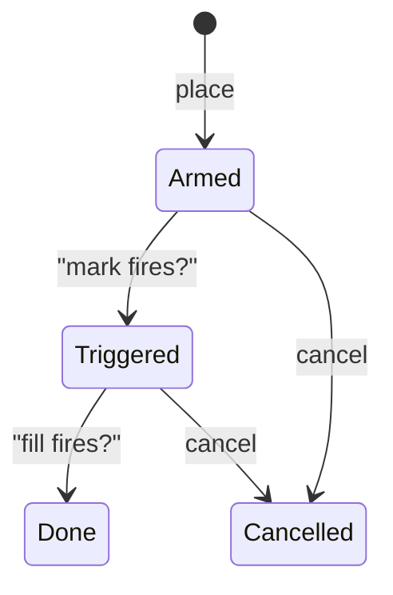
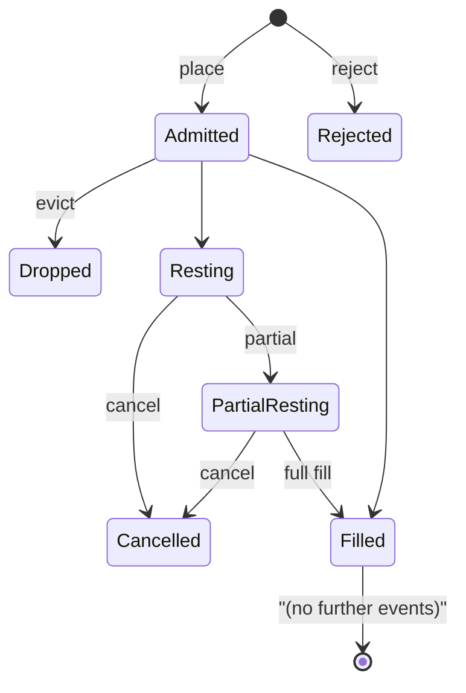

# Order types

This page describes the fields that set how an order behaves, and the order types that the node
runs over time.

:::tip
**Stable.**
:::

## Overview {#tldr}

MetaFlux has one perp order shape. It does not have a list of order types. You send
[`submit_order`](../api/rest/exchange/orders.md#submit_order), or
[`batch_order`](../api/rest/exchange/orders.md#batch_order) for many orders at once. Fields on the
order body select the behaviour:

| You want | Set this |
|----------|----------|
| Rest, take, or post-only | `tif` |
| A market order | `tif: "ioc"` at an extreme `limit_px` |
| Stop-loss / take-profit | a `trigger` block |
| Reduce-only | `reduce_only: true` |
| Self-trade behaviour | `stp_mode` |
| Entry + protective legs | `grouping` on `batch_order` |

None of these is a separate action.

Only four behaviours have their own action, because the node holds state for them or runs them
over time: [TWAP](#twap), [scale](#scale-orders), [chase](#chase-orders) and the spot book
([`spot_order`](../api/rest/exchange/spot.md#spot_order), a separate engine).

This page describes the fields. For the full request, see
[placing orders](../integration/placing-orders.md).

## Time-in-force {#time-in-force}

The wire field is `tif` on the order body. The values are lowercase.

| `tif` | Behaviour | Use when |
|-------|-----------|----------|
| `"gtc"` | Good-till-cancelled. The order rests on the book until it fills or you cancel it. | The default. Passive making and persistent quotes |
| `"ioc"` | Immediate-or-cancel. The order matches what is available and cancels any unfilled remainder. | Take liquidity now. Never rest on the book |
| `"alo"` | Add-limit-only ("post-only"). If any part of the order would cross the book, the chain cancels the whole order. | Strict maker. Never pay a taker fee |

```
Buy 1 BTC @ 100.5 gtc      →  rests on book, fills as ask reaches 100.5 or lower
Buy 1 BTC @ 100.5 ioc      →  immediately matches asks ≤ 100.5; cancels rest
Buy 1 BTC @ 100.5 alo      →  IF any ask ≤ 100.5  THEN reject  ELSE rest
```

:::warning
There is no fill-or-kill and no all-or-none. The matching engine has only the three values
above. The wire also parses `"aon"`, but the node rejects it. The node does not downgrade it to
`ioc`, because that would change execution semantics without notice. To approximate
fill-or-kill, send `ioc` and treat a partial fill as a failure in your own code.
:::

## Reduce-only {#reduce-only}

`reduce_only: true` rejects the order at admission if a fill would grow the absolute position
size. Use it for protective exits. A reduce-only stop-loss cannot flip you from long to short by
accident.

```
position: long 1 BTC
sell 0.5 reduce_only=true   →  ok (closes 0.5 of long)
sell 2.0 reduce_only=true   →  rejected: would flip to short 1
buy  0.5 reduce_only=true   →  rejected: would grow long to 1.5
```

The chain evaluates reduce-only at commit, not at admission, and reads the position from the
latest committed state. A fill that closes your position between admission and dispatch can
cause a commit-time `reduce_only_violation_post_admit` (see
[errors](../api/errors.md#commit-time-errors-not-http-in-event-stream)).

## Self-trade prevention {#self-trade-prevention}

Self-trade prevention (STP) acts when a new order would match an existing order from the same
account. The wire field is `stp_mode` on the order body. The values are lowercase.

| `stp_mode` | When new crosses old | When equal-priced both rest |
|------------|---------------------|-----------------------------|
| `"cancel_newest"` | New is cancelled | New is cancelled |
| `"cancel_oldest"` | Old is cancelled, new can match elsewhere | Old is cancelled, new rests |
| `"cancel_both"` | Both cancelled | Both cancelled |

`"cancel_newest"` is the default.

:::warning
There is no "off" mode. STP always acts. To make two of your own orders trade with each other,
use two different accounts.

The wire also parses `"reject"`, but the node rejects that value. The matching engine has a
fourth internal mode, decrement-and-cancel. `/exchange` cannot select it, because no wire value
maps to it. Do not build against it.
:::

STP runs at the match step, so it applies across side, price and time. STP groups orders by the
account that owns them. Orders that an agent places for a master account count as that master's
orders.

### Accounts that share one group {#stp-groups}

Two separate accounts can count as one party:

| The pair | When they share a group |
|---|---|
| A master and its sub-account | The sub-account was created with `shared_stp_group: true`. See [sub-accounts](./sub-accounts.md). |
| A Metaliquidity vault and its operator | Always, from the moment the vault's leader registers the operator with [`register_metaliquidity_operator`](../api/rest/exchange/vaults.md#register_metaliquidity_operator). |

The operator quotes for the vault and can also trade its own account. Those are two addresses,
so without the group the book would match one against the other. The shared group refuses that
match.

On an order from either side of a Metaliquidity pair, the node forces `stp_mode` to
`"cancel_oldest"`. It ignores the value you sign on those orders. The chain retires the resting
order, and your taker keeps walking the book. So a protective close still fills against other
makers.

A sub-account of a Metaliquidity operator shares the operator's group. `shared_stp_group` does
not turn that off. It applies to a master's own orders, not to this pair.

An account that approves an operator as its agent with `approve_agent` does not join the
operator's group. Only the vault's own registration creates the group.

## Triggers {#triggers}

A **trigger order** is a reduce-only protective leg. It parks off the book and fires when the
mark price crosses its `trigger_px`. A trigger always reduces a position. It can never open or
grow a position.

:::info
Market and limit triggers are live. `is_market` controls the exit: `is_market: true` fires a
market exit, and `is_market: false` rests a limit exit.
:::

The `tpsl` label names the intent. The fired direction comes from the leg `side` against the
mark, not from the label. An `ask` trigger closes a long. A `bid` trigger closes a short.

| `tpsl` | Protects | Fires when |
|--------|----------|-----------|
| `sl` (stop-loss) | a long | mark falls to `trigger_px` |
| `sl` (stop-loss) | a short | mark rises to `trigger_px` |
| `tp` (take-profit) | a long | mark rises to `trigger_px` |
| `tp` (take-profit) | a short | mark falls to `trigger_px` |

`is_market` selects the fired exit:

| `is_market` | On the mark cross |
|-------------|-------------------|
| `true` | Fire a reduce-only market exit: a slippage-bounded IOC, clamped to the size that reduces the position. The chain ignores `limit_px`. |
| `false` | Rest a reduce-only limit order at the order's `limit_px` (`limit_px > 0`, `tif: gtc`). It rests until it fills or you cancel it. |

A market trigger does not fire at `trigger_px`. It fires an IOC priced from the *risk mark*: the
mark price, clamped into a band around the oracle index. A second, governed slippage band then
widens that price:

```
risk_mark = clamp(committed_mark, oracle_px * (1 - oracle_band), oracle_px * (1 + oracle_band))

fired_limit_px = risk_mark + risk_mark * slippage_band   # closes a short: buy back, price ceiling
fired_limit_px = risk_mark - risk_mark * slippage_band   # closes a long: sell, price floor
```

- `oracle_band` defaults to 5% of the oracle index. Governance can change it per market. A
  committed mark that is already inside the band passes through unchanged. The clamp only pulls
  an outlier mark back toward the oracle. It never pushes a normal mark away from it.
- `slippage_band` defaults to 3% of the risk mark. Governance can change it chain-wide, and the
  change applies at once to stops that are already armed.
- Both steps round toward zero. The sell-side floor can never reach zero. It holds at the
  smallest positive price, even for an extreme band on a mark near zero.
- The leg does not fire while its market has no fresh oracle index (missing, or older than the
  staleness window). A stale oracle delays the fire. The chain does not price the exit from an
  unprotected last-trade print.

Worked example: a stop-loss that closes a long. BTC's oracle index reads `67000.00`. A print on a
thin book has pushed the committed mark to `71000.00`:

```
band       = 67000.00 * 0.05 = 3350.00
risk_mark  = clamp(71000.00, 67000.00 - 3350.00, 67000.00 + 3350.00)
           = clamp(71000.00, 63650.00, 70350.00)
           = 70350.00

slippage        = 70350.00 * 0.03 = 2110.50
fired_limit_px  = 70350.00 - 2110.50 = 68239.50
```

The fired IOC sells at `68239.50` or better. It never sells into the wash print at `71000.00`. It
never sells below `68239.50`, even if the book gaps below that.

`trigger_px` keeps every role for both variants: park price, fire direction and the mark cross.
For a limit trigger, `limit_px` is only the price of the resting order.

**OCO collapse.** Trigger legs grouped as OCO collapse when one fires. A market trigger and its
sibling collapse on the first fill. A limit trigger and its sibling collapse at conversion, which
is the moment the chain places the resting limit order. That limit order is then the protection.

**Trailing stops.** A trigger leg that carries `trail_px` parks a *trailing* stop. Once per
block, the stop level moves toward the mark by that callback offset. It never moves away from
the mark. So the stop fires at the moved level, not at the level you sent. Only the stop-loss
leg can trail. `trail_px` is part of the signed order, and sending it changes the EIP-712 type
string. Read
[trailing stops on `POST /exchange`](../api/rest/exchange/orders.md#trailing-stops) before you
build a write path.

The trigger state machine:


```mermaid
stateDiagram-v2
    [*] --> Armed: place
    Armed --> Triggered: "mark fires?"
    Triggered --> Done: "fill fires?"
    Armed --> Cancelled: cancel
    Triggered --> Cancelled: cancel
```

The chain evaluates triggers on every mark-price update, which is each commit. Triggers survive
across blocks and across restarts. See
[trigger orders on `POST /exchange`](../api/rest/exchange/orders.md#trigger-orders-stop_loss--take_profit)
for the wire fields.

## Grouping {#grouping}

`grouping` on [`batch_order`](../api/rest/exchange/orders.md#batch_order) links legs into a
family. It is the one camelCase corner of a wire that is otherwise snake_case.

| `grouping` | Meaning |
|------------|---------|
| `"na"` | Independent orders. This is the default. |
| `"normalTpsl"` | An entry leg plus its protective legs. The entry is index 0. When one protective leg fills, the chain cancels the other (OCO). |
| `"positionTpsl"` | Protective legs that attach to the position, not to an entry order. They survive position changes, for example when you average in. They cancel only when the position closes. |

Use `"positionTpsl"` to keep a stop on your net position at all times. The same protective legs
stay armed as you add to the position or reduce it.

## Scale orders {#scale-orders}

:::info
Live on the hosted sandbox and on mainnet. The feature is active from block 0 on chain `114514`
and on chain `8964`, with no vote and no activation height. A node you run yourself under the
default chain id `31337` must arm the feature by validator vote first.
:::

A **scale ladder** is `n` resting limit rungs, spread evenly across `[px_low, px_high]` on one
perpetual market. One signature places all of them. A spot pair is also accepted. See
[TWAP, scale and chase on a spot pair](#synth-on-spot). You sign a compact request with the
range, the rung count, the total size and a distribution. The node expands it into the rungs.
Every rung shares the one `cloid` you supply, which is the ladder handle.

```json
{
  "type": "scale_order",
  "params": {
    "market": 7, "side": "bid",
    "n": 5,
    "px_low": 9800000000, "px_high": 10000000000,
    "total_size": 500000000,
    "dist": "flat", "weights": [],
    "tif": "alo", "reduce_only": false,
    "stp_mode": "cancel_oldest",
    "cloid": "0x5c000000000000000000000000000001"
  }
}
```

The example above is the body for a one-way account. A [hedge-mode](./hedge-mode.md) account
must add `position_side` (`"long"` or `"short"`). A one-way account must omit it. If you get this
wrong, the chain rejects the ladder at commit, where nothing reports it. See
[`accepted` is not `committed`](../api/rest/exchange.md#accepted-is-not-committed).

Rung `0` is at `px_low` and rung `n − 1` is at `px_high`, for both sides. The distribution splits
`total_size` across the rungs:

| `dist` | Size across rungs |
|--------|-------------------|
| `flat` | Equal on every rung |
| `lin_asc` | Rises with rung index: smallest at `px_low`, largest at `px_high` |
| `lin_desc` | Falls with rung index: largest at `px_low`, smallest at `px_high` |
| `custom` | Your `weights` array (length `n`, each `≥ 1`). Send an empty array for any other `dist` |

`tif` is `alo` or `gtc`, because a ladder must rest. The chain rejects `ioc` / `aon`. Placement
is not all-or-nothing. Each rung runs the full order gate on its own, and the response echoes the
price, size and `oid` of every rung.

To cancel the whole ladder, send
[`cancel_scale`](../api/rest/exchange/orders.md#cancel_scale). One action cancels every resting
rung that carries the shared `cloid`, and it needs no `oid`. It does not sweep a parked trigger
leg that carries the same `cloid`, so keep trigger legs on their own handle. Use a new handle for
each ladder. The SDKs tag ladder handles with a `0x5c` prefix. See
[`scale_order` on `POST /exchange`](../api/rest/exchange/orders.md#scale_order) for the full
field table and admission rules.

## Chase orders {#chase-orders}

:::info
Live on the hosted sandbox and on mainnet, with the same gate as the scale ladder. The feature is
active from block 0 on chain `114514` and on chain `8964`. A node you run yourself under the
default chain id `31337` must arm the feature by validator vote first.
:::

A **chase order** is one resting post-only leg. The node re-prices it automatically to stay one
tick inside the top of the book. You sign one compact request: the market, side, size, a reprice
cadence, a time-to-live and a reprice budget. The node then keeps the leg pegged to the best
price, with no round trip from the client. The leg is post-only and always rests strictly inside
the spread. So a chase never takes liquidity and never pays a taker fee. A spot pair is also
accepted. See [TWAP, scale and chase on a spot pair](#synth-on-spot).

```json
{
  "type": "chase_order",
  "params": {
    "market": 7, "side": "bid",
    "size": 100000000,
    "cloid": "0x5c000000000000000000000000000002",
    "stp_mode": "cancel_oldest",
    "interval_blocks": 4,
    "ttl_ms": 3600000,
    "max_reprices": 500
  }
}
```

The example above is the body for a one-way account. A [hedge-mode](./hedge-mode.md) account
must add `position_side`. A one-way account must omit it. A chase has no `reduce_only`. Its leg
always opens or adds, so a chase cannot close a position.

The node pegs the leg one tick inside the touch. A buy chase sits one tick above the best bid. A
sell chase sits one tick below the best ask. The node re-prices the leg at most once per
`interval_blocks` committed blocks.

That touch is not the raw book. It skips every resting order that the engine would refuse to
fill for you: your own orders, and any order in your
[self-trade-prevention group](#stp-groups). So a chase pegs to the best price it can actually
trade against. That price can be behind the best price you see in `l2_book`. Without this rule,
a chase would track its own group's quote and walk the price against itself.

Each reprice cancels the old leg and places a new leg at the new price, under the same
re-stamped `cloid`. So track the leg across reprices by `cloid`, not by its `oid`.

The chase ends when `ttl_ms` elapses, when it reaches `max_reprices`, or when the leg fills or
another path cancels it. A partial fill keeps the chase running on the remaining size. The leg
pauses at its current price and retries later in three cases: a reprice that would cross the
book, a book too thin to peg against, or a halted market.

To cancel a chase, send [`cancel_chase`](../api/rest/exchange/orders.md#cancel_chase) with the
`chase_oid` handle that the placement returned. The handle is stable. The leg `oid` is not. No WS
channel is specific to chase orders. The placement and every reprice appear on the account
[`order_updates`](../api/ws/subscriptions.md#order_updates) and
[`open_orders`](../api/ws/subscriptions.md#open_orders) feeds, as an ordinary cancel plus a new
resting order. See [`chase_order` on `POST /exchange`](../api/rest/exchange/orders.md#chase_order)
for the full field table and admission rules.

## TWAP {#twap}

:::danger
A hedge account must send `position_side`. A one-way account must not send it. If you get this
wrong, the mempool admits the parent and then the chain rejects it at commit. No channel reports
the rejection, because the HTTP reply already said `accepted: true`. Read `position_mode` from
[`account_state`](../api/rest/info/account.md#account_state) before you submit. See
[`accepted` is not `committed`](../api/rest/exchange.md#accepted-is-not-committed).

The child slices of a hedge account inherit the leg that the parent names. A one-way account has
one net leg, so the chain refuses a leg name from it.
:::

A **TWAP** splits one parent order into `slice_count` equal child slices, fired `delay_ms` apart.
Each slice is an IOC that crosses the book for its share of the size. The node fires the slices.
The client has nothing to do after the chain accepts the parent. A spot pair is also accepted. See
[TWAP, scale and chase on a spot pair](#synth-on-spot).

[`twap_order`](../api/rest/exchange/orders.md#twap_order) carries six required fields (`market`,
`side`, `total_size`, `slice_count`, `delay_ms` and `reduce_only`) and two optional fields,
`position_side` and `randomize`.

You choose the schedule. There is no `duration` field and no USD-denominated size, so divide the
window yourself:

```
window       = 1 hour
slice every  = 60 seconds
slice_count  = 3,600 s / 60 s = 60
delay_ms     = 60000
total_size   = the full size, in raw lots
```

Two rules change what you get back:

- The chain clamps `delay_ms` up to the governed minimum (default `10000` ms). It does not reject
  a lower value. A `delay_ms` below the floor is accepted, and the TWAP runs slower than you
  asked. A 60-slice TWAP at `delay_ms: 1000` takes 10 minutes, not 1. The parent stores the
  clamped value, so a later parameter change does not affect it.
- `slice_count` has a governed ceiling (default `10000`). An account can hold a governed number
  of live parents at once (default `100`). The chain rejects a breach of either limit at commit.

By default the slice sizes are equal and the timing is fixed. So an observer who watches the tape
can predict the schedule. Send `randomize: true` to draw each slice size and each delay between
slices from a digest over committed inputs. The draw is deterministic: every validator draws the
same numbers. The sizes still sum to `total_size`. `randomize: true` selects its own signing
string, so sign the payload you send.

Slice fills appear on the
[`user_twap_slice_fills`](../api/ws/subscriptions.md#user_twap_slice_fills) WS channel. Parent
lifecycle transitions (activated / finished / terminated) appear on
[`user_twap_history`](../api/ws/subscriptions.md#user_twap_history). That channel is where the
`twapId` first appears.

You can cancel a TWAP during its run with
[`twap_cancel`](../api/rest/exchange/orders.md#twap_cancel). Slices that already filled stay
filled. Future slices stop.

## TWAP, scale and chase on a spot pair {#synth-on-spot}

:::info
Live. `twap_order`, `scale_order` and `chase_order` accept a spot pair id in `market`. The order
runs on the spot book under the rules below.
:::

On all three actions, `market` accepts a spot pair id, and the order runs on the spot book. Perp
behaviour does not change.

Every leg runs the ordinary spot order path. The spot kill switch, the pair's price and size
grid, the resting-order cap, the affordability clamp and the escrow reserve all apply. They apply
exactly as they do to a `spot_order` you send yourself.

### Perp fields on a spot pair {#synth-on-spot-drops}

Spot has no position, no margin and no leverage. It moves balances you already hold. So the
concepts that a perp leg carries do not carry over:

| Perp concept | On a spot pair |
|---|---|
| `position_side` | Refused on all three, with `spot has no position side`. There is no position to name |
| `reduce_only` | Refused on `twap_order` and `scale_order` when `true`, with `spot has no position to reduce: reduce_only is not supported`. `chase_order` has no such field |
| `randomize` | Refused on `twap_order` when `true`, with `spot twap does not support randomize`. A drawn size cannot be quoted again against the escrow reserve. `scale_order` and `chase_order` have no such field |
| Margin, leverage, open-interest caps | Do not apply. Your free balance and the escrow reserve bound the order |
| The hedge-account leg rule | Does not apply. It governs perp legs, which carry a leg name. A spot leg carries none |

Each of the three is a refusal. The chain does not drop the field silently. It rejects the whole
action and places nothing. To drop a field you signed would execute an order you did not sign, so
the chain refuses. Clear the field, then sign again.

One live-parent budget covers both homes. The governed cap on live TWAP parents (default `100`)
counts your perp parents and your spot parents together. It is one allowance per account, not
one per market class.

[`twap_cancel`](../api/rest/exchange/orders.md#twap_cancel) takes the id of a spot parent with no
change to the wire. The chain looks up the id in both homes, so one cancel path covers both.

### Per type {#synth-on-spot-per-type}

**Spot TWAP.** A spot TWAP fires each slice as an IOC on the spot book, under your own account.
The slice price does not come from the book's touch. It comes from a reference mark: the base
token's committed oracle index or, for a pair with no fresh index, the book's last trade price.
The chain widens the mark by the governed slippage allowance (up for a buy, down for a sell). It
then snaps the price back onto the pair's tick grid toward the mark. So the snap can only make the
order less aggressive, never more. Slice fills carry the parent's `twapId` on
[`user_twap_slice_fills`](../api/ws/subscriptions.md#user_twap_slice_fills).

Two admission refusals size your parent. Both look at one slice, not at the total. One rule is
behind both. A slice that the fire path cannot place still uses its turn. So a parent whose every
slice cannot be placed uses its whole schedule and fills nothing. The chain refuses that parent at
admission instead.

| Refusal | When |
|---|---|
| `slice below one lot` | `total_size / slice_count` floors to zero lots on the pair's lot grid. The executor floors every slice to that grid, so each slice would do nothing |
| `below min notional` | The pair carries a `min_notional_cents` floor, and one slice, priced at the reference mark, is worth less than it. A total that clears the floor does not help, because the fire path checks each slice, not the parent |

The chain also refuses a parent on a pair that carries a min-notional floor and has no reference
mark at all, with `no mark price for spot twap admission`. The check is required, and nothing can
price it. Raise `total_size` or lower `slice_count`, and sign again.

One risk remains after admission. Governance can change `min_notional_cents`, and the price can
drift, after the chain accepts your parent. The chain refuses a slice that then falls below the
floor at fire time, and the schedule still advances.

Build for three different outcomes:

- **No reference mark.** The pair has no oracle index, and no trade ever printed on it. The slice
  parks: it does not fire, and it does not count. The schedule waits for a price. It does not use
  a slice against a price that does not exist.
- **A mark, but nothing rests inside the band.** The slice fires, fills nothing, and the schedule
  advances. That slice is spent. A spot TWAP under-fills and does not stall, so read the fills,
  never the parent status.
- **A remainder smaller than one lot.** The parent ends there. The chain does not carry a
  remainder that the grid cannot express.

A parent that ends with no fill reports `terminated` on
[`user_twap_history`](../api/ws/subscriptions.md#user_twap_history). A parent with any fill
reports `finished`.

A slice is a self-trade risk on your own pair. Each slice runs with self-trade prevention set to
cancel-oldest. If a slice would cross your own resting order on that pair, the chain cancels your
older order. Keep a maker book and a TWAP on the same pair apart.

**Spot chase.** A spot chase pegs one post-only leg one tick inside the touch. It re-prices the
leg on the same cadence as a perp chase. Two outcomes apply to spot only:

- A reprice that needs more quote balance than you have free is skipped. The chain does not
  cancel the leg. The leg stays at its current price, and the chase tries again on the next
  interval. Only a buy chase can hit this. A sell chase reserves base, and its reserve does not
  grow when the price moves.
- If the new placement fails, the chase retires. The escrow is already refunded, so nothing is
  stranded. But the leg is gone, and the chain does not restore it.

**Spot scale.** A spot scale floors every rung price onto the pair's tick grid and every rung size
onto its lot grid. Each rung runs the spot admission on its own, so a rejected rung does not stop
the ladder. The other rungs still rest.
[`cancel_scale`](../api/rest/exchange/orders.md#cancel_scale) then cancels every resting spot
order on that pair that carries the shared `cloid`. That includes an ordinary `spot_order` that
you sent under the same handle, so use a new handle for each ladder.

### Halted spot pairs {#synth-on-spot-halt}

A spot pair stops trading in two ways: the pair is delisted or deactivated, or governance turns
on the global spot kill switch. Both have the same effect on a TWAP or a chase in progress.

| What | Behaviour during the halt |
|---|---|
| A TWAP parent | Paused. No slice fires. `slices_done`, the filled size and the schedule clock all freeze |
| A chase entry and its resting leg | Retained. No reprice runs, the reprice count does not change, and the leg stays on the book |
| The chase leg's escrow | Stays locked. A halt does not refund it. The chain cancels and refunds the resting orders of third parties on the pair. A chase leg is exempt |
| Scale rungs | Cancelled and refunded like any other resting order. A scale keeps no parent, so there is nothing to pause |
| A new `twap_order` / `scale_order` / `chase_order` on the pair | Refused, with `spot trading disabled` for the global switch and `spot pair inactive` for the pair |

Resume is automatic. When the halt ends, the frozen schedule clock makes the next TWAP slice due
at once, and the chase re-prices on its next pass. The parent continues from where it stopped.

Your escrow is never trapped. Spot cancels are not gated at any halt, and
[`cancel_chase`](../api/rest/exchange/orders.md#cancel_chase) and
[`twap_cancel`](../api/rest/exchange/orders.md#twap_cancel) both work during it. A chase whose
`ttl_ms` or `max_reprices` runs out during a halt still retires and refunds as normal. That is
ordinary expiry, not a halt refund.

A pair that is delisted permanently leaves its parents paused with no end. The chain keeps them
and does not cancel them. Cancel them yourself if you do not want them.

## Market orders {#market-orders}

There is no market action and no market order type. A market order is an `ioc` limit order at an
extreme `limit_px`: a very high price to buy, or `0` to sell. The book matches the liquidity that
exists and cancels the remainder that does not cross.

The order body also accepts `kind: "market"`. It is only a label. The matching engine has no
order kind, so `"market"` and `"limit"` behave the same. Your `limit_px` and `tif` set the
behaviour. If you send `kind: "market"` with `tif: "gtc"`, the order rests as a normal limit
order.

No mark-price band caps a market order that you send. The book fills every level priced at or
inside your `limit_px`, however far past the mark that is. There is no ceiling at
`mark × (1 + band_pct)`, and no partial fill that stops at a band edge. The bands on
[mark prices](./mark-prices.md) shape the mark, not the price you pay.

The `mark ∓ band` price [above](#triggers) belongs to a fired market trigger, which the node
prices for you. A market order that you send yourself carries only the `limit_px` you signed. Set
it with care.

One rule relative to the mark does exist, and it rejects the order instead of trimming it. While a
market is at its [open-interest cap](./contract-specifications.md#order--position-limits), the
chain refuses an order priced through the mark on the side that increases the position. It
refuses the whole order, before any fill.

### Fill price bound {#bounding-the-fill-price}

Your own `limit_px` is the price bound that the book enforces on a market or IOC order. A buy
fills every ask at or below `limit_px`. A sell fills every bid at or above it. Both fill the best
price first. For a protected market order, set `limit_px` to the worst price you accept. An
extreme `limit_px` accepts any price the book offers, with no other ceiling or floor.

```
buy IOC:  fills asks with price <= limit_px, best (lowest) price first
sell IOC: fills bids with price >= limit_px, best (highest) price first
worst_fill_price = the price of the last (deepest) level the order reaches
```

Each level fills at its own resting price. The chain never blends the levels into one fill price.
To predict your worst price before you send the order, read the order book and walk it from the
touch outward. Add up size until you cover your order size or run out of depth priced at or
inside your `limit_px`.

Worked example: buy 2.5 BTC, `tif: "ioc"`, `limit_px: 68000.00`. The order book read shows:

| Ask price | Size |
|-----------|------|
| 67010.00 | 1.0 |
| 67025.50 | 1.0 |
| 67040.00 | 1.2 |
| 67600.00 | 3.0 |

```
level 1: 67010.00 x 1.0  -> filled 1.0, remaining 1.5
level 2: 67025.50 x 1.0  -> filled 1.0, remaining 0.5
level 3: 67040.00 x 1.2  -> crosses (67040.00 <= 68000.00); take 0.5, remaining 0

worst_fill_price   = 67040.00
filled_size        = 2.5
average_fill_price = (1.0*67010.00 + 1.0*67025.50 + 0.5*67040.00) / 2.5 = 67022.20
```

If you lower `limit_px` to `67030.00`, the third level no longer crosses. Then 2.0 BTC fills, and
the chain cancels the unfilled 0.5 BTC, because an IOC never rests the remainder. Depth beyond
`limit_px` never counts toward your fill, however deep the book is.

Edge cases:

- **Thin book.** The depth at or inside `limit_px` is less than your order size. The order fills
  the depth that exists and cancels the rest. This is the ordinary IOC outcome, not an error.
- **Empty or fully crossed-out book.** No level crosses `limit_px`. The order fills nothing and
  is cancelled in full.
- **Zero size.** The chain rejects the order before it reaches the book.

## Order lifecycle state machine {#order-lifecycle-state-machine}


```mermaid
stateDiagram-v2
    [*] --> Admitted: place
    [*] --> Rejected: reject
    Admitted --> Dropped: evict
    Admitted --> Resting
    Admitted --> Filled
    Resting --> Cancelled: cancel
    Resting --> PartialResting: partial
    PartialResting --> Cancelled: cancel
    PartialResting --> Filled: full fill
    Filled --> [*]: "(no further events)"
```

Each state transition emits an event on
[`order_updates`](../api/ws/subscriptions.md#order_updates), the order-lifecycle channel.

## Edge cases {#edge-cases}

<details>
<summary>Show edge cases</summary>

- **Reduce-only race with a fill.** A stop is reduce-only. A fill closes the position, then the
  stop fires, and the commit-time check fails with `reduce_only_violation_post_admit`. To handle
  this, feed [`fills`](../api/ws/subscriptions.md#fills) events back into your bot, and cancel the
  protective legs when the position closes fully.
- **STP at admission and at match.** The chain enforces STP only at the match step. Two
  opposite-side orders that do not cross both rest. STP acts only when they would actually trade.
- **TWAP in volatile markets.** Each slice is an IOC near mid. If liquidity dries up between
  slices, a slice can return with no fill. Watch the slice events.
- **ALO and a crossing book.** The chain rejects an ALO order that would cross any level. It
  rejects the whole order, not part of it. To join the book at a tight price, use a non-crossing
  limit order one tick worse than the best opposite price.
- **Triggers and TIF.** On trigger, a `stop_loss` leg with `is_market: false` rests a `gtc` limit
  order at its `limit_px`. For a sliced exit, build a TWAP-like spray yourself.

</details>

## TypeScript examples {#examples--typescript}

`placeOrder` is the one entry point. Pass one leg or many. Each leg tags its venue, and the SDK
picks the wire action. Perp legs go in one `batch_order`. Each spot leg goes in its own
`spot_order`.

```typescript
// One post-only limit buy. `venue` selects the perp book.
await client.placeOrder({
  venue: 'perp',
  owner: '0x<your account>',
  market: 0, side: 'bid', kind: 'limit',
  size: 10000n, limit_px: 5000000000000n,
  tif: 'alo', stp_mode: 'cancel_newest', reduce_only: false,
  cloid: '0x0000000000000000000000000000ab01',
});

// A two-sided quote. Both legs ride ONE batch_order and ONE signature.
await client.placeOrder([
  { venue: 'perp', owner: '0x…', market: 0, side: 'bid', kind: 'limit',
    size: 10000n, limit_px: 4990000000000n,
    tif: 'gtc', stp_mode: 'cancel_oldest', reduce_only: false },
  { venue: 'perp', owner: '0x…', market: 0, side: 'ask', kind: 'limit',
    size: 10000n, limit_px: 5010000000000n,
    tif: 'gtc', stp_mode: 'cancel_oldest', reduce_only: false },
]);

// A stop-loss is the same call with a trigger block. It is not a separate type.
await client.placeOrder({
  venue: 'perp',
  owner: '0x<your account>',
  market: 0, side: 'ask', kind: 'stop_loss',
  size: 10000n, limit_px: 0n,
  tif: 'gtc', stp_mode: 'cancel_newest', reduce_only: true,
  trigger: { trigger_px: 4750000000000n, is_market: true, tpsl: 'sl' },
});

// A spot leg. Same call, different venue tag and a `pair` id.
await client.placeOrder({
  venue: 'spot',
  pair: 110, side: 'bid',
  size: 10000n, limit_px: 5000000000000n,
  tif: 'gtc', stp_mode: 'cancel_oldest',
  cloid: '0x0000000000000000000000000000ab02',
});
```

The four stateful behaviours keep their own methods, because the node runs them for you:

```typescript
await client.twapOrder({ /* … */ });   // sliced over time
await client.placeScale({ /* … */ });  // N rungs from one signature
await client.placeChase({ /* … */ });  // node re-prices to the touch
```

:::warning
A spot leg is not atomic with a perp leg. The wire cannot batch spot, so N spot legs become N
actions with N signatures and N nonces. Some can rest while others fail. `placeOrder` returns one
`submissions` entry for each spot action. Read every entry.
:::

## See also {#see-also}

- [`POST /exchange`](../api/rest/exchange.md): the full schema of each variant
- [Margin modes](./margin-modes.md)
- [Mark prices](./mark-prices.md): how triggers fire
- [Tiered liquidation](./tiered-liquidation.md): how the chain manages positions under stress

## FAQ {#faq}

<details>
<summary>Show FAQ</summary>

**Q: Does an ALO order ever pay a taker fee?**
A: Never. If it would cross, the chain rejects the whole order at admission. There is no partial
taker fill.

**Q: Can one `batch_order` mix TIFs?**
A: Yes. The entries in `orders: []` can differ, and each entry has its own `tif`.

**Q: How does the matching engine break ties at the same price?**
A: Strict FIFO: the earliest `oid` wins. ALO orders gain priority by resting on the book first.
That is their natural fee-rebate advantage.

**Q: Do TWAP slices count against my rate limit?**
A: No. The protocol submits them internally, not your client. The `twap_order` submission is one
rate-limit charge.

</details>
