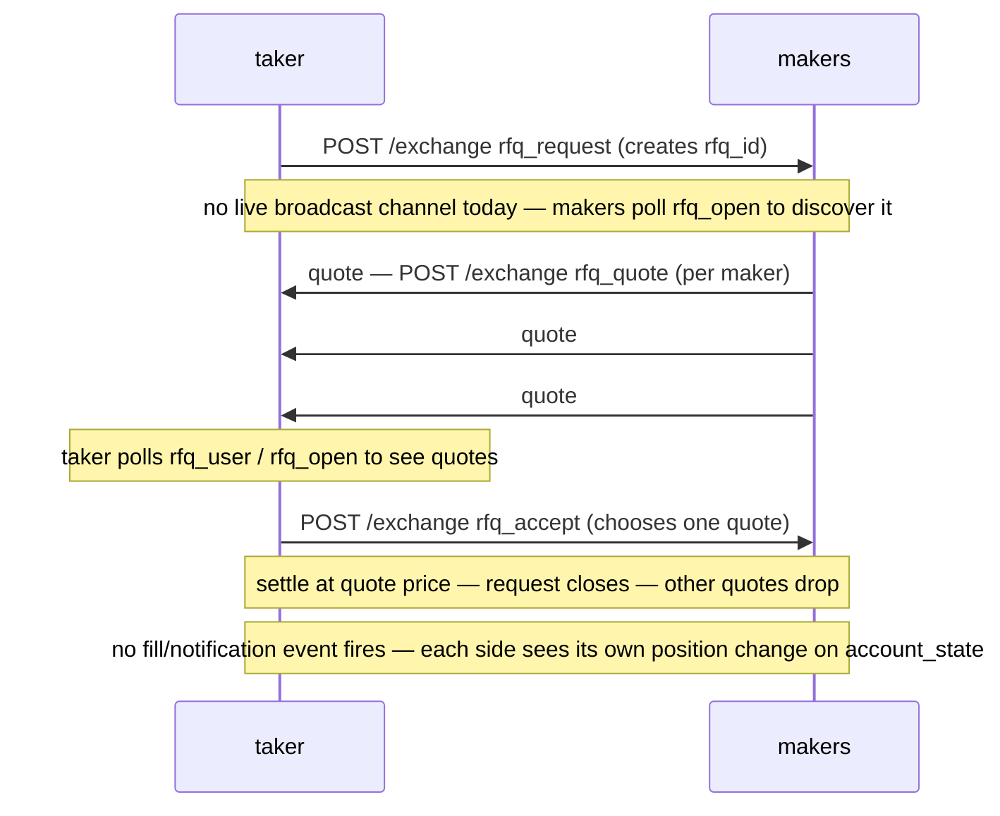

# Request-for-quote (RFQ)

:::info
**Preview.**
:::

## TL;DR {#tldr}

RFQ lets a taker request a private quote on a specific size from market makers, accept the best, and settle at that price — without exposing the size on the public book first. Useful for sizes that would move the visible book.

## Why RFQ {#why-rfq}

Public CLOB execution leaks intent. A $5M order on a thin asset signals everything before the first fill clears. RFQ flips the model:

- **Taker** publishes an RFQ for asset, side, size, optional reference price.
- **Makers** (any account — there is no registration or per-asset opt-in) respond with quotes within a window (typically 1–5 seconds).
- **Taker** accepts the best quote → atomic settlement at that price; the rest of the quotes expire.

Quotes are visible to the taker only (not on the public book). An accepted RFQ settles **off** the public trade tape today: it does not appear on [`trades`](../api/ws/subscriptions.md#trades), [`fills`](../api/ws/subscriptions.md#fills), or `user_events`, and carries no distinguishing tag anywhere. The only ways to observe one live are the [`rfq_open`](#querying-open-rfqs) / [`rfq_user`](#querying-open-rfqs) reads, or the resulting position change on your own [`account_state`](../api/ws/subscriptions.md#account_state).

## Lifecycle {#lifecycle}



## Action flow {#action-flow}

The three actions are fully specified in the [`/exchange` action catalog](../api/rest/exchange.md#rfq-fba--utility-actions) — this section is a conceptual walkthrough; follow the links for the full field tables and EIP-712 typed-data primary types.

### Taker — request an RFQ {#taker--request-an-rfq}

[`rfq_request`](../api/rest/exchange.md#rfq_request):

```json
{
  "type": "rfq_request",
  "params": {
    "market":    0,
    "side":      "Bid",
    "size":      100000000,
    "limit_px":  10050000000,
    "expiry_ms": 1735689605000
  }
}
```

`size` / `limit_px` are raw `u64` **numbers** on the 1e8 plane, not decimal
strings. `side` is `"Bid"` / `"Ask"` (capitalized — unlike a perp order
body's lowercase `"bid"`/`"ask"`). `limit_px` is optional (the taker's own
worst-acceptable price); `expiry_ms` is an absolute consensus-ms deadline,
not a duration.

This action returns the standard [`202 Accepted`](../api/rest/exchange.md#202-accepted--non-order-admission)
admission envelope — the assigned `rfq_id` is **not** in that response. It is
a committed effect: read it back from [`rfq_user`](#querying-open-rfqs) (your
own `requested` list) once the block commits.

There is no live broadcast channel for a new RFQ today — a maker discovers it by polling [`rfq_open`](#querying-open-rfqs).

### Maker — submit a quote {#maker--submit-a-quote}

[`rfq_quote`](../api/rest/exchange.md#rfq_quote):

```json
{
  "type": "rfq_quote",
  "params": {
    "rfq_id":         9,
    "price":          10049000000,
    "max_size":       100000000,
    "valid_until_ms": 1735690000000
  }
}
```

`rfq_id` is the numeric session id from [`rfq_open`](#querying-open-rfqs) —
not a hex string. A maker can submit multiple quotes (e.g. at different
prices) over the RFQ's lifetime; each is appended to the session's quote
list and identified only by its **position in that list** (`quote_idx`) —
there is no separate hex quote id.

### Taker — accept {#taker--accept}

[`rfq_accept`](../api/rest/exchange.md#rfq_accept):

```json
{
  "type": "rfq_accept",
  "params": { "rfq_id": 9, "quote_idx": 0, "size": 100000000 }
}
```

`quote_idx` is the accepted quote's index in the session's quote list (from
[`rfq_open`](#querying-open-rfqs) / [`rfq_user`](#querying-open-rfqs)), not a
hex id. `size` lets the taker accept less than the quote's full `max_size`.

Settlement is atomic in the next block:
- Taker's position grows by `size` at the quote's `price`.
- Maker's position grows by `size` opposite-side at the same price.
- Other quotes for this `rfq_id` expire.
- Fee structure: same maker/taker tiers as a public-book fill ([fees](./fees.md)).

### Auto-expire {#auto-expire}

There is **no active expiry sweep** — an expired request is not removed or
announced on its own. Expiry is enforced lazily: an `rfq_quote` or
`rfq_accept` against a request whose `expiry_ms` has elapsed is rejected
(`{"error":"request expired"}` / `{"error":"quote expired"}`), and no event
fires. No charge on expiry either way. A stale, never-accepted request can
still appear in [`rfq_open`](#querying-open-rfqs) until it is evicted by the
per-requester / global open-request cap or superseded by a fresh request.

## Maker registration {#maker-registration}

There is **no maker-registration action** — `rfq_quote` requires no prior
opt-in and no per-asset eligibility check. Any account can append a quote to
any open request it discovers by polling [`rfq_open`](#querying-open-rfqs);
the request itself carries no allow-list.

## Settlement semantics {#settlement-semantics}

| Property | RFQ fill |
|----------|----------|
| Price | The accepted quote's `price`, regardless of public book |
| Counter-party | One maker only (the chosen quote's signer) |
| Book impact | None — the trade does not match against resting orders |
| Public visibility | None today — it does not appear on the public trade tape, `fills`, or `user_events` |
| Fees | Standard maker/taker per fee schedule |
| Margin | Same as a regular fill (`init_margin` debited from both sides) |
| Liquidation | Same — the position becomes a regular position post-settle |

## What RFQ doesn't do {#what-rfq-doesnt-do}

- **Doesn't bypass margin.** Taker must have margin for the position; failure to admit due to insufficient margin returns a normal `422`.
- **Doesn't appear on the public tape.** Unlike a book fill, an RFQ settlement carries no public trade-tape record today — see [above](#why-rfq) for what IS live: the `rfq_open` / `rfq_user` reads and your own `account_state`.
- **Not Dutch-auction.** Quotes don't decay; makers submit fixed-price quotes; taker picks one.
- **Not multi-maker fill.** A single RFQ accept matches one maker's quote in full. To split across makers, run multiple RFQs.

## Querying open RFQs {#querying-open-rfqs}

The RFQ engine state is exposed on the node `/info` read path via two query
types — see [`rfq_open`](../api/rest/info.md#rfq_open) and
[`rfq_user`](../api/rest/info.md#rfq_user) for the full response shapes and field
tables. Unlike the write-side actions above, `sz` / `price` / `max_size` /
`limit_px` on these reads are **human decimal strings**, tick/lot-normalized —
not the raw 1e8 plane `rfq_request` / `rfq_quote` / `rfq_accept` take.

`rfq_open` takes **no parameters** and returns every open RFQ request joined to
its maker quotes:

```bash
curl -X POST https://api.devnet.mtf.exchange/info \
  -H 'content-type: application/json' \
  -d '{"type":"rfq_open"}'
```

For RFQs a specific account is party to, `rfq_user` takes `address` (0x hex) and
splits the result into `requested` (RFQs the account opened) and `quoted` (RFQs
it quoted on):

```bash
curl -X POST https://api.devnet.mtf.exchange/info \
  -H 'content-type: application/json' \
  -d '{"type":"rfq_user","address":"0x..."}'
```

An account party to nothing returns a 200 with both lists empty.

## Edge cases {#edge-cases}

<details>
<summary>Show edge cases</summary>

- **Multiple quotes from same maker.** Allowed; taker picks the best.
- **Maker quote arrives after taker accepts.** Quote is silently dropped; no error.
- **RFQ expires while taker is signing accept.** Accept returns `{"error":"rfq expired"}`. Retry with a fresh `rfq_request`.
- **Taker account ineligible at accept time.** If the taker's account moves to T1+ between request and accept, accept is rejected. Maker keeps the right to quote on future RFQs.
- **Maker insufficient margin at accept time.** Accept rejected with `{"error":"maker margin"}`. Taker can try a different quote from the same RFQ.

</details>

## Sequence — accepted RFQ {#sequence--accepted-rfq}

```mermaid
sequenceDiagram
    participant taker
    participant makerA as "maker A"
    participant makerB as "maker B"
    participant makerC as "maker C"
    Note over taker: taker sends rfq_request, expiry_ms 5000ms out
    Note over taker,makerC: request commits — makers discover rfq_id by polling rfq_open
    makerA->>taker: quotes 10049
    makerB->>taker: quotes 10048 (best)
    makerC->>taker: quotes 10050
    Note over taker: taker sees the three quotes, picks B
    taker->>makerB: commits rfq_accept — settles 10000000000 @ 10048
    Note over taker,makerC: taker fills long 100 @ 10048 — maker B fills short 100 @ 10048 — quotes from A, C expire — no public trade-tape record; both sides see it on their own account_state
```

Order shown top-to-bottom is the only guarantee — how long a maker takes to
quote, and how long a commit takes, both depend on network and chain
conditions and are not fixed durations.

## See also {#see-also}

- [Order types](./order-types.md) — public-book alternatives
- [`/exchange` action catalog](../api/rest/exchange.md#rfq-fba--utility-actions) — `rfq_request` / `rfq_quote` / `rfq_accept` full parameter tables
- There is no live WS channel for RFQ events today — poll [`rfq_open`](#querying-open-rfqs) / [`rfq_user`](#querying-open-rfqs), or watch your own [`account_state`](../api/ws/subscriptions.md#account_state) for the resulting position change
- [Fees](./fees.md) — RFQ fills are taxed at the standard tier

## FAQ {#faq}

<details>
<summary>Show FAQ</summary>

**Q: Why not just place a hidden order on the book?**
A: Hidden orders still leak through fills. RFQ doesn't post anywhere — the size is invisible until settlement.

**Q: Can RFQ quotes be cancelled?**
A: No. There is no cancel-quote action — quotes are append-only for the life of the request. A quote lapses on its own `valid_until_ms`, or when the request closes (accepted, evicted under the open-request cap, or its own `expiry_ms` elapses).

**Q: Is there an RFQ-fill-only matching algorithm I should be aware of?**
A: No — once the taker accepts, settlement is direct between taker and the chosen maker. The CLOB engine is not involved.

**Q: Can a market without much CLOB liquidity still have an RFQ market?**
A: Yes — any account can quote on any market, regardless of book depth. RFQ is particularly useful for thin / long-tail assets where the public book can't absorb size.

</details>
