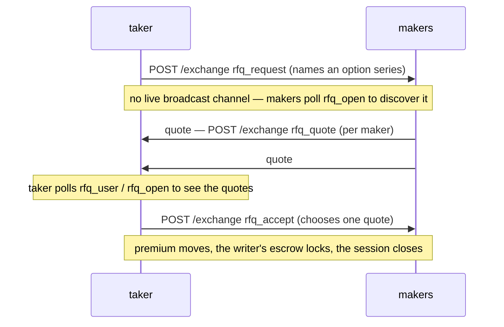

# Request-for-quote (RFQ)

## TL;DR {#tldr}

RFQ is the **option trade path**. A taker asks for a quote on one
[option series](../products/options.md), makers answer with a premium, and the
taker accepts one quote. The fill settles directly between the two accounts.

**RFQ clears options and nothing else.** All three actions refuse any market that
is not a live option series. There is no RFQ on perpetuals and none on spot.

## Why the lane is options-only {#why-rfq}

A request-for-quote lane beside a public order book is not fair to that book: it
lets size trade away from the price everyone else is posting against. MetaFlux
therefore offers RFQ only where there is no continuous book to undercut.

Options have no book. The chain never prices an option and never needs an implied
volatility, so the premium has to come from a negotiation between two accounts.
RFQ is that negotiation.

The refusal on every other market is exact:

```
precondition failed: rfq is options-only: market <n> is not an option series
```

## Lifecycle {#lifecycle}



## Action flow {#action-flow}

The three actions are fully specified in the
[`/exchange` action catalog](../api/rest/exchange.md#rfq-fba--utility-actions) —
this section is a conceptual walkthrough. Follow the links for the full field
tables and the EIP-712 typed-data primary types.

### Taker — request a quote {#taker--request-an-rfq}

[`rfq_request`](../api/rest/exchange.md#rfq_request):

```json
{
  "type": "rfq_request",
  "params": {
    "market":    2147483649,
    "side":      "Bid",
    "size":      100000,
    "limit_px":  250000000,
    "expiry_ms": 1735689605000
  }
}
```

`market` is the `signing_id` of a live series, from
[`option_series`](../api/rest/info.md#option_series). **Serve it, never compute
it** — the encoding behind the number is internal.

`size` / `limit_px` are raw `u64` **numbers**, not decimal strings. `size` is on
the series' `10^sz_decimals` plane; `limit_px` is a premium per whole unit on the
1e8 plane. `side` is `"Bid"` / `"Ask"`, capitalized — unlike a perp order body's
lowercase `"bid"` / `"ask"`. `"Bid"` buys the option; `"Ask"` writes it.

`limit_px` is optional. When it is present the chain proves at once that the
taker can carry the worst case, and refuses with `insufficient free collateral
for the request` when it cannot. `expiry_ms` is an absolute consensus-ms stamp,
not a duration.

This action returns the standard
[`202 Accepted`](../api/rest/exchange.md#202-accepted--non-order-admission)
admission envelope. The assigned `rfq_id` is **not** in that response. It is a
committed effect: read it back from [`rfq_user`](#querying-open-rfqs).

### Maker — submit a quote {#maker--submit-a-quote}

[`rfq_quote`](../api/rest/exchange.md#rfq_quote):

```json
{
  "type": "rfq_quote",
  "params": {
    "rfq_id":         9,
    "price":          249000000,
    "max_size":       100000,
    "valid_until_ms": 1735690000000
  }
}
```

`price` is the premium per whole unit. `rfq_id` is the numeric session id from
[`rfq_open`](#querying-open-rfqs) — not a hex string. A maker can submit several
quotes over the session's life; each is appended to the session's quote list and
is identified only by its **position in that list** (`quote_idx`). There is no
separate quote id, and there is no cancel-quote action.

### Taker — accept {#taker--accept}

[`rfq_accept`](../api/rest/exchange.md#rfq_accept):

```json
{
  "type": "rfq_accept",
  "params": { "rfq_id": 9, "quote_idx": 0, "size": 100000 }
}
```

`size` lets the taker accept less than the quote's `max_size`. The accept is
honored only for the account that opened the session.

## What a fill settles {#settlement-semantics}

An option fill moves three amounts and nothing else.

| Property | RFQ option fill |
|----------|-----------------|
| Premium | Quoted `price` × whole units, from the buyer to the writer, truncated toward zero to micro-USDC |
| Escrow | [`escrow_per_unit`](../api/rest/info.md#option_series) × whole units, from the writer's balance into the series pot |
| Closing | A closing writer's escrow leaves the pot **exactly**. Each account's own legs net first |
| Counter-party | One maker only — the chosen quote's signer |
| Book impact | None. The trade matches against no resting order |
| Fees | The TAKER pays; the quoting maker has no fee leg. See [the option fee](../products/options.md#option-fee) |
| Margin | **None.** The buyer paid the premium; the writer locked the worst case |
| Liquidation | **Impossible.** Both sides are fully funded at the fill |
| Public visibility | None. It is not on the public trade tape or `fills` |

At expiry the chain settles the series from a price window and pays from the
series pot. Settlement can defer, and past a bound it can abandon — read
[settlement](../products/options.md#settlement) before writing an option.

## Expiry of a session {#auto-expire}

There is **no expiry sweep**. An expired request is not removed and not
announced. Expiry is enforced lazily: an `rfq_quote` or `rfq_accept` against a
session past its `expiry_ms` is refused with `precondition failed: request
expired`, and a quote past its own `valid_until_ms` with `precondition failed:
quote expired`. Nothing is charged either way. A stale session stays visible on
[`rfq_open`](#querying-open-rfqs) until the open-request cap evicts it.

## Maker registration {#maker-registration}

There is **no maker-registration action**. `rfq_quote` needs no opt-in and no
per-series eligibility check. Any account can append a quote to any open session
it can see.

## What RFQ does not do {#what-rfq-doesnt-do}

- **It does not trade perpetuals or spot.** Every non-option market is refused.
- **It does not appear on the public tape.** An RFQ fill carries no trade-tape
  record and no `fills` event.
- **It is not a Dutch auction.** Quotes do not decay. Makers post fixed premiums
  and the taker picks one.
- **It is not a multi-maker fill.** One accept takes one maker's quote. To split
  across makers, run several sessions.

## Querying open sessions {#querying-open-rfqs}

The RFQ engine state is on the node `/info` read path as two query types,
`rfq_open` and `rfq_user`.

Both are public. **No WS channel carries an RFQ event**, so a taker polls for
its quotes and a maker polls for requests to answer.

Unlike the write actions, `sz` / `price` / `max_size` / `limit_px` on these reads
are **decimal strings**, not the raw plane the actions take, and the sizes render
on the series' own scale — whole units, already divided.

Each row carries `signing_id`, the number an action puts in `market`, and
`underlying`, the symbol the series settles against. There is no `coin` field: a
session names an option series, and a series is not a coin.

`rfq_open` takes **no parameters** and returns every open session joined to its
quotes:

```bash
curl -X POST https://api.devnet.mtf.exchange/info \
  -H 'content-type: application/json' \
  -d '{"type":"rfq_open"}'
```

`rfq_user` takes `address` (0x hex) and splits the result into `requested`
(sessions the account opened) and `quoted` (sessions it quoted on):

```bash
curl -X POST https://api.devnet.mtf.exchange/info \
  -H 'content-type: application/json' \
  -d '{"type":"rfq_user","address":"0x..."}'
```

An account party to nothing returns a 200 with both lists empty.

## Edge cases {#edge-cases}

<details>
<summary>Show edge cases</summary>

- **Several quotes from one maker.** Allowed. The taker picks one.
- **A quote arrives after the accept.** The session is closed, so the quote is
  refused.
- **The session expires while the taker signs.** The accept is refused with
  `precondition failed: request expired`. Open a fresh session.
- **The premium truncates to zero.** Refused with `precondition failed: premium
  truncates to zero`. Raise the size or the premium.
- **Either side is short of collateral at accept time.** Refused with
  `insufficient free collateral for premium` (buyer) or `insufficient free
  collateral for escrow` (writer). Nothing moves, and the other quotes stay open.
- **Maker and taker are the same account, or share an STP group.** Refused with
  `precondition failed: self-trade blocked`.

</details>

## See also {#see-also}

- [Options](../products/options.md) — the product RFQ clears
- [`option_series`](../api/rest/info.md#option_series) — the series registry, and the `signing_id` to sign
- [`option_state`](../api/rest/info.md#option_state) — the units and escrow a fill leaves behind
- [`/exchange` action catalog](../api/rest/exchange.md#rfq-fba--utility-actions) — the full parameter tables and typed-data primary types

## FAQ {#faq}

<details>
<summary>Show FAQ</summary>

**Q: Can I use RFQ on a perpetual to hide size?**
A: No. Every market that is not a live option series is refused.

**Q: Can RFQ quotes be cancelled?**
A: No. There is no cancel-quote action — quotes are append-only for the life of
the session. A quote lapses on its own `valid_until_ms`, or when the session
closes.

**Q: Which matching algorithm runs?**
A: None. Once the taker accepts, the fill is direct between the taker and the
chosen maker. The CLOB engine is not involved.

**Q: What does a fill cost?**
A: The premium, plus the escrow if you are the writer, plus a taker fee if you
sent the request. The maker who quoted you pays nothing. The fee is the smaller of
a rate on the option's maximum payout and a fraction of the premium — see
[the option fee](../products/options.md#option-fee). Both rates start unset, which
charges nothing.

</details>
