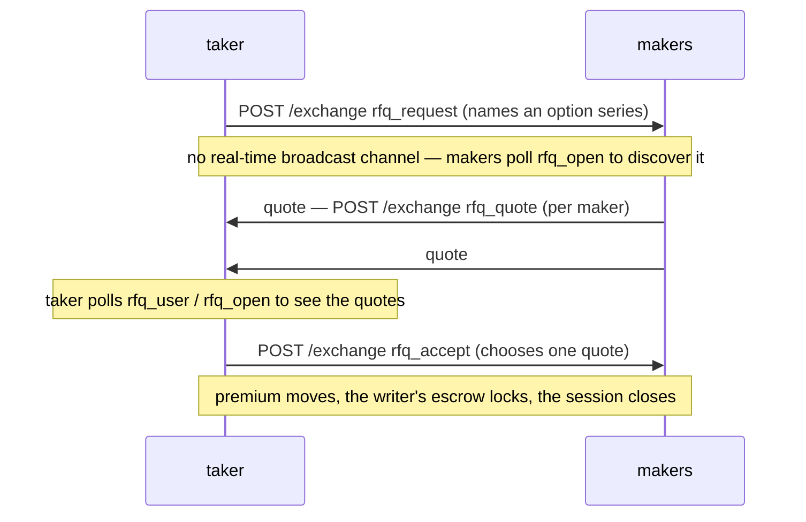

# Request-for-quote (RFQ)

Request for quote (RFQ) is the trade path for options. This page describes the three actions, what a fill settles, and how to read open sessions.

## Summary {#tldr}

RFQ is the trade path for options. A taker asks for a quote on one
[option series](../products/options.md). Makers answer with a premium, and the
taker accepts one quote. The fill settles directly between the two accounts.

RFQ clears options and nothing else. All three actions refuse any market that is
not an active option series. There is no RFQ on perpetuals and none on spot.

## Options only {#why-rfq}

A request-for-quote path next to a public order book is not fair to that book.
It lets size trade away from the price that everyone else posts against.
MetaFlux thus offers RFQ only where there is no continuous book to undercut.

Options have no book. The chain never prices an option and never needs an
implied volatility, so the premium must come from a negotiation between two
accounts. RFQ is that negotiation.

The refusal on every other market is exactly:

```
precondition failed: rfq is options-only: market <n> is not an option series
```

## Lifecycle {#lifecycle}


```mermaid
sequenceDiagram
    participant taker
    participant makers
    taker->>makers: POST /exchange rfq_request (names an option series)
    Note over taker,makers: no real-time broadcast channel — makers poll rfq_open to discover it
    makers->>taker: quote — POST /exchange rfq_quote (per maker)
    makers->>taker: quote
    Note over taker: taker polls rfq_user / rfq_open to see the quotes
    taker->>makers: POST /exchange rfq_accept (chooses one quote)
    Note over taker,makers: premium moves, the writer's escrow locks, the session closes
```

## Action flow {#action-flow}

The [`/exchange` action catalog](../api/rest/exchange/rfq-utility.md) fully
specifies the three actions. This section explains the concepts. The links give
the full field tables and the EIP-712 typed-data primary types.

### Request a quote (taker) {#taker--request-an-rfq}

[`rfq_request`](../api/rest/exchange/rfq-utility.md#rfq_request):

```json
{
  "type": "rfq_request",
  "params": {
    "market":    2147483649,
    "side":      "Bid",
    "size":      100000,
    "limit_px":  250000000,
    "expiry_ms": 1735689605000
  }
}
```

`market` is the `signing_id` of an active series, from
[`option_series`](../api/rest/info/options.md#option_series). Read it from the
server. Never compute it, because the encoding behind the number is internal.

`size` and `limit_px` are raw `u64` numbers, not decimal strings. `size` is on
the `10^sz_decimals` plane of the series. `limit_px` is a premium per whole unit
on the 1e8 plane. `side` is `"Bid"` / `"Ask"`, capitalized. This is different
from the lowercase `"bid"` / `"ask"` of a perp order body. `"Bid"` buys the
option. `"Ask"` writes it.

`limit_px` is optional. When it is present, the chain checks at once that the
taker can carry the worst case. If it cannot, the chain refuses with
`insufficient free collateral for the request`. `expiry_ms` is an absolute
consensus timestamp in ms, not a duration.

This action returns the standard
[`202 Accepted`](../api/rest/exchange.md#202-accepted--non-order-admission)
admission envelope. The assigned `rfq_id` is not in that response. It is a
committed effect. Read it from [`rfq_user`](#querying-open-rfqs).

### Submit a quote (maker) {#maker--submit-a-quote}

[`rfq_quote`](../api/rest/exchange/rfq-utility.md#rfq_quote):

```json
{
  "type": "rfq_quote",
  "params": {
    "rfq_id":         9,
    "price":          249000000,
    "max_size":       100000,
    "valid_until_ms": 1735690000000
  }
}
```

`valid_until_ms` must not be later than the `expiry_ms` of the request. The
chain refuses a quote that outlives its session with `invalid parameters:
valid_until_ms exceeds request expiry`. Read the `expiry` of the session from
[`rfq_open`](#querying-open-rfqs) and use that number. Do not compute the
validity from a second local clock reading. The request round trip is between
the two readings, and the chain stamps the request on its own clock. Two
"now + 60s" values taken seconds apart are thus not the same ceiling.

`price` is the premium per whole unit. `rfq_id` is the numeric session id from
[`rfq_open`](#querying-open-rfqs), not a hex string. A maker can send several
quotes during the session. Each one is appended to the quote list of the
session. Only its position in that list (`quote_idx`) identifies it. There is no
separate quote id, and there is no cancel-quote action.

### Accept a quote (taker) {#taker--accept}

[`rfq_accept`](../api/rest/exchange/rfq-utility.md#rfq_accept):

```json
{
  "type": "rfq_accept",
  "params": { "rfq_id": 9, "quote_idx": 0, "size": 100000 }
}
```

With `size`, the taker can accept less than the `max_size` of the quote. The
chain honors the accept only from the account that opened the session.

## What a fill settles {#settlement-semantics}

An option fill moves three amounts and nothing else.

| Property | RFQ option fill |
|----------|-----------------|
| Premium | Quoted `price` × whole units, from the buyer to the writer, in USDC on both kinds, truncated toward zero to micro-USDC |
| Escrow | [`escrow_per_unit`](../api/rest/info/options.md#option_series) × whole units, from the writer's balance into the series pot, in the row's [`settle_asset`](../api/rest/info/options.md#option_series) |
| Closing | The escrow of a closing writer leaves the pot exactly. The legs of each account net first |
| Counter-party | One maker only: the signer of the chosen quote |
| Book impact | None. The trade matches against no resting order |
| Fees | The taker pays, in USDC. The quoting maker has no fee leg. See [the option fee](../products/options.md#option-fee) |
| Margin | None. The buyer paid the premium, and the writer locked the worst case |
| Liquidation | Not possible. Both sides are fully funded at the fill |
| Public visibility | None. It is not on the public trade tape or `fills` |

### The escrow rule {#the-escrow-rule}

A put writer escrows USDC. A call writer escrows the underlying coin: one coin
per whole unit, at any strike. The series row shows the currency as
[`settle_asset`](../api/rest/info/options.md#option_series).

The denomination of a call is forced, not chosen. A cash call pays
`max(S* − K, 0)`. The price has no ceiling, so no finite cash escrow covers it.
In the coin, the same payoff is `max(1 − K / S*, 0)`, which is below one at
every price. One coin per contract thus funds the worst case. This is why
nothing in this path needs margin or liquidation. See
[why a call escrows one coin](../products/options.md#why-a-call-escrows-one-coin).

A maker must plan for two results:

- A call writer must hold the coin on its spot balance. The escrow leaves that
  balance, and a spot balance cannot go negative. To hold the coin is thus the
  full collateral test. Without enough of it, the chain refuses the accept of
  the quote with `insufficient underlying balance for the escrow`. `rfq_request`
  refuses in the same way at the start when the taker writes with a `limit_px`.
- The coin escrow cannot net the USDC premium. On a put, the incoming premium
  reduces the escrow that the writer must fund, so the chain checks one net
  number. On a call, the two are different assets, so the chain checks the coin
  and the USDC fee separately. A call writer that holds every coin it needs can
  still be refused with `insufficient free collateral for the fee`.

At expiry, the chain settles the series from a price window and pays from the
series pot, in `settle_asset`: USDC to the account balance on a put, the coin to
the spot balance on a call. Settlement can defer, and after a bound it can
abandon. Read [settlement](../products/options.md#settlement) before you write
an option.

## Session expiry {#auto-expire}

There is no expiry sweep. The chain does not remove or announce an expired
request. It enforces expiry lazily. It refuses an `rfq_quote` or `rfq_accept`
against a session past its `expiry_ms` with `precondition failed: request
expired`. It refuses a quote past its own `valid_until_ms` with
`precondition failed: quote expired`. Nothing is charged in either case. A stale
session stays visible on [`rfq_open`](#querying-open-rfqs) until the
open-request cap evicts it.

## Maker registration {#maker-registration}

There is no maker-registration action. `rfq_quote` needs no opt-in and no
per-series eligibility check. Any account can append a quote to any open session
that it can see.

## What RFQ does not do {#what-rfq-doesnt-do}

- **It does not trade perpetuals or spot.** The chain refuses every non-option market.
- **It does not appear on the public tape.** An RFQ fill has no trade-tape
  record and no `fills` event.
- **It is not a Dutch auction.** Quotes do not decay. Makers post fixed premiums,
  and the taker picks one.
- **It is not a multi-maker fill.** One accept takes the quote of one maker. To
  split across makers, run several sessions.

## Querying open sessions {#querying-open-rfqs}

The node `/info` read path returns the RFQ engine state as two query types,
`rfq_open` and `rfq_user`.

Both are public. No WS channel sends an RFQ event, so a taker polls for its
quotes and a maker polls for requests to answer.

On these reads, `sz`, `price`, `max_size` and `limit_px` are decimal strings.
This is different from the raw plane that the write actions take. The sizes are
on the scale of the series: whole units, already divided.

Each row has `signing_id`, the number that an action puts in `market`, and
`underlying`, the symbol that the series settles against. There is no `coin`
field. A session names an option series, and a series is not a coin.

`rfq_open` takes no parameters. It returns every open session, joined to its
quotes:

```bash
curl -X POST https://api.testnet.mtf.exchange/info \
  -H 'content-type: application/json' \
  -d '{"type":"rfq_open"}'
```

```json
{
  "data": {
    "type": "rfq_open",
    "rfqs": [
      {
        "rfq_id":               1,
        "signing_id":           2147483649,
        "underlying":           "BTC",
        "requester":            "0x<addr>",
        "side":                 "B",
        "sz":                   "0.001",
        "limit_px":             null,
        "requester_stp_group":  null,
        "created_at":           1788005490809,
        "expiry":               1788005550535,
        "quotes":               []
      }
    ]
  }
}
```

| Field | Type | Meaning |
|-------|------|---------|
| `rfq_id` | uint64 | Session id. `rfq_quote` and `rfq_accept` take this number |
| `signing_id` | uint32 | The option series, from [`option_series`](../api/rest/info/options.md#option_series) |
| `side` | `"B"` / `"A"` | The read token, not the one you sent. `rfq_request` takes `"Bid"` / `"Ask"`. This read answers `"B"` / `"A"`, the same token that every other read uses for a side |
| `sz` | Decimal string | Requested size in whole underlying units. The action takes a raw `u64` on the series' `sz_decimals` plane. This read returns the human number |
| `limit_px` | Decimal string \| null | The worst price that the taker accepts. `null` when it sent none |
| `created_at` | uint64 | Consensus ms at which the session opened |
| `expiry` | uint64 | Consensus ms at which the session closes. This is the ceiling for the `valid_until_ms` of a quote |
| `quotes` | array | Quotes posted so far, in the order that sets the `quote_idx` of each one |

`rfq_user` takes `address` (0x hex). It splits the result into `requested`
(sessions the account opened) and `quoted` (sessions it quoted on):

```bash
curl -X POST https://api.testnet.mtf.exchange/info \
  -H 'content-type: application/json' \
  -d '{"type":"rfq_user","address":"0x..."}'
```

An account that is party to nothing returns a 200 with both lists empty.

## Edge cases {#edge-cases}

<details>
<summary>Show edge cases</summary>

- **Several quotes from one maker.** Allowed. The taker picks one.
- **A quote arrives after the accept.** The session is closed, so the chain
  refuses the quote.
- **The session expires while the taker signs.** The chain refuses the accept
  with `precondition failed: request expired`. Open a new session.
- **The premium truncates to zero.** Refused with `precondition failed: premium
  truncates to zero`. Increase the size or the premium.
- **Either side is short of collateral at accept time.** Refused with
  `insufficient free collateral for premium` (buyer) or `insufficient free
  collateral for escrow` (writer on a USDC series). Nothing moves, and the other
  quotes stay open.
- **A call writer is short of the coin.** Refused with `insufficient underlying
  balance for the escrow`. The escrow is one coin per unit, and it leaves the
  writer's spot balance.
- **A call writer cannot pay the USDC fee.** Refused with `insufficient free
  collateral for the fee`, even with every coin that the escrow needs. The chain
  checks the coin escrow and the USDC fee as separate assets.
- **Maker and taker are the same account, or share an STP group.** Refused with
  `precondition failed: self-trade blocked`.

</details>

## See also {#see-also}

- [Options](../products/options.md): the product that RFQ clears.
- [`option_series`](../api/rest/info/options.md#option_series): the series registry, and the `signing_id` to sign.
- [`option_state`](../api/rest/info/options.md#option_state): the units and escrow that a fill leaves.
- [`/exchange` action catalog](../api/rest/exchange/rfq-utility.md): the full parameter tables and typed-data primary types.

## FAQ {#faq}

<details>
<summary>Show FAQ</summary>

**Q: Can I use RFQ on a perpetual to hide size?**
A: No. The chain refuses every market that is not an active option series.

**Q: Can RFQ quotes be cancelled?**
A: No. There is no cancel-quote action. Quotes are append-only for the life of
the session. A quote lapses at its own `valid_until_ms`, or when the session
closes.

**Q: Which matching algorithm runs?**
A: None. When the taker accepts, the fill is direct between the taker and the
chosen maker. The CLOB engine is not involved.

**Q: What does a fill cost?**
A: The premium in USDC, plus the escrow if you are the writer, plus a taker fee
in USDC if you sent the request. The maker who quoted you pays nothing. On a
call, the escrow is one coin per unit, not dollars. Read
[`settle_asset`](../api/rest/info/options.md#option_series). The fee is the
smaller of a rate on the strike face of the option (`strike` x `size`) and a
fraction of the premium. See [the option fee](../products/options.md#option-fee).
Both rates start unset, which charges nothing.

</details>
