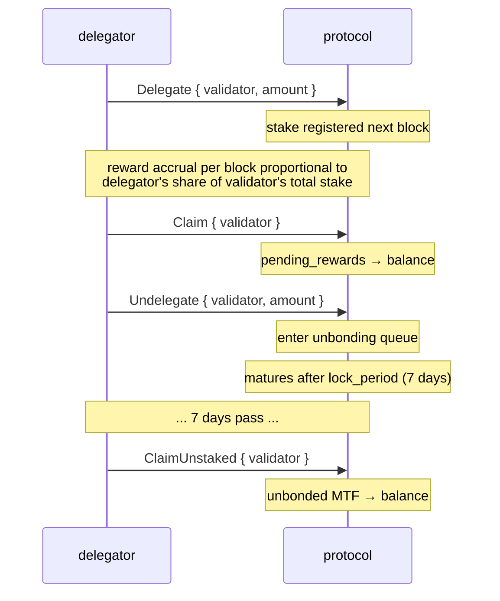
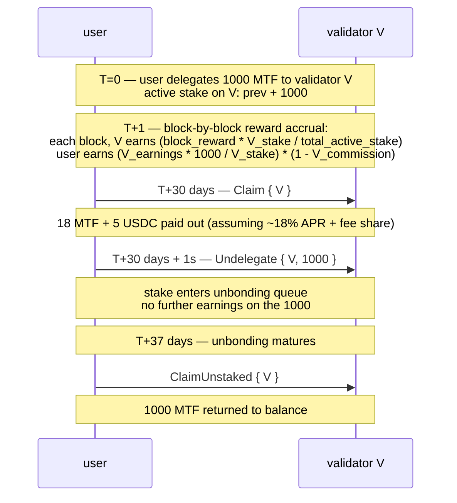

# Staking

:::info
**Live on devnet.** Delegation, undelegation, rewards claiming, and validator
registration are active and verified end-to-end across consensus on the
4-node devnet.
:::

## TL;DR {#tldr}

Hold MTF, delegate to a validator, earn staking rewards. The ongoing source is protocol fee revenue: fees fund validators — the **20% validator share** of the [fee buyback](./fees.md) — and validators fund stakers, passing that share down minus commission. Early on this is topped up by a finite treasury-funded bootstrap budget (never new issuance). Stake is liquid up to the `lock_period`; unstake takes `7 days` to fully release. Slashing applies to validators who misbehave; delegators face partial slash exposure.

## Actors {#actors}

| Role | Description |
|------|-------------|
| **Validator** | Runs a consensus node, proposes blocks, votes. Must self-bond above `min_self_bond` (default 100k MTF). |
| **Delegator** | Holds MTF, picks a validator, earns rewards minus the validator's commission. |
| **Protocol** | Distributes rewards per block, pro-rata to stake: the validator share of fee revenue plus the treasury bootstrap budget. |

## Staking flow {#staking-flow}



## Actions {#actions}

### `Delegate` {#delegate}

```json
{
  "type": "Delegate",
  "params": { "validator": "0x<val_addr>", "amount": "10000000000" }
}
```

Moves MTF from balance to the validator's delegation pool. Effective at next block. Earns rewards from then on.

### `Undelegate` {#undelegate}

```json
{
  "type": "Undelegate",
  "params": { "validator": "0x<val_addr>", "amount": "10000000000" }
}
```

Removes from active stake; enters unbonding queue. Doesn't earn rewards during unbonding. Matures at `now + lock_period_ms`.

### `Redelegate` {#redelegate}

```json
{
  "type": "Redelegate",
  "params": { "from": "0x<val1>", "to": "0x<val2>", "amount": "10000000000" }
}
```

Move stake between validators **without** entering the unbonding queue. Limited to one redelegation per `(from, to)` pair within a 24 h window (anti-whipsaw).

### `Claim` {#claim}

```json
{
  "type": "Claim",
  "params": { "validator": "0x<val_addr>" }
}
```

Sweep accrued rewards from `pending_rewards` to the delegator's MTF balance. No-op if pending is zero.

Auto-claim is **not** automatic — claim on a cadence (daily / weekly) or before changing delegation.

### `ClaimUnstaked` {#claimunstaked}

```json
{
  "type": "ClaimUnstaked",
  "params": { "validator": "0x<val_addr>" }
}
```

Sweep matured undelegations (those whose lock period has passed) back to MTF balance. Idempotent.

## Reward sources {#reward-sources}

| Source | Cadence | Share |
|--------|---------|-------|
| Fee revenue — validator share of the buyback (fees → validators → stakers) | Per-epoch | `validator_share_inflow × stake_share × (1 - commission)` |
| Bootstrap rewards (treasury-funded, early phase) | Per-block | `reward_per_block × stake_share × (1 - validator_commission)` |

Fee revenue is the ongoing source: per [the fee flywheel](./fees.md), bought-back MTF splits **70% burn / 20% validators / 10% treasury**, and the validator 20% is passed down to stakers minus commission.
`reward_per_block`: governance-set, drawn from the treasury bootstrap pool — **not new issuance**; current value in `staking_state` query.
`validator_commission`: per-validator, capped at `20%` by governance.

Rewards are computed in MTF (bootstrap rewards) and USDC (fee revenue) — claim returns both. `staking_state` shows pending in each currency.

## Lock period {#lock-period}

Default: **7 days** for unstaking. Tunable by governance per stake-pool.

| State | Duration | Earns rewards? | Slashable? |
|-------|----------|:--------------:|:----------:|
| Active (delegated) | indefinite | yes | yes |
| Unbonding | `lock_period_ms` | no | yes (until matured) |
| Unbonded (in claim queue) | until claimed | no | no |

Slash exposure during unbonding is the trap — a validator that gets slashed mid-unbond drags the unbonding delegators down with them, even though they've signalled exit.

## Slashing {#slashing}

Validators are slashed for:

| Offence | Slash | Punishment to delegator |
|---------|-------|--------------------------|
| Double-sign (signed two conflicting blocks at same height) | 5% of stake + jail | Pro-rata 5% of delegation lost |
| Downtime (missed `downtime_blocks` consecutive proposer slots) | 0.1% of stake + jail | Pro-rata 0.1% lost |
| Vote on invalid fork | 5% + permanent removal | Pro-rata 5% |

Slashed delegators see their `delegation.amount` reduced at the slash block. No notice — slashing is consensus-derived.

Mitigations:
- Pick well-operated validators (uptime track record, commission stability).
- Diversify across validators (a single validator slash hits only that portion).
- Avoid validators near `min_self_bond` (more likely to exit ungracefully).

## Validator selection {#validator-selection}

```bash
curl -X POST https://api.devnet.mtf.exchange/info -d '{"type":"validator_summaries"}'
```

Returns the active validator set (`{epoch, total_stake, n_active, validators[]}`);
each entry carries:

```json
{
  "validator":          "0x<val>",
  "signer":             "0x<signer>",
  "validator_index":    3,
  "stake":              "10000000000000",
  "self_stake":         "100000000000",
  "commission_bps":     500,
  "is_active":          true,
  "is_jailed":          false,
  "first_active_epoch": 12
}
```

Pick by:
- **Commission** (`commission_bps`): lower → higher net APR. But beware bait-and-switch (cap raises).
- **Self-stake** (`self_stake`): higher → operator has skin in the game.
- **Jail status** (`is_jailed`): a currently-jailed validator earns nothing until unjailed.
- **Active** (`is_active`): only `is_active: true` validators are in the live signing set.

## APR estimation {#apr-estimation}

The [`staking_apr`](../api/rest/info.md#staking_apr) `/info` query type is **live** —
it returns the effective bootstrap-reward APR the begin-block reward effect
actually applies, plus its committed inputs:

```bash
curl -X POST https://api.devnet.mtf.exchange/info -d '{"type":"staking_apr"}'
```

```json
{
  "type": "staking_apr",
  "data": {
    "total_stake":             "1000000",
    "effective_apr":           "0.08",
    "effective_apr_bps":       "800",
    "governance_rate_bps":     800,
    "emission_floor_stake":    "50000000",
    "n_active_validators":     1,
    "current_epoch":           2,
    "is_gross_pre_commission": true
  }
}
```

`effective_apr` is derived from the **stake curve**, not from the governance rate:

```text
effective_apr = 0.08 × √( 50M / max(total_stake, 50M) )
```

i.e. a flat **8%** at/below 50M MTF staked, decaying ∝ 1/√stake above it (more
stake = lower per-staker share). `governance_rate_bps` is committed but **NOT
consumed** by the reward effect — both are surfaced so the divergence is
observable. APR is **gross**, pre per-validator commission (`is_gross_pre_commission: true`).

This begin-block reward effect is funded from the treasury bootstrap budget
(see [tokenomics](./tokenomics.md)) — staking rewards never rely on new
issuance. As fee revenue grows, the 20% validator share of the
[fee buyback](./fees.md) becomes the dominant reward source.

Net APR for a delegator:

```
net_apr  =  effective_apr  ×  (1 - validator_commission_bps/10_000)
```

## Edge cases {#edge-cases}

<details>
<summary>Show edge cases</summary>

- **Validator exits while you're unbonding.** Your unbonding stake transfers to the next-in-queue validator at the slash block. You can redelegate post-exit if you prefer a different validator; the lock continues against the new validator.
- **Active set turnover.** If the validator drops out of the active set (their delegations drop below the cutoff), your stake earns no rewards while they're out. You can redelegate to an active validator.
- **Self-bond minimum.** A validator whose self-bond falls below `min_self_bond` (via slashes or withdrawals) gets jailed; delegators don't earn during jail.

</details>

## Sequence — full cycle {#sequence--full-cycle}



## See also {#see-also}

- [`POST /exchange Delegate / Undelegate / Claim`](../api/rest/exchange.md)  (supported action variants on devnet)
- [`POST /info staking_state`](../api/rest/info.md#staking_state)
- [`POST /info staking_apr`](../api/rest/info.md#staking_apr) — effective bootstrap-reward APR + committed inputs
- [`POST /info protocol_metrics`](../api/rest/info.md#protocol_metrics) — protocol-wide staking aggregates (`staking.*`)
- [Fees](./fees.md) — fee revenue is one of the staking reward sources

## FAQ {#faq}

<details>
<summary>Show FAQ</summary>

**Q: Can I stake and trade simultaneously?**
A: Yes — staked MTF and USDC trading balances are separate sub-balances of the same account.

**Q: Do I need an agent wallet to stake?**
A: No — but you can use one. Agent wallets can call `Delegate` / `Undelegate` / `Claim` (no withdrawal authority required for staking changes).

**Q: Can I cancel an unbonding?**
A: No — once submitted, you wait the full `lock_period`. Redelegate instead if you anticipated needing the stake elsewhere.

**Q: Where do staking rewards come from?**
A: Fee revenue is the ongoing source: validators receive the **20% validator share** of the [fee buyback](./fees.md) (70% burn / 20% validators / 10% treasury) and distribute it to their stakers minus commission. Early on, a finite treasury-funded bootstrap budget tops this up. The protocol **never mints new MTF for rewards** — the only supply lever is the annual population re-peg ([tokenomics](./tokenomics.md)).

</details>
