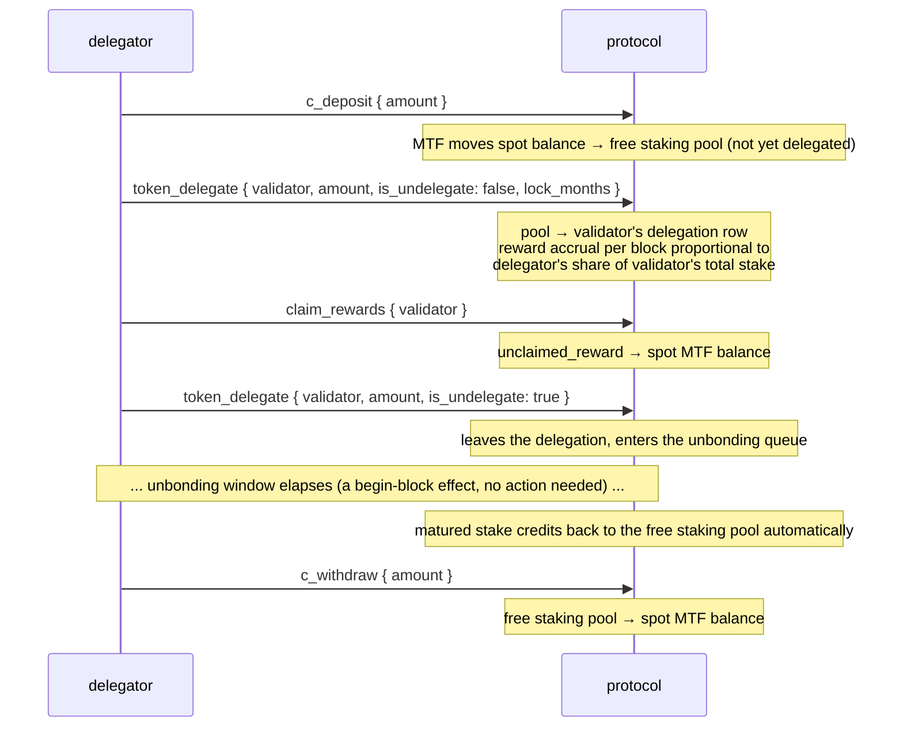
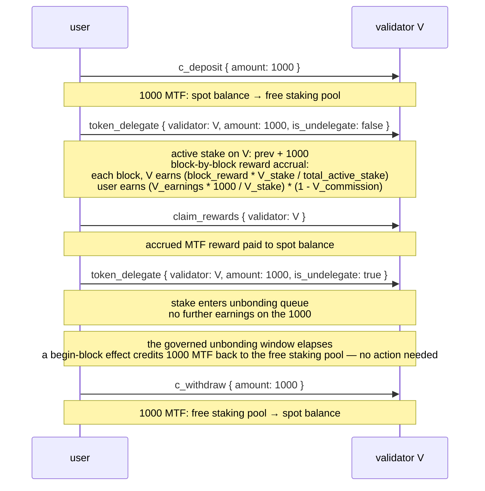

# Staking

:::info
**Live on devnet.** Deposit, delegation, undelegation, rewards claiming, and
validator registration are active and verified end-to-end across consensus
on the 4-node devnet.
:::

## TL;DR {#tldr}

Hold MTF, move it into the staking pool, delegate to a validator, earn staking rewards. The ongoing source is protocol fee revenue: fees fund validators — the **20% validator share** of the [fee buyback](./fees.md) — and validators fund stakers, passing that share down minus commission, already converted to MTF before it reaches you (see [Reward sources](#reward-sources)). Early on this is topped up by a finite treasury-funded bootstrap budget (never new issuance). A flexible (untiered) delegation unstakes any time; a locked delegation must first mature its lock tier. Either way, undelegated stake then serves a **governed unbonding window** before it is free to withdraw. Slashing applies to validators who misbehave; delegators face partial slash exposure.

## Actors {#actors}

| Role | Description |
|------|-------------|
| **Validator** | Runs a consensus node, proposes blocks, votes. Must self-bond above `min_self_bond` (default 100k MTF). |
| **Delegator** | Holds MTF, picks a validator, earns rewards minus the validator's commission. |
| **Protocol** | Distributes rewards per block, pro-rata to stake: the validator share of fee revenue plus the treasury bootstrap budget. |

## Staking flow {#staking-flow}


```mermaid
sequenceDiagram
    participant D as delegator
    participant P as protocol
    D->>P: c_deposit { amount }
    Note over P: MTF moves spot balance → free staking pool (not yet delegated)
    D->>P: token_delegate { validator, amount, is_undelegate: false, lock_months }
    Note over P: pool → validator's delegation row<br/>reward accrual per block proportional to<br/>delegator's share of validator's total stake
    D->>P: claim_rewards { validator }
    Note over P: unclaimed_reward → spot MTF balance
    D->>P: token_delegate { validator, amount, is_undelegate: true }
    Note over P: leaves the delegation, enters the unbonding queue
    Note over D,P: ... unbonding window elapses (a begin-block effect, no action needed) ...
    Note over P: matured stake credits back to the free staking pool automatically
    D->>P: c_withdraw { amount }
    Note over P: free staking pool → spot MTF balance
```

## Actions {#actions}

There is no `Redelegate` and no `ClaimUnstaked` action — see the notes under
each step below for what actually moves stake between those states.

### Deposit to / withdraw from the staking pool — `c_deposit` / `c_withdraw` {#c_deposit--c_withdraw}

```json
{ "type": "c_deposit", "params": { "amount": "1000" } }
```
```json
{ "type": "c_withdraw", "params": { "amount": "1000" } }
```

Move whole-MTF between your spot balance and your **free staking pool** — an
undelegated holding area, not a validator delegation. `c_withdraw` has no
unbonding wait; it only touches the free pool, never a delegation. `amount`
is a decimal string.

### Delegate or undelegate — `token_delegate` {#token_delegate}

One action handles both directions via `is_undelegate`:

```json
// delegate: pool -> validator
{
  "type": "token_delegate",
  "params": { "validator": "0x<val_addr>", "amount": "10000000000", "is_undelegate": false, "lock_months": 0 }
}
```
```json
// undelegate: leaves the delegation, enters the unbonding queue
{
  "type": "token_delegate",
  "params": { "validator": "0x<val_addr>", "amount": "10000000000", "is_undelegate": true }
}
```

`lock_months` is one of `0` (flexible), `1`, `6`, `24` — ignored on undelegate.
A locked tier (`> 0`) is only admitted for a governance-allowlisted validator,
and re-locks the row's maturity on every top-up (so a top-up never shortens
an in-flight lock). A **locked** row cannot start unbonding until its own
lock matures; a **flexible** row (`lock_months: 0`) can undelegate any time.
Delegating funds from the free pool credited by [`c_deposit`](#c_deposit--c_withdraw)
— an under-funded pool rejects cleanly, no partial state change.

Undelegated stake does not return to your spot balance immediately: it sits
in a per-delegator unbonding entry, still slashable, until the governed
unbonding window elapses — then a begin-block effect (no action required)
credits it back to your **free staking pool** automatically. Withdraw it to
spot from there with [`c_withdraw`](#c_deposit--c_withdraw).

### Claim rewards — `claim_rewards` {#claim_rewards}

```json
{ "type": "claim_rewards", "params": { "validator": null } }
```

`validator: null` claims every delegation's accrued reward at once (plus your
own validator-commission bucket, if you run one); `validator: "0x<addr>"`
claims just that one delegation row. Credits your spot MTF balance. No-op —
returns `claimed: "0"` — if nothing is pending.

### Link staking user — `link_staking_user` {#link_staking_user}

```json
{ "type": "link_staking_user", "params": { "target": "0x<addr>" } }
```

Present in the wire vocabulary but **always rejects** today
(`linkStakingUser disabled: claim-on-behalf requires target opt-in`) — the
intended claim-on-behalf-of-a-cold-wallet flow was never wired past this
fail-closed guard. Do not rely on it.

## Reward sources {#reward-sources}

Both sources credit the **same MTF-denominated** `unclaimed_reward` bucket
[`claim_rewards`](#claim_rewards) pays out — there is no separate USDC reward
to claim, even though fee revenue is USDC-denominated at the source:

| Source | Mechanism | Share |
|--------|-----------|-------|
| Fee revenue — validator share of the buyback | The accrued USDC validator-fee pool periodically buys MTF on-book (batched behind a governance-tunable minimum pool size and a time throttle, not every block); the acquired MTF is what gets split below | `commission_bps` to the validator, the rest pro-rata by (delegation amount × lock multiplier) across delegators + the validator's own self-stake |
| Bootstrap rewards (treasury-funded, early phase) | Begin-block emission from the treasury bootstrap budget — **never new issuance** | `stake_share × (1 - validator_commission)`, per the [APR curve](#apr-estimation) |

Fee revenue is the ongoing source: per [the fee flywheel](./fees.md), bought-back MTF splits **70% burn / 20% validators / 10% treasury**, and the validator 20% funds this path.
`validator_commission` (`commission_bps`): per-validator, in `validator_summaries`, capped by governance.

## Lock and unbonding {#lock-and-unbonding}

Two separate durations apply, and only one is a per-delegation choice:

- **Lock tier** (`lock_months`: `0`/`1`/`6`/`24`) — your own choice at delegate time. A locked row cannot start unbonding before it matures; a flexible (`0`) row can undelegate any time.
- **Unbonding window** — governance-set (**7 days** on live testnet today; a vote can only raise it, never below a 7-day floor). Applies after undelegating, regardless of lock tier. Read your own entry's maturity from [`staking_state`](../api/rest/info.md#staking_state)'s `pending_unstakes[].matures_at_ts` rather than assuming a fixed value.

| State | Earns rewards? | Slashable? |
|-------|:--------------:|:----------:|
| Active (delegated) | yes | yes |
| Unbonding (after `is_undelegate: true`) | no | yes (until matured) |
| Matured, sitting in the free staking pool | no | no |

Slash exposure during unbonding is the trap — a validator that gets slashed mid-unbond drags the unbonding delegators down with them, even though they've signalled exit.

## Slashing {#slashing}

Validators are slashed for:

| Offence | Slash | Punishment to delegator |
|---------|-------|--------------------------|
| Double-sign (signed two conflicting blocks at same height) | 5% of stake + jail | Pro-rata 5% of delegation lost |
| Downtime (missed `downtime_blocks` consecutive proposer slots) | 0.1% of stake + jail | Pro-rata 0.1% lost |
| Vote on invalid fork | 5% + permanent removal | Pro-rata 5% |

Slashed delegators see their `delegation.amount` reduced at the slash block. No notice — slashing is consensus-derived.

Mitigations:
- Pick well-operated validators (uptime track record, commission stability).
- Diversify across validators (a single validator slash hits only that portion).
- Avoid validators near `min_self_bond` (more likely to exit ungracefully).

## Validator selection {#validator-selection}

```bash
curl -X POST https://api.devnet.mtf.exchange/info -d '{"type":"validator_summaries"}'
```

Returns the active validator set (`{epoch, total_stake, n_active, validators[]}`);
each entry carries:

```json
{
  "validator":          "0x<val>",
  "signer":             "0x<signer>",
  "validator_index":    3,
  "stake":              "10000000000000",
  "self_stake":         "100000000000",
  "commission_bps":     "500",
  "is_active":          true,
  "is_jailed":          false,
  "first_active_epoch": 12
}
```

Pick by:
- **Commission** (`commission_bps`): lower → higher net APR. But beware bait-and-switch (cap raises).
- **Self-stake** (`self_stake`): higher → operator has skin in the game.
- **Jail status** (`is_jailed`): a currently-jailed validator earns nothing until unjailed.
- **Active** (`is_active`): only `is_active: true` validators are in the live signing set.

## APR estimation {#apr-estimation}

The [`staking_state`](../api/rest/info.md#staking_state) `/info` query type is **live** —
it returns the effective bootstrap-reward APR the begin-block reward effect
actually applies, plus its committed inputs:

```bash
curl -X POST https://api.devnet.mtf.exchange/info -d '{"type":"staking_state","address":"0x<addr>"}'
```

```json
{
  "type": "staking_state",
  "data": {
    "total_stake":                 "1000000",
    "pending_validator_pool_usdc": "25.75",
    "n_active_validators":         1,
    "current_epoch":               2,
    "reward_source":               "fee_funded_on_book_buy"
  }
}
```

> ⚠️ **The emission era is over, and this read no longer publishes an APR.**
> The fields `effective_apr`, `effective_apr_bps`, `governance_rate_bps`,
> `emission_floor_stake` and `is_gross_pre_commission` used to be documented
> here and **are not on the wire**. The stake curve
> (`0.08 × √(50M / max(total_stake, 50M))`) described the emission the chain no
> longer runs.

Rewards are FEE-FUNDED. The 20% validator share of the
[fee buyback](./fees.md) accrues into `pending_validator_pool_usdc`, and the
epoch distribution pays it out. So the reward is whatever fees the period
earned, divided by stake — it is not a rate the chain can publish in advance.

**There is no APR field, and do not compute one from these values.** The pending
pool is accrued fees at an instant, not an annualised rate: projecting it forward
assumes trading volume that has not happened. A delegator's realised return is
their stake share of each distribution, less their validator's commission
(`commission_bps`, in whole basis points as a decimal string).

## Edge cases {#edge-cases}

<details>
<summary>Show edge cases</summary>

- **Validator exits while you're unbonding.** Your unbonding stake transfers to the next-in-queue validator at the slash block. You can redelegate post-exit if you prefer a different validator; the lock continues against the new validator.
- **Active set turnover.** If the validator drops out of the active set (their delegations drop below the cutoff), your stake earns no rewards while they're out. You can redelegate to an active validator.
- **Self-bond minimum.** A validator whose self-bond falls below `min_self_bond` (via slashes or withdrawals) gets jailed; delegators don't earn during jail.

</details>

## Sequence — full cycle {#sequence--full-cycle}


```mermaid
sequenceDiagram
    participant U as user
    participant V as validator V
    U->>V: c_deposit { amount: 1000 }
    Note over U,V: 1000 MTF: spot balance → free staking pool
    U->>V: token_delegate { validator: V, amount: 1000, is_undelegate: false }
    Note over U,V: active stake on V: prev + 1000<br/>block-by-block reward accrual:<br/>each block, V earns (block_reward * V_stake / total_active_stake)<br/>user earns (V_earnings * 1000 / V_stake) * (1 - V_commission)
    U->>V: claim_rewards { validator: V }
    Note over U,V: accrued MTF reward paid to spot balance
    U->>V: token_delegate { validator: V, amount: 1000, is_undelegate: true }
    Note over U,V: stake enters unbonding queue<br/>no further earnings on the 1000
    Note over U,V: the governed unbonding window elapses<br/>a begin-block effect credits 1000 MTF back to the free staking pool — no action needed
    U->>V: c_withdraw { amount: 1000 }
    Note over U,V: 1000 MTF: free staking pool → spot balance
```

## See also {#see-also}

- [`POST /exchange`](../api/rest/exchange.md) — `c_deposit` / `c_withdraw` / `token_delegate` / `claim_rewards`
- [`POST /info staking_state`](../api/rest/info.md#staking_state)
- [`POST /info staking_state`](../api/rest/info.md#staking_state) — one account's stake, plus the `reward_pool` inputs
- [Fees](./fees.md) — fee revenue is one of the staking reward sources

## FAQ {#faq}

<details>
<summary>Show FAQ</summary>

**Q: Can I stake and trade simultaneously?**
A: Yes — staked MTF and USDC trading balances are separate sub-balances of the same account.

**Q: Do I need an agent wallet to stake?**
A: No, and you cannot delegate one for this: every staking action (`c_deposit`, `c_withdraw`, `token_delegate`, `claim_rewards`) is master-only — there is no agent-resolvable `owner` field, unlike order and margin actions.

**Q: Can I cancel an unbonding, or move it to a different validator without the wait?**
A: No — there is no redelegate action. Once you undelegate, the stake serves the full unbonding window before it is free; only then can you delegate it elsewhere.

**Q: Where do staking rewards come from?**
A: Fee revenue is the ongoing source: validators receive the **20% validator share** of the [fee buyback](./fees.md) (70% burn / 20% validators / 10% treasury) and distribute it to their stakers minus commission. Early on, a finite treasury-funded bootstrap budget tops this up. The protocol **never mints new MTF for rewards** — the only supply lever is the annual population re-peg ([tokenomics](./tokenomics.md)).

</details>
