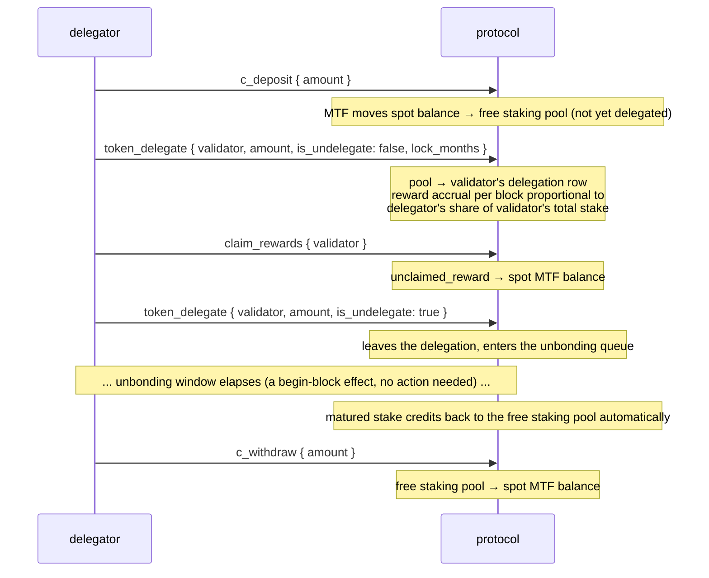
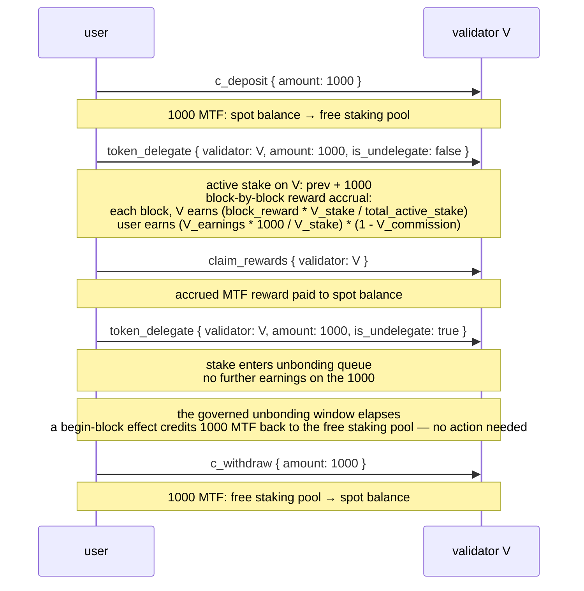

# Staking

Staking delegates MTF to a validator for a share of protocol fee revenue. This page describes the actions, the reward sources, lock and unbonding, and slashing.

:::info
**Live on testnet.** Deposit, delegation, undelegation, reward claims and
validator registration are active, and they are verified end to end across
consensus on testnet.
:::

## Summary {#tldr}

Hold MTF, move it into the staking pool, delegate it to a validator, and earn staking rewards. The ongoing source is protocol fee revenue. Fees fund validators through the 20% validator share of the [fee buyback](./fees.md). Validators pass that share down to stakers, less commission. It is already converted to MTF before it reaches you (see [Reward sources](#reward-sources)). In the early phase, a finite bootstrap budget from the treasury adds to this. It is never new issuance. A flexible (untiered) delegation can unstake at any time. A locked delegation must first reach the end of its lock tier. In both cases, undelegated stake then waits a governed unbonding window before you can withdraw it. Slashing applies to validators that misbehave. Delegators have partial slash exposure.

## Actors {#actors}

| Role | Description |
|------|-------------|
| **Validator** | Runs a consensus node, proposes blocks and votes. Must self-bond above `min_self_bond` (default 100k MTF). |
| **Delegator** | Holds MTF, picks a validator, and earns rewards less the validator's commission. |
| **Protocol** | Distributes rewards per block, pro-rata to stake: the validator share of fee revenue plus the treasury bootstrap budget. |

## Staking flow {#staking-flow}


```mermaid
sequenceDiagram
    participant D as delegator
    participant P as protocol
    D->>P: c_deposit { amount }
    Note over P: MTF moves spot balance → free staking pool (not yet delegated)
    D->>P: token_delegate { validator, amount, is_undelegate: false, lock_months }
    Note over P: pool → validator's delegation row<br/>reward accrual per block proportional to<br/>delegator's share of validator's total stake
    D->>P: claim_rewards { validator }
    Note over P: unclaimed_reward → spot MTF balance
    D->>P: token_delegate { validator, amount, is_undelegate: true }
    Note over P: leaves the delegation, enters the unbonding queue
    Note over D,P: ... unbonding window elapses (a begin-block effect, no action needed) ...
    Note over P: matured stake credits back to the free staking pool automatically
    D->>P: c_withdraw { amount }
    Note over P: free staking pool → spot MTF balance
```

## Actions {#actions}

There is no `Redelegate` action and no `ClaimUnstaked` action. The notes under
each step below say what moves stake between those states.

### Staking pool deposit and withdrawal {#c_deposit--c_withdraw}

```json
{ "type": "c_deposit", "params": { "amount": "1000" } }
```
```json
{ "type": "c_withdraw", "params": { "amount": "1000" } }
```

`c_deposit` and `c_withdraw` move whole MTF between your spot balance and your
*free staking pool*. The free staking pool is an undelegated holding area, not a
validator delegation. `c_withdraw` has no unbonding wait. It changes only the
free pool, never a delegation. `amount` is a decimal string.

### Delegate and undelegate {#token_delegate}

One action, `token_delegate`, handles both directions through `is_undelegate`:

```json
// delegate: pool -> validator
{
  "type": "token_delegate",
  "params": { "validator": "0x<val_addr>", "amount": "10000000000", "is_undelegate": false, "lock_months": 0 }
}
```
```json
// undelegate: leaves the delegation, enters the unbonding queue
{
  "type": "token_delegate",
  "params": { "validator": "0x<val_addr>", "amount": "10000000000", "is_undelegate": true }
}
```

`lock_months` is one of `0` (flexible), `1`, `6` or `24`. The node ignores it on
undelegate. The node admits a locked tier (`> 0`) only for a validator on the
governance allowlist. Every addition locks the maturity of the row again, so an
addition never shortens a running lock. A row holds one tier. The node refuses
an addition to an existing delegation with a different `lock_months`. Undelegate
the row first, or use a second validator. A locked row cannot start unbonding
until its own lock matures. A flexible row (`lock_months: 0`) can undelegate at
any time. Delegation draws on the free pool that
[`c_deposit`](#c_deposit--c_withdraw) credits. An under-funded pool rejects the
action cleanly, with no partial state change.

An EVM contract can also delegate, and it picks a tier in the same way.
[CoreWriter](../evm/interacting-with-core.md#action-3-lock-tier) action 3 has
`lockMonths` as an optional fourth word, and the tier rules above apply without
change. A three-word call omits it and gets tier `0`, which earns no revenue
share. A CoreWriter refusal is silent: the EVM receipt still reports Success.
Read the stored tier from
[`staking_state`](../api/rest/info/vaults-staking.md#staking_state).

Undelegated stake does not return to your spot balance at once. It waits in a
per-delegator unbonding entry, still slashable, until the governed unbonding
window ends. Then a begin-block effect credits it back to your free staking pool
automatically. No action is necessary. Withdraw it to spot from there with
[`c_withdraw`](#c_deposit--c_withdraw).

### Claim rewards {#claim_rewards}

```json
{ "type": "claim_rewards", "params": { "validator": null } }
```

`validator: null` claims the accrued reward of every delegation at once, plus
your own validator-commission bucket if you run a validator.
`validator: "0x<addr>"` claims only that one delegation row. The claim credits
your spot MTF balance. If nothing is pending, it is a no-op and returns
`claimed: "0"`.

### Link a staking user {#link_staking_user}

```json
{ "type": "link_staking_user", "params": { "target": "0x<addr>" } }
```

This action is in the wire vocabulary, but it always rejects today
(`linkStakingUser disabled: claim-on-behalf requires target opt-in`). The
intended flow, a claim on behalf of a cold wallet, was never wired past this
fail-closed guard. Do not rely on it.

## Reward sources {#reward-sources}

Both sources credit the same MTF-denominated `unclaimed_reward` bucket that
[`claim_rewards`](#claim_rewards) pays out. There is no separate USDC reward to
claim, although fee revenue is in USDC at the source:

| Source | Mechanism | Share |
|--------|-----------|-------|
| Fee revenue: validator share of the buyback | The accrued USDC validator-fee pool periodically buys MTF on-book (batched behind a governance-tunable minimum pool size and a time throttle, not every block); the acquired MTF is what gets split below | `commission_bps` to the validator, the rest pro-rata by (delegation amount × lock multiplier) across delegators + the validator's own self-stake |
| Bootstrap rewards (treasury-funded, early phase) | Begin-block emission from the treasury bootstrap budget. It is never new issuance | `stake_share × (1 - validator_commission)`, per the [APR curve](#apr-estimation) |

A flexible delegation earns no revenue share. The lock multiplier is `0×` at
`lock_months: 0`. See the [ve-style table](./tokenomics.md#time-weighted-staking-ve-style).
A no-lock row thus has zero weight in the split above and gets nothing. Lock for
at least 1 month to get a share. A flexible delegation still earns the Tier 1 fee
discount. The two ladders are separate.

The split has two levels, and both use the same weight. The acquired MTF is
first divided across active validators, then within each validator across its
delegators. At the first level, the slice of a validator is sized by the same
weighted stake that the second level pays out: self-stake at `1.0×` plus the
`amount × lock multiplier` of each delegation row. It is not sized by raw bonded
stake. A validator whose delegators are all flexible thus gets only the share of
its own self-stake, and its commission base is smaller too.

Fee revenue is the ongoing source. Per [the fee flywheel](./fees.md), net fee
revenue splits 70% buyback-and-lock, 20% validators and 10% treasury. The
validator 20% funds this path.
`validator_commission` (`commission_bps`) is per validator, in
`validator_summaries`, and governance caps it.

## Lock and unbonding {#lock-and-unbonding}

Two separate durations apply. Only one of them is a choice per delegation:

- **Lock tier** (`lock_months`: `0`/`1`/`6`/`24`). You choose it when you delegate. A locked row cannot start unbonding before it matures. A flexible (`0`) row can undelegate at any time.
- **Unbonding window.** Governance sets it: **7 days** on live testnet today. A vote can only raise it, never below a 7-day floor. It applies after the undelegation, for every lock tier. Read the maturity of your own entry from `pending_unstakes[].matures_at_ts` on [`staking_state`](../api/rest/info/vaults-staking.md#staking_state). Do not assume a fixed value.

| State | Earns rewards? | Slashable? |
|-------|:--------------:|:----------:|
| Active (delegated) | yes | yes |
| Unbonding (after `is_undelegate: true`) | no | yes (until matured) |
| Matured, sitting in the free staking pool | no | no |

The risk is slash exposure during unbonding. If a validator is slashed during the unbonding window, its unbonding delegators also lose stake, although they have already signalled their exit.

## Slashing {#slashing}

Validators are slashed for these offences:

| Offence | Slash | Punishment to delegator |
|---------|-------|--------------------------|
| Double-sign (signed two conflicting blocks at same height) | 5% of stake + jail | Pro-rata 5% of delegation lost |
| Downtime (missed `downtime_blocks` consecutive proposer slots) | 0.1% of stake + jail | Pro-rata 0.1% lost |
| Vote on invalid fork | 5% + permanent removal | Pro-rata 5% |

The `delegation.amount` of a slashed delegator decreases at the slash block. There is no notice, because slashing comes from consensus.

To reduce the risk:

- Pick validators with good operation: a record of uptime and stable commission.
- Spread stake across validators. A slash of one validator affects only that portion.
- Avoid validators near `min_self_bond`. They are more likely to exit without warning.

## Validator selection {#validator-selection}

```bash
curl -X POST https://api.testnet.mtf.exchange/info -d '{"type":"validator_summaries"}'
```

The read returns the active validator set (`{epoch, total_stake, n_active, validators[]}`).
Each entry has:

```json
{
  "validator":          "0x<val>",
  "signer":             "0x<signer>",
  "validator_index":    3,
  "stake":              "10000000000000",
  "self_stake":         "100000000000",
  "commission_bps":     "500",
  "is_active":          true,
  "is_jailed":          false,
  "first_active_epoch": 12
}
```

Pick by:

- **Commission** (`commission_bps`): lower commission gives a higher net APR. Look out for a validator that raises its commission later.
- **Self-stake** (`self_stake`): higher self-stake means that the operator has more of its own stake at risk.
- **Jail status** (`is_jailed`): a jailed validator earns nothing until it is unjailed.
- **Active** (`is_active`): only validators with `is_active: true` are in the live signing set.

## APR estimation {#apr-estimation}

The [`staking_state`](../api/rest/info/vaults-staking.md#staking_state) `/info`
query type is live. It returns the effective bootstrap-reward APR that the
begin-block reward effect applies, and its committed inputs:

```bash
curl -X POST https://api.testnet.mtf.exchange/info -d '{"type":"staking_state","address":"0x<addr>"}'
```

```json
{
  "type": "staking_state",
  "data": {
    "total_stake":                 "1000000",
    "pending_validator_pool_usdc": "25.75",
    "n_active_validators":         1,
    "current_epoch":               2,
    "reward_source":               "fee_funded_on_book_buy"
  }
}
```

:::warning
The emission era is over, and this read no longer publishes an APR. The fields
`effective_apr`, `effective_apr_bps`, `governance_rate_bps`,
`emission_floor_stake` and `is_gross_pre_commission` were documented here in the
past. They are not on the wire. The stake curve
(`0.08 × √(50M / max(total_stake, 50M))`) described the emission that the chain
no longer runs.
:::

Rewards come from fees. The 20% validator share of the
[fee buyback](./fees.md) accrues into `pending_validator_pool_usdc`, and the
epoch distribution pays it out. The reward is thus the fees of the period,
divided by stake. The chain cannot publish it as a rate in advance.

The distribution buys the reward asset. It does not convert it. The pooled USDC
is spent on the MTF/USDC book, and only the MTF actually bought is paid out by
stake weight. This stops the platform from subsidising rewards: USDC never
becomes an MTF reward at an invented rate. The cost is that a thin book delays
the payout. With no resting asks on MTF/USDC, the buy gets nothing and the
distribution is skipped. The pool stays for the next attempt. A pool that stays
at a constant value is this case, not a fault.

There is no APR field. Do not compute one from these values. The pending pool is
the accrued fees at one instant, not an annual rate. A projection of it assumes
trading volume that has not happened. The realized return of a delegator is its
weighted share of each distribution, `amount × lock multiplier`, which is zero
for a flexible row. The commission of its validator is subtracted
(`commission_bps`, in whole basis points as a decimal string).

## Edge cases {#edge-cases}

<details>
<summary>Show edge cases</summary>

- **Validator exits while you are unbonding.** Your unbonding stake moves to the next validator in the queue at the slash block. You can redelegate after the exit if you want a different validator. The lock continues against the new validator.
- **Active set turnover.** If the validator leaves the active set (its delegations fall below the cutoff), your stake earns no rewards while it is out. You can redelegate to an active validator.
- **Self-bond minimum.** A validator whose self-bond falls below `min_self_bond` (through slashes or withdrawals) is jailed. Delegators do not earn during the jail.

</details>

## Full cycle {#sequence--full-cycle}


```mermaid
sequenceDiagram
    participant U as user
    participant V as validator V
    U->>V: c_deposit { amount: 1000 }
    Note over U,V: 1000 MTF: spot balance → free staking pool
    U->>V: token_delegate { validator: V, amount: 1000, is_undelegate: false }
    Note over U,V: active stake on V: prev + 1000<br/>block-by-block reward accrual:<br/>each block, V earns (block_reward * V_stake / total_active_stake)<br/>user earns (V_earnings * 1000 / V_stake) * (1 - V_commission)
    U->>V: claim_rewards { validator: V }
    Note over U,V: accrued MTF reward paid to spot balance
    U->>V: token_delegate { validator: V, amount: 1000, is_undelegate: true }
    Note over U,V: stake enters unbonding queue<br/>no further earnings on the 1000
    Note over U,V: the governed unbonding window elapses<br/>a begin-block effect credits 1000 MTF back to the free staking pool — no action needed
    U->>V: c_withdraw { amount: 1000 }
    Note over U,V: 1000 MTF: free staking pool → spot balance
```

## See also {#see-also}

- [`POST /exchange`](../api/rest/exchange.md): `c_deposit`, `c_withdraw`, `token_delegate` and `claim_rewards`.
- [`POST /info staking_state`](../api/rest/info/vaults-staking.md#staking_state): the stake of one account, and the `reward_pool` inputs.
- [Fees](./fees.md): fee revenue is one of the staking reward sources.

## FAQ {#faq}

<details>
<summary>Show FAQ</summary>

**Q: Can I stake and trade at the same time?**
A: Yes. Staked MTF and USDC trading balances are separate sub-balances of the same account.

**Q: Do I need an agent wallet to stake?**
A: No, and you cannot use one for this. Every staking action (`c_deposit`, `c_withdraw`, `token_delegate`, `claim_rewards`) is master-only. Unlike order and margin actions, these actions have no `owner` field that an agent can resolve.

**Q: Can I cancel an unbonding, or move it to a different validator without the wait?**
A: No. There is no redelegate action. After you undelegate, the stake waits the full unbonding window before it is free. Only then can you delegate it to another validator.

**Q: Where do staking rewards come from?**
A: Fee revenue is the ongoing source. Validators receive the 20% validator share of the [fee buyback](./fees.md) (70% buyback-and-lock, 20% validators, 10% treasury) and distribute it to their stakers, less commission. In the early phase, a finite bootstrap budget from the treasury adds to this. Rewards never mint new MTF, and the mainnet total supply is fixed ([tokenomics](./tokenomics.md#total-supply)).

</details>
