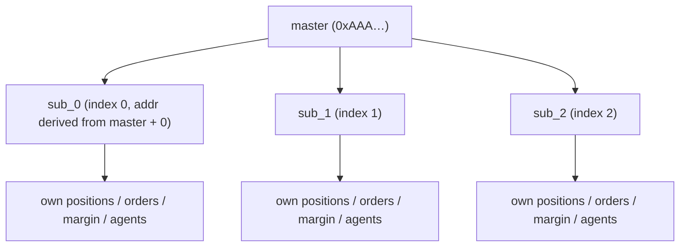
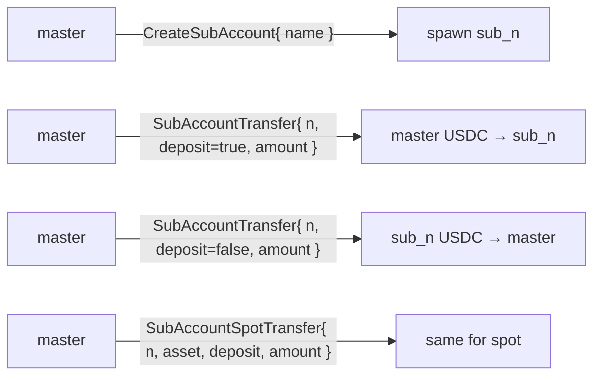
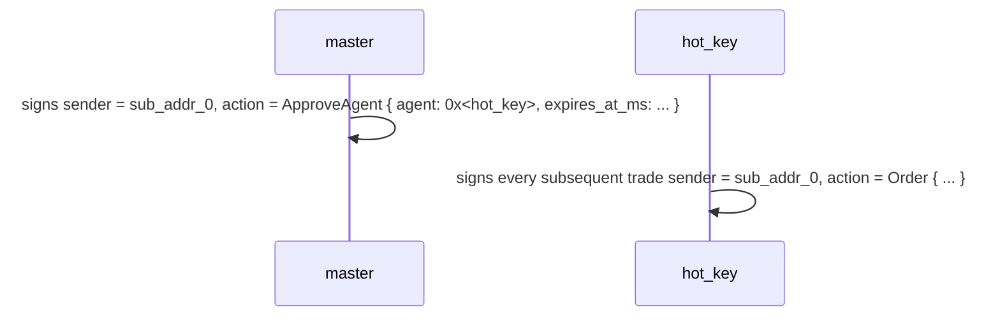
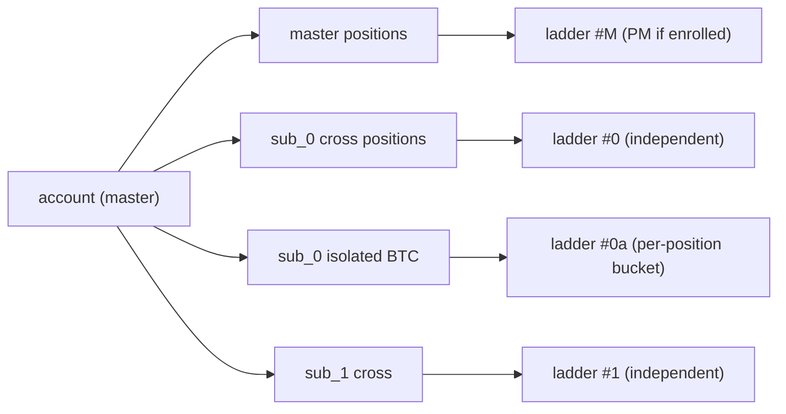
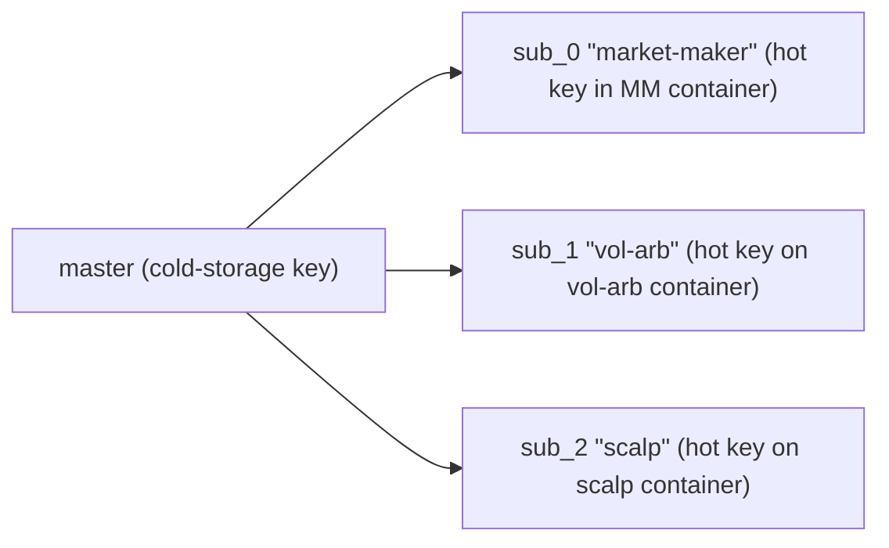
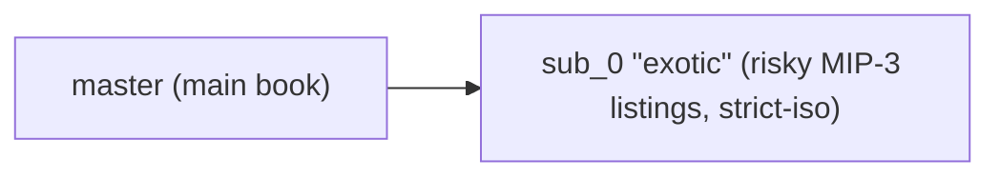
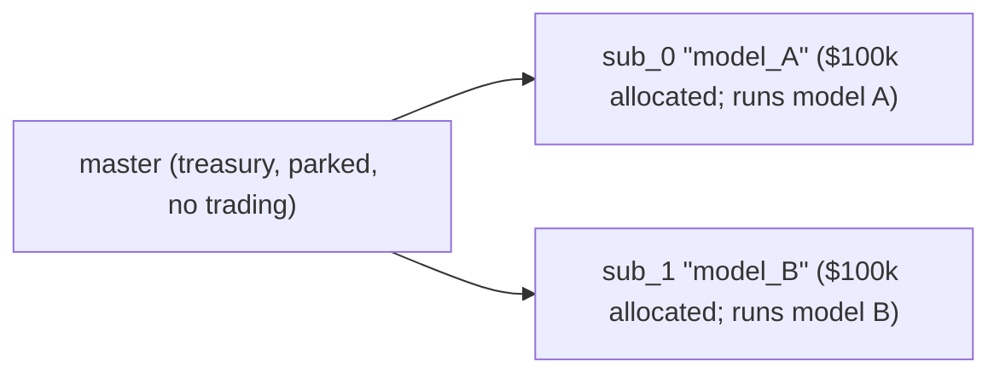

# Sub-accounts

:::info
**Preview.** The user-visible API is stable; the address-derivation scheme is finalised before mainnet.
:::

## TL;DR

A sub-account is a derived address under a master that has its own positions, margin, and orders, but transfers funds in and out only through the master. Up to 32 subs per master. Use them to isolate strategies, separate trading desks, or A/B portfolios without re-onboarding.

## Mental model



Each sub is a first-class account in the state machine — own balance, own positions, own liquidation threshold, own [agent wallets](./agent-wallets.md). The master-of-sub relationship is recorded in a side map.

Hard cap: **32 subs** per master (subject to expansion in V2). Hitting the cap returns `{"error":"sub_account_cap"}` on `CreateSubAccount`.

## Transfers

Only between master and sub:



External withdrawals (off-chain, to a third address) must come from the **master**. Sub-accounts cannot withdraw directly off-chain.

## Address derivation

Each sub-account index `n` maps deterministically to an address derived from the master's 20-byte address:

```
sub_addr_n = first_20_bytes( keccak256( master_addr || uint64_be(n) ) )
```

Anyone can compute a sub's address without on-chain state. The derivation is consensus-fixed at V1 launch; treat returned addresses as authoritative until then.

## Fund-segregation guarantees

| Guarantee | Mechanism |
|-----------|-----------|
| A sub's loss cannot drain master | Sub liquidates against its own balance; master sees only the transfer ledger |
| A sub's loss cannot drain other subs | Same — each sub is a first-class isolation boundary |
| Master CAN choose to backstop a losing sub | Voluntarily, via `SubAccountTransfer` deposit |
| Master CANNOT involuntarily backstop | A sub's blowup is the sub's, full stop |
| Master can liquidate **out of** a sub | Withdraw via `SubAccountTransfer` (only if sub stays in Safe tier after the transfer) |

## Creating

```json
{
  "type": "CreateSubAccount",
  "params": { "name": "scalping-desk", "explicit_index": null }
}
```

| Field | Type | Description |
|-------|------|-------------|
| `name` | string ≤ 64 chars | Bookkeeping label |
| `explicit_index` | uint32 \| null | Specific slot to claim; `null` → next free |

Response:

```json
{
  "accepted": true,
  "data": {
    "sub_index":   0,
    "sub_address": "0x<derived>",
    "name":        "scalping-desk"
  }
}
```

**Indices are monotonic** — once allocated, they never get reused, even after the sub is emptied and abandoned. Use `explicit_index` carefully.

## Funding

```json
{
  "type": "SubAccountTransfer",
  "params": { "sub_index": 0, "deposit": true, "amount": "1000000000" }
}
```

`amount` in USDC base units (6 decimals). `deposit: true` is master → sub; `false` is sub → master.

For spot assets use `SubAccountSpotTransfer` (adds `asset` field).

**Transfer must leave the sub in Safe tier** — a withdrawal that would push the sub into T0+ is rejected with `{"error":"insufficient sub balance"}`. Top up first, then withdraw the excess.

## Trading from a sub

The sub is a regular account. Sign with the sub's key (or an [approved agent](./agent-wallets.md)) and submit with the sub's address as `sender`.

Common pattern: master signs `ApproveAgent` for each sub from the sub's address — the master holds delegation authority over its subs, so this is allowed even though `ApproveAgent` is otherwise master-only. Each sub then has its own hot-key trading flow.



The SDK exposes each sub as a separate `Client` instance with its own keypair, pointed at its derived address.

## Liquidation isolation

A sub's [tiered liquidation](./tiered-liquidation.md) is computed against its **own** account value and maintenance margin. A blowup in `sub_0` does not put `sub_1` or the master at risk.

You can also set a sub's margin mode to `StrictIso` per-asset so that asset's positions don't contribute to cross-asset PM even if the master is PM-enrolled.



## Per-sub PM enrollment

Each sub independently enrolls in [portfolio margin](./portfolio-margin.md) (with its own equity check against `pm_min_equity`).

```json
{
  "sender": "0x<sub_0_addr>",
  "action": { "type": "UserPortfolioMargin", "params": { "enabled": true } }
}
```

A master can keep classical while a sub goes PM; useful when one sub runs a hedged book and others run directional trades.

## Querying

```bash
curl -X POST https://devnet-gateway.mtf.exchange/info \
  -d '{"type":"sub_accounts","address":"0x<master>"}'
```

Returns the sub list with indices, derived addresses, labels, and a snapshot of each sub's clearinghouse state.

Each sub can also be queried as a first-class account via `account_state`, `open_orders`, `user_fills`, etc., by passing its address as `address`.

[HL-compat equivalent](../api/rest/hl-compat.md#subaccounts).

## Limits

| Limit | Default | Notes |
|-------|---------|-------|
| Subs per master | 32 | V2 may expand |
| Sub-account name length | 64 chars | UTF-8; no validation beyond length |
| Concurrent transfers in-flight | 8 per master | Mempool cap |
| Master can withdraw from sub | yes, if sub stays Safe | Otherwise rejected |
| Sub can withdraw off-chain | no | Must route via master |
| Sub can have agents | yes | Configured per-sub |
| Sub can be multi-sig | no | V1 only the master can be multi-sig |

## Use-case patterns

### Strategy separation



Each strategy has its own agent key, its own liquidation envelope, its own PnL reporting.

### Risk firewalling



main book gains: full upside; sub_0 blowup is capped to its deposit.

### A/B portfolios



Quarterly comparison of NAV per sub determines which gets more allocation.

## Edge cases

<details>
<summary>Show edge cases</summary>

- **Race between `CreateSubAccount` and first agent traffic.** Sub effective at next block, like all state changes. Sequence: create → approve agent → wait 1 block → trade.
- **Master tries to transfer from sub during sub's T1 liquidation.** Rejected; sub's collateral is being used to defend. Transfer is allowed once sub re-enters Safe.
- **Master deletes / abandons a sub.** Not in V1. Subs stick around forever in the index. Empty subs have zero state cost; not worth worrying about.
- **Sub's agent key compromised.** Revoke via the master (master is sub's master, holds delegation authority). Use the same `ApproveAgent` with `expires_at_ms` in the past.
- **Sub-of-sub.** Not supported. A sub's `CreateSubAccount` is rejected.

</details>

## Sequence — full setup

```mermaid
sequenceDiagram
    participant master
    participant sub_0
    participant hot_key
    master->>sub_0: T=0 master creates sub_0
    Note over sub_0: T+1 sub_0 active
    master->>sub_0: T+1 master transfers 1000 USDC into it
    master->>sub_0: T+2 signs ApproveAgent { agent: hot_key, ... } AS sub_0
    Note over sub_0,hot_key: T+3 approval committed; hot_key can sign for sub_0
    hot_key->>sub_0: T+4 places first order on sub_0
    Note over sub_0: T+5 order admits; fills; sub_0 has a position
```

## See also

- [Agent wallets](./agent-wallets.md) — per-sub hot keys
- [Portfolio margin](./portfolio-margin.md) — interaction with cross-asset PM
- [Margin modes](./margin-modes.md) — Cross / Isolated / Strict-Iso per sub
- [`POST /info sub_accounts`](../api/rest/info.md#sub_accounts) — MTF-native query
- [`subAccounts` HL-compat](../api/rest/hl-compat.md#subaccounts) — HL-shape query

## FAQ

<details>
<summary>Show FAQ</summary>

**Q: Are sub-account fees aggregated with master for tier purposes?**
A: Yes. The 30-day volume tier rolls up across master + all subs. Trading inside subs counts for the master's tier discount.

**Q: Can a sub receive funds from another account directly (not via master)?**
A: Yes — `UsdcTransfer` to a sub's address works just like to any account. The funds aren't restricted to flow through master after that point; they're just funds in the sub's balance.

**Q: Do subs share a nonce space with master?**
A: No. Each sub has its own nonce sequence. Master's nonces are master's; sub_0's are sub_0's; etc.

**Q: Can I convert a sub-account into a master / detach it?**
A: Not in V1. A sub is permanently a sub. To "detach," create a fresh account at a different address and transfer.

</details>
