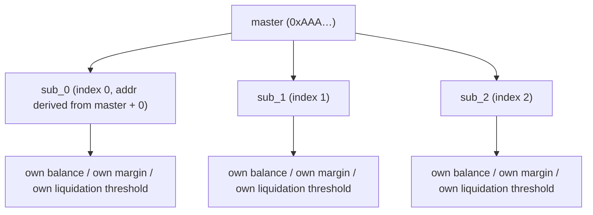
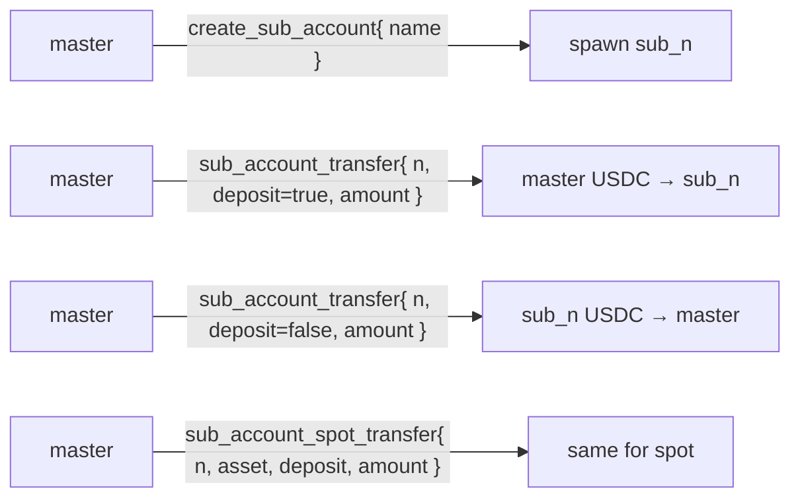
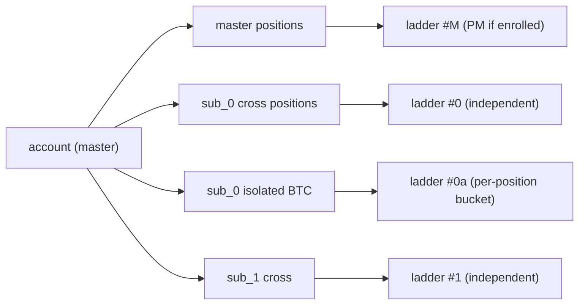
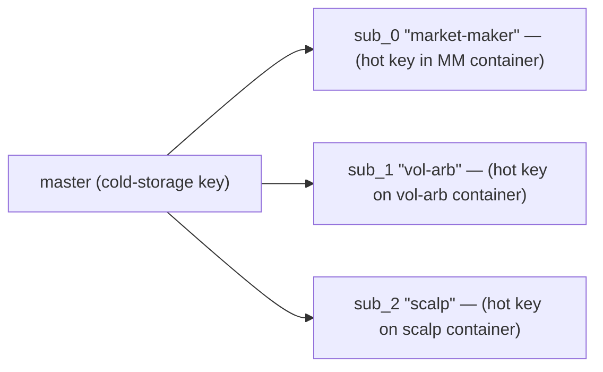
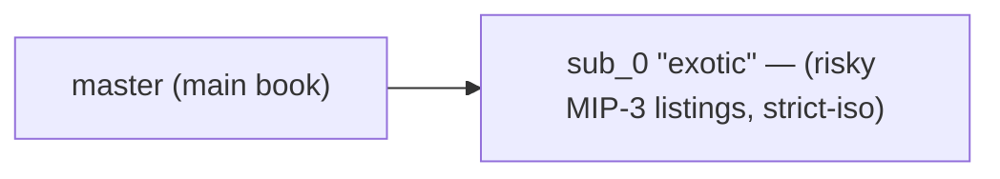
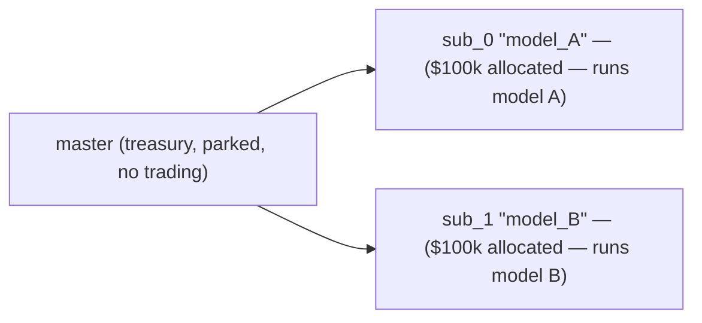
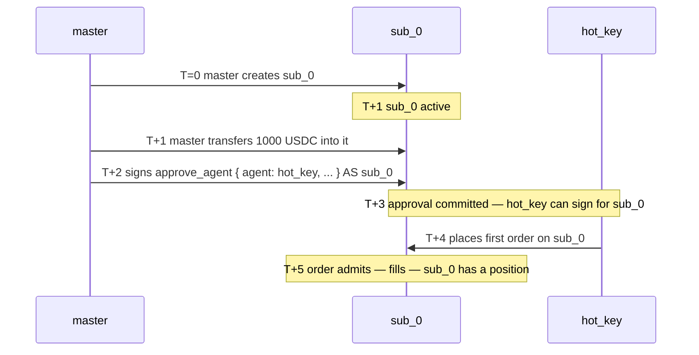

# Sub-accounts

:::info
**Preview.** The user-visible API is stable. The address-derivation scheme is finalized before mainnet.
:::

A sub-account is an address derived from a master account. It holds its own balance and its own risk.

## Summary {#tldr}

A sub-account moves funds in and out only through its master. A master can have up to 32 sub-accounts.

:::warning
A sub-account cannot sign today, so it cannot trade today.

A sub address is a hash of the master address and the index. No private key exists for it. An action reaches an account in one of two ways: the account's own key signs it, or an approved agent of the account signs it. A sub-account can use neither:

- It has no key, so it cannot sign for itself.
- Its approved-agent set is always empty. `create_sub_account` never fills it. [`approve_agent`](../api/rest/exchange/account.md#approve_agent) adds an agent to the signer's account. Only the sub-account could approve an agent of the sub-account, and the sub-account cannot sign.

So a sub-account is a fund-segregation bucket that the master funds and defunds. It cannot place orders, hold positions it opened itself, or enrol in portfolio margin. Use one master account per trading strategy until sub-account signing ships.
:::

## Model {#mental-model}


```mermaid
flowchart TD
    master["master (0xAAA…)"]
    sub0["sub_0 (index 0, addr derived from master + 0)"]
    sub1["sub_1 (index 1)"]
    sub2["sub_2 (index 2)"]
    own0["own balance / own margin / own liquidation threshold"]
    own1["own balance / own margin / own liquidation threshold"]
    own2["own balance / own margin / own liquidation threshold"]
    master --> sub0
    master --> sub1
    master --> sub2
    sub0 --> own0
    sub1 --> own1
    sub2 --> own2
```

Each sub-account is a first-class account in the state machine. It has its own balance and its own liquidation threshold. A side map records which master owns which sub-account. "First-class" describes the ledger, not the signing surface: no sub-account can sign, so none can act. See the [summary warning](#tldr).

The hard cap is 32 sub-accounts per master. At the cap, `create_sub_account` returns `PRECONDITION_FAILED`.

## Transfers {#transfers}

Transfers run only between a master and its sub-accounts:


```mermaid
flowchart LR
    m1["master"] -->|"create_sub_account{ name }"| e1["spawn sub_n"]
    m2["master"] -->|"sub_account_transfer{ n, deposit=true, amount }"| e2["master USDC → sub_n"]
    m3["master"] -->|"sub_account_transfer{ n, deposit=false, amount }"| e3["sub_n USDC → master"]
    m4["master"] -->|"sub_account_spot_transfer{ n, asset, deposit, amount }"| e4["same for spot"]
```

An external withdrawal to a third address must come from the master. A sub-account cannot withdraw off-chain directly.

## Address derivation {#address-derivation}

Each sub-account index `n` maps to an address derived from the 20-byte master address:

```
sub_addr_n = first_20_bytes( keccak256( master_addr || uint64_be(n) ) )
```

Anyone can compute a sub-account address without on-chain state. The derivation is fixed by consensus at V1 launch. Until then, treat the returned address as authoritative.

## Fund-segregation guarantees {#fund-segregation-guarantees}

| Guarantee | Mechanism |
|-----------|-----------|
| A sub-account loss cannot drain the master | The sub-account liquidates against its own balance. The master sees only the transfer ledger. |
| A sub-account loss cannot drain other sub-accounts | Each sub-account is a first-class isolation boundary. |
| The master can choose to backstop a losing sub-account | A voluntary `sub_account_transfer` deposit. |
| The master cannot be forced to backstop | A sub-account blowup stays in the sub-account. |
| The master can withdraw out of a sub-account | A `sub_account_transfer`, only if the sub-account stays in the Safe tier after the transfer. |

## Creating {#creating}

```json
{
  "type": "create_sub_account",
  "params": { "name": "scalping-desk", "explicit_index": null, "shared_stp_group": false }
}
```

| Field | Type | Description |
|-------|------|-------------|
| `name` | string ≤ 64 chars | Bookkeeping label |
| `explicit_index` | uint32 \| null | The slot to claim. `null` takes the next free slot. |
| `shared_stp_group` | bool | Required. There is no default: a body without this field fails admission with a missing-field error. `true` puts the sub-account in the master's [self-trade-prevention](./order-types.md#self-trade-prevention) group, so the book refuses a match between master and sub-account. `false` leaves it out of the group, so the two can match each other. |

Response:

```json
{
  "accepted": true,
  "data": {
    "sub_index":   0,
    "sub_address": "0x<derived>",
    "name":        "scalping-desk"
  }
}
```

Indices only increase. An allocated index is never reused, even after the sub-account is emptied and abandoned. Use `explicit_index` with care.

## Funding {#funding}

```json
{
  "type": "sub_account_transfer",
  "params": { "sub_index": 0, "deposit": true, "amount": "1000000000" }
}
```

`amount` is in USDC base units (6 decimals). `deposit: true` moves funds from the master to the sub-account. `deposit: false` moves them back.

For spot assets, use `sub_account_spot_transfer`. It adds an `asset` field.

A transfer must leave the sub-account in the Safe tier. A withdrawal that would push it into T0 or worse is rejected with `MARGIN_INSUFFICIENT`. Add margin first, then withdraw the excess.

## Trading from a sub {#trading-from-a-sub}

A sub-account cannot trade today. It holds no key, so it cannot sign an order. See the [summary warning](#tldr).

An agent does not open a path either, and the attempt fails silently. [`approve_agent`](../api/rest/exchange/account.md#approve_agent) writes the agent under the recovered signer's account. Its body carries `agent`, `name` and `expires_at_ms`. It has no owner field and no delegation field. So a master that signs `approve_agent` for a sub-account approves an agent on the master. The action is accepted, the agent set of the sub-account stays empty, and no error appears.

The remap that lets a master act on a sub-account covers three actions only: `create_sub_account`, `sub_account_transfer` and `sub_account_spot_transfer`. Every other action lands on the signer's own account. A master can move funds in and out of a sub-account, and nothing else.

There is no workaround. Use one master account per trading strategy until sub-account signing ships.

## Liquidation isolation {#liquidation-isolation}

The [tiered liquidation](./tiered-liquidation.md) of a sub-account uses its own account value and maintenance margin. A blowup in `sub_0` does not put `sub_1` or the master at risk.

You can also set the margin mode of a sub-account to `StrictIso` per asset. The positions in that asset then do not count toward cross-asset portfolio margin, even if the master is enrolled.


```mermaid
flowchart LR
    acct["account (master)"]
    mp["master positions"]
    s0c["sub_0 cross positions"]
    s0i["sub_0 isolated BTC"]
    s1c["sub_1 cross"]
    lM["ladder #M (PM if enrolled)"]
    l0["ladder #0 (independent)"]
    l0a["ladder #0a (per-position bucket)"]
    l1["ladder #1 (independent)"]
    acct --> mp --> lM
    acct --> s0c --> l0
    acct --> s0i --> l0a
    acct --> s1c --> l1
```

## Per-sub PM enrollment {#per-sub-pm-enrollment}

:::warning
Not available. [`user_portfolio_margin`](../api/rest/exchange/margin-risk.md#user_portfolio_margin) enrols the signing account. Its body carries only `enroll`. It has no target field, and a sub-account cannot sign. So a sub-account cannot enrol in [portfolio margin](./portfolio-margin.md), and a master cannot enrol one on its behalf.

The master enrols itself:

```json
{ "type": "user_portfolio_margin", "params": { "enroll": true } }
```

To run one strategy on portfolio margin and another on classical margin today, use two master accounts.
:::

## Querying {#querying}

```bash
curl -X POST https://api.testnet.mtf.exchange/info \
  -d '{"type":"account_state","address":"0x<master>","detail":"overview"}'
```

The response lists the sub-accounts. Each row has exactly three keys: `index`, `address` and `equity`. `equity` is one aggregate number. The row has no label field and no clearinghouse state. To read the positions of a sub-account, query [`clearinghouse_state`](../api/rest/info/account.md#clearinghouse_state) with its address.

You can read each sub-account as a first-class account. Pass its address as `address` to `account_state`, `open_orders`, `user_fills` and the other reads. Reads work. Writes do not (see the [summary warning](#tldr)).

## Limits {#limits}

| Limit | Default | Notes |
|-------|---------|-------|
| Sub-accounts per master | 32 | V2 may raise the limit |
| Sub-account name length | 64 chars | UTF-8. Length is the only check. |
| Concurrent transfers in flight | 8 per master | Mempool cap |
| Master can withdraw from a sub-account | Yes, if it stays Safe | Otherwise rejected |
| Sub-account can withdraw off-chain | No | The withdrawal must go through the master |
| Sub-account can have agents | No | `approve_agent` writes under the signer, and a sub-account cannot sign |
| Sub-account can be multi-sig | No | In V1, only the master can be multi-sig |

## Use patterns {#use-case-patterns}

### Strategy separation {#strategy-separation}


```mermaid
flowchart LR
    master["master (cold-storage key)"]
    sub0["sub_0 &quot;market-maker&quot — (hot key in MM container)"]
    sub1["sub_1 &quot;vol-arb&quot — (hot key on vol-arb container)"]
    sub2["sub_2 &quot;scalp&quot — (hot key on scalp container)"]
    master --> sub0
    master --> sub1
    master --> sub2
```

Each strategy has its own agent key, its own liquidation envelope and its own PnL reporting.

### Risk firewalling {#risk-firewalling}


```mermaid
flowchart LR
    master["master (main book)"]
    sub0["sub_0 &quot;exotic&quot — (risky MIP-3 listings, strict-iso)"]
    master --> sub0
```

The main book keeps the full upside. A `sub_0` blowup costs at most its deposit.

### A/B portfolios {#ab-portfolios}


```mermaid
flowchart LR
    master["master (treasury, parked, no trading)"]
    sub0["sub_0 &quot;model_A&quot — ($100k allocated — runs model A)"]
    sub1["sub_1 &quot;model_B&quot — ($100k allocated — runs model B)"]
    master --> sub0
    master --> sub1
```

A quarterly comparison of NAV per sub-account decides which one gets more allocation.

## Edge cases {#edge-cases}

<details>
<summary>Show edge cases</summary>

- `create_sub_account` takes effect at the next block, like all state changes. A sub-account cannot approve an agent or trade, so no agent-traffic race exists.
- The master transfers from a sub-account during its T1 liquidation. The transfer is rejected, because the collateral of the sub-account is in use. The transfer is allowed once the sub-account is Safe again.
- The master deletes or abandons a sub-account. V1 does not support this. A sub-account stays in the index forever. An empty sub-account has no state cost.
- The agent key of a sub-account is compromised. The master revokes it. The master holds the delegation authority. Use the same `approve_agent` with `expires_at_ms` in the past.
- A sub-account of a sub-account is not supported, and it is not reachable: a sub-account cannot sign `create_sub_account`.

</details>

## Full setup sequence {#sequence--full-setup}


```mermaid
sequenceDiagram
    participant master
    participant sub_0
    participant hot_key
    master->>sub_0: T=0 master creates sub_0
    Note over sub_0: T+1 sub_0 active
    master->>sub_0: T+1 master transfers 1000 USDC into it
    master->>sub_0: T+2 signs approve_agent { agent: hot_key, ... } AS sub_0
    Note over sub_0,hot_key: T+3 approval committed — hot_key can sign for sub_0
    hot_key->>sub_0: T+4 places first order on sub_0
    Note over sub_0: T+5 order admits — fills — sub_0 has a position
```

## See also {#see-also}

- [Agent wallets](./agent-wallets.md): hot keys for each sub-account.
- [Portfolio margin](./portfolio-margin.md): how it interacts with cross-asset portfolio margin.
- [Margin modes](./margin-modes.md): Cross, Isolated and Strict-Iso for each sub-account.
- [`POST /info account_state`](../api/rest/info/account.md#account_state-overview) with `detail: "overview"`: the native query. The sub-account list is one part of it.

## FAQ {#faq}

<details>
<summary>Show FAQ</summary>

**Q: Are sub-account fees aggregated with master for tier purposes?**
A: Yes. The 30-day volume tier adds up the volume of the master and all its sub-accounts. Trading in a sub-account counts toward the tier discount of the master.

**Q: Can a sub receive funds from another account directly (not via master)?**
A: Yes. The general account-to-account transfer action (`send_asset`) can target a sub-account address like any other account. After that, the funds sit in the balance of the sub-account. They do not have to flow through the master.

**Q: Do subs share a nonce space with master?**
A: No. Each sub-account has its own nonce sequence, separate from the nonces of the master and of `sub_0`.

**Q: Can I convert a sub-account into a master / detach it?**
A: Not in V1. A sub-account stays a sub-account. To detach one, create a new account at a different address and transfer the funds.

</details>
