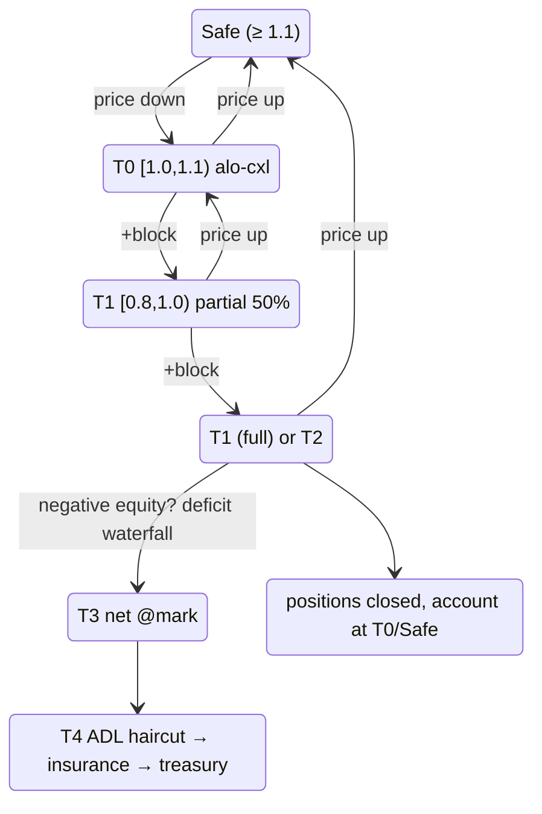

# Tiered liquidation

:::tip
**Stable.**
:::

## TL;DR

A 5-tier ladder driven by `health = account_value / maint_margin`. Each tier defines what the protocol does as health drops. The [yellow card](#why-a-yellow-card) (T0) is MetaFlux's hysteresis grace period — one block of warning before any position is sold. T4 [ADL](./adl.md) is the last-resort loss mutualisation.

| Tier | Health band | Action | Position touched? |
|------|-------------|--------|---|
| (safe) | `health ≥ 1.1` | Idle | — |
| **T0** | `1.0 ≤ health < 1.1` | **Yellow card**: ALO orders force-cancelled, wallet notified | No |
| **T1** | `0.8 ≤ health < 1.0` | Partial [floored-limit close](#how-a-forced-close-executes-the-price-floor) (50%) — full close if T1 fired within `cooldown_ms` | Yes (50%) or Yes (100%) |
| **T2** | `0.667 ≤ health < 0.8` | Full [floored-limit close](#how-a-forced-close-executes-the-price-floor) | Yes (100%) |
| **T3** | `health < 0.667` | [Netting at mark](#t3-backstop--netting-at-mark) against profitable counter-parties (un-fillable T1/T2 remainders escalate here too) | Yes — netted at mark |
| **T4** | negative equity after T3 | [Deficit waterfall](#t4--the-deficit-waterfall): ADL haircut → insurance fund → treasury queue | Winners' realized gains haircut |

`account_value` includes unrealised PnL. `maint_margin` is per-asset baseline (classical) or SPAN-derived (PM-enrolled).

## How tiers are computed

The bands below are the **literal code constants**, not approximations.

`BoleEngine::decide(account, account_value: i128, maintenance_margin: u128, ts_ms)` is a **pure function** — it reads cooldown state but never mutates — returning one `BoleDecision`:

```
if maintenance_margin == 0            → Idle
if account_value < 0                  → Backstop { deficit = maintenance_margin + |account_value| }

health = account_value / maintenance_margin            # Decimal division

if health ≥ 1.1   (yellow_card_threshold)              → Idle            (Safe)
if health ≥ 1.0                                        → YellowCard      (T0)
if health < 0.667 (full_market_floor)                 → Backstop { deficit = maintenance_margin − account_value }   (T3)
if health < 0.8   (partial_threshold)                 → FullMarket { size_to_close = maintenance_margin }           (T2)
# else 0.8 ≤ health < 1.0  (T1):
if partial_cooldown_active(account)                   → FullMarket { size_to_close = maintenance_margin }
else                                                  → PartialMarket50 { size_to_close = maintenance_margin / 2 }
```

| Constant | Value | Symbol |
|----------|-------|--------|
| Yellow-card threshold (T0 top) | `1.1` | `default_yellow_card_threshold` |
| Partial threshold (T1 top) | `0.8` | `default_partial_threshold` |
| Full-market floor (T3 entry) | `0.667` (≈ 2/3) | `full_market_floor` |
| Partial→full cooldown | `30_000 ms` | `DEFAULT_PARTIAL_COOLDOWN_MS` |

- All comparisons are `rust_decimal::Decimal` (no floats). When `account_value` would exceed `Decimal::MAX`, `decide` right-shifts both operands by a common bit-count first — this preserves the health ratio so the chosen tier is unchanged at those magnitudes.
- **Only `PartialMarket50` arms the cooldown** (`record_attempt`); a `FullMarket` or `Backstop` does not block subsequent partials. So the T1 partial→full escalation only fires when a *prior partial* is still inside its 30 s window.
- `size_to_close` for a partial is `maintenance_margin / 2` (integer-truncated). The `deficit` for backstop is `maintenance_margin − account_value` when `account_value ≥ 0`, else `maintenance_margin + |account_value|`.
- The driver evaluates an **incremental dirty set** each block (event-dirtied accounts + a rolling self-heal slice), not a full scan — proven equivalent to a from-scratch scan by fuzz test. T0 accounts get their resting ALO liquidity force-cancelled after classification.

## How a forced close executes (the price floor)

A T1/T2 forced close is **never a market sweep**. It executes as an IOC LIMIT
order bounded off the committed mark:

```
sell (long leg):      limit = mark × (1 − liq_floor)
buy-back (short leg): limit = mark × (1 + liq_floor)
```

- `liq_floor` is a per-market risk parameter; **by default it is half the
  market's maintenance ratio** (a 5% maintenance market floors execution 2.5%
  off mark). The maintenance ratio is calibrated to cover liquidation slippage
  plus fees, so the floor guarantees a forced close can never realize more
  slippage than the buffer was sized for.
- The slice fills only at prices at-or-inside the floor. **Whatever cannot
  fill above the floor is NOT sold into a thin book** — it escalates to the
  T3 backstop queue immediately. This is the anti-cascade bound: a forced
  close cannot depress the mark beyond the floor, so it cannot sweep other
  accounts into liquidation.
- Fills settle through the **same settlement path as a normal fill**: realized
  PnL hits the account, open interest moves, the counterparty's maker side
  settles normally.
- A **liquidation fee** (default 50 bps of the closed notional, per-market
  configurable) is charged from the account's remaining positive equity — it
  never creates a deficit — and is credited to the insurance fund, which is
  exactly the pool that absorbs backstop shortfalls.
- The account's **own resting orders on the opposite side are cancelled, not
  self-filled** (a self-fill would re-open what the close just closed).

Partial (T1) sizing is 50% of the targeted leg on core markets;
builder-deployed markets can configure a health-decayed ramp (close a small
slice just under the maintenance line, larger slices only as health sinks,
capped per market) plus the 30 s cooldown between slices.

## The full state machine



`cooldown_ms` defaults to `30 s`. Within a cooldown window, a re-entry to T1 escalates to full close.

## Why a yellow card

Most public derivatives chains transition straight from "healthy" to "partial close". A volatility spike that knocks health from 1.5 to 0.95 in one tick triggers a forced sale, which depresses the mark, which sweeps more accounts into the same tier. The cascade is the dominant source of liquidation pain in observed events.

T0 is a **one-block hysteresis layer**. You enter the band; the chain freezes your resting open orders (ALO only — see below) and notifies your client, but nothing of yours is sold. You have until the next consensus block to:

- top up margin via `Deposit` (or `UpdateIsolatedMargin` to add to a bucket),
- close part of the position manually,
- or do nothing — in which case T1 fires on the next eval.

At a 100 ms block time the grace window is short but deterministic and large enough for an automated risk process to react.

### Why only ALO orders get cancelled

| Order TIF | Cancelled at T0? | Reason |
|-----------|:----------------:|-------|
| `Alo` | yes | Pure-rest, no fee earned; capital better deployed defending position |
| `Gtc` (active limit) | no | May be your active price discovery; killing it could trade you down further |
| `Ioc` (in-flight) | n/a | Resolves at admit; never rests |
| Trigger (StopLoss / TakeProfit) | no | Often exactly the defense you want firing |

The intent: free locked capital from passive rest, preserve your active risk decisions.

## T1 partial / full transition

T1 starts as a 50% partial close. Cooldown logic:

- **First T1 fire**: 50% close. `cooldown_armed_at = now`.
- **If health back in T0/Safe** before `cooldown_armed_at + cooldown_ms`: cooldown disarms naturally as soon as we leave T1.
- **If health stays in T1** for `cooldown_ms`: next T1 eval escalates to **full** close instead of another partial.
- Cooldown does NOT re-arm on T2 or T3.

```
T = 0       T1 fire #1, 50% close, cooldown armed
T = 5s      mark slips further, still in T1
T = 20s     mark recovers slightly; in T0
T = 31s     cooldown elapsed (would have escalated, but we're not in T1)
            account considered T0/Safe; cooldown reset
```

Versus:

```
T = 0       T1 fire #1, 50% close
T = 5s      still T1
T = 30s     STILL T1 (cooldown elapses while in T1)
T = 30s+    T1 fire #2 → full close
```

The cooldown is *not* a no-op zone — T1 keeps firing partials. Cooldown only governs the partial → full upgrade.

### Worked example

Account: long 1 BTC at entry 100, USDC isolated bucket = 20.

```
mark = 100   account_value = 20 + 0 = 20   maint = 5 (5% of 100)  health = 4.0  → Safe
mark = 90    account_value = 20 - 10 = 10  maint = 4.5            health = 2.2  → Safe
mark = 85    account_value = 20 - 15 = 5   maint = 4.25           health = 1.18 → T0 (alo cancel)
mark = 84.5  account_value = 20 - 15.5     maint = 4.225          health = 1.06 → T0
mark = 84    account_value = 20 - 16 = 4   maint = 4.2            health = 0.95 → T1
                  T1 fire: close 0.5 BTC at mark 84
                  realised PnL: -8 (closed 0.5 BTC, entry 100, exit 84)
                  bucket: 20 - 8 = 12
                  remaining position: 0.5 BTC long entry 100, mark 84
                  account_value = 12 - 8 = 4 (unrealised -8 on 0.5 BTC)
                  maint = 0.5 * 84 * 0.05 = 2.1
                  health = 4 / 2.1 = 1.9 → back to Safe
```

A 50% partial restored health from 0.95 (T1) to 1.9 (Safe). The intent of partial close is to right-size the position so the remaining bucket can carry the smaller exposure.

If the 50% close doesn't restore health (deeper rout), a second T1 fire within cooldown would escalate:

```
mark = 84    T1 fire partial: 0.5 BTC closed, health → 1.9
mark = 82    health = 0.95 again (still in T1, cooldown active)
              T1 escalates to full close: remaining 0.5 BTC closed at 82
              realised PnL: -9
              bucket: 12 - 9 = 3
              position: 0
              account closed cleanly with 3 USDC remaining; insurance untouched
```

## T3 backstop — netting at mark

Below `health = 0.667` (≈2/3 of maintenance) the chain stops trying the book.
The position — and any forced-close lots the book could not absorb inside the
[price floor](#how-a-forced-close-executes-the-price-floor) — is **netted at
the committed MARK** against the most-profitable opposite-side positions on
the same instrument (highest unrealized PnL first, deterministic tiebreak):

```
when account enters T3 (or parked un-fillable lots exist):
   match its position lots against profitable opposite-side holders
   close BOTH sides at MARK              # no book interaction, no price impact
   both sides realise PnL at that mark   # value-neutral: equity unchanged
                                         # by the netting itself
   lots with no profitable counterparty stay parked for the next block
```

Counterparties drafted into the netting keep **every cent of PnL** (realized
at mark) — they only lose the open position. No fee is charged on either side.
A netting without a usable mark price, or without any profitable opposite
side, simply waits — the chain never force-sells into an empty book.

## T4 — the deficit waterfall

If the account is flat everywhere and its equity is **negative**, that bad
debt is socialized in a fixed order (ADL **before** the insurance fund — the
deleveraged winners' realized gains absorb first, which keeps the fund for
genuine tail events):

1. **ADL haircut** — an adaptive severity controller claws back up to the
   gains the netting counterparties **just realized** (never more than they
   received, and never unrealized paper PnL).
2. **Insurance fund** — auto-absorbs the remainder (this is the pool the
   [liquidation fee](#how-a-forced-close-executes-the-price-floor) feeds).
3. **Treasury reserve** — whatever is left queues for a multisig-authorized
   treasury draw (human-in-the-loop, last resort).

The account's negative balance is then zeroed — the debt lives in the
waterfall. See [ADL](./adl.md) for the controller math.

## Two-point margin check

Liquidation eligibility is checked at **two points** during each block:

1. **Begin-block**, after mark prices update — catches accounts that just slid into a lower tier from a price move alone.
2. **Post-action**, after each `Order` / `Cancel` / `Withdraw` from this account — catches accounts that walked themselves into a lower tier (e.g. withdrawing too much collateral).

This prevents "free" intra-block manipulation where a user adds risk between begin-block and the rest of the block.

## Recovery patterns

| Scenario | Strategy |
|----------|----------|
| Headed for T0 | Top up via `UpdateIsolatedMargin` (Isolated) or `Deposit` (Cross). Pre-position trigger orders before stress. |
| Already at T0 | Same. ALO orders are already cancelled; place fresh limits at protective levels. |
| Bouncing in/out of T0 | Tighten internal alerts to `health < 1.2`. Look at what's driving — funding payment? mark band edge? oracle outage? |
| T1 partial just fired | Re-eval. Position is 50% smaller; consider closing the remainder voluntarily before cooldown's full-close escalation. |
| Repeated T1 cooldown traps | The position size is wrong for the bucket. Don't refill the bucket without also resizing. |

## How to stay clear

- Watch `health` via `userState` queries (HL-compat) or [`account_state`](../api/rest/info.md#account_state).
- Set internal alerts at `health < 1.2` — well above T0.
- For automated strategies, register a [risk-watcher bot](../integration/risk-watcher.md) to deposit when health crosses a threshold.
- Watch [`userEvents`](../api/ws/subscriptions.md#userevents) on the WS feed for immediate tier transitions (margin / liquidation events ride this channel).

## Edge cases

<details>
<summary>Show edge cases</summary>

- **Mark price band engaged.** During mark-band activation, liquidation evals still fire — but against the banded mark. The book might be at a worse price than mark allows the protocol to recognise. Practically: an adversarial spike that the band clamps does NOT instantly liquidate you; your health is computed against the clamped mark.
- **Funding payment crosses tier boundary.** A funding payment shrinks `account_value`. If you're at `health = 1.05` and a 0.1% funding charge knocks you to 0.99, T1 fires on the same block. Watch funding cadence relative to your buffer.
- **Two concurrent T1 fires across assets (Cross).** Both partials happen in the same block. Order: alphabetical by asset name (deterministic across validators). Insurance and ADL eligibility apply per asset.
- **T0 enter then exit before next block.** Possible if your client tops up margin in the same block (begin-block T0 → user-action `Deposit` → post-action check passes T0). ALO orders that were cancelled at begin-block stay cancelled; nothing automatically re-creates them.

</details>

## See also

- [Portfolio margin](./portfolio-margin.md) — opt-in cross-asset margin reduces baseline maintenance
- [ADL allocation algorithm](./adl.md) — math behind T4
- [Margin modes](./margin-modes.md) — Cross / Isolated / Strict-Iso scopes the ladder
- [Mark prices](./mark-prices.md) — what drives health
- [`userEvents` WS channel](../api/ws/subscriptions.md#userevents) — tier transitions ride this channel
- [Risk-watcher pattern](../integration/risk-watcher.md) — automated margin top-up

## FAQ

<details>
<summary>Show FAQ</summary>

**Q: Can I manually trigger T1 on someone else?**
A: No. Liquidation is consensus-derived against committed mark + account state. There's no "liquidate" action a user can submit; the protocol fires from its own logic at begin-block / post-action checkpoints.

**Q: What's the lowest health I can ride into a yellow card and come out clean?**
A: T0 fires at `1.0 ≤ health < 1.1`. If you re-enter Safe (`health ≥ 1.1`) before the next eval, ALO orders are NOT re-created (you need to resubmit them) but no further T0 action fires.

**Q: Is there a way to opt out of T1 (force it to skip partial → full)?**
A: No. T1 always tries partial first. Submit a manual close at T0 if you want full unwind on your own terms.

**Q: How is the closing price determined at T1/T2?**
A: An IOC **limit** at the prevailing book, floored at `mark × (1 ∓ liq_floor)` — see [the price floor](#how-a-forced-close-executes-the-price-floor). Realized slippage is bounded by the floor (default: half the maintenance ratio); anything the book cannot absorb inside the floor escalates to the backstop instead of sweeping deeper levels.

</details>
